# ทัวร์ Power BI service
## แผงระบบนำทางด้านซ้าย

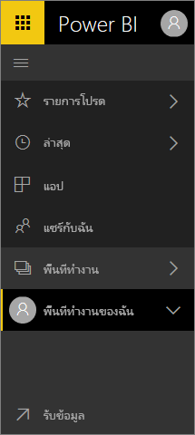

**คู่มืออ้างอิงแบบด่วน**

| การดำเนินการ | เส้นทาง (ปัจจุบัน) ใหม่ |
| --- | --- | --- |
| เพิ่มแดชบอร์ดหรือรายงานเป็นรายการโปรด |พื้นที่ทำงาน > แดชบอร์ดหรือพื้นที่ทำงาน > รายงานและเลือกไอคอนเครื่องหมายดอกจันเพื่อเปลี่ยนเป็นสีเหลือง |
| เพิ่มแอปรายการโปรด | ให้เลือก**แอป**จากแถบนำทางด้านซ้ายและเลือกดาวถัดจากชื่อของแอป
| ดูรายการของรายการโปรดของคุณ |เลือก**รายการโปรด**จาก navpane ด้านซ้าย |
| ดูรายการของแดชบอร์ดและรายงานที่ชมล่าสุด |เลือก**ล่าสุด**จากแถบนำทางด้านซ้าย |
| ดูรายการแดชบอร์ดที่ใช้ร่วมกันกับคุณ |เลือก**แชร์กับฉัน**จากแถบนำทางด้านซ้าย |
| แชร์แดชบอร์ด |เปิดแดชบอร์ดและเลือก**แชร์**หรือสร้างและเผยแพร่แอป |
| ลบแดชบอร์ด |พื้นที่ทำงานของฉัน > แดชบอร์ด > ไอคอนถังขยะ |
| ลบรายงาน |พื้นที่ทำงานของฉัน > รายงาน > ไอคอนถังขยะ |
| ลบชุดข้อมูล |พื้นที่ทำงานของฉัน > ชุดข้อมูล >... > ลบ |
| เปิดแดชบอร์ด |พื้นที่ทำงาน > แดชบอร์ด > แล้วเลือกชื่อของแดชบอร์ด |
| เปิดรายงาน |พื้นที่ทำงาน > รายงาน > แล้วเลือกชื่อของรายงาน |
| เปิดชุดข้อมูล |พื้นที่ทำงาน > ชุดข้อมูล > แล้วเลือกชื่อของชุดข้อมูล |
| สร้างแดชบอร์ด |จากแถบนำทางด้านบนให้เลือกสร้าง > แดชบอร์ด |
| สร้างรายงาน |จากแถบนำทางด้านบนให้เลือกสร้าง > รายงาน |
| สร้างชุดข้อมูล |จากแถบนำทางด้านบนให้เลือกสร้าง > ชุดข้อมูล |
| สร้างแอป |พื้นที่ทำงาน > สร้างพื้นที่ทำงานของแอป |
| ดูรายการทั้งหมดแดชบอร์ด รายงาน และชุดข้อมูลที่คุณเป็นเจ้าของ |พื้นที่ทำงาน > พื้นที่ทำงานของฉัน |

## งานทั่วไป

ดู Amanda การแนะนำระบบการนำทางของ Power BI service  แล้ว ทำตามคำแนะนำทีละขั้นตอนด้านล่างวิดีโอเพื่อสำรวจด้วยตัวคุณเอง

<iframe width="560" height="315" src="https://www.youtube.com/embed/G26dr2PsEpk" frameborder="0" allowfullscreen></iframe>

## ดูเนื้อหา (แดชบอร์ด รายงาน เวิร์กบุ๊ก ชุดข้อมูล พื้นที่ทำงาน แอป)
มาเริ่มต้น ด้วยการดูวิธีการจัดระเบียบเนื้อหาพื้นฐาน (แดชบอร์ด รายงาน ชุดข้อมูล เวิร์กบุ๊ก) ก่อนนี้ เนื้อหาของคุณทั้งหมดถูกแสดงอยู่ในบานหน้าต่างนำทางด้านซ้าย ตอนนี้ คุณยังคงมีตัวเลือกนั้น แต่ค่าเริ่มต้นคือแสดงด้วยชนิดเนื้อหาภายในบริบทของพื้นที่ทำงาน เลือกพื้นที่ทำงานจากบานหน้าต่างนำทางด้านซ้าย (แถบนำทางด้านซ้าย) และแท็บสำหรับเนื้อหาที่เกี่ยวข้อง (แดชบอร์ด รายงาน เวิร์กบุ๊ก ชุดข้อมูล) เติมพื้นที่ทางด้านขวาของ Power BI

ถ้าคุณมี Power BI แบบฟรี คุณจะเห็นเฉพาะหนึ่งพื้นที่ทำงาน **พื้นที่ทำงานของฉัน**

### เริ่มรายการโปรดแดชบอร์ด รายงาน และแอป
**รายการโปรด**ช่วยให้คุณเข้าถึงเนื้อหาที่สำคัญที่สุดสำหรับคุณได้อย่างรวดเร็ว  

1. ด้วยแดชบอร์ดหรือรายงานเปิด เลือก**รายการโปรด**จากมุมบนขวา
   
   
   
   เพิ่ม**รายการโปรด**เมื่อต้องการเปลี่ยนแปลง **ยกเลิกรายการโปรด**และไอคอนเครื่องหมายดอกจันจะกลายเป็นสีเหลือง
   
   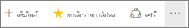

2. สำหรับแอป เลือก**Apps**จาก navpane ซ้าย เลื่อนเคอร์เซอร์หนือแอป แล้วเลือกดาวเพื่อกำหนดให้เป็นรายการโปรด

2. เมื่อต้องการแสดงรายการของเนื้อหาทั้งหมดที่คุณเพิ่มเป็นรายการโปรด ใน navpane ด้านซ้าย ให้เลือกลูกศรทางด้านขวาของ**รายการโปรด** เนื่องจากหน้าต่างนำทางด้านซ้ายจะเป็นฟีเจอร์แบบถาวรของ Power BI service คุณสามารถเข้าถึงรายการนี้จากที่ใดก็ได้ใน Power BI service
   
    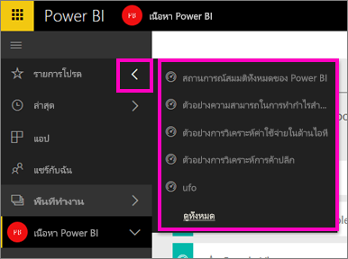
   
    จากที่นี่ คุณสามารถเลือกแดชบอร์ด รายงาน หรือแอปเพื่อเปิด

3. เมื่อต้องเปิดบานหน้าต่าง **รายการโปรด** ใน navpane ซ้ายมือ ให้เลือก**รายการโปรด**หรือเลือกไอคอนรายการโปรด
   
   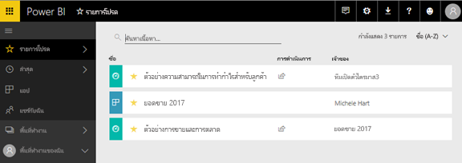
   
   จากที่นี่ คุณสามารถเปิด ค้นหาเนื้อหา ยกเลิกรายการโปรด หรือแชร์เนื้อหากับเพื่อนร่วมงาน

1. อีกวิธีหนึ่งในการทำเครื่องหมายแดชบอร์ดหรือรายงานให้เป็นรายการโปรดจาก**แดชบอร์ด**หรือแท็บพื้นที่ทำงาน**รายงาน**  เพียงแค่เปิดพื้นที่ทำงานเพื่อแสดงมุมมองเนื้อหา แล้วเลือกไอคอนเครื่องหมายดอกจันทางด้านซ้ายของชื่อ
   
   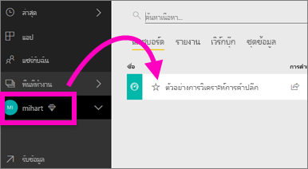

เรียนรู้เพิ่มเติม ให้ดู[รายการโปรด](service-dashboard-favorite.md)

### ล่าสุด
ได้เนื้อหาซึ่งคุณได้เข้าถึงล่าสุดอย่างรวดเร็ว โดยไปที่บานหน้าต่าง**ล่าสุด** ซึ่งรวมถึงเนื้อหาจากพื้นที่ทำงานทั้งหมดของคุณ

  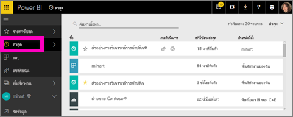

คล้ายกับรายการโปรด คุณสามารถเข้าถึงสิ่งล่าสุดของคุณได้อย่างรวดเร็วจากที่ใดก็ได้ใน Power BI service โดยการเลือกลูกศรที่อยู่ถัดจาก**ล่าสุด**ใน navpane ซ้ายมือ

  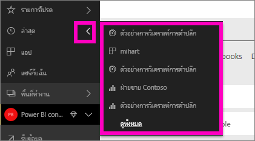

เมื่อต้องการเรียนรู้เพิ่มเติม ให้ดู[ล่าสุดใน Power BI](service-recent.md)

### แอป
แอปคือ คอลเลกชันของแดชบอร์ดและรายงานที่สร้างขึ้นเพื่อนำเสนอคีย์เมตริกทั้งหมดในเดียว คุณสามารถเปิดแอปภายในองค์กรของคุณ และ[แอปสำหรับบริการภายนอก](service-connect-to-services.md)เช่น Google Analytics และ Microsoft Dynamics CRM ได้ 

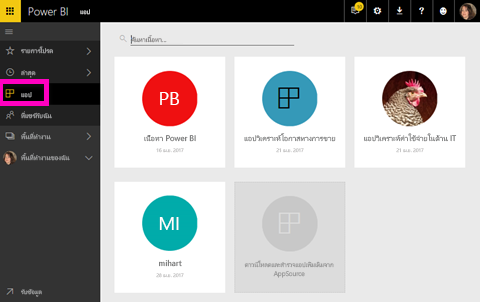

เมื่อต้องการเรียนรู้เพิ่มเติม ให้ดู**แอปถูก** (ด้านล่าง) และ[แอป Power BI คืออะไร](service-install-use-apps.md)

### แชร์กับฉัน
**แชร์กับฉัน**คือตำแหน่งที่ตั้งสำหรับเนื้อหาทั้งหมดที่ผู้ร่วมงานใช้ร่วมกับคุณ  การกรองโดยเจ้าของแดชบอร์ด ใช้ช่องข้อมูลค้นหาเพื่อค้นหาสิ่งที่เกี่ยวข้อง และเรียงลำดับรายการตามวัน  และสำหรับเนื้อหาที่ใช้ร่วมกันที่คุณเยี่ยมชมบ่อย มันง่ายกว่าที่จะเพิ่มรายการโปรดทันทีที่มุมมอง**แชร์กับฉัน**

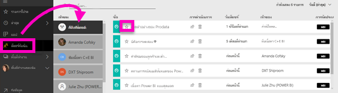

เพื่อเรียนรู้เพิ่มเติม ให้ดู[แชร์กับฉัน](service-shared-with-me.md)

### ทำงานกับพื้นที่ทำงาน
ถัดไป ในบานหน้าต่างนำทางด้านซ้ายคือ*พื้นที่ทำงาน* พื้นที่ทำงานสามารถอาจเรียกว่า*คอนเทนเนอร์*สำหรับเนื้อหา Power BI ได้ มีพื้นที่ทำงานสองชนิด **My Workspace**และพื้นที่ทำงานของแอป

ถ้าคุณไม่ใช่สมาชิกของพื้นที่ทำงานของแอปหรือผู้ดูแลระบบ คุณอาจไม่เห็นพื้นที่ทำงานของแอปทางด้านซ้ายของคุณ และถ้าคุณเป็นลูกค้า Power BI แบบฟรี คุณจะไม่เห็นพื้นที่ทำงานของแอป

#### พื้นที่ทำงานของฉัน
**พื้นที่ทำงานของฉัน** เก็บเนื้อหาทั้งหมดที่คุณเป็นเจ้าของ ให้คิดว่าเป็น sandbox ส่วนบุคคลของคุณหรือพื้นที่ทำงานสำหรับเนื้อหาของคุณเอง คุณสามารถแชร์เนื้อหาจากพื้นที่ทำงานของฉันกับเพื่อนร่วมงาน ภายในพื้นที่ทำงานของฉัน เนื้อหาของคุณถูกจัดเป็น 4 แท็บ แดชบอร์ด รายงาน เวิร์กบุ๊ก และชุดข้อมูล

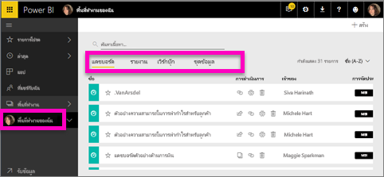

#### พื้นที่ทำงานแอปฯ
แอปและพื้นที่ทำงานแอปจะเป็นฟีเจอร์ Power BI Pro ถ้าคุณเป็นบุคคลที่เขียนแดชบอร์ดและรายงานสำหรับผู้อื่น คุณจะใชพื้นที่ทำงานแอปเพื่อทำสิ่งนี้ พื้นที่ทำงานแอปเป็นสถานที่ที่คุณจะสร้างแอป ดังนั้นเมื่อต้องการสร้างแอป คุณจะต้องสร้างพื้นที่ทำงานแอป พวกเขากำลังพัฒนาของจัดเตรียมพื้นที่ของพื้นที่ทำงานกลุ่มและคอนเทนเนอร์สำหรับเนื้อหาในแอป  คุณและเพื่อนร่วมงานของคุณสามารถทำงานร่วมกันบนแดชบอร์ด รายงาน และเนื้อหาอื่น ๆ ที่คุณวางแผะกระจายให้กับผู้ชมกว้าง หรือแม้แต่องค์กรของคุณ

เมื่อต้องการเรียนรู้เพิ่มเติม ให้เยี่ยมชม[สร้างและกระจายแอปใน Power BI](service-create-distribute-apps.md#app-workspaces)

เช่นเดียวกับ**My Workspace**เนื้อหาของคุณถูกจัดเป็น 4 แท็บ แดชบอร์ด รายงาน เวิร์กบุ๊ก และชุดข้อมูล

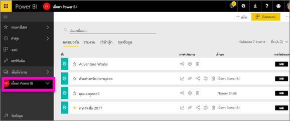

สลับพื้นที่ทำงาน โดยการเลือก**พื้นที่ทำงาน**ในแถบนำทางด้านซ้าย

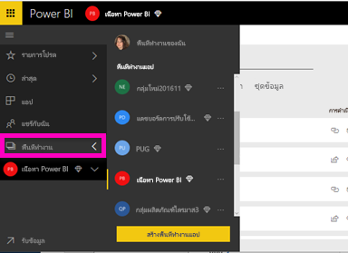

### ค้นหาและเรียงลำดับเนื้อหา
มุมมองเนื้อหาทำให้ง่ายต่อการค้นหา กรอง และเรียงลำดับเนื้อหาของคุณ เมื่อต้องการค้นหาแดชบอร์ด รายงาน หรือเวิร์กบุ๊ก ให้พิมพ์ในพื้นที่การค้นหา Power BI กรองเฉพาะเนื้อหาที่มีสตริงการค้นหาของคุณเป็นส่วนหนึ่งของชื่อ

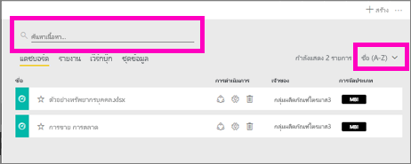

นอกจากนี้คุณยังสามารถเรียงลำดับเนื้อหาตามชื่อหรือเจ้าของ  

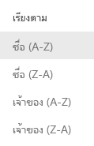

เมื่อต้องการเรียนรู้เพิ่มเติม ให้ดู[การนำทางใน Power BI การค้นหา เรียงลำดับ กรอง](service-navigation-search-filter-sort.md)

## ขั้นตอนถัดไป
Power BI service[แนวคิดพื้นฐาน](service-basic-concepts.md)    

มีคำถามหรือคำติชมหรือไม่ [เยี่ยมชมฟอรั่มชุมชน Power BI](http://community.powerbi.com/t5/Navigation-Preview-Forum/bd-p/NavigationPreview)

