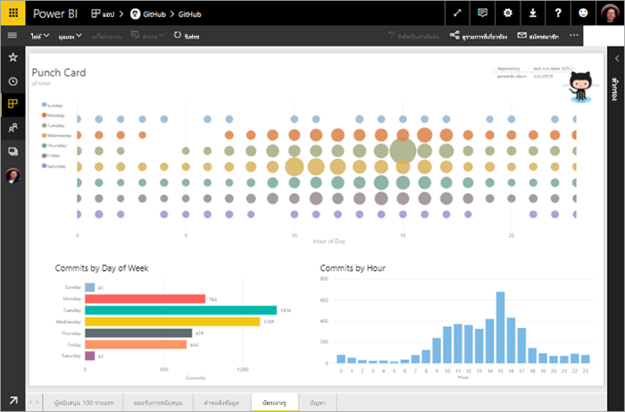
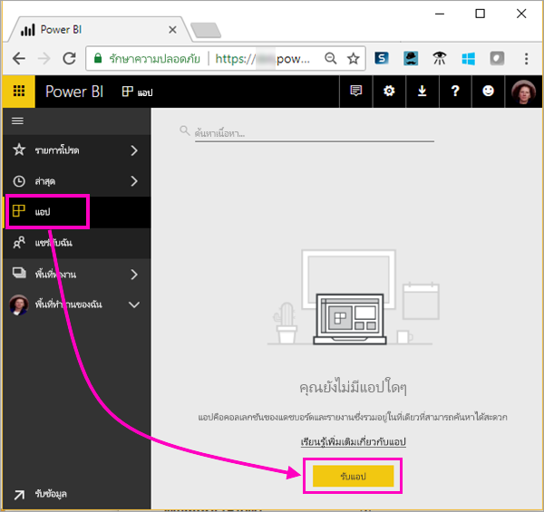
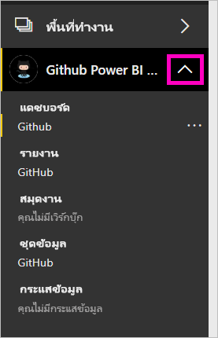
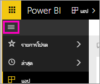
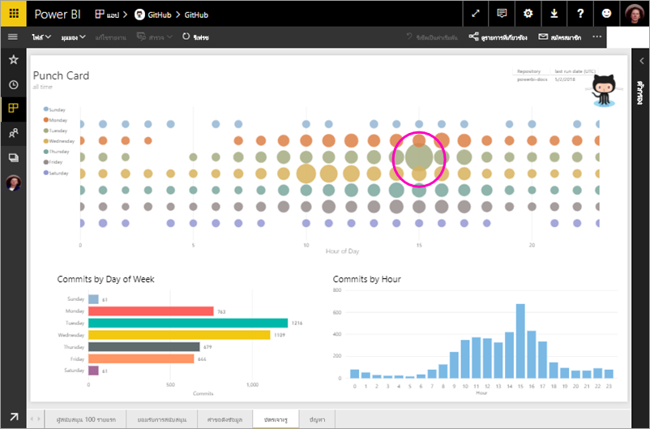

# บทช่วยสอน: เชื่อมต่อกับพื้นที่เก็บของ GitHub ด้วย Power BI
ในบทช่วยสอนนี้ คุณจะเชื่อมต่อกับข้อมูลจริงในบริการ GitHub ด้วย Power BI และ Power BI จะสร้างแดชบอร์ดและรายงานโดยอัตโนมัติ คุณเชื่อมต่อกับพื้นที่เก็บสาธารณะสำหรับเนื้อหาของ Power BI (หรือที่เรียกว่า *repo*) และดูคำตอบของคำถามเช่น: มีบุคคลกี่คนให้การสนับสนุนเนื้อหาสาธารณะของ Power BI ใครให้การสนับสนุนมากที่สุด วันใดในสัปดาห์ที่มีการสนับสนุนมากที่สุด และคำถามอื่นๆ 

ในบทช่วยสอนนี้ คุณจะทำขั้นตอนต่อไปนี้ให้เสร็จสมบูรณ์:

> [!div class="checklist"]
> * ลงทะเบียนบัญชี GitHub ถ้าคุณยังไม่มีบัญชี 
> * ลงชื่อเข้าใช้บัญชี Power BI ของคุณ หรือลงทะเบียน ถ้าคุณยังไม่มีบัญชี
> * เปิดบริการ Power BI
> * ค้นหาแอป GitHub
> * ใส่ข้อมูลสำหรับ Repo GitHub สาธารณะของ Power BI
> * ดูแดชบอร์ดและรายงานด้วยข้อมูล GitHub
> * เพิ่มพื้นที่ทรัพยากรโดยการลบแอป

ถ้าคุณไม่ได้ลงทะเบียน Power BI ให้[ลงทะเบียนรุ่นทดลองใช้ฟรี](https://app.powerbi.com/signupredirect?pbi_source=web)ก่อนที่คุณจะเริ่มต้นใช้งาน

## ข้อกำหนดเบื้องต้น

เมื่อต้องการเรียนรู้บทช่วยสอนนี้ให้เสร็จสมบูรณ์ คุณต้องมีบัญชี GitHub ถ้าคุณยังไม่มีบัญชี 

- ลงทะเบียน [บัญชี GitHub](https://docs.microsoft.com/contribute/get-started-setup-github)

## วิธีการเชื่อมต่อ
1. ลงชื่อเข้าใช้บริการ Power BI (https://app.powerbi.com) 
2. ในบานหน้าต่างนำทางด้านซ้าย ให้เลือก **แอป** แล้วเลือก **รับแอป**
   
    

3. เลือก **แอป** พิมพ์ **GitHub** ในกล่องค้นหา > **รับทันที**
   
    

4. ใน **ติดตั้งแอป Power BI นี้หรือไม่** เลือก **ติดตั้ง**
5. ในส่วน **แอปใหม่ของคุณพร้อมแล้ว** เลือก **ไปที่แอป**
6. ในส่วน **เริ่มต้นใช้งานแอปใหม่ของคุณ** ให้เลือก **เชื่อมต่อ**

    

7. ป้อนชื่อที่เก็บและเจ้าของที่เก็บ Repo URL สำหรับ Repo นี้คือ https://github.com/MicrosoftDocs/powerbi-docs ดังนั้น **เจ้าของที่เก็บ**จะเป็น **MicrosoftDocs** และ**ที่เก็บ**จะเป็น **powerbi-docs** 
   
    

5. ป้อนข้อมูลประจำตัว GitHub ที่คุณสร้างขึ้น Power BI อาจข้ามขั้นตอนนี้ ถ้าคุรลงชื่อเข้าใช้ GitHub ในเบราว์เซอร์ของคุณ 

6. สำหรับ**วิธีการรับรองความถูกต้อง** ให้เลือก **oAuth2** \> **ลงชื่อเข้าใช้**

7. ทำตามหน้าจอการรับรองความถูกต้องของ GitHub มอบสิทธิ์ Power BI ให้กับข้อมูล GitHub
   
   ในตอนนี้ Power BI สามารถเชื่อมต่อกับ GitHub และเชื่อมต่อกับข้อมูล  ข้อมูลจะถูกรีเฟรชวันละหนึ่งครั้ง

8. หลังจากที่ Power BI นำเข้าข้อมูลแล้ว คุณจะเห็นเนื้อหาของพื้นที่ทำงาน GitHub ใหม่ของคุณ 
9. เลือกลูกศรที่อยู่ถัดจากชื่อพื้นที่ทำงานในแถบนำทางด้านซ้าย คุณเห็นพื้นที่ทำงานประกอบด้วยแดชบอร์ดและรายงาน 

    

10. เลือก**ตัวเลือกเพิ่มเติม** (...) ที่อยู่ถัดจากชื่อแดชบอร์ด > **เปลี่ยนชื่อ** > พิมพ์ **แดชบอร์ด GitHub**
 
     

8. เลือกไอคอนนำทางส่วนกลางเพื่อลดการนำทางด้านซ้าย เพื่อให้มีพื้นที่ว่างเพิ่มเติม

    

10. เลือกแดชบอร์ด GitHub
    
    แดชบอร์ด GitHub ประกอบด้วยข้อมูลสด ดังนั้นค่าที่คุณเห็นอาจแตกต่างกัน

    

    

## ถามคำถาม

1. วางเคอร์เซอร์ของคุณใน **ถามคำถามเกี่ยวกับข้อมูลของคุณ** Power BI มี **คำถามเพื่อให้คุณเริ่มต้นใช้งาน** 

1. เลือก **จำนวนผู้ใช้ที่มีอยู่**
 
    

13. ในระหว่าง **จำนวน** และ **ผู้ใช้ที่มีอยู่** ให้พิมพ์ **คำขอดึงข้อมูลต่อ** 

     Power BI จะสร้างแผนภูมิแท่งที่แสดงจำนวนคำขอดึงข้อมูลต่อบุคคล

    

13. เลือกปักหมุดเพื่อปักหมุดไปยังแดชบอร์ดของคุณจากนั้น **ออกจาก Q&A**

## ดูรายงาน GitHub 

1. ในแดชบอร์ด GitHub ให้เลือกแผนภูมิคอลัมน์ **ดึงข้อมูลคำขอตามเดือน** เพื่อเปิดรายงานที่เกี่ยวข้อง

    

2. เลือกชื่อผู้ใช้ในแผนภูมิ**คำขอดึงข้อมูลทั้งหมดตามผู้ใช้** ในตัวอย่างนี้ เราเห็นว่าเวลาส่วนใหญ่ของพวกเขาอยู่ในเดือนกุมภาพันธ์

    

3. เลือกแท็บ **บัตรเจาะรู** เพื่อดูหน้าถัดไปในรายงาน 
 
    

    คุณจะเห็นว่าวันอังคารเวลาบ่าย 3 คือเวลาและวันในสัปดาห์ที่มีการ *ยอมรับ* มากที่สุด เมื่อผู้ใช้เช็คอินงานของพวกเขา

## เพิ่มพื้นที่ทรัพยากร

ในตอนนี้ คุณสำเร็จบทช่วยสอนแล้ว คุณสามารถลบแอป GitHub ได้ 

1. ในแถบนำทางด้านซ้าย ให้เลือก **แอป**
2. วางเมาส์เหนือไทล์ GitHub และเลือกถังขยะ **ลบ**

    

## ขั้นตอนถัดไป

ในบทช่วยสอนนี้ คุณได้เชื่อมต่อกับ Repo สาธารณะของ GitHub และข้อมูลที่ได้รับ ซึ่ง Power BI ได้จัดรูปแบบในแดชบอร์ดและรายงาน คุณได้ตอบคำถามบางอย่างเกี่ยวกับข้อมูลโดยการสำรวจแดชบอร์ดและรายงาน ในตอนนี้ คุณสามารถเรียนรู้เพิ่มเติมเกี่ยวกับการเชื่อมต่อกับบริการอื่นๆ เช่น Salesforce, Microsoft Dynamics และ Google Analytics 
 
> [!div class="nextstepaction"]
> [เชื่อมต่อกับบริการออนไลน์ที่คุณใช้](service-connect-to-services.md)

