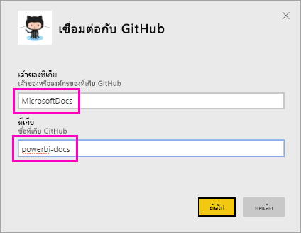
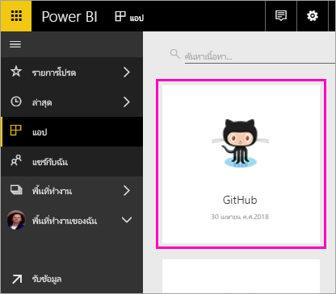
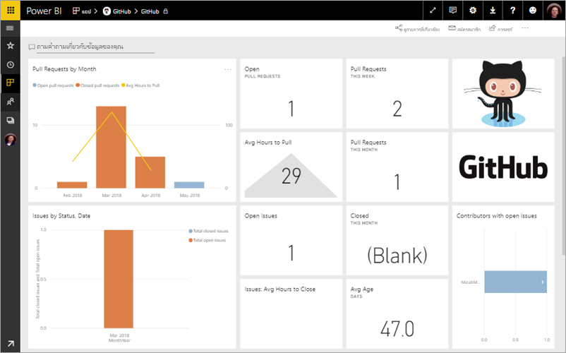
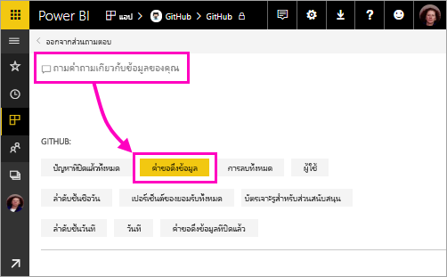
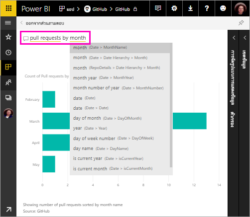
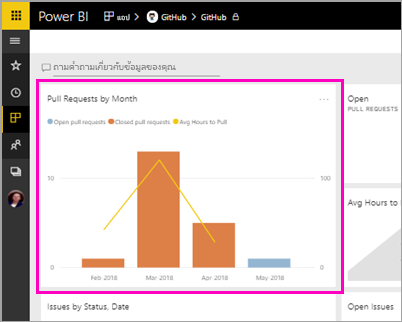
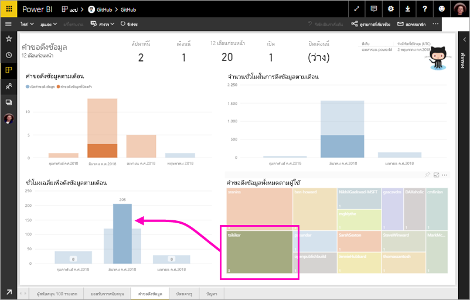

# บทช่วยสอน: เชื่อมต่อกับแอป GitHub ด้วย Power BI
ในบทช่วยสอนนี้ คุณจะเชื่อมต่อกับข้อมูลจริงในบริการ GitHub ด้วย Power BI และ Power BI จะสร้างแดชบอร์ดและรายงานโดยอัตโนมัติ คุณจะเชื่อมต่อกับที่เก็บเนื้อหาสาธารณะของ Power BI (หรือที่เรียกว่า *ที่เก็บ*) และดูข้อมูล: มีบุคคลกี่คนให้การสนับสนุนเนื้อหาสาธารณะของ Power BI ใครให้การสนับสนุนมากที่สุด วันใดในสัปดาห์ที่มีการสนับสนุนมากที่สุด และตอบคำถามอื่นๆ 

ในบทช่วยสอนนี้ คุณจะทำขั้นตอนต่อไปนี้ให้เสร็จสมบูรณ์:

> [!div class="checklist"]
> * ลงทะเบียนบัญชี GitHub ถ้าคุณยังไม่มีบัญชี 
> * ลงชื่อเข้าใช้บัญชี Power BI ของคุณ หรือลงทะเบียน ถ้าคุณยังไม่มีบัญชี
> * เปิดบริการ Power BI
> * ค้นหาแอป GitHub
> * ใส่ข้อมูลสำหรับ Repo GitHub สาธารณะของ Power BI
> * ดูแดชบอร์ดและรายงานที่มีข้อมูล GitHub
> * เพิ่มพื้นที่ทรัพยากรโดยการลบแอป

ถ้าคุณไม่ได้ลงทะเบียน Power BI ให้[ลงทะเบียนรุ่นทดลองใช้ฟรี](https://app.powerbi.com/signupredirect?pbi_source=web)ก่อนที่คุณจะเริ่มต้นใช้งาน

## ข้อกำหนดเบื้องต้น

เมื่อต้องการเรียนรู้บทช่วยสอนนี้ให้เสร็จสมบูรณ์ คุณต้องมีบัญชี GitHub ถ้าคุณยังไม่มีบัญชี 

- ลงทะเบียน[บัญชี GitHub](https://docs.microsoft.com/contribute/get-started-setup-github)

## วิธีการเชื่อมต่อ
1. ลงชื่อเข้าใช้บริการ Power BI (http://powerbi.com) 
2. ในบานหน้าต่างนำทางด้านซ้าย ให้เลือก **แอป** แล้วเลือก **รับแอป**
   
    

3. เลือก **แอป** พิมพ์ **github** ในกล่องค้นหา > **รับทันที**
   
    

4. ป้อนชื่อที่เก็บและเจ้าของที่เก็บ Repo URL สำหรับ Repo นี้คือ https://github.com/MicrosoftDocs/powerbi-docs ดังนั้น **เจ้าของที่เก็บ**จะเป็น **MicrosoftDocs** และ**ที่เก็บ**จะเป็น **powerbi-docs** 
   
    

5. ป้อนข้อมูลประจำตัว GitHub ที่คุณสร้างขึ้น Power BI อาจข้ามขั้นตอนนี้ ถ้าคุรลงชื่อเข้าใช้ GitHub ในเบราว์เซอร์ของคุณ 

6. สำหรับ **วิธีการรับรองความถูกต้อง** ให้เลือก **oAuth2** \> **ลงชื่อเข้าใช้**

7. ทำตามหน้าจอการรับรองความถูกต้องของ GitHub มอบสิทธิ์ Power BI ให้กับข้อมูล GitHub
   
   ในตอนนี้ Power BI สามารถเชื่อมต่อกับ GitHub และเชื่อมต่อกับข้อมูล  ข้อมูลจะถูกรีเฟรชวันละหนึ่งครั้ง

8. หลังจาก Power BI นำขเ้าข้อมูล คุณจะเห็นไทล์ GitHub ใหม่ 
 
    

8. เลือกไอคอนการนำทางส่วนกลางเพื่อย่อการนำทางด้านซ้าย เพื่อให้คุณมีพื้นที่มากขึ้น

    

10. เลือกไทล์ GitHub จากขั้นตอนที่ 8 
    
    แดชบอร์ด GitHub จะเปิดขึ้น ข้อมูลนี้อาจเปลี่ยนแปลงได้ ดังนั้น ค่าที่คุณเห็นอาจแตกต่างกัน

    

    

## ถามคำถาม

11. วางเคอร์เซอร์ของคุณใน **ถามคำถามเกี่ยวกับข้อมูลของคุณ** แล้วเลือก **คำขอดึงข้อมูล** 

    

12. พิมพ์ **ตามเดือน**
 
    

     Power BI จะสร้างแผนภูมิแท่งที่แสดงจำนวนคำขอดึงข้อมูลต่อเดือน

13. เลือก **ออกจากส่วนถามตอบ**

## ดูรายงาน GitHub 

1. ในแดชบอร์ด GitHub ให้เลือกแผนภูมิผสมคอลัมน์และเส้น **คำขอดึงข้อมูลตามเดือน** เพื่อเปิดรายงานที่เกี่ยวข้อง

    

2. เลือกชื่อผู้ใช้ในแผนภูมิ **คำขอดึงข้อมูลทั้งหมดตามผู้ใช้** และในตัวอย่างนี้ คุณจะเห็นว่ามีชั่วโมงโดยเฉลี่ยมากกว่าค่าเฉลี่ยทั้งหมดสำหรับเดือนมีนาคม

    

3. เลือกแท็บ **บัตรเจาะรู** เพื่อดูหน้าถัดไปในรายงาน 
 
    

    คุณจะเห็นว่าวันอังคารเวลาบ่าย 3 คือเวลาและวันในสัปดาห์ที่มีการ *ยอมรับ* มากที่สุด เมื่อผู้ใช้เช็คอินงานของพวกเขา

## เพิ่มพื้นที่ทรัพยากร

ในตอนนี้ คุณสำเร็จบทช่วยสอนแล้ว คุณสามารถลบแอป GitHub ได้ 

1. ในแถบนำทางด้านซ้าย ให้เลือก **แอป**
2. วางเมาส์เหนือไทล์ GitHub และเลือกถังขยะ **ลบ**

    

## ขั้นตอนถัดไป

ในบทช่วยสอนนี้ คุณได้เชื่อมต่อกับ Repo สาธารณะของ GitHub และข้อมูลที่ได้รับ ซึ่ง Power BI ได้จัดรูปแบบในแดชบอร์ดและรายงาน คุณได้ตอบคำถามบางอย่างเกี่ยวกับข้อมูลโดยการสำรวจแดชบอร์ดและรายงาน ในตอนนี้ คุณสามารถเรียนรู้เพิ่มเติมเกี่ยวกับการเชื่อมต่อกับบริการอื่นๆ เช่น Salesforce, Microsoft Dynamics และ Google Analytics 
 
> [!div class="nextstepaction"]
> [เชื่อมต่อกับบริการออนไลน์ที่คุณใช้](./service-connect-to-services.md)

