# บทช่วยสอน: เรียกใช้แบบจำลอง Machine Learning Studio (คลาสสิก) ใน Power BI (ตัวอย่าง)

ในบทช่วยสอนนี้ เราแนะนำผ่านประสบการณ์การรวมข้อมูลเชิงลึกจากแบบจำลอง **Azure Machine Learning Studio(คลาสสิก)** ลงใน Power BI บทช่วยสอนนี้มีคำแนะนำสำหรับการให้สิทธิ์เข้าถึงแก่ผู้ใช้ Power BI ไปยังแบบจำลอง Azure ML การสร้างกระแสข้อมูล และการใช้ข้อมูลเชิงลึกจากแบบจำลอง Azure ML ไปยังกระแสข้อมูลของคุณ นอกจากนี้ยังอ้างอิงถึงคู่มือเริ่มต้นด่วนสำหรับการสร้างแบบจำลอง Azure ML กรณีที่คุณไม่มีแบบจำลองอีกด้วย

บทช่วยสอนจะแนะนำคุณผ่านขั้นตอนดังต่อไปนี้:

> [!div class="checklist"]
> * สร้างและเผยแพร่แบบจำลอง Azure Machine Learning
> * ให้สิทธิ์เข้าถึงแก่ผู้ใช้ Power BI เพื่อใช้แบบจำลอง
> * สร้างกระแสข้อมูล
> * ใช้ข้อมูลเชิงลึกจากแบบจำลอง Azure ML ไปยังกระแสข้อมูล

## สร้างและเผยแพร่แบบจำลอง Azure ML

ทำตามคำแนะนำได้ที่ [คำแนะนำขั้นตอนที่ 1: สร้างพื้นที่ทำงาน Machine Learning Studio (คลาสสิก)](https://docs.microsoft.com/azure/machine-learning/studio/walkthrough-1-create-ml-workspace) เพื่อสร้างพื้นที่ทำงาน **Machine Learning**

คุณสามารถใช้ขั้นตอนเหล่านี้กับแบบจำลอง Azure ML  หรือชุดข้อมูลใดๆ ที่คุณมีอยู่แล้ว หากคุณไม่มีแบบจำลองที่เผยแพร่ คุณสามารถสร้างแบบจำลองได้ในไม่กี่นาที โดยอ้างอิง [สร้างการทดลองทางวิทยาศาสตร์ข้อมูลแรกของคุณใน Azure Machine Learning Studio (คลาสสิก)](https://docs.microsoft.com/azure/machine-learning/studio/create-experiment) ซึ่งตั้งค่าแบบจำลอง Azure ML สำหรับการคาดคะเนราคายนต์

ทำตามขั้นตอนได้ที่ [ปรับใช้บริการบนเว็บ Azure Machine Learning Studio (คลาสสิก)](https://docs.microsoft.com/azure/machine-learning/studio/tutorial-part3-credit-risk-deploy) เพื่อเผยแพร่แบบจำลอง Azure ML เป็นบริการบนเว็บ

## ให้สิทธิ์การเข้าถึงแก่ผู้ใช้ Power BI

เมื่อต้องการเข้าถึงแบบจำลอง Azure ML จาก Power BI คุณต้องมีการสมัครใช้งาน Azure ที่มีการเข้าถึงแบบ **อ่าน** และกลุ่มทรัพยากร รวมถึงการเข้าถึงแบบ **อ่าน** ไปยังบริการบนเว็บ Azure Machine Learning Studio (คลาสสิก) สำหรับแบบจำลอง Machine Learning Studio (คลาสสิก)  สำหรับแบบจำลอง Azure Machine Learning คุณจำเป็นต้องมีการเข้าถึงแบบ **อ่าน** สำหรับพื้นที่ทำงานบริการ Machine Learning

ขั้นตอนต่อไปนี้จะสมมุติว่าคุณเป็นผู้ดูแลร่วมของการสมัครใช้งาน Azure และกลุ่มทรัพยากรที่เผยแพร่แบบจำลอง

ลงชื่อเข้าใช้ [พอร์ทัล Azure](https://portal.azure.com) และนำทางไปยังหน้า **การสมัครใช้งาน** ที่สามารถพบได้โดยใช้รายการ **บริการทั้งหมด** ในบานหน้าต่างเมนูนำทาง

เลือกการสมัครใช้งาน Azure ที่คุณใช้สำหรับการเผยแพร่แบบจำลอง และเลือก **ควบคุมการเข้าถึง (IAM)** จากนั้นเลือก **เพิ่มการกำหนดบทบาท** แล้วเลือบทบาทกการ **อ่าน** จากนั้นเลือกผู้ใช้ Power BI เลือก **บันทึก** เมื่อเสร็จสิ้น รูปภาพต่อไปนี้จะแสดงการเลือก

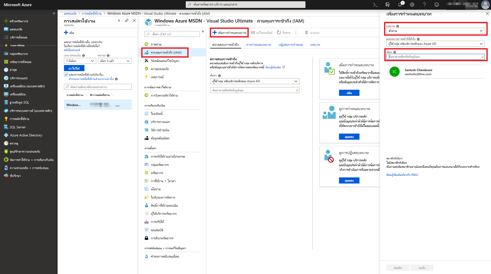

จากนั้นทำซ้ำขั้นตอนข้างต้นเพื่อให้สิทธิ์การใช้งานบทบาท **ผู้สนับสนุน** แก่ผู้ใช้ Power BI สำหรับบริการบนเว็บ  Machine Learning เฉพาะที่ปรับใช้แบบจำลอง Azure ML

## สร้างกระแสข้อมูล

### รับข้อมูลสำหรับการสร้างกระแสข้อมูล

ลงชื่อเข้าใช้บริการของ Power BI ด้วยข้อมูลประจำตัวผู้ใช้ที่คุณให้สิทธิ์การเข้าถึงแบบจำลอง Azure ML ในขั้นตอนก่อนหน้านี้

ขั้นตอนนี้จะสมมุติว่าคุณมีข้อมูลที่ต้องการให้คะแนนด้วยแบบจำลอง Azure ML ของคุณในรูปแบบ CSV  หากคุณใช้ **การทดลองการกำหนดราคารถยนต์** เพื่อสร้างแบบจำลองใน Machine Learning Studio (คลาสสิค) ชุดข้อมูลจะได้รับการแชร์ในลิงก์ดังต่อไปนี้:

* [แบบจำลองตัวอย่าง Azure Learning Studio (คลาสสิค)](https://github.com/santoshc1/PowerBI-AI-samples/blob/master/Tutorial_MLStudio_model_integration/Automobile%20price%20data%20_Raw_.csv)

### สร้างกระแสข้อมูล

หากต้องสร้างเอนทิตีในกระแสข้อมูลของคุณ ให้ลงชื่อเข้าใช้บริการของ Power BI และนำทางไปยังพื้นที่ทำงานบนความจุเฉพาะของคุณที่มีตัวอย่าง AI เปิดการใช้งานอยู่

หากคุณยังไม่มีพื้นที่ทำงาน คุณสามารถสร้างได้โดยเลือก **พื้นที่ทำงาน** ในเมนูด้านซ้าย แล้วเลือก **สร้างพื้นที่ทำงาน** ในบานหน้าต่างด้านล่าง  ซึ่งจะเปิดแผงเพื่อป้อนรายละเอียดพื้นที่ทำงาน ป้อนชื่อพื้นที่ทำงาน และเลือก **บันทึก**

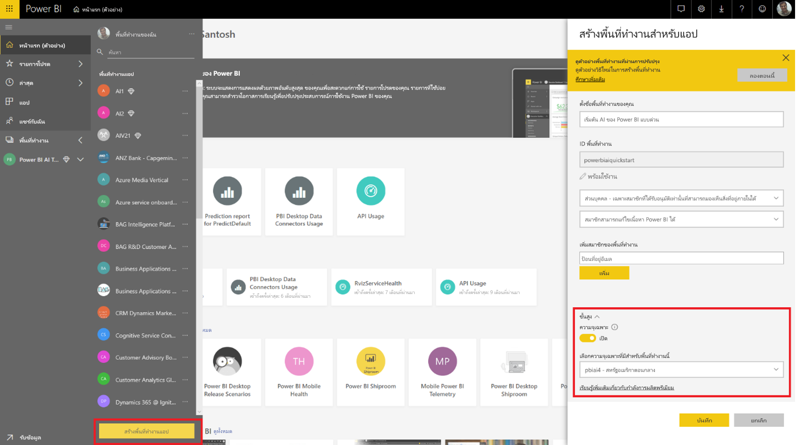

หลังจากสร้างพื้นที่ทำงานแล้ว คุณสามารถเลือก **ข้าม** ที่ด้านขวาล่างของหน้าจอต้อนรับได้

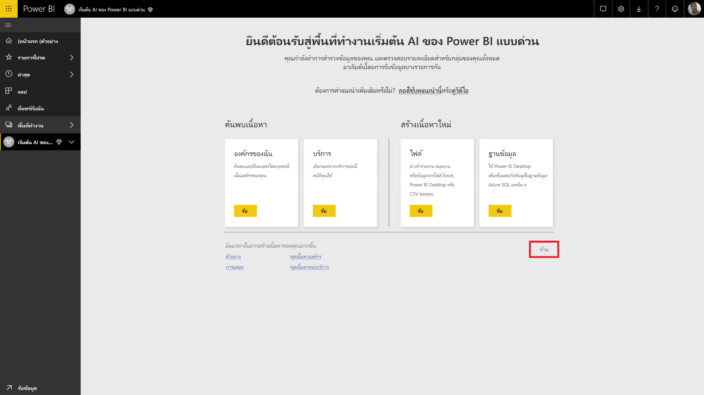

เลือกแท็บ **กระแสข้อมูล (ตัวอย่าง)** จากนั้นเลือกปุ่ม **สร้าง** ที่ด้านขวาบนของพื้นที่ทำงาน และเลือก**กระแสข้อมูล**

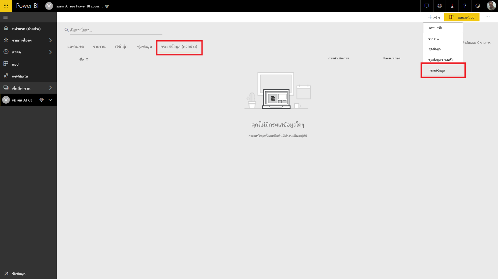

เลือก **เพิ่มเอนทิตีใหม่** ซึ่งจะเปิดใช้ **ตัวแก้ไข Power Query** ในเบราว์เซอร์

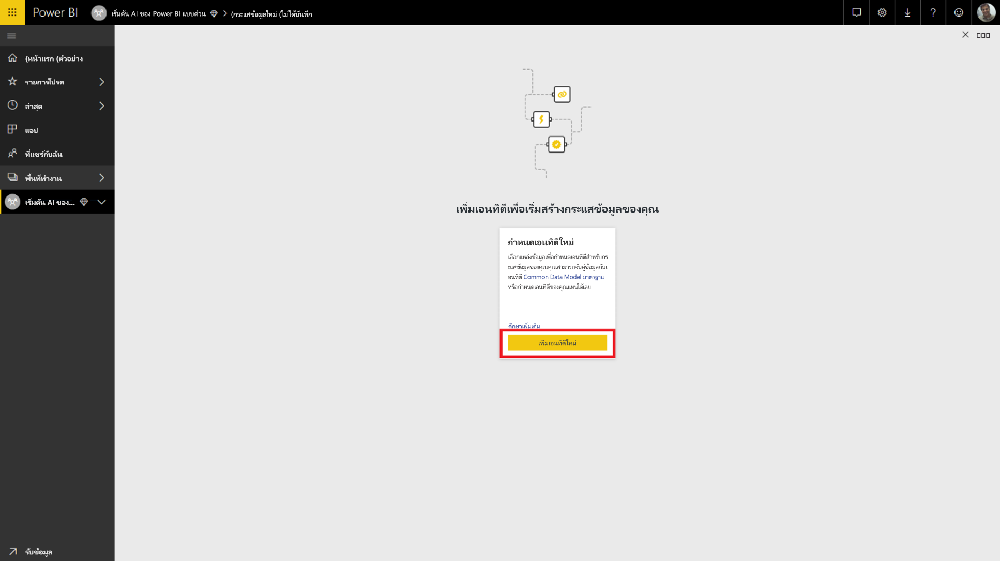

เลือก **ไฟล์ข้อความ/CSV** เป็นแหล่งข้อมูล

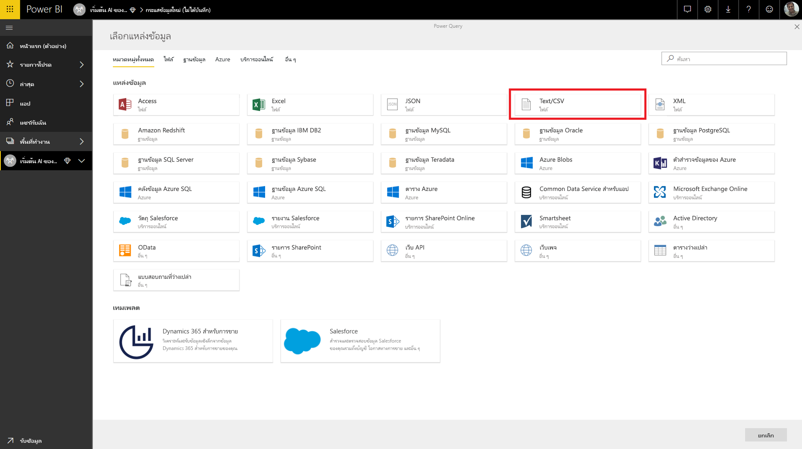

ในหน้าจอถัดไป คุณจะได้รับพร้อมท์ให้เชื่อมต่อกับแหล่งข้อมูล วางลิงก์ลงในข้อมูลที่คุณใช้เพื่อสร้างแบบจำลอง Azure ML ของคุณ หากคุณใช้ข้อมูล _การกำหนดราคารถยนต์_ คุณสามารถวางลิงก์ต่อไปนี้ลงในกล่อง **เส้นทางของไฟล์หรือ URL** จากนั้นเลือก **ถัดไป**

`https://raw.githubusercontent.com/MicrosoftLearning/Principles-of-Machine-Learning-Python/master/Module7/Automobile%20price%20data%20_Raw_.csv`

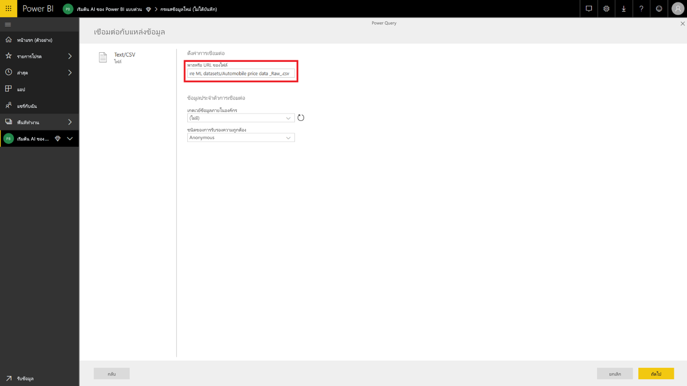

ตัวแก้ไข Power Query จะแสดงตัวอย่างของข้อมูลจากไฟล์ CSV เลือก **แปลงข้อมูลตาราง** จาก Ribbon คำสั่ง จากนั้นเลือก **ใช้แถวแรกเป็นส่วนหัว**  ซึ่งจะเพิ่มขั้นตอนคิวรี _ส่วนหัวที่เลื่อนระดับ_ ลงในบานหน้าต่าง **ใช้ขั้นตอน** ทางด้านขวา นอกจากนี้คุณยังสามารถเปลี่ยนชื่อคิวรีให้เป็นชื่อที่เข้าใจง่าย เช่น _การกำหนดราคารถยนต์_ โดยใช้บานหน้าต่างทางด้านขวาได้

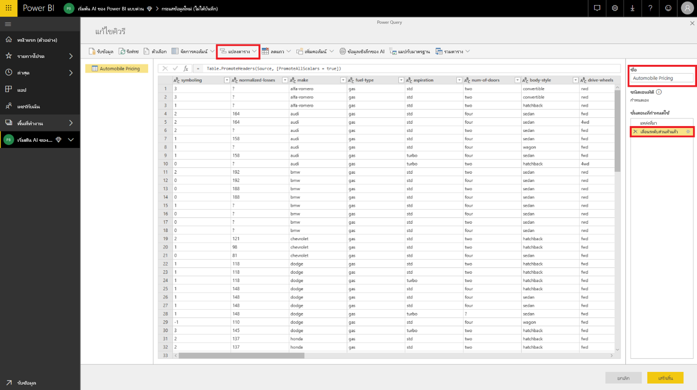

ชุดข้อมูลแหล่งของเราตั้งค่าที่ไม่รู้จักเป็น '?'  หากต้องการแก้ไข เราสามารถแทนที่ '?' ด้วย '0' เพื่อหลีกเลี่ยงข้อผิดพลาดภายหลังเพื่อความสะดวกได้  คุณสามารถทำได้โดยเลือกคอลัมน์ *ค่าสินไหมทดแทนมาตรฐาน* *กระบอกสูบ* *ระยะชัก* *อัตราส่วนการอัด* *แรงม้า* *รอบต่อนาทีสูงสุด* และ *ราคา* โดยคลิกที่ชื่อในส่วนหัวของคอลัมน์ จากนั้นคลิกที่ 'แปลงข้อมูลคอลัมน์' แล้วเลือก 'แทนค่า'  แทนที่ '?' ด้วย '0'

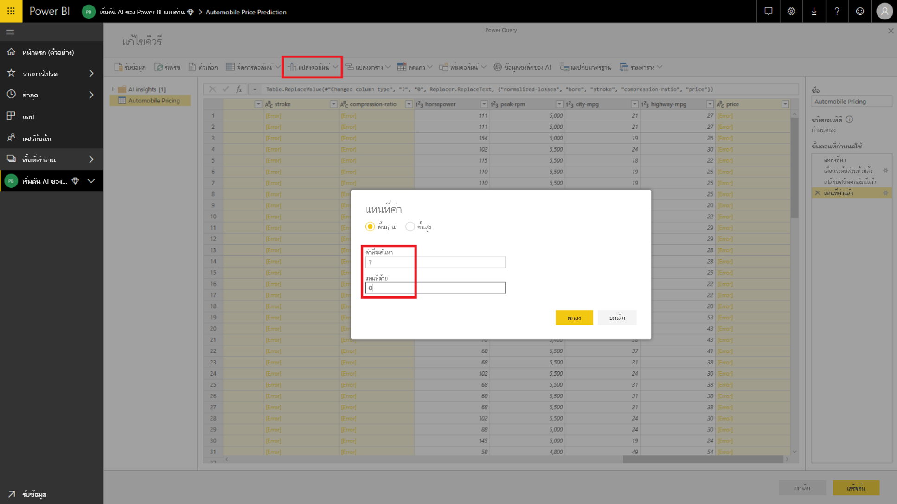

คอลัมน์ทั้งหมดในตารางจากแหล่งข้อความ/CSV จะได้รับการดำเนินการเป็นคอลัมน์ข้อความ  จากนั้น เราต้องเปลี่ยนคอลัมน์ชนิดตัวเลขเป็นชนิดที่ถูกต้องของแต่ละข้อมูล  คุณสามารถทำได้ใน Power Query โดยคลิกที่สัญลักษณ์ชนิดข้อมูลในส่วนหัวของคอลัมน์  เปลี่ยนคอลัมน์เป็นชนิดด้านล่าง:

- **จำนวนเต็ม**: การให้สัญลักษณ์ค่าความเสี่ยง ค่าสินไหมทดแทนมาตรฐาน น้ำหนักรถเปล่า ขนาดเครื่องยนต์ แรงม้า รอบต่อนาทีสูงสุด ไมล์ต่อแกลลอนในเมือง ไมล์ต่อแกลลอนทางไกล ราคา
- **เลขทศนิยม**: ช่วงล้อ ความยาว ความกว้าง ความสูง กระบอกสูบ ระยะชัก อัตราส่วนการอัด

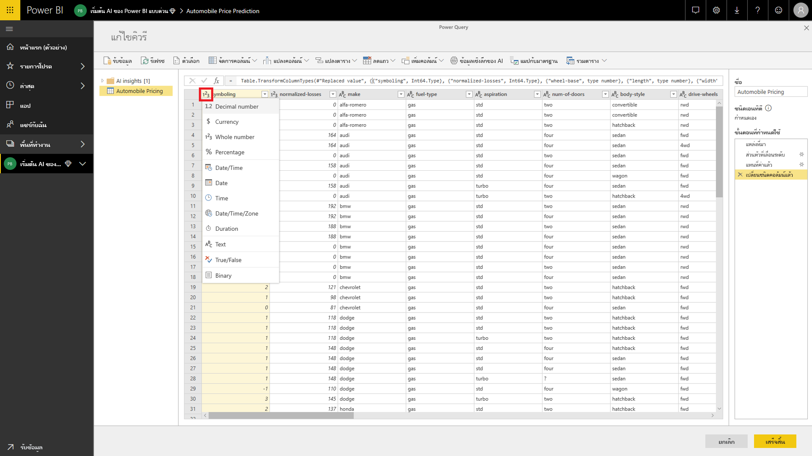

เลือก **เสร็จสิ้น** เพื่อปิดตัวแก้ไข Power Query ซึ่งจะแสดงรายการของเอนทิตีที่มีข้อมูล_การกำหนดราคายนต์_ ที่ได้เพิ่มไว้ เลือก **บันทึก** ที่มุมขวาบน ตั้งชื่อกระแสข้อมูล จากนั้นเลือก **บันทึก**

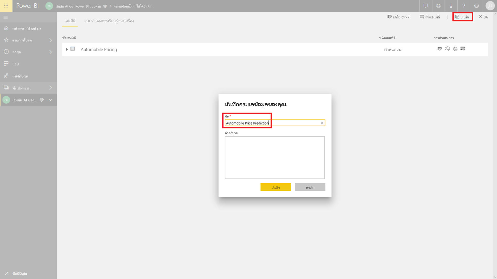

### รีเฟรชกระแสข้อมูล

การบันทึกกระแสข้อมูลจะแสดงการแจ้งเตือนเมื่อกระแสข้อมูลของคุณได้รับการบันทึกแล้ว เลือก **รีเฟรชตอนนี้** เพื่อเก็บข้อมูลจากแหล่งข้อมูลลงในกระแสข้อมูล

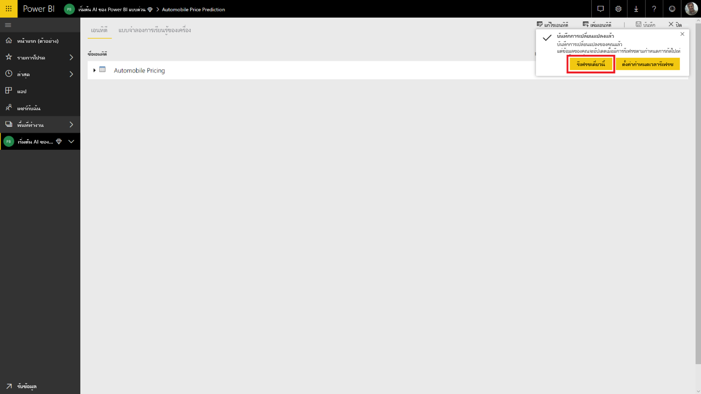

เลือก **ปิด** ที่มุมขวาบน และรอการรีเฟรชกระแสข้อมูลเพื่อเสร็จสิ้น

นอกจากนี้คุณยังสามารถรีเฟรชกระแสข้อมูลของคุณโดยใช้คำสั่ง **การดำเนินการ** ได้ กระแสข้อมูลจะแสดงประทับเวลาเมื่อรีเฟรชเสร็จสิ้น

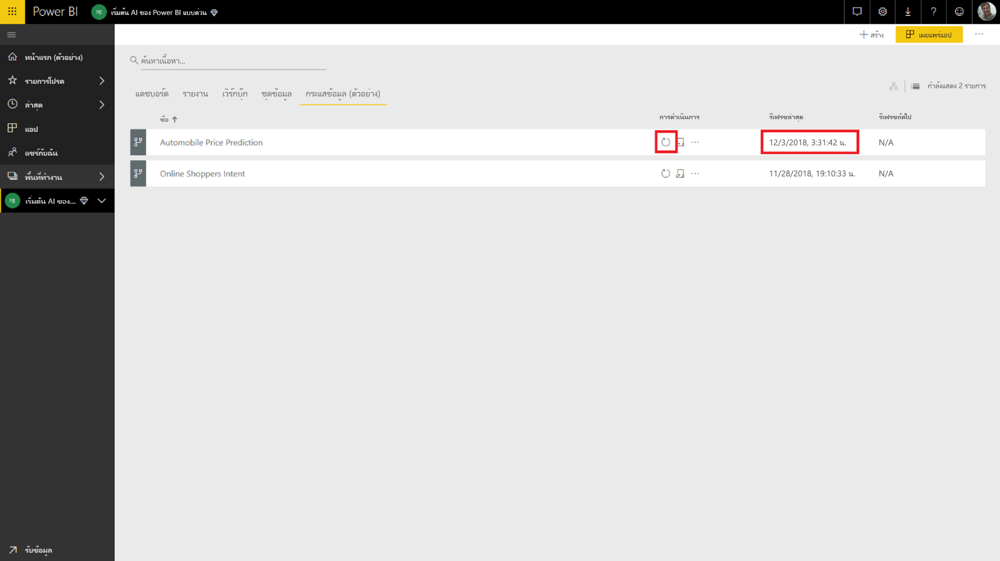

## ใช้ข้อมูลเชิงลึกจากแบบจำลอง Azure ML ของคุณ

หากต้องการเข้าถึงแบบจำลอง Azure ML สำหรับ _การคาดการณ์ราคายนต์_ คุณสามารถแก้ไขเอนทิตี _ราคารถยนต์_ ที่ต้องการเพิ่มราคาที่คาดการณ์ไว้ได้

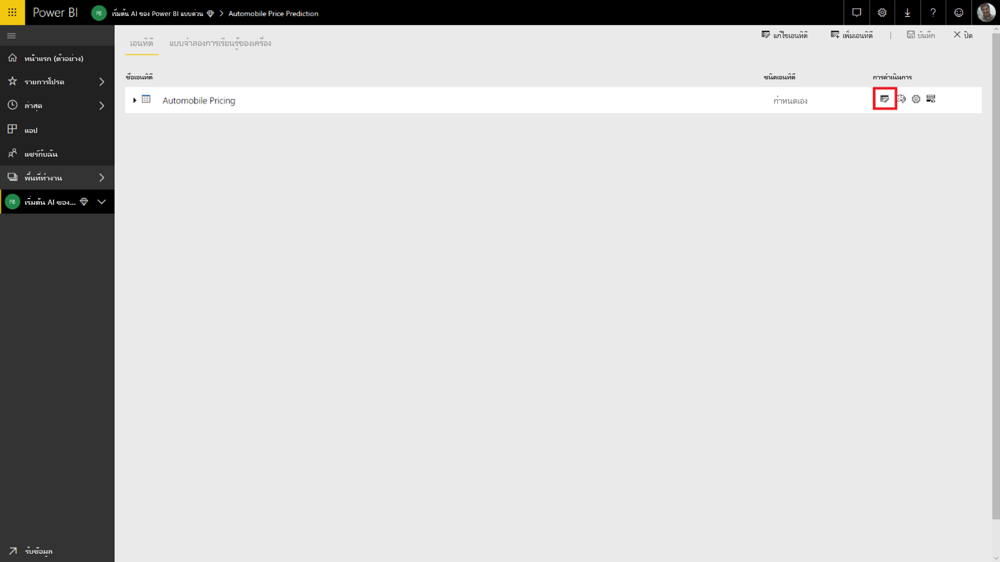

การเลือกไอคอน **แก้ไข** จะเปิดตัวแก้ไข Power Query สำหรับเอนทิตีในกระแสข้อมูลของคุณ

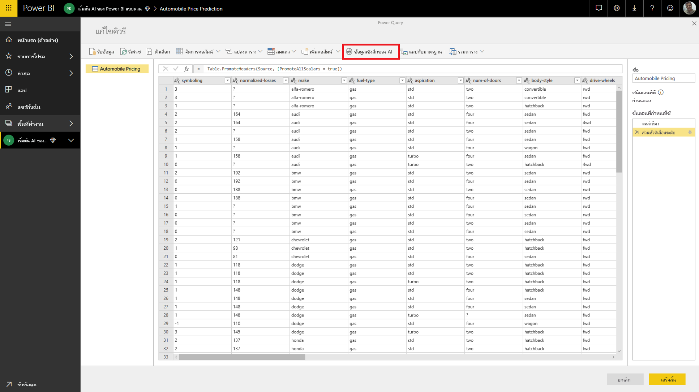

เลือกปุ่ม **ข้อมูลเชิงลึกของ AI** ในริบบอน จากนั้นเลือกโฟลเดอร์ _แบบจำลอง Azure Machine Learning_ จากเมนูบานหน้าต่างนำทาง

ระบบจะแสดงรายการแบบจำลอง Azure ML ที่คุณได้รับสิทธิ์เข้าถึงอยู่เป็นฟังก์ชัน Power Query ด้วยคำนำหน้า *AzureML*  เมื่อคุณคลิกที่ฟังก์ชันที่สัมพันธ์กับแบบจำลอง _AutomobilePricePrediction_ พารามิเตอร์สำหรับบริการบนเว็บของแบบจำลองจะแสดงเป็นพารามิเตอร์ฟังก์ชัน

หากต้องการเรียกแบบจำลอง Azure ML คุณสามารถระบุคอลัมน์ของเอนทิตีที่เลือกใดๆ ก็ได้ เป็นข้อมูลป้อนเข้าจากดรอปดาวน์ นอกจากนี้คุณยังสามารถระบุค่าคงที่เพื่อใช้เป็นข้อมูลป้อนเข้าได้ โดยสลับไอคอนคอลัมน์ไปทางซ้ายของกล่องโต้ตอบที่ป้อนเข้า เมื่อมีชื่อคอลัมน์ที่ตรงกับหนึ่งในชื่อพารามิเตอร์ฟังก์ชัน ระบบจะแนะนำคอลัมน์ดังกล่าวให้เป็นค่าป้อนเข้า  หากชื่อคอลัมน์ไม่ตรงกัน คุณสามารถเลือกได้จากดรอปดาวน์

ในกรณีของแบบจำลอง _การคาดการณ์ราคายนต์_ พารามิเตอร์ที่ป้อนเข้าคือ:

- ผลิต
- รูปแบบตัวถัง
- ช่วงล้อ
- ขนาดเครื่องยนต์
- แรงม้า
- รอบต่อนาทีสูงสุด
- ไมล์ต่อแกลลอนทางไกล

สำหรับกรณีของเรา เนื่องจากตารางของเราตรงกับชุดข้อมูลต้นฉบับที่ใช้ฝึกแบบจำลอง พารามิเตอร์ทั้งหมดจึงเลือกคอลัมน์ที่ถูกต้องเอาไว้แล้ว

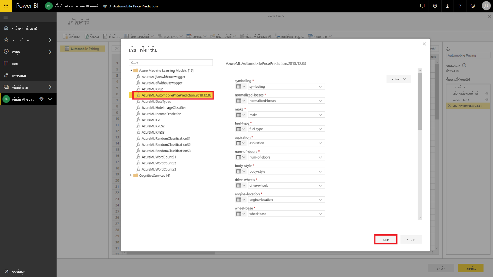

เลือก **การเรียก** เพื่อดูตัวอย่างผลลัพธ์ของแบบจำลอง Azure ML เป็นคอลัมน์ใหม่ในตารางเอนทิตี นอกจากนี้คุณจะเห็นการเรียกแบบจำลองเป็นขั้นตอนที่นำไปใช้สำหรับคิวรี

ผลลัพธ์ของแบบจำลองจะแสดงเป็นระเบียนในคอลัมน์ผลลัพธ์ คุณสามารถขยายคอลัมน์เพื่อสร้างแต่ละพารามิเตอร์ผลลัพธ์ในคอลัมน์แยกต่างหากได้ ในกรณีของเรา เราสนใจเฉพาะ _ป้ายชื่อให้คะแนน_ ซึ่งประกอบด้วยราคายนต์ที่คาดการณ์ไว้  ดังนั้นเราจึงยกเลิกเลือกส่วนที่เหลือ และเลือก **ตกลง**

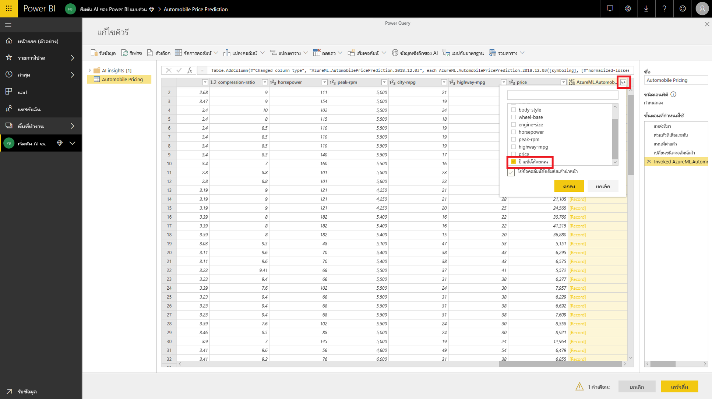

ผลของคอลัมน์ *ป้ายชื่อให้คะแนน* มีการคาดการณ์ราคาจากแบบจำลอง Azure ML

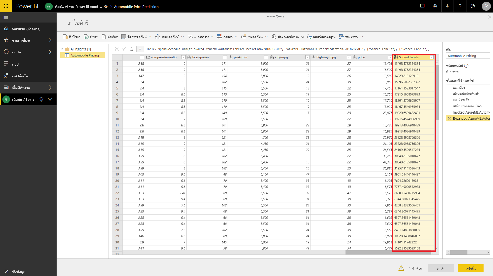

เมื่อบันทึกกระแสข้อมูลของคุณแล้ว ระบบจะเรียกแบบจำลอง Azure ML โดยอัตโนมัติเมื่อรีเฟรชกระแสข้อมูลสำหรับแถวใหม่หรือแถวที่ได้รับการอัปเดตใดๆ ในตารางเอนทิตีเสร็จสิ้น

## ล้างแหล่งข้อมูล

หากคุณไม่ต้องการทรัพยากร Azure ที่สร้างขึ้นโดยใช้บทความนี้อีกต่อไป ให้ลบออกเพื่อหลีกเลี่ยงการเกิดค่าธรรมเนียม  นอกจากนี้คุณยังสามารถลบกระแสข้อมูลที่สร้างไว้หากไม่ต้องการใช้แล้วได้ด้วยเช่นกัน

## ขั้นตอนถัดไป

ในบทช่วยสอนนี้ คุณจะสร้างการทดลองอย่างง่ายโดยใช้ Azure Machine Learning Studio (คลาสสิค) ที่ใช้ชุดข้อมูลอย่างง่ายโดยทำตามขั้นตอนเหล่านี้:

- สร้างและเผยแพร่แบบจำลอง Azure Machine Learning
- ให้สิทธิ์เข้าถึงแก่ผู้ใช้ Power BI เพื่อใช้แบบจำลอง
- สร้างกระแสข้อมูล
- ใช้ข้อมูลเชิงลึกจากแบบจำลอง Azure ML ไปยังกระแสข้อมูล

โปรดดู [การรวม Azure Machine Learning ใน Power BI (ตัวอย่าง)](service-machine-learning-integration.md) สำหรับข้อมูลเพิ่มเติมเกี่ยวกับการรวม Azure Machine Learning ใน Power BI
