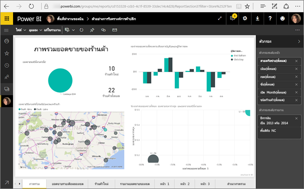
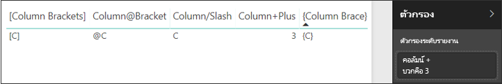

# <a name="filter-a-report-using-query-string-parameters-in-the-url"></a>กรองรายงานโดยใช้พารามิเตอร์สตริงของแบบสอบถามใน URL

เมื่อคุณเปิดรายงานในบริการ Power BI แต่ละหน้าของรายงานมี URL ของตัวเองไม่ซ้ำกัน เมื่อต้องกรองหน้ารายงานนั้น คุณสามารถใช้บานหน้าต่างตัวกรองบนพื้นที่รายงาน  หรือคุณสามารถเพิ่มพารามิเตอร์สตริงของคิวรีไปยัง URL เพื่อกรองรายงานไว้ล่วงหน้า บางครั้งคุณมีรายงานที่คุณต้องการแสดงให้แก่ผู้ร่วมงาน และคุณต้องการกรองไว้ล่วงหน้าสำหรับพวกเขา วิธีหนึ่งที่ทำได้ก็คือ การเริ่มต้นด้วย URL ที่เป็นค่าเริ่มต้นสำหรับรายงาน เพิ่มพารามิเตอร์ตัวกรองให้กับ URL และจากนั้น ส่ง URL ใหม่ทั้งหมดให้พวกเขาทางอีเมล


## <a name="uses-for-query-string-parameters"></a>ใช้สำหรับพารามิเตอร์สตริงของคิวรี

สมมติว่า คุณกำลังทำงานใน Power BI Desktop และคุณต้องการสร้างรายงานที่มีลิงก์ไปยังรายงาน Power BI อื่น ๆ แต่คุณต้องการแสดงข้อมูลนั้นแต่เพียงบางอย่างในรายงานอื่น ๆ ก่อนอื่น กรองรายงานโดยใช้พารามิเตอร์สตริงของคิวรี และบันทึก URL ถัดไป สร้างตารางใน Desktop โดยใช้ URL ของรายงานใหม่เหล่านี้  จากนั้นเผยแพร่ และแชร์รายงาน

สามารถใช้พารามิเตอร์สตริงของคิวรีในการสร้างโซลูชัน Power BI ขั้นสูงได้  ด้วยการใช้ DAX เธอสร้าง URL ของรายงานที่กรองแล้วตามข้อมูลที่ลูกค้าของเธอเลือกในรายงานปัจจุบัน เมื่อลูกค้าเลือก URL พวกเขาเห็นเฉพาะข้อมูลที่กำหนดไว้ 

## <a name="query-string-parameter-syntax-for-filtering"></a>ไวยากรณ์พารามิเตอร์สตริงของแบบสอบถามสำหรับการกรอง

ด้วยพารามิเตอร์ คุณสามารถกรองรายงานด้วยค่าอย่างน้อยหนึ่งค่าหรือมากกว่า แม้ว่าค่าเหล่านั้นประกอบด้วยเว้นวรรคหรืออักขระพิเศษ ไวยากรณ์พื้นฐานจะค่อนข้างตรงไปตรงมา เริ่มต้นด้วย URL ของรายงาน เพิ่มเครื่องหมายคำถาม และจากนั้น เพิ่มไวยากรณ์ตัวกรองของคุณ

URL?filter=***ตาราง***/***เขตข้อมูล*** eq '***ค่า***'


* ชื่อ**ตาราง**และ**เขตข้อมูล**ต้องตรงตามตัวพิมพ์ใหญ่-เล็ก แต่**ค่า**ไม่จำเป็น
* ยังคงสามารถกรองข้อมูลของเขตข้อมูลที่ถูกซ่อนจากมุมมองรายงาน

### <a name="field-types"></a>ชนิดเขตข้อมูล

ชนิดเขตข้อมูลสามารถเป็นตัวเลข วันเวลาหรือสตริง และชนิดที่ใช้ต้องตรงกับชนิดที่กำหนดในชุดข้อมูล  ตัวอย่าง การระบุคอลัมน์ในตารางเป็นชนิด "สตริง" จะไม่ทำงานถ้าคุณกำลังค้นหาค่าที่เป็นวันที่เวลาหรือตัวเลขในคอลัมน์ชุดข้อมูลที่ตั้งค่าเป็นวันที่ (ตัวอย่าง ตาราง/StringColumn eq 1)

* **สตริง**ต้องถูกล้อมรอบด้วยเครื่องหมายอัญประกาศเดี่ยว - 'ชื่อผู้จัดการ'
* **ตัวเลข**ไม่จำเป็นต้องมีการจัดรูปแบบพิเศษ
* **วันที่และเวลา**ต้องถูกล้อมรอบด้วยเครื่องหมายอัญประกาศเดี่ยว และถูกนำหน้า ด้วยคำว่า **DateTime**

ถ้ายังคงสับสน ให้อ่านต่อไป เราจะอธิบายในรายละเอียด  

## <a name="filter-on-a-field"></a>ตัวกรองบนเขตข้อมูล

สมมติว่า URL ในรายงานของเราเป็นดังนี้


และจะเห็นได้ในการจัดรูปแบบการแสดงข้อมูลแผนที่ (ด้านบน) ที่เรามีร้านค้าใน North Carolina

>[!NOTE]
>ตัวอย่างนี้จะยึดตาม [ตัวอย่างการวิเคราะห์ร้านค้าปลีก](sample-datasets.md)
> 

เพื่อกรองรายงานสำหรับแสดงข้อมูลเฉพาะสำหรับร้านค้าใน "NC" (North Carolina) ให้เพิ่มข้อมูลต่อไปนี้ลงใน URL:

?filter=Store/Territory eq 'NC'


>[!NOTE]
>*NC* เป็นค่าสำหรับ North Carolina ที่จัดเก็บไว้ในเขตข้อมูล **Territory** ในตาราง **Store**
> 

รายงานของเราถูกกรองสำหรับ North Carolina แล้ว กล่าวคือ การจัดรูปแบบการแสดงข้อมูลทั้งหมดบนหน้ารายงานจะแสดงข้อมูลเฉพาะ North Carolina เท่านั้น



## <a name="filter-on-multiple-fields"></a>ตัวกรองบนหลายเขตข้อมูล

คุณยังสามารถกรองบนเขตข้อมูลหลายรายการได้โดยการเพิ่มพารามิเตอร์เพิ่มเติมไปยัง URL ของคุณ ลองย้อนกลับไปยังพารามิเตอร์ตัวกรองต้นฉบับของเรา

```
?filter=Store/Territory eq 'NC'
```

เมื่อต้องกรองบนเขตข้อมูลเพิ่มเติม เพิ่ม **and** และเขตข้อมูลอีกเขตหนึ่งในรูปแบบเดียวกับด้านบน ต่อไปนี้เป็นตัวอย่างหนึ่ง:

```
?filter=Store/Territory eq 'NC' and Store/Chain eq 'Fashions Direct'
```

<iframe width="640" height="360" src="https://www.youtube.com/embed/0sDGKxOaC8w?showinfo=0" frameborder="0" allowfullscreen></iframe>

## <a name="operators"></a>ตัวดำเนินการ

Power BI สนับสนุนตัวดำเนินการมากมายนอกจาก **and** ตารางด้านล่างแสดงตัวดำเนินการเหล่านั้นพร้อมกับชนิดเนื้อหาที่สนับสนุน

|ตัวดำเนินการ  | ข้อกำหนด | สตริง  | ตัวเลข | วันที่ |  ตัวอย่าง:|
|---------|---------|---------|---------|---------|---------|
|**and**     | และ |  ใช่      | ใช่ |  ใช่|  ผลิตภัณฑ์/ราคา le 200 และราคา gt 3.5 |
|**eq**     | เท่ากับ |  ใช่      | ใช่   |  ใช่       | ที่อยู่/เมือง eq 'Redmond' |
|**ne**     | ไม่เท่ากับ |   ใช่      | ใช่  | ใช่        |  ที่อยู่/เมือง ne 'ลอนดอน' |
|**ge**     |  มากกว่าหรือเท่ากับ       | ไม่ | ใช่ |ใช่ |  ผลิตภัณฑ์/ราคา ge 10
|**gt**     | มากกว่า        |ไม่ | ใช่ | ใช่  | ผลิตภัณฑ์/ราคา gt 20
|**le**     |   น้อยกว่าหรือเท่ากับ      | ไม่ | ใช่ | ใช่  | ผลิตภัณฑ์/ราคา le 100
|**lt**     |  น้อยกว่า       | ไม่ | ใช่ | ใช่ |  ผลิตภัณฑ์/ราคา lt 20
|**in****     |  รวมถึง       | ไม่ | ไม่ |  ใช่ | นักเรียน/อายุ in (27, 29)


\** เมื่อใช้ **in** ค่าทางด้านขวาของ **in**สามารถเป็นรายการที่คั่นด้วยจุลภาคที่ถูกล้อมรอบด้วยวงเล็บ หรือเป็นนิพจน์เดี่ยวที่ส่งค่ากลับเป็นคอลเลกชัน

### <a name="numeric-data-types"></a>ชนิดข้อมูลตัวเลข

ตัวกรอง Power BI URL สามารถรวมตัวเลขในรูปแบบต่อไปนี้

|ชนิดตัวเลข  |ตัวอย่าง:  |
|---------|---------|
|**จำนวนเต็ม**     |   5      |
|**long**     |   5L หรือ 5l      |
|**สองตัวเลข**     |   5.5 หรือ 55e-1 หรือ 0.55e +1 หรือ 5D หรือ 5d หรือ 0.5e1D หรือ 0.5e1d หรือ 5.5D หรือ 5.5d หรือ 55e-1D หรือ 55e -1d     |
|**ทศนิยม**     |   5M หรือ 5m หรือ 5.5M หรือ 5.5m      |
|**เลขหลังจุดทศนิยมไม่จำกัด**     | 5F หรือ 5f หรือ 0.5e1F หรือ 0.5e-1d        |

### <a name="date-data-types"></a>ชนิดข้อมูลวัน

Power BI สนับสนุน OData V3 และ V4 สำหรับชนิดข้อมูล**วัน**และ **DateTimeOffset**  แสดงวันที่โดยใช้รูปแบบ EDM (2019-02-12T00:00:00) ซึ่งหมายความว่า เมื่อคุณระบุวันที่เป็น ปปปป-ดด-วว Power BI จะแปลได้เป็น ปปปป-ดด-ววT00:00:00

ทำไมความแตกต่างนี้จึงสำคัญ สมมติว่า คุณสร้างพารามิเตอร์สตริงของคิวรี**ตาราง/วัน gt 2018-08-03**  ผลลัพธ์จะรวมวันที่ 3 สิงหาคม 2018 หรือเริ่มต้นด้วยวันที่ 4 สิงหาคม 2018 เนื่องจาก Power BI แปลคิวรีของคุณเป็น **ตาราง/วัน gt 2018-08-03T00:00:00** ผลลัพธ์ของคุณจะมีส่วนเวลาที่ไม่ใช่ศูนย์เนื่องจากวันที่เหล่านั้นจะมีค่ามากกว่า **2018-08-03T00:00:00**

## <a name="special-characters-in-url-filters"></a>อักขระพิเศษในตัวกรอง URL

อักขระพิเศษและช่องว่างจำเป็นต้องจัดรูปแบบบางอย่างเพิ่มเติม เมื่อคิวรีของคุณประกอบด้วยช่องว่าง เส้นประ หรืออักขระอื่น ๆ ที่ไม่ใช่ ASCII ใส่หน้าอักขระพิเศษเหล่านั้นด้วย *escape code* (**_x**) และ **Unicode** 4 หลัก ถ้า Unicode มีอักขระน้อยกว่า 4 ตัว คุณจะต้องเพิ่มด้วยศูนย์ นี่คือบางตัวอย่าง

|ตัวระบุ  |Unicode  | การเขียนโคัดสำหรับ Power BI  |
|---------|---------|---------|
|**ชื่อตาราง**     | ช่องว่าง: 0x20        |  Table_x0020_Name       |
|**Column**@**Number**     |   @: 0x40     |  Column_x0040_Number       |
|**[Column]**     |  [:0x005B ]:0x0050       |  _x0058_Column_x0050       |
|**Column+Plus**     | +: 0x2B        |  Column_x002B_Plus       |

Table_x0020_Name/Column_x002B_Plus eq 3


Table_x0020_Special /_x005B_Column_x0020_Brackets_x005D_ eq '[C]'

### <a name="use-dax-to-filter-on-multiple-values"></a>ใช้ DAX เพื่อกรองค่าหลายค่า

อีกวิธีหนึ่งเพื่อกรองหลายเขตข้อมูลคือ การสร้างคอลัมน์จากการคำนวณที่รวมเขตข้อมูลสองเขตเป็นค่าเดียว จากนั้น คุณก็สามารถกรองค่านั้นได้

ตัวอย่างเช่น เรามีสองเขตข้อมูล: Territory และ Chain ใน Power BI Desktop คุณสามารถ[สร้างคอลัมน์จากการคำนวณ](desktop-tutorial-create-calculated-columns.md) (เขตข้อมูล) ที่เรียกว่า TerritoryChain ได้ โปรดจำไว้ว่า ชื่อ**เขตข้อมูล**ต้องไม่มีช่องว่าง นี่คือสูตร DAX สำหรับคอลัมน์นั้น

TerritoryChain = [Territory] & "-" & [Chain]

เผยแพร่รายงานไปยังบริการ Power BI จากนั้นใช้สตริงแบบสอบถาม URL ในการกรองเพื่อแสดงข้อมูลสำหรับร้านค้า Lindseys ใน NC เท่านั้น

    https://app.powerbi.com/groups/me/reports/8d6e300b-696f-498e-b611-41ae03366851/ReportSection3?filter=Store/TerritoryChain eq 'NC–Lindseys'

## <a name="pin-a-tile-from-a-filtered-report"></a>ปักหมุดไทล์จากรายงานที่กรองแล้ว

เมื่อคุณได้กรองรายงานโดยใช้พารามิเตอร์สตริงของแบบสอบถาม คุณสามารถปักหมุดการจัดรูปแบบการแสดงข้อมูลจากรายงานไปยังแดชบอร์ดของคุณได้  ไทล์ในแดชบอร์ดจะแสดงข้อมูลที่กรองแล้ว และการเลือกไทล์แดชบอรดจะเปิดรายงานที่ใช้ในการสร้าง  อย่างไรก็ตาม การที่คุณกรองโดยใช้ URL จะไม่ได้บันทึกไว้ร่วมกับรายงาน และเมื่อมีการเลือกไทล์แดชบอร์ด รายงานก็เปิดขึ้นมาในสถานะยังไม่กรอง  ซึ่งหมายความว่า ข้อมูลที่แสดงในไทล์แดชบอร์ดจะไม่ตรงกับข้อมูลที่แสดงในการจัดรูปแบบการแสดงข้อมูลในรายงาน

อาจเป็นประโยชน์เมื่อคุณต้องการดูผลลัพธ์ที่แตกต่างกัน ระหว่างข้อมูลแบบกรองแล้วบนแดชบอร์ดกับแบบที่ยังไม่ได้กรองในรายงาน

## <a name="considerations-and-troubleshooting"></a>ข้อควรพิจารณาและการแก้ไขปัญหา

มีบางสิ่งที่ควรระวังเมื่อใช้พารามิเตอร์สตริงของแบบสอบถาม

* เมื่อใช้ตัวดำเนินการ *in* ค่าทางด้านขวาของ *in* ต้องเป็นรายการที่คั่นด้วยจุลภาคที่อยู่ในวงเล็บ    
* ในเซิร์ฟเวอร์รายงาน Power BI คุณสามารถ[ผ่านพารามิเตอร์รายงาน](https://docs.microsoft.com/sql/reporting-services/pass-a-report-parameter-within-a-url?view=sql-server-2017.md)ได้โดยการรวมพารามเตอร์เหล่านั้นใน URL รายงานได้ พารามิเตอร์ URL เหล่านี้ไม่มีคำนำหน้าเนื่องจากจะถูกส่งผ่านโดยตรงไปยังเอ็นจินประมวลผลรายงาน
* การกรองสตริงแบบสอบถามใช้ไม่ได้กับ [เผยแพร่ไปยังเว็บ](service-publish-to-web.md) หรือ Power BI Embedded   
* ชนิดข้อมูล long คือ (2^53-1) เนื่องจากข้อจำกัดของ Javascript

## <a name="next-steps"></a>ขั้นตอนถัดไป

[ปักหมุดการแสดงภาพไปยังแดชบอร์ด](service-dashboard-pin-tile-from-report.md)  
[ลงทะเบียนเพื่อขอรับรุ่นทดลองใช้ฟรี](https://powerbi.microsoft.com/get-started/)

มีคำถามเพิ่มเติมหรือไม่ [ลองถามชุมชน Power BI](http://community.powerbi.com/)
