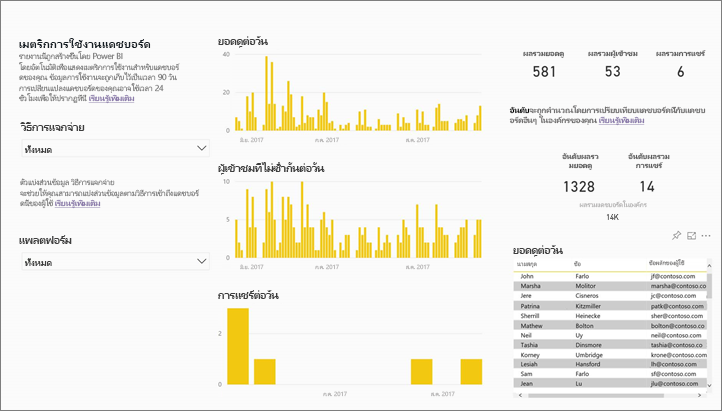
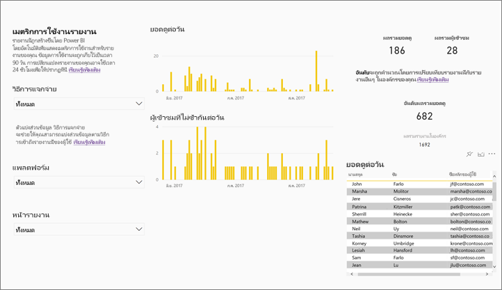
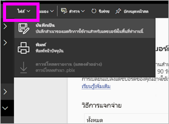
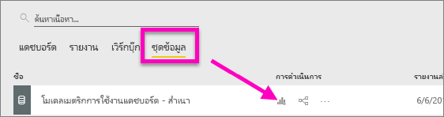
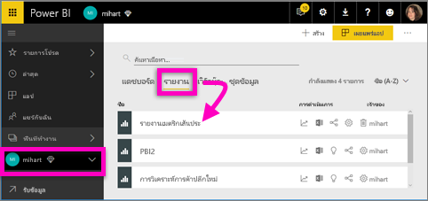
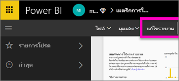
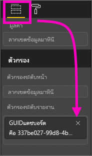
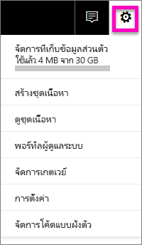

# เฝ้าติดตามเมตริกการใช้งานสำหรับแดชบอร์ดและรายงานของ Power BI

หากคุณสร้างแดชบอร์ดและรายงาน วิธีใช้เมตริกการใช้งานจะช่วยคุณให้เข้าใจเกี่ยวกับผลกระทบของแดชบอร์ดและรายงานเหล่านี้ เมื่อคุณเรียกใช้เมตริกการใช้งานแดชบอร์ดหรือเมตริกการใช้งานรายงาน คุณพบว่ามีการใช้แดชบอร์ดและรายงานเหล่านั้นทั่วทั้งองค์กรของคุณอย่างไร มีการใช้อะไร โดยผู้ใด และเพื่อวัตถุประสงค์ใด  

> [!NOTE]
> เมตริกการใช้งานติดตามการใช้งานของรายงานที่ฝังอยู่ใน SharePoint Online อย่างไรก็ตาม เมตริกการใช้งานจะไม่ติดตามการฝังของแดชบอร์ดและรายงานผ่านกระแส "ผู้ใช้ที่เป็นเจ้าของข้อมูลประจำตัว" หรือ "แอปที่เป็นเจ้าของข้อมูลประจำตัว" เมตริกการใช้งานจะไม่ติดตามการใช้งานของรายงานที่ฝังผ่าน[เผยแพร่ไปยังเว็บ](service-publish-to-web.md)

รายงานเมตริกการใช้งานเหล่านี้เป็นแบบอ่านอย่างเดียว อย่างไรก็ตาม คุณสามารถปรับแต่งรายงานเมตริกการใช้งานได้โดยใช้ "บันทึกเป็น" ขั้นตอนนี้จะสร้างชุดข้อมูลใหม่และแปลงรายงานแบบอ่านอย่างเดียวใน Power BI เป็นรายงานต็มรูปแบบที่คุณสามารถแก้ไขได้ ่รายงานแบบเฉพาะตัวไม่เพียงแตประกอบด้วยเมตริกสำหรับแดชบอร์ดหรือรายงานที่เลือก แต่ด้วยการลบตัวกรองเริ่มต้น ตอนนี้คุณสามารถเข้าถึงเมตริกการใช้งานสำหรับแดชบอร์ดทั้งหมดหรือรายงานทั้งหมดในพื้นที่ทำงานที่เลือก และแม้แต่คุณก็สามารถดูชื่อของผู้ใช้ปลายทางของคุณได้

## ทำไมเมตริกการใช้งานมีความสำคัญกับฉัน?

การทราบว่ามีการใช้เนื้อหาของคุณอย่างไรช่วยคุณในการแสดงผลกระทบและจัดลำดับความสำคัญความพยายามของคุณ เมตริกการใช้งานของคุณอาจแสดงว่าหนึ่งในรายงานของคุณมีการใช้เป็นประจำทุกวันโดยส่วนใหญ่ขององค์กร และอาจแสดงว่าไม่มีการดูแดชบอร์ดที่คุณสร้างขึ้นเลยก็เป็นได้ คำติชมประเภทนี้มีประโยชน์มากสำหรับเป็นแนวทางในการทำงานของคุณ

เรียกใช้รายงานเมตริกการใช้งานสามารถใช้งานในบริการ Power BI  อย่างไรก็ตาม หากคุณบันทึกการใช้เมตริกรายงานหรือปักหมุดไปยังแดชบอร์ด คุณสามารถเปิดและโต้ตอบกับรายงานนั้นบนอุปกรณ์เคลื่อนที่ได้

### ข้อกำหนดเบื้องต้น

- คุณลักษณะเมตริกการใช้งานรวบรวมข้อมูลการใช้งานจากผู้ใช้ทั้งหมด ไม่ว่าผู้ใช้งานนั้นมีสิทธิ์การใช้งานเป็นแบบใด อย่างไรก็ตาม ต้องมีสิทธิ์การใช้งาน Power BI Pro เพื่อเรียกใช้และเข้าถึงข้อมูลเมตริกการใช้งาน
- เมตริกการใช้งานมีอยู่บนแดชบอร์ดหรือรายงานในพื้นที่ทำงานที่เลือก เมื่อต้องการเข้าถึงเมตริกการใช้งานสำหรับแดชบอร์ดเฉพาะหรือรายงาน คุณต้อง:    
    • มีสิทธิ์เข้าแก้ไขแดชบอร์ดหรือรายงานนั้น • มีสิทธิ์การใช้งาน Pro

## เกีึ่ยวกับรายงานเมตริกการใช้งาน

เมื่อคุณเลือก**เมตริกการใช้งาน**หรือไอคอน Power BI จะสร้างรายงานที่สร้างไว้ล่วงหน้าด้วยเมตริกการใช้งานสำหรับเนื้อหานั้นของ 90 วันที่ผ่านมา  รายงานดังกล่าวมีลักษณะคล้ายกับรายงาน Power BI ที่คุณคุ้นเคย แต่มีการออกแบบมาเพื่อให้ข้อมูล ไม่ใช่เพื่อการโต้ตอบ คุณจะสามารถแบ่งส่วนข้อมูลโดยยึดตามวิธีการที่ผู้ใช้ของคุณได้รับการเข้าถึง ว่าพวกเขาเข้าถึงผ่านทางเว็บหรือแอปฯมือถือ หรืออื่น ๆ ขณะที่แดชบอร์ดและรายงานของคุณพัฒนาขึ้น รายงานเมตริกการใช้งานจะพัฒนาขึ้นด้วย ซึ่งจะอัปเดตด้วยข้อมูลใหม่ทุกวัน  

รายงานเมตริกการใช้งานจะไม่แสดงขึ้นใน**ล่าสุด** **พื้นที่ทำงาน** **รายการโปรด**หรือรายการเนื้อหาอื่น ไม่สามารถเพิ่มรายงานเมตริกการใช้ลงในแอปฯ ถ้าคุณปักหมุดบนแผ่นจากรายงานเมตริกการใช้งานไปยังแดชบอร์ด จะไม่สามารถเพิ่มแดชบอร์ดลงในแอปหรือชุดเนื้อหาได้

เมื่อต้องการเจาะลึกลงในข้อมูลรายงาน หรือเพื่อสร้างรายงานของคุณเองเทียบกับชุดข้อมูล ให้ใช้**บันทึกเป็น** (ดู[บันทึกรายงานเมตริกการใช้งานเป็นรายงาน Power BI แบบเต็ม](#Save-the-Usage-Metrics-report-as-a-full-featured-Power-BI-report-(personalize))

## เปิดรายงานเมตริกการใช้งานสำหรับแดชบอร์ดหรือรายงาน

1. เริ่มต้นในพื้นที่ทำงานที่ประกอบด้วยแดชบอร์ดหรือรายงาน
2. จากรายการเนื้อหาพื้นที่ทำงานใด หรือจากแดชบอร์ดหรือตัวรายงานเอง เลือกไอคอนสำหรับ**เมตริกการใช้งาน**

    

    
3. ในครั้งแรกที่คุณทำเช่นนี้ Power BI จะสร้างรายงานเมตริกการใช้งานและแจ้งให้คุณทราบเมื่อพร้อม

    
4. เมื่อต้องการเปิดผลลัพธ์ เลือก**ดูเมตริกการใช้งาน**

    เมตริกการใช้งานเป็นการรวมกันที่ทรงพลังขณะที่คุณใช้และคงแดชบอร์ด Power BI และรายงานไว้ สงสัยหรือไม่ว่าหน้าใดของรายงานของคุณมีประโยชน์สูงสุด และหน้าใดคุณควรนำออกไป? การแบ่งส่วนแยกตาม**หน้ารายงาน**เพื่อหาคำตอบ สงสัยหรือไม่ว่าคุณควรสร้างเค้าโครงอุปกรณ์มือถือสำหรับแดชบอร์ดของคุณหรือไม่? การแบ่งส่วน**แพลตฟอร์ม**เพื่อดูจำนวนผู้ใช้ที่เข้าถึงเนื้อหาของคุณผ่านทางแอปฯมือถือเทียบกับการเข้าถึงผ่านทางเว็บเบราว์เซอร์

5. อีกทางหนึ่งคือ เลื่อนไปเหนือภาพแล้วเลือกไอคอนหมุดเพื่อเพิ่มการแสดงภาพไปยังแดชบอร์ด หรือจากแถบเมนูด้านบน เลือก**หน้า Pin Live** เพื่อเพิ่มทั้งหน้าไปยังแดชบอร์ดหนึ่ง จากแดชบอร์ดดังกล่าว คุณสามารถตรวจสอบเมตริกการใช้งานหรือแชร์ไปยังผู้อื่นไดง่ายยิ่งขึ้น

    > [!NOTE]
    > ถ้าคุณปักหมุดบนแผ่นจากรายงานเมตริกการใช้งานไปยังแดชบอร์ด จะไม่สามารถเพิ่มแดชบอร์ดลงในแอปหรือชุดเนื้อหาได้

## มีการรายงานเมตริกใด?

| เมตริก | แดชบอร์ด | รายงาน | คำอธิบาย |
| --- | --- | --- | --- |
| ตัวแบ่งส่วนข้อมูลวิธีการแจกจ่าย |ใช่ |ใช่ |วิธีการที่ผู้ใช้เข้าถึงเนื้อหา มี 3 วิธีด้วยกัน: ผู้ใช้สามารถเข้าถึงแดชบอร์ดหรือรายงานโดยการเป็นสมาชิกของ[พื้นที่ทำงานแอปฯ](consumer/end-user-experience.md) โดยการแชร์เนื้อหา[กับสมาชิก ](service-share-dashboards.md)หรือ โดยการติดตั้งชุดเนื้อหา/แอปฯ  โปรดทราบว่ามุมมองผ่านแอปฯจะนับเป็น "ชุดเนื้อหา" |
| ตัวแบ่งส่วนข้อมูลแพลตฟอร์ม |ใช่ |ใช่ |มีการเข้าถึงแดชบอร์ดหรือรายงานผ่านทางบริการ Power BI (powerbi.com) หรืออุปกรณ์เคลื่อนที่หรือไม่? อุปกรณ์เคลื่อนที่รวมแอปฯ iOS, Android และ Windows ทั้งหมดของเรา |
| ตัวแบ่งส่วนข้อมูลหน้ารายงาน |ไม่ใช่ |ใช่ |ถ้ารายงานมีมากกว่า 1 หน้า แบ่งส่วนรายงานแยกตามหน้าที่มีการดู ถ้าคุณเห็นตัวเลือกรายการสำหรับ "Blank" หมายความว่ามีการเพิ่มหน้ารายงานเมื่อเร็ว ๆ นี้ (ภายใน 24 ชั่วโมงชื่อที่แท้จริงของหน้าใหม่ปรากฏในรายการตัวแบ่งส่วนข้อมูล) และ/หรือมีการลบหน้ารายงานออก "Blank" จับประเภทของสถานการณ์เหล่านี้ |
| ยอดดูต่อวัน |ใช่ |ใช่ |จำนวนรวมของมุมมองแต่ละวัน - มุมมองหมายถึงหน้ารายงานหรือแดชบอร์ดที่ผู้ใช้ทำการโหลด |
| ผู้เข้าชมที่ไม่ซ้ำกันต่อวัน |ใช่ |ใช่ |จำนวนที่*แตกต่างกัน*ของผู้ใช้ที่ดูแดชบอร์ดหรือรายงาน (โดยยึดตามบัญชีผู้ใช้ AAD) |
| ยอดดูต่อวัน |ใช่ |ใช่ |จำนวนของมุมมองใน 90 วันที่ผ่านมา แบ่งตามผู้ใช้แต่ละราย |
| การแชร์ต่อวัน |ใช่ |ไม่ใช่ |จำนวนครั้งที่มีการแชร์แดชบอร์ดกับผู้ใช้หรือกลุ่มอื่น |
| ผลรวมยอดดู |ใช่ |ใช่ |จำนวนของมุมมองใน 90 วันที่ผ่านมา |
| ผลรวมผู้เข้าชม |ใช่ |ใช่ |จำนวนผู้ชมที่ไม่ซ้ำกันใน 90 วันที่ผ่านมา |
| ผลรวมการแชร์ |ใช่ |ไม่ใช่ |จำนวนครั้งที่มีการแชร์แดชบอร์ดหรือรายงานใน 90 วันที่ผ่านมา |
| ผลรวมทั้งหมดในองค์กร |ใช่ |ใช่ |จำนวนแดชบอร์ดหรือรายงานทั้งหมดในทั้งองค์กรที่มียอดดูอย่างน้อยหนึ่งครั้งในช่วง 90 วันที่ผ่านมา  ใช้ในการคำนวณอันดับ |
| อันดับ: ผลรวมยอดดู |ใช่ |ใช่ |สำหรับยอดดูรวมของแดชบอร์ดหรือรายงานทั้งหมดในองค์กรในช่วง 90 วันที่ผ่านมาที่มีการจัดอันดับแดชบอร์ดหรือรายงานนี้ |
| อันดับ: ผลรวมการแชร์ |ใช่ |ไม่ใช่ |สำหรับการแชร์รวมของแดชบอร์ดหรือรายงานทั้งหมดในองค์กรในช่วง 90 วันที่ผ่านมาที่มีการจัดอันดับแดชบอร์ดหรือรายงานนี้ |

### รายงานเมตริกการใช้งานแดชบอร์ด

### รายงานเมตริกการใช้งานแดชบอร์ด

## บันทึก รายงานเมตริกการใช้ เป็นรายงาน Power BI ที่น่าสนใจ (ปรับแต่ง)

ใช้**บันทึกเป็น**เพื่อแปลงรายงานเมตริกการใช้งานไปยังรายงาน Power BI อย่างเต็มที่ที่สามารถกำหนดเองและแชร์ได้ เมื่อคุณสร้างสำเนาส่วนบุคคล คุณจะสามารถเข้าถึงชุดข้อมูลพื้นฐานได้เต็มรูปแบบ ช่วยให้คุณสามารถกำหนดค่ารายงานเมตริกการใช้งานตามความต้องการเฉพาะของคุณเองได้ นอกจากนี้ คุณยังสามารถใช้ Power BI Desktop เพื่อสร้างรายงานเมตริกการใช้งานแบบกำหนดเองที่ใช้ใน[การเชื่อมต่อกับคุณลักษณะบริการ Power BI สด](https://powerbi.microsoft.com/blog/connecting-to-datasets-in-the-power-bi-service-from-desktop)ได้

ยิ่งไปกว่านั้น ชุดข้อมูลพื้นฐานมีรายละเอียดเกี่ยวกับการใช้งานทั้งหมดของแดชบอร์ดและรายงานในพื้นที่ทำงาน สิ่งนี้ได้สร้างความเป็นไปได้จำนวนมากให้เกิดขึ้น ตัวอย่างเช่น คุณสามารถสร้างรายงานที่เปรียบเทียบแดชบอร์ดทั้งหมดในพื้นที่ทำงานของคุณโดยยึดตามการใช้งาน หรือ คุณสามารถสร้างแดชบอร์ดเมตริกการใช้งานสำหรับแอปฯ Power BI ของคุณได้โดยการรวมการใช้งานเนื้อหาทั้งหมดที่กระจายอยู่ภายในแอปฯนั้น  ดู[การลบตัวกรองระดับหน้า](#remove-the-filter-to-see-all-the-usage-metrics-data-in-the-workspace)ที่ด้านล่าง

### จะมีการสร้างอะไรขึ้นเมื่อใช้ "บันทึกเป็น" ?

เมื่อ Power BI สร้างรายงานแบบเต็ม มันจะสร้างชุดข้อมูลใหม่ด้วยที่**สร้างขึ้นจากแดชบอร์ดทั้งหมดหรือรายงานทั้งหมดที่มีอยู่ในพื้นที่ทำงานปัจจุบัน**ที่มีการเข้าถึงใน 90 วันที่ผ่านมา ยกตัวอย่างเช่น คุณมีพื้นที่ทำงานมีชื่อ "ยอดขาย" ซึ่งประกอบด้วย 3 แดชบอร์ดและ 2 รายงาน และคุณสร้างรายงานเมตริกการใช้งานในแดชบอร์ด "ตะวันออกเฉียงเหนือ" จากนั้น คุณใช้**บันทึกเป็น**เพื่อปรับแต่งให้เป็นส่วนบุคคลและแปลงเป็นรายงานแบบเต็ม ชุดข้อมูลสำหรับรายงานใหม่ที่ประกอบด้วยเมตริกการใ ช้งาน*ไม่ใช่เฉพาะสำหรับแดชบอร์ดที่ชื่อว่า "ตะวันออกเฉียงเหนือ"* แต่สำหรับแดชบอร์ดทั้งสามในพื้นที่ทำงาน "Sales" ตามค่าเริ่มต้น รายงานแสดงข้อมูลสำหรับแดชบอร์ด "ตะวันออกเฉียงเหนือ" และคุณจะต้อง[ลบตัวกรอง](#remove-the-filter-to-see-all-the-usage-metrics-data-in-the-workspace)(คลิกครั้งเดียว) เพื่อแสดงข้อมูลสำหรับแดชบอร์ดทั้งสาม

### สร้างสำเนาของรายงานการใช้งานโดยใช้ "บันทึกเป็น"

เมื่อคุณสร้างสำเนาโดยใช้ "บันทึกเป็น" (ปรับแต่ง) Power BI แปลงแบบอ่านอย่างเดียวรายงานไปยังรายงานอย่างเต็มที่สร้างไว้ล่วงหน้า  ในการมองครั้งแรกจะเห็นว่ามีลักษณะเหมือนกัน อย่างไรก็ตาม ตอนนี้คุณสามารถเปิดรายงานในมุมมองการแก้ไข เพิ่มภาพ ตัวกรอง และหน้าปรับเปลี่ยนใหม่ หรือลบแสดงภาพที่มีอยู่ และอื่น ๆ อีกมาก Power BI จะบันทึกรายงานใหม่และชุดข้อมูลในพื้นที่ทำงานปัจจุบัน ในตัวอย่างด้านล่าง พื้นที่ทำงานปัจจุบันคือ **mihart**

1. จากรายงานเมตริกการใช้งานที่สร้างไว้ล่วงหน้า เลือก**ไฟล์ > บันทึกเป็น** Power BI แปลงรายงานเมตริกการใช้งานเป็นรายงาน Power BI แบบเต็ม ซึ่งเรียกว่าการ*ปรับแต่ง*รายงานเมตริกการใช้งาน รายงานการใช้งานส่วนบุคคลและชุดข้อมูลที่ปรับแต่งแล้วจะถูกบันทึกในพื้นที่ทำงานปัจจุบันที่มีชื่อว่า **mihart*

    
2. เปิดรายงานในมุมมองการแก้ไข และ[โต้ตอบกับข้อมูลเช่นเดียวกับรายงาน Power BI อื่น ๆ](service-interact-with-a-report-in-editing-view.md) ตัวอย่างเช่น เพิ่มหน้าใหม่ และสร้างการแสดงภาพแบบใหม่ เพิ่มตัวกรอง จัดรูปแบบตัวอักษร สี และอื่น ๆ

    
3. อีกวิธีหนึ่งคือ เริ่มต้นด้วยชุดข้อมูลใหม่และสร้างรายงานตั้งแต่เริ่มต้น

    
4. รายงานใหม่จะถูกบันทึกในพื้นที่ทำงานปัจจุบัน (mihart) และเพิ่มลงในรายการเนื้อหา**ล่าสุด**

    

### ลบตัวกรองเพื่อดูข้อมูลเมตริกการใช้งาน***ทั้งหมด***ในพื้นที่ทำงาน

เมื่อต้องการดูเมตริกสำหรับแดชบอร์ดทั้งหมดหรือ สำหรับรายงานทั้งหมดในพื้นที่ทำงาน คุณจะต้องลบตัวกรองออก ตามค่าเริ่มต้น รายงานที่ปรับแต่งแล้วจะถูกกรองให้แสดงเฉพาะเมตริกสำหรับแดชบอร์ดหรือรายงานที่ถูกใช้เพื่อสร้างเท่านั้น

ตัวอย่างเช่น หากคุณใช้แดชบอร์ดที่มีชื่อ "ยอดขายในยุโรป" เมื่อต้องการสร้างรายงานที่ปรับแต่งแล้วนี้ใหม่ ระบบแสดงเฉพาะข้อมูลที่ใช้งานจากแดชบอร์ด "ยอดขายในยุโรป" เท่านั้น การลบตัวกรองและเปิดใช้งานข้อมูลจากแดชบอร์ดทั้งหมดในพื้นที่ทำงานนั้น:

1. เปิดรายงานที่ปรับแต่งแล้วในมุมมองการแก้ไข

    
2. ในพื้นที่ตัวกรอง ค้นหาแหล่งชุด**ตัวกรองระดับรายงาน**และเลบตัวกรอง โดยการเลือก "x"

    

    ขณะนี้ รายงานที่ได้รับการปรับแต่งของคุณแสดงเมตริกสำหรับทั้งพื้นที่ทำงาน

## ตัวควบคุมผู้ดูแลระบบสำหรับเมตริกการใช้งาน - สำหรับผู้ดูแลระบบ Power BI

รายงานเมตริกการใช้งานเป็นคุณลักษณะที่ผู้ดูแลระบบ Power BI หรือ Office 365 สามารถเปิดหรือปิดได้ ผู้ดูแลระบบสามารถควบคุมระดับแยกย่อยที่ผู้ใช้มีสิทธิ์เข้าถึงเมตริกการใช้งาน ระดับแยกย่อยเหล่านี้มีอยู่แล้วโดยเป็นค่าเริ่มต้นสำหรับผู้ใช้ทั้งหมดในองค์กร

1. เปิดพอร์ทัลผู้ดูแลระบบโดยการเลือกไอคอนรูปเฟืองที่มุมด้านบนขวาของบริการ Power BI จากนั้นเลือก**พอร์ทัลผู้ดูแลระบบ**

    
2. จากพอร์ทัลผู้ดูแลระบบ เลือก**ตั้งค่าผู้เช่า**และเลือก**เมตริกการใช้งานสำหรับผู้สร้างเนื้อหา**

    
3. เปิดใช้งาน (หรือปิดใช้งาน) เมตริกการใช้งาน และเลือก**นำไปใช้**

    

ด้วยค่าเริ่มต้น ข้อมูลต่อผู้ใช้จะถูกเปิดใช้งานสำหรับเมตริกการใช้งาน และข้อมูลบัญชีผู้สร้างเนื้อหาจะถูกรวมอยู่ในรายงานเมตริก ถ้าคุณไม่ต้องการรวมข้อมูลนี้สำหรับผู้ใช้บางคนหรือทั้งหมด ปิดใช้งานคุณลักษณะสำหรับกลุ่มความปลอดภัยที่ระบุ หรือ คุณลักษณะสำหรับทั้งองค์กร จากนั้นข้อมูลบัญชีแสดงในรายงานว่า*ไม่มีชื่อ*

เมื่อปิดใช้งานเมตริกการใช้งานสำหรับทั้งองค์กร ผู้ดูแลระบบสามารถใช้ตัวเลือกการ**ลบเนื้อหาเมตริกการใช้งานที่มีอยู่ทั้งหมด**เพื่อลบรายงานและแผ่นแดชบอร์ดที่มีอยู่ทั้งหมดที่สร้างขึ้นโดยใช้รายงานเมตริกการใช้งานและชุดข้อมูล ตัวเลือกนี้จะลบการเข้าถึงข้อมูลเมตริกการใช้งานทั้งหมดสำหรับผู้ใช้ทั้งหมดในองค์กรที่อาจใช้งานอยู่แล้ว โปรดระวัง การลบเนื้อหาเมตริกการใช้งานที่มีอยู่เป็นการกระทำที่ไม่สามารถเรียกกลับคืนได้

## เมตริกการใช้งานในระบบคลาวด์ของชาติ

Power BI มีอยู่ในระบบคลาวด์ของชาติแยกต่างหาก ระบบคลาวด์เหล่านี้มีการรักษาความปลอดภัย ความเป็นส่วนตัว การปฏิบัติตามข้อกำหนด และความโปร่งใสเช่นเดียวกับ Power BI ทั่วโลก รวมกับรูปแบบเฉพาะสำหรับข้อบังคับท้องถิ่นเกี่ยวกับการให้บริการ ที่เก็บข้อมูล การเข้าถึง และการควบคุม เนื่องจากรูปแบบเฉพาะสำหรับข้อบังคับท้องถิ่น เมตริกการใช้งานไม่สามารถใช้งานได้ในระบบคลาวด์ของชาติ สำหรับข้อมูลเพิ่มเติม ให้ดู [ระบบคลาวด์ของชาติ](https://powerbi.microsoft.com/en-us/clouds/)

## ข้อควรพิจารณาและข้อจำกัด

เป็นสิ่งสำคัญที่ต้องทำความเข้าใจที่มีผลต่างที่อาจเกิดขึ้น เมื่อเปรียบเทียบบันทึกเมตริกและตรวจสอบการใช้งาน และเพราะอะไร *บันทึกการตรวจสอบ*รวบรวมโดยใช้ข้อมูลจากบริการ Power BI และ*เมตริกการใช้งาน*จะรวบรวมบนไคลเอ็นต์ เนื่องจากความแตกต่างที่ จำนวนรวมของกิจกรรมในบันทึกการตรวจสอบอาจไม่ตรงกันเสมอเมตริกการใช้งาน เนื่องจากต่อไปนี้:

* เมตริกการใช้งานในบางครั้งอาจนับจำนวนต่ำกว่า กิจกรรมเนื่องจากการเชื่อมต่อเครือข่ายไม่สอดคล้องกัน ตัวบล็อก ad หรือปัญหาอื่นๆ ที่สามารถทำการส่งเหตุการณ์จากไคลเอ็นต์
* มุมมองบางชนิดไม่รวมอยู่ในเมทริกซ์การใช้งาน ตามที่อธิบายไว้ก่อนหน้าในบทความนี้
* เมตริกการใช้งานในบางครั้งอาจนับจำนวนเกินกว่ากิจกรรม ในสถานการณ์ที่ไคลเอ็นต์ รีเฟรชโดยไม่จำเป็นต้องมีคำขอที่ถูกส่งกลับไปยังบริการ Power BI

## คำถามที่ถามบ่อย

นอกเหนือจากความแตกต่างที่อาจเกิดขึ้นระหว่างการบันทึกเมตริกและตรวจสอบการใช้งาน คำถามและคำตอบเกี่ยวกับเมตริกการใช้งานต่อไปนี้อาจเป็นประโยชน์สำหรับผู้ใช้และผู้ดูแลระบบ:

**คำถาม:**    ฉันไม่สามารถเรียกใช้เมตริกการใช้งานบนแดชบอร์ดหรือรายงานได้

**คำตอบ:**    คำตอบ: คุณสามารถดูเมตริกการใช้งานสำหรับเนื้อหาที่คุณเป็นเจ้าของหรือมีสิทธิ์ในการแก้ไขเท่านั้น

**คำถาม:**    เมตริกการใช้งานจะจับภาพมุมมองจากแดชบอร์ดแบบฝังตัวและรายงานหรือไม่?

**คำตอบ:**    เมตริกการใช้งานในปัจจุบันไม่สนับสนุนการบันทึกการใช้งานสำหรับแดชบอร์ดแบบฝังตัว รายงาน และโฟลว์[เผยแพร่ไปยังเว็บ](service-publish-to-web.md)          ในกรณีเหล่านั้น เราแนะนำให้ใช้แพลตฟอร์มการวิเคราะห์เว็บที่มีอยู่เพื่อติดตามการใช้งานสำหรับการโฮสต์แอปฯหรือเว็บไซต์

**คำถาม:**    ฉันไม่สามารถเรียกใช้เมตริกการใช้งานบนเนื้อหาใด ๆ เลย

**คำตอบที่ 1:**    ผู้ดูแลระบบสามารถปิดใช้งานคุณลักษณะนี้สำหรับองค์กรของพวกเขา  ให้ติดต่อผู้ดูแลระบบของคุณเพื่อดูว่าเป็นในกรณีนี้หรือไม่

**คำตอบที่ 2:**    เมตริกการใช้งานเป็นคุณลักษณะ Power BI Pro

**คำถาม:**    ข้อมูลเหมือนไม่อัปเดต ตัวอย่างเช่น วิธีีการกระจายไม่แสดงขึ้น หน้ารายงานสูญหาย และอื่น ๆ

**คำตอบ:**    อาจใช้เวลาถึง 24 ชั่วโมงเพื่อทำการอัปเดตข้อมูล

**คำถาม:**    มีสี่รายงานในพื้นที่ทำงาน แต่รายงานเมตริกการใช้งานแสดงเพียงสามรายงานเท่านั้น

**คำตอบ:**    การใช้เมตริกรายงานรวมเฉพาะรายงาน (หรือแดชบอร์ด) ที่มีการเข้าถึงใน 90 วันที่ผ่านมา  ถ้ารายงาน (หรือแดชบอร์ด) ไม่แสดงขึ้น เป็นไปได้ว่าอาจไม่ได้ใช้ในนานกว่า 90 วัน

## ขั้นตอนถัดไป

[เพิ่มแดชบอร์ดรายการโปรด](consumer/end-user-favorite.md)

มีคำถามเพิ่มเติมหรือไม่ [ลองไปที่ชุมชน Power BI](http://community.powerbi.com/)
