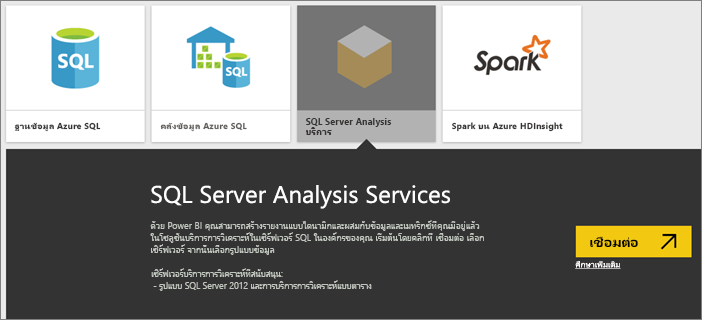
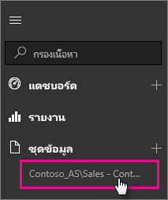

# ข้อมูลสดของ SQL Server Analysis Services ใน Power BI
ใน Power BI มีสองวิธีที่คุณสามารถเชื่อมต่อสดกับเซิร์ฟเวอร์ SQL Server Analysis Services ใน**รับข้อมูล** คุณสามารถเชื่อมต่อกับเซิร์ฟเวอร์ SQL Server Analysis Services หรือคุณสามารถเชื่อมต่อกับ[ไฟล์ Power BI Desktop](service-desktop-files.md) หรือ[สมุดงาน Excel](service-excel-workbook-files.md) ที่เชื่อมต่อกับเซิร์ฟเวอร์ Analysis Services อยู่แล้ว แนวทางปฏิบัติที่ดีที่สุด Microsoft ขอแนะนำให้ใช้ Power BI Desktop เนื่องจากความสมบูรณ์ของชุดเครื่องมือตัวและความสามารถในการรักษาสำเนาสำรองของไฟล์ Power BI Desktop ภายในเครื่อง

 >[!IMPORTANT]
 >* เพื่อเชื่อมต่อสดไปยังเซิร์ฟเวอร์ Analysis Services เกตเวย์ข้อมูลภายในองค์กร ต้องถูกติดตั้งและกำหนดค่าโดยผู้ดูแลระบบ สำหรับข้อมูลเพิ่มเติม ดู[เกตเวย์ข้อมูลภายในองค์กร](service-gateway-onprem.md)
 >* เมื่อคุณใช้เกตเวย์ ข้อมูลของคุณยังคงอยู่ภายในองค์กร  รายงานที่คุณสร้างขึ้นจากข้อมูลนั้น จะถูกบันทึกในบริการของ Power BI 
 >* [ถามตอบ คิวรีด้วยภาษาธรรมชาติ](service-q-and-a-direct-query.md) ยังเป็นคุณลักษณะตัวอย่าง สำหรับการเชื่อมต่อ Analysis Services แบบสด

## เชื่อมต่อกับรูปแบบข้อมูลจาก รับข้อมูล
1. ใน**พื้นที่ทำงานของฉัน** เลือก**รับข้อมูล** คุณยังสามารถเปลี่ยนไปยังพื้นที่ทำงานกลุ่ม ถ้ามี
   
   
2. เลือก**ฐานข้อมูลและอื่นๆ อีกมากมาย**
   
   
3. เลือก **SQL Server Analysis Services** > **เชื่อมต่อ** 
   
   
4. เลือกเซิร์ฟเวอร์ ถ้าคุณไม่เห็นเซิร์ฟเวอร์ใดเลยในนี้ แสดงว่ายังไม่ได้กำหนดเกตเวย์และแหล่งข้อมูล หรือบัญชีของคุณไม่ได้อยู่ในรายการในแท็บ**ผู้ใช้**ของแหล่งข้อมูลในเกตเวย์ ตรวจสอบกับผู้ดูแลของคุณ
5. เลือกรูปแบบที่คุณต้องการเชื่อมต่อ ซึ่งอาจเป็นแบบตาราง หรือแบบหลายมิติ

หลังจากคุณเชื่อมต่อกับรูปแบบแล้ว จะปรากฏในไซต์ Power BI ของคุณใน**พื้นที่ทำงาน/ชุดข้อมูลของฉัน** ถ้าคุณสลับไปยังพื้นที่ทำงานกลุ่ม ชุดข้อมูลจะปรากฏขึ้นภายในกลุ่ม

## ไทล์แดชบอร์ด
ถ้าคุณปักหมุดวิชวลจากรายงานไปยังแดชบอร์ด ไทล์ที่ปักหมุดไว้จะรีเฟรชทุก 10 นาทีโดยอัตโนมัติ ถ้ามีการอัปเดตข้อมูลในเซิร์ฟเวอร์ Analysis Services ภายในองค์กรของคุณ ไทล์จะได้รับการปรับปรุงอัตโนมัติหลังผ่านไป 10 นาที

## ปัญหาที่พบบ่อย

* ข้อผิดพลาด ไม่สามารถโหลดเค้าร่างแบบจำลอง - ข้อผิดพลาดนี้เกิดขึ้นเมื่อผู้ใช้เชื่อมต่อกับ SSAS ไม่ได้รับอนุญาตให้เข้าถึงฐานข้อมูล SSAS, คิวบ์ และแบบจำลอง

## ขั้นตอนถัดไป
[เกตเวย์ข้อมูลภายในองค์กร](service-gateway-onprem.md)  
[จัดการแหล่งข้อมูล Analysis Services](service-gateway-enterprise-manage-ssas.md)  
[การแก้ไขปัญหาเกตเวย์ข้อมูลภายในองค์กร](service-gateway-onprem-tshoot.md)  
มีคำถามเพิ่มเติมหรือไม่? [ลองไปที่ชุมชน Power BI](http://community.powerbi.com/)