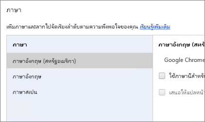
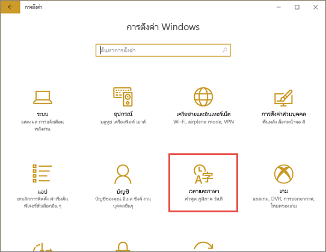
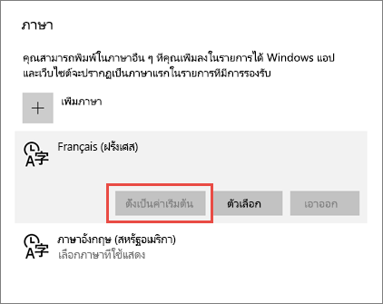
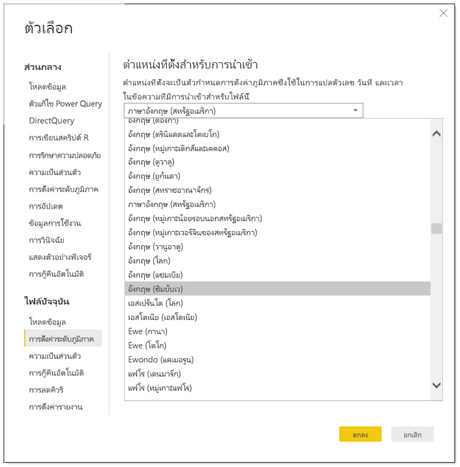
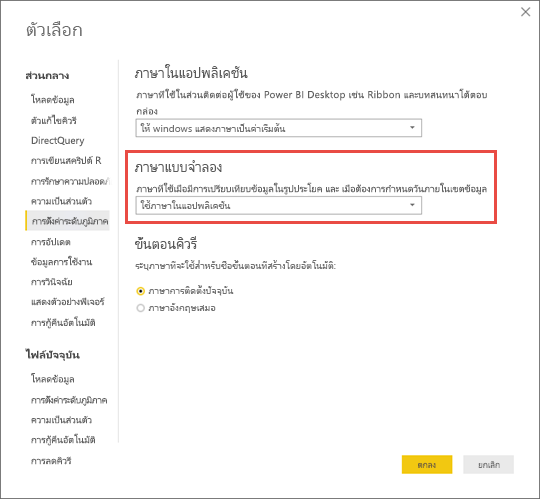

# ภาษาและประเทศ/ภูมิภาคที่สนับสนุนสำหรับ Power BI

บทความนี้แสดงรายการภาษาที่รองรับและประเทศ/ภูมิภาคสำหรับบริการ Power BI, Power BI Desktop และเอกสารประกอบ Power BI

## ประเทศและภูมิภาคที่ Power BI พร้อมใช้งาน
สำหรับรายการของประเทศและภูมิภาคที่ Power BI พร้อมใช้งาน ดู [รายการความพร้อมใช้งานในต่างประเทศ](https://products.office.com/business/international-availability) 

## ภาษาสำหรับบริการ Power BI
บริการ Power BI (ในเบราว์เซอร์ดังกล่าว) พร้อมใช้งานใน 44 ภาษาดังต่อไปนี้:

* อาหรับ
* บาสก์ - Basque
* บัลแกเรีย - Български
* คาตาลัน - català
* จีน (ประยุกต์) - 中文(简体)
* จีน (ดั้งเดิม) - 中文(繁體)
* โครเอเชีย - hrvatski
* เช็ก - čeština
* เดนมาร์ก - dansk
* ดัตช์ - Nederlands
* อังกฤษ - English
* เอสโตเนีย - eesti
* ฟินแลนด์ - suomi
* ฝรั่งเศส - français
* กาลิเชีย - galego
* เยอรมัน - Deutsch
* กรีก - Ελληνικά
* ฮิบรู
* ฮินดี - हिंदी
* ฮังการี - magyar
* อินโดนีเซีย - Bahasa Indonesia
* อิตาลี - italiano
* ญี่ปุ่น - 日本語
* คาซัคสถาน - Қазақ
* เกาหลี - 한국어
* ลัตเวีย - latviešu
* ลิทัวเนีย - lietuvių
* มลายู - Bahasa Melayu
* นอร์เวย์ (Bokmål) - norsk (bokmål)
* โปแลนด์ - Polski
* โปรตุเกส (บราซิล) - Português
* โปรตุเกส (โปรตุเกส) - português
* โรมาเนีย - română
* รัสเซีย - Русский
* เซอร์เบีย (ซิริลลิก) - српски
* เซอร์เบีย (ละติน) - srpski
* สโลวัก - slovenčina
* สโลวีเนีย - slovenski
* สเปน - español
* สวีเดน - svenska
* ไทย - ไทย
* ตุรกี - Türkçe
* ยูเครน - українська
* เวียดนาม - Tiếng Việt

### สิ่งที่ีแปล
Power BI แปลเมนู ปุ่ม ข้อความ และองค์ประกอบอื่น ๆ ของประสบการณ์การใช้งานเป็นภาษาของคุณ

ในขณะนี้ คุณลักษณะบางอย่างจะพร้อมใช้งานในภาษาอังกฤษเท่านั้น:

* แดชบอร์ดและรายงาน Power BI สร้างขึ้นเมื่อคุณเชื่อมต่อกับบริการเช่น Microsoft Dynamics CRM, Google Analytics และ Salesforce คุณยังสามารถสร้างแดชบอร์ดและรายงานของคุณเองในภาษาของคุณเอง
* สำรวจข้อมูลของคุณด้วยการถามตอบ

โปรดติดตามต่อไปขณะที่เราทำงานเพื่อจัดทำคุณลักษณะสำหรับภาษาอื่นเพิ่มเติม 

### เลือกภาษาของคุณในบริการ Power BI
1. ในบริการ Power BI เลือกไอคอน **ตั้งค่า**  > **ตั้งค่า**
2. ที่แท็บ **ทั่วไป** > **ภาษา**
3. เลือกภาษาของคุณ > **นำไปใช้**

### เลือกภาษาของคุณในเบราว์เซอร์
Power BI ตรวจหาภาษาของคุณโดยยึดตามภาษาที่คุณกำหนดบนคอมพิวเตอร์ของคุณ วิธีที่คุณเข้าถึงและเปลี่ยนการตั้งค่าเหล่านี้อาจแตกต่างกันโดยขึ้นอยู่กับระบบปฏิบัติการและเบราว์เซอร์ของคุณ นี่คือวิธีการเข้าถึงการกำหนดลักษณะเหล่านี้จาก Internet Explorer และ Google Chrome

#### Internet Explorer (เวอร์ชัน 11)
1. คลิกที่ปุ่ม **เครื่องมือ**ที่มุมบนขวาของหน้าต่างเบราว์เซอร์ของคุณ:
   
   
2. คลิก **ตัวเลือกอินเทอร์เน็ต**
3. ในกล่องโต้ตอบตัวเลือกอินเทอร์เน็ตบนแท็บ General ใต้ Appearance คลิกปุ่ม **ภาษา (Languages)**

#### Google Chrome (เวอร์ชัน 42)
1. คลิกที่ปุ่มเมนูที่มุมบนขวาของหน้าต่างเบราว์เซอร์ของคุณ:
   
   
2. คลิก **การตั้งค่า**
3. คลิก **แสดงการตั้งค่าขั้นสูง**
4. ใต้ภาษา คลิกปุ่ม **ภาษาและการตั้งค่าสำหรับการป้อนค่า**
5. คลิก **เพิ่ม** เลือกภาษาแล้วคลิก **ตกลง**
   
   
   
   ภาษาใหม่อยู่ที่ส่วนท้ายของรายการ 
6. ลากภาษาใหม่ไปยังด้านบนของรายการ จากนั้นคลิก **แสดง Google Chrome ในภาษานี้**
   
   
   
   คุณอาจจำเป็นต้องปิดและเปิดเบราว์เซอร์ของคุณอีกครั้งเพื่อดูการเปลี่ยนแปลง

## เลือกภาษาหรือตำแหน่งที่ตั้งของ Power BI Desktop
มีสองวิธีในการได้ Power BI Desktop: คุณสามารถดาวน์โหลด หรือติดตั้ง Power BI Desktop จาก Windows Store

* เมื่อคุณ [ติดตั้ง Power BI Desktop จาก Windows Store](#choose-a-language-for-power-bi-desktop-installed-from-the-windows-store) ระบบจะติดตั้งทุกภาษาและแสดงภาษาที่สอดคล้องกับภาษาเริ่มต้นของ Windows
* เมื่อคุณ [ดาวน์โหลด Power BI Desktop](#choose-a-language-when-you-download-power-bi-desktop) ระบบจะให้คุณเลือกภาษาเมื่อคุณดาวน์โหลด 
* นอกจากนี้ คุณยังสามารถ [เลือกตำแหน่งที่ตั้งที่จะใช้เมื่อนำเข้าข้อมูล](#choose-the-locale-for-importing-data-into-power-bi-desktop)สำหรับรายงานเฉพาะได้

### เลือกหนึ่งภาษาสำหรับ Power BI Desktop ที่ติดตั้งจาก Windows Store
1. [ติดตั้ง Power BI Desktop](http://aka.ms/pbidesktopstore)จาก Windows Store
2. เมื่อต้องเปลี่ยนภาษา ค้นหา**การตั้งค่า Windows** จากคอมพิวเตอร์ของคุณ 
3. เลือก**เวลาและภาษา**
   
     
4. เลือก**ภูมิภาคและภาษา** เลือกภาษา และเลือก**ตั้งค่าเป็นค่าเริ่มต้น**
   
     
   
     ในครั้งถัดไปที่คุณเริ่มต้น Power BI Desktop ระบบจะใช้ภาษาที่คุณตั้งเป็นค่าเริ่มต้น 

### เลือกภาษาเมื่อคุณดาวน์โหลด Power BI Desktop
ภาษาที่คุณเลือกสำหรับ Power BI Desktop มีผลต่อรูปแบบการแสดงตัวเลขและวันที่ในรายงาน 

* เลือกภาษาเมื่อคุณ[ดาวน์โหลด Power BI Desktop](https://powerbi.microsoft.com/desktop) 

เมื่อต้องเปลี่ยนภาษาใน Power BI Desktop กลับไปยังหน้าดาวน์โหลด และดาวน์โหลดในภาษาอื่น

### เลือกตำแหน่งที่ตั้งสำหรับการนำเข้าข้อมูลลงใน Power BI Desktop
ไม่ว่าคุณจะดาวน์โหลด Power BI Desktop หรือติดตั้งจาก Windows Store คุณสามารถเลือกตำแหน่งที่ตั้งสำหรับรายงานเฉพาะให้เป็นตำแหน่งอื่นนอกเหนือจากตำแหน่งที่ตั้งใน Power BI Desktop เวอร์ชันของคุณได้ วิธีที่ข้อมูลจะถูกแปลเมื่อนำเข้าจากข้อมูลของคุณเปลี่ยนแปลงตำแหน่งที่ตั้งแหล่ง ตัวอย่างว่า"3/4/2017" จะถูกแปลเป็น 3 เมษายนหรือ 4 มีนาคม 

1. ใน Power BI Desktop ไปที่ตัวเลือก **แฟ้ม** > **และตัวเลือก** > **การตั้งค่า**
2. ใต้**แฟ้มปัจจุบัน** เลือก**การตั้งค่าภูมิภาค**
3. ในกล่อง**ตำแหน่งที่ตั้งสำหรับการนำเข้า** เลือกตำแหน่งที่ตั้งอื่น 
   
   
4. เลือก **ตกลง**

### เลือกภาษาสำหรับแบบจำลองใน Power BI Desktop

นอกจากการตั้งค่าภาษาสำหรับแอปพลิเคชัน Power BI Desktop แล้ว คุณยังสามารถตั้งค่าภาษาแบบจำลองได้ ภาษาแบบจำลองส่งผลกระทบที่สำคัญสองประการ:

- วิธีการที่เราเปรียบเทียบและเรียงลำดับสตริง ตัวอย่างเช่น เนื่องจากในภาษาตุรกี (Turkish) มีตัวอักษร i สองตัว ดังนั้น โดยขึ้นอยู่กับการจัดเรียงฐานข้อมูลของคุณ จึงทำให้ตัวอักษรทั้งสองสามารถถูกจัดเรียงในลำดับที่แตกต่างกันเมื่อทำการเรียงลำดับ 
- ภาษาที่ Power BI Desktop ใช้เมื่อสร้างตารางวันที่แบบซ่อนไว้จากเขตข้อมูลวันที่ ตัวอย่างเช่น เขตข้อมูลจะเรียกว่า เดือน/Monat/Mois และอื่น ๆ

> [!NOTE]
> รูปแบบของ Power BI ในขณะนี้ใช้ตำแหน่งที่ตั้งที่ไม่ต้องตรงตามตัวพิมพ์ใหญ่-เล็ก (หรือ ตรงตามอักษรคานะ) ดังนั้น "ABC" และ "abc" จะถือว่าเหมือนกัน ถ้า "ABC" ถูกโหลดลงในฐานข้อมูลก่อน ค่าสตริงอื่นที่แตกต่างกันเพียงแค่ตัวพิมพ์ใหญ่-เล็กเท่านั้น เช่น "Abc" จะไม่ถือว่าเป็นค่าที่ต่างกัน
> 
>

ต่อไปนี้คือวิธีการตั้งค่าภาษาแบบจำลอง

1. ใน Power BI Desktop ไปที่ตัวเลือก **แฟ้ม** > **และตัวเลือก** > **การตั้งค่า**
2. ใต้**Global** เลือก **การตั้งค่าภูมิภาค**
3. ในกล่อง**รูปแบบภาษา** เลือกภาษาอื่น 

    

> [!NOTE]
> เมื่อสร้างแล้ว ภาษาของแบบจำลอง Power BI ไม่สามารถเปลี่ยนได้
> 
>

## ภาษาสำหรับเอกสารให้ความช่วยเหลือ
ความช่วยเหลือได้รับการแปลเป็น 10 ภาษาดังนี้: 

* จีน (ประยุกต์) - 中文(简体)
* จีน (ดั้งเดิม) - 中文(繁體)
* ฝรั่งเศส - français
* เยอรมัน - Deutsch
* อิตาลี - italiano
* ญี่ปุ่น - 日本語
* เกาหลี - 한국어
* โปรตุเกส (บราซิล) - Português
* รัสเซีย - Русский
* สเปน - español

## ขั้นตอนถัดไป
* คุณกำลังใช้หนึ่งในแอปอุปกรณ์เคลื่อนที่ Power BI ใช่หรือไม่? สำหรับรายละเอียด ดู [ภาษาที่สนับสนุนในแอปอุปกรณ์เคลื่อนที่ Power BI](consumer/mobile/mobile-apps-supported-languages.md)
* มีคำถามหรือไม่ ลองถาม[ชุมชน Power BI](http://community.powerbi.com/)
* ยังคงมีปัญหาใช่หรือไม่? โปรดเยี่ยมชม[หน้าการสนับสนุน Power BI](https://powerbi.microsoft.com/support/)

