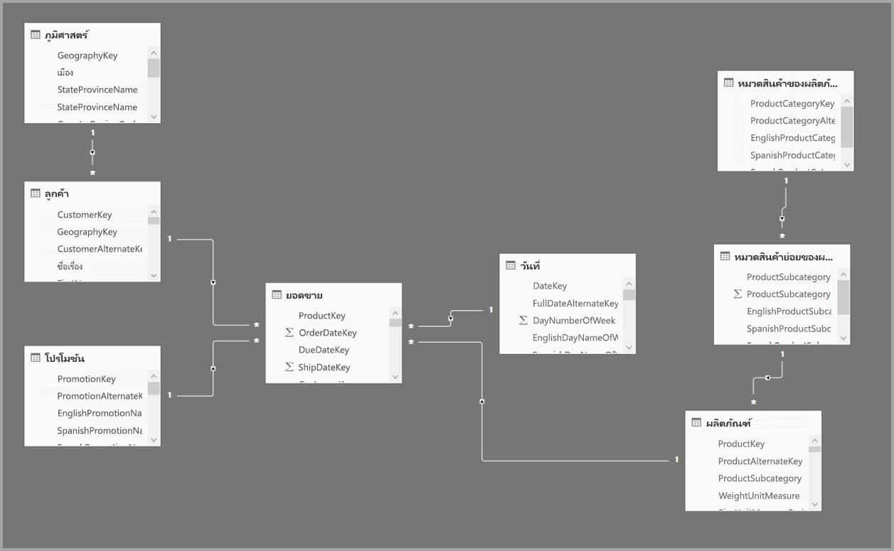
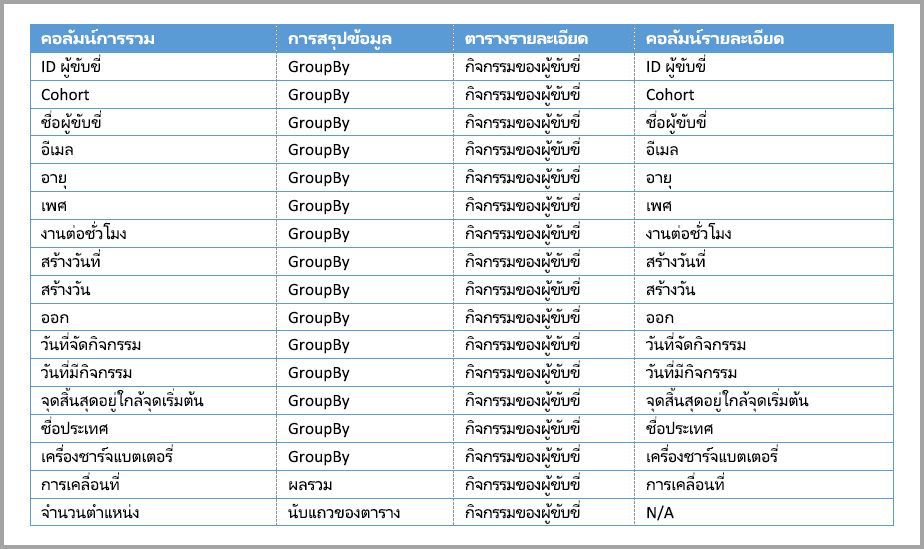

# ใช้การรวมข้อมูลใน Power BI Desktop

*การรวมข้อมูล*ใน Power BI ช่วยคุณลดขนาดตารางเพื่อให้คุณสามารถเน้นข้อมูลที่สำคัญและปรับปรุงประสิทธิภาพของคิวรีได้ การรวมข้อมูลเปิดใช้งานการวิเคราะห์แบบโต้ตอบกับข้อมูลขนาดใหญ่ในรูปแบบที่วิธีการอื่นไม่สามารถทำได้ และสามารถลดค่าใช้จ่ายในการปลดล็อกชุดข้อมูลขนาดใหญ่สำหรับการตัดสินใจได้อย่างมาก

ประโยชน์บางอย่างของการใช้การรวมข้อมูล ได้แก่:

- **ประสิทธิภาพของคิวรีกับข้อมูลขนาดใหญ่ดียิ่งขึ้น** ทุกการโต้ตอบกับวิชวล Power BI จะส่งคิวรี DAX ไปยังชุดข้อมูล ข้อมูลรวมที่เก็บไว้ในแคชใช้ทรัพยากรเพียงส่วนน้อย ซึ่งจำเป็นสำหรับข้อมูลรายละเอียดเพื่อให้คุณสามารถปลดล็อกข้อมูลขนาดใหญ่ที่จะไม่สามารถเข้าถึงได้
- **การรีเฟรชข้อมูลที่เหมาะสม** ขนาดแคชที่เล็กลงช่วยลดเวลาในการรีเฟรช ดังนั้นข้อมูลจะเข้าถึงผู้ใช้เร็วขึ้น
- **สถาปัตยกรรมที่สมดุล** แคช Power BI ในหน่วยความจำสามารถจัดการคิวรีรวม จำกัดคิวรีที่ส่งในโหมด DirectQuery และและช่วยให้คุณตอบสนองขีดจำกัดการทำงานพร้อมกัน คิวรีระดับรายละเอียดที่เหลืออยู่มีแนวโน้มที่จะถูกกรอง คิวรีระดับทรานแซคชัน ซึ่งโดยปกติคลังข้อมูลและระบบข้อมูลขนาดใหญ่จะจัดการได้ดี

แหล่งข้อมูลแบบมิติ เช่น คลังข้อมูลและตลาดข้อมูล สามารถใช้[การรวมอิงตามความสัมพันธ์](#aggregation-based-on-relationships)ได้ แหล่งข้อมูลขนาดใหญ่ที่ใช้ Hadoop มัก[มาจากฐานการรวมข้อมูลบนคอลัมน์ GroupBy](#aggregation-based-on-groupby-columns) บทความนี้จะอธิบายเกี่ยวกับความแตกต่างของการสร้างแบบจำลอง Power BI ทั่วไปสำหรับแต่ละชนิดของแหล่งข้อมูล

## สร้างตารางรวม

เพื่อสร้างตารางรวม:
1. ตั้งค่าตารางใหม่ด้วยเขตข้อมูลที่คุณต้องการ โดยขึ้นอยู่กับแหล่งข้อมูลและแบบจำลองของคุณ 
1. กำหนดการรวมข้อมูลโดยใช้กล่องโต้ตอบ **จัดการการรวมข้อมูล**
1. หากเป็นไปได้ ให้เปลี่ยน[โหมดที่เก็บข้อมูล](#storage-modes) สำหรับตารางรวม 

### จัดการการรวม

หลังจากที่คุณสร้างตารางใหม่ที่มีเขตข้อมูลที่คุณต้องการแล้ว ในบานหน้าต่าง **เขตข้อมูล** ของมุมมอง Power BI Desktop ให้คลิกขวาที่ตาราง และเลือก **จัดการการรวมข้อมูล**

กล่องโต้ตอบ **จัดการการรวมข้อมูล** แสดงแถวของแต่ละคอลัมน์ในตาราง ซึ่งคุณสามารถระบุลักษณะการทำงานของการรวมข้อมูลได้ ในตัวอย่างต่อไปนี้ การคิวรีไปยังตารางรายละเอียด **Sales** จะถูกเปลี่ยนเส้นทางภายในไปยังตารางการรวม **Sales Agg** 

เมนูดรอปดาวน์ **การสรุป** ในกล่องโต้ตอบ **จัดการการรวมข้อมูล** มีค่าต่อไปนี้:
- Count
- จัดกลุ่มตาม
- ค่าสูงสุด
- ค่าต่ำสุด
- Sum
- นับแถวของตาราง

ในตัวอย่างการรวมอิงตามความสัมพันธ์นี้ รายการ GroupBy เป็นทางเลือก ยกเว้นสำหรับ DISTINCTCOUNT วิธีการนี้จะไม่ส่งผลกระทบต่อลักษณะการทำงานของการรวมข้อมูล และเพื่อความสามารถในการอ่านเป็นหลัก หากไม่มีรายการ GroupBy การรวมจะยังคงเกิดขึ้นตามความสัมพันธ์ ซึ่งจะแตกต่างจากตัวอย่าง [ตัวอย่างข้อมูลขนาดใหญ่](#aggregation-based-on-groupby-columns) ในภายหลังของบทความนี้ ซึ่งจะต้องมีรายการ GroupBy

หลังจากกำหนดการรวมข้อมูลที่คุณต้องการแล้ว ให้เลือก **นำไปใช้กับทั้งหมด** 

### การตรวจสอบความถูกต้อง

กล่องโต้ตอบ **จัดการการรวมข้อมูล** จะบังคับใช้การตรวจสอบที่โดดเด่นดังต่อไปนี้:

- **คอลัมน์รายละเอียด**ต้องมีข้อมูลประเภทเดียวกันกับ**คอลัมน์การวมข้อมูล** ยกเว้นฟังก์ชัน**การสรุป** ของการรวมแบบ Count และ Count table rows การรวมแบบ Count และ Count table rows จะมีเฉพาะสำหรับคอลัมน์การรวมจำนวนเต็ม และไม่ต้องการหมวดหมู่ข้อมูลที่ตรงกัน
- ไม่อนุญาตให้มีการรวมแบบสายโซ่ที่ครอบคลุมสามตารางขึ้นไป ตัวอย่างเช่น การรวมใน **Table A** ไม่สามารถอ้างอิงถึง **Table B** ที่มีการรวมที่อ้างอิงถึง **Table C** ได้
- ไม่อนุญาตสำหรับการรวมแบบซ้ำ ที่สองรายการใช้ฟังก์ชัน**การสรุป**เดียวกัน และอ้างถึง **ตารางรายละเอียด** และ **คอลัมน์รายละเอียด**
- **ตารางรายละเอียด** ต้องใช้โหมดที่เก็บข้อมูล DirectQuery ไม่ใช่นำเข้า
- การจัดกลุ่มตามคอลัมน์ Foreign Key ที่ใช้โดยความสัมพันธ์ที่ไม่ได้ใช้งานและการใช้ฟังก์ชัน USERELATIONSHIP สำหรับการรวมผู้เยี่ยมชมไม่ได้รับการสนับสนุน

การตรวจสอบความถูกต้องส่วนใหญ่มีผลบังคับใช้โดยการปิดใช้งานค่าแบบเลื่อนลงและแสดงข้อความอธิบายในเคล็ดลับเครื่องมือ ดังแสดงในรูปต่อไปนี้

### ตารางการรวมถูกซ่อนไว้

ผู้ใช้ที่มีการเข้าถึงชุดข้อมูลแบบอ่านอย่างเดียวไม่สามารถคิวรีตารางการรวมได้ ซึ่งเป็นการหลีกเลี่ยงข้อกังวลด้านความปลอดภัยเมื่อใช้กับ*การรักษาความปลอดภัยระดับแถว (RLS)* ผู้บริโภคและคิวรีอ้างอิงถึงตารางรายละเอียด ไม่ใช่ตารางรวม และไม่จำเป็นต้องรู้เกี่ยวกับตารางรวม

ด้วยเหตุนี้ ตารางรวมจะถูกซ่อนจากมุมมอง **รายงาน** ถ้าตารางยังไม่ได้ถูกซ่อน กล่องโต้ตอบ**จัดการการรวมข้อมูล** จะตั้งค่าเป็นซ่อนเมื่อคุณเลือก **นำไปใช้กับทั้งหมด**

### โหมดที่เก็บข้อมูล
คุณลักษณะการรวมข้อมูลโต้ตอบกับโหมดที่เก็บข้อมูลระดับตาราง ตาราง Power BI สามารถใช้โหมดที่เก็บข้อมูล *DirectQuery*, *Import* หรือ *Dual* DirectQuery คิวรีแบ็กเอนด์โดยตรง ในขณะที่นำเข้าแคชข้อมูลในหน่วยความจำและส่งคิวรีไปยังข้อมูลที่เก็บไว้ในแคช การนำเข้า Power BI และแหล่งข้อมูล DirectQuery ที่ไม่ใช่แบบหลายมิติทั้งหมดสามารถทำงานร่วมกับการรวมข้อมูลได้ 

เมื่อต้องการตั้งค่าโหมดที่เก็บข้อมูลของตารางรวมเป็นนำเข้าเพื่อเพิ่มความเร็วคิวรี ให้เลือกตารางรวมในมุมมอง**แบบจำลอง** Power BI Desktop ในบานหน้าต่าง**คุณสมบัติ** ให้ขยาย**ขั้นสูง** ดึงเมนูการเลือกลงภายใต้ **โหมดที่เก็บข้อมูล** และเลือก **นำเข้า** โปรดทราบว่าการดำเนินการนี้จะไม่สามารถย้อนกลับได้ 

สำหรับข้อมูลเพิ่มเติมเกี่ยวกับโหมดที่เก็บข้อมูลของตาราง โปรดดู [จัดการโหมดที่เก็บข้อมูลใน Power BI Desktop](desktop-storage-mode.md)

### RLS สำหรับการรวม

เพื่อให้การรวมทำงานได้อย่างถูกต้อง RLS ควรกรองทั้งตารางการรวมและตารางรายละเอียด 

ในตัวอย่างต่อไปนี้ นิพจน์ RLS บนตาราง **Geography** ใช้สำหรับการรวมเนื่องจากภูมิศาสตร์อยู่ทางด้านการกรองของความสัมพันธ์กับทั้งตาราง **Sales** และตาราง **Sales Agg** ทั้งคิวรีที่ใช้งานและไม่ใช้งานตารางการรวมจะปรับใช้ RLS ได้สำเร็จ

นิพจน์ RLS บนตาราง **Product** จะกรองเฉพาะตาราง **Sales** รายละเอียด ไม่ใช่ตาราง **Sales Agg** รวม เนื่องจากตารางการรวมเป็นการแสดงข้อมูลในตารางรายละเอียด ดังนั้นจึงไม่ปลอดภัยที่จะตอบคิวรีจากตารางการรวมถ้าไม่สามารถใช้ตัวกรอง RLS ได้ ไม่แนะนำให้กรองเฉพาะตารางรายละเอียด เนื่องจากคิวรีของผู้ใช้จากบทบาทนี้จะไม่ได้รับประโยชน์จากการรวมข้อมูล 

นิพจน์ RLS ที่กรองเฉพาะตารางการรวม **Sales Agg** และไม่อนุญาตที่ไม่ใช่ตารางรายละเอียด **Sales**

สำหรับ[การรวมข้อมูลที่อ้างอิงตามคอลัมน์ GroupBy](#aggregation-based-on-groupby-columns) นิพจน์ RLS ที่นำไปใช้กับตารางรายละเอียดสามารถใช้เพื่อกรองตารางการรวมได้ เนื่องจากตารางรายละเอียดครอบคลุมคอลัมน์ GroupBy ทั้งหมดในตารางการรวม ในทางกลับกัน ตัวกรอง RLS บนตารางการรวมไม่สามารถนำไปใช้กับตารางรายละเอียด ดังนั้นจึงไม่ได้รับอนุญาต

## การรวมอิงตามความสัมพันธ์

โดยทั่วไปแบบจำลองมิติใช้ *การรวมอิงตามความสัมพันธ์* ชุดข้อมูล Power BI จากคลังข้อมูลและตลาดข้อมูลคล้ายคลึงกับแผนผังแบบผลึกหิมะ/แบบดาวที่มีความสัมพันธ์ระหว่างตารางมิติและตารางหลัก

ในแบบจำลองต่อไปนี้จากแหล่งข้อมูลเดียว ตารางกำลังใช้โหมดที่เก็บข้อมูล DirectQuery ตารางหลัก **ยอดขาย** มีหลายพันล้านแถว การตั้งค่าโหมดพื้นที่เก็บข้อมูล **ยอดขาย** เป็นนำเข้า สำหรับการแคชจะใช้หน่วยความจำและค่าใช้จ่ายในการจัดการที่มาก

แต่เราจะสร้างตารางการรวม **Sales Agg** ในตาราง **Sales Agg** จำนวนแถวควรเท่ากับยอดรวม **SalesAmount (ปริมาณการขาย)** ที่จัดกลุ่มตาม **CustomerKey(คีย์ข้อมูลลูกค้า)** , **DateKey(คีย์ข้อมูลวันที่)** และ **ProductSubcategoryKey(คีย์ข้อมูลหมวดหมู่ย่อยของผลิตภัณฑ์)** ตาราง **Sales Agg** อยู่ใน ระดับการปิดกั้น (Granularity) ที่สูงกว่า **Sales** ดังนั้นแทนที่จะเป็นพันล้าน ตารางอาจมีหลายล้านแถวซึ่งง่ายต่อการจัดการ

หากตารางมิติข้อมูลต่อไปนี้ถูกใช้บ่อยที่สุดสำหรับคิวรีที่มีมูลค่าธุรกิจสูง พวกเขาสามารถกรอง **Sales Agg** โดยใช้ความสัมพันธ์แบบ *หนึ่งต่อกลุ่ม* หรือ *กลุ่มต่อหนึ่ง*

- ภูมิศาสตร์
- ลูกค้า
- วัน
- หมวดสินค้าย่อยของผลิตภัณฑ์
- หมวดสินค้าของผลิตภัณฑ์

รูปภาพต่อไปนี้แสดงแบบจำลองนี้

ตารางต่อไปนี้แสดงการรวมสำหรับตาราง **Sales Agg**

> [!NOTE]
> ตาราง **Sales Agg** เหมือนกับตารางอื่นใดก็ตาม ดังนั้นจึงมีความยืดหยุ่นในการโหลดด้วยวิธีการต่างๆ การรวมสามารถทำได้ในฐานข้อมูลต้นทางโดยใช้กระบวนการ ETL/ELT หรือโดย [นิพจน์ M](/powerquery-m/power-query-m-function-reference) สำหรับตาราง ตารางรวมสามารถใช้โหมดพื้นที่เก็บข้อมูลการนำเข้าที่มีหรือไม่มี [การรีเฟรชแบบเพิ่มหน่วยในบริการ Power BI Premium](../admin/service-premium-incremental-refresh.md) หรือสามารถใช้ DirectQuery และเพิ่มประสิทธิภาพสำหรับการคิวรีอย่างรวดเร็วโดยใช้ [ดัชนี columnstore](/sql/relational-databases/indexes/columnstore-indexes-overview) ความยืดหยุ่นนี้จะช่วยให้สถาปัตยกรรมที่สมดุลสามารถกระจายโหลดคิวรีเพื่อหลีกเลี่ยงปัญหาคอขวดได้

การเปลี่ยนแปลงโหมดที่เก็บข้อมูลของตารางการ **Sales Agg** รวมไปเป็น **นำเข้า** เปิดกล่องโต้ตอบที่บอกว่าตารางมิติที่เกี่ยวข้องสามารถตั้งค่าเป็นโหมดที่เก็บข้อมูล *Dual* 

การตั้งค่าตารางมิติข้อมูลที่เกี่ยวข้องให้เป็น Dual ช่วยให้สามารถทำหน้าที่เป็นการนำเข้าหรือ DirectQuery ขึ้นอยู่กับคิวรีย่อย ในตัวอย่าง:

- คิวรีที่รวมเมตริกจากตาราง **Sales Agg** ด้วยโหมดนำเข้า และจัดกลุ่มตามแอตทริบิวต์จากตารางคู่ที่เกี่ยวข้องสามารถได้รับคืนจากแคชในหน่วยความจำ
- คิวรีที่รวมเมตริกจากตาราง **Sales** ด้วยโหมด DirectQuery และจัดกลุ่มตามแอตทริบิวต์จากตารางคู่ที่เกี่ยวข้องสามารถได้รับคืนจากโหมด DirectQuery ตรรกะคิวรีที่ประกอบด้วยการดำเนินการ GroupBy จะถูกส่งลงไปยังฐานข้อมูลต้นทาง

สำหรับข้อมูลเพิ่มเติมเกี่ยวกับโหมดที่เก็บข้อมูล Dual โปรดดู [จัดการโหมดที่เก็บข้อมูลใน Power BI Desktop](desktop-storage-mode.md)

### การแนะนำความสัมพันธ์ที่คาดเดาได้ง่าย

การรวมอิงตามความสัมพันธ์จำเป็นต้องมีความสัมพันธ์ที่แข็งแกร่ง

ความสัมพันธ์ที่แข็งแกร่งประกอบด้วยการผสมรวมโหมดที่เก็บข้อมูลดังต่อไปนี้ ที่ซึ่งตารางทั้งสองมาจากแหล่งข้อมูลเดียว

| ตารางที่ด้าน *กลุ่ม* | ตาราง *1* ด้าน |
| ------------- |----------------------| 
| คู่          | คู่                 | 
| นำเข้า        | นำเข้า หรือ คู่       | 
| DirectQuery   | DirectQuery หรือ คู่  | 

ในกรณีเฉพาะที่ความสัมพันธ์แบบ*ข้ามแหล่งข้อมูล*จะถือว่าแข็งแกร่งถ้าทั้งสองตารางถูกตั้งค่าเป็นโหมดนำเข้า ความสัมพันธ์แบบกลุ่มต่อกลุ่มนั้นคาดเดาได้ง่าย

สำหรับการรวมแบบ*ข้ามแหล่งข้อมูล*ที่ไม่อิงตามความสัมพันธ์ โปรดดู [การรวมที่อิงตามคอลัมน์ GroupBy](#aggregation-based-on-groupby-columns) 

### ตัวอย่างคิวรีการรวมอิงตามความสัมพันธ์

คิวรี่ต่อไปนี้จะทำให้เกิดการรวม เนื่องจากคอลัมน์ในตาราง **วันที่** มีความละเอียดที่สามารถรวมได้ คอลัมน์ **SalesAmount** ใช้การรวมข้อมูลแบบ **Sum**

คิวรี่ต่อไปนี้จะไม่เกิดการรวม แม้จะร้องขอยอดรวมของ **SalesAmount** แต่คิวรีก็ดำเนินการ GroupBy บนคอลัมน์ในตาราง **Product** ซึ่งไม่มีระดับการปิดกั้นที่สามารถรวมข้อมูลได้ ถ้าคุณสังเกตความสัมพันธ์ในแบบจำลอง หมวดหมู่ย่อยของผลิตภัณฑ์สามารถมีแถวในคอลัมน์ **Product** ได้หลายแถว คิวรีจะไม่สามารถระบุได้ว่าจะรวมผลิตภัณฑ์ใดเข้าด้วยกัน ในกรณีนี้คิวรี่จะย้อนกลับไปยัง DirectQuery และส่งคิวรี่ SQL ไปยังแหล่งข้อมูล

การรวมไม่ใช่แค่การคำนวณแบบง่ายที่สร้างผลรวมแบบตรงไปตรงมาเท่านั้น แต่ยังได้รับประโยชน์จากการคำนวณที่ซับซ้อนอีกด้วย ตามแนวคิดแล้ว การคำนวณที่ซับซ้อนจะแบ่งย่อยเป็นคิวรีย่อยสำหรับแต่ละ SUM, MIN, MAX และ COUNT และแต่ละคิวรีย่อยจะได้รับการประเมินเพื่อกำหนดว่าจะสามารถดำเนินการรวมได้หรือไม่ ตรรกะนี้ไม่ถือเป็นจริงในทุกกรณีเนื่องจากการเพิ่มประสิทธิภาพแผนคิวรี่ แต่โดยทั่วไปควรใช้ตรรกะนี้ ตัวอย่างต่อไปนี้จะทำให้เกิดการรวม:

ฟังก์ชั่น COUNTROWS จะได้ประโยชน์จากการรวม คิวรีต่อไปนี้จะทำให้เกิดการรวมเนื่องจากมีการรวมแบบ **Count table rows** ที่กำหนดไว้สำหรับตาราง **Sales**

ฟังก์ชั่น AVERAGE จะได้ประโยชน์จากการรวมข้อมูล คิวรี่ต่อไปนี้จะทำให้เกิดการรวมเนื่องจาก AVERAGE จะถูกห่อหุ้มด้วย SUM ภายในซึ่งถูกหารด้วย COUNT เนื่องจากคอลัมน์ **UnitPrice** มีการรวมข้อมูลที่กำหนดไว้สำหรับทั้ง SUM และ COUNT ดังนั้นการรวมจึงเกิดขึ้น

ในบางกรณี ฟังก์ชั่น DISTINCTCOUNT จะได้ประโยชน์จากการรวม คิวรี่ต่อไปนี้จะเกิดการรวมเนื่องจากมีรายการ GroupBy สำหรับ **CustomerKey** ซึ่งจะรักษาความแตกต่างของ **CustomerKey** ในตารางรวม เทคนิคนี้อาจยังอยู่ภายใต้เกณฑ์ประสิทธิภาพที่มีค่ามากกว่าสองถึงห้าล้านค่าที่ส่งผลต่อประสิทธิภาพการคิวรี อย่างไรก็ตาม อาจเป็นประโยชน์ในสถานการณ์ที่มีตารางนับพันล้านแถว แต่มีค่าที่แตกต่างกันสองถึงห้าล้านค่าในคอลัมน์ ในกรณีนี้ DISTINCTCOUNT สามารถทำได้เร็วกว่าการสแกนตารางที่มีแถวหลายพันล้านแถว แม้ว่าจะถูกแคชไว้ในหน่วยความจำก็ตาม

ฟังก์ชันตัวแสดงเวลาของ DAX เป็นการตระหนักรู้การรวม คิวรี่ต่อไปนี้จะทำให้เกิดการรวม เนื่องจากฟังก์ชัน DATESYTD สร้างตารางของค่า **CalendarDay** และตารางการรวมจะอยู่ในระดับการปิดกั้นที่ครอบคลุมสำหรับคอลัมน์ group-by ในตาราง **Date** นี่คือตัวอย่างของตัวกรองค่าตารางไปยังฟังก์ชัน CALCULATE ซึ่งสามารถทำงานกับการรวมได้

## การรวมที่อิงตามคอลัมน์ GroupBy 

แบบจำลองข้อมูลขนาดใหญ่ที่ใช้ Hadoop มีลักษณะที่แตกต่างจากแบบจำลองมิติ เพื่อหลีกเลี่ยงการต่อรวมระหว่างตารางขนาดใหญ่ แบบจำลองข้อมูลขนาดใหญ่มักจะไม่ใช้ความสัมพันธ์ แต่จะดีนอร์มอลไลแอตทริบิวต์มิติไปเป็นตารางเท็จจริง คุณสามารถปลดล็อกแบบจำลองข้อมูลขนาดใหญ่ดังกล่าวสำหรับการวิเคราะห์แบบโต้ตอบโดยใช้*การรวมที่อิงตามคอลัมน์ GroupBy*

ตารางต่อไปนี้ประกอบด้วยคอลัมน์ตัวเลขที่ **การเคลื่อนไหว** ที่ถูกรวม คอลัมน์อื่นทั้งหมดเป็นแอตทริบิวต์ในการจัดกลุ่มตาม (group by) ตารางประกอบด้วยข้อมูล IoT และแถวจำนวนมาก โหมดพื้นที่เก็บข้อมูลคือ DirectQuery คิวรี่ในแหล่งข้อมูลที่รวมทั่วทั้งชุดข้อมูลทั้งหมดทำงานช้าเนื่องจากมีปริมาณข้อมูลเต็มที่ 

เพื่อเปิดใช้งานการวิเคราะห์แบบโต้ตอบกับชุดข้อมูลนี้ คุณสามารถเพิ่มตารางการรวมที่จัดกลุ่มตามแอตทริบิวต์ส่วนใหญ่ แต่ยกเว้นแอตทริบิวต์คาร์ดินอลลิตี้ (cardinality) ที่มีค่าสูง เช่น ลองจิจูดและละติจูด ซึ่งช่วยลดจำนวนแถวได้อย่างมากและมีขนาดเล็กพอที่จะพอดีกับแคชในหน่วยความจำได้อย่างสบาย 

คุณกำหนดการแมปการรวมสำหรับตาราง **Driver Activity Agg** ในกล่องโต้ตอบ **จัดการการรวมข้อมูล** 

ในการรวมที่อิงตามคอลัมน์ GroupBy รายการ **GroupBy** จะไม่เป็นทางเลือก หากไม่มีรายการดังกล่าว การรวมข้อมูลจะไม่เกิดขึ้น ซึ่งจะแตกต่างจากการใช้การรวมอิงตามความสัมพันธ์ ที่ซึ่งรายการ GroupBy เป็นตัวเลือก

ตารางต่อไปนี้จะแสดงการรวมตาราง **Driver Activity Agg**

คุณสามารถตั้งค่าโหมดที่เก็บข้อมูลของตาราง **Driver Activity Agg** รวมไปเป็นโหมดนำเข้าได้

### ตัวอย่างคิวรีการรวม GroupBy

คิวรีต่อไปนี้จะเกิดการรวมข้อมูล เนื่องจากตารางการรวมครอบคลุมคอลัมน์ **Activity Date(วันกิจกรรม)** ฟังก์ชัน COUNTROWS ใช้การรวมแบบ **Count table rows**

โดยเฉพาะอย่างยิ่งสำหรับแบบจำลองที่มีแอตทริบิวต์ตัวกรองในตารางเท็จจริง คุณควรใช้การรวมแบบ **Count table rows** Power BI สามารถส่งคิวรี่ไปยังชุดข้อมูลโดยใช้ COUNTROWS ในกรณีที่ผู้ใช้ไม่ได้ร้องขออย่างชัดแจ้ง ตัวอย่างเช่น กล่องโต้ตอบตัวกรองจะแสดงจำนวนแถวสำหรับแต่ละค่า

## เทคนิคการรวมที่ผสมผสาน

คุณสามารถผสมผสานเทคนิคของความสัมพันธ์และคอลัมน์ GroupBy สำหรับการรวมข้อมูลได้ การรวมที่อิงตามความสัมพันธ์อาจต้องมีการแบ่งแยกตารางมิติข้อมูลที่ผ่านการดีนอร์มอลไลเซชั่นไปเป็นตารางหลายรายการ หากเป็นค่าใช้จ่ายหรือไม่เป็นประโยชน์สำหรับตารางมิติข้อมูลบางตาราง คุณสามารถทำซ้ำแอตทริบิวต์ที่จำเป็นในตารางการรวมสำหรับมิติข้อมูลบางมิติ และใช้ความสัมพันธ์สำหรับอันอื่นได้

ตัวอย่างเช่น แบบจำลองต่อไปนี้ทำซ้ำ **Month(เดือน)** , **Quarter(ไตรมาส)** , **Semester(เทอม)** และ **Year(ปี)** ในตาราง **Sales Agg** ไม่มีความสัมพันธ์ระหว่างตาราง **Sales Agg** และตาราง **Date** แต่มีความสัมพันธ์กับ **Customer** และ **Product Subcategory** โหมดพื้นที่เก็บข้อมูลของ **Sales Agg** คือ Import(การส่งออก)

ตารางต่อไปนี้แสดงรายการที่ตั้งค่าไว้ในกล่องโต้ตอบ **Manage aggregations** สำหรับตาราง **Sales Agg{** รายการ GroupBy ที่ **Date** เป็นตารางรายละเอียดมีผลบังคับให้เกิดการรวมสำหรับคิวรีที่จัดกลุ่มตามแอตทริบิวต์ **Date** ดังในตัวอย่างก่อนหน้า รายการ **GroupBy** สำหรับ **CustomerKey** และ **ProductSubcategoryKey** ไม่ส่งผลกระทบต่อการทำให้เกิดการรวม ยกเว้น DISTINCTCOUNT เนื่องจากการมีอยู่ของความสัมพันธ์

### ตัวอย่างคิวรีการรวมที่ผสมผสาน

คิวรีต่อไปนี้ทำให้เกิดการรวม เนื่องจากตารางการรวมครอบคลุม **CalendarMonth** และ **CategoryName** ได้ผ่านทางความสัมพันธ์แบบหนึ่งต่อกลุ่ม **SalesAmount** ใช้การรวมข้อมูลแบบ **Sum**

คิวรีต่อไปนี้จะไม่ทำให้เกิดการรวมเนื่องจากตารางการรวม CalendarDay ไม่ครอบคลุม **CalendarDay**

คิวรีเวลาอัจฉริยะต่อไปนี้จะไม่เกิดการรวมเนื่องจากฟังก์ชัน DATESYTD สร้างตารางค่า **CalendarDay** และตารางการรวมไม่ครอบคลุม **CalendarDay**

## ลำดับความสำคัญของการรวม

ลำดับความสำคัญของการรวมช่วยให้สามารถสรุปตารางการรวมหลายรายการโดยใช้คิวรี่ย่อยรายการเดียว

ตัวอย่างต่อไปนี้เป็น [แบบจำลองผสมผสาน](desktop-composite-models.md) ที่ประกอบด้วยหลายแห่งข้อมูล:

- ตาราง **Driver Activity** ของ DirectQuery ประกอบด้วยข้อมูล IoT มากกว่าหนึ่งพันล้านแถวที่มาจากระบบข้อมูลขนาดใหญ่ ใช้สำหรับการคิวรี่แบบเจาะลึกเพื่อดูการอ่าน IoT แต่ละตัวในบริบทของตัวกรองที่มีการควบคุม
- ตาราง **Driver Activity Agg** เป็นตารางรวมระดับกลางในโหมด DirectQuery มีแถวมากกว่าหนึ่งพันล้านแถวในคลังข้อมูล Azure SQL และได้รับการปรับให้เหมาะกับแหล่งที่มาโดยใช้ดัชนี columnstore
- ตารางนำเข้า **Driver Activity Agg2** มีระดับการปิดกั้นสูงเนื่องจากแอตทริบิวต์ group-by มีจำนวนคาร์ดินอลลิตี้ (Cardinality) น้อยและต่ำ จำนวนแถวอาจต่ำถึงหนึ่งพันดังนั้นจึงสามารถใส่ลงในแคชในหน่วยความจำได้อย่างง่ายดาย แอตทริบิวต์เหล่านี้ถูกนำไปใช้กับแดชบอร์ดของผู้บริหารที่มีตำแหน่งสูง ดังนั้นคิวรี่ที่อ้างถึงแอตทริบิวต์ดังกล่าวควรเกิดขึ้นโดยเร็วที่สุด

> [!NOTE]
> ตารางการรวม DirectQuery ที่ใช้แหล่งข้อมูลที่แตกต่างกันกับตารางรายละเอียดจะได้รับการสนับสนุนเฉพาะเมื่อตารางการรวมมาจาก SQL Server, Azure SQL หรือแหล่งที่มาของคลังข้อมูล Azure SQL

ฟุตปริ้นท์ของหน่วยความจำของแบบจำลองนี้มีขนาดค่อนข้างเล็ก แต่จะปลดล็อกชุดข้อมูลขนาดใหญ่ แสดงถึงสถาปัตยกรรมที่สมดุลเนื่องจากกระจายโหลดคิวรีผ่านส่วนประกอบของสถาปัตยกรรมที่ใช้ประโยชน์จากจุดแข็งของพวกเขา

กล่องโต้ตอบ **จัดการการรวมข้อมูล** สำหรับ **Driver Activity Agg2** ตั้งค่าเขตข้อมูล **Precedence** เป็น *10* ซึ่งสูงกว่าสำหรับ **Driver Activity Agg** การตั้งค่าความสำคัญสูงยิ่งขึ้นหมายความว่าคิวรีที่ใช้การรวมจะพิจารณา **Driver Activity Agg2** ก่อน ซึ่งสามารถตอบคิวรีย่อยที่ไม่ระดับการปิดกั้นสูงได้โดย **Driver Activity Agg2** จะพิจารณา **Driver Activity Agg** แทน คิวรี่รายละเอียดที่ไม่สามารถตอบได้จากตารางรวมแต่ละตารางจะถูกนำไปที่ **Driver Activity**

ตารางที่ระบุไว้ในคอลัมน์ **ตารางรายละเอียด** คือ **Driver Activity** ไม่ใช่ **Driver Activity Agg** เนื่องจากไม่ได้รับอนุญาตให้ใช้การรวมแบบสายโซ่

ตารางต่อไปนี้จะแสดงการรวมตาราง **Driver Activity Agg2**

## ตรวจสอบว่าคิวรีที่ทำให้เกิดหรือไม่ทำให้เกิดการรวมข้อมูล

SQL Profiler สามารถตรวจสอบว่าคิวรีจะถูกส่งกลับจากเอ็นจินที่จัดเก็บแคชในหน่วยความจำหรือถูกผลักไปยังแหล่งข้อมูลโดย DirectQuery คุณสามารถใช้กระบวนการนี้เพื่อตรวจสอบว่ามีการรวมเกิดขึ้นหรือไม่อีกด้วย สำหรับข้อมูลเพิ่มเติม โปรดดู [คิวรีที่ทำให้เกิดหรือไม่ทำให้เกิดแคช](desktop-storage-mode.md#queries-that-hit-or-miss-the-cache) 

นอกจากนี้ SQL Profiler ยังมีเหตุการณ์ที่ขยาย `Query Processing\Aggregate Table Rewrite Query` อีกด้วย

JSON snippet ต่อไปนี้แสดงตัวอย่างของผลลัพธ์ของเหตุการณ์เมื่อใช้การรวม

- **matchingResult** แสดงว่าคิวรี่ย่อยใช้การรวมข้อมูล
- **dataRequest** แสดงคอลัมน์ GroupBy และคอลัมน์รวมที่ใช้คิวรีย่อย
- **การแม็ปปิ้ง** แสดงคอลัมน์ในตารางรวมที่ถูกแมปไป

## เก็บแคชให้ตรงกัน

การรวมข้อมูลที่รวมโหมดที่จัดเก็บแบบ DirectQuery, Import และ/หรือ Dual อาจส่งคืนข้อมูลที่แตกต่างกัน เว้นเสียว่าแคชในหน่วยความจำถูกซิงค์กับข้อมูลต้นทาง ตัวอย่างเช่น การดำเนินการคิวรีจะไม่ซ่อนปัญหาของข้อมูลโดยวิธีการกรองผลลัพธ์ DirectQuery ให้ตรงกับค่าที่เก็บไว้ในแคช มีการกำหนดเทคนิคเพื่อจัดการปัญหาดังกล่าว ณ แหล่งที่มา หากจำเป็น การเพิ่มประสิทธิภาพให้เหมาะสมควรใช้เฉพาะในรูปแบบที่ไม่กระทบต่อความสามารถในการตอบสนองความต้องการทางธุรกิจของคุณ เป็นความรับผิดชอบของคุณในการทราบกระแสข้อมูลของคุณ และโปรดออกแบบมาให้เหมาะสม 

## ขั้นตอนถัดไป

สำหรับข้อมูลเพิ่มเติมเกี่ยวกับแบบจำลองผสมผสาน โปรดดู:

- [ใช้แบบจำลองแบบรวมใน Power BI Desktop](desktop-composite-models.md)
- [ใช้ความสัมพันธ์แบบกลุ่มต่อกลุ่มใน Power BI Desktop](desktop-many-to-many-relationships.md)
- [จัดการโหมดที่เก็บข้อมูลใน Power BI Desktop](desktop-storage-mode.md)

สำหรับข้อมูลเพิ่มเติมเกี่ยวกับ DirectQuery โปรดดู:

- [เกี่ยวกับการใช้ DirectQuery ใน Power BI](../connect-data/desktop-directquery-about.md)
- [แหล่งข้อมูล Power BI](../connect-data/power-bi-data-sources.md)
