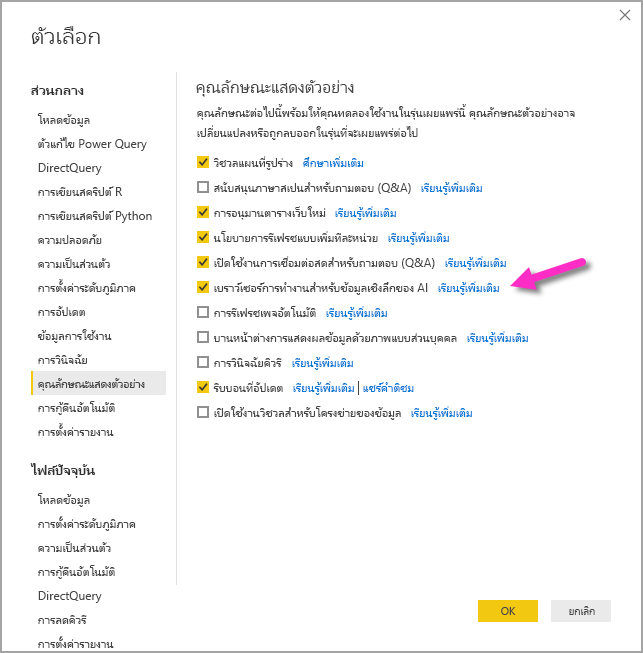

# ใช้ข้อมูลเชิงลึก AI ใน Power BI Desktop (ตัวอย่าง)

ใน Power BI คุณสามารถใช้ข้อมูลเชิงลึกของ AI  เพื่อเข้าถึงชุดการเรียนรู้ของเครื่องที่ผ่านการฝึกอบรมมาก่อนซึ่งจะช่วยในการเตรียมข้อมูลของคุณให้ดีขึ้น มีการเข้าถึงข้อมูลเชิงลึกของ AI ใน**ตัวแก้ไข Power Query** และฟีเจอร์และฟังก์ชันที่เกี่ยวข้องจะได้รับการเข้าถึงผ่านทาง**หน้าแรก**และ**เพิ่มคอลัมน์**ใน**ตัวแก้ไข Power Query** 

บทความนี้อธิบายฟังก์ชันสำหรับฟังก์ชันการวิเคราะห์ข้อความและการมองเห็นทั้งจากบริการทั้งคู่ของ  Azure นอกจากนี้ในบทความนี้เป็นส่วนที่อธิบายถึงฟังก์ชั่นที่กำหนดเองที่มีอยู่ใน Power BI จาก Azure Machine Learning

## วิธีเปิดใช้มูลเชิงลึกของ AI

มูลเชิงลึกของ AI ใน Power BI เป็นฟีเจอร์แสดงตัวอย่างและต้องเปิดใช้งาน หากต้องการเปิดใช้งานให้เลือก**ไฟล์ > ตัวเลือกและการตั้งค่า > ตัวเลือก** จากนั้นเลือก**แสดงตัวอย่างฟีเจอร์** จากคอลัมน์ด้านซ้าย ในหน้าต่างทางขวาคือการเลือก**เบราว์เซอร์การทำงานสำหรับข้อมูลเชิงลึกของ AI** ทำเครื่องหมายในช่องข้าง**เบราว์เซอร์การทำงานสำหรับข้อมูลเชิงลึกของ  AI** เพื่อเปิดใช้ฟีเจอร์แสดงตัวอย่าง คุณจะต้องรีสตาร์ท Power BI Desktop เพื่อให้การเปลี่ยนแปลงฟีเจอร์แสดงตัวอย่างมีผล

## การใช้การวิเคราะห์ข้อความและการมองเห็น

ด้วยการวิเคราะห์ข้อความและการมองเห็นใน Power BI คุณสามารถใช้อัลกอริทึมต่างๆ ได้จาก [Azure Cognitive Services](https://azure.microsoft.com/services/cognitive-services/) เพื่อเติมแต่งข้อมูลของคุณในการเตรียมข้อมูลด้วยตนเองสำหรับกระแสข้อมูล

บริการที่ได้รับการสนับสนุนมีดังต่อไปนี้:

* [การวิเคราะห์ความคิดเห็น](https://docs.microsoft.com/azure/cognitive-services/text-analytics/how-tos/text-analytics-how-to-sentiment-analysis)
* [การแยกวลีที่สำคัญ](https://docs.microsoft.com/azure/cognitive-services/text-analytics/how-tos/text-analytics-how-to-keyword-extraction)
* [การตรวจหาภาษา](https://docs.microsoft.com/azure/cognitive-services/text-analytics/how-tos/text-analytics-how-to-language-detection)
* [การแท็กรูปภาพ](https://docs.microsoft.com/azure/cognitive-services/computer-vision/concept-tagging-images) 

การแปลงข้อมูลจะดำเนินการบนบริการของ Power BI และไม่จำเป็นต้องมีการสมัครใช้งาน Azure Cognitive Services 

> [!IMPORTANT]
> 
> การใช้ฟีเจอร์การวิเคราะห์ข้อความหรือการมองเห็นจำเป็นต้องใช้ Power BI Premium

### การเปิดใช้งานการวิเคราะห์ข้อความและการมองเห็นบนกำลังการผลิตพรีเมียม

Cognitive Services ได้รับการรองรับโดยโหนดความจุพรีเมียม EM2, A2 หรือ P1 และสูงกว่านั้น โดยจะใช้ปริมาณงาน AI ที่แยกต่างหากบนความจุเพื่อเรียกใช้ Cognitive Services ในระหว่างการแสดงตัวอย่างสาธารณะ (ก่อนเดือนมิถุนายน 2019) ค่าเริ่มต้นได้ปิดการใช้งานปริมาณงาน ก่อนที่จะใช้ Cognitive Services ใน Power BI จำเป็นต้องเปิดการใช้งานปริมาณงาน  AI ใน**การตั้งค่าความจุ**ของพอร์ทัลผู้ดูแลระบบ คุณสามารถเปิดการใช้งาน**ปริมาณงาน  AI** ในส่วนของ**ปริมาณงาน** และกำหนดจำนวนสูงสุดของหน่วยความจำที่คุณต้องการให้ปริมาณงานนี้ใช้ได้ ขีดจำกัดหน่วยความจำที่แนะนำคือ 20% หากเกินขีดจำกัดนี้จะทำให้คิวรีช้าลง

### ฟังก์ชันที่พร้อมใช้งาน

ส่วนนี้จะอธิบายฟังก์ชันที่พร้อมใช้งานใน Cognitive Services ใน Power BI

#### ตรวจหาภาษา

ฟังก์ชันตรวจหาภาษาจะประเมินข้อมูลป้อนเข้าที่เป็นข้อความ โดยแต่ละเขตข้อมูลจะส่งกลับชื่อภาษาและตัวระบุ ISO ฟังก์ชันนี้เป็นประโยชน์ต่อคอลัมน์ข้อมูลที่รวบรวมข้อความที่กำหนดเองซึ่งไม่ทราบภาษา ฟังก์ชันคาดหวังข้อมูลในรูปแบบข้อความเป็นข้อมูลป้อนเข้า

การวิเคราะห์ข้อความสามารถตรวจหาได้มากถึง 120 ภาษา โปรดดู [ภาษาที่รองรับ](https://docs.microsoft.com/azure/cognitive-services/text-analytics/text-analytics-supported-languages) สำหรับข้อมูลเพิ่มเติม

#### แยกวลีหลัก

ฟังก์ชัน **การแยกวลีหลัก** จะประเมินข้อความที่ไม่มีโครงสร้าง โดยแต่ละเขตข้อมูลข้อความจะส่งกลับรายการของวลีหลัก ฟังก์ชันดังกล่าวจำเป็นต้องมีเขตข้อมูลข้อความเป็นข้อมูลป้อนเข้า และยังยอมรับข้อมูลป้อนเข้าเพิ่มเติมสำหรับ **Cultureinfo** ด้วยเช่นกัน

การแยกวลีหลักเหมาะสำหรับก้อนข้อความที่ใหญ่กว่า ซึ่งตรงข้ามกับการวิเคราะห์ความคิดเห็นที่เหมาะสำหรับก้อนข้อความที่เล็กกว่า โปรดพิจารณาการปรับโครงสร้างของข้อมูลป้อนเข้าให้สอดคล้องเพื่อให้ได้ผลลัพธ์ที่ดีที่สุดจากการดำเนินการทั้งสองรูปแบบ

#### ให้คะแนนความคิดเห็น

ฟังก์ชัน **ให้คะแนนความคิดเห็น** จะประเมินข้อมูลป้อนเข้าที่เป็นข้อความและส่งกลับคะแนนความคิดเห็นสำหรับแต่ละเอกสาร โดยคะแนนจะไล่เรียงจาก 0 (ลบ) ถึง 1 (บวก) ฟังก์ชันนี้เป็นประโยชน์สำหรับการตรวจจับความคิดเห็นที่เป็นบวก และลบในสื่อสังคม รีวิวจากลูกค้า และฟอรั่มการอภิปราย

การวิเคราะห์ข้อความจะใช้อัลกอริทึมการจัดประเภทการเรียนรู้เกี่ยวกับเครื่องเพื่อสร้างคะแนนความคิดเห็นระหว่าง 0 และ 1 คะแนนที่ใกล้กับ 1 แสดงถึงความคิดเห็นบวก ส่วนคะแนนที่ใกล้กับ 0 แสดงถึงความคิดเห็นลบ แบบจำลองจะได้รับการฝึกฝนด้วยเนื้อหาที่เกี่ยวข้องกับความคิดเห็นอย่างครอบคลุมไว้ล่วงหน้า ในปัจจุบัน ยังไม่สามารถให้ข้อมูลการฝึกของคุณเองได้ แบบจำลองจะใช้เทคนิคการผสมผสานระหว่างการวิเคราะห์ข้อความ รวมการประมวลผลข้อความ การวิเคราะห์ชนิดของคำ การวางตำแหน่งคำ และกลุ่มคำที่เกี่ยวข้องกัน โปรดดู [แนะนำการวิเคราะห์ข้อความ](https://blogs.technet.microsoft.com/machinelearning/2015/04/08/introducing-text-analytics-in-the-azure-ml-marketplace/) สำหรับข้อมูลเพิ่มเติมเกี่ยวกับอัลกอริทึม

การวิเคราะห์ความคิดเห็นจะดำเนินการบนเขตข้อมูลที่ป้อนเข้าทั้งหมดซึ่งตรงข้ามกับการแยกความคิดเห็นสำหรับเอนทิตีเฉพาะในข้อความ ในทางปฏิบัติ จะมีแนวโน้มสำหรับการให้คะแนนความแม่นยำเพื่อปรับปรุงเมื่อเอกสารมีหนึ่งหรือสองประโยคมากกว่าเป็นก้อนข้อความขนาดใหญ่ ระหว่างขั้นตอนการประเมินปรวิสัย แบบจำลองจะตัดสินว่า เขตข้อมูลที่ป้อนเข้าโดยรวมเป็นข้อเท็จจริงหรือความคิดเห็น ระบบจะไม่นำเขตข้อมูลที่ป้อนเข้าที่โดยส่วนใหญ่เป็นข้อเท็จจริงไปดำเนินการต่อในขั้นตอนการตรวจหาความคิดเห็น ดังนั้นระบบจะแสดงผลคะแนน .50 โดยไม่มีการประมวลผลต่อ ส่วนเขตข้อมูลที่ป้อนเข้าที่ดำเนินการต่อในไปป์ไลน์ ขั้นตอนถัดไปจะสร้างคะแนนที่สูงหรือต่ำกว่า .50 โดยขึ้นอยู่กับระดับระดับความคิดเห็นที่ตรวจพบในเขตข้อมูลที่ป้อนเข้า

ในปัจจุบัน การวิเคราะห์ความคิดเห็นรองรับภาษาอังกฤษ ภาษาเยอรมัน ภาษาสเปน และภาษาฝรั่งเศส ส่วนภาษาอื่นๆ ยังอยู่ในช่วงตัวอย่าง โปรดดู [ภาษาที่รองรับ](https://docs.microsoft.com/azure/cognitive-services/text-analytics/text-analytics-supported-languages) สำหรับข้อมูลเพิ่มเติม

#### แท็กรูปภาพ

ฟังก์ชัน **แท็กรูปภาพ** จะส่งกลับแท็กโดยยึดตามวัตถุ สิ่งมีชีวิต ทิวทัศน์ และการเคลื่อนไหวที่รู้จักมากกว่า 2,000 รายการ เมื่อแท็กไม่ชัดเจนหรือไม่ใช่ความรู้ทั่วไป ผลลัพธ์จะให้*ข้อมูล*เพื่ออธิบายความหมายของแท็กในบริบทของการตั้งค่าที่รู้จัก แท็กจะไม่ถูกจัดระเบียบเป็นการจัดหมวดหมู่ และจะไม่มีลำดับชั้นการสืบทอด คอลเลกชันของเนื้อหาแท็กจะสร้างพื้นฐานสำหรับ*คำอธิบาย* รูปภาพที่แสดงเป็นภาษาที่อ่านได้ของมนุษย์ซึ่งมีรูปแบบเป็นประโยคสมบูรณ์

หลังจากอัปโหลดรูปภาพหรือระบุ URL รูปภาพแล้ว ผลลัพธ์อัลกอริทึมคอมพิวเตอร์วิทัศน์จะแท็กโดยยึดตามวัตถุ สิ่งมีชีวิต และการเคลื่อนไหวที่ระบุในรูปภาพ แท็กไม่จำกัดเฉพาะเรื่องหลักๆ เช่น บุคคลในพื้นหน้า เท่านั้นแต่ยังรวมถึง ฉาก (ในร่มหรือกลางแจ้ง) เครื่องเรือน เครื่องมือ พืช สัตว์ เครื่องประดับ เครื่องมือเบ็ดเตล็ด และอื่นๆ

ฟังก์ชันนี้ต้องเป็น URL รูปภาพหรือเขตข้อมูล abase-64 ที่เป็นข้อมูลป้อนเข้า ในขณะนี้ การแท็กรูปภาพรองรับภาษาอังกฤษ ภาษาสเปน ภาษาญี่ปุ่น ภาษาโปรตุเกส และภาษาจีนแบบย่อ โปรดดู [ภาษาที่รองรับ](https://docs.microsoft.com/rest/api/cognitiveservices/computervision/tagimage/tagimage#uri-parameters) สำหรับข้อมูลเพิ่มเติม

### ฟังก์ชันการวิเคราะห์ข้อความเรียกหรือการมองเห็นใน Power Query

เพื่อเสริมสร้างข้อมูลของคุณด้วยฟังก์ชันการวิเคราะห์ข้อความหรือการมองเห็นของคุณ ให้เปิด**ตัวแก้ไข Power Query** ตัวอย่างนี้จะแสดงการให้คะแนนความคิดเห็นของข้อความ คุณสามารถใช้ขั้นตอนเดียวกันในการแยกวลีหลัก ตรวจหาภาษา และแท็กรูปได้

เลือกปุ่ม**การวิเคราะห์ข้อความ**ใน**หน้าหลัก**หรือ**เพิ่ม คอลัมน์ริบบิ้น** คุณจะได้รับแจ้งให้ลงชื่อเข้าใช้

หลังจากลงชื่อเข้าใช้แล้วให้เลือกฟังก์ชันที่คุณต้องการนำเข้าและคอลัมน์ข้อมูลที่คุณต้องการแปลงในหน้าต่างแบบป๊อปอัพ

Power BI เลือกความจุพรีเมียมในการเรียกใช้ฟังก์ชันและส่งผลลัพธ์กลับไปยัง Power BI Desktop กำลังการผลิตจะใช้สำหรับฟังก์ชันการวิเคราะห์ข้อความและการมองเห็นในระหว่างแอปพลิเคชันและการรีเฟรชใน Power BI Desktop เท่านั้น เมื่อมีการเผยแพร่รายงาน ให้รีเฟรชการทำงานบนความจุ Premium ของพื้นที่ทำงานที่มีการเผยแพร่รายงาน คุณสามารถเปลี่ยนความจุที่ใช้สำหรับบริการด้านความรู้ทั้งหมดในดร็อปดาวน์ในมุมล่างซ้ายของหน้าต่างป๊อปอัพ

**Cultureinfo** เป็นข้อมูลป้อนเข้าเพิ่มเติมเพื่อระบุภาษาของข้อความ เขตข้อมูลนี้คือรหัส ISO คุณสามารถใช้คอลัมน์เป็นข้อมูลป้อนเข้าสำหรับ Cultureinfo หรือเขตข้อมูลแบบคงที่ได้ ในตัวอย่างนี้ ภาษาที่ระบุสำหรับทั้งคอลัมน์คือภาษาอังกฤษ (en) หากคุณปล่อยให้เขตข้อมูลนี้ว่าง Power BI จะตรวจหาภาษาโดยอัตโนมัติก่อนที่จะใช้ฟังก์ชัน จากนั้นเลือก**นำไปใช้**

ในครั้งแรกที่คุณใช้ข้อมูลเชิงลึกของ AI ในแหล่งข้อมูลใหม่คุณจะได้รับการแจ้งเตือนให้ตั้งค่าระดับความเป็นส่วนตัวของข้อมูลของคุณ

> [!NOTE]
> การรีเฟรชชุดข้อมูลใน Power BI จะทำงานกับแหล่งข้อมูลที่มีการตั้งค่าระดับความเป็นส่วนตัวเป็นสาธารณะหรือองค์กรเท่านั้น

หลังจากการเรียกฟังก์ชัน ระบบจะเพิ่มผลลัพธ์เป็นคอลัมน์ใหม่ลงในตาราง และระบบจะเพิ่มการแปลงข้อมูลเป็นขั้นตอนที่นำไปใช้ในคิวรีด้วยเช่นกัน

ในกรณีที่มีการแท็กรูปภาพและการแยกวลี คีย์ผลลัพธ์สามารถส่งกลับค่าหลายค่าได้ ผลลัพธ์แต่ละรายการจะถูกส่งคืนด้วยซ้ำของแถวเดิม

### การเผยแพร่รายงานที่มีฟังก์ชันการวิเคราะห์ข้อความหรือการมองเห็น

166/5000
ในขณะที่แก้ไขใน Power Query และดำเนินการรีเฟรชใน Power BI Desktop การวิเคราะห์ข้อความและการมองเห็นใช้ความจุพรีเมียมที่ถูกเลือกในเครื่องมือแก้ไข Power Query หลังจากเผยแพร่รายงานไปยัง Power BI แล้วจะใช้ความจุแบบพรีเมียมของพื้นที่ทำงานที่มีการเผยแพร่

รายงานที่มีฟังก์ชั่นการวิเคราะห์ข้อความและการมองเห็นควรได้รับการเผยแพร่ไปยังพื้นที่ทำงานที่ไม่ได้อยู่ในความสามารถระดับพรีเมียมมิ ฉะนั้นการรีเฟรชชุดข้อมูลจะล้มเหลว

### การจัดการผลกระทบจากความจุพรีเมียม

ส่วนต่อไปนี้อธิบายวิธีที่คุณสามารถจัดการผลกระทบของการวิเคราะห์ข้อความและการมองเห็นในความจุ

#### การเลือกความจุ

ผู้เขียนรายงานสามารถเลือกความจุพรีเมียมที่จะเรียกใช้ข้อมูลเชิงลึกของ AI ได้ ตามค่าเริ่มต้น Power BI จะเลือกความจุที่สร้างขึ้นครั้งแรกที่ผู้ใช้มีสิทธิ์เข้าถึง

#### การตรวจสอบด้วยแอปการวัดความจุ

เจ้าของความจุพรีเมียมสามารถตรวจสอบผลกระทบของฟังก์ชันการวิเคราะห์ข้อความและการมองเห็นในความจุด้วยแอปเมตริกความจุของ [Power BI Premium](../admin/service-admin-premium-monitor-capacity.md) ได้ แอปจะแสดงรายละเอียดการวัดสถานภาพของชุดข้อมูลภายในความจุของคุณ แผนภูมิด้านบนแสดงปริมาณการใช้หน่วยความจำตามปริมาณงาน  AI ผู้ดูแลความจุ Premium สามารถตั้งค่าขีดจำกัดหน่วยความจำสำหรับปริมาณงาน  AI ต่อความจุได้ เมื่อการใช้งานหน่วยความจำถึงขีดจำกัดหน่วยความจำ คุณสามารถพิจารณาเพิ่มขีดจำกัดของหน่วยความจำหรือย้ายพื้นที่ทำงานบางอย่างไปยังความจุอื่นได้

### กำลังเปรียบเทียบ Power Query และ Power Query ออนไลน์

ฟังก์ชันการวิเคราะห์ข้อความและการมองเห็นที่ใช้ใน Power Query และ Power Query ออนไลน์เหมือนกัน ความแตกต่างระหว่างประสบการณ์มีดังต่อไปนี้:

* Power Query มีปุ่มแยกต่างหากสำหรับการวิเคราะห์ข้อความวิสัยทัศน์และ Azure Machine Learning ใน Power Query ออนไลน์ รายการเหล่านี้จะถูกรวมอยู่ในหนึ่งเมนู
* ใน Power Query ผู้สร้างรายงานสามารถเลือกความจุพรีเมียมที่ใช้ในการเรียกใช้ฟังก์ชันได้ ไม่จำเป็นต้องใช้ใน Power Query ออนไลน์เนื่องจาก dataflow มีอยู่บนความจุที่ระบุอยู่แล้ว

### ข้อควรพิจารณาและข้อจำกัดของบการวิเคราะห์ข้อความ

มีข้อควรพิจารณาและข้อจำกัดสองสามข้อที่ควรทราบเมื่อใช้การวิเคราะห์ข้อความ:

* การรีเฟรชแบบเพิ่มหน่วยได้รับการสนับสนุน แต่สามารถทำให้เกิดปัญหาด้านประสิทธิภาพเมื่อใช้กับแบบสอบถามที่มีข้อมูลเชิงลึก AI
* ไม่สนับสนุน Direct Query

## การใช้  Azure  ML

องค์กรมากมายใช้แบบจำลอง **Machine Learning** เพื่อข้อมูลเชิงลึกและการคาดการณ์เกี่ยวกับธุรกิจของตนเองที่ดีกว่า ความสามารถในการแสดงผลด้วยภาพจากแบบจำลองเหล่านี้ในรายงานและแดชบอร์ดรวมถึงการวิเคราะห์อื่นๆ ของคุณสามารถช่วยเผยแพร่ข้อมูลเชิงลึกเหล่านี้ให้แก่ผู้ใช้ทางธุรกิจที่ต้องการมากที่สุดได้ Power BI ช่วยให้การรวมข้อมูลเชิงลึกจากแบบจำลองที่โฮสต์บน Azure Machine Learning ได้อย่างง่ายดายโดยใช้ลักษณะการชี้และคลิกโดยตรง

หากต้องการใช้ความสามารถนี้ นักวิทยาศาสตร์ข้อมูลสามารถให้สิทธิ์เข้าถึงแบบจำลอง Azure ML ไปยังนักวิเคราะห์ BI โดยใช้พอร์ทัล Azure ได้อย่างง่ายดาย จากนั้น ณ จุดเริ่มต้นของแต่ละเซสชัน Power Query จะค้นพบแบบจำลอง Azure MLทั้งหมดที่ผู้ใช้ได้เข้าถึง และแสดงเป็นฟังก์ชัน Power Query แบบไดนามิก จากนั้นผู้ใช้จะสามารถเรียกใช้ฟังก์ชันเหล่านั้นโดยการเข้าถึงจาก Ribbon ในตัวแก้ไข Power Query หรือโดยการเรียกฟังก์ชัน M โดยตรง นอกจากนี้ Power BI ยังรวมคำขอการเข้าถึงโดยอัตโนมัติเมื่อเรียกแบบจำลอง Azure ML สำหรับชุดของแถวเพื่อบรรลุประสิทธิภาพการทำงานที่ดีกว่า

ฟังก์ชันนี้จะได้รับการรองรับเฉพาะกระแสข้อมูล Power BI และ Power Query แบบออนไลน์ในบริการของ Power BI

หากต้องการเรียนรู้เพิ่มเติมเกี่ยวกับกระแสข้อมูล โปรดดู [การเตรียมข้อมูลด้วยตนเองใน Power BI](service-dataflows-overview.md)

หากต้องการเรียนรู้เพิ่มเติมเกี่ยวกับ Azure Machine Learning โปรดดูบทความต่อไปนี้:

- ภาพรวม: [Azure Machine Learning คืออะไร](https://docs.microsoft.com/azure/machine-learning/service/overview-what-is-azure-ml)
- เริ่มต้นใช้งานด่วนและบทช่วยสอนสำหรับ Azure Machine Learning: [เอกสารประกอบ Azure Machine Learning](https://docs.microsoft.com/azure/machine-learning/)

### ให้สิทธิ์การเข้าถึงแบบจำลอง Azure  ML

หากต้องการเข้าถึงแบบจำลอง Azure ML จาก Power BI ผู้ใช้จะต้องมีการสมัครใช้งาน Azure ที่มีการเข้าถึงแบบ **อ่าน** นอกจากนี้พวกเขาจะต้องมีสิ่งต่อไปนี้:

- สำหรับแบบจำลอง Machine Learning Studio (คลาสสิก) ต้องใช้การเข้าถึงแบบ **อ่าน** สำหรับบริการบนเว็บ Machine Learning Studio (คลาสสิก)
- สำหรับแบบจำลอง Machine Learning ต้องใช้การเข้าถึงแบบ **อ่าน** สำหรับพื้นที่ทำงาน Machine Learning

ขั้นตอนในบทความนี้จะอธิบายวิธีให้สิทธิ์ใช้งานแก่ผู้ใช้ Power BI ในการเข้าถึงแบบจำลองที่โฮสต์บนบริการ Azure ML เพื่อให้ผู้ใช้สามารถเข้าถึงแบบจำลองนี้เป็นฟังก์ชัน Power Query โปรดดู [จัดการการเข้าถึง RBAC และพอร์ทัล Azure](https://docs.microsoft.com/azure/role-based-access-control/role-assignments-portal) สำหรับรายละเอียดอื่นๆ

1. ลงชื่อเข้าใช้ไปยัง [พอร์ทัล Azure](https://portal.azure.com/)
2. ไปที่หน้า **การสมัครใช้งาน** คุณสามารถค้นหาหน้า **การสมัครใช้งาน** ผ่านรายการ **บริการทั้งหมด** ในเมนูนำทางด้านซ้ายของพอร์ทัล Azure
3. เลือกการสมัครใช้งานของคุณ
4. เลือก **ควบคุมการเข้าถึง (IAM)** แล้วเลือกปุ่ม **เพิ่ม**
5. เลือกบทบาทเป็น **ผู้อ่าน** เลือกผู้ใช้ Power BI ที่คุณต้องการให้สิทธิ์เข้าถึงแบบจำลอง Azure ML
6. เลือก**บันทึก**
7. ทำซ้ำขั้นตอนที่สามถึงหกเพื่อให้สิทธิ์การเข้าถึงแบบ **ผู้อ่าน** แก่ผู้ใช้สำหรับบริการบนเว็บ Machine Learning Studio (คลาสสิก) ที่เจาะจง *หรือ* พื้นที่ทำงาน Machine Learning ที่โฮสต์แบบจำลอง

### การค้นพบ Schema สำหรับแบบจำลอง Machine Learning

นักวิทยาศาสตร์ข้อมูลใช้ Python เป็นหลักเพื่อพัฒนาหรือแม้กระทั่งปรับใช้ แบบจำลองการเรียนรู้ของเครื่องของพวกเขาสำหรับ Machine Learning ซึ่งต่างจาก Machine Learning Studio (คลาสสิก) ซึ่งช่วยให้งานการสร้างไฟล์ Schema สำหรับแบบจำลองเป็นไปโดยอัตโนมัติ ในกรณีของ Machine Learning นักวิทยาศาสตร์ข้อมูลต้องสร้างไฟล์ Schema อย่างชัดเจนโดยใช้ Python

ไฟล์ Schema นี้ต้องอยู่ในบริการเว็บที่ปรับใช้สำหรับแบบจำลอง Machine Learning หากต้องการสร้าง Schema สำหรับบริการเว็บโดยอัตโนมัติ คุณต้องใส่ตัวอย่างของอินพุท/เอาท์พุทในสคริปต์รายการสำหรับแบบจำลองที่ปรับใช้ โปรดดูที่หัวข้อย่อยเกี่ยวกับการสร้าง Schema ของ Swagger แบบอัตโนมัติ [(ไม่บังคับ) ในแบบจำลองการปรับใช้ด้วยเอกสารบริการ Azure Machine Learning](https://docs.microsoft.com/azure/machine-learning/how-to-deploy-and-where#optional-define-model-web-service-schema) ลิงก์มีสคริปต์รายการตัวอย่างด้วยคำสั่งสำหรับการสร้าง Schema

โดยเฉพาะ _@input\_schema_ และ _@output\_schema_ ฟังก์ชันในสคริปต์รายการการอ้างอิงรูปแบบตัวอย่างการป้อนข้อมูลและเอาท์พุทในการ ป้อนข้อมูล _ตัวอย่าง\_และ_การแสดงผลลัพธ _ตัวอย่าง\_และใช้ตัว_อย่างเหล่านี้เพื่อสร้างข้อมูลจำเพาะ OpenAPI (Swagger) สำหรับบริการเว็บในระหว่างการปรับใช้

คำแนะนำเหล่านี้สำหรับการสร้าง Schema โดยการอัปเดตสคริปต์รายการจะต้องนำไปใช้กับแบบจำลองที่สร้างขึ้นโดยใช้การทดสอบการเรียนรู้ของเครื่องอัตโนมัติโดยใช้ Azure Machine Learning SDK

> [!NOTE]
> แบบจำลองที่สร้างขึ้นโดยใช้อินเทอร์เฟสการแสดงผลด้วยภาพของ Azure Machine Learning ปัจจุบันไม่รองรับการสร้าง Schema แต่จะรองรับในรุ่นต่อ ๆ มา
> 
### การเรียกแบบจำลอง Azure  ML ใน Power BI

คุณสามารถเรียกแบบจำลอง Azure ML ใดๆ ที่คุณได้รับสิทธิ์เข้าถึงได้ โดยตรงจากตัวแก้ไข Power Query ในการเข้าถึงแบบจำลอง Azure ML ให้เลือกปุ่ม **Azure Machine Learning** ใน**หน้าแรก**หรือ**เพิ่มคอลัมน์**ริบบิ้นในตัวแก้ไข Power Query

แบบจำลอง  Azure  ML ทั้งหมดที่คุณสามารถเข้าถึงได้จะแสดงที่นี่เป็นฟังก์ชัน Power Query นอกจากนี้ พารามิเตอร์ที่ป้อนเข้าสำหรับแบบจำลอง Azure ML จะแมปเป็นพารามิเตอร์ของฟังก์ชัน Power Query ที่สอดคล้องกันโดยอัตโนมัติ

หากต้องการเรียกแบบจำลอง Azure ML คุณสามารถระบุคอลัมน์ของเอนทิตีที่เลือกใดๆ ก็ได้ เป็นข้อมูลป้อนเข้าจากดรอปดาวน์ นอกจากนี้คุณยังสามารถระบุค่าคงที่เพื่อใช้เป็นข้อมูลป้อนเข้าได้ โดยสลับไอคอนคอลัมน์ไปทางซ้ายของกล่องโต้ตอบที่ป้อนเข้า

เลือก **ตกลง** เพื่อดูตัวอย่างผลลัพธ์ของแบบจำลอง Azure  ML เป็นคอลัมน์ใหม่ในตารางเอนทิตี นอกจากนี้คุณจะเห็นการเรียกแบบจำลองเป็นขั้นตอนที่นำไปใช้สำหรับคิวรี

หากแบบจำลองส่งกลับพารามิเตอร์ผลลัพธ์หลายรายการ พารามิเตอร์เหล่านั้นจะถูกจัดกลุ่มเข้าด้วยกันเป็นระเบียนในคอลัมน์ผลลัพธ์ คุณสามารถขยายคอลัมน์เพื่อสร้างแต่ละพารามิเตอร์ผลลัพธ์ในคอลัมน์แยกต่างหากได้

### ข้อควรพิจารณาและข้อจำกัด Azure  ML

ข้อควรพิจารณาและขีดจำกัดต่อไปนี้นำไปใช้กับ Azure ML ใน Power BI Desktop

* แบบจำลองที่สร้างขึ้นโดยใช้อินเทอร์เฟสการแสดงผลด้วยภาพของ Azure Machine Learning ปัจจุบันไม่รองรับการสร้าง Schema คาดการณ์การสนับสนุนในรุ่นต่อๆ ไป
* การรีเฟรชแบบเพิ่มหน่วยได้รับการสนับสนุน แต่สามารถทำให้เกิดปัญหาด้านประสิทธิภาพเมื่อใช้กับแบบสอบถามที่มีข้อมูลเชิงลึก AI
* ไม่สนับสนุน Direct Query

## ขั้นตอนถัดไป

บทความนี้จะให้ภาพรวมของการรวม  Machine Learning ลงในบริการ Power BI Desktop บทความต่อไปนี้อาจน่าสนใจและเป็นประโยชน์สำหรับคุณ

- [บทช่วยสอน: เรียกใช้แบบจำลอง Machine Learning Studio (คลาสสิก) ใน Power BI](../connect-data/service-tutorial-invoke-machine-learning-model.md)
- [บทช่วยสอน: การใช้ Cognitive Services ใน Power BI](../connect-data/service-tutorial-use-cognitive-services.md)
- [Cognitive Services ใน Power BI](service-cognitive-services.md)
- [การรวม Azure Machine Learning ใน Power BI](service-machine-learning-integration.md)
- [ตรวจสอบความจุพรีเมียมด้วยแอป](../admin/service-admin-premium-monitor-capacity.md)
- [เมตริก AI ที่พร้อมใช้งานในแอปเมตริกความจุพรีเมียม](https://powerbi.microsoft.com/blog/ai-metrics-now-available-in-power-bi-premium-capacity-metrics-app/)
