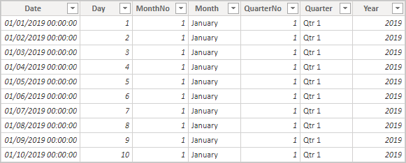
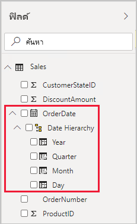
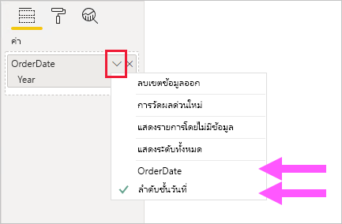
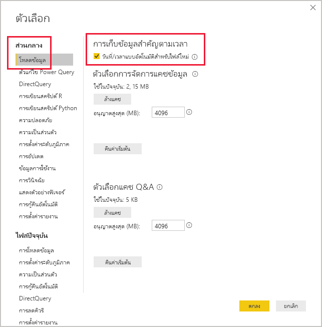

# <a name="apply-auto-datetime-in-power-bi-desktop"></a>ใช้วันที่/เวลาอัตโนมัติใน Power BI Desktop

บทความนี้มุ่งเป้าหมายไปที่เรื่อง ตัวสร้างแบบจำลองข้อมูลที่พัฒนามาจากแบบจำลองนำเข้าหรือแบบจำลองผสมใน Power BI Desktop ซึ่งจะแนะนำและอธิบายตัวเลือก_วันที่/เวลาอัตโนมัติ_

วันที่/เวลาอัตโนมัติ เป็นตัวเลือกการโหลดข้อมูลใน Power BI Desktop วัตถุประสงค์ของตัวเลือกนี้คือ การสนับสนุนการรายงานตัวแสดงเวลาที่สะดวกโดยยึดตามคอลัมน์วันที่ที่โหลดลงในแบบจำลอง โดยเฉพาะจะช่วยให้ผู้สร้างรายงานใช้แบบจำลองข้อมูลของคุณเพื่อกรองจัดกลุ่มและเจาะรายละเอียดแนวลึกโดยใช้ช่วงเวลาในปฏิทิน (ปี ไตรมาส เดือน และวัน) สิ่งสำคัญคืออะไรที่คุณไม่จำเป็นต้องพัฒนาความสามารถตัวแสดงเวลาเหล่านี้อย่างชัดเจน

เมื่อเปิดใช้งานตัวเลือกนี้แล้ว Power BI Desktop สร้างตารางวันที่/เวลาอัตโนมัติที่ซ่อนอยู่สำหรับแต่ละคอลัมน์วันที่ โดยมีเงื่อนไขดังต่อไปนี้เป็นจริงทั้งหมด:

- โหมดที่เก็บข้อมูลของตารางคือ นำเข้า
- ชนิดข้อมูลของคอลัมน์คือ วันที่ หรือวันที่/เวลา
- คอลัมน์ไม่ได้อยู่ในด้าน "กลุ่ม" ของความสัมพันธ์ในแบบจำลอง

## <a name="how-it-works"></a>วิธีการทำงาน

อันที่จริงแล้ว ตารางวันที่/เวลาอัตโนมัติเป็น [ตารางจากการคำนวณ](desktop-calculated-tables.md) ที่สร้างแถวของข้อมูลโดยใช้ฟังก์ชัน [CALENDAR](/dax/calendar-function-dax) DAX แต่ละตารางประกอบด้วยคอลัมน์จากการคำนวณ 6 คอลัมน์: **Day**, **MonthNo**, **Month**, **QuarterNo**, **Quarter** และ **Year**

> [!NOTE]
> Power BI แปลและจัดรูปแบบชื่อคอลัมน์และค่าต่าง ๆ ตาม[ภาษาของแบบจำลอง](../fundamentals/supported-languages-countries-regions.md#choose-the-language-for-the-model-in-power-bi-desktop) ตัวอย่างเช่น หากแบบจำลองถูกสร้างขึ้นโดยใช้ภาษาอังกฤษ แบบจำลองดังกล่าวจะยังคงแสดงชื่อเดือนและอื่น ๆ ในภาษาอังกฤษ แม้ว่าจะดูด้วยไคลเอ็นต์ภาษาเกาหลีก็ตาม

นอกจากนี้ Power BI Desktop ยังสร้างความสัมพันธ์ระหว่างคอลัมน์**วันที่**ของตารางวันที่/เวลาอัตโนมัติ และคอลัมน์วันที่ของแบบจำลองด้วย

ตารางวันที่/เวลาอัตโนมัติประกอบด้วยปีปฏิทินที่ครอบคลุมค่าวันที่ทั้งหมดที่ถูกเก็บไว้ในคอลัมน์วันที่ของแบบจำลอง ตัวอย่างเช่น หากค่าแรกเริ่มในคอลัมน์วันที่คือ 20 มีนาคม 2016 และค่าล่าสุดคือ 23 ตุลาคม 2019 ตารางจะประกอบด้วย 1,461 แถว ซึ่งแสดงให้เห็นว่า หนึ่งแถวสำหรับหนึ่งวันในสี่ปีปฏิทินตั้งแต่ 2016 ถึง 2019 เมื่อ Power BI รีเฟรชแบบจำลอง ตารางวันที่/เวลาแต่ละอันจะถูกรีเฟรชโดยอัตโนมัติไปด้วย ด้วยวิธีนี้ แบบจำลองจะมีวันที่ที่ตามวันที่ของค่าคอลัมน์เสมอ

หากคุณสามารถมองเห็นแถวของตารางวันที่/เวลาอัตโนมัติได้ แถวดังกล่าวจะมีลักษณะดังนี้:



> [!NOTE]
> ตารางวันที่/เวลาอัตโนมัติถูกซ่อนอย่างถาวร แม้ว่าจะมาจากตัวสร้างแบบจำลองก็ตาม ซึ่งคุณจะไม่สามารถเห็นตารางดังกล่าวได้ในบานหน้าต่าง **เขตข้อมูล** หรือไดอะแกรมมุมมองแบบจำลอง และไม่สามารถมองเห็นแถวของตารางในมุมมองข้อมูลอีกด้วย นอกจากนี้ ตารางและคอลัมน์ของตารางไม่สามารถอ้างอิงโดยตรงด้วยนิพจน์ DAX
>
> นอกจากนี้ คุณยังไม่สามารถทำงานกับไฟล์เหล่านั้นได้เมื่อใช้ [วิเคราะห์ใน Excel](../collaborate-share/service-analyze-in-excel.md)หรือเชื่อมต่อกับแบบจำลองโดยใช้ตัวดีไซเนอร์รายงานที่ไม่ใช่ Power BI

ตารางนี้ยังกำหนดลำดับชั้นโดยจัดทำวิชวลเส้นทางที่มีการเจาะลึกลงไปตามระดับปี ไตรมาส เดือน และวัน

หากคุณสามารถมองเห็นตารางวันที่/เวลาอัตโนมัติในแผนภาพมุมมองแบบจำลองได้ ตารางดังกล่าวจะมีลักษณะดังนี้ (คอลัมน์ที่เกี่ยวข้องจะถูกไฮไลท์):


## <a name="work-with-auto-datetime"></a>การทำงานกับวันที่/เวลาอัตโนมัติ

เมื่อมีตารางวันที่/เวลาอัตโนมัติสำหรับคอลัมน์วันที่ (และคอลัมน์นั้นปรากฏให้เห็น) ผู้เขียนรายงานจะไม่พบคอลัมน์นั้นเป็นเขตข้อมูลในบานหน้าต่าง **เขตข้อมูล** แต่ผู้เขียนรายงานจะค้นพบออบเจ็กต์ที่สามารถขยายได้ที่มีชื่อคอลัมน์วันที่ คุณสามารถระบุได้อย่างง่ายดายเพราะมีการประดับด้วยไอคอนปฏิทิน เมื่อผู้สร้างรายงานขยายออบเจ็กต์ปฏิทิน พวกเขาจะพบลำดับชั้นที่ชื่อว่า **ลำดับชั้นวันที่** หลังจากที่พวกเขาขยายลำดับชั้นแล้ว พวกเขาจะพบสี่ระดับ: **ปี**, **ไตรมาส**, **เดือน** และ **วัน**



ลำดับชั้นที่สร้างโดยวันที่/เวลาอัตโนมัติสามารถใช้เพื่อกำหนดค่าวิชวลในลักษณะเดียวกับที่สามารถใช้กับลำดับชั้นปกติได้ คุณสามารถกำหนดค่าวิชวลได้โดยใช้ลำดับชั้นที่ชื่อว่า **ลำดับชั้นวันที่** ทุกระดับ หรือระดับเฉพาะเจาะจงในลำดับชั้น

อย่างไรก็ตาม มีอีกหนึ่งความสามารถที่เพิ่มเข้ามาซึ่งไม่ได้รับการสนับสนุนโดยลำดับชั้นปกติ เมื่อมีการเพิ่มลำดับชั้นของวันที่/เวลาอัตโนมัติ—หรือเพิ่มระดับหนึ่งจากลำดับชั้น—ไปยังพื้นที่วิชวล ผู้เขียนรายงานสามารถสลับระหว่างการใช้ลำดับชั้นหรือคอลัมน์วันที่ได้ วิธีการนี้เหมาะสมสำหรับวิชวลบางวิชวล เมื่อพวกเขาต้องการเพียงคอลัมน์วันที่ ไม่ใช่ลำดับชั้นและระดับของลำดับชั้น พวกเขาเริ่มต้นด้วยการกำหนดค่าเขตข้อมูลวิชวล (คลิกขวาที่เขตข้อมูลวิชวลหรือคลิกลูกศรชี้ลง) จากนั้นใช้เมนูบริบทเพื่อสลับระหว่างคอลัมน์วันที่หรือลำดับชั้นวันที่



สุดท้าย การคำนวณแบบจำลองที่เขียนด้วย DAX สามารถอ้างอิงคอลัมน์วันที่_โดยตรง_ หรือคอลัมน์ในตารางวันที่/เวลาอัตโนมัติที่ซ่อนอยู่_โดยทางอ้อม_

สูตรที่เขียนใน Power BI Desktop สามารถอ้างอิงคอลัมน์วันที่ได้ตามปกติ อย่างไรก็ตาม ต้องมีการอ้างอิงคอลัมน์ของตารางวันที่/เวลาอัตโนมัติโดยใช้ไวยากรณ์เพิ่มเติมแบบพิเศษ คุณเริ่มต้นด้วยการอ้างอิงถึงคอลัมน์วันที่ก่อน แล้วตามด้วยจุด (.) จากนั้น คุณลักษณะเติมแถบสูตรอัตโนมัติจะช่วยให้คุณสามารถเลือกคอลัมน์จากตารางวันที่/เวลาอัตโนมัติได้

![ตัวอย่างของการป้อนนิพจน์การวัด DAX ในแถบสูตร จนถึงตอนนี้ สูตรอ่านได้เป็น Date Count = COUNT(Sales[OrderDate] และรายการเติมสูตรอัตโนมัติแสดงคอลัมน์จากตารางวันที่/เวลาอัตโนมัติที่ซ่อนไว้ทั้งหมดเจ็ดคอลัมน์ คอลัมน์เหล่านี้ประกอบด้วย: Date, Day, Month, MonthNo, Quarter, QuarterNo และ Year](media/desktop-auto-date-time/auto-date-time-dax-auto-complete.png)

ใน Power BI Desktop นิพจน์การวัดที่ถูกต้องสามารถอ่านได้:

```dax
Date Count = COUNT(Sales[OrderDate].[Date])
```

> [!NOTE]
> แม้ว่านิพจน์การวัดนี้จะใช้ได้ใน Power BI Desktop แต่ก็ไม่ถูกต้องตามหลักไวยากรณ์ของ DAX ภายใน Power BI Desktop สลับเปลี่ยนแถวกับคอลัมน์นิพจน์ของคุณเพื่ออ้างอิงคอลัมน์วันที่/เวลาอัตโนมัติจริง (ซ่อนอยู่)

## <a name="configure-auto-datetime-option"></a>กำหนดค่าตัวเลือกวันที่/เวลาอัตโนมัติ

วันที่/เวลาอัตโนมัติสามารถกำหนดค่า _ส่วนกลาง_ หรือสำหรับ_ไฟล์ปัจจุบัน_ ตัวเลือกส่วนกลางจะนำไปใช้กับไฟล์ Power BI Desktop ใหม่ และสามารถเปิดหรือปิดตัวเลือกนี้ได้ทุกเมื่อ สำหรับการติดตั้ง Power BI Desktop ใหม่ ค่าเริ่มต้นของตัวเลือกทั้งสองคือ เปิด

นอกจากนี้ ตัวเลือกไฟล์ปัจจุบันยังสามารถเปิดหรือปิดได้ทุกเมื่ออีกด้วย เมื่อเปิดอยู่ ตารางวันที่/เวลาอัตโนมัติจะถูกสร้างขึ้น เมื่อปิดอยู่ ตารางวันที่/เวลาอัตโนมัติใดก็ตามจะถูกลบออกจากแบบจำลอง

> [!CAUTION]
> โปรดระวังเมื่อคุณปิดตัวเลือกไฟล์ปัจจุบันเนื่องจากจะเป็นการลบตารางวันที่/เวลาอัตโนมัติ ตรวจสอบให้แน่ใจว่าได้มีการแก้ไขตัวกรองรายงานที่เสียหาย หรือวิชวลที่ได้รับการกำหนดค่าแล้วให้ใช้งานได้

ใน Power BI Desktop ให้คุณเลือก _ไฟล์ > ตัวเลือกและการตั้งค่า > ตัวเลือก_ จากนั้นเลือกหน้า **ส่วนกลาง** หรือ **ไฟล์ปัจจุบัน** ในหน้าใดหน้าหนึ่ง ตัวเลือกนี้มีอยู่ในส่วน **ตัวแสดงเวลา**



## <a name="next-steps"></a>ขั้นตอนถัดไป

สำหรับข้อมูลเพิ่มเติมที่เกี่ยวข้องกับบทความนี้ โปรดดูทรัพยากรต่อไปนี้:

- [คำแนะนำวันที่/เวลาอัตโนมัติใน Power BI Desktop](../guidance/auto-date-time.md)
- [สร้างตารางวันที่ใน Power BI Desktop](../guidance/model-date-tables.md)
- [ตั้งค่า และใช้งานตารางวันที่ใน Power BI Desktop](desktop-date-tables.md)
- มีคำถามหรือไม่ [ลองถามชุมชน Power BI](https://community.powerbi.com/)
- มีข้อเสนอแนะไหม [สนับสนุนแนวคิดในการปรับปรุง Power BI](https://ideas.powerbi.com/)
