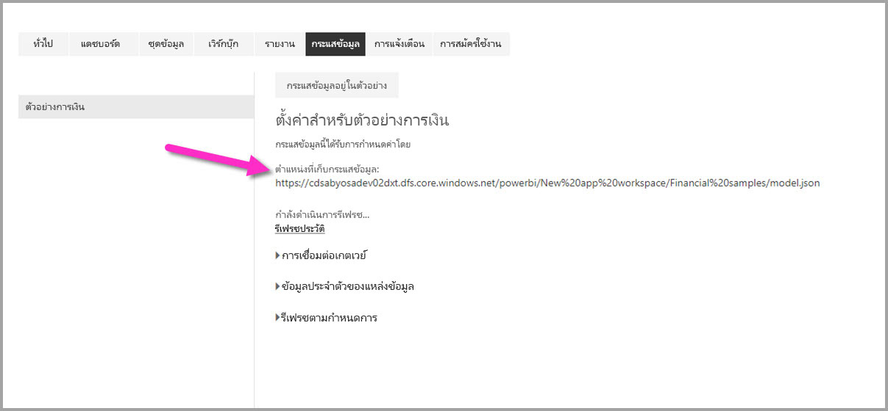

# เชื่อมต่อกับข้อมูลที่สร้างขึ้นโดย Power Platform กระแสข้อมูลใน Power BI Desktop
ใน **Power BI Desktop** คุณสามารถเชื่อมต่อกับ **กระแสข้อมูล Power Platform** เช่นเดียวกับแหล่งข้อมูลอื่นใน Power BI Desktop ได้

ตัวเชื่อมต่อ**กระแสข้อมูล Power Platform** จะให้คุณได้เชื่อมต่อกับเอนทิตีที่สร้างโดยกระแสข้อมูลในบริการของ Power BI 

## ข้อควรพิจารณาและข้อจำกัด

หากต้องการใช้ **ตัวเชื่อมต่อกระแสข้อมูล Power Platform** คุณต้องใช้ **Power BI Desktop**รุ่นล่าสุด คุณสามารถ[ดาวน์โหลด Power BI Desktop](../fundamentals/desktop-get-the-desktop.md) ได้ทุกเมื่อ และติดตั้งบนคอมพิวเตอร์ของคุณ เพื่อให้แน่ใจว่าคุณมีรุ่นล่าสุด  

> [!NOTE]
> ตัวเชื่อมต่อกระแสข้อมูล Power Platform เวอร์ชันก่อนหน้ากำหนดให้คุณดาวน์โหลดไฟล์ .MEZ และวางไว้ในโฟลเดอร์ **Power BI Desktop**เวอร์ชันปัจจุบันมีตัวเชื่อมต่อกระแสข้อมูล Power Platform เพื่อไม่ต้องใช้ไฟล์นั้นอีกต่อไปและไม่ให้เกิดปัญหากับตัวเชื่อมต่อเวอร์ชันที่รวมมาด้วย หาคุณวางไฟล์ .MEZ ไว้ในโฟลเดอร์ด้วยตัวเอง คุณ*ต้อง*ลบไฟล์ .MEZ ที่ดาวน์โหลดมาออกจากโฟลเดอร์ **เอกสาร > Power BI Desktop > ตัวเชื่อมต่อแบบกำหนดเอง** 

## ประสิทธิภาพการทำงานของ Desktop
**Power BI Desktop** ทำงานภายในเครื่องบนคอมพิวเตอร์ที่มีติดตั้งโปรแกรมเอาไว้ ประสิทธิภาพการรวบรวมของกระแสข้อมูลถูกกำหนดโดยปัจจัยหลายอย่าง ซึ่งปัจจัยเหล่านั้นประกอบไปด้วย ขนาดของข้อมูล, CPU และ RAM ของคอมพิวเตอร์, แบนด์วิดท์เครือข่าย, ระยะห่างจากศูนย์ข้อมูล และปัจจัยอื่นๆ

คุณสามารถปรับปรุงประสิทธิภาพการรวบรวมข้อมูลสำหรับกระแสข้อมูลได้ ตัวอย่างเช่น ถ้าขนาดของข้อมูลที่รวบรวมนั้นใหญ่เกินกว่าที่ **Power BI Desktop** จะจัดการได้ในคอมพิวเตอร์ คุณอาจใช้เอนทิตีที่เชื่อมโยงและเอนทิตีที่คำนวณในกระแสข้อมูลเพื่อรวมข้อมูลนั้น (ภายในกระแสข้อมูล) แล้วเลือกดึงเอาเฉพาะข้อมูลที่รวมและเตรียมไว้ก่อนแล้ว 

เมื่อทำเช่นนั้น การประมวลผลข้อมูลขนาดใหญ่จะดำเนินการออนไลน์ในกระแสข้อมูล แทนที่จะดำเนินการภายในอินสแตนซ์ที่ทำงานอยู่ของ **Power BI Desktop** วิธีนั้นจะทำให้ Power BI Desktop รวบรวมข้อมูลได้ในขนาดที่เล็กลง และรักษาการใช้งานที่มีกระแสข้อมูลให้ตอบสนองรวดเร็ว

## ข้อควรพิจารณาและข้อจำกัด

กระแสข้อมูลส่วนใหญ่อยู่ในผู้เช่าบริการ Power BI อย่างไรก็ตาม ผู้ใช้**Power BI Desktop**ไม่สามารถเข้าถึงกระแสข้อมูล ที่จัดเก็บในบัญชี Azure Data Lake Storage Gen2 เว้นแต่ว่าพวกเขาเป็นเจ้าของกระแสข้อมูล หรือได้รับอนุญาตอย่างถูกต้องให้เข้าถึงโฟลเดอร์ CDM ของ กระแสข้อมูลได้ พิจารณาสถานการณ์ต่อไปนี้:

1.  แอนนาสร้างพื้นที่ทำงานใหม่และกำหนดค่าเพื่อจัดเก็บกระแสข้อมูลในทะเลสาบข้อมูล (Data Lake) ขององค์กร
2.  เบน (สมาชิกคนหนึ่งของพื้นที่ทำงานที่แอนนาสร้าง) ต้องการใช้ Power BI Desktop และตัวเชื่อมต่อกระแสข้อมูลเพื่อรับข้อมูลจากกระแสข้อมูลที่ แอนนาสร้าง
3.  เบนเจอข้อผิดพลาดเนื่องจากไม่ได้ถูกเพิ่มหรือได้รับอนุญาตไปยังโฟลเดอร์ CDM ของกระแสข้อมูลใน data lake

    

เพื่อแก้ไขปัญหานี้ เบนได้รับมอบสิทธิ์ให้สามารถเข้าถึงโฟลเดอร์และไฟล์ CDM คุณสามารถเรียนรู้เพิ่มเติมเกี่ยวกับวิธีการอนุญาตให้เข้าถึงไปยังโฟลเดอร์ CDM ใน[บทความนี้](https://go.microsoft.com/fwlink/?linkid=2029121)ได้

## ขั้นตอนถัดไป
มีสิ่งน่าสนใจหลายอย่างที่คุณสามารถทำได้โดยใช้กระแสข้อมูล Power Platform สำหรับข้อมูลเพิ่มเติม โปรดดูทรัพยากรต่อไปนี้:

* [การเตรียมข้อมูลด้วยตัวเองโดยใช้กระแสข้อมูล](service-dataflows-overview.md)
* [การสร้างและใช้กระแสข้อมูลใน Power BI](service-dataflows-create-use.md)
* [การใช้เอนทิตีที่คำนวณใน Power BI Premium (ตัวอย่าง)](service-dataflows-computed-entities-premium.md)
* [การใช้กระแสข้อมูลพร้อมแหล่งข้อมูลในองค์กร (ตัวอย่าง)](service-dataflows-on-premises-gateways.md)
* [แหล่งข้อมูลของนักพัฒนาสำหรับกระแสข้อมูล Power Platform (ตัวอย่าง)](service-dataflows-developer-resources.md)

สำหรับข้อมูลเพิ่มเติมเกี่ยวกับการรวมเข้ากันกับ Azure Data Lake Storage Gen2 ดูบทความต่อไปนี้:

* [ การรวมกระแสข้อมูลและ Azure Data Lake (ตัวอย่าง)](service-dataflows-azure-data-lake-integration.md)
* [กำหนดการตั้งค่ากระแสข้อมูลพื้นที่ทำงาน (ตัวอย่าง)](service-dataflows-configure-workspace-storage-settings.md)
* [เพิ่มโฟลเดอร์ CDM ไปยัง Power BI เป็นกระแสข้อมูล (ตัวอย่าง)](service-dataflows-add-cdm-folder.md)
* [เชื่อมต่อ Azure Data Lake Storage Gen2 สำหรับที่เก็บกระแสข้อมูล (ตัวอย่าง)](service-dataflows-connect-azure-data-lake-storage-gen2.md)

ยังมีบทความเกี่ยวกับ**Power BI Desktop** ที่อาจเป็นประโยชน์กับคุณ:

* [แหล่งข้อมูลใน Power BI Desktop](../connect-data/desktop-data-sources.md)
* [จัดรูปร่างและรวมข้อมูลด้วย Power BI Desktop](../connect-data/desktop-shape-and-combine-data.md)
* [ป้อนข้อมูลลงใน Power BI Desktop โดยตรง](../connect-data/desktop-enter-data-directly-into-desktop.md)   
