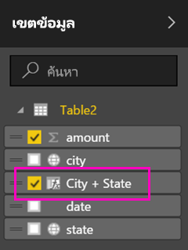

# ตั้งค่าตัวกรองทางภูมิศาสตร์ใน Power BI Desktop สำหรับใช้ในแอปบนอุปกรณ์เคลื่อนที่
ใน Power BI Desktop คุณสามารถ[จัดประเภทข้อมูลทางภูมิศาสตร์](desktop-data-categorization.md)สำหรับคอลัมน์ เพื่อให้ Power BI Desktop ทราบว่าควรทำอย่างไรกับค่าในวิชวลในรายงานได้ ประโยชน์เพิ่มเติมคือ เมื่อคุณหรือเพื่อนร่วมงานของคุณดูรายงานนั้นในแอป Power BI สำหรับอุปกรณ์เคลื่อนที่ Power BI ใช้ตัวกรองทางภูมิศาสตร์ที่ตรงกับตำแหน่งของคุณโดยอัตโนมัติ 

ตัวอย่างเช่น คุณเป็นผู้จัดการฝ่ายขาย และกำลังเดินทางไปพบลูกค้า และคุณต้องการจะกรองยอดขายและรายได้สำหรับลูกค้าที่คุณกำลังจะไปพบอย่างรวดเร็ว คุณต้องการแยกดูเฉพาะข้อมูลสำหรับตำแหน่งปัจจุบันของคุณ ไม่ว่า จะเป็น รัฐ เมือง หรือที่อยู่ ต่อไป ถ้าคุณมีเวลาเหลือ คุณอยากจะไปเยี่ยมลูกค้ารายอื่น ๆ อยู่ที่ใกล้ คุณสามารถ[กรองรายงานตามตำแหน่งของคุณเพื่อค้นหาลูกค้าเหล่านั้น](../consumer/mobile/mobile-apps-geographic-filtering.md)ได้

> [!NOTE]
> คุณสามารถกรองข้อมูลตามตำแหน่งที่ตั้งในแอปสำหรับอุปกรณ์เคลื่อนที่ ก็ต่อเมื่อชื่อภูมิศาสตร์ในรายงานเป็นภาษาอังกฤษเท่านั้น &#150; เช่น "New York" หรือ "Germany"
> 
> 

## ระบุข้อมูลทางภูมิศาสตร์ในรายงานของคุณ
1. ใน Power BI Desktop สลับไปยังมุมมองข้อมูล .
2. เลือกคอลัมน์ที่เป็นข้อมูลทางภูมิศาสตร์ &#151; ตัวอย่างเช่น คอลัมน์เมือง
   
    
3. บนแท็บ**การวางรูปแบบ** เลือก**ประเภทข้อมูล** จากนั้นเลือกประเภทที่ถูกต้อง &#151; ในตัวอย่างนี้คือ **เมือง**
   
    
4. ตั้งค่าประเภทข้อมูลทางภูมิศาสตร์สำหรับเขตข้อมูลอื่น ๆ ในรูปแบบข้อมูลต่อ 
   
   > [!NOTE]
   > คุณสามารถตั้งค่าหลายคอลัมน์ สำหรับแต่ละประเภทข้อมูลในรูปแบบ แต่ถ้าคุณทำแบบนั้น แอป Power BI สำหรับอุปกรณ์เคลื่อนที่ จะไม่สามารถกรองรูปแบบตามภูมิศาสตร์ได้ เพื่อใช้การกรองทางภูมิศาสตร์ในแอปสำหรับอุปกรณ์เคลื่อนที่ ตั้งค่าแค่คอลัมน์เดียวเท่านั้นสำหรับแต่ละประเภทข้อมูล &#151; เช่น มีคอลัมน์**เมือง**แค่คอลัมน์เดียว คอลัมน์**รัฐหรือจังหวัด**คอลัมน์เดียว และคอลัมน์**ประเทศ**คอลัมน์เดียว 
   > 
   > 

## สร้างวิชวลด้วยข้อมูลทางภูมิศาสตร์ของคุณ
1. สลับไปยังมุมมองรายงาน และสร้างวิชวลที่ใช้เขตข้อมูลทางภูมิศาสตร์ในข้อมูลของคุณ 
   
    
   
    ในตัวอย่างนี้ รูปแบบข้อมูลยังประกอบด้วยคอลัมน์จากการคำนวณ ที่รวมเมืองและรัฐเข้าด้วยกันเป็นหนึ่งคอลัมน์ อ่านเกี่ยวกับ[สร้างคอลัมน์จากการคำนวณใน Power BI Desktop](desktop-calculated-columns.md)
   
    
2. เผยแพร่รายงานไปยังบริการ Power BI

## ดูรายงานในแอป Power BI สำหรับอุปกรณ์เคลื่อนที่
1. เปิดรายงานในใด ๆ ใน[แอป Power BI สำหรับอุปกรณ์เคลื่อนที่](../consumer/mobile/mobile-apps-for-mobile-devices.md)
2. ถ้าคุณอยู่ในตำแหน่งทางภูมิศาสตร์ที่มีข้อมูลในรายงาน คุณสามารถกรองข้อมูลนั้นด้วยตำแหน่งของคุณโดยอัตโนมัติ
   
    

อ่านเพิ่มเติมเกี่ยวกับ[การกรองรายงานตามตำแหน่งในแอป Power BI สำหรับอุปกรณ์เคลื่อนที่](../consumer/mobile/mobile-apps-geographic-filtering.md)

## ขั้นตอนถัดไป
* [จัดประเภทข้อมูลใน Power BI Desktop](desktop-data-categorization.md)  
* มีคำถามหรือไม่ [ลองถามชุมชน Power BI](https://community.powerbi.com/)
