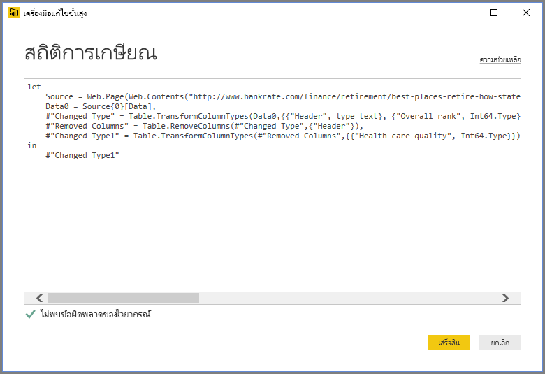
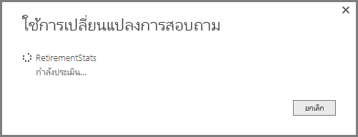

# ภาพรวมคิวรีใน Power BI Desktop
ด้วย Power BI Desktop คุณสามารถเชื่อมต่อกับโลกของข้อมูล สร้างรายงานที่น่าสนใจ และแชร์ความพยายามของคุณกับผู้อื่น – ที่สามารถสร้างผลงานต่อจากงานของคุณ และขยายความพยายามอันชาญฉลาดทางธุรกิจของพวกเขา

Power BI Desktop มีสามมุมมอง:

* มุมมอง**รายงาน** – เป็นที่ที่คุณใช้คิวรีที่คุณสร้างภาพที่แสดงข้อมูลที่ดึงดูดความสนใจ จัดเรียงการแสดงผลตามที่คุณต้องการให้ปรากฏในหลายหน้าที่คุณสามารถแบ่งปันกับผู้อื่น
* มุมมอง**ข้อมูล**ู – เป็นที่ที่ดูข้อมูลในรายงานของคุณในรูปแบบจำลองข้อมูล เป็นที่ที่ี่คุณสามารถเพิ่มการวัด สร้างคอลัมน์ใหม่ และจัดการความสัมพันธ์
* มุมมอง**ความสัมพันธ์**ู – เป็นที่แสดงภาพกราฟิกของความสัมพันธ้ในแบบจำลองข้อมูลของคุณ และจัดการ หรือปรับเปลี่ยนความสัมพันธ์นั้นได้ตามต้องการ

เข้าถึงมุมมองเหล่านี้โดยการเลือกไอคอนหนึ่งในสามทางด้านซ้ายของ Power BI Desktop ในรูปต่อไปนี้ มุมมอง**รายงาน**ถูกเลือก ที่บ่งชี้ด้วยแถบสีเหลืองที่อยู่ด้านข้างไอคอน  

Power BI Desktop ยังมาพร้อมกับ Power Query Editor ใช้ Power Query Editor เพื่อเชื่อมต่อกับแหล่งข้อมูลหนึ่งหรือหลายแหล่ง จัดรูปร่างและแปลงข้อมูลตามความต้องการของคุณ จากนั้นโหลดแบบจำลองดังกล่าวเข้าไปใน Power BI Desktop

เอกสารนี้ให้ภาพรวมของการทำงานกับข้อมูลใน Power Query Editor แต่ยังมีอีกมากมายให้เรียนรู้ ในตอนท้ายของเอกสารนี้ คุณจะพบกลิงก์ไปยังคำแนะนำโดยละเอียดเกี่ยวกับชนิดข้อมูลที่ได้รับการสนับสนุน นอกจากนี้คุณยังจะได้พบกับคำแนะนำเกี่ยวกับการเชื่อมต่อกับข้อมูล การจัดรูปร่างข้อมูล การสร้างความสัมพันธ์ และวิธีการเริ่มต้นใช้งาน

แต่ก่อนอื่น มาทำความคุ้นเคยกับ Power Query Editor

## ตัวแก้ไข Power Query
เมื่อต้องการใช้ Power Query Editor ให้เลือก**แก้ไขคิวรี**จากแท็บ**หน้าแรก** ของ Power BI Desktop  

เมื่อไม่มีการเชื่อมต่อข้อมูล Power Query Editor จะปรากฏเป็นบานหน้าต่างว่างที่พร้อมสำหรับข้อมูล  

เมื่อคิวรีถูกโหลด มุมมอง Power Query Editor จะกลายเป็นเรื่องน่าสนใจมากขึ้น ถ้าเราเชื่อมต่อกับแหล่งข้อมูลต่อไปนี้ของเว็บ Power Query Editor จะโหลดข้อมูลเกี่ยวกับข้อมูลที่คุณสามารถเริ่มต้นจัดรูปร่าง

[*https://www.bankrate.com/retirement/best-and-worst-states-for-retirement/*](https://www.bankrate.com/retirement/best-and-worst-states-for-retirement/)

นี่คือวิธีที่ Power Query Editor ปรากฏเมื่อมีการเชื่อมต่อข้อมูล:

1. ในริบบอน มีปุ่มจำนวนมากพร้อมใช้งานเพื่อโต้ตอบกับข้อมูลในคิวรี
2. ในบานหน้าต่างด้านซ้าย รายการคิวรี (สำหรับแต่ละตารางหรือรายการ) จะแสดงอยู่และพร้อมให้เลือก ดู และจัดรูปร่าง
3. ในบานหน้าต่างตรงกลาง ข้อมูลจากคิวรีที่เลือกจะแสดงและพร้อมให้จัดรูปร่าง
4. บานหน้าต่าง**การตั้งค่าคิวรี**จะปรากฏ แสดงรายการคุณสมบัติของคิวรีและขั้นตอนที่ถูกใช้  
   
   

เราจะดูสี่เรื่องนี้ทีละเรื่อง – ซึ่งคือริบบอน บานหน้าต่างคิวรี มุมมองข้อมูล และบานหน้าต่างการตั้งค่าคิวรี

## Ribbon คิวรี
รอบบอนใน Power Query Editor ประกอบด้วยสี่แท็บ: **หน้าหลัก** **แปลง** **เพิ่มคอลัมน์** และ **ดู**

แท็บ **หน้าหลัก** ประกอบด้วยงานคิวรีทั่วไป

เมื่อต้องการเชื่อมต่อกับข้อมูล และเริ่มขบวนการสร้างคิวรีเลือกปุ่ม**แหล่งใหม่ (New Source)** เมนูจะปรากฏ และให้แหล่งข้อมูลที่พบบ่อยที่สุด  

สำหรับข้อมูลเพิ่มเติมเกี่ยวกับแหล่งข้อมูลที่พร้อมใช้งาน ดู**แหล่งข้อมูล** สำหรับข้อมูลเกี่ยวกับการเชื่อมต่อกับข้อมูล ที่รวมถึงตัวอย่างและขั้นตอน ดู**เชื่อมต่อกับข้อมูล**

แท็บ**แปลง** จัดเตรียมการเข้าถึงงานการแปลงข้อมูลทั่วไปเช่น:

* การเพิ่มและการลบคอลัมน์ออก
* การเปลี่ยนชนิดข้อมูล 
* การแยกคอลัมน์ 
* งานที่มีการควบคุมข้อมูลอื่นๆ

สำหรับข้อมูลเพิ่มเติมเกี่ยวกับการแปลงข้อมูล ที่รวมถึงตัวอย่าง ดูที่บทช่วยสอน [: จัดรูปร่างและรวมข้อมูลใน Power BI Desktop](https://docs.microsoft.com/power-bi/desktop-shape-and-combine-data)

แท็บ**เพิ่มคอลัมน์**เป็นการเพิ่มคอลัมน์ จัดรูปแบบข้อมูลคอลัมน์ และการเพิ่มคอลัมน์แบบกำหนดเองรวมทั้งงานอื่นๆที่เกี่ยวข้อง รูปภาพต่อไปนี้แสดง แท็บ**เพิ่มคอลัมน์**  

แท็บ**มุมมอง**บน ribbon ถูกใช้เพื่อสลับว่าจะแสดงบานหน้าต่าง หรือ windows นอกจากนี ้ยังใช้เพื่อแสดงตัวแก้ไขขั้นสูง รูปภาพต่อไปนี้แสดง แท็บ**มุมมอง**  

ขอให้ทราบว่า งานพร้อมใช้งานที่เรียกจาก ribbon จะแสดงโดยการคลิกขวาคอลัมน์หรือข้อมูลอื่นๆ ในบานหน้าต่างตรงกลาง

## บานหน้าต่างด้านซ้าย (คิวรี)
บานหน้าต่างด้านซ้าย หรือบานหน้าต่าง **Queries** แสดงจำนวนของคิวรีที่ใช้งานอยู่ และชื่อของคิวรี เมื่อคุณเลือกคิวรีจากบานหน้าต่างด้านซ้าย ข้อมูลของคิวรีจะแสดงในบานหน้าต่างตรงกลาง ซึ่งคุณสามารถจัดรูปแบบ และแปลงข้อมูลนี้ตามความต้องการของคุณ รูปต่อไปนี้แสดงบานหน้าต่างด้านซ้ายที่มีคิวรี  

## บานหน้าต่างตรงกลาง (ข้อมูล)
บานหน้าต่างตรงกลาง หรือบานหน้าต่าง**ข้อมูล** จะแสดงข้อมูลจากคิวรีที่เลือก บานหน้าต่างนี้คือตำแหน่งที่เห็นการทำงานของ**คิวรี**

ในรูปต่อไปนี้แสดงการเชื่อมต่อข้อมูลเว็บที่สร้างไว้ก่อนหน้านี้ คอลัมน์ **Product** ถูกเลือก และคลิกขวาที่ส่วนหัวเพื่อแสดงรายการเมนูที่พร้อมใช้งาน โปรดสังเกตว่า รายการเมนูคลิกขวาเหล่านี้หลายรายการจะเหมือนกับปุ่มในแท็บ ribbon  

เมื่อคุณเลือกรายการเมนูคลิกขวา (หรือปุ่ม ribbon) คิวรีจะทำงานตามขั้นตอนกัับข้อมูล นอกจากนี้ยังบันทึกขั้นตอนเป็นส่วนหนึ่งของคิวรีนั้นด้วย ขั้นตอนเหล่านี้จะถูกบันทึกในบานหน้าต่าง**การตั้งค่าคิวรี**อย่างเป็นลำดับ ตามที่อธิบายไว้ในหัวข้อถัดไป  

## บานหน้าต่างด้านขวา (การตั้งค่าคิวรี)
บานหน้าต่างด้านขวา หรือบานหน้าต่าง**การตั้งค่าคิวรี**แสดงขั้นตอนทั้งหมดที่เกี่ยวข้องกับคิวรี ตัวอย่างเช่น ในรูปต่อไปนี้ หัวข้อ**ขั้นตอนที่นำไปใช้**ของบานหน้าต่าง**การตั้งค่าคิวรี**แสดงว่าเราเพิ่งเปลี่ยนชนิดของคอลัมน์**คะแนนโดยรวม**

ขั้นตอนการจัดรูปทรงจะอยู่ในหัวข้อ**ขั้นตอนที่นำไปใช้**

สิ่งสำคัญคือต้องทราบว่าข้อมูลต้นแบบ *ไม่ได้*เปลี่ยนแปลง แต่ Power Query Editor จะปรับและจัดรูปร่างมุมมองของข้อมูล นอกจากนี้ยังจัดรูปร่างและปรับมุมมองของการโต้ตอบใดก็ตามกับข้อมูลต้นแบบที่เกิดขึ้นตามมุมมองที่ถูกจัดรูปร่างและปรับเปลี่ยนของ Power Query Editor ของข้อมูลนั้น

ในบานหน้าต่าง**การตั้งค่าคิวรี**บานหน้าต่าง คุณสามารถเปลี่ยนชื่อขั้นตอน ลบขั้นตอน หรือจัดลำดับขั้นตอน ตามที่คุณเห็นว่าเหมาะสมได้ เมื่อต้องการทำเช่นนั้น คลิกขวาที่ขั้นตอนในหัวข้อ**ขั้นตอนท่่ีนำไปใช้**และเลือกจากเมนูที่ปรากฏ ขั้นตอนคิวรีทั้งหมดจะดำเนินการตามลำดับที่ปรากฏในบานหน้าต่าง**ขั้นตอนที่นำไปใช้**

## เครื่องมือแก้ไขขั้นสูง
**เครื่องมือแก้ไขขั้นสูง** ช่วยให้คุณเห็นโค้ดที่ Power Query Editor กำลังสร้างขึ้นในแต่ละขั้นตอน นอกจากนี้ยังช่วยให้คุณสามารถสร้างโค้ดการจัดรูปร่างของคุณเองได้ด้วย เมื่อต้องการเปิดใช้ตัวแก้ไขขั้นสูง เลือก**มุมมอง**จาก ribbon แล้วเลือก**ตัวแก้ไขขั้นสูง** หน้าต่างจะปรากฏขึ้น แสดงรหัสคิวรีที่่มีอยู่  

คุณสามารถแก้ไขรหัสในหน้าต่าง**ตัวแก้ไขขั้นสูง**ได้โดยตรง เมื่อต้องการปิดหน้าต่าง เลือกปุ่ม**เสร็จสิ้น**หรือ**ยกเลิก**  

## บันทึกงานของคุณ
เมื่อคิวรีของคุณอยู่ในตำแหน่งที่คุณต้องการ ให้เลือก **ปิด & ใช้** จากเมนู **ไฟล์** ของ Power Query Editor การดำเนินการนี้จะนำการเปลี่ยนแปลงไปใช้และปิดตัวแก้ไข  

เมื่อเกิดความคืบหน้า Power BI Desktop จะแสดงกล่องโต้ตอบเพื่อแสดงสถานะ  

เมื่อคุณพร้อมแล้ว Power BI Desktop สามารถบันทึกงานของคุณในรูปแบบของไฟล์ *.pbix* ได้

เมื่อต้องการบันทึกงานของคุณ ให้เลือก **ไฟล์** \> **บันทึก** (หรือ **ไฟล์** \> **บันทึกเป็น**) ดังที่แสดงในรูปต่อไปนี้  

## ขั้นตอนถัดไป
มีมากมายหลากหลายสิ่งที่คุณสามารถทำได้ด้วย Power BI Desktop สำหรับข้อมูลเพิ่มเติมเกี่ยวกับขีดความสามารถ กรุณาดูแหล่งทรัพยากรต่อไปนี้:

* [Power BI Desktop คืออะไร](../fundamentals/desktop-what-is-desktop.md)
* [แหล่งข้อมูลใน Power BI Desktop](../connect-data/desktop-data-sources.md)
* [เชื่อมต่อกับข้อมูลใน Power BI Desktop](../connect-data/desktop-connect-to-data.md)
* [บทช่วยสอน: จัดรูปร่างและรวมข้อมูลด้วย Power BI Desktop](../connect-data/desktop-shape-and-combine-data.md)
* [ใช้งานคิวรีที่ใช้บ่อยใน Power BI Desktop](desktop-common-query-tasks.md)   
