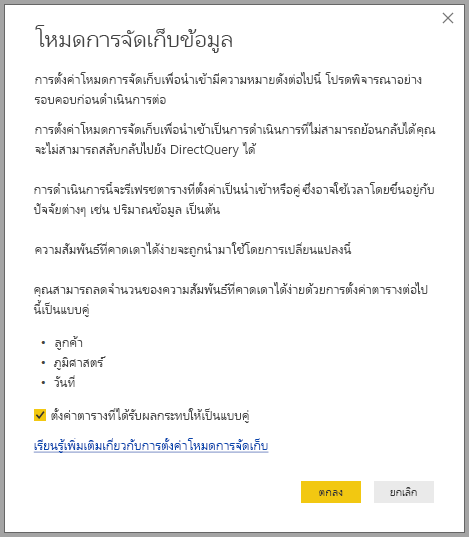

# จัดการโหมดที่เก็บข้อมูลใน Power BI Desktop

ใน Microsoft Power BI Desktop คุณสามารถระบุโหมดที่เก็บข้อมูลของตารางได้ โหมดเก็บข้อมูลจะทำให้คุณสามารถควบคุมว่า Power BI Desktop แคชข้อมูลตารางในหน่วยความจำสำหรับรายงานหรือไม่ 

การตั้งค่าโหมดที่เก็บข้อมูลเอื้อประโยชน์หลายอย่าง คุณสามารถตั้งค่าโหมดเก็บข้อมูลสำหรับตารางแต่ละรายการแยกต่างหากในโมเดลของคุณ การดำเนินการนี้จะเปิดใช้งานชุดข้อมูลเดียวซึ่งมีประโยชน์ดังนี้:

* **ประสิทธิภาพคิวรี**: เมื่อผู้ใช้โต้ตอบกับภาพในรายงาน Power BI คิวรี Data Analysis Expressions (DAX) จะถูกส่งไปยังชุดข้อมูล การแคชข้อมูลลงในหน่วยความจำด้วยการตั้งค่าโหมดที่เก็บข้อมูลอย่างเหมาะสมสามารถเพิ่มประสิทธิภาพคิวรีและการโต้ตอบของรายงานได้

* **ชุดข้อมูลขนาดใหญ่**: ตารางที่ไม่ได้ถูกแคชจะไม่ใช้หน่วยความจำสำหรับการแคช คุณสามารถเปิดใช้งานการวิเคราะห์แบบโต้ตอบผ่านชุดข้อมูลขนาดใหญ่ที่มีขนาดใหญ่หรือแพงเกินไปที่จะแคชลงในหน่วยความจำโดยสมบูรณ์ คุณสามารถเลือกว่าตารางใดที่ควรแคชและตารางใดที่ไม่ควร

* **การปรับการรีเฟรชข้อมูลให้เหมาะสม**: คุณไม่จำเป็นต้องรีเฟรชตารางที่ไม่มีการแคช คุณสามารถลดระยะเวลาที่ใช้รีเฟรชได้โดยการแคชเฉพาะข้อมูลที่จำเป็นต่อการทำตามข้อกำหนดทางธุรกิจและข้อตกลงการบริการ

* **ข้อกำหนดแบบ Near Real Time**: ตารางที่มีข้อกำหนดแบบ Near Real Time อาจได้รับประโยชน์จากการไม่ถูกแคช เพื่อลดเวลาแฝงของข้อมูล

* **การเขียนกลับ**: การเขียนกลับ ช่วยให้ผู้ใช้ธุรกิจสามารถสำรวจสถานการณ์แบบ What-If ด้วยการเปลี่ยนแปลงค่าเซลล์ แอปพลิเคชันแบบกำหนดเองสามารถทำการเปลี่ยนแปลงไปยังแหล่งข้อมูลได้ ตารางที่ไม่ได้ถูกแคชสามารถแสดงการเปลี่ยนแปลงได้ทันที ซึ่งช่วยให้ทำการวิเคราะห์ผลกระทบได้โดยฉับพลัน

การตั้งค่าโหมดที่เก็บข้อมูลใน Power BI Desktop คือหนึ่งในสามคุณลักษณะที่เกี่ยวข้อง:

* **โมเดลแบบรวม**: อนุญาตให้รายงานมีการเชื่อมต่อข้อมูลตั้งแต่สองแบบขึ้นไป รวมถึงการเชื่อมต่อ DirectQuery หรือการนำเข้า ในรูปแบบใดๆ ก็ตาม สำหรับข้อมูลเพิ่มเติม โปรดดูการ[ใช้โมเดลแบบรวมใน Power BI Desktop](desktop-composite-models.md)

* **ความสัมพันธ์แบบกลุ่มต่อกลุ่ม**: ด้วยโมเดลแบบรวม คุณสามารถตั้ง *ความสัมพันธ์ มาก-ไป-มาก* ระหว่างตาราง ในความสัมพันธ์บบกลุ่มต่อกลุ่ม จะมีการลบคำขอสำหรับค่าที่ไม่ซ้ำกันในตาราง นอกจากนี้ยังเอาการแก้ปัญหาชั่วคราวก่อนหน้าออกด้วย เช่น การเริ่มตารางใหม่เพื่อสร้างความสัมพันธ์เท่านั้น สำหรับข้อมูลเพิ่มเติม โปรดดู [ความสัมพันธ์แบบกลุ่ม-ต่อ-กลุ่มใน Power BI Desktop (ตัวอย่าง)](desktop-many-to-many-relationships.md)

* **โหมดการจัดเก็บข้อมูล**: ด้วยโหมดการจัดเก็บข้อมูล ขณะนี้ คุณสามารถระบุวิชวลที่จำเป็นต้องมีคิวรีไปยังแหล่งข้อมูลส่วนหลัง วิชวลที่ไม่ต้องใช้คิวรีจะถูกนำเข้าแม้ว่าจะมาจาก DirectQuery คุณลักษณะนี้จะช่วยปรับปรุงประสิทธิภาพ และลดการโหลดระบบ Back-end ก่อนหน้านี้ แม้กระทั่งวิชวลพื้นฐานอย่างตัวแบ่งส่วนข้อมูล ก็นำคิวรีที่ถูกส่งไปยังแหล่งระบบ Back-end 

## ใช้คุณสมบัติโหมดที่เก็บข้อมูล

คุณสมบัติ **โหมดที่เก็บข้อมูล** เป็นคุณสมบัติที่คุณสามารถตั้งค่าบนแต่ละตารางในแบบจำลองของคุณและควบคุมวิธีที่ Power BI แคชข้อมูลตาราง

หากต้องการตั้งค่าคุณสมบัติ **โหมดที่เก็บข้อมูล** หรือดูการตั้งค่าปัจจุบัน: 

1. ในมุมมอง **แบบจำลอง** เลือกตารางที่มีคุณสมบัติที่คุณต้องการดูหรือตั้งค่า 
2. ในบานหน้าต่าง **คุณสมบัติ** ขยายส่วน**ขั้นสูง**และขยายรายการแบบหล่นลง **โหมดที่เก็บข้อมูล**

   

คุณตั้งค่าคุณสมบัติ**โหมดที่เก็บข้อมูล** เป็นหนึ่งในค่าสามค่าต่อไปนี้:

* **นำเข้า**: ตารางนำเข้าที่มีการตั้งค่านี้ จะถูกแคช คิวรีที่ส่งไปยังชุดข้อมูล Power BI ที่ส่งกลับข้อมูลจากตารางนำเข้าสามารถเติมเต็มได้จากข้อมูลแคชเท่านั้น

* **DirectQuery**: ตารางที่มีการตั้งค่านี้ จะไม่ถูกแคช คิวรีที่ส่งไปยังชุดข้อมูล Power BI&mdash; เช่น คิวรี DAX&mdash; และที่แสดงข้อมูลจากตาราง DirectQuery สามารถเติมเต็มได้โดยการดำเนินการคิวรีตามคำขอไปยังแหล่งข้อมูลเท่านั้น คิวรีที่ส่งไปยังแหล่งข้อมูลจะใช้ภาษาคิวรีสำหรับแหล่งข้อมูลนั้นๆ เช่น SQL

* **คู่**: ตารางที่มีการตั้งค่านี้สามารถแคชหรือไม่แคชก็ได้ ขึ้นอยู่กับบริบทของคิวรีที่ส่งไปยังชุดข้อมูล Power BI ในบางกรณี คุณเติมเต็มคิวรีจากข้อมูลที่ถูกแคช ในอีกกรณี คุณเติมเต็มคิวรีโดยการดำเนินการคิวรีตามคำขอไปยังแหล่งข้อมูล

การเปลี่ยน **โหมดที่เก็บข้อมูล** ของตารางเป็น **นำเข้า** เป็นการดำเนินการ*ที่เรียกกลับไม่ได้* หลังจากตั้งค่าแล้ว คุณสมบัตินี้จะไม่สามารถเปลี่ยนกลับไปยังทั้ง **DirectQuery** หรือ **Dual** ได้

> [!NOTE]
> คุณสามารถใช้โหมดที่เก็บข้อมูลแบบ **Dual** ในทั้ง Power BI Desktop และบริการของ Power BI ได้

## ข้อจำกัดใน DirectQuery และ ตารางคู่

ตารางคู่มีข้อจำกัดเช่นเดียวกับตาราง DirectQuery ข้อจำกัดเหล่านี้ประกอบด้วย การจำกัดการเปลี่ยน M และการจำกัดฟังก์ชัน DAX ในคอลัมน์ที่มีการคำนวณ สำหรับข้อมูลเพิ่มเติม โปรดดู [ส่วนเกี่ยวข้องของการใช้ DirectQuery](../connect-data/desktop-directquery-about.md#implications-of-using-directquery)

## การเผยแพร่การตั้งค่าแบบ Dual
ลองพิจารณาโมเดลง่าย ๆ ต่อไปนี้ ซึ่งตารางทั้งหมดมาจากแหล่งที่มาเดียวที่รองรับ นำเข้า และ DirectQuery

สมมติว่าตารางทั้งหมดในโมเดลนี้ได้รับการตั้งค่าเป็น **DirectQuery** หากแก้ไข**โหมดที่เก็บข้อมูล** ของตาราง **SurveyResponse** เป็น **นำเข้า** หน้าต่างคำเตือนต่อไปนี้จะแสดงขึ้นมา:

คุณสามารถตั้งค่าตารางมิติ (**ลูกค้า**, **ภูมิศาสตร์**และ**วันที่**) เป็น**Dual**เพื่อลดจำนวนของความสัมพันธ์ที่คาดเดาได้ง่ายในชุดข้อมูล และปรับปรุงประสิทธิภาพการทำงาน ความสัมพันธ์ที่คาดเดาได้ง่ายโดยปกติเกี่ยวข้องกับ DirectQuery อย่างน้อยหนึ่งตารางที่รวมตรรกะไม่สามารถถูกส่งไปยังระบบแหล่งข้อมูล เนื่องจากตารางแบบ Dual สามารถทำหน้าที่เป็น DirectQuery หรือตารางที่นำเข้าก็ได้ สถานการณ์นี้จะถูกหลีกเลี่ยง

ตรรกะการกระจายได้รับการออกแบบมาเพื่อช่วยเหลือในโมเดลที่มีหลายตาราง สมมติว่าคุณมีแบบจำลองที่มีตาราง 50 ตาราง และมีเพียงตารางข้อเท็จจริงบางอย่าง (เชิงทรานแซคชัน) ที่จำเป็นต้องแคช ตรรกะใน Power BI Desktop จะคำนวณชุดมิติตารางอย่างน้อยที่สุดที่ต้องตั้งค่าเป็น **คู่** ให้ คุณจึงไม่ต้องตั้งค่าเอง

ตรรกะการกระจายจะทำการสำรวจไปยังด้านเดียวของความสัมพันธ์แบบหนึ่งต่อกลุ่มเท่านั้น

## ตัวอย่างการใช้งานโหมดที่เก็บข้อมูล
มาต่อกันที่ตัวอย่างจากส่วนก่อนหน้านี้ และสมมติว่าคุณใช้การตั้งค่าคุณสมบัติโหมดที่เก็บข้อมูล:

| ตาราง                   | โหมดการจัดเก็บข้อมูล         |
| ----------------------- |----------------------| 
| ยอดขาย                 | DirectQuery          | 
| SurveyResponse        | นำเข้า               | 
| วันที่                  | คู่                 | 
| ลูกค้า              | คู่                 | 
| ภูมิศาสตร์             | คู่                 | 

การตั้งค่าคุณสมบัติโหมดที่เก็บข้อมูลเหล่านี้ส่งผลต่อการทำงานต่อไปนี้ โดยสมมติว่าตาราง **การขาย** มีขนาดข้อมูลที่ใหญ่พอสมควร:
* เนื่องจาก Power BI Desktop แคชตารางมิติ - **วันที่**, **ลูกค้า** และ **ภูมิศาสตร์** ดังนั้นเวลาโหลดของรายการแรกควรเร็วเมื่อเรียกแสดงค่า Slicer
* Power BI Desktop ไม่แคชตาราง **การขาย** เมื่อไม่แคชตารางนี้ Power BI Desktop จะแสดงผลลัพธ์ดังต่อไปนี้:
    * จำนวนครั้งการรีเฟรชข้อมูลดีขึ้น และการใช้พื้นที่หน่วยความจำลดลง
    * คิวรีรายงานที่ยึดตามตาราง **การขาย** ทำงานในโหมด**DirectQuery** คิวรีเหล่านี้อาจใช้เวลานานกว่า แต่ก็ใกล้เคียงกับเวลาจริงมากกว่าเนื่องจากไม่มีการเพิ่มความล่าช้าของข้อมูล

* คิวรีรายงานที่ยึดตามตาราง **SurveyResponse** ถูกส่งกลับจากแคชหน่วยความจำ ดังนั้นจึงค่อนข้างเร็ว

## คิวรีที่ได้พบหรือไม่ได้พบแคช

หากคุณเชื่อมต่อ SQL Profiler กับช่องวินิจฉัยสำหรับ Power BI Desktop คุณจะสามารถเห็นคิวรีที่พบหรือไม่พบแคชหน่วยความจำโดยการแสดงร่องรอยตามเหตุการณ์ต่อไปนี้:

* เหตุการณ์คิวรี\เริ่มต้นคิวรี
* การประมวลผลคิวรี\เริ่มต้นคิวรี Vertipaq SE
* การประมวลผลคิวรี\เริ่มต้น DirectQuery

สำหรับแต่ละเหตุการณ์ *เริ่มต้นคิวรี* ให้ตรวจสอบเหตุการณ์อื่น ๆ ที่มี *ActivityID* เดียวกัน ตัวอย่างเช่น หากไม่มีเหตุการณ์ *DirectQuery Begin* แต่มีเหตุการณ์ *Vertipaq SE Query Begin* คิวรีจะถูกตอบจากแคช

คิวรีที่อ้างอิงถึงตาราง Dual จะแสดงข้อมูลจากแคช หากเป็นไปได้ หรืออาจจะเปลี่ยนกลับไปยัง DirectQuery

จากตัวอย่างก่อนหน้านี้ คิวรีต่อไปนี้อิงคอลัมน์จากตาราง **วันที่** ซึ่งอยู่ในโหมด **คู่** เท่านั้น ดังนั้น คิวรีควรได้พบแคช:

คิวรีต่อไปนี้อ้างอิงเฉพาะคอลัมน์จากตาราง **การขาย** เท่านั้น ซึ่งอยู่ในโหมด **DirectQuery** ดังนั้น จึง*ไม่*ควรพบแคช:

คิวรีต่อไปนี้น่าสนใจเพราะรวมสองคอลัมน์ไว้ด้วยกัน คิวนี้รีไม่ได้พบแคช ในตอนแรกคุณอาจคาดหวังเรียกดูค่า **CalendarYear** จากแคชและค่า **SalesAmount** จากแหล่งที่มา และรวมผลลัพธ์ แต่วิธีการนี้มีประสิทธิภาพน้อยกว่าการส่งการดำเนินการ SUM/GROUP BY ไปยังระบบแหล่งที่มา หากการดำเนินการถูกผลักลงไปที่แหล่งที่มา จำนวนแถวที่ส่งกลับมาจะน้อยกว่านี้มาก 

> [!NOTE]
> การทำงานนี้ต่างจาก[ความสัมพันธ์แบบกลุ่ม-ต่อ-กลุ่ม](desktop-many-to-many-relationships.md)ใน Power BI Desktop เมื่อทำการรวมตารางที่ถูกแคชและไม่ได้ถูกแคชเข้าด้วยกัน

## แคชควรจะซิงค์อยู่เสมอ

คิวรีที่แสดงในส่วนก่อนหน้า จะแสดงตาราง Dual ที่ในบางครั้งจะพบแคชและในบางครั้ง ไม่พบ ดังนั้น หากแคชหมดอายุ ค่าที่แตกต่างออกไปสามารถถูกส่งกลับได้ การดำเนินการคิวรีจะไม่ซ่อนปัญหาของข้อมูลโดยวิธีอย่างเช่นการกรองผลลัพธ์ DirectQuery ให้ตรงกับค่าที่ถูกแคช เป็นหน้าที่ของคุณที่จะทราบทิศทางของข้อมูล และคุณควรออกแบบให้สอดคล้องกัน มีเทคนิคที่ใช้กันในการจัดการกับกรณีเช่นนั้นที่แหล่งที่มา หากจำเป็น

โหมดที่เก็บข้อมูล **คู่** เป็นการปรับประสิทธิภาพให้เหมาะสม จึงควรใช้ในทางที่จะไม่เกิดอันตรายต่อความสามารถตามคำขอเชิงธุรกิจเท่านั้น สำหรับการทำงานทางเลือก ลองพิจารณาใช้เทคนิคที่อธิบายใน [ความสัมพันธ์แบบกลุ่ม-ต่อ-กลุ่มใน Power BI Desktop](desktop-many-to-many-relationships.md)

## มุมมองข้อมูล
หากตารางอย่างน้อยหนึ่งตารางในชุดข้อมูลมีโหมดที่เก็บข้อมูลตั้งค่าเป็น**นำเข้า** หรือ **คู่** แท็บมุมมอง**ข้อมูล** จะแสดงขึ้นมา

เมื่อคุณเลือกตารางแบบคู่และนำเข้าในมุมมอง**ข้อมูล** ตารางจะแสดงข้อมูลที่แคช ตาราง DirectQuery จะไม่แสดงข้อมูล และข้อความจะแสดงขึ้นว่า ไม่สามารถแสดงตาราง DirectQuery ได้

## ข้อจำกัดและข้อควรพิจารณา

มีข้อจำกัดเล็กน้อยสำหรับการเผยแพร่โหมดที่เก็บข้อมูลและสหสัมพันธ์กับโมเดลแบบรวม

แหล่งการเชื่อมต่อของ Live Connect ดังต่อไปนี้ (ขนาดที่หลากหลาย) ไม่สามารถใช้กับโมเดลแบบรวม:

* SAP HANA
* SAP Business Warehouse
* SQL Server Analysis Services
* ชุดข้อมูล Power BI
* Azure Analysis Services

เมื่อทำการเชื่อมต่อกับแหล่งที่มาหลายขนาดเหล่านี้โดยใช้ DirectQuery คุณจะไม่สามารถเชื่อมต่อกับแหล่งที่มา DirectQuery อีกแห่งหรือรวมเข้ากับข้อมูลที่นำเข้าได้

ข้อจำกัดของการใช้ DirectQuery ที่มีจะยังคงมีผลเมื่อคุณใช้โมเดลแบบรวม โดยข้อจำกัดมากมายมีผลขึ้นอยู่กับแต่ละตาราง ซึ่งขึ้นอยู่กับโหมดที่เก็บข้อมูลของตารางนั้นๆ ตัวอย่างเช่น คอลัมน์ที่ได้รับการคำนวณบนตารางที่นำเข้าสามารถอ้างอิงไปยังตารางอื่น แต่ตารางที่ได้รับการคำนวณบนตาราง DirectQuery จะยังคงถูกจำกัดให้อ้างอิงไปยังคอลัมน์บนตารางเดียวกันเท่านั้น ข้อจำกัดอื่น ๆ มีผลกับโมเดลทั้งหมด หากมีตารางใดภายในโมเดลที่เป็น DirectQuery ตัวอย่างเช่น คุณลักษณะ QuickInsights และ Q&A จะไม่สามารถใช้งานได้บนโมเดลหากมีตารางใดภายในโมเดลมีโหมดที่เก็บข้อมูลของ DirectQuery 

## ขั้นตอนถัดไป

สำหรับข้อมูลเพิ่มเติมเกี่ยวกับโมเดลแบบรวมและ DirectQuery โปรดดูบทความต่อไปนี้:
* [โมเดลแบบรวมใน Power BI Desktop](desktop-composite-models.md)
* [ความสัมพันธ์แบบกลุ่มต่อกลุ่มใน Power BI Desktop](desktop-many-to-many-relationships.md)
* [ใช้ DirectQuery ใน Power BI](../connect-data/desktop-directquery-about.md)
* [แหล่งข้อมูลที่ได้รับการรองรับโดย DirectQuery ใน Power BI](../connect-data/power-bi-data-sources.md)
