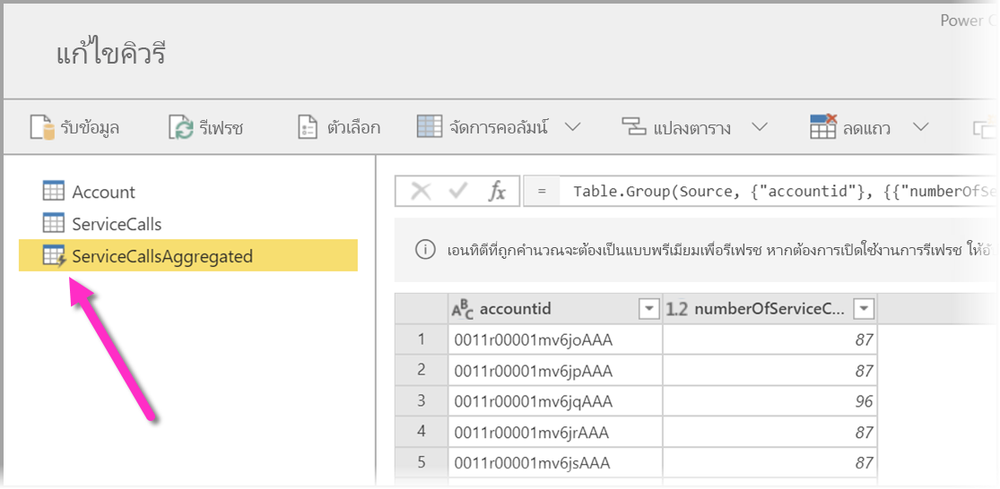
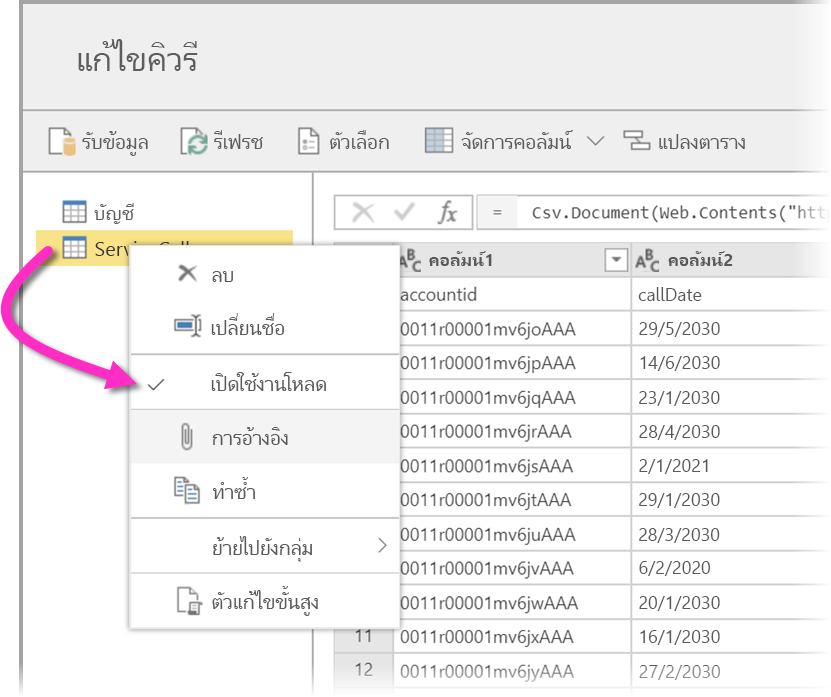
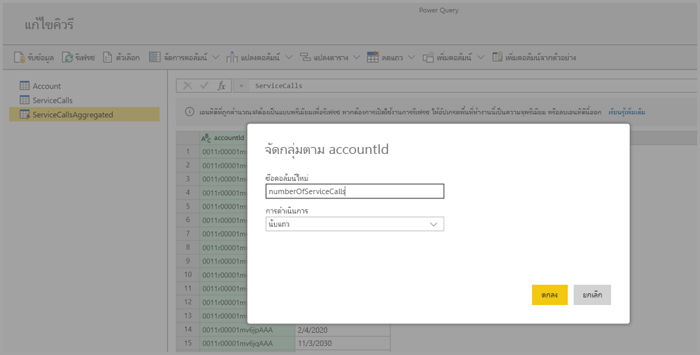
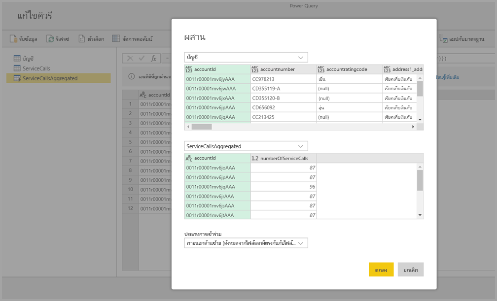
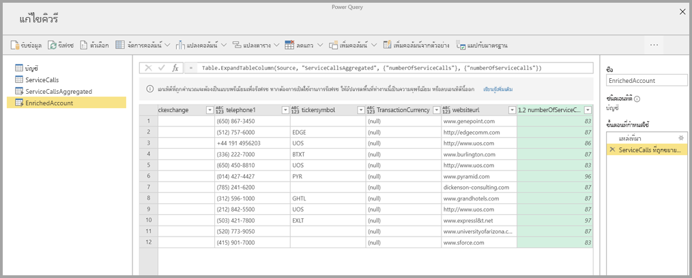

# การใช้เอนทิตีที่คำนวณใน Power BI Premium

คุณสามารถดำเนินการ**การประมวลผลในที่จัดเก็บ**ได้เมื่อใช้**กระแสข้อมูล**ที่มีการสมัครใช้งาน Power BI Premium ซึ่งจะช่วยให้คุณคำนวณกระแสข้อมูลที่มีอยู่แล้วและส่งผลลัพธ์กลับได้ โดยจะทำให้คุณได้เพ่งความสนใจไปยังการสร้างและการวิเคราะห์รายงาน 

เมื่อต้องการทำเนินการ**การคำนวณในที่จัดเก็บ** คุณต้องสร้างกระแสข้อมูลและนำข้อมูลเข้าที่จัดเก็บกระแสข้อมูลของ Power BI ก่อนเป็นอันดับแรก เมื่อคุณมีกระแสข้อมูลที่มีข้อมูลแล้ว คุณก็จะสามารถสร้าง **เอนทิตีที่คำนวณไว้** ได้ ซึ่งเป็นเอนทิตีที่ใช้ประมวลผลในที่จัดเก็บ 

คุณสามารถเชื่อมต่อข้อมูลของกระแสข้อมูลไปยัง Power BI ได้สองวิธี:

* [การใช้การเขียนด้วยตนเองของกระแสข้อมูล](service-dataflows-create-use.md)
* การใช้กระแสข้อมูลภายนอก

ส่วนต่อไปนี้จะอธิบายวิธีการสร้างเอนทิตีที่คำนวณไว้ในข้อมูลของกระแสข้อมูล

## วิธีการสร้างเอนทิตีที่คำนวณไว้ 

เมื่อคุณมีกระแสข้อมูลพร้อมรายการเอนทิตี คุณจะสามารถทำการคำนวณเอนทิตีเหล่านั้นได้

ที่เครื่องมือการเขียนกระแสข้อมูลในบริการของ Power BI ให้คุณเลือก **แก้ไขเอนทิตี** จากนั้นคลิกขวาที่เอนทิตีที่ต้องการใช้เป็นพื้นฐานสำหรับเอนทิตีที่คำนวณและต้องการทำการคำนวณด้วย ในเมนูบริบท ให้คุณเลือก **การอ้างอิง**

เพื่อให้สิทธิ์เอนทิตีเป็นเอนทิตีที่คำนวณ ต้องเลือกที่ตัวเลือก **เปิดใช้งานโหลด** ดังที่แสดงในภาพต่อไปนี้ คลิกขวาที่เอนทิตีเพื่อให้แสดงเมนูบริบทนี้

เมื่อเลือก**เปิดใช้งานโหลด**แล้ว คุณจะสามารถสร้างเอนทิตีใหม่ได้ ซึ่งต้นทางของมันก็คือเอนทิตีที่อ้างอิงถึง ไอคอนจะเปลี่ยนและแสดงไอคอน**ที่คำนวณไว้** ดังที่แสดงในภาพต่อไปนี้

การแปลงใดๆ ที่คุณดำเนินการในเอนทิตีที่สร้างใหม่นี้ จะถูกเรียกใช้ในข้อมูลที่อยู่ในที่เก็บกระแสข้อมูล Power BI ซึ่งหมายความว่าคิวรีนั้นไม่ได้เรียกใช้กับแหล่งข้อมูลภายนอกที่มีการนำเข้าข้อมูลมา (เช่น ฐานข้อมูล SQL ที่มีการดึงข้อมูลมา) แต่มีการดำเนินการกับข้อมูลที่อยู่ในที่เก็บกระแสข้อมูลอยู่แล้ว

### กรณีตัวอย่างการใช้
การแปลงชนิดใดที่สามารถดำเนินการกับเอนทิตีที่คำนวณไว้ได้ การแปลงใดก็ตามที่คุณมักจะระบุถึงโดยใช้อินเตอร์เฟสผู้ใช้ของการแปลงใน Power BI หรือ M Editor จะได้รับการรองรับเมื่อทำการคำนวณในที่จัดเก็บ 

โปรดพิจารณาตัวเลือกต่อไปนี้: คุณมีเอนทิตี*บัญชี*ที่มีข้อมูลดิบสำหรับลูกค้าทั้งหมดจากการสมัครใช้งาน Dynamics 365 นอกจากนี้คุณยังมีข้อมูลดิบของ *ServiceCalls* จากศูนย์บริการ โดยที่มีข้อมูลจากการโทรศัพท์สนับสนุนที่ทำจากบัญชีอื่นในแต่ละวันของทั้งปี

ลองนึกดูว่าคุณต้องการเพิ่มข้อมูลจาก *ServiceCalls* ในเอนทิตี *บัญชี* 

ก่อนอื่นคุณต้องรวบรวมข้อมูลจาก ServiceCalls เพื่อคำนวณจำนวนของการโทรศัพท์สนับสนุนในปีก่อนที่ทำให้แต่ละบัญชี 

จากนั้น คุณต้องผสานเอนทิตี *บัญชี* กับเอนทิตี *ServiceCallsAggregated* เพื่อคำนวณตาราง**บัญชี**ที่เพิ่มข้อมูล

และจากนั้นคุณจะเห็นผลลัพธ์ ดังที่แสดง *EnrichedAccount* ในภาพต่อไปนี้

เท่านั้นเอง การแปลงได้ดำเนินการกับข้อมูลในกระแสข้อมูลที่อยู่ในการสมัครใช้งาน Power BI Premium ไม่ใช่กับข้อมูลต้นทาง

## ข้อควรพิจารณาและข้อจำกัด

โปรดทราบข้อสำคัญไว้ว่าหากคุณลบพื้นที่ทำงานออกจากความจุ Power BI Premium กระแสข้อมูลที่เกี่ยวข้องจะไม่รีเฟรชอีกต่อไป 

เมื่อทำงานโดยใช้กระแสข้อมูลที่สร้างขึ้นเฉพาะสำหรับในบัญชี Azure Data Lake Storage Gen2 ภายในองค์กร เอนทิตีที่มีลิงก์และเอนทิตีที่มีการคำนวณจะทำงานได้อย่างมีประสิทธิภาพต่อเมื่อเอนทิตี้ทั้งสองอยู่ในบัญชีที่เก็บข้อมูลเดียวกัน สำหรับข้อมูลเพิ่มเติม ให้เข้าไปดูที่ [เชื่อมต่อ Azure Data Lake Storage Gen2 สำหรับที่เก็บกระแสข้อมูล (ตัวอย่าง)](service-dataflows-connect-azure-data-lake-storage-gen2.md)

เอนทิตีที่เชื่อมโยงแล้วไม่พร้อมใช้งานสำหรับกระแสข้อมูลที่สร้างจากโฟลเดอร์ Common Data Model (CDM) สำหรับข้อมูลเพิ่มเติม โปรดดูที่ [เพิ่มโฟลเดอร์ CDM เข้าสู่ Power BI ในฐานะกระแสข้อมูล (ดูตัวอย่าง)](service-dataflows-add-cdm-folder.md)

ตามแนวทางปฏิบัติที่ดีที่สุดเมื่อทำการคำนวณข้อมูลที่เข้าร่วมกับข้อมูลในองค์กรและข้อมูลบนระบบคลาวด์ ให้สร้างเอนทิตีใหม่เพื่อทำการคำนวณดังกล่าว ซึ่งจะให้ประสบการณ์สำหรับการคำนวณที่ดีกว่าการใช้เอนทิตีที่มีอยู่แล้ว เช่น เอนทิตีที่กำลังสืบค้นข้อมูลจากทั้งแหล่งที่มาและที่ทำการแปลงในทะเลสาบข้อมูล

## ขั้นตอนถัดไป

บทความนี้ได้อธิบายเกี่ยวกับเอนทิตีที่คำนวณและกระแสข้อมูลที่พร้อมใช้ในบริการของ Power BI ต่อไปนี้คือบทความเพิ่มเติมที่อาจเป็นประโยชน์

* [การเตรียมข้อมูลด้วยตัวเองโดยใช้กระแสข้อมูล](service-dataflows-overview.md)
* [การสร้างและใช้กระแสข้อมูลใน Power BI](service-dataflows-create-use.md)
* [การใช้กระแสข้อมูลกับแหล่งข้อมูลภายในองค์กร](service-dataflows-on-premises-gateways.md)
* [แหล่งข้อมูลของนักพัฒนาสำหรับกระแสข้อมูล Power BI](service-dataflows-developer-resources.md)
* [กำหนดการตั้งค่ากระแสข้อมูลพื้นที่ทำงาน (ตัวอย่าง)](service-dataflows-configure-workspace-storage-settings.md)
* [เพิ่มโฟลเดอร์ CDM ไปยัง Power BI เป็นกระแสข้อมูล (ตัวอย่าง)](service-dataflows-add-cdm-folder.md)
* [เชื่อมต่อ Azure Data Lake Storage Gen2 สำหรับที่เก็บกระแสข้อมูล (ตัวอย่าง)](service-dataflows-connect-azure-data-lake-storage-gen2.md)

สำหรับข้อมูลเพิ่มเติมเกี่ยวกับ Power Query และการรีเฟรชตามกำหนดการ สามารถดูได้ในบทความเหล่านี้:
* [ภาพรวมคิวรีใน Power BI Desktop](desktop-query-overview.md)
* [การกำหนดค่าการรีเฟรชตามกำหนดการ](../connect-data/refresh-scheduled-refresh.md)

สำหรับข้อมูลเพิ่มเติมเกี่ยวกับ Common Data Model สามารถดูได้ในบทความภาพรวม:
* [Common Data Model - ภาพรวม](https://docs.microsoft.com/powerapps/common-data-model/overview)
