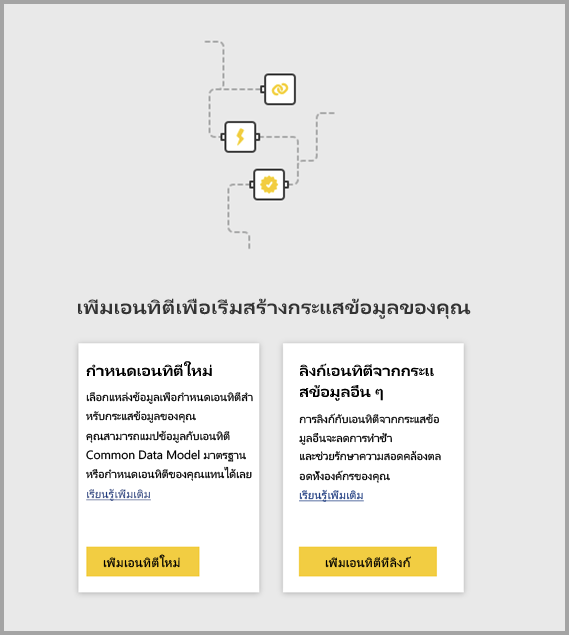
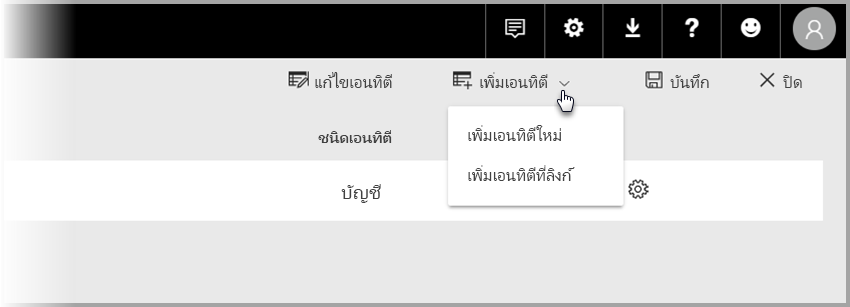

# เชื่อมโยงเอนทิตีระหว่างกระแสข้อมูลใน Power BI

เมื่อมีกระแสข้อมูลใน Power BI คุณอาจมีแหล่งเก็บข้อมูลเดี่ยวระดับองค์กรซึ่งนักวิเคราะห์ธุรกิจสามารถเตรียมและจัดการข้อมูลได้ และสามารถนำกลับมาใช้ใหม่ได้กับแอปเพื่อการวิเคราะห์ขององค์กร 

เมื่อคุณเชื่อมโยงเอนทิตีระหว่างกระแสข้อมูล คุณสามารถนำเอนทิตีกลับมาใช้ใหม่ได้ ซึ่งเป็นเอนทิตีที่มีอยู่แล้ว ล้างและแปลงแล้วด้วยกระแสข้อมูลอื่นที่ผู้อื่นเป็นเจ้าของ โดยไม่ต้องเก็บรักษาข้อมูลนั้นไว้ เอนทิตีที่เชื่อมโยงไว้จะชี้ไปยังเอนทิตีในกระแสข้อมูลอื่น และจะ*ไม่*คัดลอกหรือทำซ้ำข้อมูลนั้น

เอนทิตีแบบเชื่อมโยงแล้วเป็นชนิด**อ่านอย่างเดียว** ถ้าคุณต้องการสร้างการแปลงสำหรับเอนทิตีที่เชื่อมโยงแล้ว คุณต้องสร้างเอนทิตีใหม่ที่คำนวณแล้ว พร้อมการอ้างอิงไปยังเอนทิตีที่เชื่อมโยง

## ความพร้อมใช้งานของเอนทิตีที่เชื่อมโยงแล้ว

เอนทิตีที่เชื่อมโยงแล้วต้องใช้การสมัครใช้งานกับ[ Power BI Premium](../admin/service-premium-what-is.md) ในการรีเฟรช เอนทิตีที่เชื่อมโยงแล้วมีพร้อมใช้งานในกระแสข้อมูลใดก็ตามในพื้นที่ทำงานที่อยู่ในความจุ Power BI Premium ไม่มีข้อจำกัดของกระแสข้อมูลต้นทาง

เอนทิตีที่เชื่อมโยงไว้จะทำงานได้ปกติก็ต่อเมื่ออยู่ในพื้นที่ทำงาน Power BI ใหม่ คุณสามารถเรียนรู้เพิ่มเติมเกี่ยวกับ [พื้นที่ทำงาน Power BI ใหม่](../collaborate-share/service-create-the-new-workspaces.md) กระแสข้อมูลที่เชื่อมโยงทั้งหมดต้องอยู่ในพื้นที่ทำงานใหม่เพื่อให้ทำงานได้ปกติ

> [!NOTE]
> เอนทิตีแตกต่างกันโดยขึ้นอยู่กับว่าพวกเขาตั้งเป็นค่าเอนทิตีมาตรฐาน หรือเอนทิตีในการคำนวณ เอนทิตีมาตรฐาน (มักจะเรียกว่าเอนทิตี) คือคิวรีแหล่งข้อมูลภายนอก เช่นฐานข้อมูล SQL เอนทิตีที่มีการคำนวณจำเป็นต้องใช้ความจุ Premium บน Power BI เพราะต้องอาศัยฐานข้อมูลซึ่งอยู่ในที่เก็บข้อมูลในการแปลงข้อมูลบน Power BI 
>
>ถ้ากระแสข้อมูลของคุณไม่ได้อยู่ในพื้นที่ทำงานความจุ Premium คุณยังสามารถอ้างอิงคิวรีเดี่ยวหรือรวมคิวรี่มากกว่าสองขึ้นไปเข้าด้วยกันได้ตราบเท่าที่การแปลงข้อมูลยังไม่ถูกระบุให้เป็นการแปลงข้อมูลภายในที่เก็บข้อมูล กรณีดังกล่าวจะถือว่าเป็นเอนทิตีมาตรฐาน เมื่อต้องการทำเช่นนั้น ให้ปิดตัวเลือก **เปิดใช้งานการโหลด**สำหรับคิวรีที่ใช้อ้างอิงเพื่อป้องกันไม่ให้ข้อมูลที่กำลังถูกบันทึกลงในที่เก็บข้อมูลกลายเป็นจริง จากขั้นตอนนั่น คุณสามารถอ้างอิงตั้งค่าแบบสอบถามที่มีอยู่ให้เป็น**เปิดใช้งานการโหลด = false**และตั้งค่า**เปิดใช้งานการโหลด**ให้เป็น**เปิด**สำหรับคิวรีที่คุณต้องการให้ผลลัพธ์กลายเป็นจริงเท่านั้น

## วิธีการเชื่อมโยงเอนทิตีระหว่างกระแสข้อมูล

มีวิธีเชื่อมโยงเอนทิตีระหว่างกระแสข้อมูลใน Power BI มากกว่าหนึ่งวิธี คุณสามารถเลือก **เพิ่มเอนทิตีที่เชื่อมโยงไว้** จากเครื่องมือเขียนกระแสข้อมูล ดังที่แสดงในภาพต่อไปนี้ 

คุณยังสามารถเลือก **เพิ่มเอนทิตีที่เชื่อมโยงไว้** จากรายการเมนู **เพิ่มเอนทิตี** ในบริการของ Power BI

คุณต้องลงชื่อเข้าใช้ด้วยข้อมูลประจำตัว Power BI เพื่อเชื่อมโยงเอนทิตี

หน้าต่าง**ตัวนำทาง**จะเปิดขึ้นและให้คุณได้เลือกชุดเอนทิตีที่ต้องการเชื่อมต่อ เอนทิตีที่แสดงคือเอนทิตีที่คุณมีสิทธิ์ใช้งาน ทั่วทั้งพื้นที่ทำงานในผู้เช่า Power BI ของคุณ 

เมื่อได้เลือกเอนทิตีที่เชื่อมโยงแล้ว เอนทิตีเหล่านั้นจะปรากฏขึ้นในรายการเอนทิตีสำหรับกระแสข้อมูลในเครื่องมือเขียน พร้อมกับไอคอนพิเศษที่ระบุว่าเอนทิตีเหล่านั้นเป็นเอนทิตีที่เชื่อมโยงไว้

คุณยังสามารถดูกระแสข้อมูลต้นทางจากการตั้งค่ากระแสข้อมูลของเอนทิตีที่เชื่อมโยงไว้ได้

## ตรรกะการรีเฟรชของเอนทิตีที่เชื่อมโยงไว้
ตรรกะการรีเฟรชเริ่มต้นของเอนทิตีที่เชื่อมโยงไว้จะเปลี่ยนแปลง ตามข้อเท็จจริงว่ากระแสข้อมูลต้นทางที่อยู่ในพื้นที่ทำงานเดียวกันเป็นกระแสข้อมูลปลายทางหรือไม่ ส่วนต่อไปนี้จะอธิบายพฤติกรรมแต่ละอย่าง

### ลิงก์ระหว่างพื้นที่ทำงาน

การรีเฟรชของลิงก์จากเอนทิตีในพื้นที่ทำงานต่างกันจะมีพฤติกรรมเหมือนแหล่งข้อมูลภายนอก เมื่อกระแสข้อมูลมีการรีเฟรช จะใช้ข้อมูลล่าสุดสำหรับเอนทิตีจากกระแสข้อมูลต้นทาง ถ้ากระแสข้อมูลต้นทางมีการรีเฟรช จะไม่ส่งผลกระทบโดยอัตโนมัติต่อข้อมูลในกระแสข้อมูลปลายทาง

### ลิงก์ในพื้นที่ทำงานเดียวกัน

เมื่อมีการรีเฟรชข้อมูลของกระแสข้อมูลต้นทาง จะเป็นการเริ่มกระบวนการรีเฟรชโดยอัตโนมัติสำหรับเอนทิตีพึ่งพาที่อยู่ในกระแสข้อมูลปลายทางทั้งหมดในพื้นที่ทำงานเดียวกันนั้น รวมทั้งเอนทิตีที่คำนวณแล้วที่อ้างอิงตามนั้น เอนทิตีอื่นๆ ทั้งหมดในกระแสข้อมูลปลายทางจะรีเฟรชตามตารางกระแสข้อมูล เอนทิตีที่พึ่งพาแหล่งข้อมูลมากกว่าหนึ่งแหล่งจะอัปเดตข้อมูลเมื่อแหล่งข้อมูลที่พึ่งพาอัปเดตสำเร็จ

คุณควรทราบว่าขั้นตอนการรีเฟรชทั้งหมดจะเกิดขึ้นทันที ด้วยเหตุนั้น หากการรีเฟรชกระแสข้อมูลปลายทางล้มเหลว กระแสข้อมูลต้นทางจะล้มเหลวเช่นกัน

## สิทธิ์ใช้งานเมื่อดูรายงานจากกระแสข้อมูล

เมื่อสร้างรายงาน Power BI ที่รวมเอาข้อมูลจากกระแสข้อมูลไว้ด้วย ผู้ใช้จะเห็นเอนทิตีที่มีการเชื่อมโยงไว้ได้เมื่อเข้าถึงกระแสข้อมูลต้นทาง

## ข้อจำกัดและข้อควรพิจารณา

มีข้อจำกัดและข้อควรพิจารณาบางข้อที่ควรคำนึงถึงเมื่อทำงานกับเอนทิตีที่มีการเชื่อมโยงไว้:

* มีฮอปอ้างอิงสูงสุดห้าตัว
* วงจรอ้างอิงของเเอนทิตี้ที่เชื่อมโยงไม่ได้รับอนุญาตให้ใช้
* กระแสข้อมูลต้องอยู่ใน[พื้นที่ทำงาน Power BI ใหม่](../collaborate-share/service-create-the-new-workspaces.md)
* คุณไม่สามารถเชื่อมโยงเอนทิตีที่เชื่อมโยงแล้วกับเอนทิตีปกติที่ได้รับข้อมูลจากแหล่งข้อมูลในองค์กรได้
* เมื่อมีการใช้คิวรี (ตัวอย่างเช่น คิวรี A) ในการคำนวณของคิวรีอื่น (คิวรี B) ในกระแสข้อมูล คิวรี B จะกลายเป็นเอนทิตีที่มีการคำนวณ คิวรีที่คำนวณไม่สามารถอ้างอิงไปยังแหล่งข้อมูลภายในองค์กรได้

## ขั้นตอนถัดไป

บทความต่อไปนี้อาจมีประโยชน์ในการสร้างหรือทำงานกับกระแสข้อมูล 

* [การเตรียมข้อมูลด้วยตนเองใน Power BI](service-dataflows-overview.md)
* [การสร้างและใช้กระแสข้อมูลใน Power BI](service-dataflows-create-use.md)
* [การใช้เอนทิตีที่คำนวณใน Power BI Premium](service-dataflows-computed-entities-premium.md)
* [การใช้กระแสข้อมูลกับแหล่งข้อมูลภายในองค์กร](service-dataflows-on-premises-gateways.md)
* [แหล่งข้อมูลของนักพัฒนาสำหรับกระแสข้อมูล Power BI](service-dataflows-developer-resources.md)

สำหรับข้อมูลเพิ่มเติมเกี่ยวกับ Power Query และการรีเฟรชตามกำหนดการ สามารถดูได้ในบทความเหล่านี้:
* [ภาพรวมคิวรีใน Power BI Desktop](desktop-query-overview.md)
* [การกำหนดค่าการรีเฟรชตามกำหนดการ](../connect-data/refresh-scheduled-refresh.md)

สำหรับข้อมูลเพิ่มเติมเกี่ยวกับ Common Data Model สามารถดูได้ในบทความภาพรวม:
* [Common Data Model - ภาพรวม](https://docs.microsoft.com/powerapps/common-data-model/overview)
