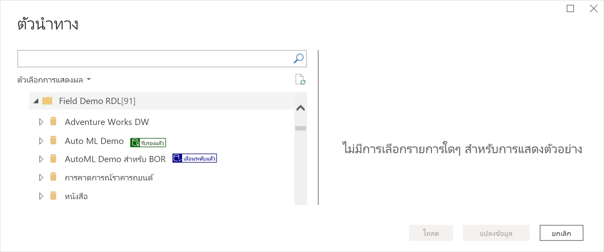
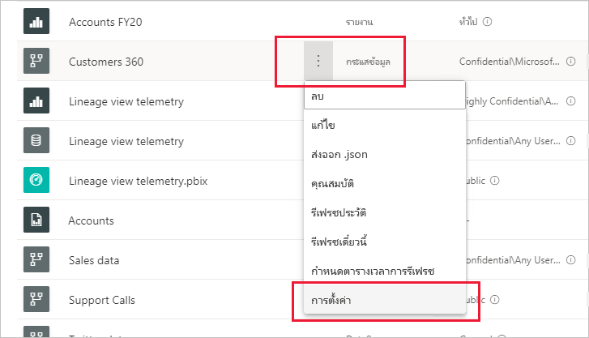
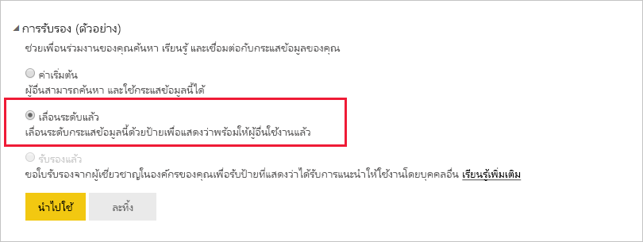
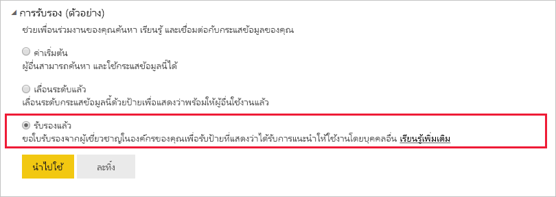

# เลื่อนระดับหรือรับรองกระแสข้อมูล (ตัวอย่าง)

Power BI เสนอวิธีการสองวิธีที่คุณสามารถใช้เพิ่มการมองเห็นกระแสข้อมูลคุณภาพสูงที่มีคุณค่าของคุณ: **การเลื่อนระดับ** และ **การรับรอง**

* **การเลื่อนระดับ**: การเลื่อนระดับ ช่วยให้ผู้ใช้สามารถเน้นย้ำกระแสข้อมูลที่พวกเขาคิดว่ามีคุณค่า และคุ้มค่าเพียงพอที่ผู้อื่นจะใช้งาน สำหรับวิธีการนี้ จะช่วยรองรับเครือข่ายการทำงานร่วมกันของกระแสข้อมูลภายในองค์กร เจ้าของกระแสข้อมูลใด ๆ หรือสมาชิกใดที่มีสิทธิ์เขียนบนพื้นที่ทำงานที่กระแสข้อมูลนั้นตั้งอยู่ จะสามารถเลื่อนระดับกระแสข้อมูลได้อย่างง่ายดาย เมื่อพวกเขาคิดว่ากระแสข้อมูลนั้นดีเพียงพอที่จะแชร์

* **การออกใบรับรอง**: การรับรอง หมายความว่า กระแสข้อมูลได้รับการตรวจสอบจากผู้ตรวจสอบที่ได้รับอนุญาตอย่างเป็นทางการแล้ว และเป็นแหล่งข้อมูลที่เชื่อถือไว้วางใจได้ ซึ่งพร้อมสำหรับการใช้งานทั่วทั้งองค์กร กลุ่มผู้ตรวจสอบที่ได้รับเลือก ซึ่งกำหนดโดยผู้ดูแลระบบของผู้เช่า Power BI จะพิจารณากระแสข้อมูลที่จะรับรอง ผู้ใช้ที่คิดว่า กระแสข้อมูลเฉพาะควรได้รับการรับรอง แต่ไม่ได้รับอนุญาตให้รับรองความถูกต้อง ควรติดต่อผู้ดูแลระบบของผู้เช่าของตนเอง

  กาารรับรองกระแสข้อมูลจะสามารถทำได้ก็ต่อเมื่อ[มีการเปิดใช้งานโดยผู้ดูแลระบบของผู้เช่า Power BI](../admin/service-admin-setup-certification.md)

การเลื่อนระดับหรือการรับรองกระแสข้อมูล เรียกว่า *การรับรอง* ผู้สร้างรายงาน Power BI มักจะมีกระแสข้อมูลจำนวนมากให้เลือก และการรับรองจะช่วยนำทางไปยังกระแสข้อมูลที่เชื่อถือได้ ไว้วางใจได้ และน่าเชื่อถือ

กระแสข้อมูลที่ผ่านการรับรอง จะมีป้ายชื่อกำกับอย่างชัดเจนในหลายตำแหน่งใน Power BI ทำให้ผู้สร้างรายงานสามารถค้นหาได้อย่างง่ายดาย ขณะที่ค้นหาข้อมูลที่เชื่อถือได้ และทำให้ผู้ดูแลระบบและผู้สร้างรายงานสามารถติดตามลักษณะการใช้งานกระแสข้อมูลตลอดทั้งองค์กร

รูปภาพด้านล่างนี้แสดงลักษณะการระบุกระแสข้อมูลที่ผ่านการรับรองและเลื่อนระดับที่ง่ายดายใน Power Query

บทความนี้อธิบายถึง
* การเลื่อนระดับกระแสข้อมูล (เจ้าของกระแสข้อมูลหรือผู้ใช้ใดที่มีสิทธิ์ของสมาชิกบนพื้นที่ทำงานที่มีกระแสข้อมูลตั้งอยู่)
* การรับรองกระแสข้อมูล (ผู้รับรองกระแสข้อมูลที่ได้รับอนุญาตอย่างเป็นทางการ ซึ่งกำหนดโดยผู้ดูแลระบบของผู้เช่า)

สำหรับข้อมูลเกี่ยวกับการตั้งค่าการรับรองกระแสข้อมูล (ผู้ดูแลระบบของผู้เช่า) ดูที่ [ตั้งค่าชุดข้อมูลและการรับรองกระแสข้อมูล](../admin/service-admin-setup-certification.md)

## เลื่อนระดับกระแสข้อมูล

เมื่อต้องการเลื่อนระดับกระแสข้อมูล คุณจะต้องมีสิทธิ์ในการเขียนในพื้นที่ทำงานที่มีกระแสข้อมูลที่คุณต้องการเลื่อนระดับตั้งอยู่

1. ไปที่รายการกระแสข้อมูลในพื้นที่ทำงาน
 
1. เลือก **ตัวเลือกเพิ่มเติม** (...) บนกระแสข้อมูลที่คุณต้องการเลื่อนระดับ จากนั้นเลือก **การตั้งค่า**

    

1. ขยายส่วนการรับรอง และเลือก **เลื่อนระดับแล้ว**

    

1. เลือก**นำไปใช้**

## รับรองกระแสข้อมูล

ส่วนนี้มีไว้สำหรับผู้ใช้ที่ได้รับอนุญาตอย่างเป็นทางการโดยผู้ดูแลระบบของผู้เช่า เพื่อรับรองกระแสข้อมูล การรับรองกระแสข้อมูล เป็นหน้าที่ความรับผิดชอบที่ยิ่งใหญ่ ส่วนนี้อธิบายถึงกระบวนการรับรองที่คุณดำเนินการ

1. รับสิทธิ์การเขียนบนพื้นที่ทำงานที่มีกระแสข้อมูลที่คุณต้องการรับรองอยู่ โดยอาจมาจากเจ้าของกระแสข้อมูล หรือจากใครก็ตามที่มีสิทธิ์ของผู้ดูแลระบบบนพื้นที่ทำงานดังกล่าว 

1. ตรวจสอบกระแสข้อมูลอย่างรอบคอบ และพิจารณาว่ากระแสข้อมูลนั้นควรได้รับการรับรองหรือไม่

1. หากคุณตัดสินใจที่จะรับรองกระแสข้อมูล ให้ไปที่พื้นที่ทำงานของกระแสข้อมูลดังกล่าว
 
1. ค้นหากระแสข้อมูลที่คุณกำลังค้นหา แล้วคลิกที่ **ตัวเลือกเพิ่มเติม** (...) จากนั้นเลือก **การตั้งค่า**

    

1. ขยายส่วนการรับรอง และคลิก **รับรองแล้ว** 

    

2. คลิก**ใช้**

## ขั้นตอนถัดไป

* [ตั้งค่าการรับรองชุดข้อมูลและกระแสข้อมูล](../admin/service-admin-setup-certification.md)
* มีคำถามหรือไม่ [ลองถามชุมชน Power BI](https://community.powerbi.com/)