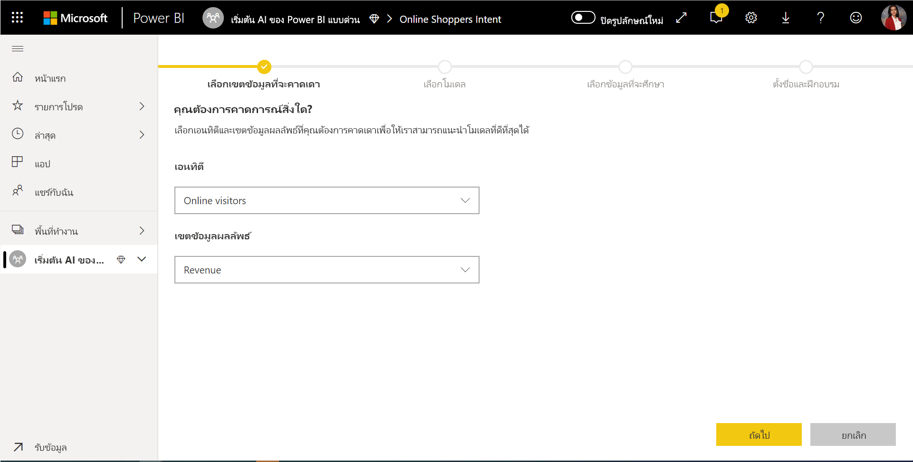
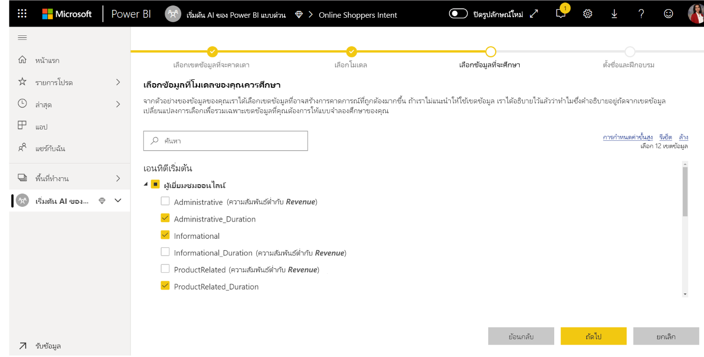

# การเรียนรู้ของเครื่องอัตโนมัติใน Power BI 

การเรียนของเครื่องอัตโนมัติ (AutoML) สำหรับกระแสข้อมูลช่วยนักวิเคราะห์ทางธุรกิจในการสอน ตรวจสอบ และเรียกใช้แบบจำลอง Machine Learning (ML) โดยตรงใน Power BI ซึ่งรวมถึงประสบการณ์ง่ายๆ ในการสร้างรูปแบบ ML ใหม่ซึ่งนักวิเคราะห์สามารถใช้กระแสข้อมูลของพวกเขาเพื่อระบุข้อมูลป้อนเข้าสำหรับการฝึกแบบจำลอง บริการจะแยกคุณลักษณะที่เกี่ยวข้องมากที่สุดโดยอัตโนมัติ เลือกอัลกอริทึมและเพลงที่เหมาะสม รวมถึงตรวจสอบแบบจำลอง ML หลังจากที่แบบจำลองได้รับการสอนแล้ว Power BI จะสร้างรายงานประสิทธิภาพที่มีผลลัพธ์ของการตรวจสอบความถูกต้อง จากนั้นแบบจำลองจะถูกเรียกใช้ในข้อมูลใหม่หรืออัปเดตข้อมูลภายใน กระแสข้อมูล

การเรียนรู้เครื่องอัตโนมัติพร้อมใช้งานสำหรับกระแสข้อมูลที่โฮสต์บน Power BI Premium และความจุแบบฝังตัวเท่านั้น

## การทำงานกับ AutoML

[กระแสข้อมูล Power BI](service-dataflows-overview.md) นำเสนอการเตรียมข้อมูลด้วยตนเองสำหรับข้อมูลขนาดใหญ่ AutoML จะถูกรวมเข้ากับกระแสข้อมูลและช่วยให้คุณสามารถใช้ประโยชน์จากความพยายามในการเตรียมข้อมูลสำหรับการสร้างแบบจำลองการเรียนรู้ของเครื่องได้โดยตรงภายใน Power BI

AutoML ใน Power BI ช่วยนักวิเคราะห์ข้อมูลเพื่อใช้กระแสข้อมูลในการสร้างโมเดลการเรียนรู้ของเครื่องด้วยประสบการณ์การใช้งานแบบง่ายด้วยทักษะ Power BI เท่านั้น วิทยาศาสตร์ข้อมูลส่วนใหญ่ที่อยู่เบื้องหลังการสร้างแบบจำลอง ML นั้นเป็นไปโดยอัตโนมัติจาก Power BI มีตัวป้องกันเพื่อให้แน่ใจว่าแบบจำลองที่สร้างขึ้นนั้นมีคุณภาพดี และสามารถมองเห็นกระบวนการที่ใช้ในการสร้างแบบจำลอง ML ได้

AutoML สนับสนุนการสร้างแบบจำลอง **การทำนายแบบไบนารี** **การจำแนกประเภท** และ **การถดถอย** สำหรับกระแสข้อมูล แบบจำลองเหล่านี้เป็นประเภทของเทคนิคการเรียนรู้ของเครื่องแบบมีผู้สอน ซึ่งหมายความว่าแบบจำลองได้เรียนรู้จากผลลัพธ์ที่ทราบในการสังเกตการณ์ที่ผ่านมาเพื่อทำนายผลลัพธ์ของการสังเกตการณ์อื่นๆ ชุดข้อมูลป้อนเข้าสำหรับการฝึกแบบจำลอง AutoML คือชุดของระเบียนที่มี**ป้ายชื่อ**ที่มีผลลัพธ์ที่ทราบ

AutoML ใน Power BI รวม [ML อัตโนมัติ](https://docs.microsoft.com/azure/machine-learning/service/concept-automated-ml)จาก[Azure Machine Learning service](https://docs.microsoft.com/azure/machine-learning/service/overview-what-is-azure-ml)เพื่อสร้างรูปแบบ ML ของคุณ อย่างไรก็ตามคุณไม่จำเป็นต้องมีการสมัครใช้งาน Azure เพื่อให้ AutoML ใน Power BI กระบวนการของการฝึกและโฮสต์รูปแบบ ML ได้รับการจัดการทั้งหมดโดยบริการของ Power BI

หลังจากแบบจำลอง ML ได้รับการฝึก AutoML ให้สร้างรายงาน Power BI โดยอัตโนมัติที่อธิบายประสิทธิภาพการทำงานของรูปแบบ ML ของคุณ AutoML ให้ความสำคัญกับความสามารถในการอธิบายโดยการเน้นที่ปัจจัยหลักที่มีอิทธิพลในอินพุทของคุณที่มีผลต่อการทำนายที่ส่งคืนจากแบบจำลองของคุณ รายงานยังรวมถึงเมตริกหลักสำหรับแบบจำลองด้วย

หน้าอื่นๆ ของรายงานที่สร้างขึ้นแสดงสรุปทางสถิติของแบบจำลองและรายละเอียดการฝึกอบรม ผลสรุปทางสถิติคือความสนใจของผู้ใช้ที่ต้องการดูหน่วยวัดประสิทธิภาพของแบบจำลองตามมาตรฐานวิทยาศาสตร์ข้อมูล รายละเอียดการฝึกสรุปการเกิดซ้ำทั้งหมดที่มีการเรียกใช้เพื่อสร้างแบบจำลองของคุณด้วยพารามิเตอร์การสร้างโมเดลที่เกี่ยวข้อง นอกจากนี้ยังอธิบายวิธีการป้อนข้อมูลแต่ละครั้งที่ใช้ในการสร้างแบบจำลอง ML

จากนั้นคุณสามารถนำรูปแบบ ML ของคุณไปใช้กับข้อมูลของคุณสำหรับการให้คะแนนได้ เมื่อมีการรีเฟรชกระแสข้อมูล ข้อมูลของคุณจะได้รับการอัปเดตด้วยการทำนายจากแบบจำลอง ML Power BI ยังรวมถึงคำอธิบายเฉพาะสำหรับการทำนายแต่ละรายการที่แบบจำลอง ML สร้างขึ้น

## การสร้างแบบจำลองการเรียนรู้ของเครื่อง

ในส่วนนี้จะอธิบายวิธีการสร้างแบบจำลอง AutoML

### การเตรียมข้อมูลสำหรับการสร้างรูปแบบ ML

เมื่อต้องการสร้างแบบจำลองการเรียนรู้ของเครื่องใน Power BI คุณต้องสร้างกระแสข้อมูลสำหรับข้อมูลที่ประกอบด้วยข้อมูลผลลัพธ์ในอดีต ซึ่งนำมาใช้สำหรับการสอนแบบจำลอง ML นอกจากนี้คุณควรเพิ่มคอลัมน์จากการคำนวณสำหรับเมตริกธุรกิจใดๆ ที่อาจมีทำนายที่แข็งแกร่งสำหรับผลลัพธ์ที่คุณกำลังพยายามคาดการณ์ สำหรับรายละเอียดเกี่ยวกับการกำหนดค่ากระแสข้อมูล ของคุณให้ดูที่[การเตรียมข้อมูลแบบบริการตนเองใน Power BI](service-dataflows-overview.md)

AutoML มีข้อกำหนดข้อมูลเฉพาะสำหรับการฝึกแบบจำลองการเรียนรู้ของเครื่อง ข้อกำหนดเหล่านี้จะอธิบายไว้ในส่วนด้านล่างตามชนิดแบบจำลองที่เกี่ยวข้อง

### การกำหนดค่าอินพุทแบบจำลอง ML

เมื่อต้องการสร้างแบบจำลอง AutoML ให้เลือกไอคอน ML ในคอลัมน์ **การดำเนินการ** ของเอนทิตีกระแสข้อมูล และเลือก **เพิ่มแบบจำลองการเรียนรู้ของเครื่อง**

มีการเปิดใช้งานประสบการณ์ที่ง่ายดายซึ่งประกอบด้วยตัวช่วยสร้างที่แนะนำคุณในกระบวนการสร้างรูปแบบ ML ตัวช่วยสร้างมีขั้นตอนง่ายๆดังต่อไปนี้

**1. เลือกเอนทิตีที่มีข้อมูลในอดีตและเขตข้อมูลผลลัพธ์ที่คุณต้องการการทำนาย** 

เขตข้อมูลผลลัพธ์จะระบุแอตทริบิวต์ป้ายชื่อสำหรับการสอนแบบจำลอง ML ดังที่แสดงในรูปต่อไปนี้

**2. เลือกประเภทแบบจำลอง**

เมื่อคุณระบุเขตข้อมูลผลลัพธ์ AutoML จะวิเคราะห์ข้อมูลป้ายชื่อเพื่อแนะนำประเภทแบบจำลอง ML ที่มีความเป็นไปได้มากที่สุดที่สามารถสอนได้ คุณสามารถเลือกประเภทแบบจำลองที่แตกต่างกันดังที่แสดงด้านล่างโดยการคลิกที่ "เลือกแบบจำลองที่แตกต่างกัน"

> [!NOTE]
> แบบจำลองบางชนิดอาจไม่ได้รับการสนับสนุนสำหรับข้อมูลที่คุณเลือก และจะถูกปิดใช้งาน ในตัวอย่างข้างต้น แบบจำลองการถดถอยถูกปิดใช้งานเนื่องจากมีการเลือกคอลัมน์ข้อความเป็นเขตข้อมูลผลลัพธ์

**3. เลือกอินพุทที่คุณต้องการให้แบบจำลองใช้เป็นสัญญาณที่คาดเดาได้**

AutoML วิเคราะห์ตัวอย่างของเอนทิตีที่เลือกเพื่อแนะนำอินพุทที่สามารถนำมาใช้สำหรับการสอนแบบจำลอง ML ได้ คำอธิบายจะอยู่ถัดจากเขตข้อมูลที่ไม่ได้เลือก ถ้าเขตข้อมูลเฉพาะมีค่าที่แตกต่างกันมากเกินไป หรือมีเพียงหนึ่งค่าเท่านั้น หรือมีความสัมพันธ์ต่ำหรือสูงกับเขตข้อมูลผลลัพธ์ เราไม่ขอแนะนำเขตข้อมูลนี้

อินพุทใดก็ตามที่ขึ้นอยู่กับเขตข้อมูลผลลัพธ์ (หรือเขตข้อมูลป้ายชื่อ) ไม่ควรใช้สำหรับการสอนแบบจำลอง ML เนื่องจากจะส่งผลกระทบต่อประสิทธิภาพของแบบจำลอง เขตข้อมูลดังกล่าวจะถูกตั้งค่าสถานะว่ามี "ความสัมพันธ์สูงอย่างน่าสงสัยกับเขตข้อมูลผลลัพธ์" การใช้เขตข้อมูลเหล่านี้เป็นข้อมูลการสอนจะทำให้เกิดปัญหาการรั่วไหลของป้ายชื่อ ซึ่งแบบจำลองจะทำงานได้ดีกับการตรวจสอบความถูกต้องหรือการทดสอบข้อมูล แต่ไม่มีประสิทธิภาพเมื่อใช้ในการให้คะแนน การรั่วไหลของป้ายชื่ออาจเป็นปัญหาที่เกิดขึ้นได้กับแบบจำลอง AutoML เมื่อประสิทธิภาพของแบบจำลองการสอนดีเกินกว่าความเป็นจริง

คำแนะนำเกี่ยวกับคุณลักษณะนี้จะขึ้นอยู่กับตัวอย่างของข้อมูล ดังนั้นคุณควรตรวจสอบอินพุทที่ใช้ คุณมีตัวเลือกในการเปลี่ยนแปลงการเลือกเพื่อรวมเฉพาะเขตข้อมูลที่คุณต้องการให้แบบจำลองศึกษา นอกจากนี้ คุณยังสามารถเลือกเขตข้อมูลทั้งหมดได้โดยเลือกช่องทำเครื่องหมายถัดจากชื่อเอนทิตี

**4. ตั้งชื่อแบบจำลองและบันทึกการกำหนดค่าของคุณ**

ในขั้นตอนสุดท้าย คุณสามารถตั้งชื่อแบบจำลองและเลือกบันทึก และสอนที่เริ่มต้นการสอนแบบจำลอง ML คุณสามารถเลือกที่จะลดเวลาการสอนเพื่อดูผลลัพธ์อย่างรวดเร็ว หรือเพิ่มระยะเวลาที่ใช้ในการสอนเพื่อให้ได้แบบจำลองที่ดีที่สุด

### การฝึกแบบจำลอง ML

การฝึกแบบจำลอง AutoML เป็นส่วนหนึ่งของรีเฟรชกระแสข้อมูล ก่อนอื่น AutoML เตรียมข้อมูลของคุณสำหรับการฝึก
AutoML จะแยกข้อมูลในอดีต ซึ่งคุณระบุไว้ในชุดข้อมูลการสอนและการทดสอบ ชุดข้อมูลทดสอบคือชุด holdout ที่ใช้สำหรับการตรวจสอบประสิทธิภาพของแบบจำลองหลังจากการฝึก สิ่งเหล่านี้จะถูกรับรู้ว่ามี**การฝึกและการทดสอบ**เอนทิตีในกระแสข้อมูล AutoML ใช้การตรวจสอบความถูกต้องข้ามสำหรับการตรวจสอบแบบจำลอง

ถัดไปแต่ละเขตข้อมูลป้อนเข้าจะได้รับการวิเคราะห์และใช้การใส่ค่า ซึ่งแทนที่ค่าที่ขาดหายไปด้วยค่าที่มีการแทนที่ มีการใช้กลยุทธ์การใส่ค่าที่แตกต่างกันสองตัวโดย AutoML สำหรับแอตทริบิวต์อินพุทที่ถือว่าเป็นคุณลักษณะตัวเลข ค่าเฉลี่ยของค่าคอลัมน์จะนำมาใช้สำหรับการแทนค่าข้อมูลที่สูญหาย สำหรับแอตทริบิวต์อินพุทที่ถือว่าเป็นคุณลักษณะจัดกลุ่ม AutoML จะใช้ฐานนิยมของค่าคอลัมน์สำหรับการแทนค่าข้อมูลที่สูญหาย ค่าเฉลี่ยและฐานนิยมของค่าที่ใช้สำหรับการแทนค่าข้อมูลที่สูญหายถูกคำนวณโดยเฟรมเวิร์ก AutoML บนชุดข้อมูลการสอนที่สุ่มย่อย

จากนั้น มีการใช้การสุ่มตัวอย่างและการปรับมาตรฐานกับข้อมูลของคุณตามที่ต้องการ สำหรับแบบจำลองการจำแนกประเภท AutoML จะเรียกใช้ข้อมูลอินพุทผ่านการสุ่มตัวอย่างแบบชั้นภูมิและทำให้คลาสสมดุลเพื่อให้แน่ใจว่าจำนวนแถวจะเท่ากันทั้งหมด

AutoML ใช้การแปลงหลายครั้งในแต่ละเขตข้อมูลอินพุทที่เลือกตามชนิดข้อมูลและคุณสมบัติทางสถิติ AutoML ใช้การแปลงข้อมูลเหล่านี้เพื่อแยกคุณลักษณะสำหรับใช้ในการฝึกแบบจำลอง ML ของคุณ

กระบวนการฝึกสำหรับแบบจำลอง AutoML ประกอบด้วยการทำซ้ำ 50 ครั้งที่มีการวนกลับกับอัลกอริทึมการสร้างโมเดลที่แตกต่างกันและการตั้งค่า hyperparameter เพื่อค้นหาแบบจำลองที่มีประสิทธิภาพที่ดีที่สุด การสอนอาจจบลงก่อนด้วยจำนวนการวนซ้ำที่น้อยลง หาก AutoML สังเกตว่าประสิทธิภาพไม่ได้ดีขึ้น ประสิทธิภาพของแต่ละโมเดลเหล่านี้จะถูกประเมินโดยการตรวจสอบความถูกต้องของชุดข้อมูลทดสอบ holdout ในระหว่างขั้นตอนการฝึกอบรมนี้ AutoML สร้างไปป์ไลน์หลายตัวสำหรับการฝึกอบรมและการตรวจสอบการเกิดซ้ำเหล่านี้ กระบวนการประเมินประสิทธิภาพของแบบจำลองอาจใช้เวลาไม่กี่นาทีไปจนถึงสองสามชั่วโมง หรือจนถึงเวลาการสอนที่กำหนดค่าในตัวช่วยสร้าง ทั้งนี้ขึ้นอยู่กับขนาดของชุดข้อมูลของคุณและทรัพยากรความจุเฉพาะที่พร้อมใช้งาน

ในบางกรณีแบบจำลองขั้นสุดท้ายที่สร้างขึ้นอาจใช้การเรียนรู้ในวงการที่มีการใช้หลายแบบเพื่อให้ประสิทธิภาพการทำงานที่ดีขึ้น

### ความสามารถในการอธิบายแบบจำลอง AutoML

หลังจากที่ได้รับการฝึกแบบจำลอง AutoML วิเคราะห์ความสัมพันธ์ระหว่างคุณลักษณะการป้อนข้อมูลและการแสดงผลแบบจำลอง AutoML จะประเมินขนาดของการเปลี่ยนแปลงไปยังการแสดงผลแบบจำลองสำหรับชุดข้อมูลทดสอบ holdout สำหรับคุณลักษณะอินพุทแต่ละตัว ซึ่งเรียกว่า_ความสำคัญของคุณลักษณะ_ สิ่งนี้เกิดขึ้นเนื่องจากเป็นส่วนหนึ่งของการรีเฟรชเมื่อการสอนเสร็จสมบูรณ์ ดังนั้นการรีเฟรชของคุณอาจใช้เวลานานกว่าเวลาการสอนที่กำหนดไว้ในตัวช่วยสร้าง

### รายงานแบบจำลอง AutoML

AutoML สร้างรายงาน Power BI ที่สรุปประสิทธิภาพการทำงานของแบบจำลองระหว่างการตรวจสอบความถูกต้องพร้อมกับความสำคัญของคุณลักษณะทั่วโลก รายงานนี้สามารถเข้าถึงได้จากแท็บแบบจำลองการเรียนรู้ของเครื่องเมื่อการรีเฟรชกระแสข้อมูลเสร็จสิ้น รายงานสรุปผลลัพธ์จากการใช้แบบจำลอง ML ไปยังข้อมูลทดสอบ holdout และเปรียบเทียบการคาดการณ์ด้วยค่าผลลัพธ์

คุณสามารถตรวจสอบรายงานแบบจำลองเพื่อทำความเข้าใจประสิทธิภาพ นอกจากนี้คุณยังสามารถตรวจสอบว่าปัจจัยหลักที่มีอิทธิพลของแบบจำลองอยู่ใกล้กับกับข้อมูลเชิงลึกทางธุรกิจเกี่ยวกับผลลัพธ์ที่รู้ผลอยู่แล้ว

แผนภูมิและหน่วยวัดที่ใช้เพื่ออธิบายประสิทธิภาพของแบบจำลองในรายงานจะขึ้นอยู่กับชนิดแบบจำลอง แผนภูมิประสิทธิภาพและหน่วยวัดเหล่านี้จะอธิบายไว้ในส่วนต่อไปนี้

หน้าเพิ่มเติมในรายงานอาจอธิบายหน่วยวัดทางสถิติเกี่ยวกับแบบจำลองจากมุมมองวิทยาศาสตร์ข้อมูล ตัวอย่างเช่นรายงาน**การคาดการณ์ไบนารี**จะมีแผนภูมิกำไรและเส้นโค้ง ROC สำหรับแบบจำลอง

รายงานยังรวมถึงหน้า**รายละเอียดการสอน**ที่มีคำอธิบายวิธีการการสอนแบบจำลอง และแผนภูมิที่อธิบายประสิทธิภาพของแบบจำลองในการวนซ้ำแต่ละครั้ง

ส่วนอื่นในหน้านี้จะอธิบายชนิดของเขตข้อมูลอินพุทที่ตรวจพบ และวิธีการแทนค่าข้อมูลที่สูญหายที่ใช้สำหรับการเติมค่าที่หายไป นอกจากนี้ยังมีพารามิเตอร์ที่ใช้โดยแบบจำลองขั้นสุดท้าย

ถ้าแบบจำลองที่สร้างขึ้นใช้การเรียนรู้แบบ Ensemble หน้า**รายละเอียดการสอน**ยังประกอบด้วยแผนภูมิที่แสดงน้ำหนักของแบบจำลองหน่วยประกอบแต่ละชุดใน Ensemble ซึ่งรวมถึงพารามิเตอร์ด้วย

## การใช้แบบจำลอง AutoML

ถ้าคุณพอใจกับประสิทธิภาพการทำงานของรูปแบบ ML ที่สร้างขึ้นคุณสามารถนำไปใช้กับข้อมูลใหม่หรืออัปเดตเมื่อมีการรีเฟรช กระแสข้อมูลของคุณ คุณสามารถดำเนินการได้จากรายงานแบบจำลองโดยการเลือกปุ่ม **นำไปใช้** ที่มุมขวาบนหรือปุ่ม ใช้แบบจำลอง ML ใต้การดำเนินการในแท็บแบบจำลองการเรียนรู้ของเครื่อง

เมื่อต้องการใช้รูปแบบจำลอง ML คุณต้องระบุชื่อของเอนทิตีที่จะต้องใช้และคำนำหน้าสำหรับคอลัมน์ที่จะถูกเพิ่มไปยังเอนทิตีนี้สำหรับการแสดงผลแบบจำลอง คำนำหน้าเริ่มต้นสำหรับชื่อคอลัมน์คือชื่อแบบจำลอง ฟังก์ชันการ_นำไปใช้_อาจรวมพารามิเตอร์เพิ่มเติมเฉพาะสำหรับชนิดแบบจำลอง

การใช้แบบจำลอง ML จะสร้างเอนทิตีกระแสข้อมูลสองใหม่รายการ ซึ่งมีการทำนายและคำอธิบายเฉพาะสำหรับแต่ละแถวที่ให้คะแนนในเอนทิตีผลลัพธ์ ตัวอย่างเช่น ถ้าคุณนำแบบจำลอง _PurchaseIntent_  ไปใช้กับเอนทิตี _OnlineShoppers_ ผลลัพธ์จะสร้างเอนทิตี **PurchaseIntent ที่สมบูรณ์ของ OnlineShoppers** และ **คำอธิบาย PurchaseIntent ที่สมบูรณ์ของ OnlineShoppers** สำหรับแต่ละแถวในเอนทิตีที่สมบูรณ์ **คำอธิบาย**จะแบ่งย่อยเป็นหลายแถวในเอนทิตีคำอธิบายที่สมบูรณ์ตามคุณลักษณะอินพุท **ExplanationIndex** ช่วยแมปแถวจากเอนทิตีคำอธิบายที่สมบูรณ์ไปยังแถวในเอนทิตีที่สมบูรณ์

คุณยังสามารถนำแบบจำลอง Power BI AutoML ต่าง ๆ ไปใช้กับเอนทิตีในกระแสข้อมูลใด ๆ ก็ได้ในพื้นที่ทำงานเดียวกันโดยใช้ข้อมูลเชิงลึกของ AI ในเบราว์เซอร์ฟังก์ชัน PQO ด้วยวิธีนี้คุณสามารถใช้แบบจำลองที่สร้างโดยผู้อื่นในพื้นที่ทำงานเดียวกันโดยไม่จำเป็นต้องเป็นเจ้าของของกระแสข้อมูลที่มีแบบจำลองด้วย Power Query ค้นพบโมเดล Power BI ML ทั้งหมดในพื้นที่ทำงานและแสดงเป็นฟังก์ชัน Power Query แบบไดนามิก คุณจะสามารถเรียกใช้ฟังก์ชันเหล่านั้นโดยการเข้าถึงจาก Ribbon ในตัวแก้ไข Power Query หรือโดยการเรียกฟังก์ชัน M โดยตรงฟังก์ชันนี้จะได้รับการรองรับเฉพาะกระแสข้อมูล Power BI และ Power Query แบบออนไลน์ในบริการของ Power BI โปรดทราบว่านี่เป็นวิธีที่แตกต่างจากการใช้แบบจำลอง ML ภายในกระแสข้อมูลด้วยตัวช่วยสร้าง AutoML ไม่มีเอนทิตีคำอธิบายที่สร้างขึ้นโดยใช้วิธีนี้โดยเว้นแต่ว่าคุณเป็นเจ้าของกระแสข้อมูล คุณจะไม่สามารถเข้าถึงรายงานการฝึกอบรมของแบบจำลองหรือฝึกอบรมแบบจำลองใหม่ ถ้าแบบจำลองแหล่งข้อมูลถูกแก้ไข (เพิ่มหรือลบเขตข้อมูลที่ป้อนเข้า) แบบจำลองหรือกระแสข้อมูลแหล่งที่มาจะถูกลบออก แล้วกระแสข้อมูลที่ขึ้นอยู่กับนี้จะหยุดทำงาน

หลังจากคุณใช้แบบจำลองแล้ว AutoML จะทำให้การทำนายของคุณเป็นปัจจุบันเสมอเมื่อใดก็ตามที่มีการรีเฟรชกระแสข้อมูล

หากต้องการใช้ข้อมูลเชิงลึกและการคาดการณ์จากรูปแบบ ML ในรายงาน Power BI คุณสามารถเชื่อมต่อไปยังเอนทิตีเอาต์พุตจาก Power BI Desktop โดยใช้ตัวเชื่อมต่อ**กระแสข้อมูล**

## แบบจำลองการทำนายแบบไบนารี

แบบจำลองการคาดการณ์ไบนารีที่รู้จักกันอย่างเป็นทางการเป็น**แบบจำลองการจัดประเภทไบนารี**จะใช้เพื่อจัดประเภทชุดข้อมูลลงในสองกลุ่ม ซึ่งใช้ในการทำนายเหตุการณ์ที่อาจมีผลลัพธ์แบบไบนารีได้ ตัวอย่างเช่น โอกาสทางการขายเปลี่ยนไปเป็นการขายจริงหรือไม่ บัญชีผู้ใช้นี้จะออกไปจากระบบหรือไม่ มีการชำระเงินตามใบแจ้งนี้ตรงเวลาหรือไม่ ธุรกรรมนี้เป็นการฉ้อโกงหรือไม่ และอื่น ๆ

ผลลัพธ์ของแบบจำลองการทำนายแบบไบนารีคือคะแนนความน่าจะเป็น ซึ่งระบุความเป็นไปได้ที่จะบรรลุผลลัพธ์เป้าหมาย

### แบบจำลองการทำนายแบบไบนารี

การเตรียมปัจจัยที่จำเป็น:

- ต้องมีข้อมูลในอดีตย่างน้อย 20 แถวสำหรับแต่ละคลาสของผลลัพธ์

กระบวนการสร้างสำหรับแบบจำลองการคาดการณ์ไบนารีจะเป็นไปตามขั้นตอนเดียวกันกับแบบจำลองAutoML อื่นๆที่อธิบายไว้ในส่วนที่**กำหนดค่าอินพุทแบบจำลอง ML **ด้านบน ข้อแตกต่างเพียงอย่างเดียวคือในขั้นตอน “เลือกแบบจำลอง” ซึ่งคุณสามารถเลือกค่าผลลัพธ์เป้าหมายที่คุณสนใจมากที่สุดได้ คุณยังสามารถกำหนดป้ายชื่อที่เรียกง่ายสำหรับผลลัพธ์ที่จะใช้ในรายงานที่สร้างขึ้นโดยอัตโนมัติ ซึ่งจะสรุปผลลัพธ์ของการตรวจสอบแบบจำลอง

### รายงานแบบจำลองการทำนายแบบไบนารี

แบบจำลองการทำนายแบบไบนารีจะสร้างเป็นผลลัพธ์ที่เป็นไปได้ว่าเรกคอร์ดจะบรรลุผลลัพธ์เป้าหมาย รายงานมีตัวแบ่งส่วนข้อมูลสำหรับขีดจำกัดความน่าจะเป็นซึ่งมีผลต่อวิธีการที่คะแนนด้านบนและด้านล่างของขีดจำกัดความน่าจะเป็น

รายงานอธิบายประสิทธิภาพการทำงานของแบบจำลองในแง่ของ _True Positives, False Positives, True Negatives และ False Negatives_ True Positive และ True Negative ได้รับการคาดการณ์ผลอย่างถูกต้องสำหรับสองชั้นในข้อมูลผลลัพธ์ False Positives คือเรกคอร์ดที่ทำนายว่าจะมีผลลัพธ์เป้าหมาย แต่ในความเป็นจริงไม่ใช่ ในทางกลับกัน False Negatives คือเรกคอร์ดที่มีผลลัพธ์เป้าหมาย แต่ถูกทำนายว่าไม่มี

หน่วยวัดเช่นความแม่นยำและการเรียกใช้ให้อธิบายผลกระทบของขีดจำกัดน่าจะเป็นที่มาของผลลัพธ์ที่คาดการณ์ไว้ คุณสามารถใช้ตัวแบ่งส่วนข้อมูลของขีดจำกัดความน่าจะเป็นเพื่อเลือกขีดจำกัดที่ทำให้มีความสมดุลระหว่างความแม่นยำและการเรียกคืนได้

รายงานยังมีเครื่องมือการวิเคราะห์ต้นทุนและผลประโยชน์เพื่อช่วยในการระบุส่วนย่อยของประชากรที่ควรจะเป็นเป้าหมายเพื่อให้ได้กำไรสูงสุด ด้วยต้นทุนต่อหน่วยที่กำหนดไว้โดยประมาณจากการกำหนดเป้าหมายและประโยชน์ต่อหน่วยจากการบรรลุผลลัพธ์เป้าหมาย การวิเคราะห์ต้นทุนและผลกำไรจะพยายามเพิ่มผลกำไรสูงสุด คุณสามารถใช้เครื่องมือนี้เพื่อเลือกค่าขีดจำกัดความน่าจะเป็นโดยยึดตามจุดสูงสุดในกราฟเพื่อเพิ่มผลกำไรสูงสุด นอกจากนี้ คุณยังสามารถใช้กราฟเพื่อคำนวณกำไรหรือต้นทุนสำหรับการเลือกค่าขีดจำกัดความน่าจะเป็นของคุณได้อีกด้วย

หน้า**รายงานที่แม่นยำ**ของรายงานแบบจำลองมีแผนภูมิ_กำไรสะสม_และเส้นโค้ง ROC สำหรับแบบจำลอง รายงานเหล่านี้คือหน่วยวัดทางสถิติของประสิทธิภาพแบบจำลอง รายงานประกอบด้วยคำอธิบายของแผนภูมิที่แสดง

### การนำแบบจำลองการทำนายแบบไบนารีไปใช้

เมื่อต้องการใช้แบบจำลองการคาดการณ์ไบนารีคุณต้องระบุเอนทิตีที่มีข้อมูลที่คุณต้องการใช้การคาดการณ์จากรูปแบบ ML พารามิเตอร์อื่นๆรวมถึงคำนำหน้าชื่อคอลัมน์ผลลัพธ์และขีดจำกัดความน่าจะเป็นสำหรับการจัดประเภทผลลัพธ์ที่คาดการณ์ไว้

เมื่อมีการใช้แบบจำลองการทำนายแบบไบนารี การดำเนินการนี้จะเพิ่มคอลัมน์ผลลัพธ์สี่คอลัมน์ไปยังเอนทิตีผลลัพธ์ที่สมบูรณ์ได้แก่ **Outcome**, **PredictionScore**, **PredictionExplanation** และ **ExplanationIndex** ชื่อคอลัมน์ในเอนทิตีมีการระบุคำนำหน้าเมื่อใช้แบบจำลอง

**PredictionScore** คือเปอร์เซ็นต์ความน่าจะเป็น ซึ่งระบุความเป็นไปได้ที่จะบรรลุผลลัพธ์เป้าหมาย

คอลัมน์ **Outcome** ประกอบด้วยป้ายชื่อผลลัพธ์ที่ทำนายไว้ เรกคอร์ดที่มีความน่าจะเป็นเกินค่าขีดจำกัดจะได้รับการทำนายว่ามีแนวโน้มที่จะทำให้เกิดผลลัพธ์เป้าหมาย และถูกติดป้ายชื่อว่าเป็นจริง เรกคอร์ดที่อยู่ต่ำกว่าค่าขีดจำกัดจะได้รับการทำนายว่าไม่น่าจะทำให้เกิดผลลัพธ์ และถูกติดป้ายชื่อว่าเป็นเท็จ

คอลัมน์ **PredictionExplanationประกอบ**ด้วยคำอธิบายที่มีผลกระทบเฉพาะที่คุณลักษณะป้อนเข้าที่มีใน **PredictionScore**

## แบบจำลองการจัดประเภท

แบบจำลองการจัดประเภทจะใช้ในการแยกประเภทชุดข้อมูลลงในกลุ่มหรือประเภทในหลายรายการ แบบจำลองนี้ใช้เพื่อทำนายเหตุการณ์ที่สามารถมีหนึ่งในผลลัพธ์ที่เป็นไปได้หลายอย่าง ตัวอย่างเช่น ลูกค้ามีแนวโน้มที่จะมีมูลค่าตลอดช่วงชีวิตสูงมาก สูง ปานกลาง หรือต่ำ ความเสี่ยงในการผิดนัดชำระหนี้เป็นสูง ปานกลาง ต่ำ หรือต่ำมาก และอื่นๆ

ผลลัพธ์ของแบบจำลองการจัดประเภทคือคะแนนความน่าจะเป็นซึ่งระบุถึงความเป็นไปได้ว่าระเบียนจะบรรลุเกณฑ์สำหรับคลาสที่กำหนด

### การฝึกแบบจำลองการจัดประเภท

เอนทิตีอินพุทที่ประกอบด้วยข้อมูลการสอนของคุณสำหรับแบบจำลองการจำแนกประเภทจะต้องมีเขตข้อมูลสตริงหรือจำนวนเต็มเป็นเขตข้อมูลผลลัพธ์ ซึ่งระบุผลลัพธ์ที่ทราบในอดีต

การเตรียมปัจจัยที่จำเป็น:

- ต้องมีข้อมูลในอดีตย่างน้อย 20 แถวสำหรับแต่ละคลาสของผลลัพธ์

กระบวนการสร้างสำหรับแบบจำลองการคาดการณ์จะเป็นไปตามขั้นตอนเดียวกันกับแบบจำลองAutoML อื่นๆที่อธิบายไว้ในส่วนที่**กำหนดค่าอินพุทแบบจำลอง ML **ด้านบน

### รายงานผลลัพธ์แบบจำลองการจัดประเภท

รายงานแบบจำลองการจัดประเภทได้รับการผลิตโดยใช้รูปแบบ ML เป็นข้อมูลทดสอบ holdout และเปรียบเทียบคลาสที่คาดการณ์สำหรับระเบียนที่มีคลาสที่รู้จักจริง

รายงานแบบจำลองมีแผนภูมิที่มีการแบ่งย่อยของระเบียนที่มีการจัดประเภทอย่างถูกต้องและไม่ถูกต้องสำหรับแต่ละคลาสที่รู้จัก

การเลื่อนเฉพาะระดับชั้นเพิ่มเติมจะช่วยให้การวิเคราะห์วิธีการกระจายการคาดการณ์สำหรับคลาสที่รู้จัก ซึ่งแสดงคลาสอื่นที่เรกคอร์ดของคลาสที่ทราบนั้นมีแนวโน้มว่าจะจัดผิดประเภท

คำอธิบายแบบจำลองในรายงานซึ่งรวมไปถึงการคาดการณ์ระดับสูงสำหรับแต่ละคลาส

รายงานแบบจำลองการจัดประเภทยังรวมถึงหน้ารายละเอียดการฝึกอบรมที่คล้ายกับหน้าสำหรับชนิดแบบจำลองอื่นๆตามที่อธิบายไว้ในส่วน**รายงานแบบจำลอง AutoML**ก่อนหน้าในบทความนี้

### การนำแบบจำลองการจัดประเภทไปใช้

เมื่อต้องการใช้แบบจำลองการจัดประเภท ML คุณต้องระบุเอนทิตีที่มีข้อมูลป้อนเข้าและคำนำหน้าชื่อคอลัมน์ผลลัพธ์

เมื่อมีการใช้แบบจำลองการจัดประเภท การดำเนินการนี้จะเพิ่มคอลัมน์ผลลัพธ์ห้าคอลัมน์ไปยังเอนทิตีผลลัพธ์ที่สมบูรณ์ได้แก่ **ClassificationScore**, **ClassificationResult**, **ClassificationExplanation**, **ClassProbabilities** และ **ExplanationIndex** ชื่อคอลัมน์ในเอนทิตีมีการระบุคำนำหน้าเมื่อใช้แบบจำลอง

คอลัมน์ **ClassProbabilities** ประกอบด้วยรายการคะแนนความน่าจะเป็นสำหรับเรกคอร์ดในแต่ละคลาสที่เป็นไปได้

**ClassificationScore** คือเปอร์เซ็นต์ความน่าจะเป็น ซึ่งระบุความเป็นไปได้ที่เรกคอร์ดจะบรรลุเกณฑ์สำหรับคลาสที่กำหนด

คอลัมน์ **ClassificationResult** ประกอบด้วยคลาสที่คาดการณ์ความเป็นไปได้มากที่สุดสำหรับเรกคอร์ด

คอลัมน์ **ClassificationExplanation** ประกอบด้วยคำอธิบายที่มีผลกระทบเฉพาะที่คุณลักษณะอินพุทมีใน **ClassificationScore**

## แบบจำลองการถดถอย

แบบจำลองการถดถอยจะใช้ในการทำนายค่าตัวเลข ตัวอย่างเช่น รายได้มีแนวโน้มที่จะมาจากข้อตกลงการขาย มูลค่าตลอดอายุการใช้งานของบัญชี ยอดเงินของใบแจ้งหนี้ที่น่าจะได้รับชำระ วันที่ที่อาจมีการชำระใบแจ้งหนี้ และอื่นๆ

ผลลัพธ์ของแบบจำลองการถดถอยคือค่าที่คาดการณ์ไว้

### การฝึกแบบจำลองการถดถอย

เอนทิตีอินพุทที่มีข้อมูลสอนสำหรับแบบจำลองการถดถอยต้องมีเขตข้อมูลตัวเลขเป็นเขตข้อมูลผลลัพธ์ ซึ่งระบุค่าผลลัพธ์ที่ทราบแล้ว

การเตรียมปัจจัยที่จำเป็น:

- ต้องมีอย่างน้อย100 แถวของข้อมูลในอดีตสำหรับแบบจำลองการถดถอย

กระบวนการสร้างสำหรับแบบจำลองการการถดถอยจะเป็นไปตามขั้นตอนเดียวกันกับแบบจำลองAutoML อื่นๆที่อธิบายไว้ในส่วนที่**กำหนดค่าอินพุทแบบจำลอง ML **ด้านบน

### รายงานแบบจำลองการถดถอย

เช่นเดียวกับรายงานแบบจำลอง AutoML อื่นๆรายงานการถดถอยจะขึ้นอยู่กับผลลัพธ์จากการนำแบบจำลองไปใช้กับข้อมูลทดสอบ holdout

รายงานแบบจำลองประกอบด้วยแผนภูมิที่เปรียบเทียบค่าที่ทำนายกับค่าจริง ในแผนภูมินี้ระยะห่างจากเส้นทแยงมุมแสดงข้อผิดพลาดในการคาดการณ์

แผนภูมิข้อผิดพลาดที่เหลือแสดงการกระจายของเปอร์เซ็นต์ของข้อผิดพลาดเฉลี่ยสำหรับค่าที่แตกต่างกันในชุดข้อมูลการทดสอบ holdout แกนแนวนอนแสดงถึงค่าที่แท้จริงของกลุ่มที่มีขนาดของฟองที่แสดงความถี่หรือจำนวนของค่าในช่วงนั้น แกนแนวตั้งคือข้อผิดพลาดที่เหลือโดยเฉลี่ย

รายงานแบบจำลองการถดถอยยังรวมถึงหน้ารายละเอียดการฝึกรายงานสำหรับชนิดแบบจำลองอื่นๆตามที่อธิบายไว้ในส่วน**รายงานแบบจำลอง AutoML**ด้านบน

### การใช้แบบจำลองการถดถอย

เมื่อต้องการใช้แบบจำลองการถดถอย ML คุณต้องระบุเอนทิตีที่มีข้อมูลป้อนเข้าและคำนำหน้าชื่อคอลัมน์ผลลัพธ์

เมื่อมีการใช้แบบจำลองการถดถอย การดำเนินการนี้จะเพิ่มคอลัมน์ผลผลลัพธ์สามคอลัมน์ลงในเอนทิตีที่สมบูรณ์ได้แก่ **RegressionResult**, **RegressionExplanation** และ **ExplanationIndex** ชื่อคอลัมน์ในเอนทิตีมีการระบุคำนำหน้าเมื่อใช้แบบจำลอง

คอลัมน์ **RegressionResult** ประกอบด้วยค่าที่ทำนายสำหรับเรกคอร์ดที่ยึดตามเขตข้อมูลอินพุท คอลัมน์ **RegressionExplanation** ประกอบด้วยคำอธิบายที่มีผลกระทบเฉพาะที่คุณลักษณะอินพุทมีอยู่ใน **RegressionResult**

## ขั้นตอนถัดไป

บทความนี้จะให้ภาพรวมของ Machine Learning อัตโนมัติสำหรับกระแสข้อมูลในบริการ Power BI บทความต่อไปนี้อาจมีประโยชน์เช่นกัน

- [บทช่วยสอน: สร้างแบบจำลองการเรียนรู้ของเครื่องใน Power BI](../connect-data/service-tutorial-build-machine-learning-model.md)
- [บทช่วยสอน: การใช้ Cognitive Services ใน Power BI](../connect-data/service-tutorial-use-cognitive-services.md)
- [บทช่วยสอน: เรียกใช้แบบจำลอง Machine Learning Studio (คลาสสิก) ใน Power BI (ตัวอย่าง)](../connect-data/service-tutorial-invoke-machine-learning-model.md)
- [Cognitive Services ใน Power BI](service-cognitive-services.md)
- [การรวม Azure Machine Learning ใน Power BI](service-machine-learning-integration.md)

คุณสามารถอ่านบทความเหล่านี้สำหรับข้อมูลเพิ่มเติมเกี่ยวกับกระแสข้อมูลได้:

- [การสร้างและใช้กระแสข้อมูลใน Power BI](service-dataflows-create-use.md)
- [การใช้เอนทิตีที่คำนวณใน Power BI Premium](service-dataflows-computed-entities-premium.md)
- [การใช้กระแสข้อมูลกับแหล่งข้อมูลภายในองค์กร](service-dataflows-on-premises-gateways.md)
- [แหล่งข้อมูลของนักพัฒนาสำหรับกระแสข้อมูล Power BI](service-dataflows-developer-resources.md)
- [ การรวมกระแสข้อมูลและ Azure Data Lake (ตัวอย่าง)](service-dataflows-azure-data-lake-integration.md)
