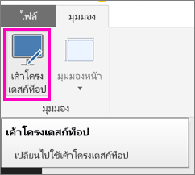
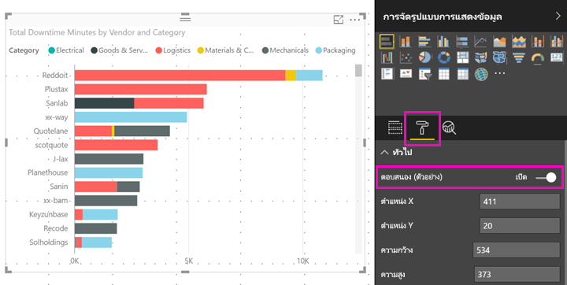

# ปรับวิชวล Power BI ให้เหมาะสมกับทุกขนาด
โดยค่าเริ่มต้น เมื่อคุณสร้างรายงานใหม่ วิชวลเป็นแบบ*ตอบสนอง*: นั่นคือวิชวลจะสามารถเปลี่ยนแปลงเพื่อแสดงข้อมูลและข้อมูลเชิงลึกให้ได้มากที่สุด โดยไม่ขึ้นกับขนาดหน้าจอได้ สำหรับรายงานเก่า คุณสามารถตั้งค่าวิชวลเพื่อปรับขนาดให้ได้มากที่สุดเช่นกัน

เมื่อเปลี่ยนขนาดภาพ Power BI ก็จะจัดลำดับความสำคัญมุมมองข้อมูล ตัวอย่างเช่น เอาช่องว่างภายในออก และย้ายคำอธิบายแผนภูมิไปไว้ด้านบนสุดของภาพโดยอัตโนมัติ เพื่อให้ภาพยังคงแสดงข้อมูลได้ แม้ว่าจะมีขนาดเล็กลงก็ตาม การตอบสนอง จะมีประโยชน์โดยเฉพาะอย่างยิ่งในวิชวลในแอป Power BI สำหรับอุปกรณ์เคลื่อนที่ บนมือถือ

วิชวลใดๆ ทั้งแกน X และแกน Y และตัวแบ่งส่วนข้อมูลสามารถตอบสนองตามที่ปรับขนาดได้เช่นกัน

## เปิดใช้งานการตอบสนองใน Power BI Desktop
1. สำหรับรายงานเก่าใน Power BI Desktop บนแท็บ**มุมมอง** ตรวจสอบให้แน่ใจว่า คุณอยู่ใน**เค้าโครงเดสก์ท็อป**
   
    
2. เลือกวิชวล และในบานหน้าต่าง**การจัดรูปแบบการแสดงข้อมูล** เลือกส่วน**รูปแบบ**
3. ขยาย**ทั่วไป** > และเลื่อน**ตอบสนอง** ไปยัง**เปิด**
   
    
   
     ตอนนี้ เมื่อคุณ[สร้างรายงานที่ปรับให้เหมาะสมสำหรับมือถือ](../desktop-create-phone-report.md)และเพิ่มวิชวลนี้ วิชวลจะปรับขนาดตามอย่างนุ่มนวล

## เปิดใช้งานการตอบสนองในบริการของ Power BI
คุณสามารถเปิดใช้งานการตอบสนองสำหรับวิชวลในรายงานเก่าในบริการของ Power BI คุณจำเป็นต้องแก้ไขรายงานได้

1. ในรายงาน ในบริการของ Power BI ([https://powerbi.com](https://powerbi.com)) เลือก**แก้ไขรายงาน**
2. เลือกวิชวล และในบานหน้าต่าง**การจัดรูปแบบการแสดงข้อมูล** เลือกส่วน**รูปแบบ**
3. ขยาย**ทั่วไป** > และเลื่อน**ตอบสนอง** ไปยัง**เปิด**
   
    
   
     ตอนนี้ เมื่อคุณ[สร้างมุมมองโทรศัพท์ของรายงานนี้](../desktop-create-phone-report.md)และเพิ่มวิชวลนี้ วิชวลจะปรับขนาดตามอย่างน่าพอใจ

## ขั้นตอนถัดไป
* [สร้างรายงานที่ปรับให้เหมาะสมสำหรับแอปมือถือ Power BI](../desktop-create-phone-report.md)
* [ดูรายงาน Power BI ที่ปรับให้เหมาะสมกับโทรศัพท์ของคุณ](../consumer/mobile/mobile-apps-view-phone-report.md)
* คำถามเพิ่มเติมหรือไม่ [ลองถามชุมชน Power BI](http://community.powerbi.com/)

