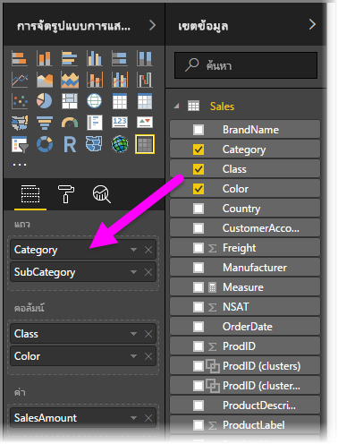
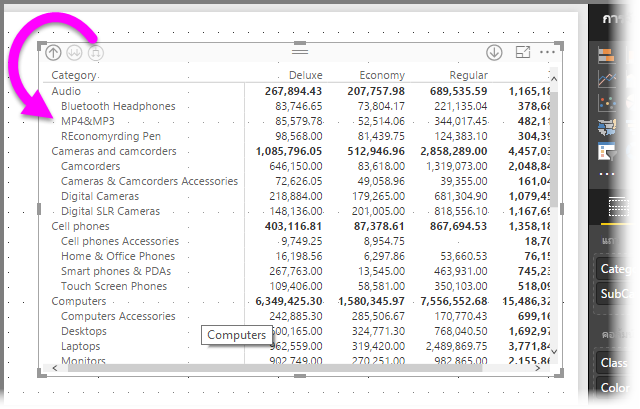
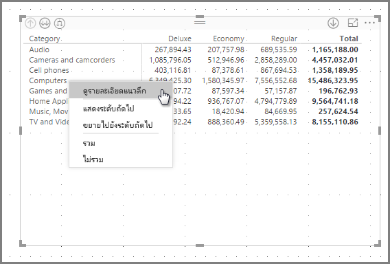
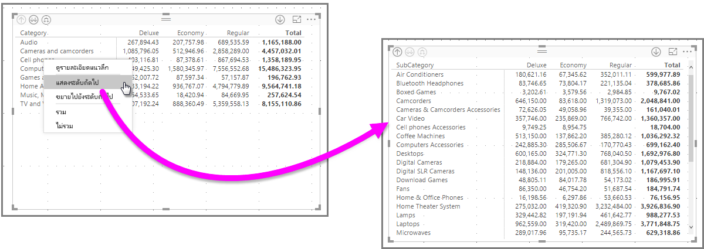
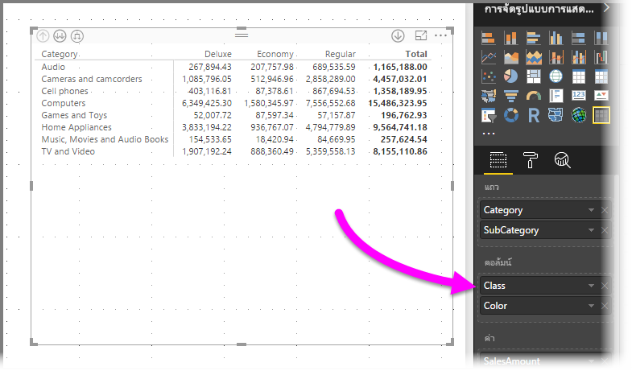
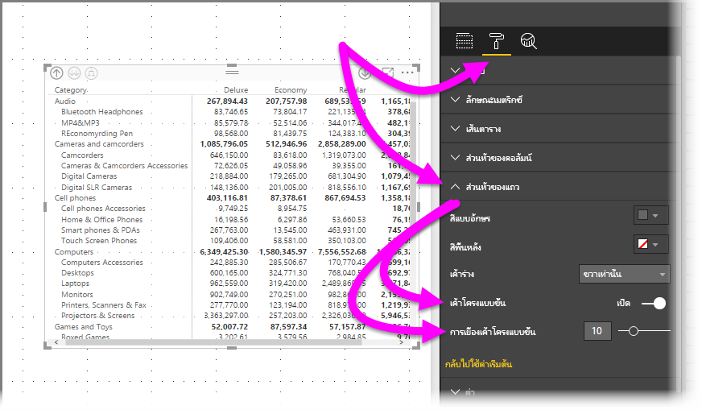
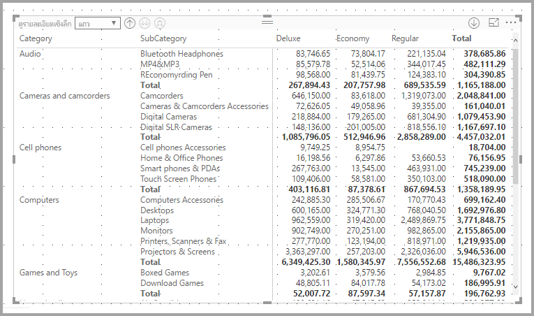
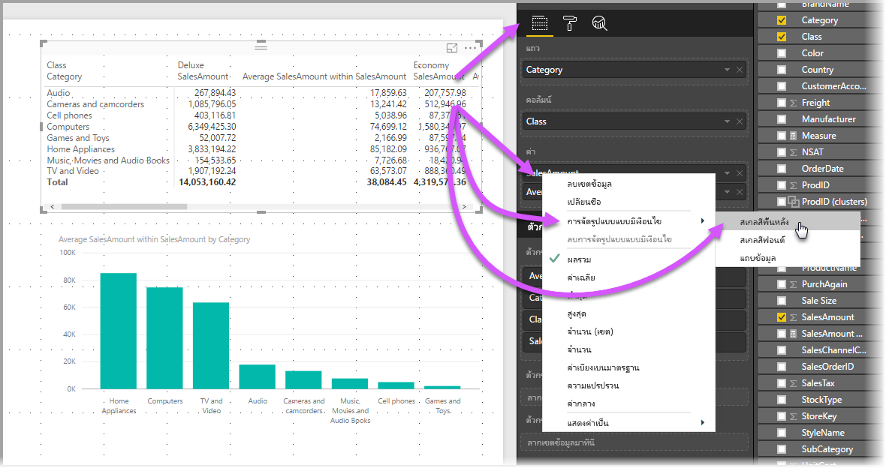
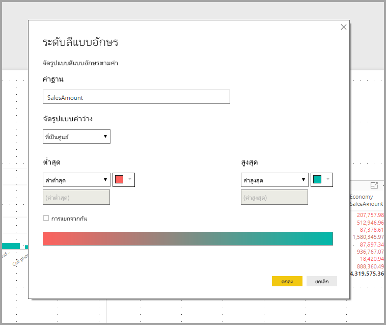

# ใช้วิชวลเมทริกซ์ใน Power BI Desktop
ด้วยคุณลักษณะวิชวล**เมทริกซ์** คุณสามารถสร้างวิชวลเมทริกซ์ (บางครั้งเรียกว่า*ตาราง*) ในรายงาน **Power BI Desktop** และ **Power BI service** และทำไฮไลต์เชื่อมโยงองค์ประกอบภายในเมทริกซ์ กับวิชวลอื่น ๆ นอกจากนี้ คุณยังสามารถเลือกแถว คอลัมน์ และแม้แต่ละเซลล์ และทำไฮไลต์เชื่อมโยง สามารถคัดลอกเซลล์แต่ละเซลล์และชุดเซลล์หลายเซล์ และวางลงในแอปพลิเคชันอื่นได้ สุดท้าย เพื่อทำให้ใช้งานพื้นที่เค้าโครงได้ดียิ่งขึ้น วิชวลเมทริกซ์สนับสนุนรูปแบบขั้น

มีคุณลักษณะมากมายที่เกี่ยวข้องกับเมทริกซ์ และเราจะไปศึกษาในส่วนต่อ ๆ ไปของบทความนี้

## ธีมรายงาน
ทั้งวิชวลเมทริกซ์และตารางสะท้อนถึงสไตล์ (และสี) จาก**ธีมรายงาน**ที่นำมาใช้ ซึ่งอาจไม่ใช่สีที่คุณต้องการสำหรับวิชวลเมทริกซ์ของคุณ คุณสามารถเปลี่ยนได้ในการกำหนดค่า**ธีมรายงาน**ของคุณ สำหรับข้อมูลเพิ่มเติม ดู[**ใช้ธีมรายงานใน Power BI Desktop**](../desktop-report-themes.md) สำหรับข้อมูลเพิ่มเติมเกี่ยวกับธีม

## ทำความเข้าใจวิธีที่ Power BI คำนวณผลรวม

ก่อนที่จะกระโดดลงไปในเรื่อง วิธีใช้วิชวล**เมทริกซ์** จำเป็นต้องทำความเข้าใจวิธีที่ Power BI คำนวณค่าผลรวมและผลรวมย่อย ในตารางและเมทริกซ์ สำหรับแถวผลรวมและผลรวมย่อย หน่วยวัดจะคำนวนจากแถวทั้งหมดในข้อมูลเบื้องต้น - ซึ่ง*ไม่*เพียงแค่การบวกค่าในแถวมองเห็นได้ หรือแถวที่แสดงตรง ๆ นี่หมายความว่า คุณอาจได้ค่าผลรวมที่ต่างจากที่คุณคาดหวัง 

ลองดูวิชวล**เมทริกซ์**ต่อไปนี้ 

ในตัวอย่างนี้ แต่ละแถวในของวิชวล**เมทริกซ์**ที่อยู่ทางด้านขวาสุดแสดง*ยอดรวม*สำหรับแต่ละคู่ของ พนักงานขาย/วันที่ แต่เนื่องจากพนักงานขายปรากฏในวันที่หลาย ๆ วัน ตัวเลขอาจปรากฏขึ้นมากกว่าหนึ่งครั้ง ดังนั้น ผลรวมที่ถูกต้องจากข้อมูลต้นแบบ กับการบวกง่าย ๆ ของค่าที่มองเห็น จะไม่เท่ากัน นี่คือรูปแบบที่พบบ่อย เมื่อค่าที่คุณกำลังรวมอยู่บนด้าน 'หนึ่ง' ของความสัมพันธ์แบบหนึ่งต่อกลุ่ม

เมื่อดูผลรวมและผลรวมย่อย จำไว้ว่า ค่าเหล่านั้นจะยึดตามข้อมูลเบื้องต้น และไม่ขึ้นกับค่าที่มองเห็นเท่านั้น 

## การดูรายละเอียดแนวลึกในภาพเมทริกซ์
ด้วยภาพ**เมทริกซ์** คุณสามารถทำกิจกรรมดูรายละเอียดแนวลึกที่ไม่เคยมีให้บริการมาก่อนได้ ซึ่งรวมถึงความสามารถในการดูรายละเอียดแนวลึกที่ระดับแถว คอลัมน์ และแม้แต่ส่วนและเซลล์ ลองมาดูวิธีการดูรายละเอียดแนวลึก

### การดูรายละเอียดแนวลึกที่ส่วนหัวของแถว
ในบานหน้าต่าง**การแสดงภาพ** เมื่อคุณเพิ่มหลายเขตข้อมูลให้กับส่วน**แถว**ของ**เขตข้อมูล** คุณจะสามารถดูรายละเอียดแนวลึกที่ระดับแถวของภาพเมทริกซ์ได้ ซึ่งจะคล้ายกับการสร้างลำดับชั้นซึ่งจะช่วยให้คุณสามารถดูรายละเอียดแนวลึก (และย้อนกลับ) ตามลำดับชั้นดังกล่าว และวิเคราะห์ข้อมูลในแต่ละระดับได้

ในรูปต่อไปนี้ ส่วน**แถว**ประกอบด้วย*ประเภท*และ*ประเภทย่อย* เป็นการสร้างการจัดกลุ่ม (หรือลำดับชั้น) ของแถวที่เราสามารถดูรายละเอียด

เมื่อวิชวลนี้มีการจัดกลุ่มที่สร้างขึ้นในส่วน**แถว** วิชวลจะแสดงไอคอน*ดูรายละเอียด*และ*ขยาย* ที่มุมบนซ้ายของวิชวล

คล้ายกับการดูรายละเอียดและขยายดูข้อมูลในภาพอื่น ๆ การเลือกปุ่มเหล่านี้ช่วยให้เราสามารถดูรายละเอียดแนวลึก (หรือย้อนกลับ) ตามลำดับชั้น ในกรณีนี้ เราสามารถดูรายละเอียดแนวลึกจาก*ประเภท*ไปจนถึง*ประเภทย่อย*ดังที่แสดงในรูปต่อไปนี้ ที่มีการเลือกไอคอนดูรายละเอียดแนวลึกหนึ่งระดับ (รูปแฉก)

นอกจากการใช้ไอคอนเหล่านั้น คุณสามารถคลิกขวาบนส่วนหัวของแถวใด ๆ และดูรายละเอียดแนวลึกโดยเลือกจากเมนูที่ปรากฏขึ้น

โปรดสังเกตว่า มีหลายตัวเลือกบนเมนูที่ปรากฏ ซึ่งสร้างผลลัพธ์ที่แตกต่างกัน:

เลือก**ดูรายละเอียดแนวลึก** ขยายเมทริกซ์สำหรับแถวระดับ*นั้น* *ยกเว้น*หัวแถวอื่น ๆ ทั้งหมดที่ไม่ใช้หัวแถวที่ถูกคลิกขวา ในรูปต่อไปนี้ *คอมพิวเตอร์*ถูกคลิกขวา และเลือก**ดูรายละเอียดแนวลึก** โปรดสังเกตว่า แถวอื่น ๆ ในระดับบนสุดจะไม่ปรากฏในเมทริกซ์ วิธีการดูรายละเอียดนี้เป็นฟีเจอร์ที่มีประโยชน์ และกลายเป็นสิ่งที่น่าสนใจโดยเฉพาะอย่างยิ่งเมื่อเราไปยังส่วน**การไฮไลต์แบบเชื่อมโยง**

คุณสามารถคลิกที่ไอคอน**ดูข้อมูลสรุป** เพื่อกลับไปยังมุมมองระดับบนสุดก่อนหน้าได้ ถ้าคุณเลือก**แสดงระดับถัดไป**จากเมนูคลิกขวา คุณจะได้รายการตามลำดับตัวอักษร ของรายการในระดับถัดไปทั้งหมด (ในกรณีนี้ คือเขตข้อมูล*ประเภทย่อย*) โดยไม่มีลำดับชั้นสูงกว่าของการจัดประเภท

เมื่อคุณคลิกที่ไอคอน**ดูรายละเอียดแนวขึ้น**ที่มุมบนซ้ายเพื่อให้เมทริกซ์แสดงประเภทระดับบนสุดทั้งหมด แล้วคลิกขวาอีกครั้ง และเลือก**ขยายไปยังระดับถัดไป**คุณจะเห็นภาพต่อไปนี้

คุณยังสามารถใช้รายการเมนู**รวม**และ**ไม่รวม** เพื่อเก็บ (หรือเอาออก ตามลำดับ) แถวที่ถูกคลิกขวา (และประเภทย่อยใด ๆ) จากเมทริกซ์

### ดูรายละเอียดแนวลึกที่ส่วนหัวของคอลัมน์
คล้ายกับความสามารถในการเจาะดูรายละเอียดแนวลึกที่ระดับแถว คุณสามารถยังเจาะรายละเอียดแนวลึกที่ระดับ**คอลัมน์**ได้ด้วย ในรูปต่อไปนี้ คุณเห็นว่า มีสองเขตข้อมูลใน**คอลัมน์** ที่สร้างเป็นลำดับชั้นแบบเดียวกับที่เราใช้กับแถว ก่อนหน้านี้ในบทความ ในเขตข้อมูล**คอลัมน์** เรามี*ชั้น*และ*สี*

ในภาพ**เมทริกซ์** เมื่อเราคลิกขวาคอลัมน์ เราจะเห็นตัวเลือกการดูรายละเอียดแนวลึก ในรูปต่อไปนี้ เราคลิกขวาบน *Deluxe* และเลือก**ดูรายละเอียดแนวลึก**

เมื่อคุณเลือก**ดูรายละเอียดแนวลึก** ลำดับชั้นคอลัมน์ถัดไปของ *Deluxe* จะแสดง ซึ่งในกรณีนี้คือ*สี*

ส่วนที่เหลือของหน่วยข้อมูลของเมนูคลิกขวาใช้งานกับคอลัมน์ในลักษณะเดียวกับที่ใช้กับแถว (ดูส่วนก่อนหน้า**ดูรายละเอียดแนวลึกที่ส่วนหัวของแถว**) คุณสามารถ**แสดงระดับถัดไป**, **ขยายไประดับถัดไป**, **รวม**หรือ**ไม่รวม**คอลัมน์ของคุณ เหมือนกับที่คุณสามารถทำกับแถวได้

> [!NOTE]
> ไอคอนการดูรายละเอียดแนวลึกและแนวขึ้นทางมุมบนซ้ายของภาพเมทริกซ์ใช้ได้กับแถวเท่านั้น เมื่อต้องดูรายละเอียดแนวลึกที่ระดับคอลัมน์ คุณต้องใช้เมนูคลิกขวา
> 
> 

## รูปแบบขั้น กับวิชวลเมทริกซ์
วิชวล**เมทริกซ์** ทำการเยื้องประเภทย่อยในลำดับชั้น ใต้แต่ละประเภทใหญ่ ซึ่งเรียกว่า**รูปแบบขั้น**

ในวิชวลเมทริกซ์ เวอร์ชัน*เดิม* ประเภทย่อยจะถูกแสดงในคอลัมน์ต่างหาก และใช้พื้นที่วิชวลมากขึ้น รูปต่อไปนี้แสดงตารางในภาพ**เมทริกซ์**ต้นฉบับ โปรดสังเกตว่า ประเภทย่อยอยู่ในคอลัมน์แยกต่างหาก

ในรูปต่อไปนี้ คุณเห็นวิชวล**เมทริกซ์** ที่แสดงใน**รูปแบบขั้น** โปรดสังเกตว่า ประเภท*คอมพิวเตอร์* มีประเภทย่อย (อุปกรณ์คอมพิวเตอร์ เดสก์ท็อป แล็ปท็อป จอ ฯลฯ) แสดงเยื้องเล็กน้อย ให้วิชวลดูสะอาดตา และดูแน่นขึ้น

คุณสามารถปรับเปลี่ยนการตั้งค่ารูปแบบขั้นได้อย่างง่ายดาย เมื่อเลือกวิชวล**เมทริกซ์** ในส่วน**รูปแบบ** (ไอคอนลูกกลิ้งสี) ของบานหน้าต่าง**การจัดรูปแบบการแสดงข้อมูล** ขยายส่วน**ส่วนหัวของแถว** คุณมีสองตัวเลือก: การสลับ**รูปแบบขั้น** (ให้เปิดหรือปิด) และ**การเยื้องเค้าโครงแบบขั้น** (ระบุระยะของการเยื้อง เป็นพิกเซล)

ถ้าคุณปิด**รูปแบบขั้น** ประเภทย่อยจะแสดงในอีกคอลัมน์ แทนที่จะเยื้องภายใต้ประเภทหลัก

## ผลรวมย่อย กับวิชวลเมทริกซ์
คุณสามารถเปิดปิดผลรวมย่อย ในวิชวลเมทริกซ์ สำหรับทั้งแถวและคอลัมน์ ในรูปต่อไปนี้ คุณเห็นการตั้งค่าผลรวมย่อยของแถว เป็น**เปิด**

ในส่วน**จัดรูปแบบ**ของบานหน้าต่าง**การแสดงภาพ** ขยายการ์ด**ผลรวมย่อย**และเปลี่ยนตัวเลื่อน**แถวของผลรวมย่อย**ให้เป็น **ปิด** เมื่อคุณทำเช่นนั้น จะไม่มีแสดงผลรวมย่อย

กระบวนการเดียวกัน ใช้ได้กับผลรวมย่อยของคอลัมน์

## การไฮไลต์เชื่อมโยง ด้วยวิชวลเมทริกซ์
ด้วยวิชวล**เมทริกซ์** คุณสามารถเลือกองค์ประกอบใด ๆ ในเมทริกซ์ให้เป็นพื้นฐานสำหรับการไฮไลต์เชื่อมโยงได้ เลือกคอลัมน์ใน**เมทริกซ์** และคอลัมน์นั้นจะถูกไฮไลต์ เช่นเดียวกับวิชวลอื่น ๆ บนหน้ารายงาน ไฮไลต์เชื่อมโยงชนิดนี้เป็นฟีเจอร์ทั่วไปของภาพและการเลือกจุดข้อมูลอื่น ๆ ดังนั้นภาพ**เมทริกซ์**จะให้ฟังก์ชันเดียวกัน

นอกจากนี้ การใช้ Ctrl+คลิก ยังใช้ได้กับการไฮไลต์เชื่อมโยง ตัวอย่างเช่น ในรูปต่อไปนี้ คอลเลกชันของประเภทย่อย ถูกเลือกในวิชวล**เมทริกซ์** สังเกตว่า รายการที่ไม่ได้เลือกในวิชวลจะเป็นสีเทา และวิชวลอื่น ๆ บนหน้าสะท้อนการเลือกในวิชวล**เมทริกซ์**

## คัดลอกค่าจาก Power BI เพื่อนำไปใช้ในแอปพลิเคชันอื่น

เมทริกซ์หรือตารางของคุณอาจมีเนื้อหาที่คุณต้องการใช้ในแอปพลิเคชันอื่น เช่น Dynamics CRM, Excel และแม้แต่รายงาน Power BI อื่นๆ คุณสามารถคัดลอกเซลล์แต่ละเซลล์หรือชุดเซลล์หลายเซลล์ลงบนคลิปบอร์ดได้ด้วยการคลิกขวาที่ Power BI จากนั้นวางลงในแอปพลิเคชันอื่น

* เมื่อต้องการคัดลอกเซลล์เดียว ให้เลือกเซลล์นั้น คลิกขวา แล้วเลือก**คัดลอกค่า** ในตอนนี้คุณก็สามารถวางค่าที่คัดลอกลงในแอปพลิเคชันอื่นได้ โดยจะได้ค่าเซลล์ที่ไม่ได้จัดรูปแบบในคลิปบอร์ด

    

* เมื่อต้องการคัดลอกหลายเซลล์ ให้เลือกช่วงเซลล์ หรือใช้ปุ่ม CTRL เพื่อเลือกเซลล์อย่างน้อยหนึ่งเซลล์ ส่วนคัดลอกจะมีส่วนหัวของคอลัมน์และแถว

    

## การแรเงาและสีแบบอักษร กับวิชวลเมทริกซ์
ด้วยวิชวล**เมทริกซ์** คุณสามารถใช้**การจัดรูปแบบตามเงื่อนไข** (สีและแรเงา) ในพื้นหลังของเซลล์ภายในเมทริกซ์ และคุณสามารถใช้การจัดรูปแบบตามเงื่อนไข กับข้อความและค่า

เพื่อใช้การจัดรูปแบบตามเงื่อนไข คุณสามารถทำอย่างใดอย่างหนึ่งต่อไปนี้เมื่อเลือกวิชวลเมทริกซ์แล้ว:

* ในบานหน้าต่าง**เขตข้อมูล** คลิกขวาที่เขตข้อมูล และเลือก**การจัดรูปแบบตามเงื่อนไข**จากเมนู
  
  
* หรือ ในบานหน้าต่าง**รูปแบบ** ขยายการ์ด**การจัดรูปแบบตามเงื่อนไข** และสำหรับ**สเกลสีพื้นหลัง**หรือ**สเกลสีฟอนต์** เลื่อนแถบเลื่อนเพื่อ**เปิด** การเปิดใช้งานตัวเลือกตัวหนึ่งใดจะแสดงลิงก์ของ*ตัวควบคุมขั้นสูง*ที่ให้คุณกำหนดสีและค่าสำหรับการจัดรูปแบบสี
  
  

วิธีอย่างใดอย่างหนึ่งข้างบน จะให้ผลลัพธ์เดียวกัน การเลือก*การควบคุมขั้นสูง* จะแสดงกล่องโต้ตอบต่อไปนี้ ให้คุณทำการปรับปรุง:

## ขั้นตอนถัดไป

[แผนภูมิแบบกระจายและแบบฟองสบู่ใน Power BI](power-bi-visualization-scatter.md)

[ชนิดการแสดงภาพใน Power BI](power-bi-visualization-types-for-reports-and-q-and-a.md)