# สร้างการแสดงข้อมูลเมทริกซ์ใน Power BI

[!INCLUDE[consumer-appliesto-nyyn](../includes/consumer-appliesto-nyyn.md)]

[!INCLUDE [power-bi-visuals-desktop-banner](../includes/power-bi-visuals-desktop-banner.md)]

เมทริกซ์วิชวลจะคล้ายกับตาราง  ตารางสนับสนุนสองมิติและข้อมูลที่อยู่แบบแฟลตหมายความว่าการคัดลอกวิธีแสดงค่าจะไม่รวมกัน เมทริกซ์ทำให้การแสดงข้อมูลง่ายและมีความหมายในทั้งหลายมิติและเมทริกซ์สนับสนุนการจัดวางอย่างเป็นขั้นเป็นตอน เมทริกซ์จะรวมข้อมูลโดยอัตโนมัติและสามารถเจาะลึกลงไป 

คุณสามารถสร้างวิชวลเมทริกซ์ในรายงาน **Power BI Desktop** และทำไฮไลต์เชื่อมโยงองค์ประกอบภายในเมทริกซ์กับวิชวลอื่น ๆ ที่อยู่ในหน้ารายงานนั้น ยกตัวอย่างเช่นคุณยังสามารถเลือกแถว คอลัมน์ และแม้แต่ละเซลล์ และทำไฮไลต์เชื่อมโยง และยังสามารถคัดลอกเซลล์เดียวและหลายเซลล์ และวางลงในแอปพลิเคชันอื่นได้ 

มีคุณลักษณะมากมายที่เกี่ยวข้องกับเมทริกซ์ และเราจะไปศึกษาในส่วนต่อ ๆ ไปของบทความนี้

> [!NOTE]
> การแชร์รายงานของคุณกับผู้ร่วมงาน Power BI กำหนดให้คุณต้องมีสิทธิ์การใช้งาน Power BI Pro แต่ละรายการ หรือรายงานจะถูกบันทึกในความจุแบบพรีเมียม

## ทำความเข้าใจวิธีที่ Power BI คำนวณผลรวม

ก่อนที่จะเข้าสู่เรื่องวิธีใช้วิชวลเมทริกซ์ คุณจำเป็นต้องเรียนรู้วิธีที่ Power BI คำนวณค่าผลรวมและผลรวมย่อยในตารางและเมทริกซ์ สำหรับแถวผลรวมและผลรวมย่อย Power Bi จะประเมิน หน่วยวัดจากแถวทั้งหมดในข้อมูลเบื้องต้น - ซึ่งไม่เพียงแค่การบวกค่าในแถวมองเห็นได้ หรือแถวที่แสดงตรง ๆ นี่หมายความว่า คุณอาจได้ค่าผลรวมที่ต่างจากที่คุณคาดหวัง

ลองดูวิชวลเมทริกซ์ต่อไปนี้ 

ในตัวอย่างนี้ แต่ละแถวในของวิชวลเมทริกซ์ที่อยู่ทางด้านขวาสุดแสดง*ยอดรวม*สำหรับแต่ละคู่ของ พนักงานขาย/วันที่ แต่เนื่องจากพนักงานขายปรากฏในวันที่หลาย ๆ วัน ตัวเลขอาจปรากฏขึ้นมากกว่าหนึ่งครั้ง ดังนั้น ผลรวมที่ถูกต้องจากข้อมูลต้นแบบ กับการบวกง่าย ๆ ของค่าที่มองเห็น จะไม่เท่ากัน นี่คือรูปแบบที่พบบ่อย เมื่อค่าที่คุณกำลังรวมอยู่บนด้าน 'หนึ่ง' ของความสัมพันธ์แบบหนึ่งต่อกลุ่ม

เมื่อคุณดูผลรวมและผลรวมย่อย จำไว้ว่าค่าเหล่านั้นจะยึดตามข้อมูลเบื้องต้น ค่าเหล่านั้นไม่ได้ยึดตามตัวเลขที่มองเห็นเพียงอย่างเดียว

## การขยายและการยุบส่วนหัวของแถว
มีสองวิธีที่คุณสามารถขยายส่วนหัวของแถวได้ ขั้นตอนแรกคือการคลิกขวาที่เมนู คุณจะเห็นตัวเลือกเพื่อขยายส่วนหัวของแถวนั้นๆ ที่คุณเลือก ระดับทั้งหมด หรือทุกอย่างไปจนถึงระดับสุดท้ายของลำดับชั้น คุณมีตัวเลือกที่คล้ายกันสำหรับการยุบส่วนหัวของแถวเช่นกัน

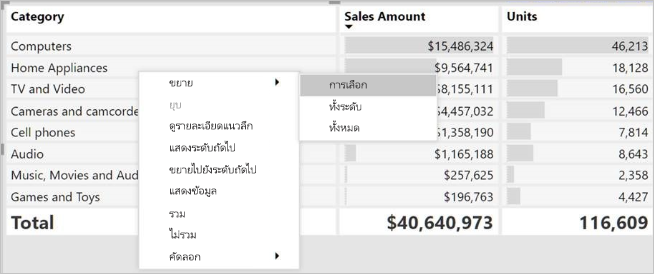

คุณยังสามารถเพิ่มปุ่ม +/- ไปยังส่วนหัวของแถวผ่านบานหน้าต่างการจัดรูปแบบภายใต้การ์ด**ส่วนหัวของแถว** ได้ ตามค่าเริ่มต้น ไอคอนจะตรงกับการจัดรูปแบบของส่วนหัวของแถว แต่คุณสามารถกำหนดสีและขนาดของไอคอนแยกต่างหากได้ถ้าคุณต้องการ

เมื่อเปิดไอคอนแล้ว จะทำงานคล้ายกับไอคอน PivotTable ใน Excel

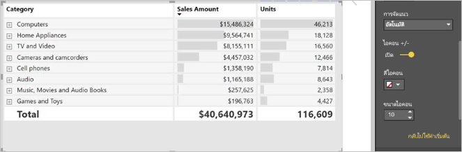

สถานะการขยายของเมทริกซ์จะบันทึกกับรายงานของคุณ คุณสามารถปักหมุดเมทริกซ์ไปยังแดชบอร์ดที่ขยายหรือยุบได้ เมื่อเลือกไทล์แดชบอร์ดและรายงานเปิดอยู่ ยังสามารถเปลี่ยนแปลงสถานะการขยายในรายงานได้ 

> [!NOTE]
> ถ้าคุณกำลังสร้างรายงานเพิ่มเติมจากโมเดล Analysis Services หลายมิติ จะมีข้อควรพิจารณาพิเศษบางอย่างสำหรับการขยาย/ยุบ ในกรณีที่แบบจำลองนั้นใช้คุณลักษณะสมาชิกเริ่มต้น สำหรับข้อมูลเพิ่มเติม โปรดอ่านที่[ทำงานกับแบบจำลองหลายมิติใน Power BI](../desktop-default-member-multidimensional-models.md)

## การดูรายละเอียดแนวลึกในภาพเมทริกซ์
ด้วยภาพเมทริกซ์คุณสามารถทำกิจกรรมดูรายละเอียดแนวลึกที่ไม่เคยมีให้บริการมาก่อนได้ ซึ่งรวมถึงความสามารถในการดูรายละเอียดแนวลึกที่ระดับแถว คอลัมน์ และแม้แต่ส่วนและเซลล์ ลองมาดูวิธีการดูรายละเอียดแนวลึก

### การดูรายละเอียดแนวลึกที่ส่วนหัวของแถว

ในบานหน้าต่างการแสดงภาพเมื่อคุณเพิ่มหลายเขตข้อมูลให้กับส่วน**แถว**ของ**เขตข้อมูล** คุณจะสามารถดูรายละเอียดแนวลึกที่ระดับแถวของภาพเมทริกซ์ได้ ซึ่งจะคล้ายกับการสร้างลำดับชั้นซึ่งจะช่วยให้คุณสามารถดูรายละเอียดแนวลึก (และย้อนกลับ) ตามลำดับชั้นดังกล่าว และวิเคราะห์ข้อมูลในแต่ละระดับได้

ในรูปต่อไปนี้ ส่วน**แถว**ประกอบด้วย*ขั้นตอนการขาย*และ*ขนาดของโอกาส* เป็นการสร้างการจัดกลุ่ม (หรือลำดับชั้น) ของแถวที่เราสามารถดูรายละเอียด

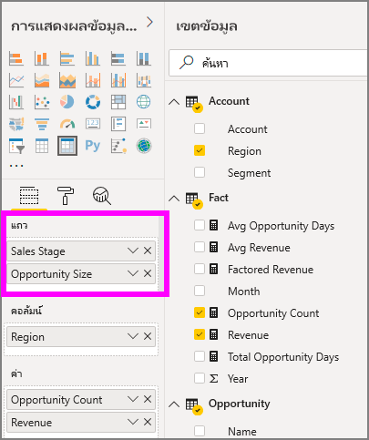

เมื่อวิชวลนี้มีการจัดกลุ่มที่สร้างขึ้นในส่วน**แถว** วิชวลจะแสดงไอคอน*ดูรายละเอียด*และ*ขยาย* ที่มุมบนซ้ายของวิชวล

คล้ายกับการดูรายละเอียดและขยายดูข้อมูลในภาพอื่น ๆ การเลือกปุ่มเหล่านี้ช่วยให้เราสามารถดูรายละเอียดแนวลึก (หรือย้อนกลับ) ตามลำดับชั้น ในกรณีนี้ เราสามารถดูรายละเอียดแนวลึกจาก*ขั้นตอนการขาย*ไปจนถึง*ขนาดของโอกาส*ดังที่แสดงในรูปต่อไปนี้ ที่มีการเลือกไอคอนดูรายละเอียดแนวลึกหนึ่งระดับ (รูปแฉก)

นอกจากการใช้ไอคอนเหล่านั้น คุณสามารถเลือกส่วนหัวของแถวใด ๆ และดูรายละเอียดแนวลึกโดยเลือกจากเมนูที่ปรากฏขึ้น

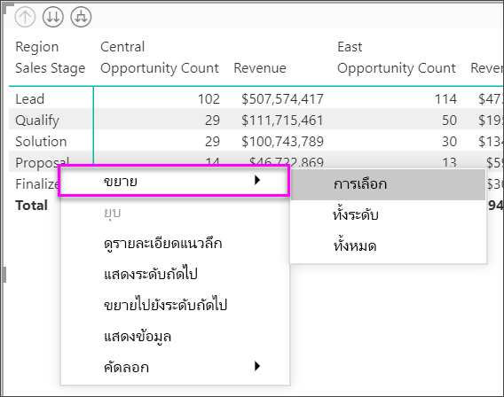

โปรดสังเกตว่า มีหลายตัวเลือกบนเมนูที่ปรากฏ ซึ่งสร้างผลลัพธ์ที่แตกต่างกัน:

เลือก**ดูรายละเอียดแนวลึก** ขยายเมทริกซ์สำหรับแถวระดับ*นั้น* *ยกเว้น*หัวแถวอื่น ๆ ทั้งหมดที่ไม่ใช้หัวแถวที่ถูกเลือก ในรูปต่อไปนี้**ข้อเสนอ** > **ที่เป็นรายละเอียดแนวลึก**จะถูกเลือก โปรดสังเกตว่า แถวอื่น ๆ ในระดับบนสุดจะไม่ปรากฏในเมทริกซ์ วิธีการดูรายละเอียดนี้เป็นคุณลักษณะที่มีประโยชน์ และกลายเป็นสิ่งที่น่าสนใจโดยเฉพาะอย่างยิ่งเมื่อเราไปยังส่วนการไฮไลต์แบบเชื่อมโยง

เลือกที่ไอคอน**ดูรายละเอียดเลื่อนขึ้น** เพื่อกลับไปยังมุมมองระดับบนสุดก่อนหน้าได้ ถ้าคุณเลือก**ข้อเสนอ** > **แสดงระดับถัดไป** คุณจะได้รายการตามลำดับของรายการในระดับถัดไปทั้งหมด (ในกรณีนี้ คือเขตข้อมูล*ขนาดของโอกาส*) โดยไม่มีลำดับชั้นสูงกว่าของการจัดประเภท

เลือกไอคอน**ดูรายละเอียดเลื่อนขึ้น**ที่มุมบนซ้ายเพื่อให้เมทริกซ์แสดงประเภทระดับบนสุดทั้งหมด แล้วเลือก**ข้อเสนอ** > **ขยายไปยังระดับถัดไป**เพื่อดูค่าทั้งหมดสำหรับทั้งสองระดับของลำดับชั้น - *ขั้นตอนการขาย*และ*ขนาดของโอกาส*

คุณยังสามารถใช้รายการเมนู**ขยาย**เพื่อควบคุมการแสดงเพิ่มเติมได้  ตัวอย่าง เลือก**ข้อเสนอ** > **การขยาย** > **การเลือก** Power BI แสดงผลรวมหนึ่งแถวสำหรับแต่ละ*ขั้นตอนการขาย*และตัวเลือก*ขนาดของโอกาส*สำหรับ*ข้อเสนอ*ทั้งหมด

### ดูรายละเอียดแนวลึกที่ส่วนหัวของคอลัมน์
คล้ายกับความสามารถในการเจาะดูรายละเอียดแนวลึกที่ระดับแถว คุณสามารถยังเจาะรายละเอียดแนวลึกที่ระดับคอลัมน์ได้ด้วย ในรูปต่อไปนี้ มีสองเขตข้อมูลใน**คอลัมน์** ที่สร้างเป็นลำดับชั้นแบบเดียวกับที่เราใช้กับแถว ก่อนหน้านี้ในบทความ ในเขตข้อมูล**คอลัมน์** เรามี*ภูมิภาค*และ*เซกเมนต์* ทันทีที่เขตข้อมูลที่สองถูกเพิ่มไปยัง**คอลัมน์**เมนูดรอปดาวน์ใหม่จะแสดงบนวิชวล ขณะนี้กำลังแสดงข้อมูล**แถว**ให้ได้ชม

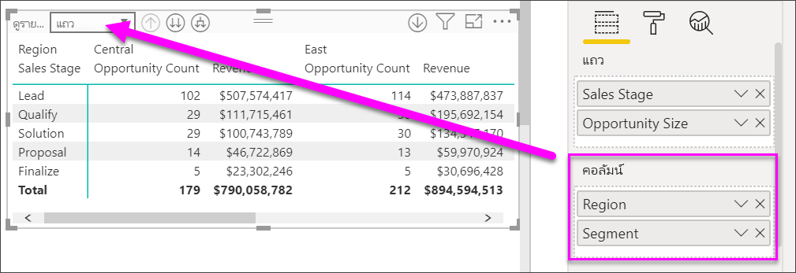

เมื่อต้องดูรายละเอียดแนวลึกบนคอลัมน์ เลือก**คอลัมน์**จากการเมนู*ดูรายละเอียดเลื่อนขึ้น*ที่อยู่มุมบนซ้ายของเมทริกซ์ เลือกภูมิภาค*ตะวันออก*และเลือก**รายละเอียดแนวลึก**

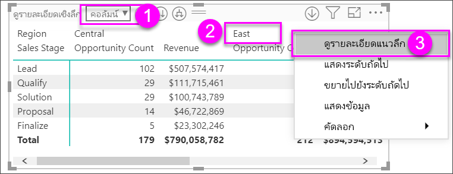

เมื่อคุณเลือก**ดูรายละเอียดแนวลึก** ลำดับชั้นคอลัมน์ถัดไปของ *ภูมิภาค>ตะวันออก* จะแสดง ซึ่งในกรณีนี้คือ*จำนวนโอกาส* ภูมิภาคอื่น ๆ ถูกซ่อนไว้

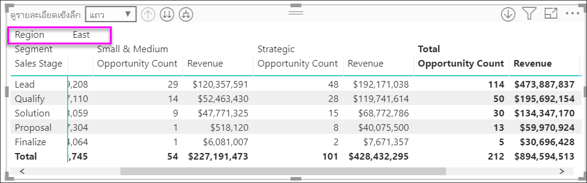

ส่วนที่เหลือของหน่วยข้อมูลของเมนูใช้งานกับคอลัมน์ในลักษณะเดียวกับที่ใช้กับแถว (ดูส่วนก่อนหน้า**ดูรายละเอียดแนวลึกที่ส่วนหัวของแถว**) คุณสามารถ**แสดงระดับถัดไป**, **ขยายไประดับถัดไป** ด้วยคอลัมน์ของคุณเหมือนกับที่คุณสามารถทำได้กับแถวได้

> [!NOTE]
> ไอคอนการดูรายละเอียดแนวลึกและแนวขึ้นทางมุมบนซ้ายของภาพเมทริกซ์ใช้ได้กับแถวเท่านั้น เมื่อต้องดูรายละเอียดแนวลึกที่ระดับคอลัมน์ คุณต้องใช้เมนูคลิกขวา

## รูปแบบขั้น กับวิชวลเมทริกซ์

วิชวลเมทริกซ์ทำการเยื้องประเภทย่อยในลำดับชั้นใต้แต่ละประเภทใหญ่ เรียกว่ารูปแบบขั้น

ในวิชวลเมทริกซ์ เวอร์ชันเดิมประเภทย่อยจะถูกแสดงในคอลัมน์ต่างหาก และใช้พื้นที่วิชวลมากขึ้น รูปต่อไปนี้แสดงตารางในวิชวลเมทริกซ์ต้นฉบับ โปรดสังเกตว่าประเภทย่อยอยู่ในคอลัมน์แยกต่างหาก

ในรูปต่อไปนี้ คุณจะเห็นวิชวลเมทริกซ์ที่แสดงในรูปแบบขั้น โปรดสังเกตว่า ประเภท*คอมพิวเตอร์* มีประเภทย่อย (อุปกรณ์คอมพิวเตอร์ เดสก์ท็อป แล็ปท็อป จอ ฯลฯ) แสดงเยื้องเล็กน้อย ให้วิชวลดูสะอาดตา และดูแน่นขึ้น

คุณสามารถปรับเปลี่ยนการตั้งค่ารูปแบบขั้นได้อย่างง่ายดาย เมื่อเลือกวิชวลเมทริกซ์ ในส่วน**รูปแบบ** (ไอคอนลูกกลิ้งสี) ของบานหน้าต่าง**การจัดรูปแบบการแสดงข้อมูล** ขยายส่วนส่วนหัวของแถว คุณมีสองตัวเลือก: การสลับรูปแบบขั้น (ให้เปิดหรือปิด) และการเยื้องเค้าโครงแบบขั้น (ระบุระยะของการเยื้องเป็นพิกเซล)

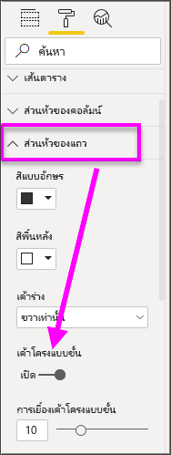

ถ้าคุณปิดรูปแบบขั้น Power BI จะแสดงประเภทย่อยในอีกคอลัมน์ แทนที่จะเยื้องภายใต้ประเภทหลัก

## ผลรวมย่อยและทั้งหมด ด้วยวิชวลเมทริกซ์

คุณสามารถเปิดปิดผลรวมย่อย ในวิชวลเมทริกซ์ สำหรับทั้งแถวและคอลัมน์ ในรูปต่อไปนี้ คุณเห็นการตั้งค่าผลรวมย่อยของแถว เป็น**เปิด** และตั้งค่าให้แสดงผลที่ด้านล่าง

เมื่อคุณเปิด **ผลรวมย่อย** และเพิ่มป้ายกำกับ Power BI ยังสามารถเพิ่มแถว และป้ายกำกับเดียวกัน สำหรับมูลค่าผลรวมทั้งหมด เมื่อต้องการจัดรูปแบบผลรวมทั้งหมดของคุณ ให้เลือกตัวเลือกรูปแบบสำหรับ **ผลรวมทั้งหมด** 

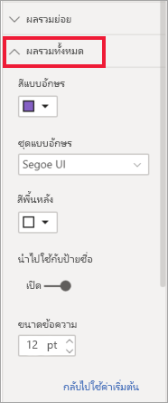

หากคุณต้องการปิดผลรวมย่อยและผลรวมทั้งหมด ในส่วนจัดรูปแบบของบานหน้าต่างการจัดรูปแบบการแสดงข้อมูล ขยายการ์ด**ผลรวมย่อย** เปลี่ยนแถบเลื่อนแถวผลรวมย่อยเป็น **ปิด** เมื่อคุณทำเช่นนั้น จะไม่มีแสดงผลรวมย่อย

กระบวนการเดียวกัน ใช้ได้กับผลรวมย่อยของคอลัมน์

## เพิ่มไอคอนที่แสดงเงื่อนไข
เพิ่มการแสดงภาพลงในตารางหรือเมทริกซ์ของคุณด้วย *ไอคอนแบบมีเงื่อนไข* 

ในส่วนรูปแบบของบานหน้าต่างการแสดงภาพ ให้ขยายการ์ด **การจัดรูปแบบตามเงื่อนไข** เลื่อนแถบเลื่อน**ไอคอน**ไปยัง**เปิด** และเลือก **ตัวควบคุมขั้นสูง**

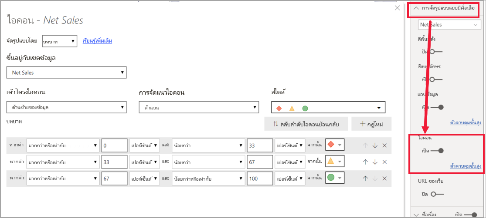

ปรับเงื่อนไข ไอคอนและสีสำหรับเมทริกซ์ของคุณและเลือก **ตกลง** ในตัวอย่างนี้ เราใช้ธงสีแดงสำหรับรายการที่มีมูลค่าน้อย วงกลมสีม่วงสำหรับรายการที่มีมูลค่าสูง และสามเหลี่ยมสีเหลืองสำหรับรายการอื่นๆ 

## การไฮไลต์เชื่อมโยง ด้วยวิชวลเมทริกซ์

ด้วยวิชวลเมทริกซ์ คุณสามารถเลือกองค์ประกอบใด ๆ ในเมทริกซ์ให้เป็นพื้นฐานสำหรับการไฮไลต์เชื่อมโยงได้ เลือกคอลัมน์ในเมทริกซ์และคอลัมน์นั้นจะถูกไฮไลต์โดย Power BI เช่นเดียวกับวิชวลอื่น ๆ ในหน้ารายงาน ไฮไลต์เชื่อมโยงชนิดนี้เป็นคุณลักษณะทั่วไปของภาพและการเลือกจุดข้อมูลอื่น ๆ ดังนั้นวิชวลเมทริกซ์จะให้ฟังก์ชันเดียวกัน

นอกจากนี้ การใช้ Ctrl+คลิก ยังใช้ได้กับการไฮไลต์เชื่อมโยง ตัวอย่างเช่น ในรูปต่อไปนี้ คอลเลกชันของประเภทย่อยถูกเลือกในวิชวลเมทริกซ์ สังเกตได้ว่า รายการที่ไม่ได้เลือกในวิชวลจะเป็นสีเทา และวิชวลอื่น ๆ บนหน้าสะท้อนการเลือกในวิชวลเมทริกซ์

## คัดลอกค่าจาก Power BI เพื่อนำไปใช้ในแอปพลิเคชันอื่น

ตารางหรือเมทริกซ์ของคุณอาจมีเนื้อหาที่คุณต้องการใช้ในแอปพลิเคชันอื่น ๆ: Dynamics CRM, Excel และรายงาน Power BI อื่นๆ คุณสามารถคัดลอกเซลล์เดียวหรือหลายเซลล์ลงบนคลิปบอร์ดได้ด้วยการคลิกขวาที่ Power BI จากนั้นวางลงในแอปพลิเคชันอื่น

* เมื่อต้องการคัดลอกเซลล์เดียว ให้เลือกเซลล์นั้น คลิกขวา แล้วเลือก**คัดลอกค่า** ในตอนนี้คุณก็สามารถวางค่าที่คัดลอกลงในแอปพลิเคชันอื่นได้ โดยจะได้ค่าเซลล์ที่ไม่ได้จัดรูปแบบในคลิปบอร์ด

    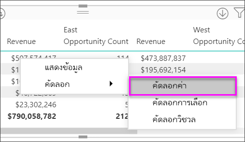

* เมื่อต้องการคัดลอกหลายเซลล์ ให้เลือกช่วงเซลล์ หรือใช้ปุ่ม CTRL เพื่อเลือกเซลล์อย่างน้อยหนึ่งเซลล์ 

    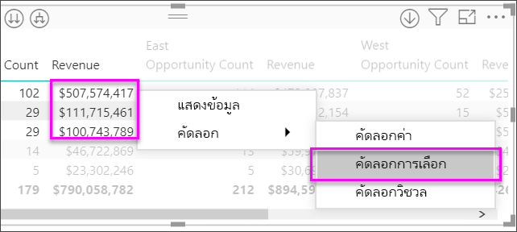

* ส่วนคัดลอกจะมีส่วนหัวของคอลัมน์และแถว

    

* ในการทำสำเนาของวิชวลที่มีเฉพาะเซลล์ที่คุณเลือกเท่านั้น ให้เลือกอย่างน้อยหนึ่งเซลล์โดยใช้ CTRL, คลิกขวา และเลือก**คัดลอกวิชวล**

    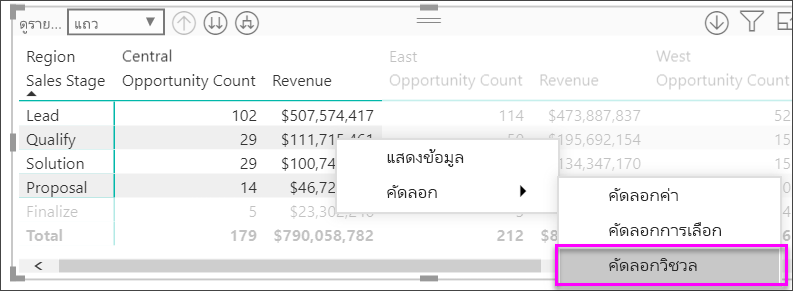

* สำเนาจะเป็นการจัดรูปแบบการแสดงข้อมูลเมทริกซ์อื่น แต่มีเพียงข้อมูลที่เป็นสำเนาของคุณเท่านั้น

    

## ตั้งค่าเมทริกซ์เป็น URL ที่กำหนดเอง

หากคุณมีคอลัมน์หรือหน่วยวัดที่ประกอบด้วย URL เว็บไซต์ คุณสามารถใช้การจัดรูปแบบตามเงื่อนไขเพื่อใช้ URL เหล่านั้นกับเขตข้อมูลเป็นลิงก์ที่ใช้งานอยู่ได้ คุณจะพบตัวเลือกนี้ภายใต้การ์ด **การจัดรูปแบบตามเงื่อนไข** ในแถบการจัดรูปแบบ

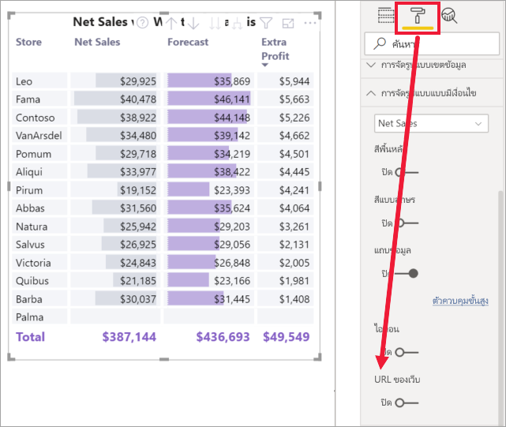

เปิด  **URL ของเว็บ** และเลือกเขตข้อมูลที่จะใช้เป็น URL สำหรับคอลัมน์ เมื่อนำไปใช้แล้ว ค่าในเขตข้อมูลนั้น (คอลัมน์) จะกลายเป็นลิงก์ที่ใช้งานอยู่ เลื่อนวางเม้าส์เพื่อดูลิงก์และเลือกเพื่อข้ามไปยังหน้านั้น 

สำหรับข้อมูลเพิ่มเติม ดูที่ [การจัดรูปแบบตารางแบบมีเงื่อนไข](../desktop-conditional-table-formatting.md)

## การแรเงาและสีแบบอักษร กับวิชวลเมทริกซ์
ด้วยวิชวลเมทริกซ์ คุณสามารถใช้การจัดรูปแบบตามเงื่อนไข (สี แรเงา และแถบข้อมูล) ในพื้นหลังของเซลล์ภายในเมทริกซ์ และคุณสามารถใช้การจัดรูปแบบตามเงื่อนไขกับข้อความและค่า

ในการใช้การจัดรูปแบบตามเงื่อนไข เลือกเมทริกซ์วิชวลและเปิดใน**รูปแบบ**บานหน้าต่าง ขยายการ์ด**การจัดรูปแบบตามเงื่อนไข**และสำหรับ**สีพื้นหลัง** **สีฟอนต์**หรือ**แถบข้อมูล** เลื่อนแถบเลื่อนเพื่อ**เปิด** การเปิดใช้งานตัวเลือกตัวใดตัวหนึ่งจะแสดงลิงก์ของ*ตัวควบคุมขั้นสูง*ที่ให้คุณกำหนดสีและค่าสำหรับการจัดรูปแบบสี
  
  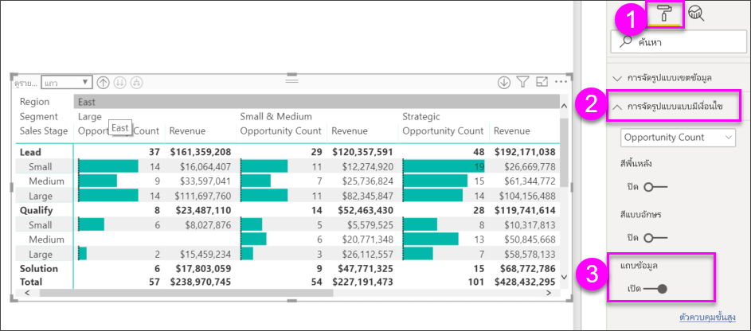

การเลือก*การควบคุมขั้นสูง* จะแสดงกล่องโต้ตอบที่สามารถให้คุณทำการปรับปรุง ตัวอย่างนี้แสดงกล่องโต้ตอบสำหรับ**แถบข้อมูล**

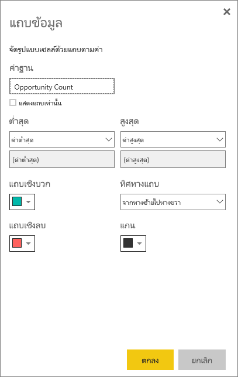

## ข้อควรพิจารณาและการแก้ไขปัญหา

* หากข้อมูลข้อความในเซลล์หรือส่วนหัวของตารางของคุณมีอักขระบรรทัดใหม่ อักขระเหล่านั้นจะถูกละเว้นถ้าคุณสลับตัวเลือก 'การตัดคำ' ในการ์ดบานหน้าต่างการจัดรูปแบบที่เกี่ยวข้องขององค์ประกอบ 

## ขั้นตอนถัดไป

[วิชวล Power Apps สำหรับ Power BI](power-bi-visualization-powerapp.md)

[ชนิดการแสดงภาพใน Power BI](power-bi-visualization-types-for-reports-and-q-and-a.md)
