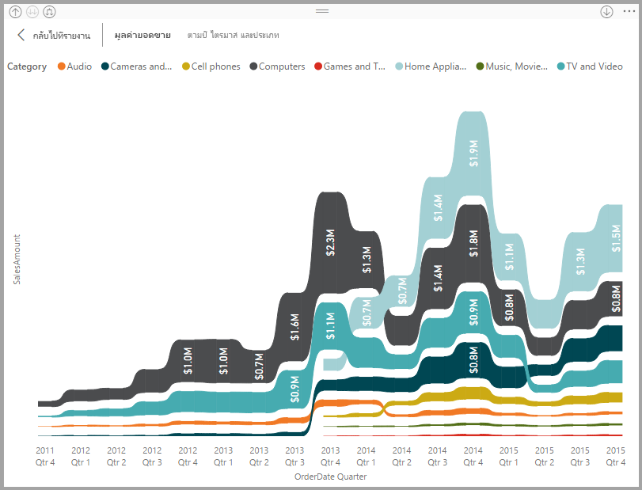
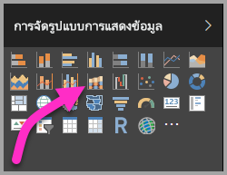

# ใช้แผนภูมิ ribbon ใน Power BI
คุณสามารถใช้แผนภูมิ Ribbon เพื่อแสดงภาพข้อมูล และทราบได้อย่างรวดเร็วว่า ข้อมูลประเภทไหนมีอันดับสูงสุด (มีค่ามากสุด) ได้ แผนภูมิ Ribbon เหมาะกับการแสดงการเปลี่ยนแปลงอันดับ โดยที่ค่าอันดับสูงสุดจะแสดงอยู่ด้านบนสุดของแต่ละช่วงเวลาเสมอ 

## สร้างแผนภูมิ ribbon
เพื่อการทำตาม ให้เปิด[รายงานตัวอย่างวิเคราะห์ร้านค้าปลีก](../sample-retail-analysis.md) 

1. เพื่อสร้างแผนภูมิ Ribbon เลือก**แผนภูมิ Ribbon** จากแผง**การแสดงภาพ**

    

    แผนภูมิ Ribbon เชื่อมต่อประเภทของข้อมูลผ่านช่วงเวลาที่แสดงภาพอย่างต่อเนื่องโดยใช้ Ribbon ให้คุณมองเห็นว่าแต่ละประเภทถูกจัดอันดับอย่างไรตลอดช่วงของแกน X ของแผนภูมิ (ซึ่งมักจะเป็นแกนเวลา)

2. เลือกเขตข้อมูลสำหรับ**แกน**, **คำอธิบายแผนภูมิ** และ**ค่า**  ในตัวอย่างนี้ เราได้เลือก: **วัน**, **ประเภท** และ **ยอดขายของปีนี้**  

    

    เนื่องจากชุดข้อมูลประกอบด้วยข้อมูลเพียงหนึ่งปีเท่านั้น เราจึงลบเขตข้อมูล **ปี** ออกจากหลุม **แกน** 

3. แผนภูมิริบบอนแสดงอันดับสำหรับทุก ๆ เดือน สังเกตว่าอันดับมีการเปลี่ยนแปลงอย่างไรตลอดเวลา  ตัวอย่างเช่นหมวดหมู่ โฮม เปลี่ยนจากสามเป็นสี่และกลับไปเป็นสามอีกครั้ง หมวดหมู่ จูเนียร์ เปลี่ยนจากสามเป็นห้าในเดือนกรกฎาคม 

    

## จัดรูปแบบแผนภูมิ ribbon
เมื่อคุณสร้างแผนภูมิ ribbon คุณมีตัวเลือกจัดรูปแบบในส่วน**รูปแบบ**ของบานหน้าต่าง**แสดงภาพ** ตัวเลือกจัดรูปแบบสำหรับแผนภูมิ ribbon จะคล้ายกับตัวเลือกสำหรับแผนภูมิคอลัมน์แบบเรียงซ้อน และมีตัวเลือกจัดรูปแบบเพิ่มเติมที่ใช้กับเฉพาะ ribbon

ตัวเลือกการจัดรูปแบบสำหรับแผนภูมิ Ribbon เหล่านี้ ให้คุณปรับรูปแบบเหล่านี้ได้

* **ระยะห่าง** ช่วยให้คุณปรับช่องว่างที่จะแสดงระหว่าง ribbon ตัวเลขเป็นเปอร์เซ็นต์ของความสูงมากสุดของคอลัมน์
* **ตรงกับสีชุดข้อมูล** ช่วยให้คุณสามารถจับคู่สีของ ribbon ให้มีสีเดียวกับของชุดข้อมูล เมื่อตั้งค่าเป็น **ปิด** Ribbon จะกลายเป็นสีเทา
* **โปร่งใส** กำหนดว่า ribbon ต่าง ๆ จะมีความโปร่งใสแค่ไหน ค่าเริ่มต้นคือ 30
* **ขอบ** ให้คุณวางขอบสีเข้มบนด้านบนและด้านล่างของ ribbon ต่าง ๆ ตามค่าเริ่มต้น จะไม่แสดงขอบ

เนื่องจากแผนภูมิริบบอนไม่มีป้ายกำกับแกน y คุณอาจต้องการเพิ่มป้ายชื่อข้อมูล จากบานหน้าต่างจัดรูปแบบ เลือก **ป้ายชื่อข้อมูล** 

ตั้งค่าตัวเลือกการจัดรูปแบบสำหรับป้ายชื่อข้อมูลของคุณ  ในตัวอย่างนี้เราได้ตั้งค่าสีของตัวอักษรเป็นสีขาว ตำแหน่งทศนิยมเป็นศูนย์ และแสดงหน่วยเป็นพัน 

## ขั้นตอนถัดไป

[แผนภูมิกระจายและแผนภูมิฟองใน Power BI](power-bi-visualization-scatter.md)

[ชนิดการแสดงภาพใน Power BI](power-bi-visualization-types-for-reports-and-q-and-a.md)