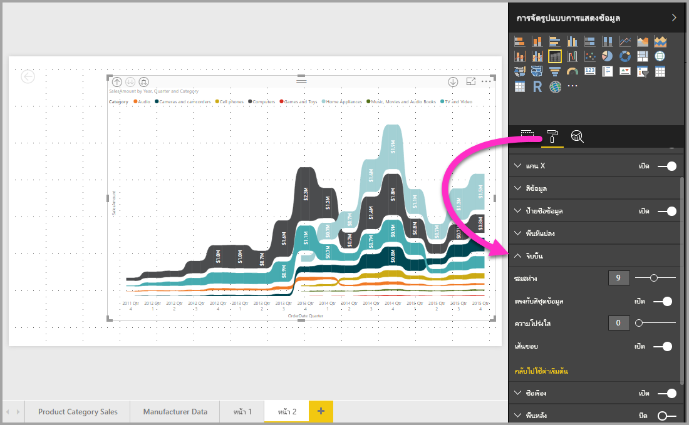

# ใช้แผนภูมิ ribbon ใน Power BI
คุณสามารถใช้แผนภูมิ Ribbon เพื่อแสดงภาพข้อมูล และทราบได้อย่างรวดเร็วว่า ข้อมูลประเภทไหนมีอันดับสูงสุด (มีค่ามากสุด) ได้ แผนภูมิ Ribbon เหมาะกับการแสดงการเปลี่ยนแปลงอันดับ โดยที่ค่าอันดับสูงสุดจะแสดงอยู่ด้านบนสุดของแต่ละช่วงเวลาเสมอ 

## สร้างแผนภูมิ ribbon
เพื่อสร้างแผนภูมิ Ribbon เลือก**แผนภูมิ Ribbon** จากแผง**การแสดงภาพ**

แผนภูมิ Ribbon เชื่อมต่อประเภทของข้อมูลผ่านช่วงเวลาที่แสดงภาพอย่างต่อเนื่องโดยใช้ Ribbon ให้คุณมองเห็นว่าแต่ละประเภทถูกจัดอันดับอย่างไรตลอดช่วงของแกน X ของแผนภูมิ (ซึ่งมักจะเป็นแกนเวลา)

## จัดรูปแบบแผนภูมิ ribbon
เมื่อคุณสร้างแผนภูมิ ribbon คุณมีตัวเลือกจัดรูปแบบในส่วน**รูปแบบ**ของบานหน้าต่าง**แสดงภาพ** ตัวเลือกจัดรูปแบบสำหรับแผนภูมิ ribbon จะคล้ายกับตัวเลือกสำหรับแผนภูมิคอลัมน์แบบเรียงซ้อน และมีตัวเลือกจัดรูปแบบเพิ่มเติมที่ใช้กับเฉพาะ ribbon

ตัวเลือกการจัดรูปแบบสำหรับแผนภูมิ Ribbon เหล่านี้ ให้คุณปรับรูปแบบเหล่านี้ได้

* **ระยะห่าง** ช่วยให้คุณปรับช่องว่างที่จะแสดงระหว่าง ribbon ตัวเลขเป็นเปอร์เซ็นต์ของความสูงมากสุดของคอลัมน์
* **ตรงกับสีชุดข้อมูล** ช่วยให้คุณสามารถจับคู่สีของ ribbon ให้มีสีเดียวกับของชุดข้อมูล เมื่อตั้งค่าเป็น **ปิด** Ribbon จะกลายเป็นสีเทา
* **โปร่งใส** กำหนดว่า ribbon ต่าง ๆ จะมีความโปร่งใสแค่ไหน ค่าเริ่มต้นคือ 30
* **ขอบ** ให้คุณวางขอบสีเข้มบนด้านบนและด้านล่างของ ribbon ต่าง ๆ ตามค่าเริ่มต้น จะไม่แสดงขอบ

## ขั้นตอนถัดไป

[แผนภูมิกระจายและแผนภูมิฟองใน Power BI](power-bi-visualization-scatter.md)

[ชนิดการแสดงภาพใน Power BI](power-bi-visualization-types-for-reports-and-q-and-a.md)