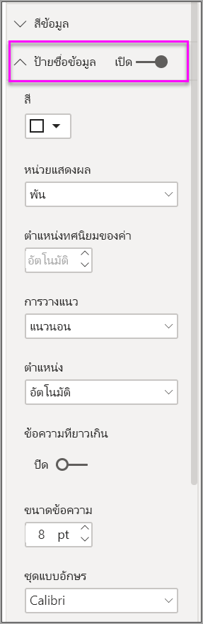

# ใช้แผนภูมิแถบริบบอนใน Power BI

[!INCLUDE[consumer-appliesto-nyyn](../includes/consumer-appliesto-nyyn.md)]    

[!INCLUDE [power-bi-visuals-desktop-banner](../includes/power-bi-visuals-desktop-banner.md)]

คุณสามารถสร้างแผนภูมิแถบริบบอนเพื่อแสดงภาพข้อมูล และค้นหาได้อย่างรวดเร็วว่าข้อมูลประเภทใดมีอันดับสูงสุด (มีค่ามากที่สุด) ได้ แผนภูมิ Ribbon เหมาะกับการแสดงการเปลี่ยนแปลงอันดับ โดยที่ค่าอันดับสูงสุดจะแสดงอยู่ด้านบนสุดของแต่ละช่วงเวลาเสมอ 

> [!NOTE]
> การแชร์รายงานของคุณกับผู้ร่วมงาน Power BI กำหนดให้คุณต้องมีสิทธิ์การใช้งาน Power BI Pro แต่ละรายการ หรือรายงานจะถูกบันทึกในความจุแบบพรีเมียม ดู [การแชร์รายงาน](../collaborate-share/service-share-reports.md)

## ข้อกำหนดเบื้องต้น

บทช่วยสอนนี้ใช้[ไฟล์ PBIX ตัวอย่างการวิเคราะห์การค้าปลีก](https://download.microsoft.com/download/9/6/D/96DDC2FF-2568-491D-AAFA-AFDD6F763AE3/Retail%20Analysis%20Sample%20PBIX.pbix)

1. จากด้านบนซ้ายของแถบเมนู เลือก **ไฟล์** > **เปิด**
   
2. ค้นหาสำเนา**ไฟล์ PBIX ตัวอย่างการวิเคราะห์การค้าปลีก**

1. เปิด**ไฟล์ PBIX ตัวอย่างการวิเคราะห์การค้าปลีก**ในมุมมองรายงาน 

1. เลือก  หากต้องการเพิ่มหน้าใหม่

## สร้างแผนภูมิ ribbon

1. เพื่อสร้างแผนภูมิ Ribbon เลือก**แผนภูมิ Ribbon** จากแผง**การแสดงภาพ**

    

    แผนภูมิ Ribbon เชื่อมต่อประเภทของข้อมูลผ่านช่วงเวลาที่แสดงภาพอย่างต่อเนื่องโดยใช้ Ribbon ให้คุณมองเห็นว่าแต่ละประเภทถูกจัดอันดับอย่างไรตลอดช่วงของแกน X ของแผนภูมิ (ซึ่งมักจะเป็นแกนเวลา)

2. เลือกเขตข้อมูลสำหรับ**แกน**, **คำอธิบายแผนภูมิ** และ**ค่า**  ในตัวอย่างนี้ เราได้เลือก: **จัดเก็บ** > **OpenDate**, **หมวดหมู่** > **รายการ** และ **ยอดขาย** > **ยอดขายปีนี้** > **มูลค่า**  

    

    เนื่องจากชุดข้อมูลประกอบด้วยข้อมูลเพียงหนึ่งปีเท่านั้น เราจึงลบเขตข้อมูล **ปี** และ **ไตรมาส** ออกจาก **แกน**

3. แผนภูมิริบบอนแสดงอันดับสำหรับทุกเดือน สังเกตว่าอันดับมีการเปลี่ยนแปลงอย่างไรตลอดเวลา ตัวอย่างเช่น ประเภทหน้าแรกย้ายจากลำดับที่สองไปยังที่ห้า จากเดือนกุมภาพันธ์ไปยังมีนาคม

    

## จัดรูปแบบแผนภูมิ ribbon
เมื่อคุณสร้างแผนภูมิ ribbon คุณมีตัวเลือกจัดรูปแบบในส่วน**รูปแบบ**ของบานหน้าต่าง**แสดงภาพ** ตัวเลือกจัดรูปแบบสำหรับแผนภูมิ ribbon จะคล้ายกับตัวเลือกสำหรับแผนภูมิคอลัมน์แบบเรียงซ้อน และมีตัวเลือกจัดรูปแบบเพิ่มเติมที่ใช้กับเฉพาะ ribbon

ตัวเลือกการจัดรูปแบบสำหรับแผนภูมิ Ribbon เหล่านี้ ให้คุณปรับรูปแบบเหล่านี้ได้

* **ระยะห่าง** ช่วยให้คุณปรับช่องว่างที่จะแสดงระหว่าง ribbon ตัวเลขเป็นเปอร์เซ็นต์ของความสูงมากสุดของคอลัมน์
* **ตรงกับสีชุดข้อมูล** ช่วยให้คุณสามารถจับคู่สีของ ribbon ให้มีสีเดียวกับของชุดข้อมูล เมื่อตั้งค่าเป็น **ปิด** Ribbon จะกลายเป็นสีเทา
* **โปร่งใส** กำหนดว่า ribbon ต่าง ๆ จะมีความโปร่งใสแค่ไหน ค่าเริ่มต้นคือ 30
* **ขอบ** ให้คุณวางขอบสีเข้มบนด้านบนและด้านล่างของ ribbon ต่าง ๆ ตามค่าเริ่มต้น จะไม่แสดงขอบ

เนื่องจากแผนภูมิริบบอนไม่มีป้ายกำกับแกน y คุณอาจต้องการเพิ่มป้ายชื่อข้อมูล จากบานหน้าต่างจัดรูปแบบ เลือก **ป้ายชื่อข้อมูล** 

ตั้งค่าตัวเลือกการจัดรูปแบบสำหรับป้ายชื่อข้อมูลของคุณ ในตัวอย่างนี้ เราได้ตั้งค่าสีของตัวอักษรเป็นสีขาวและแสดงหน่วยเป็นพัน

## ขั้นตอนถัดไป

[แผนภูมิกระจายและแผนภูมิฟองใน Power BI](power-bi-visualization-scatter.md)

[ชนิดการแสดงภาพใน Power BI](power-bi-visualization-types-for-reports-and-q-and-a.md)
