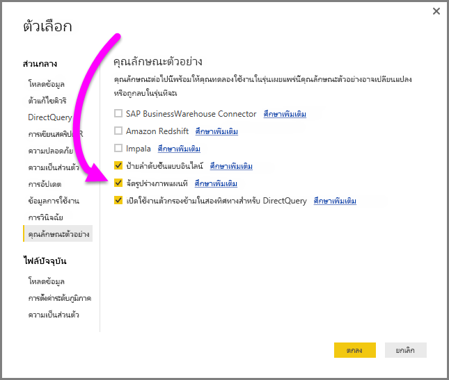
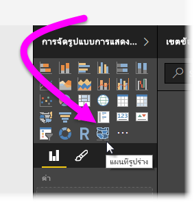
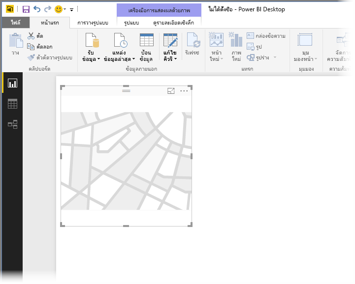
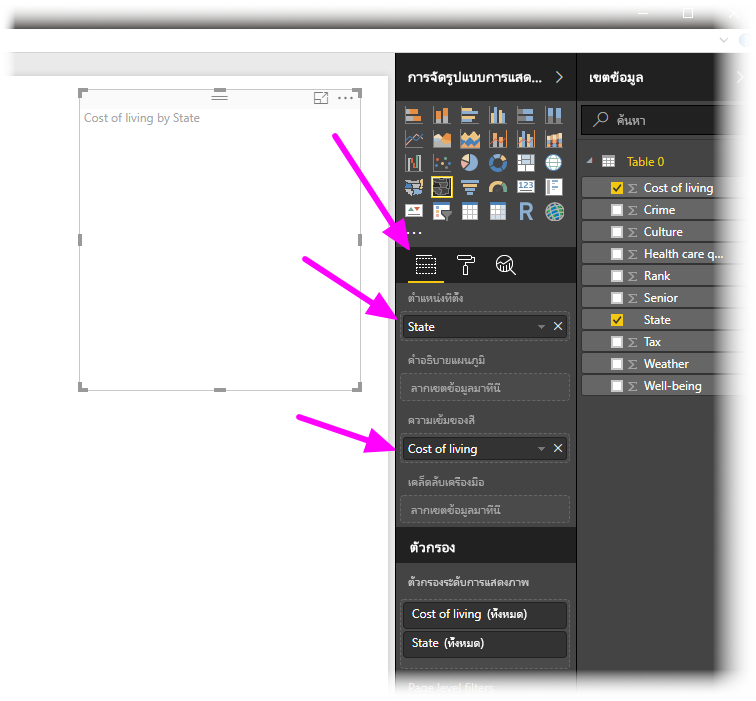
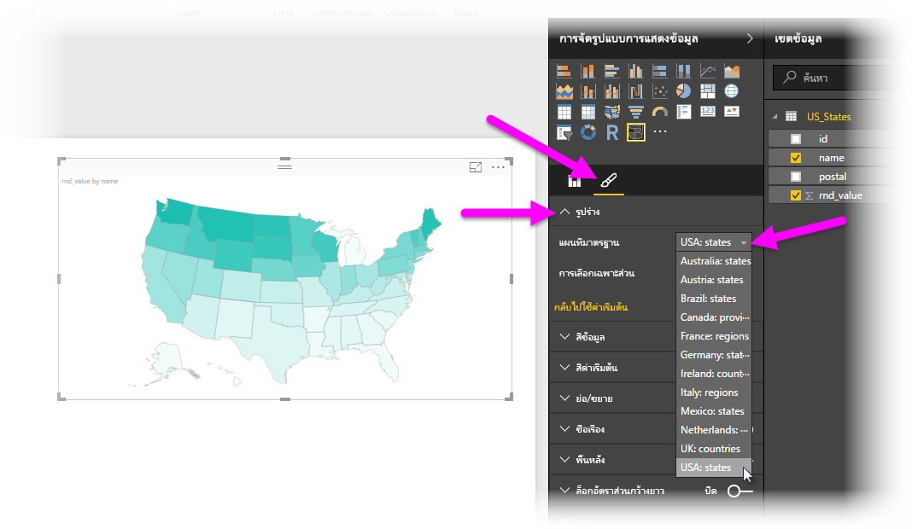
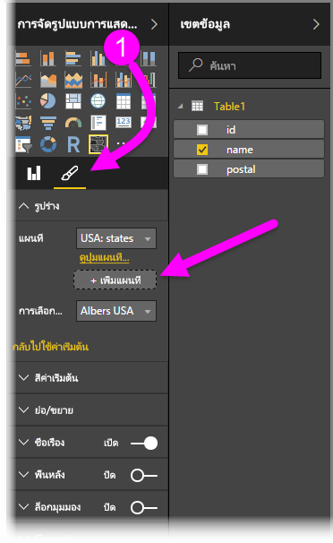
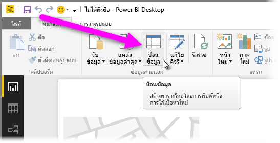
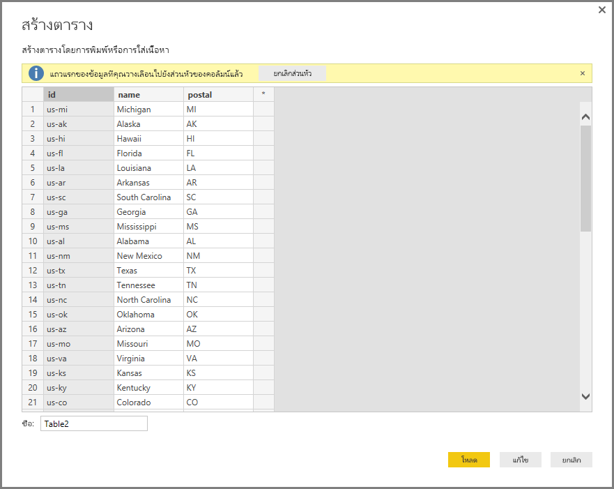

# แผนที่รูปร่างใน Power BI Desktop (ตัวอย่าง)
สร้างภาพ**แผนที่รูปร่าง**เพื่อเปรียบเทียบภูมิภาคบนแผนที่โดยใช้สี ไม่เหมือนกับภาพ**แผนที่** **แผนที่รูปร่าง**ไม่สามารถแสดงตำแหน่งที่ตั้งทางภูมิศาสตร์อย่างแม่นยำของจุดข้อมูลบนแผนที่ได้ แต่วัตถุประสงค์หลักคือการเปรียบเทียบภูมิภาคบนแผนที่โดยการใช้สีแตกต่างกัน

ภาพ**แผนที่รูปร่าง**มาจากแผนที่ ESRI/TopoJSON ซึ่งมีความสามารถในการใช้แผนที่แบบกำหนดเองที่คุณสามารถสร้างได้ ตัวอย่างของแผนที่แบบกำหนดเองคือ: แผนที่ทางภูมิศาสตร์ แผนที่เก้าอี้นั่ง แผนที่การจัดเรียง แผนผังชั้น และอื่น ๆ ความสามารถในการใช้แผนที่แบบกำหนดเองของ**แผนที่รูปร่าง** จะยังไม่มีในรุ่นตัวอย่างนี้

## การสร้างแผนที่รูปร่าง
คุณสามารถทดลองตัวควบคุม**แผนที่รูปร่าง** ด้วยแผนที่ที่มาพร้อมรุ่นตัวอย่างนี้ หรือคุณสามารถใช้แผนที่แบบกำหนดเองของคุณเองได้ถ้าเป็นไปตามข้อกำหนดที่ระบุไว้ในส่วน**ใช้แผนที่แบบกำหนดเอง** .

วิชวล**แผนที่รูปร่าง**ยังเป็นคุณลักษณะตัวอย่าง และต้องเปิดใช้งานใน Power BI Desktop เพื่อเปิดใช้งาน**แผนที่รูปร่าง** เลือก**ไฟล์ > ตัวเลือกและการตั้งค่า > ตัวเลือก > คุณลักษณะตัวอย่าง** จากนั้นเลือกกล่องกาเครื่องหมาย**จัดรูปทรงวิชวลแผนที่** คุณจะต้องรีสตาร์ท Power BI Desktop หลังจากที่คุณทำการเลือกแล้ว

เมื่อเปิดใช้งาน**แผนที่รูปร่าง**แล้ว คลิกที่**แผนที่รูปร่าง** จากบานหน้าต่าง**การจัดรูปแบบการแสดงข้อมูล**

Power BI Desktop จะสร้างวิชวล**แผนที่รูปร่าง**ที่ว่างเปล่าบนพื้นที่ทำงาน

ทำตามขั้นตอนต่อไปนี้เพื่อสร้าง**แผนที่รูปร่าง**:

1. ในบานหน้าต่าง**เขตข้อมูล** ลากเขตข้อมูลที่มีชื่อภูมิภาค (หรือตัวย่อ) ไปยังบักเก็ต**สถานที่ตั้ง** และเขตข้อมูลหน่วยวัดลงในบักเก็ต**การอิ่มตัวสี** (คุณจะยังไม่เห็นแผนที่ในตอนนี้)

   > [!NOTE]
   > ดูส่วนที่ชื่อ**การรับข้อมูลแผนที่**ด้านล่าง สำหรับวิธีการรับข้อมูลแผนที่สำหรับทดลองกับ**แผนที่รูปร่าง**อย่างรวดเร็ว
   > 
   > 

   
2. ในบานหน้าต่างการตั้งค่า**รูปแบบ** ขยาย**รูปร่าง** แล้วเลือกจากรายการดรอปดาวน์**แผนที่มาตรฐาน**เพื่อแสดงข้อมูลของคุณ ในตอนนี้ การแสดงภาพปรากฎขึ้น ดังที่แสดงในรูปต่อไปนี้

   

   > [!NOTE]
   > ในส่วน**คีย์ภูมิภาค**ตอนท้ายของบทความนี้ เป็นคอลเลกชันของตารางที่มีคีย์ภูมิภาค ที่คุณสามารถใช้ทดลองวิชวล**แผนที่รูปร่าง**
   > 
   > 
3. คุณสามารถปรับเปลี่ยน การเลือกเฉพาะส่วน และการย่อ/ขยายแผนที่ ตลอดจนสีของจุดข้อมูล จากบานหน้าต่างการตั้งค่า**รูปแบบ**ได้ นอกจากนี้คุณยังสามารถเปลี่ยนการตั้งค่า การย่อ/ขยาย ตัวอย่างเช่น คุณสามารถเปลี่ยนสี ตั้งค่าสูงสุดและต่ำสุด ฯลฯ

   
4. คุณยังสามารถเพิ่มคอลัมน์ข้อมูลประเภท ไปยังบักเก็ต**คำอธิบายแผนภูมิ** และจัดกลุ่มภูมิภาคตามประเภทได้

## ใช้แผนที่แบบกำหนดเอง
คุณสามารถใช้แผนที่แบบกำหนดเองกับ**แผนที่รูปร่าง** ตราบใดที่แผนที่อยู่ในรูปแบบ **TopoJSON** ได้ ถ้าแผนของคุณอยู่ในรูปแบบอื่น คุณสามารถใช้เครื่องมือออนไลน์เช่น [ **Map Shaper**](http://mapshaper.org/) เพื่อแปลงแผนที่ *shapefiles* หรือ *GeoJSON* ของคุณ ไปเป็นรูปแบบ **TopoJSON**

เพื่อใช้ไฟล์แผนที่ **TopoJSON** ของคุณ เพิ่มวิชวลแผนที่รูปร่างลงในรายงานคุณ และเพิ่มข้อมูลลงในบักเก็ต *สถานที่ตั้ง* และ *การอิ่มตัวสี* จากนั้น ในบานหน้าต่าง**การจัดรูปแบบการแสดงข้อมูล** ที่มีการเลือกส่วน**รูปแบบ**ไว้แล้ว (แสดงเป็น (1) ในรูปต่อไปนี้) ขยายส่วน**รูปร่าง** และเลือก **+ เพิ่มแผนที**

## ตัวอย่างแผนที่แบบกำหนดเอง
*สำนักงานอัยการสหรัฐอเมริกา*เผยแพร่รายงานประจำปีงบประมาณในเรื่องคดีและข้อมูลภาระคดี  รายงานของพวกเขาทั้งหมด สามารถพบได้ในลิงก์ด้านล่าง

https://www.justice.gov/usao/resources/annual-statistical-reports

เนื่องจากรัฐสามารถแบ่งออกเป็นหลายเขต เราจำเป็นต้องใช้แผนที่รูปร่างแบบกำหนดเอง  โดยการนำเข้าแผนที่ **TopoJSON** ของเขตทางศาลของสหรัฐอเมริกาลงใน **Power BI Desktop** จากนั้นเราสามารถแสดงภาพงบประมาณรายปี ของข้อมูลอัยการเขตได้  รูปด้านล่างแสดงตัวอย่างของแผนที่นี้

คุณสามารถทำสิ่งที่น่าสนใจ กับแผนที่แต่ละรัฐเช่นเดียวกัน และแสดงรายละเอียดเพิ่มเติมตามเขตซึ่งประกอบขึ้นเป็นรัฐ 

ถ้าคุณต้องการทดลองกับชุดข้อมูลและการแสดงภาพนี้ คุณสามารถดาวน์โหลดไฟล์ PBIX ต้นฉบับที่ใช้สร้างรายงานนี้ได้ จากลิงก์ต่อไปนี้

* [ไฟล์ PBIX สาธิตแผนที่รูปร่างแบบกำหนดเอง](http://download.microsoft.com/download/1/2/8/128943FB-9231-42BD-8A5D-5E2362C9D589/DistrictAttorneyFiscalReport.pbix)

## การรับข้อมูลแผนที่
เพื่อให้ได้ข้อมูลใส่ลงในรูปแบบได้อย่างรวดเร็ว สำหรับการทดสอบ**แผนที่รูปร่าง** คุณสามารถคัดลอกตารางที่ส่วนท้ายของบทความนี้ จากนั้นเลือก**ป้อนข้อมูล** จาก ribbon **หน้าแรก**ได้

ถ้าข้อมูลของคุณมีหลายคอลัมน์ คุณจะต้องใช้ตัวแก้ไขเช่น Excel เพื่อวางข้อมูล จากนั้นคัดลอกข้อมูลทีละคอลัมน์แยกจากกัน จากนั้นคุณสามารถวางข้อมูลลงใน Power BI Desktop แถวบนสุดจะถูกกำหนดให้เป็นส่วนหัวโดยอัตโนมัติ

คุณสามารถใส่คอลัมน์ใหม่ โดยการพิมพ์ชื่อคอลัมน์ใหม่ (ในคอลัมน์ว่างทางด้านขวา) จากนั้นเพิ่มค่าในเซลล์แต่ละเซลล์ เหมือนกับที่คุณทำใน Excel เมื่อเสร็จแล้ว เลือก**โหลด**และตารางจะถูกเพิ่มลงในรูปแบบข้อมูลสำหรับ Power BI Desktop

> [!NOTE]
> เมื่อทำงานกับประเทศหรือภูมิภาค ใช้ตัวย่อสามตัวอักษรเพื่อให้แน่ใจว่า การกำหนดพิกัดทางภูมิศาสตร์ทำงานได้อย่างถูกต้องในการแสดงภาพแผนที่ *อย่า*ใช้ตัวย่อสองตัวอักษร เนื่องจากอาจไม่รู้จักบางประเทศหรือบางภูมิภาค
> 
> ถ้าคุณมีเพียงตัวย่อสองตัวอักษร ดู[บล็อกโพสต์ภายนอกนี้](https://blog.ailon.org/how-to-display-2-letter-country-data-on-a-power-bi-map-85fc738497d6#.yudauacxp)สำหรับขั้นตอนการเชื่อมโยงตัวย่อประเทศ/ภูมิภาคแบบสองตัวอักษรของคุณ เข้ากับตัวย่อประเทศ/ภูมิภาคแบบสามตัวอักษร
> 
> 

## ลักษณะการทำงานและข้อกำหนด
มีข้อพิจารณาและข้อกำหนดสองสามข้อ สำหรับ**แผนที่รูปร่าง**ในการเผยแพร่ตัวอย่างนี้:

* วิชวล**แผนที่รูปร่าง**ยังเป็นคุณลักษณะตัวอย่าง และต้องเปิดใช้งานใน Power BI Desktop เพื่อเปิดใช้งาน**แผนที่รูปร่าง** เลือก**ไฟล์ > ตัวเลือกและการตั้งค่า > ตัวเลือก > คุณลักษณะตัวอย่าง** จากนั้นเลือกกล่องกาเครื่องหมาย**จัดรูปทรงวิชวลแผนที่**
* ในปัจจุบัน คุณต้องตั้งค่าบักเก็ต**การอิ่มตัวสี** เพื่อให้การจัดกลุ่ม**คำอธิบายแผนภูมิ**ทำงานได้ถูกต้อง
* สำหรับ**แผนที่รูปร่าง**รุ่นเผยแพร่จริง จะมีส่วนติดต่อผู้ใช้ที่แสดงคีย์สำหรับแผนที่ที่เลือกในปัจจุบัน (**แผนที่รูปร่าง**ยังเป็นตัวอย่าง และยังไม่กำหนดวันเผยแพร่จริง) ในรุ่นตัวอย่างนี้ คุณสามารถอ้างอิงคีย์ภูมิภาค ตามตารางที่พบในส่วน**คีย์ภูมิภาค**ของบทความนี้
* วิชวล**แผนที่รูปร่าง** จะแสดงจุดข้อมูลได้สูงสุด 1000 จุด

## คีย์ภูมิภาค
ใช้**คีย์ภูมิภาค**ต่อไปนี้ ในรุ่นตัวอย่างเพื่อทดสอบ**แผนที่รูปร่าง**

### ออสเตรเลีย: รัฐ

| `id` | `abbr` | `iso` | `name` | `postal` |
| --- | --- | --- | --- | --- |
| au-wa |WA |AU-WA |Western Australia |WA |
| au-vic |Vic |AU-VIC |Victoria |VIC |
| au-tas |Tas |AU-TAS |Tasmania |TAS |
| au-sa |SA |AU-SA |South Australia |SA |
| au-qld |Qld |AU-QLD |Queensland |QLD |
| au-nt |NT |AU-NT |Northern Territory |NT |
| au-nsw |NSW |AU-NSW |New South Wales |NSW |
| au-act |ACT |AU-ACT |Australian Capital Territory |ACT |

### ออสเตรีย: รัฐ

| `id` | `iso` | `name` | `name-en` | `postal` |
| --- | --- | --- | --- | --- |
| at-wi |AT-9 |Wien |Vienna |WI |
| at-vo |AT-8 |Vorarlberg |Vorarlberg |VO |
| at-tr |AT-7 |Tirol |Tyrol |TR |
| at-st |AT-6 |Steiermark |Styria |ST |
| at-sz |AT-5 |Salzburg |Salzburg |SZ |
| at-oo |AT-4 |Oberösterreich |Upper Austria |OO |
| at-no |AT-3 |Niederösterreich |Lower Austria |NO |
| at-ka |AT-2 |Kärnten |Carinthia |KA |
| at-bu |AT-1 |Burgenland |Burgenland |BU |

### บราซิล: รัฐ

| `id` |
| --- |
| Tocantins |
| Pernambuco |
| Goias |
| Sergipe |
| Sao Paulo |
| Santa Catarina |
| Roraima |
| Rondonia |
| Rio Grande do Sul |
| Rio Grande do Norte |
| Rio de Janeiro |
| Piaui |
| Parana |
| Paraiba |
| Para |
| Minas Gerais |
| Mato Grosso |
| Maranhao |
| Mato Grosso do Sul |
| Distrito Federal |
| Ceara |
| Espirito Santo |
| Bahia |
| Amazonas |
| Amapa |
| Alagoas |
| Acre |
| Litigated Zone 1 |
| Litigated Zone 2 |
| Litigated Zone 3 |
| Litigated Zone 4 |

### แคนาดา: จังหวัด

| `id` | `iso` | `name` | `postal` |
| --- | --- | --- | --- |
| ca-nu |CA-NU |Nunavut |NU |
| ca-nt |CA-NT |Northwest Territories |NT |
| ca-yt |CA-YT |Yukon |YT |
| ca-sk |CA-SK |Saskatchewan |SK |
| ca-qc |CA-QC |Quebec |QC |
| ca-pe |CA-PE |Prince Edward Island |PE |
| ca-on |CA-ON |Ontario |ON |
| ca-ns |CA-NS |Nova Scotia |NS |
| ca-nl |CA-NL |Newfoundland and Labrador |NL |
| ca-nb |CA-NB |New Brunswick |NB |
| ca-mb |CA-MB |Manitoba |MB |
| ca-bc |CA-BC |British Columbia |BC |
| ca-ab |CA-AB |Alberta |AB |

### ฝรั่งเศส: ภูมิภาค

| `id` | `name` | `name-en` |
| --- | --- | --- |
| Alsace |Alsace |Alsace |
| Rhone-Alpes |Rhône-Alpes |Rhone-Alpes |
| Provence-Alpes-Cote d'Azur |Provence-Alpes-Côte d'Azur |Provence-Alpes-Cote d'Azur |
| Poitou-Charentes |Poitou-Charentes |Poitou-Charentes |
| Picardie |Picardie |Picardy |
| Pays de la Loire |Pays de la Loire |Pays de la Loire |
| Nord-Pas-de-Calais |Nord-Pas-de-Calais |Nord-Pas-de-Calais |
| Midi-Pyrenees |Midi-Pyrénées |Midi-Pyrenees |
| Lorraine |Lorraine |Lorraine |
| Limousin |Limousin |Limousin |
| Languedoc Roussillon |Languedoc Roussillon |Languedoc Roussillon |
| Ile-del-France |Île-de-France |Ile-de-France |
| Haute-Normandie |Haute-Normandie |Upper Normandy |
| Franche-Comte |Franche-Comté |Franche-Comte |
| Corse |Corse |Corsica |
| Champagne-Ardenne |Champagne-Ardenne |Champagne-Ardenne |
| Centre-Val de Loire |Centre-Val de Loire |Centre-Val de Loire |
| Bretagne |Bretagne |Brittany |
| Bourgogne |Bourgogne |Burgundy |
| Basse-Normandie |Basse-Normandie |Lower Normandy |
| Auvergne |Auvergne |Auvergne |
| Aquitaine |Aquitaine |Aquitaine |

### เยอรมนี: รัฐ

| `id` | `iso` | `name` | `name-en` | `postal` |
| --- | --- | --- | --- | --- |
| de-be |DE-BE |Berlin |Berlin |BE |
| de-th |DE-TH |Thüringen |Thuringia |TH |
| de-st |DE-ST |Sachsen-Anhalt |Saxony-Anhalt |ST |
| de-sn |DE-SN |Sachsen |Saxony |SN |
| de-mv |DE-MV |Mecklenburg-Vorpommern |Mecklenburg-Vorpommern |MV |
| de-bb |DE-BB |Brandenburg |Brandenburg |BB |
| de-sh |DE-SH |Schleswig-Holstein |Schleswig-Holstein |SH |
| de-sl |DE-SL |Saarland |Saarland |SL |
| de-rp |DE-RP |Rheinland-Pfalz |Rhineland-Palatinate |RP |
| de-nw |DE-NW |Nordrhein-Westfalen |North Rhine-Westphalia |NW |
| de-ni |DE-NI |Niedersachsen |Lower Saxony |NI |
| de-he |DE-HE |Hessen |Hesse |HE |
| de-hh |DE-HH |Hamburg |Hamburg |HH |
| de-hb |DE-HB |Bremen |Bremen |HB |
| de-by |DE-BY |Bayern |Bavaria |BY |
| de-bw |DE-BW |Baden-Württemberg |Baden-Wurttemberg |BW |

### ไอร์แลนด์: เขต

| `id` |
| --- |
| Wicklow |
| Wexford |
| Westmeath |
| Waterford |
| Sligo |
| Tipperary |
| Roscommon |
| Offaly |
| Monaghan |
| Meath |
| Mayo |
| Louth |
| Longford |
| Limerick |
| Leitrim |
| Laoighis |
| Kilkenny |
| Kildare |
| Kerry |
| Galway |
| Dublin |
| Donegal |
| Cork |
| Clare |
| Cavan |
| Carlow |

### อิตาลี: ภูมิภาค

| `id` | `iso` | `name` | `name-en` | `postal` |
| --- | --- | --- | --- | --- |
| it-vn |IT-34 |Veneto |Veneto |VN |
| it-vd |IT-23 |Valle d'Aosta |Aosta Valley |VD |
| it-um |IT-55 |Umbria |Umbria |UM |
| it-tt |IT-32 |Trentino-Alto Adige |Trentino-South Tyrol |TT |
| it-tc |IT-52 |Toscana |Tuscany |TC |
| it-sc |IT-82 |Sicilia |Sicily |SC |
| it-sd |IT-88 |Sardegna |Sardinia |SD |
| it-pm |IT-21 |Piemonte |Piedmont |PM |
| it-ml |IT-67 |Molise |Molise |ML |
| it-mh |IT-57 |Marche |Marche |MH |
| it-lm |IT-25 |Lombardia |Lombardy |LM |
| it-lg |IT-42 |Liguria |Liguria |LG |
| it-lz |IT-62 |Lazio |Lazio |LZ |
| it-fv |IT-36 |Friuli-Venezia Giulia |Friuli-Venezia Giulia |FV |
| it-er |IT-45 |Emilia-Romagna |Emilia-Romagna |ER |
| it-cm |IT-72 |Campania |Campania |CM |
| it-lb |IT-78 |Calabria |Calabria |LB |
| it-bc |IT-77 |Basilicata |Basilicata |BC |
| it-pu |IT-75 |Apulia |Puglia |PU |
| it-ab |IT-65 |Abruzzo |Abruzzo |AB |

### เม็กซิโก: รัฐ

| `id` | `abreviatura` | `iso` | `name` | `name-en` | `postal` |
| --- | --- | --- | --- | --- | --- |
| mx-zac |Zac. |MX-ZAC |Zacatecas |Zacatecas |ZA |
| mx-yuc |Yuc. |MX-YUC |Yucatán |Yucatan |YU |
| mx-ver |Ver. |MX-VER |Veracruz |Veracruz |VE |
| mx-tla |Tlax |MX-TLA |Tlaxcala |Tlaxcala |TL |
| mx-tam |Tamps |MX-TAM |Tamaulipas |Tamaulipas |TM |
| mx-tab |Tab. |MX-TAB |Tabasco |Tabasco |TB |
| mx-son |Son. |MX-SON |Sonora |Sonora |SO |
| mx-sin |Sin. |MX-SIN |Sinaloa |Sinaloa |SI |
| mx-slp |S.L.P. |MX-SLP |San Luis Potosí |San Luis Potosi |SL |
| mx-roo |Q.R. |MX-ROO |Quintana Roo |Quintana Roo |QR |
| mx-que |Qro. |MX-QUE |Querétaro |Queretaro |QE |
| mx-pue |Pue. |MX-PUE |Puebla |Puebla |PU |
| mx-oax |Oax. |MX-OAX |Oaxaca |Oaxaca |OA |
| mx-nle |N.L. |MX-NLE |Nuevo León |Nuevo Leon |NL |
| mx-nay |Nay. |MX-NAY |Nayarit |Nayarit |NA |
| mx-mor |Mor. |MX-MOR |Morelos |Morelos |MR |
| mx-mic |Mich. |MX-MIC |Michoacán |Michoacan |MC |
| mx-mex |Méx. |MX-MEX |Estado de México |Mexico State |MX |
| mx-jal |Jal. |MX-JAL |Jalisco |Jalisco |JA |
| mx-hid |Hgo. |MX-HID |Hidalgo |Hidalgo |HI |
| mx-gro |Gro. |MX-GRO |Guerrero |Guerrero |GR |
| mx-gua |Gto. |MX-GUA |Guanajuato |Guanajuato |GT |
| mx-dur |Dgo. |MX-DUR |Durango |Durango |DU |
| mx-dif |Col. |MX-DIF |Ciudad de México |Mexico City |DF |
| mx-col |Coah |MX-COL |Colima |Colima |CL |
| mx-coa |Chis. |MX-COA |Coahuila |Coahuila |CA |
| mx-chh |Chih. |MX-CHH |Chihuahua |Chihuahua |CH |
| mx-chp |CDMX. |MX-CHP |Chiapas |Chiapas |CP |
| mx-cam |Camp. |MX-CAM |Campeche |Campeche |CM |
| mx-bcs |B.C.S. |MX-BCS |Baja California Sur |Baja California Sur |BS |
| mx-bcn |B.C. |MX-BCN |Baja California |Baja California |BN |
| mx-agu |Ags. |MX-AGU |Aguascalientes |Aguascalientes |AG |

### เนเธอร์แลนด์: จังหวัด

| `id` | `iso` | `name` | `name-en` |
| --- | --- | --- | --- |
| nl-zh |NL-ZH |Zuid-Holland |South Holland |
| nl-ze |NL-ZE |Zeeland |Zeeland |
| nl-ut |NL-UT |Utrecht |Utrecht |
| nl-ov |NL-OV |Overijssel |Overijssel |
| nl-nh |NL-NH |Noord-Holland |North Holland |
| nl-nb |NL-NB |Noord-Brabant |North Brabant |
| nl-li |NL-LI |Limburg |Limburg |
| nl-gr |NL-GR |Groningen |Groningen |
| nl-ge |NL -GE |Gelderland |Gelderland |
| nl-fr |NL-FR |Fryslân |Friesland |
| nl-fl |NL-FL |Flevoland |Flevoland |
| nl-dr |NL-DR |Drenthe |Drenthe |

### สหราชอาณาจักร: ประเทศ

| `id` | `iso` | `name` |
| --- | --- | --- |
| gb-wls |GB-WLS |Wales |
| gb-sct |GB-SCT |Scotland |
| gb-nir |GB-NIR |Northern Ireland |
| gb-eng |GB-ENG |England |

### สหรัฐอเมริกา: รัฐ

| `id` | `name` | `postal` |
| --- | --- | --- |
| us-mi |Michigan |MI |
| us-ak |Alaska |AK |
| us-hi |Hawaii |HI |
| us-fl |Florida |FL |
| us-la |Louisiana |LA |
| us-ar |Arkansas |AR |
| us-sc |South Carolina |SC |
| us-ga |Georgia |GA |
| us-ms |Mississippi |MS |
| us-al |Alabama |AL |
| us-nm |New Mexico |NM |
| us-tx |Texas |TX |
| us-tn |Tennessee |TN |
| us-nc |North Carolina |NC |
| us-ok |Oklahoma |OK |
| us-az |Arizona |AZ |
| us-mo |Missouri |MO |
| us-va |Virginia |VA |
| us-ks |Kansas |KS |
| us-ky |Kentucky |KY |
| us-co |Colorado |CO |
| us-md |Maryland |MD |
| us-wv |West Virginia |WV |
| us-de |Delaware |DE |
| us-dc |District of Columbia |DC |
| us-il |Illinois |IL |
| us-oh |Ohio |OH |
| us-ca |California |CA |
| us-ut |Utah |UT |
| us-nv |Nevada |NV |
| us-in |Indiana |IN |
| us-nj |New Jersey |NJ |
| us-ri |Rhode Island |RI |
| us-ct |Connecticut |CT |
| us-pa |Pennsylvania |PA |
| us-ny |New York |NY |
| us-ne |Nebraska |NE |
| us-ma |Massachusetts |MA |
| us-ia |Iowa |IA |
| us-nh |New Hampshire |NH |
| us-or |Oregon |OR |
| us-mn |Minnesota |MN |
| us-vt |Vermont |VT |
| us-id |Idaho |ID |
| us-wi |Wisconsin |WI |
| us-wy |Wyoming |WY |
| us-sd |South Dakota |SD |
| us-nd |North Dakota |ND |
| us-me |Maine |ME |
| us-mt |Montana |MT |
| us-wa |Washington |WA |

