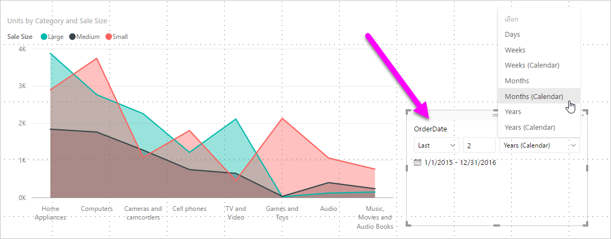
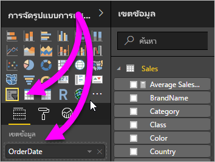
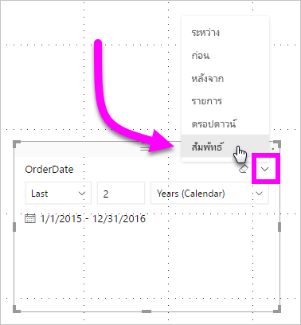
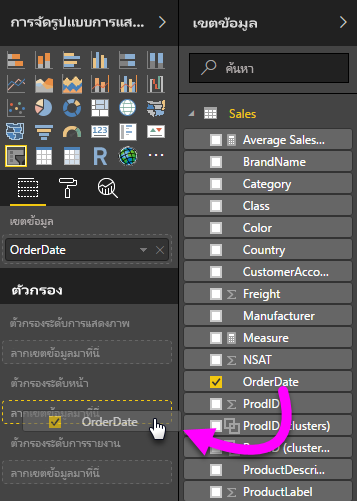
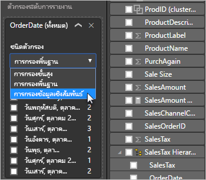
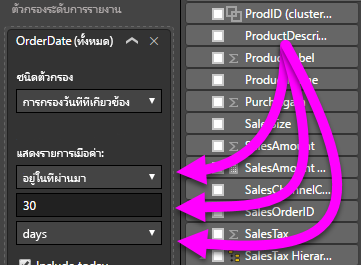

# ใช้ตัวแบ่งส่วนข้อมูลและตัวกรองวันที่แบบสัมพัทธ์ใน Power BI Desktop

ด้วย**ตัวแบ่งส่วนข้อมูลวันที่ที่สัมพันธ์**หรือ**ตัวกรองวันที่ี่ที่สัมพันธ์** คุณสามารถใช้ตัวกรองที่ยึดตามเวลากับคอลัมน์วันที่ใดก็ตามในแบบจำลองข้อมูลของคุณได้ ตัวอย่างเช่น คุณสามารถใช้**ตัวแบ่งส่วนข้อมูลวันที่ที่เกี่ยวข้อง**เพื่อแสดงข้อมูลยอดขายเฉพาะที่เกิดขึ้นภายใน 30 วันที่ผ่านมา (หรือ เดือน, เดือนตามปฏิทิน ฯลฯ) ได้ เมื่อคุณรีเฟรชข้อมูล ช่วงเวลาสัมพัทธ์จะถูกปรับให้ใช้วันที่ที่เหมาะสมโดยอัตโนมัติ

## ใช้ตัวแบ่งส่วนข้อมูลช่วงวันที่ที่สัมพันธ์

คุณสามารถใช้ตัวแบ่งส่วนข้อมูลวันที่ที่สัมพันธ์ได้เช่นเดียวกับตัวแบ่งส่วนข้อมูลอื่น ๆ สร้างวิชวล**ตัวแบ่งส่วนข้อมูล**สำหรับรายงานของคุณ จากนั้นเลือกค่าวันที่สำหรับค่า**เขตข้อมูล** ในรูปต่อไปนี้ เราได้เลือกเขตข้อมูล *OrderDate*

เลือกตัวแบ่งส่วนข้อมูลบนพื้นที่ทำงานของคุณ และกะรัตที่มุมบนด้านขวาของวิชวลตัวแบ่งส่วนข้อมูล ถ้าวิชวลนี้มีข้อมูลวัน เมนูจะแสดงตัวเลือกสำหรับ**สัมพัทธ์**

ตัวแบ่งส่วนข้อมูลวันที่ที่สัมพันธ์ เลือก*สัมพันธ์*

จากนั้นคุณสามารถเลือกการตั้งค่าดังกล่าวได้

สำหรับการตั้งค่าครั้งแรกใน*ตัวแบ่งส่วนข้อมูลวันที่ที่สัมพัทธ์* คุณมีตัวเลือกต่อไปนี้:

* สุดท้าย

* ถัดไป

* นี้

การตั้งค่าครั้งที่สอง (ตรงกลาง) ใน*ตัวแบ่งส่วนข้อมูลวันที่ที่สัมพัทธ์* ให้คุณสามารถระบุตัวเลขเพื่อกำหนดช่วงวันที่สัมพัทธ์ได้

การตั้งค่าที่สาม ให้คุณเลือกหน่วยวัดวันที่ คุณมีตัวเลือกต่อไปนี้:

* วัน

* สัปดาห์

* สัปดาห์ (ปฏิทิน)

* เดือน

* เดือน (ปฏิทิน)

* ปี

* ปี (ปฏิทิน)

ถ้าคุณเลือก**เดือน**จากรายการที่แสดง และป้อนตัวเลข *2* ในการตั้งค่าตรงกลาง นี่คือสิ่งที่จะเกิดขึ้น

* ถ้าวันนี้คือวันที่ 20 กรกฎาคม

* ข้อมูลที่รวมอยู่ในวิชวลที่จำกัดโดยตัวแบ่งส่วนข้อมูลจะแสดงข้อมูลสองเดือนก่อนหน้านี้

* เริ่มจากวันที่ 20 พฤษภาคมและไปจนถึงวันที่ 20 กรกฎาคม (วันที่ของวันนี้)

ในการเปรียบเทียบ ถ้าคุณเลือก*เดือน (ปฏิทิน)* วิชวลที่จำกัดจะแสดงข้อมูลจากวันที่ 1 พฤษภาคมถึงวันที่ 30 มิถุนายน (สองเดือนเต็มตามเดือนในปฏิทิน)

## การใช้ตัวกรองข้อมูลช่วงวันที่ที่สัมพันธ์

คุณยังสามารถสร้างตัวกรองช่วงวันที่สัมพัทธ์สำหรับหน้ารายงานของคุณ หรือทั้งรายงานของคุณได้ ในการทำเช่นนั้น ให้่ลากเขตข้อมูลวันที่ไปยังแหล่งข้อมูล **ตัวกรองระดับหน้า**หรือแหล่งข้อมูล **ตัวกรองระดับรายงาน**ในบานหน้าต่าง**เขตข้อมูล**:

เมื่อมี คุณสามารถเปลี่ยนช่วงวันที่ที่สัมพัทธ์ ซึ่งคล้ายกับวิธีการที่คุณสามารถกำหนด **ตัวแบ่งส่วนข้อมูลวันที่ที่สัมพันธ์** เอง เลือก**กรองข้อมูลวันที่ที่สัมพันธ์** จากดรอปดาวน์**ชนิดตัวกรอง**

เมื่อคุณเลือก**การกรองข้อมูลวันที่ที่สัมพัทธ์**แล้ว คุณจะเห็นสามส่วนที่จะเปลี่ยน ซึ่งรวมถึงกล่องตัวเลขตรงกลาง เช่นเดียวกับตัวแบ่งส่วนข้อมูล

## ข้อจำกัดและข้อควรพิจารณา

ในขณะนี้ ข้อจำกัดและข้อควรพิจารณาดังต่อไปนี้นำไปใช้กับ**ตัวแบ่งส่วนข้อมูลช่วงวันที่ที่สัมพันธ์**และตัวกรอง

* แบบจำลองข้อมูลใน**Power BI**จะไม่รวมข้อมูลโซนเวลา แบบจำลองสามารถจัดเก็บเวลาต่าง ๆ ได้ แต่จะไม่มีการระบุโซนเวลาที่แบบจำลองดังกล่าวอยู่

* ตัวแบ่งส่วนข้อมูลและตัวกรองจะยึดตามเวลาใน UTC ถ้าคุณตั้งค่าตัวกรองในรายงาน และส่งไปยังเพื่อนร่วมงานในโซนเวลาอื่น คุณทั้งสองคนจะเห็นข้อมูลเดียวกัน เว้นแต่ว่าคุณอยู่ในโซนเวลา UTC คุณและเพื่อนร่วมงานของคุณต้องคำนึงถึงการเผื่อเวลาที่คุณจะได้รับ

* คุณสามารถแปลงข้อมูลที่รวบรวมไว้ในโซนเวลาท้องถิ่นเป็น UTC ได้โดยใช้**ตัวแก้ไขการสอบถาม**

## ขั้นตอนถัดไป

เรียนรู้วิธีการ[ใช้การจัดกลุ่มและจัดช่องเก็บใน Power BI Desktop](../desktop-grouping-and-binning.md)
