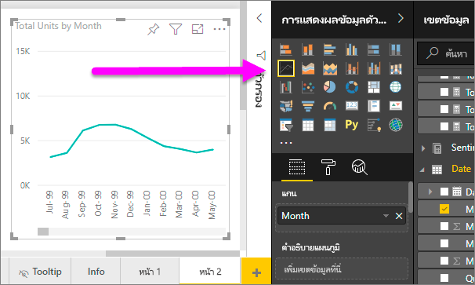

# แผนภูมิเส้นใน Power BI
แผนภูมิเส้นคือ ชุดของจุดข้อมูลที่จะแสดงด้วยจุดและเชื่อมต่อด้วยเส้นตรง แผนภูมิเส้นอาจมีเส้นเดียวหรือหลายเส้น แผนภูมิเส้นมีแกน X และแกน Y 

## สร้างแผนภูมิเส้น
คำแนะนำเหล่านี้ใช้แอปตัวอย่างการขายและการตลาดเพื่อสร้างแผนภูมิเส้นที่แสดงยอดขายของปีนี้ตามประเภท หากต้องการทำตามขั้นตอน รับแอปตัวอย่างจาก appsource.com

1. เริ่มต้นบน หน้ารายงานเปล่า หากคุณกำลังใช้บริการของ Power BI ตรวจสอบให้แน่ใจว่า คุณเปิดรายงานใน [มุมมองการแก้ไข](../service-interact-with-a-report-in-editing-view.md)

2. จากบานหน้าต่างเขตข้อมูล เลือก **ข้อเท็จจริงของยอดขาย** \> **ผลรวมหน่วย** และเลือก **วัน** > **เดือน**  Power BI สร้างแผนภูมิคอลัมน์บนพื้นที่รายงานของคุณ

    

4. แปลงเป็นแผนภูมิเส้น โดยการเลือกเทมเพลตแผนภูมิเส้นจากบานหน้าต่างการแสดงผลด้วยภาพ 

    
   

4. กรองแผนภูมิเส้นของคุณเพื่อแสดงข้อมูลสำหรับปี 2012-2014 หากบานหน้าต่างตัวกรองของคุณยุบตัวอยู่ ให้ขยายในทันที จากบานหน้าต่างเขตข้อมูล เลือก **วัน** \> **ปี** และลากไปที่บานหน้าต่างตัวกรอง วางลงที่ใต้ **ตัวกรองส่วนหัวบนภาพนี้** 
     
    

    เปลี่ยนแปลง **ตัวกรองขั้นสูง** เป็น **ตัวกรองพื้นฐาน** และเลือก **2012**, **2013** และ **2014**

    

6. อีกวิธีหนึ่ง คือ [ปรับขนาดและสีของข้อความในแผนภูมิ](power-bi-visualization-customize-title-background-and-legend.md) 

    

## เพิ่มเส้นเพิ่มเติมลงในแผนภูมิ
แผนภูมิเส้นสามารถมีเส้นหลายเส้นที่แตกต่างกัน และ ในบางกรณี ค่าในเส้นต่างๆ อาจแตกต่างกันมากจนแสดงผลร่วมกันได้ไม่ดี มาดูที่การเพิ่มแผนภูมิเส้นเพิ่มเติมไปยังแผนภูมิปัจจุบันของเรา และเรียนรู้วิธีการจัดรูปแบบแผนภูมิของเราเมื่อเมื่อค่าที่แสดงด้วยเส้นมีความแตกต่างกันมาก 

### เพิ่มเส้นเพิ่มเติม
แทนที่จะดูผลรวมหน่วยสำหรับภูมิภาคทั้งหมดเป็นเส้นเดียวบนแผนภูมิ เราจะแยกหาผลรวมหน่วยตามภูมิภาค เพิ่มเส้นเพิ่มเติมโดยการลาก **ภูมิศาสตร์** > **ภูมิภาค** ไปยังส่วนคำอธิบายแผนภูมิ

   

### ใช้แกน Y สองแกน
จะเป็นอย่างไรหากคุณต้องการดูยอดขายรวมและผลรวมหน่วยบนแผนภูมิเดียวกัน? ตัวเลขยอดขายสูงกว่าจำนวนหน่วย ทำให้แผนภูมิเส้นไม่สามารถใช้งานได้ อันที่จริงแล้ว เส้นสีแดงสำหรับผลรวมหน่วยปรากฏเป็นศูนย์

   

หากต้องการแสดงค่าที่แตกต่างกันมากบนแผนภูมิหนึ่งๆ ให้ใช้แผนภูมิผสม คุณสามารถเรียนรู้เกี่ยวกับแผนภูมิผสมทั้งหมด โดยการอ่าน [แผนภูมิผสมใน Power BI](power-bi-visualization-combo-chart.md) ในตัวอย่างของเราด้านล่าง เราสามารถแสดงยอดขายและหน่วยทั้งหมด ร่วมกันบนแผนภูมิหนึ่งๆ โดยการเพิ่มแกน Y แกนที่สอง 

   

## การทำไฮไลท์และการกรองข้าม
สำหรับข้อมูลเกี่ยวกับการใช้บานหน้าต่างตัวกรอง โปรดดู[เพิ่มตัวกรองไปยังรายงาน](../power-bi-report-add-filter.md)

การเลือกจุดข้อมูลบนแผนภูมิเส้น เป็นการไฮไลต์แบบเชื่อมโยงและกรองข้ามไปยังการแสดงภาพอื่น ๆ บนหน้ารายงาน และในทางกลับกัน การยกเลิกไฮไลต์จะเป็นการยกเลิกการกระทำดังกล่าว หากต้องการปฏิบัติตาม ให้เปิดแท็บ **ตลาด**  

บนแผนภูมิเส้น จุดข้อมูลจุดเดียวคือจุดตัดของจุดใดจุดหนึ่งบนแกน Xและแกน Y เมื่อคุณเลือกจุดข้อมูล Power BI จะเพิ่มเครื่องหมายเพื่อระบุว่าจุดใดจุดหนึ่ง (สำหรับเส้นเดียว) หรือจุดหลายจุด (ถ้ามีอย่างน้อยสองเส้น) เป็นแหล่งที่มาสำหรับการไฮไลท์ข้ามและกรองข้ามของการแสดงผลด้วยภาพฃอื่นๆ บนหน้ารายงาน หากการแสดงผลด้วยภาพของคุณแน่นหนามาก Power BI จะเลือกจุดที่ใกล้กับจุดที่คุณคลิกภาพมากที่สุด

ในตัวอย่างนี้ เราได้เลือกจุดข้อมูลที่ครอบคลุม: เดือนกรกฎาคม 2014 %ของส่วนแบ่งตลาดของหน่วย R12 เท่ากับ 33.16 และ %ของส่วนแบ่งตลาดของหน่วยเท่ากับ 34.74

โปรดสังเกตว่า แผนภูมิคอลัมน์จะมีการไฮไลต์ข้าม และเกจวัดมีการกรองแบบข้าม

เมื่อต้องการจัดการวิธีการที่แผนภูมิเน้นข้ามและกรองข้ามระหว่างกัน โปรดดู[การโต้ตอบแบบการแสดงภาพในรายงาน Power BI](../service-reports-visual-interactions.md)

## ข้อควรพิจารณาและการแก้ไขปัญหา
* แผนภูมิเส้นหนึ่งไม่สามารถมีแกน Y คู่กัน  คุณจะต้องใช้แผนภูมิผสมแทน
* ในตัวอย่างข้างต้น แผนภูมิถูกจัดรูปแบบเพื่อเพิ่มขนาดฟอนต์ เปลี่ยนสีฟอนต์ เพิ่มชื่อแกน จัดกึ่งกลางชื่อแผนภูมิและคำอธิบายแผนภูมิ เริ่มต้นทั้งสองแกนที่ศูนย์ และอื่นๆ บานหน้าต่างการจัดรูปแบบ (ไอคอนลูกกลิ้งทาสี) มีชุดตัวเลือกมากมายที่ใช้สำหรับการตกแต่งแผนภูมิของคุณให้เป็นแบบที่คุณต้องการ วิธีดีที่สุดในการเรียนรู้คือเปิดบานหน้าต่างการจัดรูปแบบและสำรวจ

## ขั้นตอนถัดไป

[ชนิดการแสดงภาพใน Power BI](power-bi-visualization-types-for-reports-and-q-and-a.md)

