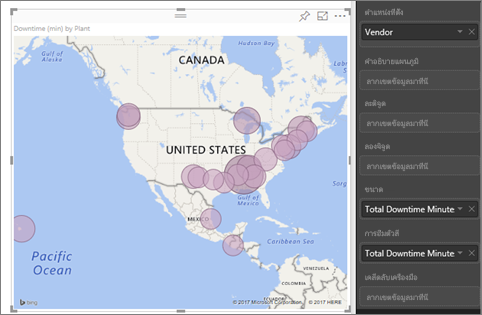
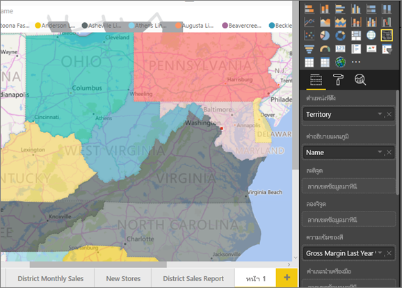
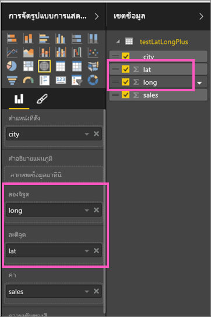
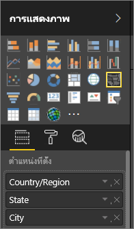

# คำแนะนำและเคล็ดลับสำหรับการแสดงภาพแผนที่ Power BI
Power BI รวมเข้ากับ Bing Maps เพื่อให้ได้ค่าเริ่มต้นพิกัดแมป (กระบวนการที่เรียกว่า การกำหนดรหัสทางภูมิศาสตร์) เพื่อให้คุณสร้างแผนที่ได้ เมื่อทำงานร่วมกัน ส่วนเหล่านี้ใช้อัลกอริทึมในการระบุตำแหน่งที่ถูกต้อง แต่บางครั้งจะเป็นค่าคาดเดาที่ดีที่สุด หาก Power BI ลองทำแล้วไม่สามารถสร้างการแสดงภาพของแผนที่ได้ด้วยตนเอง ระบบจะแสดงรายการความช่วยเหลือของ Bing Maps 

คุณหรือผู้ดูแลระบบของคุณอาจจำเป็นต้องอัปเดตไฟร์วอลล์ของคุณเพื่ออนุญาตให้เข้าถึง URL ที่ Bing ใช้สำหรับการกำหนดพิกัดทางภูมิศาสตร์  URL เหล่านั้นคือ:
* https://dev.virtualearth.net/REST/V1/Locations
* https://platform.bing.com/geo/spatial/v1/public/Geodata
* https://www.bing.com/api/maps/mapcontrol

เพื่อเพิ่มแนวโน้มการกำหนดรหัสทางภูมิศาสตร์ที่ถูกต้อง ให้ใช้เคล็ดลับต่อไปนี้ เคล็ดลับชุดแรกเพื่อให้คุณใช้หากคุณสามารถเข้าถึงชุดข้อมูลได้ ชุดที่สองของเคล็ดลับนี้คือสิ่งที่คุณสามารถทำได้ใน Power BI ถ้าคุณไม่สามารถเข้าถึงชุดข้อมูลได้ และชุดสุดท้ายคือ รายการของ URL

## สิ่งที่จะถูกส่งไปยัง Bing Maps aคืออะไร?
บริการ Power BI และ Power BI Desktop ส่งข้อมูลทางภูมิศาสตร์ไปยัง Bing เนื่องจากจำเป็นในการสร้างการแสดงภาพของแผนที่ ซึ่งอาจรวมถึงข้อมูลในบักเก็ต**ตำแหน่งที่ตั้ง** **ละติจูด**และ**ลองจิจู**และเขตข้อมูลทางภูมิศาสตร์ใด ๆ ของบักเก็ตตัวกรอง**ระดับรายงาน** **ระดับหน้า** หรือ**ระดับภาพ** แน่นอนว่าสิ่งที่ส่งไปจะส่งแตกต่างกันตามชนิดของแผนที่ เมื่อต้องการเรียนรู้เพิ่มเติม ดู[ความเป็นส่วนตัว Bing Maps](https://go.microsoft.com/fwlink/?LinkID=248686)

* สำหรับแผนที่ (แผนที่แบบฟอง) ถ้ามีละติจูดและลองจิจูดให้ จะไม่มีการส่งข้อมูลไปยัง Bing ในทางกลับกัน **ข้อมูล**ใดๆในที่ฝากข้อมูลตำแหน่งที่ตั้ง(และตัวกรอง) จะถูกส่งไปยัง Bing     
* แผนที่แถบสีจำเป็นต้องมีเขตข้อมูลใน **ท**ี ่ฝากข้อมูลตำแหน่งที่ตั้ง: แม้ว่ามีละติจูดและลองจิจูดให้ ข้อมูลใดก็ตามที่อยู่ในที่ฝากข้อมูล **ตำแหน่งที่ตั้ง** **ละจิจูด₹** หรือ **ลองจิจูด** จะถูกส่งไปยัง Bing
  
    ในตัวอย่างด้านล่าง เขตข้อมูล**ผู้จัดจำหน่าย**กำลังถูกใช้สำหรับการกำหนดรหัสทางภูมิศาสตร์ ดังนั้น ข้อมูลทั้งหมดของผู้จัดจำหน่ายจะถูกส่งไปยัง Bing ข้อมูลจากบักเก็ต**ขนาด**และ**ความเข้มสี**จะถูกส่งไปยัง Bing
  
    
  
    ในตัวอย่างที่สองที่สองด้านล่างนี้ เขตข้อมูล**ดินแดน**กำลังถูกใช้สำหรับการกำหนดรหัสทางภูมิศาสตร์ ดังนั้น เขตข้อมูลทั้งหมดของดินแดนจะถูกส่งไปยัง Bing ข้อมูลจากบักเก็ต**คำอธิบายแผนภูมิ**และ**ความเข้มสี**จะถูกส่งไปยัง Bing
  
    

## ในชุดข้อมูล: เคล็ดลับในการปรับปรุงในชุดข้อมูลเบื้องต้น
ถ้าคุณสามารถเข้าถึงชุดข้อมูลที่กำลังถูกใช้เพื่อสร้างการแสดงภาพของแผนที่ได้ มีบางสิ่งที่คุณสามารถทำได้เพื่อเพิ่มแนวโน้มความถูกต้องในการกำหนดรหัสทางภูมิศาสตร์

**1. จัดประเภทเขตข้อมูลทางภูมิศาสตร์ใน Power BI Desktop**

ใน Power BI Desktop คุณสามารถตรวจให้แน่ใจได้ว่าเขตข้อมูลมีการเขียนรหัสทางภูมิศาสตร์อย่างถูกต้องหรือไม่โดยการตั้งค่า*ประเภทข้อมูล*บนเขตข้อมูลได้ เลือกตารางที่คุณต้องการ ไปที่ Ribbon**ขั้นสูง** จากนั้นตั้งค่าการ**ประเภทข้อมูล**เป็น**ที่อยู่** **เมือง**  **ทวีป** **ประเทศ/ภูมิภาค** **เขต** **รหัสไปรษณีย์** **รัฐ**หรือ **จังหวัด** ประเภทข้อมูลเหล่านี้ช่วย Bing ให้เข้ารหัสวันที่อย่างถูกต้อง เมื่อต้องการเรียนรู้เพิ่มเติม ดู[จัดประเภทข้อมูลใน Power BI Desktop](../desktop-data-categorization.md) ถ้าคุณกำลังเชื่อมต่อกับ SQL Server Analysis Services สด คุณจะต้องตั้งค่าการจัดประเภทข้อมูลภายนอก Power BI โดยใช้ [SQL Server Data Tools (SSDT)](https://docs.microsoft.com/sql/ssdt/download-sql-server-data-tools-ssdt)

**2. ใช้มากกว่าหนึ่งคอลัมน์ตำแหน่งที่ตั้ง**    
 บางครั้ง การตั้งค่าประเภทข้อมูลสำหรับการทำแผนที่ไม่เพียงพอสำหรับ Bing ในการคาดเดาจุดประสงค์ของคุณอย่างถูกต้อง บางการตั้งชื่อไม่ชัดเจนเนื่องจากตำแหน่งที่ตั้งมีอยู่ในหลายประเทศหรือภูมิภาค ตัวอย่างเช่น มี***เซาท์แทมตัน***ในอังกฤษ รัฐเพนวิลเวเนีย และรัฐนิวยอร์ก

Power BI ใช้[บริการเทมเพลต URL ไม่มีโครงสร้าง](https://msdn.microsoft.com/library/ff701714.aspx)ของ Bing ในการรับพิกัดละติจูดและลองจิจูดโดยยึดตามชุดของค่าที่อยู่สำหรับประเทศใด ๆ ถ้าข้อมูลของคุณมีข้อมูลตำแหน่งที่ตั้งไม่เพียงพอ ให้เพิ่มคอลัมน์เหล่านั้น และจัดประเภทอย่างเหมาะสม

 ตัวอย่างเช่น ถ้าคุณมีคอลัมน์ City, Bing อาจสามารถกำหนดรหัสทางภูมิศาสตร์ได้ยาก เพิ่มคอลัมน์สำหรับภูมิศาสตร์เพื่อทำให้ตำแหน่งที่ตั้งที่ชัดเจนขึ้น  ในบางครั้ง สิ่งที่เราต้องทำคือเพียงแค่หนึ่งเพิ่มคอลัมน์ตำแหน่งที่ตั้งไปยังชุดข้อมูล ซึ่งในกรณีนี้เป็นรัฐ/จังหวัด และอย่าลืมจัดประเภทอย่างเหมาะสม ดู #1 ด้านบน

ตรวจสอบให้แน่ใจว่าแต่ละเขตข้อมูลมีข้อมูลเฉพาะเท่านั้นที่เชื่อมโยงกับการจัดประเภท  ตัวอย่างเช่น เขตข้อมูลตำแหน่งที่ตั้งเมืองของคุณควรเป็น**เซาท์แทมตัน**ไม่ใช่**เซาท์แทมตัน รัฐนิวยอร์ก**  และเขตข้อมูลที่อยู่ตำแหน่งที่ตั้งควรเป็น**1 Microsoft Way**และไม่ใช่**1 Microsoft Way Redmond, WA**

**3. ใช้ละติจูดและลองจิจูดที่เฉพาะเจาะจง**

เพิ่มค่าละติจูดและลองจิจูดลงในชุดข้อมูลของคุณ ขั้นตอนนี้ลบและส่งกลับผลลัพธ์ใด ๆ ที่กำกวมได้รวดเร็วขึ้น เขตข้อมูลละติจูดและลองจิจูดต้องอยู่ในรูปแบบ*เลขทศนิยม* ซึ่งคุณสามารถตั้งค่าได้ในตัวแบบข้อมูล

<iframe width="560" height="315" src="https://www.youtube.com/embed/ajTPGNpthcg" frameborder="0" allowfullscreen></iframe>

**4. ใช้ประเภท สถานที่ สำหรับคอลัมน์ที่มีข้อมูลตำแหน่งที่ตั้งเต็ม**

ขณะที่เราแนะนำให้คุณใช้ลำดับชั้นทางภูมิศาสตร์ในแผนที่ของคุณ ถ้าคุณต้องใช้คอลัมน์ตำแหน่งที่ตั้งเดียวกับข้อมูลทางภูมิศาสตร์แบบเต็มรูปแบบ คุณสามารถตั้งค่าการจัดประเภทข้อมูลเป็น**สถานที่**ได้ ตัวอย่างเช่น ถ้าข้อมูลในคอลัมน์ของคุณเป็นที่อยู่เต็ม เช่น 1 Microsoft Way, Redmond Washington 98052 ประเภทข้อมูลแบบทั่วไปนี้จะทำงานได้ที่ดีที่สุดกับ Bing 

## ใน Power BI: เคล็ดลับเพื่อให้ได้ผลลัพธ์ที่ดียิ่งขึ้นเมื่อใช้การแสดงภาพแผนที่
**1. ใช้เขตข้อมูลละติจูดและลองจิจูด (ถ้ามี)**

ใน Power BI ถ้าคุณชุดข้อมูลที่คุณกำลังใช้อยู่มีเขตข้อมูลสำหรับลองจิจูดและละติจูด ให้ใช้ข้อมูลำหรับลองจิจูดและละติจูดนี้!  Power BI มีบักเก็ตพิเศษเพื่อช่วยทำให้ข้อมูลแผนที่ชัดเจนยิ่งขึ้น เพียงแค่ลากเขตข้อมูลที่ประกอบด้วยข้อมูลละติจูดของคุณลงในพื้นที่**การแสดงภาพ > ละติจูด**  และทำเช่นเดียวกันสำหรับข้อมูลลองจิจูดของคุณ เมื่อคุณทำขั้นตอนนี้ คุณยังจำเป็นต้องเติมเขตข้อมูล*ตำแหน่งที่ตั้ง*เมื่อสร้างการแสดงภาพของคุณ มิฉะนั้น ข้อมูลจะถูกรวมตามค่าเริ่มต้น ตัวอย่างเช่น ละติจูดและลองจิจูดควรจะจับคู่ที่ระดับรัฐ ไม่ใช่ระดับเมือง

 

## ใช้ลำดับชั้นทางภูมิศาสตร์เพื่อให้คุณสามารถเข้าถึงรายละเอียด "ระดับต่าง ๆ" ของตำแหน่งที่ตั้งได้
เมื่อชุดข้อมูลของคุณมีระดับต่าง ๆ ของข้อมูลตำแหน่งที่ตั้งอยู่แล้ว คุณและเพื่อนร่วมงานของคุณสามารถใช้ Power BI เพื่อสร้าง*ลำดับชั้นทางภูมิศาสตร์*ได้ เมื่อต้องการทำเช่นนั้น ลากเขตข้อมูลมากกว่าหนึ่งรายการไปยังบักเก็ต**ตำแหน่งที่ตั้ง** โดยใช้ร่วมกันด้วยวิธีนี้ จะทำให้เขตข้อมูลต่าง ๆ กลายเป็นลำดับชั้นทางภูมิศาสตร์ ในตัวอย่างด้านล่างนี้ เราได้เพิ่มเขตข้อมูลทางภูมิศาสตร์สำหรับ: ประเทศ/ภูมิภาค รัฐ และเมือง ใน Power BI คุณและเพื่อนร่วมงานของคุณสามารถเจาะขึ้นและลงได้โดยใช้ลำดับชั้นทางภูมิศาสตร์นี้

  

   

เมื่อเข้าถึงรายละเอียดด้วยลำดับชั้นทางภูมิศาสตร์ สิ่งสำคัญคือต้องทราบวิธีการทำงานของแต่ละปุ่มเจาะลึกรายละเอียดและสิ่งส่งไปยัง Bing Maps 

* ปุ่มเจาะรายละเอียดทางด้านขวาสุดเรียกว่าโหมดเจาะลึก (Drill Mode) ซึ่งช่วยให้คุณสามารถแมปตำแหน่งที่ตั้ง และเจาะลึกลงในตำแหน่งที่ตั้งดังกล่าวนั้นหนึ่งระดับในแต่ละครั้ง ตัวอย่างเช่น ถ้าคุณเปิดใช้งานการดูรายละเอียดแนวลึก และคลิกอเมริกาเหนือ คุณเลื่อนลงในลำดับชั้นไปยังระดับถัดไป - รัฐในอเมริกาเหนือ สำหรับการกำหนดรหัสทางภูมิศาสตร์ Power BI ส่งข้อมูลประเทศและรัฐสำหรับอเมริกาเหนือไปยัง Bing Maps  
* ทางด้านซ้ายมีตัวเลือกการดูรายละเอียดในแนวลึกอื่น ๆ 2 ตัวเลือก ตัวเลือกแรก ดูรายละเอียดระดับถัดไปของลำดับชั้นสำหรับทุกตำแหน่งที่ตั้งในครั้งเดียว ตัวอย่างเช่น ถ้าคุณกำลังดูที่ระดับประเทศ จากนั้นให้ใช้ตัวเลือกนี้ย้ายไปยังระดับถัดไปนั่นคือ รัฐ Power BI จะแสดงข้อมูลสถานะสำหรับทุกประเทศ สำหรับการกำหนดรหัสทางภูมิศาสตร์ Power BI ส่งข้อมูลรัฐ (ไม่ใช่ข้อมูลประเทศ) ไปยัง Bing Maps สำหรับตำแหน่งที่ตั้งทั้งหมด ตัวเลือกนี้จะเป็นประโยชน์ถ้าแต่ละระดับของลำดับชั้นของคุณไม่เกี่ยวข้องกับระดับที่สูงกว่า 
* ตัวเลือกที่สอง  จะคล้ายกับการดูรายละเอียดแนวลึก เว้นแต่ว่าคุณไม่จำเป็นต้องคลิกบนแผนที่  ระบบจะขยายลงไปที่ระดับถัดไปของลำดับชั้นโดยจดจำบริบทของระดับปัจจุบัน ตัวอย่างเช่น ถ้าคุณกำลังอยู่ในระดับประเทศและเลือกไอคอนนี้ คุณเลื่อนลงในลำดับชั้นไปยังระดับถัดไป - รัฐ สำหรับการกำหนดรหัสทางภูมิศาสตร์ Power BI ส่งข้อมูลสำหรับแต่ละรัฐและประเทศที่สอดคล้อง เพื่อช่วยให้การกำหนดรหัสทางภูมิศาสตร์ของ Bing Maps ทำได้แม่นยำมากขึ้น ในแผนที่ส่วนใหญ่ คุณจะใช้ตัวเลือกนี้หรือตัวเลือกการดูรายละเอียดแนวลึกที่ด้านขวาสุด เพื่อให้คุณสามารถส่งข้อมูลไปยัง Bing ได้มากที่สุดเท่าที่เป็นไปได้เพื่อให้ได้ข้อมูลตำแหน่งที่ตั้งที่ถูกต้อง 

## ขั้นตอนถัดไป
[ดูรายละเอียดแนวลึกในการแสดงภาพใน Power BI](../consumer/end-user-drill.md)

[การแสดงภาพใน Power BI](power-bi-report-visualizations.md)

มีคำถามเพิ่มเติมหรือไม่? [ลองไปที่ชุมชน Power BI](http://community.powerbi.com/)

