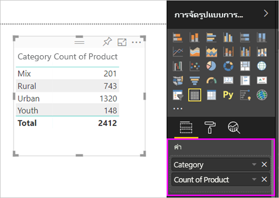
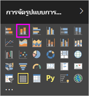
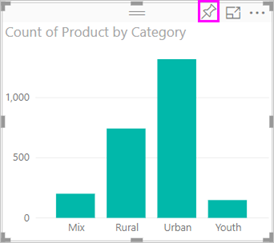

# ส่วนที่ 1 เพิ่มการแสดงภาพไปยังรายงาน Power BI
บทความนี้ให้คำแนะนำสั้น ๆ สำหรับการสร้างการแสดงภาพในรายงาน โดยใช้บริการของ Power BI หรือ Power BI Desktop  สำหรับเนื้อหาขั้นสูงขึ้น กรุณา[ดูส่วนที่ II](power-bi-report-add-visualizations-ii.md) ดู Amanda สาธิตสักสองสามวิธีสำหรับ สร้าง แก้ไข และจัดรูปแบบวิชวลบนพื้นที่รายงาน แล้วทดลองด้วยตัวเองโดยใช้[ตัวอย่างการขายและการตลาด](../sample-datasets.md)เพื่อสร้างรายงานของคุณเอง

<iframe width="560" height="315" src="https://www.youtube.com/embed/IkJda4O7oGs" frameborder="0" allowfullscreen></iframe>

## เปิดรายงาน และเพิ่มหน้าใหม่
1. เปิด[รายงานในมุมมองการแก้ไข](../service-reading-view-and-editing-view.md) บทช่วยสอนนี้ใช้[ตัวอย่างการขายและการตลาด](../sample-datasets.md)
2. ถ้าคุณมองไม่เห็นบานหน้าต่างเขตข้อมูล เลือกไอคอนลูกศรเพื่อเปิด 
   
   
3. [เพิ่มหน้าเปล่าลงในรายงาน](../power-bi-report-add-page.md)

## เพิ่มการแสดงภาพลงในรายงาน
1. สร้างการแสดงภาพ โดยการเลือกเขตข้อมูลจากบานหน้าต่าง**เขตข้อมูล**บานหน้าต่าง  
   
   **เริ่มต้นด้วยเขตข้อมูลตัวเลข**เช่น SalesFact > ยอดขาย $ Power BI จะสร้างแผนภูมิคอลัมน์ที่มีคอลัมน์เดียว
   
   
   
   **หรือเริ่มต้น ด้วยเขตข้อมูลประเภท** เช่นชื่อหรือผลิตภัณฑ์ Power BI จะสร้างตาราง และเพิ่มเขตข้อมูลนั้นไปยัง**ค่า**ด้วย
   
   
   
   **หรือเริ่มต้น ด้วยเขตข้อมูลภูมิศาสตร์**เช่น ภูมิศาสตร์ > เมือง Power BI และ Bing Maps จะสร้างการแสดงภาพแผนที่ให้
   
   
2. สร้างการแสดงภาพ แล้วเปลี่ยนชนิดของการแสดงภาพนั้น เลือก**ผลิตภัณฑ์ > ประเภท** จากนั้น **ผลิตภัณฑ์ > จำนวนผลิตภัณฑ์** เพื่อเพิ่มไปยัง**ค่า**
   
   
3. เปลี่ยนการแสดงภาพเป็นในแผนภูมิคอลัมน์ โดยการเลือกไอคอนแผนภูมิคอลัมน์
   
   
4. เมื่อคุณสร้างการแสดงภาพในรายงานของคุณ คุณสามารถ[ปักหมุดภาพเหล่านั้นไปยังแดชบอร์ด](../service-dashboard-pin-tile-from-report.md)ได้ เมื่อต้องการปักหมุดการแสดงภาพ เลือกไอคอนรูปเข็มหมด 
   
   
  

## ขั้นตอนถัดไป
 ไปต่อยัง[ส่วนที่ 2: เพิ่มการแสดงภาพไปยังรายงาน Power BI](power-bi-report-add-visualizations-ii.md)
   
   [โต้ตอบกับการแสดงภาพ](../service-reading-view-and-editing-view.md)ในรายงาน
   
   [ทำอีกหลายอย่างกับการแสดงภาพ](power-bi-report-visualizations.md)
   
   [บันทึกรายงานของคุณ](../service-report-save.md)
