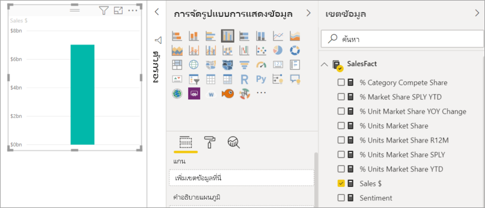
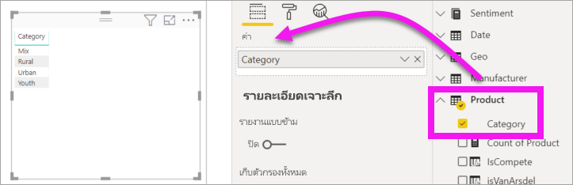
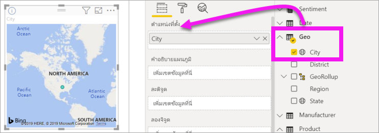
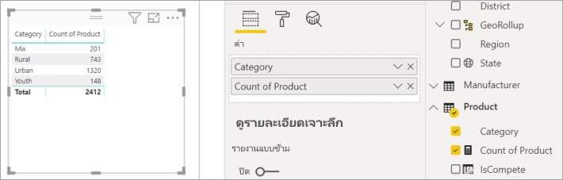
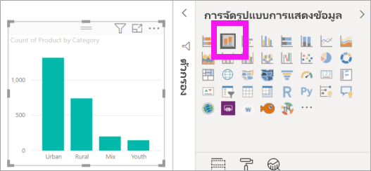
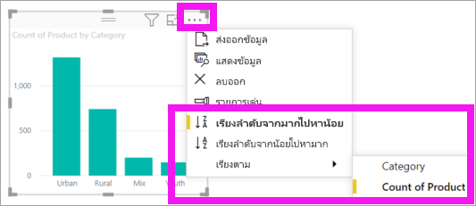

# เพิ่มวิชวลไปยังรายงาน Power BI (ตอนที่ 1)

[!INCLUDE [power-bi-visuals-desktop-banner](../includes/power-bi-visuals-desktop-banner.md)]

บทความนี้ให้คำแนะนำสั้น ๆ สำหรับการสร้างวิชวลในรายงาน รายงานสามารถใช้ได้ทั้งบริการของ Power BI และ Power BI Desktop สำหรับเนื้อหาขั้นสูง ให้ดูที่ [ส่วนที่ 2](power-bi-report-add-visualizations-ii.md)ของชุดข้อมูลนี้ ดู Amanda สาธิตสักสองสามวิธีสำหรับ สร้าง แก้ไข และจัดรูปแบบวิชวลบนพื้นที่รายงาน แล้วทดลองด้วยตัวเองโดยใช้[ตัวอย่างการขายและการตลาด](../sample-datasets.md)เพื่อสร้างรายงานของคุณเอง

<iframe width="560" height="315" src="https://www.youtube.com/embed/IkJda4O7oGs" frameborder="0" allowfullscreen></iframe>

## ข้อกำหนดเบื้องต้น

บทช่วยสอนนี้ใช้ [ไฟล์ PBIX ตัวอย่างการขายและการตลาด](https://download.microsoft.com/download/9/7/6/9767913A-29DB-40CF-8944-9AC2BC940C53/Sales%20and%20Marketing%20Sample%20PBIX.pbix)

1. จากด้านบนซ้ายของแถบเมนู Power BI Desktop เลือก **ไฟล์** > **เปิด**
   
2. ค้นหาสำเนาของ **ไฟล์ PBIX ตัวอย่างการขายและการตลาด** ของคุณ

1. เปิด **ไฟล์ PBIX ตัวอย่างการขายและการตลาด** ในมุมมองรายงาน 

1. เลือก  หากต้องการเพิ่มหน้าใหม่

## เพิ่มการแสดงภาพลงในรายงาน

1. สร้างการแสดงภาพ โดยการเลือกเขตข้อมูลจากบานหน้าต่าง**เขตข้อมูล**บานหน้าต่าง

    เริ่มต้นด้วยเขตข้อมูลตัวเลข เช่น **Sales** > **TotalSales** Power BI จะสร้างแผนภูมิคอลัมน์ที่มีคอลัมน์เดียว

    

    หรือ เริ่มต้น ด้วยประเภทของเขตข้อมูลเช่น**ชื่อ**หรือ**ผลิตภัณฑ์** Power BI สร้างตารางและเพิ่มเขตข้อมูลนั้นไปยังส่วนที่เป็น**ค่าตัวเลข**ด้วยเช่นกัน

    

    หรือเริ่มต้น ด้วยเขตข้อมูลภูมิศาสตร์เช่น **ภูมิศาสตร์** > **เมือง** Power BI และ Bing Maps จะสร้างการแสดงภาพแผนที่ให้

    

## เปลี่ยนชนิดของการแสดงผลข้อมูลด้วยภาพ

 สร้างการแสดงภาพ แล้วเปลี่ยนชนิดของการแสดงภาพนั้น 
 
 1. เลือก**ผลิตภัณฑ์** > **ประเภท** จากนั้น **ผลิตภัณฑ์**  >  **จำนวนผลิตภัณฑ์**เพื่อเพิ่มไปยัง**ค่า**

    

1. เปลี่ยนการแสดงภาพเป็นในแผนภูมิคอลัมน์ โดยการเลือกไอคอน**แผนภูมิคอลัมน์แบบเรียงซ้อน**

   

1. เมื่อต้องการเปลี่ยนวิธีการเรียงลำดับวิชวล ให้เลือก **การดำเนินการเพิ่มเติม** (...)  ใช้ตัวเลือกการเรียงลำดับเพื่อเปลี่ยนทิศทางของการเรียงลำดับ (จากน้อยไปหามากหรือมากไปหาน้อย) และเปลี่ยนคอลัมน์ที่ใช้ในการเรียงลำดับ (**เรียงลำดับตาม**)

   
  
## ขั้นตอนถัดไป

 ไปต่อยัง:

* [ส่วนที่ 2: เพิ่มภาพไปยังรายงาน Power BI](power-bi-report-add-visualizations-ii.md)

* [โต้ตอบกับการแสดงภาพ](../consumer/end-user-reading-view.md)ในรายงาน

