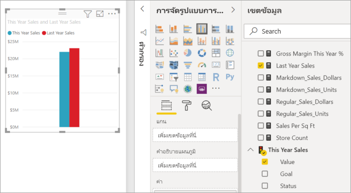
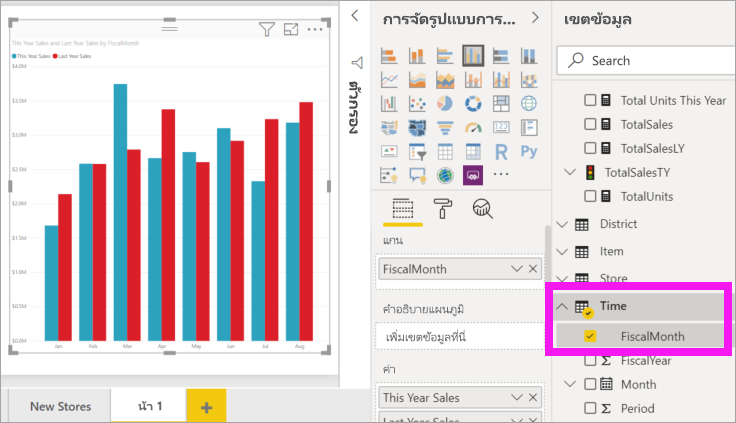
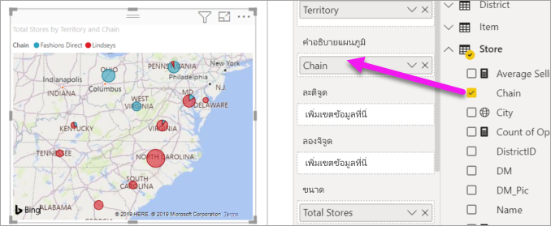

# เพิ่มวิชวลไปยังรายงาน Power BI (ตอนที่ 2)

[!INCLUDE[consumer-appliesto-nyyn](../includes/consumer-appliesto-nyyn.md)]    

[!INCLUDE [power-bi-visuals-desktop-banner](../includes/power-bi-visuals-desktop-banner.md)]

ใน[ส่วนที่ 1](power-bi-report-add-visualizations-i.md) คุณได้สร้างภาพพื้นฐานแล้วโดยการเลือกกล่องข้อความถัดจากชื่อเขตข้อมูล  ในส่วนที่ 2 คุณจะได้เรียนรู้วิธีใช้การลากและวาง และใช้บานหน้าต่าง **เขตข้อมูล** และ**การแสดงผลข้อมูลด้วยภาพ** เต็มรูปแบบเพื่อสร้างและปรับเปลี่ยนการแสดงผลข้อมูลด้วยภาพ

## สร้างการแสดงภาพใหม่
ในบทช่วยสอนนี้ เราจะเจาะลึกลงในชุดข้อมูลการวิเคราะห์ร้านค้าปลีก และสร้างการแสดงผลข้อมูลด้วยภาพที่สำคัญสองถึงสามวิชวล

## ข้อกำหนดเบื้องต้น

บทช่วยสอนนี้ใช้ [ไฟล์ PBIX ตัวอย่างการวิเคราะห์การค้าปลีก](https://download.microsoft.com/download/9/6/D/96DDC2FF-2568-491D-AAFA-AFDD6F763AE3/Retail%20Analysis%20Sample%20PBIX.pbix)

1. จากด้านบนซ้ายของแถบเมนู Power BI Desktop เลือก **ไฟล์** > **เปิด**
   
2. ค้นหาสำเนา**ไฟล์ PBIX ตัวอย่างการวิเคราะห์การค้าปลีก**

1. เปิด**ไฟล์ PBIX ตัวอย่างการวิเคราะห์การค้าปลีก**ในมุมมองรายงาน 

1. เลือก  หากต้องการเพิ่มหน้าใหม่

## เพิ่มการแสดงภาพลงในรายงาน

สร้างการแสดงภาพ โดยการเลือกเขตข้อมูลจากบานหน้าต่าง**เขตข้อมูล**บานหน้าต่าง ชนิดของการแสดงผลข้อมูลด้วยภาพที่สร้างขึ้นจะขึ้นอยู่กับชนิดของเขตข้อมูลที่เลือก Power BI ใช้ชนิดข้อมูลเพื่อระบุว่าการแสดงผลข้อมูลด้วยภาพแบบใดที่จะใช้ในการแสดงผลลัพธ์ คุณสามารถเปลี่ยนการแสดงผลข้อมูลด้วยภาพที่ใช้ได้โดยการเลือกไอคอนที่แตกต่างจากบานหน้าต่างการแสดงผลข้อมูลด้วยภาพ โปรดทราบว่าไม่ใช่การแสดงผลข้อมูลด้วยภาพทุกชนิดที่สามารถแสดงข้อมูลของคุณได้ ตัวอย่างเช่น ข้อมูลทางภูมิศาสตร์จะไม่สามารถแสดงผลได้อย่างเหมาะสมหากคุณใช้แผนภูมิกรวยหรือแผนภูมิเส้น 

### เพิ่มแผนภูมิพื้นที่ที่ดูยอดขายของปีนี้เทียบกับปีที่แล้ว

1. จากตาราง**ยอดขาย** เลือก**ค่ายอดขายของ** > **ปีนี้**และ**ยอดขายของปีที่แล้ว** Power BI สร้างแผนภูมิคอลัมน์  แผนภูมินี้น่าสนใจ และคุณต้องการเจาะลึกมากขึ้น การขายจะมีลักษณะเป็นอย่างไรเมื่อแยกดูเป็นรายเดือน?  
   
   

2. จากตารางเวลา ลาก**เดือนตามรอบบัญชี**ลงในพื้นที่**แกน**  
   

3. [เปลี่ยนการแสดงผลข้อมูลด้วยภาพ](power-bi-report-change-visualization-type.md)ไปเป็นแผนภูมิพื้นที่  มีการแสดงผลข้อมูลด้วยภาพมากมายหลายชนิดให้คุณเลือก โปรดดู [คำอธิบายของการแสดงผลข้อมูลด้วยภาพแต่ละรายการ คำแนะนำสำหรับแนวทางปฏิบัติที่ดีที่สุด และบทช่วยสอน](power-bi-visualization-types-for-reports-and-q-and-a.md) เพื่อช่วยในการตัดสินใจว่าคุณควรใช้การแสดงผลข้อมูลด้วยภาพชนิดใด จากบานหน้าต่างการแสดงผลข้อมูลด้วยภาพ ให้เลือกไอคอนแผนภูมิพื้นที่ 

4. เรียงลำดับการแสดงผลข้อมูลด้วยภาพโดยการเลือก**ตัวเลือกเพิ่มเติม** (...) แล้วเลือก**เรียงลำดับตาม** >  **FiscalMonth**

5. [ปรับขนาดการแสดงภาพ](power-bi-visualization-move-and-resize.md)โดยเลือกการแสดงภาพ จับที่เค้าร่างวงกลมหนึ่งวงและลาก ทำให้กว้างพอที่จะกำจัดแถบเลื่อน และเล็กพอที่จะมีพื้นที่ให้เราเพิ่มการแสดงภาพแบบอื่นได้
   
   
6. [บันทึกรายงาน](../create-reports/service-report-save.md)

### เพิ่มการแสดงภาพของแผนที่ท่ี่ดูยอดขายตามตำแหน่งที่ตั้ง

1. จากตาราง**ร้านค้า** เลือก**ดินแดน** ลาก**ร้านค้ารวม**ลงในพื้นที่ขนาด Power BI จดจำว่าดินแดน (Territory) เป็นตำแหน่งที่ตั้งหนึ่ง และสร้างการแสดงภาพของแผนที่หนึ่ง  
   

2. เพิ่มคำอธิบายแผนภูมิ  เมื่อต้องการดูข้อมูลตามชื่อร้านค้า ให้ลาก **Store** > **Chain** ไปยังพื้นที่คำอธิบายแผนภูมิ  
   

> [!NOTE]
> การแชร์รายงานของคุณกับผู้ร่วมงาน Power BI กำหนดให้คุณต้องมีสิทธิ์การใช้งาน Power BI Pro แต่ละรายการ หรือรายงานจะถูกบันทึกในความจุแบบพรีเมียม ดู [การแชร์รายงาน](../collaborate-share/service-share-reports.md)

## ขั้นตอนถัดไป
* อ่านเพิ่มเติมเกี่ยวกับ[การแสดงภาพในรายงาน Power BI](power-bi-report-visualizations.md)  
* มีคำถามเพิ่มเติมหรือไม่ [ลองไปที่ชุมชน Power BI](https://community.powerbi.com/)

