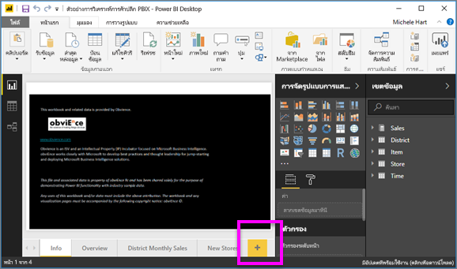
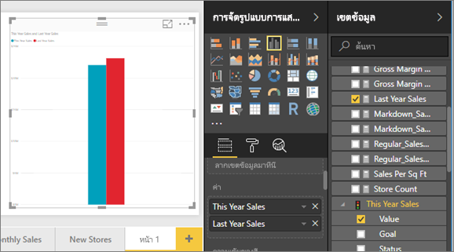
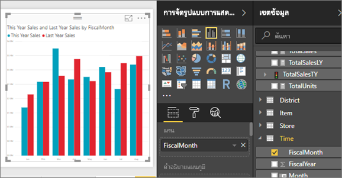
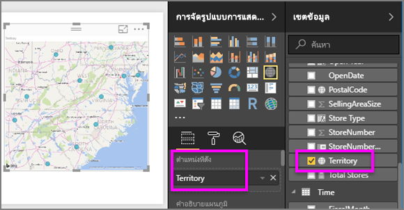
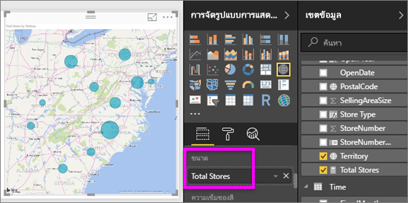
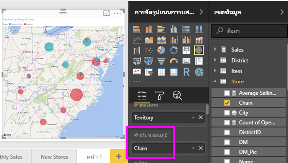

# ส่วนที่ 2 เพิ่มการแสดงภาพไปยังรายงาน Power BI
ใน[ส่วนที่ 1](power-bi-report-add-visualizations-ii.md) คุณได้สร้างภาพพื้นฐานแล้วโดยการเลือกกล่องข้อความถัดจากชื่อเขตข้อมูล  ในส่วนที่ 2 คุณจะได้เรียนรู้วิธีใช้การลากและวาง และใช้**เขตข้อมูล**และพื้นที่**การแสดงภาพ**เต็มรูปแบบเพื่อสร้างและปรับเปลี่ยนการแสดงภาพ

### ข้อกำหนดเบื้องต้น
- [ส่วนที่ 1](power-bi-report-add-visualizations-ii.md)
- Power BI Desktop - เราสามารถเพิ่มการแสดงภาพลงในรายงานได้โดยใช้บริการ Power BI หรือ Power BI Desktop บทช่วยสอนนี้ใช้ Power BI Desktop 
- [ตัวอย่างการวิเคราะห์การค้าปลีก](http://download.microsoft.com/download/9/6/D/96DDC2FF-2568-491D-AAFA-AFDD6F763AE3/Retail%20Analysis%20Sample%20PBIX.pbix)

## สร้างการแสดงภาพใหม่
ในบทช่วยสอนนี้ เราจะเจาะลึกลงในชุดข้อมูลการวิเคราะห์ร้านค้าปลีก และสร้างการแสดงภาพที่สำคัญบางภาพ

### เปิดรายงานและเพิ่มหน้าเปล่าใหม่
1. เปิดไฟล์ .pbix ตัวอย่างการวิเคราะห์ด้านการขายปลีกใน Power BI Desktop 
      

2. เพิ่มหน้าใหม่โดยการเลือกไอคอนเครื่องหมายถูกสีเหลืองที่ด้านล่างของพื้นที่รายงาน

### เพิ่มการแสดงภาพที่ดูการขายของปีนี้เทียบกับปีที่แล้ว
1. จากตาราง**ยอดขาย** เลือก**ค่ายอดขายของ** > **ปีนี้**และ**ยอดขายของปีที่แล้ว** Power BI สร้างแผนภูมิคอลัมน์  ซึ่งส่วนนี้น่าสนใจพอสมควรและคุณจะอยากเจาะลึกลงไปอีก การขายจะมีลักษณะเป็นอย่างไรเมื่อแยกดูเป็นรายเดือน?  
   
   
2. จากตารางเวลา ลาก**เดือนตามรอบบัญชี**ลงในพื้นที่**แกน**  
   
3. [เปลี่ยนการแสดงภาพ](power-bi-report-change-visualization-type.md)ในแผนภูมิพื้นที่  มีการแสดงภาพมากมายหลายชนิดให้คุณเลือก ดู[คำอธิบายของแต่ละการแสดงภาพ คำแนะนำสำหรับแนวทางปฏิบัติที่ดีที่สุด และบทช่วยสอน](power-bi-visualization-types-for-reports-and-q-and-a.md)สำหรับความช่วยเหลือในการตัดสินใจว่าควรใช้ชนิดใด จากพื้นที่การแสดงภาพ เลือกไอคอนแผนภูมิพื้นที่
4. เรียงลำดับการแสดงภาพโดยการเลือกจุดไข่ปลา แล้วเลือก**เรียงลำดับตามเดือนตามรอบบัญชี**
5. [ปรับขนาดการแสดงภาพ](power-bi-visualization-move-and-resize.md)โดยเลือกการแสดงภาพ จับที่เค้าร่างวงกลมหนึ่งวงและลาก ทำให้กว้างพอที่จะกำจัดแถบเลื่อน และเล็กพอที่จะมีพื้นที่ให้เราเพิ่มการแสดงภาพแบบอื่นได้
   
   
6. [บันทึกรายงาน](../service-report-save.md)

### เพิ่มการแสดงภาพของแผนที่ท่ี่ดูยอดขายตามตำแหน่งที่ตั้ง
1. จากตาราง**ร้านค้า** เลือก**ดินแดน** Power BI จดจำว่าดินแดน (Territory) เป็นตำแหน่งที่ตั้งหนึ่ง และสร้างการแสดงภาพของแผนที่หนึ่ง  
   
2. ลาก**ร้านค้ารวม**ลงในพื้นที่ขนาด  
   
3. เพิ่มคำอธิบายแผนภูมิ  เมื่อต้องการดูข้อมูลตามชื่อร้านค้า ให้ลาก**ห่วงโซ่**ลงในพื้นที่คำอธิบายแผนภูมิ  
   

## ขั้นตอนถัดไป
* อ่านเพิ่มเติมเกี่ยวกับ[การแสดงภาพในรายงาน Power BI](power-bi-report-visualizations.md)  
* มีคำถามเพิ่มเติมหรือไม่? [ลองไปที่ชุมชน Power BI](http://community.powerbi.com/)

