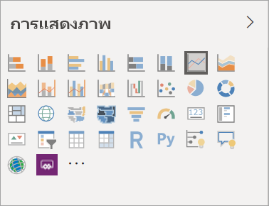
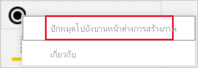
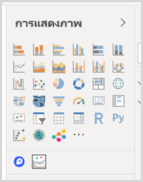
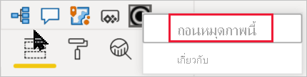

# การแสดงภาพในรายงาน Power BI

[!INCLUDE[consumer-appliesto-yyyn](../includes/consumer-appliesto-yyyn.md)]    

การแสดงภาพ (หรือเรียกสั้น ๆ ว่าวิชวล) จะแสดงข้อมูลเชิงลึกที่ค้นพบในข้อมูล รายงาน Power BI อาจมีหน้าเดียวกับหนึ่งวิชวล หรืออาจมีหลายหน้าที่เต็มไปด้วยวิชวล ในบริการของ Power BI คุณสามารถ[ปักหมุดวิชวลจากรายงานไปยังแดชบอร์ด](../create-reports/service-dashboard-pin-tile-from-report.md)ได้

สิ่งสำคัญคือต้องสร้างความแตกต่างระหว่าง *ผู้ออกแบบ*รายงาน และ*ผู้ใช้*รายงาน  ถ้าคุณเป็นผู้สร้างหรือแก้ไขรายงาน คุณจะกลายเป็นผู้ออกแบบ  ผู้ออกแบบมีสิทธิ์แก้ไขรายงานและชุดข้อมูลพื้นฐานของรายงานนั้น ใน Power BI Desktop นี่หมายความว่า คุณสามารถเปิดชุดข้อมูลในมุมมองข้อมูล และสร้างวิชวลในมุมมองรายงาน ในบริการของ Power BI นี่หมายความว่าคุณสามารถเปิดชุดข้อมูลหรือรายงานในตัวแก้ไขรายงานใน [มุมมองการแก้ไข](../consumer/end-user-reading-view.md) ถ้ารายงานหรือแดชบอร์ด[ถูกแชร์ให้กับคุณ](../consumer/end-user-shared-with-me.md) คุณกำลังเป็น*ผู้บริโภค*รายงาน คุณจะสามารถดูและโต้ตอบกับรายงานและวิชวลของรายงานได้ แต่คุณจะไม่สามารถทำการเปลี่ยนแปลงได้มากเท่าที่*นักออกแบบ*สามารถทำได้

มีวิชวลชนิดต่าง ๆ มากมายให้คุณเลือกใช้งานจากบานหน้าต่างการจัดรูปแบบการแสดงข้อมูล Power BI โดยตรง

มีวิชวล Power BI อีกจำนวนมากพร้อมใช้งานจาก [ไซต์ชุมชนของ Microsoft AppSource](https://appsource.microsoft.com) ใน AppSource คุณสามารถเรียกดูและ [ดาวน์โหลด](https://appsource.microsoft.com/marketplace/apps?page=1&product=power-bi-visuals) [วิชวล Power BI](../developer/visuals/custom-visual-develop-tutorial.md) ที่จัดทำโดย Microsoft และชุมชน

ถ้าคุณยังใหม่กับ Power BI หรือต้องการการทบทวน ใช้ลิงก์ด้านล่างเพื่อเรียนรู้พื้นฐานของการแสดงภาพใน Power BI  อีกวิธีหนึ่งคือ ใช้ตารางเนื้อหาของเรา (อยู่ตลอดด้านซ้ายของบทความนี้) เพื่อค้นหาข้อมูลอีกมากที่เป็นประโยชน์

## เพิ่มการแสดงภาพใน Power BI

[สร้างการแสดงภาพ](power-bi-report-add-visualizations-i.md)ในหน้าของรายงานของคุณ เรียกดู[รายการการแสดงภาพที่มี และบทช่วยสอนการแสดงภาพที่มี](power-bi-visualization-types-for-reports-and-q-and-a.md) 

## อัปโหลดการแสดงภาพจากไฟล์หรือจาก AppSource

เพิ่มการแสดงภาพที่คุณสร้างขึ้นด้วยตัวเอง หรือที่คุณพบใน [ไซต์ชุมชนของ  Microsoft AppSource](https://appsource.microsoft.com/marketplace/apps?product=power-bi-visuals) รู้สึกมีความคิดสร้างสรรค์? เจาะลึกลงในโค้ดต้นฉบับของเรา และใช้[เครื่องมือสำหรับนักพัฒนา](../developer/visuals/custom-visual-develop-tutorial.md)เพื่อสร้างการแสดงภาพชนิดใหม่ และ[แชร์กับชุมชน](../developer/visuals/office-store.md) หากต้องการเรียนรู้เพิ่มเติมเกี่ยวกับการพัฒนาวิชวล Power BI โปรดไปที่ [การพัฒนาวิชวล Power BI](../developer/visuals/custom-visual-develop-tutorial.md)

## ปรับแต่งบานหน้าต่างการแสดงภาพของคุณด้วยตัวคุณเอง

คุณสามารถปรับแต่งบานหน้าต่างการแสดงภาพด้วยตนเองโดยการเพิ่มและลบวิชวล Power BI ออกจากบานหน้าต่างนั้น ถ้าคุณลบวิชวลเริ่มต้นจากบานหน้าต่างการจัดรูปแบบการแสดงภาพ คุณสามารถคืนค่าบานหน้าต่างเป็นค่าเริ่มต้นและนำวิชวลเริ่มต้นทั้งหมดกลับมาใช้ใหม่ได้

### เพิ่มวิชวลไปยังบานหน้าต่างการแสดงภาพ

หากคุณพบว่าตนเองกำลังใช้วิชวลเดิมในหลายๆ รายงานอยู่ คุณสามารถเพิ่มวิชวลนั้นไปยังบานหน้าต่างการแสดงภาพของคุณได้ การเพิ่มวิชวลจะนำไปใช้กับวิชวล AppSource วิชวลองค์กร และวิชวลจากไฟล์ หากต้องการเพิ่มวิชวล ให้คลิกขวาบนวิชวล

เมื่อปักหมุดวิชวลแล้ว วิชวลจะย้ายขึ้นไปอยู่ร่วมกับวิชวลเริ่มต้นรายการอื่นๆ วิชวลนี้จะเชื่อมโยงกับบัญชีที่ลงชื่อเข้าใช้ของคุณตอนนี้ ดังนั้นรายงานใหม่ใดก็ตามที่คุณสร้างจะประกอบด้วยวิชวลนี้โดยอัตโนมัติ เสมือนว่าคุณได้ลงชื่อเข้าใช้แล้ว คุณไม่จำเป็นต้องเพิ่มวิชวลเฉพาะที่คุณใช้เป็นประจำในทุกๆ รายงานอีกต่อไป

### ลบวิชวลออกจากบานหน้าต่างการแสดงภาพ

ถ้าคุณไม่ได้ใช้วิชวลเป็นประจำอีกต่อไป คุณสามารถคลิกขวาที่วิชวล และลบออกจากบานหน้าต่างการแสดงภาพ วิชวลทุกชนิดสามารถนำออกจากบานหน้าต่างการแสดงภาพได้ โดยรวมถึงวิชวลเริ่มต้น ไฟล์ วิชวลองค์กร และวิชวล AppSource

### คืนค่าบานหน้าต่างการแสดงผลด้วยภาพ

การคืนค่าบานหน้าต่างการแสดงผลด้วยภาพใช้ได้กับวิชวลเริ่มต้นเท่านั้น วิชวลที่เพิ่มไปยังบานหน้าต่างการแสดงภาพจะไม่ได้รับผลกระทบ และยังคงมีให้พร้อมใช้งานจากบานหน้าต่างการแสดงภาพ หากคุณต้องการลบวิชวล AppSource หรือไฟล์ ออกจากบานหน้าต่างการแสดงภาพ คุณต้องทำด้วยตัวคุณเอง

เมื่อต้องการคืนค่าบานหน้าต่างการแสดงภาพเป็นค่าเริ่มต้น ให้คลิกตัวเลือกเพิ่มเติมแล้วเลือก **คืนค่าวิชวลเริ่มต้น**

## การเปลี่ยนชนิดของการแสดงภาพ

ลอง[เปลี่ยนชนิดของการแสดงภาพ](power-bi-report-change-visualization-type.md) เพื่อดูว่าแบบไหนที่ดีที่สุดสำหรับข้อมูลของคุณ

## ปักหมุดการแสดงภาพ

ในบริการของ Power BI เมื่อคุณมีการแสดงภาพตามแบบคุณที่ต้องการแล้ว คุณสามารถ[ปักหมุดไปยังแดชบอร์ด](../create-reports/service-dashboard-pin-tile-from-report.md)ให้เป็นไทล์ได้ ถ้าคุณเปลี่ยนการแสดงภาพที่ใช้ในรายงานหลังจากที่คุณปักหมุด ไทล์บนแดชบอร์ดจะไม่เปลี่ยนแปลง ถ้าเป็นแผนภูมิเส้น จะยังแสดงเป็นแผนภูมิเส้นอยู่ถึงแม้ว่าคุณเปลี่ยนเป็นแผนภูมิโดนัทในรายงาน

## ข้อจำกัดและข้อควรพิจารณา
- วิชวลอาจโหลดช้า ทั้งขึ้นอยู่กับแหล่งข้อมูลและจำนวนของเขตข้อมูล (หน่วยวัดหรือคอลัมน์)  เราขอแนะนำให้จำกัดวิชวลให้เหลือเพียง 10-20 เขตข้อมูล ทั้งนี้เพื่อเหตุผลในการอ่านและประสิทธิภาพการทำงาน 

- ขีดจำกัดสูงสุดสำหรับวิชวลอยู่ที่ 100 เขตข้อมูล (หน่วยวัดหรือคอลัมน์) ถ้าไม่สามารถโหลดวิชวลได้ ให้ลดจำนวนของเขตข้อมูล

## ขั้นตอนถัดไป

* [ชนิดการแสดงภาพใน Power BI](power-bi-visualization-types-for-reports-and-q-and-a.md)
* [วิชวล Power BI](../developer/visuals/power-bi-custom-visuals.md)
