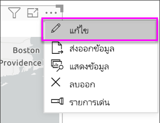

# สร้างแผนที่ ArcGIS ใน Power BI Desktop

[!INCLUDE [power-bi-visuals-desktop-banner](../includes/power-bi-visuals-desktop-banner.md)]

บทช่วยสอนนี้ถูกเขียนขึ้นจากมุมมองของผู้สร้าง ArcGIS Map for Power BI เมื่อ*ผู้ออกแบบ*แชร์แผนที่ ArcGIS Map for Power BI กับเพื่อนร่วมงาน เพื่อนร่วมงานดังกล่าวสามารถดูและโต้ตอบกับแผนที่ได้ แต่ไม่สามารถบันทึกการเปลี่ยนแปลงได้ เพื่อเรียนรู้เพิ่มเติมเกี่ยวกับการดูแผนที่ ArcGIS ดูที่[การโต้ตอบกับ ArcGIS Map for Power BI](power-bi-visualizations-arcgis.md)

การรวมกันระหว่างแผนที่ ArcGIS และ Power BI ทำให้การนำเสนอจุดต่าง ๆ บนแผนที่ก้าวขึ้นไปอีกระดับ เลือกแผนที่พื้นฐาน ชนิดของสถานที่ตั้ง ธีม สไตล์สัญลักษณ์ และเลเยอร์อ้างอิง เพื่อสร้างการแสดงภาพแผนที่ที่สวยงามและสื่อความหมาย การรวมกันของ เลเยอร์ข้อมูลที่เป็นทางการบนแผนที่ และการวิเคราะห์ทางตำแหน่ง ให้คุณทำความเข้าใจการแสดงภาพของคุณที่ลึกซึ้งขึ้น

 ถึงแม้ว่าคุณไม่สามารถสร้าง ArcGIS Map for Power BI บนอุปกรณ์เคลื่อนที่ คุณสามารถดู และโต้ตอบกับแผนที่ได้ ดู[การโต้ตอบกับแผนที่ ArcGIS](power-bi-visualizations-arcgis.md)

> [!NOTE]
> แมป ArcGIS สำหรับ Power BI ไม่สามารถใช้งานได้ในเซิร์ฟเวอร์ Power BI Report

> [!TIP]
> GIS ย่อมาจากระบบข้อมูลทางภูมิศาสตร์

ตัวอย่างด้านล่างใช้พื้นที่สีเทาเข้ม เพื่อแสดงยอดขายตามภูมิภาคในรูป แผนที่คลื่นความร้อน เทียบกับเลเยอร์รายได้หลังหักภาษีของประชากรปี 2016 ตามที่คุณจะเห็นในขณะที่คุณอ่าน การใช้ ArcGIS Maps for Power BI จะนำเสนอความสามารถในการแมปที่ได้รับการปรับปรุงอย่างไร้ขีดจำกัด ข้อมูลประชากร และการแสดงภาพแผนที่ที่น่าดึงดูดใจได้มากขึ้น เพื่อให้คุณสามารถบอกเล่าเรื่องราวที่ดีที่สุดของคุณได้

> [!TIP]
> เยี่ยมชม[หน้าเพจของ Esri บน ArcGIS Maps for Power BI](https://www.esri.com/powerbi)เพื่อดูตัวอย่างมากมาย และอ่านคำบอกเล่าจากผู้ใช้ แล้วดู[หน้าเริ่มต้นใช้งาน ArcGIS Maps for Power BI ](https://doc.arcgis.com/en/maps-for-powerbi/get-started/about-maps-for-power-bi.htm)ของ Esri

## ความยินยอมของผู้ใช้
ArcGIS Maps for Power BI ให้บริการโดย Esri (https://www.esri.com) การใช้ ArcGIS Maps for Power BI ของคุณ ต้องอยู่ภายใต้ข้อกำหนดและนโยบายความเป็นส่วนตัวของ Esri ผู้ใช้ Power BI ที่ต้องการใช้วิชวล ArcGIS Maps for Power BI จำเป็นต้องตอบรับในกล่องโต้ตอบความยินยอม

**แหล่งข้อมูล**

[ข้อกำหนด](https://go.microsoft.com/fwlink/?LinkID=826322)

[นโยบายความเป็นส่วนตัว](https://go.microsoft.com/fwlink/?LinkID=826323)

[หน้าผลิตภัณฑ์ ArcGIS Maps for Power BI](https://www.esri.com/powerbi)

## ข้อกำหนดเบื้องต้น

บทช่วยสอนนี้ใช้ Power BI Desktop และ[ตัวอย่างการวิเคราะห์การค้าปลีก](https://download.microsoft.com/download/9/6/D/96DDC2FF-2568-491D-AAFA-AFDD6F763AE3/Retail%20Analysis%20Sample%20PBIX.pbix) PBIX  นอกจากนี้ยังสามารถสร้าง ArcGIS Maps for Power BI ได้โดยใช้บริการของ Power BI 

1. จากด้านบนซ้ายของแถบเมนู เลือก **ไฟล์** \> **เปิด**
   
2. ค้นหา **ไฟล์ PBIX การวิเคราะห์การค้าปลีกตัวอย่าง** ที่บันทึกไว้ในเครื่องภายในของคุณ

1. เปิด **ตัวอย่างการวิเคราะห์ร้านค้าปลีก** ในสกรีนช็อตมุมมองรายงาน

1. เลือก  หากต้องการเพิ่มหน้าใหม่

   
## สร้างการแสดงภาพ ArcGIS Maps for Power BI

ดู Will สร้างการแสดงภาพที่แตกต่างกันสองสามภาพ จากนั้นใช้ขั้นตอนด้านล่าง เพื่อลองทำด้วยตนเองโดยใช้[ ไฟล์ .PBIX ตัวอย่างการวิเคราะห์การค้าปลีก](../sample-datasets.md)
    

   > [!NOTE]
   > วิดีโอนี้ใช้ Power BI Desktop เวอร์ชันเก่า
   > 

> [!VIDEO https://www.youtube.com/embed/EKVvOZmxg9s]

1. เลือกไอคอน ArcGIS Maps for Power BI จากบานหน้าต่าง การจัดรูปแบบการแสดงข้อมูล
   
        

2. Power BI เพิ่มเแม่แบบว่างในพื้นที่ของรายงาน สำหรับบทช่วยสอนนี้ เราจะใช้เวอร์ชันฟรี
   
   

3. จากบานหน้าต่าง**เขตข้อมูล** ลากเขตข้อมูลไปยังบักเก็ต**สถานที่ตั้ง** หรือ**ละติจูด** และ/หรือ**ลองจิจูด** ในตัวอย่างนี้ เรากำลังใช้**ร้าน > เมือง**
   
   > [!NOTE]
   > ArcGIS Maps for Power BI จะตรวจโดยอัตโนมัติ ว่าเขตข้อมูลที่คุณเลือก ควรแสดงเป็นรูปร่างหรือจุดบนแผนที่ถึงจะดีที่สุด คุณสามารถปรับเปลี่ยนค่าเริ่มต้นในการตั้งค่า (ดูด้านล่าง)
   > 
   > 
   
    

4. จากบานหน้าต่าง**เขตข้อมูล** ลากเป็นหน่วยวัดไปบักเก็ต**ขนาด**เพื่อปรับปรุงวิธีแสดงข้อมูล ในตัวอย่างนี้ เรากำลังใช้**ยอดขาย > ยอดขายปีที่แล้ว**
   
    

คุณได้สร้างแผนที่ ArcGIS Map for Power BI แล้ว ในตอนนี้ เรามาปรับแต่งและจัดรูปแบบแผนที่ของเราโดยใช้แผนที่พื้นฐาน ชนิดของสถานที่ตั้ง ธีม และอื่น ๆ อีกมากมาย

## การตั้งค่าและการจัดรูปแบบสำหรับ ArcGIS Maps for Power BI
เพื่อเข้าถึงคุณลักษณะการจัดรูปแบบ **ArcGIS Maps for Power BI**:

1. ใช้งานคุณลักษณะเพิ่มเติมโดยเลือก**ตัวเลือกเพิ่มเติม** (...) ที่มุมขวาบนของส่วนการแสดงภาพแล้วเลือก **แก้ไข**
   
   
   
   การแสดงภาพจะขยายและคุณลักษณะที่พร้อมใช้งานจะแสดงอยู่ด้านบนสุด แต่ละคุณลักษณะ เมื่อเลือก บานหน้าต่างงานที่มีรายละเอียดตัวเลือกจะเปิดออกมา 
   
   
   

> [!TIP]
> **Esri** มี[เอกสารประกอบที่ครอบคลุม](https://go.microsoft.com/fwlink/?LinkID=828772)ชุดคุณลักษณะของ **ArcGIS Maps for Power BI**

### แผนที่พื้นฐาน
มีแผนที่พื้นฐานสี่แบบให้: พื้นที่สีเทาเข้ม, พื้นที่สีเทาอ่อน, OpenStreetMap และแผนที่ถนน  *ถนน*เป็นแผนที่พื้นฐานมาตรฐานของ ArcGIS

เพื่อนำแผนที่พื้นฐานไปใช้ เลือกแผนที่จากในบานหน้าต่างงาน

### ชนิดของสถานที่ตั้ง
ArcGIS Maps for Power BI จะตรวจหาวิธีดีที่สุดในการแสดงข้อมูลบนแผนที่โดยอัตโนมัติ ซึ่งเลือกได้จากจุดหรือขอบเขต ตัวเลือกชนิดของสถานที่ตั้งช่วยให้คุณสามารถปรับปรุงตัวเลือกเหล่านี้

**ขอบเขต**จะทำงานเฉพาะ เมื่อข้อมูลของคุณ มีค่าทางภูมิศาสตร์มาตรฐาน ArcGIS Maps for Power BI จะคำนวณรูปร่างโดยอัตโนมัติเพื่อแสดงบนแผนที่ ค่าทางภูมิศาสตร์มาตรฐานรวมถึง ประเทศ จังหวัด รหัสไปรษณีย์ เป็นต้น แต่เหมือนกับการกำหนดรหัสพิกัด Power BI อาจไม่พบว่าเขตข้อมูลควรเป็นขอบเขตตามค่าเริ่มต้น หรืออาจไม่พบขอบเขตสำหรับข้อมูลของคุณ  

### ธีมแผนที่
มีธีมแผนที่ให้สี่แบบ Power BI จะเลือกธีม **เฉพาะสถานที่ตั้ง** หรือ **ขนาด** ตามเขตข้อมูลที่คุณเพิ่มไปยังบักเก็ต **สถานที่ตั้ง**และ**ขนาด** แผนที่ของเรามีค่าเริ่มต้นเป็น**ขนาด**เนื่องจากเราได้เพิ่มเขตข้อมูลลงในทั้งสองบักเก็ต ลองใช้ธีมอื่น ๆ และกลับไป **ขนาด** ก่อนที่จะย้ายไปยังขั้นตอนถัดไป  

<table>
<tr><th>ธีม</th><th>คำอธิบาย</th>
<tr>
<td>เฉพาะสถานที่ตั้ง</td>
<td>ลงจุดข้อมูลหรือเติมสีขอบเขตตามเขตข้อมูลที่คุณเพิ่มไปยังบักเก็ตสถานที่ตั้ง</td>
</tr>
<tr>
<td>แผนที่คลื่นความร้อน</td>
<td>ลงความเข้มของข้อมูลบนแผนที่ พื้นที่ของกิจกรรมหรือค่าที่สูงขึ้นจะถูกแสดงด้วยสีที่เข้มขึ้นและเรืองแสง </td>
</tr>
<tr>
<td>ขนาด</td>
<td>ลงจุดข้อมูลบนแผนที่ตามเขตข้อมูลที่คุณเพิ่มไปยังบักเก็ตขนาด</td>
</tr>
<tr>
<td>การทำคลัสเตอร์</td>
<td>จุดภายในรัศมีคลัสเตอร์ที่ระบุจะถูกจัดกลุ่มเป็นสัญลักษณ์เดียวที่แสดงถึงจำนวนจุดในพื้นที่นั้นของแผนที่ </td>
</tr>
</table>

### ลักษณะของสัญลักษณ์
ลักษณะของสัญลักษณ์ช่วยให้คุณสามารถปรับวิธีการแสดงข้อมูลบนแผนที่ ลักษณะของสัญลักษณ์จะขึ้นกับชนิดของสถานที่ตั้ง และธีมแผนที่ที่เลือก ตัวอย่างต่อไปนี้แสดงธีมแผนที่ที่กำหนดเป็น**ขนาด** และส่วนการปรับแต่งลักษณะของสัญลักษณ์หลายอย่าง ทั้งความโปร่งใส ลักษณะ และขนาด 

### หมุด
เรียกความสนใจไปยังจุดบนแผนที่ของคุณ โดยการเพิ่มหมุด  

1. เลือกแท็บ**หมุด**
2. พิมพ์คำสำคัญ (เช่น ที่อยู่ สถานที่ และจุดสนใจ) ในกล่องค้นหา และเลือกจากรายการดรอปดาวน์ สัญลักษณ์จะปรากฏขึ้นบนแผนที่ และแผนที่ขยายไปยังตำแหน่งที่ตั้งให้โดยอัตโนมัติ ผลลัพธ์การค้นหาจะถูกบันทึกเป็นการ์ดที่ตั้ง ในบานหน้าต่างการปักหมุด คุณสามารถบันทึกการ์ดได้สูงสุด 10 สถานที่
   
   
3. Power BI เพิ่มเข็มหมุดไปยังตำแหน่งที่ตั้ง และคุณสามารถเปลี่ยนสีของหมุดได้
   
   
4. เพิ่มและลบหมุด
   
   

### เวลาในการขับขี่
บานหน้าต่างเวลาในการขับระ ให้คุณเลือกตำแหน่งที่ตั้ง และจากนั้นหาว่า จุดอื่น ๆ บนแผนที่อยู่ภายในระยะทาง หรือเวลาเดินทางที่กำหนดหรือไม่ ตัวอย่างด้านล่างแสดงรัศมี 50 ไมล์จากกรุงวอซิงตัน ดีซี  ทำตามขั้นตอนด้านล่างเพื่อสร้างเลเยอร์เวลาขับรถของคุณเอง 
    

1. เลือกเครื่องมือเลือกเดียวและเลือกปักหมุดหรือฟอง ในตัวอย่างนี้ เราได้เลือกหมุดสำหรับสนามบินชาร์ล็อตต์ดักลาส

   
   
   > [!TIP]
   > เป็นการง่ายกว่าถ้าเลือกตำแหน่งในขณะที่คุณขยายแผนที่ คุณสามารถย่อ/ขยายโดยใช้ไอคอน + หรือเลื่อนบนเมาส์ของคุณได้
   > 
   > 
2. สมมติว่าคุณกำลังเดินทางไปยังสนามบินชาร์ล็อตดักลาสเป็นเวลาสองสามวัน และต้องการค้นหาว่าร้านค้าของคุณอยู่ภายในระยะการขับขี่ที่เหมาะสมหรือไม่ เปลี่ยนพื้นที่การค้นหาใน **เวลาขับรถ** และระยะห่างจาก **25** นาที เลือกตกลง    
   
    

    

3. มีสองร้านค้าภายในระยะเวลาขับรถ 25 นาที รัศมีจะแสดงเป็นสีม่วง เลือกตำแหน่งที่ตั้งใด ๆ เพื่อแสดงรายละเอียด คุณอาจจัดรูปแบบของรัศมี โดยการเปลี่ยนสีและเค้าร่างได้
   
    

### เลเยอร์อ้างอิง
#### เลเยอร์อ้างอิง - ข้อมูลประชากร
ArcGIS Maps for Power BI มีเลเยอร์ประชากรให้เลือกจำนวนหนึ่ง เพื่อช่วยแสดงบริบทของข้อมูลจาก Power BI

1. เลือกแท็บ**เลเยอร์อ้างอิง** และเลือก**ข้อมูลประชากร**
2. แต่ละเลเยอร์จะแสดงพร้อมกล่องกาเครื่องหมาย ทำเครื่องหมายถูกเพื่อเพิ่มเลเยอร์ไปยังแผนที่  ในตัวอย่างนี้ เราได้เพิ่มรายได้เฉลี่ยต่อครัวเรือน 
   
    
3. แต่ละเลเยอร์สามารถโต้ตอบได้เช่นกัน วางเมาส์เหนือฟองเพื่อดูรายละเอียด คลิกพื้นที่แรเงาเพื่อดูรายละเอียดในรูปแบบของแผนภูมิ ที่นี่เราได้เลือกรหัสไปรษณีย์ 28227 และมีสองแผนภูมิเพื่อให้เราดู
   
    

#### เลเยอร์อ้างอิง - ArcGIS
ArcGIS Online ให้องค์กรสามารถเผยแพร่แผนที่บนเว็บสาธารณะ นอกจากนี้ Esri มีชุดของแผนที่บนเว็บที่รวบรวมไว้ผ่านทาง Living Atlas ในแท็บ ArcGIS คุณสามารถค้นหาแผนที่เว็บสาธารณะ หรือแผนที่ Living Atlas ทั้งหมด และเพิ่มเป็นเลเยอร์อ้างอิงลงในแผนที่

1. เลือกแท็บ**เลเยอร์อ้างอิง** และเลือก**ArcGIS**
2. ป้อนคำค้นหา จากนั้นเลือกเลเยอร์แผนที่ ในตัวอย่างนี้ เราได้เลือกเขตการเลือกตั้งสมาชิกสภาของสหรัฐอเมริกา
   
    
3. เมื่อต้องดูรายละเอียด เลือกพื้นที่แรเงาเพื่อเปิด *ตัวเลือกจากเลเยอร์อ้างอิง*: ใช้เครื่องมือการเลือกเลเยอร์อ้างอิงเพื่อเลือกขอบเขตหรือวัตถุบนเลเยอร์อ้างอิง

 

## การเลือกจุดข้อมูล
แผนที่ ArcGIS สำหรับ Power BI รองรับโหมดเลือกห้าโหมดเพื่อให้คุณสามารถเลือกข้อมูลของคุณได้อย่างรวดเร็วและแม่นยำ

ปรับโหมดการเลือกโดยเลื่อนเคอร์เซอร์ไปที่ไอคอนเลือกรายการเดี่ยวที่ภาพด้านล่าง นี่จะเป็นการขยายแถบรายการที่ซ่อนอยู่ด้วยเพื่อแสดงเครื่องมือเพิ่มเติม:

เครื่องมือแต่ละตัวจะมีบทบาทเฉพาะเพื่อให้คุณเลือกข้อมูลของคุณ: 

 เลือกจุดข้อมูลเดี่ยว

 วาดสี่เหลี่ยมผืนผ้าบนแผนที่ และเลือกจุดข้อมูลที่อยู่ภายใน

 ใช้ขอบเขตหรือรูปหลายเหลี่ยมภายในเลเยอร์อ้างอิง เพื่อใช้เลือกจุดข้อมูลที่อยู่ภายใน

 คุณสามารถเลือกข้อมูลโดยใช้เลเยอร์บัฟเฟอร์

 คุณสามารถเลือกจุดข้อมูลที่ใกล้เคียงกัน

> [!NOTE]
> คุณสามารถเลือกจุดข้อมูลได้สูงสุด 250 จุดในแต่ละครั้ง
> 
> 

 

## การขอความช่วยเหลือ
**Esri** มี[เอกสารประกอบที่ครอบคลุม](https://go.microsoft.com/fwlink/?LinkID=828772)ชุดคุณลักษณะของ **ArcGIS Maps for Power BI**

คุณสามารถถามคำถาม ค้นหาข้อมูลล่าสุด รายงานปัญหา และค้นหาคำตอบใน[กระทู้ ชุมชน Power BI ที่เกี่ยวข้องกับ **ArcGIS Maps for Power BI**](https://go.microsoft.com/fwlink/?LinkID=828771) ได้

ถ้าคุณมีคำแนะนำเพื่อการปรับปรุง โปรดส่งไปยัง[รายการแนวคิด Power BI](https://ideas.powerbi.com)

 

## การจัดการการใช้ ArcGIS Maps for Power BI ภายในองค์กรของคุณ
Power BI มีความสามารถสำหรับผู้ใช้ ผู้ดูแลระบบผู้เช่า และผู้ดูแลระบบ IT ในจัดการการใช้งาน ArcGIS Maps for Power BI ด้านล่างคุณจะพบขั้นตอนแต่ละบทบาทที่สามารถใช้ได้ 

### ตัวเลือกการออกแบบ
ใน Power BI Desktop นักออกแบบสามารถปิดใช้งาน ArcGIS Maps for Power BI บนแท็บความปลอดภัยได้ เลือก**ไฟล์** > **ตัวเลือก และการตั้งค่า** จากนั้นเลือก **ตัวเลือก** > **ความปลอดภัย**. เมื่อปิดใช้งาน ArcGIS Maps จะไม่โหลดตามค่าเริ่มต้น

### ตัวเลือกผู้ดูแลระบบผู้เช่า
ใน PowerBI.com ผู้ดูแลระบบผู้เช่าสามารถปิด ArcGIS Maps for Power BI สำหรับผู้ใช้ทั้งหมด เลือก**การตั้งค่า** > **พอร์ทัลผู้ดูแลระบบ** > **การตั้งค่าผู้เช่า** . เมื่อปิดใช้งาน Power BI จะไม่แสดงไอคอน ArcGIS Maps for Power BI ในบานหน้าต่างการจัดรูปแบบการแสดงข้อมูล

### ตัวเลือกผู้ดูแลระบบ IT
Power BI Desktop รองรับการใช้ **นโยบายกลุ่ม** เพื่อปิดใช้ ArcGIS Maps for Power BI ในคอมพิวเตอร์ของหน่วยงาน

<table>
<tr><th>แอตทริบิวต์</th><th>ค่า</th>
</tr>
<tr>
<td>คีย์</td>
<td>Software\Policies\Microsoft\Power BI Desktop&lt;/td&gt;
</tr>
<tr>
<td>valueName</td>
<td>EnableArcGISMaps</td>
</tr>
</table>

ค่า 1 (เลขฐานสิบ) เปิดใช้งาน ArcGIS Maps for Power BI

ค่า 0 (เลขฐานสิบ) ปิดใช้งาน ArcGIS Maps for Power BI

## ข้อควรพิจารณาและข้อจำกัด
ArcGIS Maps for Power BI มีให้ใช้งานในบริการและแอปพลิเคชันต่อไปนี้:

<table>
<tr><th>บริการ/แอป</th><th>ความพร้อมใช้งาน</th></tr>
<tr>
<td>Power BI Desktop</td>
<td>ใช่</td>
</tr>
<tr>
<td>บริการ power BI (app.powerbi.com)</td>
<td>ใช่</td>
</tr>
<tr>
<td>แอปพลิเคชัน Power BI สำหรับอุปกรณ์เคลื่อนที่</td>
<td>ใช่</td>
</tr>
<tr>
<td>Power BI ที่เผยแพร่ไปยังเว็บ</td>
<td>ไม่ใช่</td>
</tr>
<tr>
<td>Power BI Embedded</td>
<td>ไม่ใช่</td>
</tr>
<tr>
<td>บริการของ power BI ที่ฝังตัว (PowerBI.com)</td>
<td>ไม่ใช่</td>
</tr>
</table>

ในบริการหรือแอปพลิเคชันที่ไม่มี ArcGIS Maps for Power BI ให้ใช้งาน การแสดงภาพจะแสดงเป็นวิชวลว่าง ที่มีโลโก้ Power BI

เมื่อกำหนดรหัสพิกัดที่อยู่ เฉพาะที่อยู่ 1500 สถานที่แรกเท่านั้นที่จะกำหนดได้ การกำหนดรหัสพิกัด ชื่อสถานที่ หรือประเทศ ไม่อยู่ในข้อจำกัด 1500 สถานที่

 

**ArcGIS Maps for Power BI ทำงานร่วมกันอย่างไร?**
ArcGIS Maps for Power BI ให้บริการโดย Esri (https://www.esri.com) การใช้ ArcGIS Maps for Power BI ของคุณ ต้องอยู่ภายใต้[ข้อกำหนด](https://go.microsoft.com/fwlink/?LinkID=8263222)และ[นโยบายความเป็นส่วนตัว](https://go.microsoft.com/fwlink/?LinkID=826323)ของ Esri ผู้ใช้ Power BI ที่ต้องการใช้วิชวล ArcGIS Maps for Power BI จำเป็นต้องตอบรับในกล่องโต้ตอบความยินยอม (ดู ความยินยอมของผู้ใช้ สำหรับรายละเอียด)  การใช้ ArcGIS Maps for Power BI ต้องอยู่ภายใต้ข้อกำหนดและนโยบายความเป็นส่วนตัวของ Esri ซึ่งยังได้เชื่อมโยงจากกล่องโต้ตอบความยินยอม แต่ละผู้ใช้ต้องยินยอมก่อนที่จะใช้ ArcGIS Maps for Power BI เป็นครั้งแรก ทันทีที่ผู้ใช้ตอบรับความยินยอม ข้อมูลที่ผูกไว้กับวิชวล จะถูกส่งไปยังบริการของ Esri อย่างน้อยสำหรับการกำหนดรหัสพิกัด ซึ่งหมายถึงการแปลงข้อมูลตำแหน่งที่ตั้ง ไปเป็นข้อมูลละติจูดและลองจิจูดที่สามารถแสดงบนแผนที่ได้ คุณควรถือว่า ข้อมูลใด ๆ ที่ผูกอยู่กับการแสดงภาพข้อมูล สามารถถูกส่งไปยังบริการของ Esri Esri มีบริการต่าง ๆ เช่น แผนที่พื้นฐาน การวิเคราะห์เชิงพื้นที่ กำหนดรหัสพิกัด เป็นต้น วิชวล ArcGIS Maps for Power BI โต้ตอบกับบริการเหล่านี้โดยใช้การเชื่อมต่อ SSL ที่ป้องกันโดยใบรับรองที่ให้และดูแลรักษาโดย Esri สามารถรับข้อมูลเพิ่มเติมเกี่ยวกับ ArcGIS Maps for Power BI จาก[หน้าผลิตภัณฑ์ ArcGIS Maps for Power BI](https://www.esri.com/powerbi) ของ Esri ได้

เมื่อผู้ใช้ลงทะเบียนสมัครใช้บริการ Plus ที่ให้บริการโดย Esri ผ่านทาง ArcGIS Maps for Power BI พวกเขากำลังติดต่อโดยตรงกับทาง Esri Power BI ไม่ส่งข้อมูลส่วนบุคคลเกี่ยวกับผู้ใช้ไปให้ Esri ผู้ใช้ลงชื่อเข้าใช้ และเชื่อถือแอปพลิเคชัน AAD ของ Esri ด้วยข้อมูลประจำตัว AAD ของพวกเขาเอง จากการทำเช่นนั้น ผู้ใช้ที่จะแชร์ข้อมูลส่วนบุคคลของพวกเขาโดยตรงกับ Esri เมื่อผู้ใช้เพิ่มเนื้อหา Plus ลงในวิชวล ArcGIS Maps for Power BI ผู้ใช้ Power BI อื่นต้องเป็นสมาชิก Plus ด้วย ถึงดูหรือแก้ไขเนื้อหานั้นได้ 

สำหรับการคำถามทางเทคนิคโดยละเอียด เกี่ยวกับวิธีการทำงานของ ArcGIS Maps for Power BI ของ Esri สื่อสารผ่านไซต์ฝ่ายสนับสนุนของ Esri

**ข้อมูลใดบ้างที่ส่งไปยัง Esri?**
คุณสามารถอ่านเกี่ยวกับข้อมูลที่ถ่ายโอนไปยัง Esri บน [ไซต์เอกสารประกอบ](https://doc.arcgis.com/en/maps-for-powerbi/get-started/data-transfer.htm) ได้

**มีค่าธรรมเนียมใด ๆ สำหรับการใช้ ArcGIS Maps for Power BI หรือไม่?**

ArcGIS Map for Power BI ให้บริการโดย **Esri** โดยไม่มีค่าใช้จ่ายเพิ่มเติม คุณต้องให้ความยินยอมในข้อตกลงของผู้ใช้  

**ฉันได้รับข้อผิดพลาดใน Power BI Desktop เกี่ยวกับแคชของฉันกำลังเต็ม**

นี่คือข้อบกพร่องที่กำลังแก้ไข  ในระหว่างนี้ ลองลบไฟล์ในตำแหน่งที่ตั้งนี้เพื่อเป็นการล้างแคชของคุณ: C:\Users\\AppData\Local\Microsoft\Power BI Desktop\CEF และจากนั้นรีสตาร์ต Power BI

**ArcGIS Maps for Power BI สนับสนุน Shapefiles ของ Esri หรือไม่?**

ArcGIS Maps for Power BI ตรวจพบขอบเขตมาตรฐาน เช่นประเทศ/ภูมิภาค, รัฐ/จังหวัด และรหัสไปรษณีย์โดยอัตโนมัติ ถ้าคุณต้องการใช้รูปร่างของคุณเอง คุณสามารถทำได้ด้วย[แผนที่รูปร่างสำหรับ Power BI Desktop](desktop-shape-map.md)

**ฉันสามารถดูแผนที่ ArcGIS ของฉันแบบออฟไลน์ได้หรือไม่?**

ไม่ Power BI ต้องเชื่อมต่อกับเครือข่ายเพื่อแสดงแผนที่

**ฉันสามารถเชื่อมต่อกับบัญชี ArcGIS Online ของฉันจาก Power BI ได้หรือไม่?**

ยังไม่ได้ [ลงคะแนนสำหรับแนวคิดนี้](https://ideas.powerbi.com/forums/265200-power-bi-ideas/suggestions/9154765-arcgis-geodatabases) และเราจะส่งอีเมลให้คุณ เมื่อเราเริ่มทำงานกับคุณลักษณะนี้  

## ขั้นตอนถัดไป
[โต้ตอบกับแผนผังที่ ArcGIS ที่ถูกแชร์กับคุณ](power-bi-visualizations-arcgis.md)

[บล็อกโพสต์ประกาศให้ใช้งาน ArcGIS Maps for Power BI](https://powerbi.microsoft.com/blog/announcing-arcgis-maps-for-power-bi-by-esri-preview/)

มีคำถามเพิ่มเติมหรือไม่ [ลองถามชุมชน Power BI](https://community.powerbi.com/)

