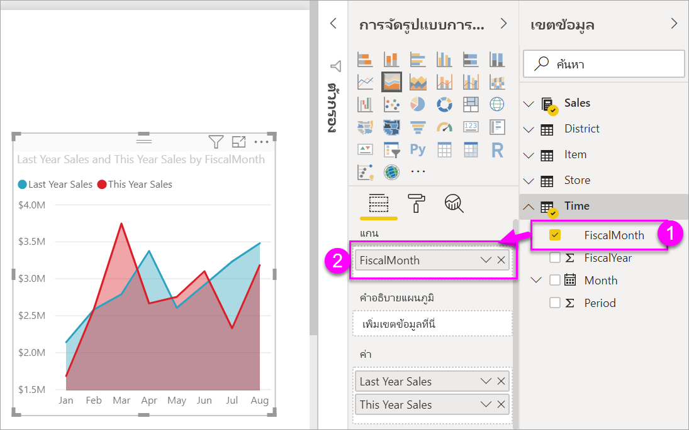
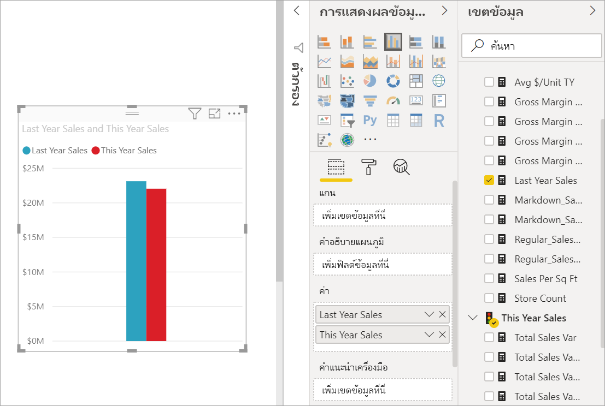
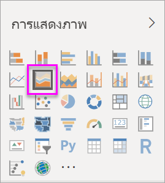
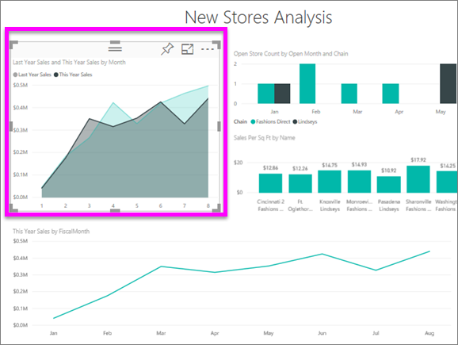
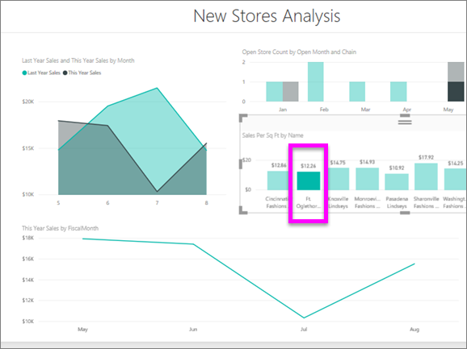

# แผนภูมิพื้นที่พื้นฐาน
แผนภูมิพื้นที่พื้นฐาน (หรือที่เรียกว่า แผนภูมิพื้นที่แบบชั้น) เป็นไปตามแผนภูมิเส้น พื้นที่ระหว่างแกนและบรรทัดจะถูกเติมด้วยสีเพื่อระบุปริมาณ 

แผนภูมิพื้นที่เน้นให้เห็นปริมาณการเปลี่ยนแปลงตามเวลา และสามารถใช้เพื่อดึงความสนใจไปยังค่าผลรวมในทั่วทั้งแนวโน้ม ตัวอย่างเช่น เราสามารถลงจุดข้อมูลที่แสดงกำไรเมื่อเวลาผ่านไปในแผนภูมิพื้นที่เพื่อเน้นกำไรรวมได้

## เมื่อต้องการใช้แผนภูมิพื้นที่พื้นฐาน
แผนภูมิพื้นที่พื้นฐานคือตัวเลือกที่ดีที่สุด:

* ในการดูและเปรียบเทียบแนวโน้มปริมาณข้อมูลทั่วชุดข้อมูลเวลา 
* สำหรับแต่ละชุดข้อมูลที่แสดงถึงชุดข้อมูลตามจริงในจำนวนที่นับได้

### ข้อกำหนดเบื้องต้น
 - บริการ Power BI
 - ตัวอย่างการวิเคราะห์การค้าปลีก

เมื่อต้องการทำตามคำแนะนำดังกล่าว ให้ลงชื่อเข้าใช้ใน Power BI แล้วเลือก**รับข้อมูล\>ตัวอย่าง\>ตัวอย่างการวิเคราะห์การค้าปลีก > เชื่อมต่อ**  และเลือก **ไปยังแดชบอร์ด** 

## สร้างแผนภูมิพื้นที่พื้นฐาน
 

1. จากแดชบอร์ด "ตัวอย่างการวิเคราะห์ด้านการขายปลีก" เลือกไทล์**จำนวนร้านค้าทั้งหมด** เพื่อเปิดรายงาน "ตัวอย่างการวิเคราะห์ด้านการขายปลีก"
2. เลือก**แก้ไขรายงาน** เพื่อเปิดรายงานในมุมมองการแก้ไข
3. เพิ่มหน้ารายงานใหม่โดยเลือกไอคอนเครื่องหมายบวกสีเหลือง (+) ที่ด้านล่างของรายงาน
4. สร้างแผนภูมิพื้นที่ที่แสดงยอดขายของปีนี้และยอดขายของปีที่แล้วแยกตามเดือน
   
   a. จากพื้นที่เขตข้อมูล เลือก**ยอดขาย\>ยอดขายของปีที่แล้ว**และ**ยอดขายของปีนี้ > ค่า**

   

   b.  แปลงแผนภูมิเป็นแผนภูมิพื้นที่พื้นฐานโดยการเลือกไอคอนพื้นที่แผนภูมิจากพื้นที่การแสดงภาพ

   
   
   c.  เลือก**เวลา\>เดือน**เพื่อเพิ่มไปยังแอ่ง**แกน**   
   
   
   d.  ในการแสดงแผนภูมิตามเดือน เลือกจุดไข่ปลา (มุมบนขวาของภาพ) แล้วเลือก**เรียงลำดับตามเดือน** เมื่อต้องเปลี่ยนลำดับการจัดเรียง เลือกจุดไข่ปลาอีกครั้ง แล้วคลิก**เรียงลำดับจากน้อยไปมาก**หรือ**เรียงลำดับจากมากไปน้อย**

## การทำไฮไลท์และการกรองข้าม
สำหรับข้อมูลเกี่ยวกับการใช้บานหน้าต่างตัวกรอง โปรดดู[เพิ่มตัวกรองไปยังรายงาน](../power-bi-report-add-filter.md)

เมื่อต้องการทำไฮไลท์เฉพาะพื้นที่หนึ่งในแผนภูมิของคุณ เลือกพื้นที่นั้นหรือเส้นขอบด้านบนของพื้นที่ดังกล่าว  ถ้ามีการแสดงภาพอื่น ๆ บนหน้าเดียวกัน การทำไฮไลท์บนแผนภูมิพื้นที่พื้นฐานจะไม่กรองข้ามการแสดงภาพอื่น ๆ บนหน้ารายงาน ซึ่งต่างจากชนิดการแสดงภาพอื่น ๆ อย่างไรก็ตาม แผนภูมิพื้นที่เป็นเป้าหมายสำหรับการกรองข้ามที่เปิดใช้งานโดยการแสดงภาพอื่น ๆ บนหน้ารายงาน 

1. ลองใช้โดยการเลือกแผนภูมิพื้นที่ของคุณ และคัดลอกไปยังหน้ารายงานอื่น (CTRL C และ CTRL V)
2. เลือกหนึ่งพื้นที่แรเงา และอื่น ๆ แรเงาพื้นที่ คุณจะสังเกตผลที่มีต่อการแสดงภาพอื่น ๆ บนหน้า

    

3. ตอนนี้ เลือกองค์ประกอบการแสดงภาพอื่นๆ บนหน้า เช่น แท่งแผนภูมิคอลัมน์หรือหนึ่งเดือนบนแผนภูมิเส้น สังเกตผลกระทบบนแผนภูมิพื้นที่ที่มีการกรองข้อมูล  

     

เมื่อต้องการเรียนรู้เพิ่มเติม ดู[การโต้ตอบแบบภาพในรายงาน](../service-reports-visual-interactions.md)

## ข้อควรพิจารณาและการแก้ไขปัญหา   
* [ทำให้รายงานสามารถเข้าถึงได้มากขึ้นสำหรับผู้ทุพพลภาพ](../desktop-accessibility.md)
* แผนภูมิพื้นที่พื้นฐานจะไม่มีผลบังคับใช้สำหรับการเปรียบเทียบค่าดังกล่าวเนื่องจากมีสิ่งบดบังบนพื้นที่แบบชั้น Power BI ใช้ความโปร่งใสเพื่อระบุการเหลื่อมกันของพื้นที่ อย่างไรก็ตาม คุณลักษณะนี้จะทำงานได้ดีกับพื้นที่ที่แตกต่างกันสองหรือสามส่วนเท่านั้น เมื่อคุณต้องการเปรียบเทียบแนวโน้มกับค่าการวัดที่มากกว่าสามค่า ให้ลองใช้แผนภูมิเส้น เมื่อคุณต้องการเปรียบเทียบปริมาณเทียบกับค่าการวัดที่มากกว่าสามค่า ลองใช้แผนภูมิต้นไม้

## ขั้นตอนถัดไป
[รายงานใน Power BI](power-bi-visualization-card.md)  

