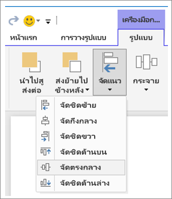
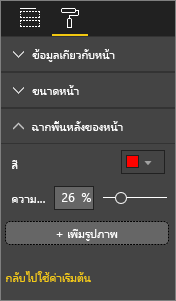

# <a name="best-design-practices-for-reports-and-visuals"></a>แนวทางปฏิบัติที่ดีที่สุดของการออกแบบสำหรับรายงานและรูปภาพ

บทความนี้อธิบายแนวทางปฏิบัติที่ดีที่สุดสำหรับการออกแบบรายงานใน Power BI ซึ่งจะกล่าวถึงหลักของการออกแบบที่คุณสามารถนำไปใช้กับรายงานของคุณ รวมถึงหน้าและแต่ละรูปภาพที่ประกอบเป็นรายงาน หลายแนวทางปฏิบัติที่ดีที่สุดเหล่านี้ใช้กับการออกแบบแดชบอร์ดได้เช่นกัน

> [!NOTE]
> มีคำแนะนำที่รวมอยู่ในบทความนี้เพื่อให้คุณนำไปใช้ได้ตามสถานการณ์ที่เหมาะสม สำหรับทุก ๆ หลักการที่เราได้อธิบายไว้ด้านล่าง โดยทั่วไปแล้วมีบางครั้งที่เราต้อง "แหกกฎ"

หวังว่าบทความนี้จะเป็นจุดที่ช่วยให้คุณเริ่มต้นและนำสิ่งที่คุณได้เรียนรู้ไปใช้กับรายงานและการแสดงภาพของคุณเอง และเราหวังว่าคุณจะสนทนาบน [Microsoft Power BI Community](http://community.powerbi.com/) ต่อไป การใช้การออกแบบและการแสดงภาพรายงาน BI เป็นหัวข้อที่โดดเด่นในขณะนี้ มีผู้นำ บล็อกเกอร์ และเว็บไซต์จำนวนมากที่ศึกษาการออกแบบรายงาน BI อย่างละเอียดถี่ถ้วน เราได้แสดงบางส่วนไว้ในส่วนท้ายของบทความ

> *เรากำลังรู้สึกว่ารับไม่ไหวกับข้อมูล นั่นไม่ใช่เพราะว่ามีข้อมูลมากเกินไป แต่เป็นเพราะเราไม่ทราบวิธีการจัดการกับข้อมูลดังกล่าวต่างหาก*
-- Stephen Few

## <a name="a-look-at-the-landscape-and-terminology"></a>ดบริเวณโดยรอบและคำศัพท์เฉพาะทาง

ใน Power BI รายงานสามารถมีรายงานอย่างน้อยหนึ่งหน้าขึ้นไป หน้าทั้งหมดเรียกรวมกันเป็นรายงาน องค์ประกอบพื้นฐานของรายงานเป็นภาพ (หรือที่เรียกว่า การแสดงภาพ) รูปภาพแบบเดี่ยว และกล่องข้อความ จากแต่ละจุดข้อมูลไปจนถึงองค์ประกอบรายงาน ไปจนถึงหน้ารายงาน มีตัวเลือกการจัดรูปแบบที่ไม่ใช่ตัวเลขให้เลือก

เราจะเริ่มด้วยขั้นตอนการวางแผนรายงาน จากนั้นไปต่อที่หลักการพื้นฐานในการออกแบบรายงาน จากนั้นพูดคุยเกี่ยวกับหลักการออกแบบภาพ และเสร็จสิ้นด้วยการสนทนาเกี่ยวกับแนวทางปฏิบัติที่ดีที่สุดสำหรับแต่ละชนิดของภาพ

แนวทางโดยละเอียดและคำแนะนำสำหรับการสร้าง และการใช้รายงาน Power BI สามารถเข้าดูได้ที่ [Learn Power BI](https://powerbi.microsoft.com/learning/)

## <a name="before-you-build-your-first-visualization-focus-on-requirements"></a>ก่อนที่คุณจะสร้างการแสดงภาพแรกของคุณ ให้มุ่งเน้นไปที่ข้อกำหนดต่างๆ

การสร้างรายงานเริ่มต้นก่อนที่คุณจะสร้างภาพแรกของคุณ รายงานที่ดีจำเป็นต้องมีการวางแผน คุณต้องทราบว่าข้อมูลใดที่คุณต้องทำงานด้วย และจดบันทึกข้อกำหนดสำหรับรายงานนั้น ถามตัวเองด้วยคำถามเหล่านี้:

* ความต้องการทางธุรกิจคืออะไร?

* ผู้อ่านจะใช้ข้อมูลนี้อย่างไร?

* ผู้ใดจะใช้ข้อมูลนี้?

* ผู้อ่านรายงานต้องการตัดสินใจในเรื่องใดโดยอ้างอิงข้อมูลในรายงานนี้?

คำตอบสำหรับคำถามเหล่านั้นจะกระตุ้นการออกแบบของคุณ ทุกรายงานบอกเล่าเรื่องราว ตรวจสอบให้แน่ใจว่าเรื่องราวในรายงานตรงกับความต้องการทางธุรกิจ คุณอาจรู้สึกว่าต้องการใส่ภาพที่แสดงข้อมูลเชิงลึกอันสวยหรู แต่หากข้อมูลเชิงลึกเหล่านั้นไม่ตรงกับความต้องการทางธุรกิจ รายงานของคุณจะไม่เป็นประโยชน์ ภาพเหล่านั้นอาจทำให้ผู้ใช้ของคุณเสียสมาธิ นอกจากนี้ คุณอาจพบว่าคุณไม่สามารถรวบรวมข้อมูลเพื่อตัดสินใจจากข้อมูลนี้ คุณสามารถใช้รายงานนี้เพื่อวัดสิ่งที่คุณต้องการวัดหรือไม่?

คุณสามารถใช้รายงานเพื่อตรวจสอบ เปิดเผย ติดตาม ทำนาย วัด จัดการ ทดสอบ และทำสิ่งอื่นๆ ได้ ตัวอย่างเช่น ความต้องการทางธุรกิจเป็นรายงานยอดขายที่ชี้วัดประสิทธิภาพการทำงาน คุณอาจออกแบบรายงานที่ดูการขายในปัจจุบันเปรียบเทียบกับการขายก่อนหน้านี้ เปรียบเทียบกับคู่แข่ง และรวมบาง KPI ที่เปิดการแจ้งเตือน บางครั้งผู้อ่านสามารถเจาะลึกในตัวเลขยอดขายเพื่อดูปัญหาการปิดร้านค้าหรือปัญหาในห่วงโซ่อุปทานที่อาจมีผลกระทบต่อยอดขาย การเจาะลึกอื่น ๆ อาจเป็นความสามารถในการดูยอดขายแยกตามร้านค้า ภูมิภาค ผลิตภัณฑ์ ฤดูกาล และอื่น ๆ

รู้จักลูกค้าสำหรับรายงาน ออกแบบรายงานโดยใช้คำศัพท์ที่คุ้นเคย ให้ข้อมูลที่ลงรายละเอียดและความซับซ้อนที่สอดคล้องกับระดับความรู้ของลูกค้า คุณมีลูกค้ามากกว่าหนึ่งประเภทใช่หรือไม่? ขนาดเดียวอาจไม่พอดีเสมอไป ออกแบบหน้ารายงานแยกต่างหากที่ยึดตามความเชี่ยวชาญ ตรวจสอบให้แน่ใจว่าติดป้ายชื่อในแต่ละหน้าอย่างชัดเจน เพื่อให้ลูกค้าสามารถระบุได้ด้วยตัวเอง ตัวเลือกอื่นคือ การใช้ตัวแบ่งส่วนข้อมูลเพื่อให้ลูกค้าสามารถปรับแต่งหน้ารายงานให้เหมาะกับการใช้งานของตน นำลูกค้าให้มาเกี่ยวข้องตั้งแต่ในขั้นตอนการวางแผนเพื่อหลีกเลี่ยงข้อผิดพลาดของการสร้างสิ่งที่คุณคิดว่าลูกค้าต้องการ หากคุณสร้างข้อผิดพลาดดังกล่าว เตรียมตัวเริ่มต้นใหม่และทำซ้ำ

หลังจากที่คุณระบุความต้องการทางมีธุรกิจ ลูกค้า และตัวชี้วัดที่คุณต้องการรวมเข้าไปด้วย ขั้นตอนถัดไปคือการเลือกภาพเหมาะสมเพื่อบอกเล่าเรื่องราว ค้นหาวิธีการนำเสนอภาพเหล่านั้นด้วยวิธีมีประสิทธิภาพมากกว่า มาเริ่มต้นกันด้วยหลักการพื้นฐานบางส่วนของการออกแบบรายงาน

## <a name="principles-of-report-design"></a>หลักการของการออกแบบรายงาน

หน้ารายงานมีพื้นที่ว่างที่จำกัด และหนึ่งสิ่งที่ยากที่สุดคือการใส่องค์ประกอบทั้งหมดที่คุณต้องการลงในช่องว่างนั้น และต้องทำให้ข้อมูลดังกล่าวเข้าใจได้ง่ายด้วย นอกจากนี้ อย่ามองข้ามคุณค่าของรายงานที่มีรูปลักษณ์น่าสนใจ สิ่งสำคัญคือการค้นหาความสมดุลระหว่างรายงานที่น่าสนใจและที่มีประโยชน์

ลองมาดูเค้าโครง ความชัดเจน และความงดงาม

### <a name="layout-of-the-report-canvas"></a>เค้าโครงของพื้นที่รายงาน

พื้นที่รายงานมีจำนวนพื้นที่ว่างที่ีจำกัด หากคุณไม่สามารถใส่องค์ประกอบทั้งหมดบนหนึ่งหน้ารายงานได้ ให้แบ่งรายงานออกเป็นหลายๆ หน้า คุณสามารถปรับแต่งหน้ารายงานโดยอิงตามผู้ชม (เช่น HR, IT, ฝ่ายขาย, SLT) ปรับรายงานให้เข้ากับคำถามทางธุรกิจที่เฉพาะเจาะจง หากคุณต้องการ

* "ข้อบกพร่องส่งผลต่อเวลาหยุดทำงานของเราอย่างไร"?

* "แคมเปญการตลาดของเรามีผลต่อความคิดเห็นอย่างไร"?

การดำเนินการในแบบเรื่องราวที่มีความต่อเนื่องอาจให้ผลดีกว่า บางที หน้าแรกในภาพรวมหรือ "จุดเด่น" ที่น่าสนใจ หน้าที่สองบอกเล่าเรื่องราวของข้อมูลต่อ หน้าที่สามจะเป็ฯการเจาะลึกเรื่องราวมากยิ่งขึ้น เป็นต้น ถ้าทั้งรายงานของคุณพอดีกับหนึ่งหน้า นั่นก็ใช้ได้เช่นกัน หากไม่เป็นเช่นนั้น สร้างหน้ารายงานแยกเป็นอีกหน้าด้วยข้อมูลที่สั้นลง อย่าลืมตั้งชื่อหน้าที่สื่อความหมายและในเชิงช่วยเหลือ

คิดถึงการเติมแกลเลอรีภาพตัดปะ คุณจะไม่ใส่อาร์ตเวิร์ค 50 ชิ้นเข้าไปในห้องเล็กๆ เติมเต็มห้องด้วยเก้าอี้และระบายผนังแต่ละสีที่ต่างกัน ในฐานะผู้ดูแล คุณจะเลือกเพียงชิ้นส่วนที่มีลักษณะที่สอดคล้องกัน คุณอาจวางไว้รอบๆ ห้อง โดยเว้นพื้นที่ว่างไว้เยอะๆ เพื่อให้ผู้เข้าชมได้เคลื่อนไหวและคิดตาม คุณยังสามารถวางการ์ดข้อมูลที่อธิบายถึงสิ่งที่ผู้คนเหล่านั้นดูอยู่ มีเหตุผลที่ว่าทำไมแกลเลอรีสมัยใหม่ส่วนใหญ่มีผนังสีพื้นที่ราบเรียบ!

สำหรับบทความนี้ เราจะเริ่มต้นด้วยตัวอย่างรายงานที่ต้องทำงานด้วยอย่างมาก ขณะที่เรานำหลักปฏิบัติของเราดีที่สุดและหลักการของการออกแบบมาใช้ รายงานของเราจะดีขึ้นเรื่อย ๆ


**รูปที่ 1: หน้ารายงานที่ดูไม่สวยนี้จำเป็นต้องทำงานด้วยอย่างมาก**

ตัวอย่างข้างต้นมีปัญหาด้านการออกแบบที่เกี่ยวข้องกับพื้นที่ว่าง (เค้าโครง) มากมายที่เราจะกล่าวถึงดังด้านล่างนี้:

* การจัดแนว เรียงลำดับ และการใช้ความใกล้เคียง

* การใช้ช่องว่างและการเรียงลำดับได้ไม่ดี

* กองข้อความ

### <a name="alignment-order-and-proximity"></a>การจัดแนว เรียงลำดับ และความใกล้เคียง

เค้าโครงขององค์ประกอบรายงานส่งผลกระทบต่อความเข้าใจของผู้อ่านและการแนะนำผู้อ่านผ่านหน้ารายงาน วิธีการที่คุณวางและจัดตำแหน่งองค์ประกอบจะตำแหน่งบอกเล่าเรื่องราว เรื่องราวอาจเป็น "เริ่มต้นที่นี่ แล้วดูที่นี่" หรือ "องค์ประกอบทั้งสามเหล่านี้เกี่ยวเนืื่องกัน"

* ในวัฒนธรรมส่วนมาก ผู้คนจะสแกนจากซ้ายไปขวาและจากบนลงล่าง จัดตำแหน่งองค์ประกอบสำคัญที่สุดที่มุมบนซ้ายของรายงานของคุณ จัดระเบียบส่วนที่เหลือของภาพต่าง ๆ ด้วในแนวทางที่นำไปสู่การเลื่อนดูและการทำความเข้าใจข้อมูลอย่างสมเหตุผล

* จัดตำแหน่งองค์ประกอบที่ต้องการให้ผู้อ่านตัดสินใจเลือกที่ทางด้านซ้ายของการแสดงภาพที่ตัวเลือกดังกล่าวจะส่งผลกระทบ ตัวอย่างเช่น ตัวแบ่งส่วนข้อมูล

* วางองค์ประกอบที่เกี่ยวข้องกับตำแหน่งใกล้เคียงกัน ความใกล้เคียงบ่งชี้ความสัมพันธ์ขององค์ประกอบ

* อีกวิธีในการสื่อความสัมพันธ์คือ การเพิ่มเส้นขอบหรือสีพื้นหลังรอบ ๆ องค์ประกอบที่เกี่ยวข้อง ในทางกลับกัน เพิ่มตัวแบ่งเพื่อบอกความแตกต่างระหว่างส่วนต่าง ๆ ของรายงาน

* ใช้ช่องว่างสีขาวเพื่อดูส่วนที่มีกลุ่มก้อนข้อมูลของหน้ารายงานนั้น

* เติมหน้ารายงาน หากคุณมีพื้นที่ว่างสีขาวเหลือมากเกินไป ให้เพิ่มขนาดการแสดงภาพของคุณ หรือทำให้พื้นที่รายงานมีขนาดเล็กลง

* ปรับขนาดองค์ประกอบของรายงานด้วยความตั้งอกตั้งใจ อย่าให้พื้นที่ว่างที่ใช้งานได้กำหนดขนาดของการแสดงภาพ

* ทำให้องค์ประกอบสำคัญมีขนาดใหญ่กว่าองค์ประกอบอื่น หรือเพิ่มองค์ประกอบภาพ เช่น ลูกศร ทั้งนี้เพื่อดึงดูดความสนใจ

* จัดแนวองค์ประกอบบนหน้ารายงาน ทั้งแบบสมมาตรหรือการจัดแนวแบบไม่สมมาตรโดยตั้งใจ

มาดูรายละเอียดของการจัดแนวกัน

#### <a name="alignment"></a>การจัดแนว

การจัดแนวไม่ได้หมายความว่าต้องทำให้องค์ประกอบที่แตกต่างกันมีขนาดเท่ากัน นั่นไม่ได้หมายความว่าคุณต้องมีองค์ประกอบจำนวนเท่าๆ กันในแต่ละแถวของรายงาน นั่นหมายความว่า มีโครงสร้างสำหรับหน้าที่จะช่วยในการนำทางและความสามารถในการอ่านได้

เราสามารถดูในรายงานที่ผ่านการปรับปรุงของเราที่จัดแนวองค์ประกอบของรายงานบนขอบด้านซ้าย และขวา นอกจากนี้เรายังจัดแนวแถวแต่ละแถวของรายงานในแนวนอนและแนวตั้ง ตัวแบ่งส่วนข้อมูลของเราอยู่ทางด้านซ้ายภาพที่ตัวแบ่งส่วนข้อมูลมีผลกระทบ


**รูปที่ 2: ตัวอย่างรายงานที่ไม่สวยของเราได้รับการปรับปรุงด้วยตัวแก้ไขเค้าโครง**

Power BI มีเครื่องมือที่จะช่วยให้คุณสามารถจัดแนวภาพของคุณได้ ใน Power BI Desktop ที่มีการเลือกหลายภาพ คุณสามารถใช้ตัวเลือก **การจัดแนว** และ **การกระจาย** ในแท็บริบบิ้น **เครื่องมือภาพ** เพื่อให้ตรงกับค่าตำแหน่งของภาพ



**รูป 3a: จัดแนวเครื่องมือภาพใน Power BI Desktop**


**รูป 3b: จัดแนวเครื่องมือภาพในบริการ Power BI**

ในบริการ Power BI และ Power BI Desktop คุณยังสามารถควบคุมขนาดและตำแหน่งของภาพอย่างแม่นยำ คุณสามารถค้นหาตัวควบคุมนี้บนแท็บ **ทั่วไป** บนบานหน้าต่าง **รูปแบบ**  สำหรับภาพทั้งหมด:


**รูปที่ 4: ตั้งค่าตำแหน่งที่แน่นอนสำหรับภาพของคุณ**

ในหน้าตัวอย่างรายงานของเรา (รูปที่ 2) Power BI จัดแนวบัตรสองใบและเส้นขอบขนาดใหญ่บน **ตำแหน่ง X** ที่ 200

#### <a name="fit-to-the-space"></a>ใส่พื้นที่วางให้พอดี

ใช้พื้นที่ที่คุณมีให้ได้ประโยชน์สูงสุด หากคุณทราบวิธีการที่ผู้คนจะดูและแสดงรายงาน ให้ออกแบบโดยคำนึงถึงเรื่องดังกล่าว ลดช่องว่างเพื่อเติมพื้นที่ทำงาน พยายามกำจัดความจำเป็นที่ต้องมีแถบเลื่อนบนภาพส่วนบุคคลให้ได้มากที่สุด เติมช่องว่างโดยไม่ทำให้ภาพดูเหมือนถูกบีบอัด

##### <a name="adjust-the-page-size"></a>ปรับขนาดหน้ารายงาน

การลดขนาดของหน้าจะทำให้แต่ละองค์ประกอบจะมีขนาดใหญ่ขึ้นซึ่งสัมพันธ์กับทั้งหน้า ยกเลิกการเลือกภาพใดก็ได้บนหน้า และใช้แท็บ **ขนาดหน้ากระดาษ** ในบานหน้าต่าง **รูปแบบ**

นี่คือหน้ารายงานที่ใช้หน้าขนาด **4:3** จากนั้นใช้ **16:9** โปรดสังเกตว่าเค้าโครงเหมาะกับขนาด 16:9 มากกว่ามากอย่างไร เนื่องจากมีพื้นที่เพียงพอที่จะนำแถบเลื่อนจากภาพที่สองออกไปได้


**รูปที่ 5a: รายงานขนาดหน้า 4:3**


**รูป 5b: รายงานขนาดหน้า 4:3**

ผู้คนจะดูรายงานของคุณในอัตราส่วน 4:3, 16:9 หรือในอัตราส่วนอื่น? บนหน้าจอขนาดเล็กหรือหน้าจอขนาดใหญ่? บุคคลเหล่านั้นจะดูรายงานของคุณในทุกอัตราส่วนหน้าจอและทุกขนาดที่เป็ฯไปได้หรือไม่? ออกแบบโดยคำนึงถึงปัจจัยเหล่านี้

หน้ารายงานตัวอย่างของเราดูเหมือนถูกบีบอัดเล็กน้อย โดยไม่มีภาพที่เลือก:

1. เลือก  ในการเปิดบานหน้าต่างการจัด **รูปแบบ**

1. ขยาย **ขนาดของหน้า**

1. สำหรับ **ชนิด** เลือก **แบบกำหนดเอง**

1. เปลี่ยน **ความสูง** เป็น **900**

    

**รูปที่ 6: เพิ่มความสูงของหน้า**

#### <a name="reduce-clutter"></a>ลดกองข้อความ

หน้ารายงานที่รกจะทำให้เข้าใจยาก และอาจทำให้ผู้อ่านรายงานรู้สึกรับข้อมูลไม่ไหวและไม่แม้แต่จะลองอ่านรายงาน ลบองค์ประกอบรายงานทั้งหมดที่ไม่จำเป็น อย่าเพิ่คุณลักษณะที่ไม่จำเป็นและไม่ช่วยในการทำความเข้าใจหรือการนำทาง หน้ารายงานของคุณต้องสื่อข้อมูลอย่างชัดเจน รวดเร็ว และดึงความสนใจไว้เท่าที่จะทำได้

Edward Tufte เรียกมันว่า "อัตราส่วนข้อมูลต่อหมึก" ในสมุดนี้*ภาพแสดงข้อมูลเชิงปริมาณ* โดยทั่วไปแล้วให้ลบสิ่งที่ไม่จำเป็นออก

กองข้อความที่คุณนำออกจะเพิ่มช่องว่างสีขาวบนหน้ารายงานของคุณ ซึ่งจะทำให้คุณมีพื้นที่เพิ่มเติมสำหรับการใช้แนวทางปฏิบัติที่ดีที่สุดที่เราได้เรียนรู้เกี่ยวกับส่วน [การจัดแนว ลำดับ และความใกล้เคียง](#alignment-order-and-proximity)

ตัวอย่างของเราดูดีขึ้นแล้ว เราได้ลบกองข้อความออกไปและเพิ่มรูปร่างเพื่อรวมองค์ประกอบกลุ่มเข้าด้วยกัน รูปพื้นหลังจะหายไปแล้ว กล่องข้อความและรูปร่างลูกศรที่ไม่จำเป็นหายไป เราได้ย้ายภาพหนึ่งภาพไปยังหน้าอื่นในรายงาน เป็นต้น นอกจากนี้เราได้ขยายขนาดของหน้าเพื่อเพิ่มช่องว่างสีขาว


**รูปที่ 7: ตัวอย่างรายงานที่ไม่สวยของเราถูกลบกองข้อความ**

### <a name="tell-a-story-at-a-glance"></a>บอกเล่าเรื่องราวอย่างรวดเร็ว

การทดสอบโดยรวมคือ ใครก็ตามที่ไม่มีความรู้เรื่องนี้มาก่อนสามารถเข้าใจรายงานได้อย่างรวดเร็วโดยที่ไม่ต้องมีใครอธิบาย เมื่อดูอย่างอย่างรวดเร็ว ผู้อ่านรายงานควรจะสามารถเข้าใจได้อย่างรวดเร็วว่าหน้าดังกล่าวเกี่ยวกับอะไร และแต่ละแผนภูมิ/ตารางเกี่ยวกับอะไร

เมื่อผู้อ่านดูรายงานของคุณ ตาของพวกเขาควรโฟกัสในองค์ประกอบที่คุณต้องการให้พวกเขาดูในขั้นแรก จากนั้นพวกเขาจะกวาดสายตาไปทางซ้าย ขวา บน และล่าง เปลี่ยนพฤติกรรมนี้โดยการเพิ่มลำดับภาพ เช่น ป้ายชื่อกล่องข้อความ รูปร่าง เส้นขอบ ขนาด และสี

#### <a name="text-boxes"></a>กล่องข้อความ

บางครั้งชื่อเรื่องบนการแสดงภาพไม่เพียงพอที่จะบอกเล่าเรื่องราว เพิ่มกล่องข้อความเพื่อสื่อสารกับบุคคลที่ดูรายงานของคุณ กล่องข้อความที่จะอธิบายหน้ารายงาน การจัดกลุ่มภาพ หรืออธิบายแต่ละภาพได้ กล่องข้อความอธิบายผลลัพธ์หรือระบุภาพ องค์ประกอบในภาพ หรือความสัมพันธ์ระหว่างภาพได้ดียิ่งขึ้น คุณสามารถใช้กล่องข้อความเพื่อดึงความสนใจตามเงื่อนไขที่แตกต่างที่เรียกว่า ภายนอกกล่องข้อความ

ในบริการ Power BI จากแถบเมนูด้านบน เลือก **กล่องข้อความ** (ใน Power BI Desktop เลือก**กล่องข้อความ**จากพื้นที่**แทรก**ของ Ribbon)


**รูปที่ 8: เพิ่มกล่องข้อความในบริการ Power BI**

ใส่ข้อความในกล่องเปล่า จากนั้นใช้ตัวควบคุมเพื่อตั้งค่าฟอนต์ ขนาด การจัดแนว และอื่นๆ ใช้ด้ามจับเพื่อปรับขนาดกล่อง


**รูปที่ 9: จัดรูปแบบกล่องข้อความ**

อย่าจัดรูปแบบมากเกินไป! ข้อความที่มากเกินไปในรายงานทำให้ภาพดูด้อยค่า หากคุณพบว่าหน้ารายงานของคุณจำเป็นต้องมีข้อความจำนวนมากเกินไปเพื่อทำให้เข้าใจได้ง่ายขึ้น คุณควรเริ่มทำใหม่อีกครั้ง คุณสามารถเลือกภาพอื่นที่บอกเล่าเรื่องราวได้ดีกว่าได้หรือไม่? คุณสามารถเปลี่ยนชื่อภาพแบบเดิมให้ฟังดูแล้วเข้าใจได้มากขึ้นได้หรือไม่?

#### <a name="text"></a>ข้อความ

สร้างแนวทางสไตล์ข้อความและนำไปใช้กับทุกหน้าของรายงานของคุณ เลือกเพียงไม่กี่แบบตัวอักษร ขนาดข้อความ และสี ใช้แนวทางสไตล์นี้กับองค์ประกอบข้อความ นอกจากนี้ยังนำไปใช้กับตัวเลือกฟอนต์ที่คุณสร้างภายในการแสดงภาพของคุณ โปรดดู [ชื่อและป้ายชื่อที่เป็นส่วนหนึ่งของ ](#titles-and-labels-that-are-part-of-the-visualizations)ส่วนการแสดงภาพ ตั้งกฎว่าเมื่อไหร่คุณจะใช้รูปแบบตัวหนา ตัวเอียง ขนาดตัวอักษรที่ใหญ่ขึ้น สีบางสี และอื่นๆ พยายามหลีกเลี่ยงการใช้ตัวพิมพ์ใหญ่หรือการขีดเส้นใต้ทั้งหมด

#### <a name="shapes"></a>รูปร่าง

รูปทรงต่างๆ ยังสามารถช่วยในการนำทางและการทำความเข้าใจได้ ใช้รูปร่างเพื่อจัดกลุ่มข้อมูลที่เกี่ยวข้องกัน ทำไฮไลท์ข้อมูลที่สำคัญ และใช้ลูกศรเพื่อนำทางการดู รูปร่างช่วยให้ผู้อ่านเข้าใจตำแหน่งที่จะเริ่มและวิธีการแปลความหมายรายงานของคุณ ในเงื่อนไขการออกแบบ ส่วนนี้มักจะเรียกว่า *ความคมชัด*


**รูปที่ 10a: รูปทรงในบริการของ Power BI**


**รูปที่ 10b: รูปแบบใน Power BI Desktop**

หน้าตัวอย่างของเรามีลักษณะอย่างไร? รูป 11 แสดงหน้าที่สะอาดกว่า มีกองข้อความน้อยกว่า โดยมีการใช้ขนาดของข้อความ แบบตัวอักษร และสีที่สอดคล้องกัน ชื่อเรื่องของหน้าที่มุมบนซ้ายบอกเราว่าหน้าดังกล่าวเกี่ยวกับอะไร


**รูปที่ 11: ตัวอย่างรายงานของเราที่มีการนำคำแนะนำข้อความไปใช้และเพิ่มชื่อเรื่อง**

ในตัวอย่างของเรา เราเพิ่มชื่อเรื่องของหน้ารายงานที่มุมบนซ้าย ซึ่งเป็นจุดแรกที่ผู้อ่านจะดู ขนาดตัวอักษรคือ 28 พอยต์และตัวอักษรคือ Segoe ตัวหนาเพื่อช่วยให้โดดเด่นจากส่วนอื่นๆ ของหน้า คำแนะนำสไตล์ข้อความของเราไม่จำเป็นต้องมีพื้นหลัง ชื่อสีดำ คำอธิบายแผนภูมิ และป้ายชื่อ เราปรับใช้สิ่งนี้กับภาพทั้งหมดบนหน้า ถ้าเป็นไปได้ (แกนแผนภูมิผสมและป้ายชื่อไม่สามารถแก้ไขได้) นอกจากนี้องค์ประกอบเหล่านี้ถูกกำหนดค่าตามข้อมูลจำเพาะของคู่มือสไตล์:

* การ์ด: **ป้ายชื่อประเภท** ตั้งค่าเป็น **ปิด**, **ชื่อเรื่อง** ตั้งค่าเป็น **เปิด**, 12 พอยต์ สีดำ และจัดกึ่งกลาง

* ชื่อเรื่องภาพ: หาก **เปิด** ให้ตั้งค่าเป็น 12 พอยต์ และ ชิดซ้าย

* ตัวแบ่งส่วนข้อมูล: **หัวข้อ** ตั้งค่าเป็น **ปิด** **ชื่อเรื่อง** ตั้งเป็น **เปิด** ทิ้งให้**รายการ** > **ข้อความ**เป็นสีเทาและ 10 พอยต์

* แผนภูมิกระจายและคอลัมน์: ฟอนต์สีดำสำหรับแกน X และ Y และชื่อเรื่องแกน X และ Y ถ้ามีการใช้งาน

#### <a name="color"></a>สี

ใช้สีเพื่อความสอดคล้องกัน เราจะพูดคุยเพิ่มเติมเกี่ยวกับสีในโอกาสหน้าเกี่ยวกับ[หลักการของการออกแบบภาพ](#principles-of-visual-design). ที่นี่ เรากำลังพูดถึงการมีความรอบคอบในสีที่คุณเลือก เพื่อให้สีไม่ดึงความสนใจจากความสามารถในการอ่านของคุณ เพื่อทำความเข้าใจรายงานของคุณได้อย่างรวดเร็ว สีสว่างหลายสีมากเกินไปจะรบกวนประสาทสัมผัส ส่วนนี้จะอธิบายเพิ่มเติมถึงสิ่งที่ไม่ควรทำกับสี

#### <a name="backgrounds"></a>พื้นหลัง

เมื่อตั้งค่าพื้นหลังสำหรับหน้ารายงาน เลือกสีที่ไม่บดบังรายงานมากเกินไป หรือไม่กลมกลืนกับสีอื่น ๆ ในหน้ารายงาน หรือเป็นสีที่ปกติแล้วรบกวนสายตาผู้อ่าน โปรดทราบว่าสีบางสีมีความหมายในตัวของมันเอง ตัวอย่างเช่น ในสหรัฐอเมริกา สีแดงในรายงานจะโดยทั่วไปจะถูกตีความหมายเป็น "ไม่ดี"



**รูปที่ 12: ตั้งค่าพื้นหลังของรายงาน**

คุณกำลังสร้างรายงานที่วิจิตรงดงามได้ แต่รายงานนั้นต้องสามารถใช้งานได้ เลือกสีที่ช่วยทำให้การอ่านทำได้ง่ายขึ้นและช่วยให้องค์ประกอบรายงานโดดเด่นขึ้น การศึกษาเกี่ยวกับการใช้สีและการแสดงภาพภายในเว็บเพจพบว่า ความคมชัดสูงระหว่างสีช่วยเพิ่มความเร็วในการทำความเข้าใจ กระดาษขาวสองแผ่นสำรวจหัวข้อนี้:

* [ผลของข้อความและสีพื้นหลังบนภาพค้นหาของเว็บเพจ](https://www.sciencedirect.com/science/article/pii/S0141938202000410)

* [กำหนดการรับรู้ของผู้ใช้ในเรื่องของความซับซ้อนของภาพเว็บเพจและคุณลักษณะด้านความสวยงาม](https://www.researchgate.net/publication/301362579_Determining_Users'_Perception_of_Web_Page_Visual_Complexity_and_Aesthetic_Characteristics)

เราได้ใช้แนวทางปฏิบัติที่ดีที่สุดสำหรับสีกับตัวอย่างรายงานของเรา (รูปที่ 20 และ 21) ส่วนที่โดดเด่นที่สุดคือเราได้เปลี่ยนสีพื้นหลังเป็นสีดำ สีเหลืองสว่างเกินไปและทำให้ตาของเราเกิดความเครียด นอกจากนี้ บนแผนภูมิ **จำนวนชื่อนักกีฬาแยกตามปีและระดับชั้น** ส่วนที่เป็นสีเหลืองของแถบจะถูกกลืนเข้าไปในพื้นหลังสีเหลือง การใช้พื้นหลังสีดำ (หรือสีขาว) ทำให้เกิดความคมชัดสูงสุดและทำให้ผู้อ่านมุ่งความสนใจไปที่ภาพ

ต่อไปนี้เป็นขั้นตอนเพิ่มเติมที่เราต้องการใช้เพื่อปรับปรุงรายงานตัวอย่าง:

#### <a name="page-title"></a>ชื่อเรื่องของหน้า

เมื่อเราได้เปลี่ยนพื้นหลังเป็นสีดำแล้ว ชื่อเรื่องของเราหายไปเนื่องจากช่องกล่องข้อความอนุญาตเฉพาะฟอนต์สีดำเท่านั้น เมื่อต้องการแก้ไขปัญหานี้ ให้เพิ่มชื่อเรื่องกล่องข้อความแทน:

1. ในกล่องข้อความที่เลือก ให้ลบข้อความ

1. ในแท็บ **การแสดงภาพ** เลือก **ชื่อ** และ **เปิดใช้งาน**

1. เลือกลูกศรเพื่อขยายตัวเลือก **ชื่อเรื่อง**

1. ใส่ **Summer Olympic Games** ในเขตข้อมูล **ข้อความชื่อเรื่อง**

1. จาก **สีแบบอักษร** เลือกสีขาว

    

    **รูปที่ 13 : เพิ่มชื่อของหน้า**

#### <a name="cards"></a>การ์ด

สำหรับภาพบัตร:

1. เลือก  ในการเปิดบานหน้าต่างการจัด **รูปแบบ**

1. ตั้งค่า **พื้นหลัง** เป็น **เปิด**

1. เลือกสีขาวพร้อมด้วย **ความโปร่งใส** ที่ **0%**

    

1. จากนั้น ตั้งค่า **ชื่อเรื่อง** เป็น **เปิด**

1. จาก **สีแบบอักษร** เลือกสีขาว และจาก **สีพื้นหลัง** เลือกสีดำ

    

#### <a name="slicers"></a>ตัวแบ่งส่วนข้อมูล

ถึงตรงนี้ ตัวแบ่งส่วนข้อมูลสองตัวมีการจัดรูปแบบที่แตกต่างกัน ซึ่งทำให้การออกแบบไม่สมเหตุสมผล สำหรับตัวแบ่งส่วนข้อมูลทั้งสอง: 

1. เปลี่ยนสีพื้นหลังเป็นสีฟ้าน้ำทะเล

    

    **รูปที่ 14: เปลี่ยนสีพื้นหลังตัวแบ่งส่วนข้อมูล**

    สีฟ้าน้ำทะเลเป็นตัวเลือกที่ดีเนื่องจากเป็นส่วนหนึ่งของชุดสีของหน้า คุณสามารถดูในแผนที่ทึบ แผนภูมิต้นไม้ และแผนภูมิคอลัมน์ได้

1. เพิ่มเส้นขอบบาง ๆ สีขาว

    

    **รูปที่ 15: เพิ่มเส้นขอบตัวแบ่งส่วนข้อมูล**

1. แบบอักษรสีเทายากต่อการเห็นเมื่อเทียบกับสีฟ้าน้ำทะเล ดังนั้นให้เปลี่ยนสี**รายการ**เป็นสีขาว

    

    **รูปที่ 16: เปลี่ยนสีฟอนต์ตัวแบ่งส่วนข้อมูล**

1. สุดท้าย ใต้ **ชื่อเรื่อง** เปลี่ยน **สีฟอนต์** เป็นสีขาว และเพิ่ม **สีพื้นหลัง** เป็นสีดำ

    

    **รูปที่ 17: จัดรูปแบบชื่อตัวแบ่งส่วนข้อมูล**

#### <a name="rectangle-shape"></a>รูปร่างสี่เหลี่ยมผืนผ้า

สี่เหลี่ยมผืนผ้าจะถูกกลืนในพื้นหลังสีดำเช่นกัน หากต้องการแก้ไขปัญหานี้:

1. เลือกรูปทรง

1. ในบานหน้าต่าง **การจัดรูปแบบรูปร่าง** เลื่อน **พื้นหลัง** ไปยัง **เปิด**

    

    **รูปที่ 18: จัดรูปแบบรูปร่าง**

#### <a name="column-charts-bubble-chart-filled-map-and-treemap"></a>แผนภูมิคอลัมน์ แผนภูมิฟองอากาศ แผนผังทึบ และแผนผังต้นไม้

เพิ่มรูปพื้นหลังสีขาวไปยังภาพที่เหลือบนหน้ารายงาน จากบานหน้าต่างการจัด **รูปแบบ**:

1. ขยายตัวเลือก **พื้นหลัง**

1. ตั้งค่า **สี** เป็นสีขาว

1. ตั้งค่า **ความโปร่งใส** เป็น 0

    

    **รูปที่ 19: เพิ่มรูปพื้นหลังสีขาวไปยังแสดงภาพที่เหลือ**

นี่คือลักษณะของรายงานหลังจากที่คุณจัดรูปแบบใหม่:


**รูปที่ 20: ตัวอย่างรายงานที่ใช้แนวทางปฏิบัติที่ดีที่สุดสำหรับสี (พื้นหลังสีดำ)**


**รูปที่ 21: ตัวอย่างรายงานที่ใช้แนวทางปฏิบัติที่ดีที่สุดสำหรับสี (พื้นหลังสีขาว)**

### <a name="aesthetics"></a>ความงาม

เรากล่าวถึงไปแล้วมากมายเกี่ยวกับสิ่งที่เราจะพิจารณาเกี่ยวกับความงามในข้างต้น: การจัดแนว สี การเลือกฟอนต์ และกลุ่มข้อความ มีหลักปฏิบัติที่ดีที่สุดเพิ่มเติมอีกเล็กน้อยสำหรับการออกแบบรายงานที่คุ้มค่าที่จะพูดถึง สิ่งเหล่านี้จัดการกับลักษณะที่ปรากฏโดยรวมของรายงาน

โปรดจำไว้ว่า การใช้งานรายงานของคุณจะต้องตรงตามความต้องการทางธุรกิจ ไม่ใช่เพื่อความสวยงาม ยังคงต้องมีความสวยงามในระดับหนึ่ง โดยเฉพาะอย่างยิ่งเพื่อสร้างความประทับใจเมื่อแรกเห็นแต่ยังคงต้องมีความสวยงามในระดับหนึ่ง โดยเฉพาะอย่างยิ่งเพื่อสร้างความประทับใจเมื่อแรกเห็น ที่ปรึกษา Nashville, Tony Bodoh ได้อธิบายว่า "อารมณ์ลุกโชนในเวลาครึ่งวินาทีก่อนที่ตรรกะจะเริ่มขึ้น" เมื่อแรกเห็น ผู้อ่านรายงานจะแสดงปฏิกริยาความรู้สึกที่ระดับหนึ่งต่อหน้ารายงาน จากนั้น สิ่งเหล่านี้จะใช้เวลามากขึ้นเพื่อเจาะลึกยิ่งขึ้น ถ้าหน้ารายงานของคุณมีลักษณะไม่เป็นระเบียบ สับสน หรือดูไม่เป็นมืออาชีพ ผู้อ่านรายงานของคุณอาจไม่ทราบเรื่องราวอันทรงพลังที่รายงานพยายามจะสื่อเลยก็เป็นได้

บล็อกเกอร์และนักวิเคราะห์อุตสาหกรรม TechTarget, Wayne Eckerson ได้ให้อุปมาไว้ดีเยี่ยม การออกแบบรายงานเป็นเหมือนตกแต่งห้องสักห้อง เมื่อเวลาผ่านไปคุณจะซื้อแจกัน โซฟา โต๊ะ และภาพวาด เมื่อพิจารณาแยกกัน คุณชอบทุกองค์ประกอบเหล่านี้ ถึงแม้ว่าแต่ละส่วนที่เลือกจะดูเหมาะสมดี แต่เมื่อรวมกันแล้วกลับดูไม่กลมกลืนกันหรือแข่งขันกันเพื่อดึงความสนใจ

มุ่งความสนใจในสิ่งเหล่านี้:

* สร้างธีมหรือลักษณะปรากฏทั่วไปสำหรับรายงานของคุณ และนำธีมนั้นไปใช้กับทุกหน้าของรายงาน

* ใช้รูปแบบภาพเดี่ยวและกราฟิกอื่นๆ ช่วยและไม่เบี่ยงเบนออกจากเรื่องราวที่ต้องการจะสื่อจริงๆ

* ใช้แนวทางปฏิบัติที่ดีที่สุดทั้งหมดที่เรากล่าวถึงจนถึงจุดนี้ของบทความ

## <a name="principles-of-visual-design"></a>หลักการของการออกแบบภาพ

เราได้ทำการค้นหาหลักการของการออกแบบรายงาน และวิธีการจัดระเบียบองค์ประกอบรายงานที่ช่วยทำให้รายงานสามารถเข้าใจได้ง่ายและรวดเร็ว ในตอนนี้ เราจะดูที่หลักการการออกแบบสำหรับภาพ ในหัวข้อถัดไป เราจะเจาะลึกลงในแต่ละภาพและพูดคุยเกี่ยวกับหลักปฏิบัติที่ดีที่สุดสำหรับบางประเภทที่ใช้กันทั่วไปมากกว่า

เรากำลังจะออกจากหน้ารายงานที่มีเฉพาะตัวอย่างของเราชั่วขณะและดูตัวอย่างอื่นๆ หลังจากที่เราได้เรียนรู้หลักการการออกแบบภาพ เราจะกลับไปยังหน้ารายงานตัวอย่างของเราและนำสิ่งที่เราได้เรียนรู้ไปใช้ เราจะแสดงคำแนะนำทีละขั้นตอน

### <a name="planning--choose-the-right-visual"></a>การวางแผน – เลือกภาพที่ถูกต้อง

เราจำเป็นต้องวางแผนในการเลือกภาพ ซึ่งขั้นตอนนี้มีความสำคัญพอ ๆ กับการวางแผนก่อนที่จะเริ่มทำรายงานของคุณ ถามตัวคุณเองว่า "ฉันใช้ภาพนี้เพื่อพยายามสื่อถึงเรื่องราวทำนองใด" จากนั้น ให้หาคำตอบว่าภาพชนิดใดที่จะบอกเล่าเรื่องราวได้ดีที่สุด คุณสามารถแสดงความคืบหน้าผ่านวงจรการขายเป็นแผนภูมิแท่งได้ แต่คุณคิดว่าแผนภูมิแบบน้ำตกหรือแผนภูมิกรวยจะสื่อสารเรื่องราวได้ดีกว่าหรือไม่? สำหรับความช่วยเหลือเกี่ยวกับกระบวนการนี้ โปรดอ่านส่วนสุดท้ายของบทความนี้ [ชนิดของภาพและแนวทางปฏิบัติที่ดีที่สุด](#visual-types-and-best-practices) ซึ่งอธิบายแนวทางปฏิบัติที่ดีที่สุดสำหรับภาพชนิดอื่นๆ บางส่วนที่รู้จักกันแพร่หลายมากกว่า ไม่ต้องแปลกใจเลยถ้าชนิดของภาพแรกที่คุณเลือกไม่ใช่ตัวเลือกที่ดีที่สุดของคุณ ลองมากกว่าหนึ่งชนิดเพื่อดูว่าภาพชนิดใดที่สื่อความหมายได้ดีที่สุด

ทำความเข้าใจถึงความแตกต่างระหว่างข้อมูลเชิงปริมาณและเชิงกลุ่ม และทราบว่าภาพชนิดใดใช้งานได้ดีที่สุดกับข้อมูลประเภทใด ข้อมูลเชิงปริมาณมักจะหมายถึงการวัด และโดยทั่วไปแล้วจะเป็นตัวเลข ข้อมูลเชิงกลุ่มมักจะหมายถึงมิติ และจำแนกประเภทได้ ซึ่งจะกล่าวถึงแบบลงลึกเพิ่มเติมในส่วน [เลือกหน่วยวัดที่ถูกต้อง](#choose-the-right-measure)

หลีกเลี่ยงการใช้ภาพชนิดที่หลากสีสันหรือซับซ้อนมากขึ้นเพียงเพื่อทำให้รายงานของคุณดูน่าประทับใจมากขึ้น สิ่งที่คุณต้องการคือตัวเลือกที่เรียบง่ายที่สุดเพื่อสื่อความหมายของเรื่องราวของคุณ แผนภูมิแท่งแนวนอนและแผนภูมิเส้นแบบง่ายสามารถสื่อข้อมูลได้อย่างรวดเร็ว แผนภูมิเหล่านี้ให้ความคุ้นเคยและความรู้สึกสบาย และผู้อ่านส่วนใหญ่สามารถแปลความหมายได้อย่างง่ายดาย ประโยชน์ที่เพิ่มมาก็คือ ผู้ชมส่วนใหญ่ของคุณอ่านจากซ้ายไปขวาและจากบนลงล่าง แผนภูมิสองชนิดนี้จึงทำให้ผู้อ่านสามารถไล่อ่านและทำความเข้าใจข้อมูลได้อย่างรวดเร็ว

ภาพของคุณจำเป็นต้องมีการเลื่อนเพื่อบอกเล่าเรื่องราวหรือไม่? หลีกเลี่ยงการเลื่อนถ้าทำได้ ลองใช้ตัวกรองและใช้ลำดับชั้น/เจาะลึก หากองค์ประกอบเหล่านั้นไม่ลบแถบเลื่อน พิจารณาเลือกรูปภาพชนิดอื่น หากคุณไม่สามารถหลีกเลี่ยงการเลื่อน ผู้อ่านของคุณจะยอมเลื่อนในแนวนอนมากกว่าแนวตั้ง

แม้ว่าคุณเลือกภาพที่ดีที่สุดสำหรับเรื่องราวของคุณแล้ว แต่คุณอาจยังต้องการความช่วยเหลือในการบอกเล่าเรื่องราวด้วย ซึ่งนั่นเป็นส่วนที่่ป้ายชื่อ ชื่อเรื่อง เมนู ขนาด และสีจะเข้ามามีส่วนร่วม เราจะกล่าวถึงองค์ประกอบการออกแบบเหล่านี้ในภายหลังในส่วน [องค์ประกอบการออกแบบ](#design-elements)

### <a name="choose-the-right-measure"></a>เลือกหน่วยวัดที่ถูกต้อง

เรื่องราวที่ภาพของคุณกำลังบอกเล่าดึงดูดความสนใจหรือไม่? มีความสำคัญหรือไม่? อย่าสร้างภาพเพียงเพื่อให้ได้ชื่อว่าสร้างภาพเท่านั้น บางทีคุณอาจคิดว่าข้อมูลจะบอกเล่าเรื่องราวที่น่าสนใจได้ แต่ไม่เป็นเช่นนั้นเลย อย่ากลัวที่จะเริ่มต้นใหม่และค้นหาเรื่องราวที่น่าสนใจกว่า หรือเรื่องราวอาจมีอยู่แล้ว แต่ต้องได้รับการวัดด้วยวิธีอื่น

ตัวอย่างเช่น คุณต้องการวัดความสำเร็จของผู้จัดการฝ่ายขายของคุณ หน่วยวัดใดที่คุณใช้เพื่อทำสิ่งนี้? จะคุณวัดได้ที่ดีที่สุดโดยดูยอดขายรวมหรือผลกำไรโดยรวม การเติบโตปีก่อนหน้า หรือประสิทธิภาพการทำงานเทียบกับเป้าหมาย? พนักงานขาย Sally อาจทำกำไรได้มากที่สุด หากคุณแสดงผลกำไรโดยรวมแยกตามพนักงานขายในแผนภูมิแท่ง Sally จะเป็นดาวเด่นเลยทีเดียวเมื่อเปรียบเทียบกับพนักงานขายคนอื่นๆ แต่ถ้า Sally มีค้นทุนสำหรับยอดขายดังกล่าวที่สูง (ค่าใช้จ่ายการเดินทาง ต้นทุนการจัดส่ง ต้นทุนการผลิต และอื่นๆ) การดูแค่การขายจะไม่สื่อเรื่องราวที่ดีที่สุด

#### <a name="reflect-reality-dont-distort-reality"></a>สะท้อนความเป็นจริง / ไม่บิดเบือนความเป็นจริง

การสร้างภาพที่บิดเบือนความจริงนั้น เป็นไปได้ มีเว็บไซต์หนึ่งที่ผู้ที่โปรดปรานข้อมูลแชร์ภาพที่พวกเขาพิจารณาแล้วเห็นว่า "ไม่ถูกต้อง" ข้อคิดเห็นส่วนใหญ่คือ ผิดหวังในบริษัทที่สร้างและกระจายภาพนั้น การแสดงภาพที่ไม่ดีสื่อให้เห็นว่าบริษัทนั้นไม่น่าไว้วางใจ

ดังนั้นให้สร้างภาพที่ไม่ตั้งใจบิดเบือนความเป็นจริง และที่ไม่ได้บอกเล่าเรื่องราวตามที่ใจคุณต้องการให้บอก ต่อไปนี้คือหนึ่งตัวอย่าง:


**รูปที่ 22: แผนภูมิที่บิดเบือนความเป็นจริง**

ในตัวอย่างนี้จะปรากฏเหมือนกับว่ามีความแตกต่างอย่างมากระหว่างสี่บริษัท และ CorpB ประสบความสำเร็จมากกว่าทั้งสามบริษัทมาก โปรดสังเกตว่า แกน X ไม่ได้เริ่มต้นที่ศูนย์ และความแตกต่างระหว่างบริษัทเหล่านี้มีแนวโน้มที่จะมีข้อผิดพลาด นี่คือข้อมูลเดียวกันโดยที่แกน X เริ่มต้นที่ศูนย์


**รูปที่ 23: แผนภูมิจริง**

ผู้อ่านคาดหมายและมักจะคาดการณ์ว่าแกน X จะเริ่มต้นที่ศูนย์ หากคุณตัดสินใจไม่เริ่มต้นที่ศูนย์ ให้ทำเช่นนี้ในลักษณะที่ไม่บิดเบือนผลลัพธ์ พิจารณาเพิ่มคิวภาพหรือกล่องข้อความเพื่อชี้ให้เห็นความแตกต่างจากค่านิยมทั่วไป

### <a name="design-elements"></a>องค์ประกอบการออกแบบ

เมื่อคุณเลือกชนิดและการวัด รวมถึงได้สร้างภาพแล้ว ถึงเวลาปรับแต่งหน้าจอแสดงเพื่อให้ได้ประสิทธิภาพสูงสุด หัวข้อนี้ครอบคลุมถึง:

* เค้าโครง พื้นที่ว่าง และขนาด

* องค์ประกอบข้อความ: ป้ายชื่อ คำอธิบายประกอบ เมนู ชื่อเรื่อง

* เรียงลำดับ

* การโต้ตอบกับภาพ

* สี

#### <a name="tweaking-visuals-for-best-use-of-space"></a>ปรับแต่งภาพเพื่อการใช้งานพื้นที่ว่างให้ที่ดีที่สุด

ถ้าคุณกำลังพยายามใส่หลายแผนภูมิลงในหนึ่งรายงาน การขยายอัตราส่วนข้อมูลต่อหมึกของคุณให้สูงที่สุดจะช่วยทำให้เรื่องราวในข้อมูลของคุณมีความโดดเด่นขึ้น ตามที่กล่าวถึงด้านบน Edward Tufte ได้ "อัตราส่วนข้อมูลต่อหมึก" เป้าหมายคือการลบเครื่องหมายออกจากแผนภูมิให้มากที่สุดเท่าที่จะทำได้โดยไม่ทำให้ความสามารถของผู้อ่านในการแปลข้อมูลด้อยลง

ในแผนภูมิชุดแรกที่ด้านล่างมีป้ายชื่อแกนจำนวนมาก: **ม.ค. 2014**, **เม.ย. 2014** เป็นต้น ในชื่อเรื่อง **ตามวัน** ถูกทำซ้ำ นอกจากนี้ ชื่อเรื่องสำหรับแต่ละแผนภูมิจำเป็นต้องมีช่องว่างในแนวนอนทั่วทั้งแผนภูมิ ด้วยการลบชื่อแผนภูมิและเปิดใช้งานแต่ละป้ายชื่อแกน เราจะลบหมึกบางรายการออกและจะใช้งานพื้นที่ว่างโดยรวมได้ดียิ่งขึ้น เราสามารถลบป้ายชื่อแกนสำหรับสองแผนภูมิด้านบนได้เพื่อลดหมึก และใช้ช่องว่างดังกล่าวสำหรับข้อมูลได้มากขึ้น

หากมีรอบระยะเวลาเฉพาะที่คุณต้องการเรียกใช้ คุณสามารถวาดเส้นหรือสี่เหลี่ยมผืนผ้าอยู่เบื้องหลังแผนภูมิทั้งหมดได้ การทำเช่นนี้ช่วยให้สามารถกวาดสายตาขึ้นลงเพื่อการเปรียบเทียบ


**รูปที่ 24: ก่อน**


**รูปที่ 25: หลังจาก**

**การเปิดและปิดชื่อแกน**

1. เลือกภาพเพื่อเปิดใช้งาน

1. เลือก  ในการเปิดบานหน้าต่างการจัด **รูปแบบ**

1. ขยายตัวเลือกสำหรับ **แกน X** หรือ **แกน Y**

1. ลากแถบเลื่อนสำหรับเปิดหรือปิด **ชื่อเรื่อง**

    

    **รูปที่ 26: การเปิดและปิดชื่อแกน**

##### <a name="to-turn-axis-labels-on-and-off"></a>การเปิดและปิดป้ายติดแกน

1. เลือกภาพเพื่อเปิดใช้งาน

1. เลือก  ในการเปิดบานหน้าต่างการจัด **รูปแบบ**

1. ถัดจาก**แกน X**และ**แกน Y**จะเป็นตัวเลื่อน

1. ลากตัวเลื่อนเพื่อเปิดหรือปิดการป้ายชื่อแกน

    

    **รูปที่ 27: การเปิดและปิดป้ายติดแกน**

    > [!TIP]
    > มีหนึ่งสถานการณ์ที่คุณอาจปิดใช้งานป้ายชื่อแกน Y นั่นคืือ หากคุณเปิดใช้งาน **ป้ายชื่อข้อมูล** อยู่

##### <a name="to-remove-visual-titles"></a>การลบชื่อเรื่องของภาพ

1. เลือกภาพเพื่อเปิดใช้งาน

1. เลือก  ในการเปิดบานหน้าต่างการจัด **รูปแบบ**

1. ตั้งค่าแถบเลื่อนสำหรับ **ชื่อเรื่อง** เป็น **ปิดใช้งาน**

    

    **รูปที่ 28: ลบชื่อเรื่องออกจากภาพ**

พิจารณาว่าผู้อ่านของคุณจะดูรายงานอย่างไร ตรวจสอบให้แน่ใจว่า ภาพและข้อความของคุณมีขนาดใหญ่พอ และเข้มเพียงพอเพื่อให้ผู้คนสามารถอ่านข้อมูลเหล่านั้น ถ้าคุณมีหนึ่งภาพที่มีสัดส่วนขนาดใหญ่กว่าภาพอื่น ผู้อ่านอาจคาดเดาว่าภาพนั้นเป็นภาพที่สำคัญมากที่สุด เว้นช่องว่างให้เพียงพอระหว่างแต่ละภาพ เพื่อให้ รายงานของคุณดูไม่รกรุงรังและสับสน จัดแนวภาพของคุณเพื่อช่วยนำทางตาของผู้อ่าน

##### <a name="to-resize-a-visual"></a>การปรับขนาดภาพ

1. เลือกภาพเพื่อเปิดใช้งาน

1. จับภาพและลากด้ามจับหนึ่งเพื่อปรับขนาด

    

    **รูปที่ 29: ปรับขนาดภาพ**

##### <a name="to-move-a-visual"></a>การเคลื่อนย้ายภาพ

1. เลือกภาพเพื่อเปิดใช้งาน

1. เลือกและกดค้างที่แถบจับที่อยู่กึ่งกลางด้านบนของภาพ

1. ลากภาพไปยังตำแหน่งใหม่

    

    **รูปที่ 30: การเคลื่อนย้ายภาพ**

#### <a name="titles-and-labels-that-are-part-of-the-visualizations"></a>ชื่อและป้ายชื่อที่เป็นส่วนหนึ่งของการแสดงภาพ

ตรวจสอบให้แน่ใจว่าชื่อและป้ายชื่อจะสามารถอ่านได้ง่ายและอธิบายความหมายในตัวมันเอง ข้อความในชื่อเรื่องและป้ายชื่อต้องมีขนาดที่เหมาะสมและด้วยสีที่โดดเด่น จำคำแนะนำสำหรับสไตล์ของเราได้หรือไม่ (ดู [ข้อความ](#text) ในส่วนก่อนหน้านี้ของบทความ)? จำกัดจำนวนสีและขนาด แบบอักษรที่มีหลายสีและหลายขนาดเกินไปจะทำให้หน้ารายงานดูยุ่งเหยิงและสับสน พิจารณาการใช้สีฟอนต์และขนาดเดียวกันสำหรับชื่อเรื่องของภาพทั้งหมดบนหน้ารายงาน นอกจากนี้ เลือกการจัดแนวเดียวกันสำหรับชื่อเรื่องทั้งหมดบนหน้ารายงาน

**บานหน้าต่างการจัดรูปแบบ**

สำหรับการเปลี่ยนแปลงการจัดรูปแบบแต่ละอันที่แสดงอยู๋ด้านล่าง ให้เลือกไอคอนลูกกลิ้งทาสี  ในการเปิดบานหน้าต่างการจัด **รูปแบบ**


**รูปที่ 31: ในการเปิดบานหน้าต่างการจัดรูปแบบ**

จากนั้นเลือกองค์ประกอบภาพเพื่อปรับปลี่ยน และตรวจสอบให้แน่ใจว่ามีการ **เปิดใช้งาน** ตัวอย่างของภาพองค์ประกอบคือ: **แกน X**, **แกน Y**, **หัวข้อ**, **ป้ายชื่อข้อมูล**และ**คำอธิบายแผนภูมิ** ตัวอย่างด้านล่างแสดงองค์ประกอบ**ชื่อเรื่อง**


**รูปที่ 32: จัดรูปแบบชื่อเรื่องภาพ**

##### <a name="set-the-text-size"></a>ตั้งค่าขนาดของข้อความ

คุณสามารถปรับขนาดข้อความชื่อเรื่องและป้ายชื่อข้อมูลได้ แต่ไม่ใช่สำหรับแกน X หรือ Y หรือคำอธิบายแผนภูมิ โดยเฉพาะอย่างยิ่งสำหรับป้ายชื่อข้อมูล ให้ใส่ลูกเล่นใน **หน่วยแสดงผล** และจำนวนของ **จุดทศนิยม** ในท้ายที่สุด คุณจะพบรายละเอียดในระดับที่เหมาะสมสำหรับการแสดงข้อมูลบนรายงานของคุณ

##### <a name="set-the-text-alignment"></a>ตั้งค่าการจัดแนวข้อความ

คุณสามารถเลือกการจัดแนวชื่อไปทางซ้าย ขวา หรือศูนย์กลาง เลือกหนึ่งค่าและนำการตั้งค่าเดียวกันนั้นไปใช้กับภาพทั้งหมดบนหน้า

##### <a name="set-the-text-position"></a>ตั้งค่าตำแหน่งของข้อความ

คุณสามารถปรับตำแหน่งข้อความของแกน Y บางส่วนและในคำอธิบายแผนภูมิ ซึ่งขึ้นอยู่กับการเลือกของคุณ ทำเช่นเดียวกันนี้สำหรับแกน Y อื่นและอธิบายอื่นๆ บนหน้า

##### <a name="set-the-title-and-label-length"></a>ตั้งค่าความยาวชื่อเรื่องและป้ายชื่อ

ปรับความยาวของชื่อเรื่อง ชื่อแกน ป้ายชื่อข้อมูล และคำอธิบายแผนภูมิ หากคุณตัดสินใจที่จะแสดงองค์ประกอบเหล่านี้ การปรับความยาว (พร้อมกับขนาดของข้อความ) ตรวจสอบให้แน่ใจว่า Power BI ไม่ได้ตัดทอนค่า

* สำหรับ **ชื่อเรื่อง** และ **คำอธิบายแผนภูมิ** การตั้งค่าคือ **ข้อความชื่อเรื่อง** ใส่ชื่อจริงที่จะปรากฏบนภาพ

* สำหรับ **แกน X** และ **แกน Y** การตั้งค่าคือ **สไตล์** และคุณเลือกจากรายการแบบเลื่อนลง

* สำหรับ**ป้ายชื่อข้อมูล** การตั้งค่าคือ**แสดงผล**และ**ทศนิยม** ใช้รายการ **แสดงผล** แบบเลื่อนลงเพื่อเลือกหน่วยวัด: **ล้าน** **พัน** **ไม่มี** **อัตโนมัติ** และอื่นๆ ใช้ช่องข้อมูล**ทศนิยม**เพื่อบอก Power BI ถึงจำนวนตำแหน่งทศนิยมที่ต้องการแสดง

##### <a name="set-the-text-color"></a>ตั้งค่าสีข้อความ

สามารถปรับเปลี่ยนสีข้อความสำหรับชื่อเรื่อง แกน และป้ายชื่อข้อมูล

#### <a name="titles-and-labels-that-arent-part-of-the-visualizations"></a>ชื่อและป้ายชื่อที่ไม่ได้เป็นส่วนหนึ่งของการแสดงภาพ

ก่อนหน้านี้ในบทความนี้ เรากล่าวถึงการเพิ่มกล่องข้อความไปยังหน้ารายงาน บางครั้งชื่อเรื่องบนการแสดงภาพไม่เพียงพอที่จะบอกเล่าเรื่องราว เพิ่มกล่องข้อความเพื่อสื่อสารข้อมูลเพิ่มเติมกับผู้อ่านรายงานของคุณ

เพื่อป้องกันไม่ให้หน้ารายงานของคุณดูสับสนหรือยุ่งเหยิงเกินไป ควรใช้งานแบบอักษรของกล่องข้อความ ขนาด สี และการจัดตำแหน่งให้สอดคล้องกัน เมื่อต้องการเปลี่ยนข้อความในกล่องข้อความ เลือกกล่องข้อความเพื่อแสดงเมนูจัดรูปแบบ


**รูปที่ 33: จัดรูปแบบแบบอักษรที่ใช้ในกล่องข้อความ**

#### <a name="sorting"></a>เรียงลำดับ

โอกาสที่ง่ายๆ ในการให้ข้อมูลเชิงลึกที่เร็วกว่า คือการตั้งค่าการเรียงลำดับภาพ ตัวอย่างเช่น แผนภูมิแท่งแบบเรียงลำดับจากน้อยไปมากหรือจากมากไปน้อยซึ่งเป็นไปตามค่าในแถบ ซึ่งจะช่วยให้คุณแสดงข้อมูลแบบเพิ่มหน่วยที่สำคัญได้อย่างรวดเร็วโดยไม่ต้องใช้องค์ประกอบอื่นเพิ่มเติม

หากต้องการเรียงลำดับแผนภูมิ:

1. เลือกจุดไข่ปลาที่มุมขวาบนของแผนภูมิ

1. เลือก **เรียงลำดับ**

1. เลือกเขตข้อมูลคุณต้องการเรียงลำดับและทิศทาง

สำหรับข้อมูลเพิ่มเติม ดู[เปลี่ยนวิธีการเรียงลำดับภาพ](../consumer/end-user-change-sort.md)

#### <a name="chart-interaction-and-interplay"></a>การโต้ตอบและปฏิสัมพันธ์กับแผนภูมิ

คุณลักษณะของ Power BI ที่น่าสนใจมากที่สุดอย่างหนึ่งคือ ความสามารถในการแก้ไขวิธีที่แผนภูมิที่ทำงานร่วมกัน ตามค่าเริ่มต้น แผนภูมิจะถูกทำไฮไลท์ข้าม: เมื่อคุณเลือกจุดข้อมูล ข้อมูลที่เกี่ยวข้องของแผนภูมิอื่น ๆ สว่างขึ้นและข้อมูลที่ไม่เกี่ยวข้องจะลดความสว่างขึ้น คุณสามารถแทนลักษณะการทำงานนี้ได้เพื่อใช้แผนภูมิใด ๆ เป็นตัวกรองจริง ซึ่งจะช่วยคุณประหยัดอสังหาริมทรัพย์บนหน้าของคุณ ในบริการ Power BI เลือก **โต้ตอบกับภาพ** จากแถบเมนูเพื่อทำการเปลี่ยนแปลง


**รูปที่ 34: การโต้ตอบแบบการแสดงภาพ**

จากนั้น สำหรับแต่ละภาพบนหน้ารายงาน ตัดสินใจว่าคุณต้องการให้ภาพที่เลือกทำการกรอง ทำไฮไลท์ หรือไม่ต้องทำอะไร คุณไม่สามารถไฮไลต์ภาพทั้งหมด สำหรับภาพที่คุณไม่สามารถไฮไลท์ ตัวควบคุมไฮไลต์จะไม่พร้อมใช้งาน สำหรับข้อมูลเพิ่มเติม โปรดดู[การโต้ตอบกับภาพใน Power BI](../consumer/end-user-interactions.md)

> [!TIP]
> สำหรับผู้อ่านที่ยังไม่คุ้นเคยกับ Power BI ความสามารถในการเลือกและโต้ตอบกับรายงานอาจไม่เห็นได้ชัดเจนขึ้นในทันที เพิ่มกล่องข้อความเพื่อช่วยในการทำความเข้าใจสิ่งที่พวกเขาสามารถเลือกที่จะค้นหาข้อมูลเชิงลึกเพิ่มเติมได้

#### <a name="the-use-of-color-in-visuals"></a>การใช้สีในภาพ

ก่อนหน้านี้ในบทความนี้ เรากล่าวถึงความสำคัญของการมีแผนสำหรับวิธีที่คุณจะใช้สีกับทั้งรายงาน หัวข้อนี้จะมีการบางส่วนที่กล่าวไปแล้ว แต่โดยหลัก ๆ แล้วจะเป็นวิธีที่คุณใช้สีในแต่ละภาพ ในหลักการเดียวกัน: ใช้สีเพื่อผูกรวมรายงานเข้าด้วยกัน เพิ่มการเน้นข้อมูลสำคัญ และเพิ่มความเข้าใจของผู้อ่านที่มีต่อภาพ การใช้สีที่ต่างกันมากเกินไปอาจทำให้เสียสมาธิ และทำให้ผู้อ่านทราบตำแหน่งที่จะดูได้ยาก อย่าสละความสามารถในการทำความเข้าใจเพื่อแลกกับความงาม เพิ่มสีเฉพาะเมื่อสีนั้นจะสร้างความเข้าใจได้มากขึ้น

> [!TIP]
> รู้ว่าผู้อ่านรายงานของคุณเป็นใครและกฎการใช้สีตามนั้น ตัวอย่างเช่น ในสหรัฐอเมริกา โดยทั่วไปแล้วสีเขียวหมายความว่า "ดี" และสีแดงโดยทั่วไปแล้วหมายความว่า "ไม่ดี"

ส่วนต่อไปนี้ครอบคลุม:

* สีของข้อมูล

* สีของป้ายชื่อข้อมูล

* สีสำหรับค่าแบบกลุ่ม

* สีสำหรับค่าตัวเลข

##### <a name="use-colors-to-highlight-interesting-data"></a>ใช้สีเพื่อเน้นข้อมูลที่น่าสนใจ

วิธีง่ายที่สุดในการใช้สีคือ โดยการเปลี่ยนสีอย่าง น้อยหนึ่งจุดข้อมูลเพื่อดึงความสนใจไปยังข้อมูลนั้น ในตัวอย่างนี้ สีเปลี่ยนเมื่อโอลิมปิกเกมส์ย้ายจากวนรอบ 4 ปีเป็นรอบ 2 ป โดยสลับเป็นเกมฤดูร้อนและเกมฤดูหนาว


**รูปที่ 35: ใช้สีเพื่อบอกเล่าเรื่องราว**

คุณสามารถเปลี่ยนสีของจุดข้อมูลได้จากแถบ **สีข้อมูล** บานหน้าต่างการจัด**รูปแบบ**. เมื่อต้องการกำหนดแต่ละจุดข้อมูลด้วยตนเอง ตรวจสอบให้แน่ใจว่า **เปิดใช้งาน** **แสดงทั้งหมด**


**รูปที่ 36: ตั้งค่าสีจุดข้อมูล**

> [!NOTE]
> Power BI ใช้ธีมค่าเริ่มต้นกับภาพรายงานของคุณ ผู้ออกแบบเลือกสีของธีมเพื่อให้มีความหลากหลายและความคมชัด เมื่อต้องการเปลี่ยนสีธีมจากค่าเริ่มต้น เลือก**สีแบบกำหนดเอง**
>
> 
>
> **รูปที่ 37: เลือกสีแบบกำหนดเอง**

ใน Power BI Desktop คุณสามารถทำไฮไลท์ **ค่านอกขอบเขต** หรือส่วนของเส้นโดยใช้ซีรีส์ที่สอง:


**รูปที่ 38: ใช้ Power BI Desktop เพื่อลงจุดค่านอกขอบเขต**

ตรงนี้ ค่าในชุดข้อมูล **นอกขอบเขต** จะมีอยู่เฉพาะที่อุณหภูมิเฉลี่ยเดือนสิงหาคมที่ลดลงต่ำกว่า 60 องศา เราปฏิบัติขั้นตอนนี้โดยการสร้างคอลัมน์ที่ได้จากการคำนวณ DAX โดยใช้สูตรนี้:

```
Outliers = if(Editions[Temp]<60, Editions[Temp], BLANK())
```

ในตัวอย่างของเรามีสามค่านอกขอบเขต: **1952**, **1956**, และ **2000**

##### <a name="colors-for-labels-and-titles"></a>สีสำหรับป้ายชื่อและชื่อเรื่อง

ขณะที่คุณสำรวจตัวเลือกการจัดรูปแบบทั้งหมดที่พร้อมใช้งาน คุณจะพบตำแหน่งต่างๆ มากมายที่สามารถเพิ่มสีให้ชื่อเรื่องและคำอธิบายแผนภูมิได้ ตัวอย่างเช่น คุณสามารถเปลี่ยนสีของชื่อแกนและป้ายชื่อข้อมูลได้ ระมัดระวัง โดยทั่วไปแล้ว คุณควรใช้สีเดียวกับชื่อเรื่องภาพทั้งหมด เช่นเดียวกับคำแนะนำอื่นๆ ในบทความนี้ มีสถานการณ์และเหตุผลมากมายที่ต้องแหกกฎ หากคุณตัดสินใจที่จะฝ่าฝืนกฎ ข้อให้ฝ่าฝืนด้วยเหตุอันสมควร

##### <a name="colors-for-categorical-values"></a>สีสำหรับค่าแบบกลุ่ม

โดยทั่วไปแล้ว แผนภูมิที่เป็นชุดข้อมูลมีค่าแบบกลุ่มในคำอธิบายแผนภูมิ ตัวอย่างเช่น แต่ละสีในคำอธิบายแผนภูมิที่ด้านล่างแสดงประเภทต่าง ๆ ของประเทศ/ภูมิภาค


**รูปที่ 39: สีเริ่มต้นที่นำไปใช้**

ผู้ออกแบบเลือกสีค่าเริ่มต้นที่ Power BI ใช้ ทั้งนี้เพื่อให้ง่ายต่อการแยกความแตกต่าง บางครั้งผู้คนเปลี่ยนสีเหล่านี้เพื่อให้ตรงกับโครงร่างขององค์กร ฯลฯ แต่นั่นอาจทำให้เกิดปัญหาได้


**รูปที่ 40: การใช้ความอิ่มตัวหลายระดับของสีเดียว**

การใช้เพียงสีเดียวแต่มีความเข้มของสีหลายระดับ ภาพนี้สร้างความเข้าใจเกี่ยวกับลำดับระหว่างหมวดหมู่ต่าง ๆ ที่ผิด ซึ่งภาพนี้บอกเป็นนัยว่าฟองอากาศที่เข้มขึ้นมีค่าสูงกว่าหรือต่ำกว่าสีที่เข้มน้อยกว่าบนบางมาตราส่วน นอกจากการใช้ตัวอักษรแล้ว ปกติจะไม่มีลำดับภาพตามลำดับในค่าแบบกลุ่มเช่นนี้

เมื่อต้องเปลี่ยนสีเริ่มต้น ให้เลือก  เมื่อต้องเปิดบานหน้าต่าง **รูปแบบ** และเลือก **สีข้อมูล**

##### <a name="colors-for-numerical-values"></a>สีสำหรับค่าตัวเลข

สำหรับช่องข้อมูลที่มีลำดับภาพและค่าตัวเลข คุณยังสามารถใส่สีจุดข้อมูลได้โดยแยกตามค่า การใส่สีในจุดข้อมูลจะเป็นประโยชน์สำหรับการแสดงค่ากระจายทั่วข้อมูล และยังทำให้ Power BI สามารถแสดงตัวแปรทั้งสองบนแผนภูมิเดียว แผนภูมิต่อไปนี้สามารถเข้าใจได้ชัดเจนว่า ถึงแม้ว่าประเทศจีนมีตัวเลขเหรียญรางวัลที่สูงที่สุด แต่ประเทศญี่ปุ่นและประเทศไทยได้เข้าร่วมในกีฬาโอลิมปิกหลายครั้งกว่า


**รูปที่ 41: สีจุดข้อมูลแยกตามค่า**

เมื่อต้องสร้างแผนภูมินี้:

1. เลือกภาพเพื่อเปิดใช้งาน

1. เลือก  ในการเปิดบานหน้าต่างการจัด **รูปแบบ**

1. เลือก **สีข้อมูล** > ตัวเลือก > **การจัดรูปแบบตามเงื่อนไข**:

    

    **รูปที่ 42: เลือกการจัดรูปแบบตามเงื่อนไข**

1. ปรับสีเหล่านั้นใน **สีเริ่มต้น  - ไดอะล็อก *สีข้อมูล***

    

    **รูปที่ 43: ปรับสีที่ใช้สำหรับความเข้ม**

นอกจากนี้ยังสามารถใช้สีเพื่อเน้นค่าความแปรปรวนรอบๆ ค่าศูนย์กลางได้ ตัวอย่างเช่น เติมสีค่าที่เป็นบวกเป็นสีเขียว และค่าที่เป็นลบเป็นสีแดง ควรระวังเรื่องวัฒนธรรมที่แตกต่างกันเมื่อกำหนดสีเป็นค่าบวกหรือค่าลบ ไม่ใช่ทุกวัฒนธรรมที่ใช้สีแดงสำหรับสิ่งไม่ดีและใช้สีเขียวสำหรับสิ่งที่ดี


**รูปที่ 44: สีเพื่อเน้นค่าความแปรปรวนรอบ ๆ ค่าศูนย์กลาง**

### <a name="principles-of-visual-design--applied-to-example-report-page"></a>หลักการของการออกแบบภาพที่นำไปใช้กับหน้ารายงานตัวอย่าง

ตอนนี้มาใช้หลักการสำหรับภาพดังที่กล่าวถึงไปแล้วข้างต้น และนำไปใช้กับรายงานตัวอย่างของเรา


**รูปที่ 45: ตัวอย่างรายงานของเรา (ก่อน)**


**รูปที่ 46: ตัวอย่างรายงานของเรา (หลัง)**

#### <a name="what-did-we-do"></a>เราได้ทำอะไรได้บ้าง?

| รายการ | คำอธิบาย |
| ---- | ----------- |
| ตัวแบ่งส่วนข้อมูล | ตัวแบ่งส่วนข้อมูล: ลบช่องว่างจากตัวแบ่งส่วนข้อมูลโดยการเพิ่มตัวกรองระดับหน้ารายงาน และเลือกเฉพาะ **สีทอง** **เงิน** **ทองแดง** <br> การเปลี่ยนแปลง **ตัวควบคุมการเลือก** เป็น**ปิด**ใช้งานสำหรับ **เลือกค่าเดียว** และ **เลือกทั้งหมด**. |
| แผนภูมิฟอง | มีรายการมากมายในคำอธิบายแผนภูมิที่ถูกเลื่อนออกจากหน้าจอ ลบคำอธิบายแผนภูมิและเปิดใช้งาน**ป้ายชื่อประเภท**แทน ลูกค้าสามารถเลื่อนไปเหนือฟองอากาศเพื่อดูรายละเอียดได้<br> ชื่อเรื่องสั้นลงและลบ "ตามประเทศ/ภูมิภาค" เนื่องจากดูเหมือนว่าชัดแจ้งในตัว <br> **เปิดใช้งาน** ป้ายชื่อแกนสำหรับทั้งสองเพื่อให้สามารถทำความเข้าใจแผนภูมิได้ง่ายขึ้น |
| แผนที่แถบสี | เปลี่ยนแปลง **สีข้อมูล** เพื่อทำให้โดดเด่นมากขึ้น <br> เปิดใช้งาน**ความแตกต่าง** และตั้งค่า**ต่ำสุด**เป็นสีชมพ ูและค่า**สูงสุด**เป็นสีแดง
| แผนที่ต้นไม้ | : ลบตัวกรองที่ถูกตั้งค่าสำหรับสหรัฐอเมริกาเท่านั้นออกไป <br> ตั้งค่า **ป้ายชื่อข้อมูล** เป็นทศนิยมหนึ่งตำแหน่ง <br> ภาพมีการใช้ช่องข้อมูล **ระดับชั้น** ที่ไม่มีประโยชน์มากนัก เนื่องจากเกือบจะเป็น 33% เสมอสำหรับเหรียญทั้งสาม สีทอง สีเงิน และสีทองแดง <br> เลือกช่องข้อมูลที่น่าสนใจเพิ่มเติมที่น่าสนใจ, **เพศ** เปลี่ยนกีฬาทางน้ำเป็นสีน้ำเงินและกรีฑาเป็นสีเทาสำหรับการออกแบบ
| แผนภูมิแท่งด้านบน | ชื่อเรื่องสั้นลง ลบป้ายชื่อข้อมูล ปิดใช้งานชื่อเรื่องคำอธิบายแผนภูมิ <br> เปลี่ยนลำดับของคำของชื่อเรื่องให้ตรงกับแผนภูมิด้านล่าง
| แผนภูมิแท่งด้านล่าง | เรียงลำดับตามปีจากน้อยไปหามากเพื่อให้ตรงกับแผนภูมิด้านบน <br> เปลี่ยนสีเพื่อให้ตรงกับระดับชั้น <br> เปลี่ยนชื่อเรื่องแล้ว <br> ปิดคำอธิบายแผนภูมิเพื่อให้มีช่องว่างเพิ่มเติมสำหรับข้อมูล <br> เปิดใช้งานป้ายชื่อข้อมูล รายการเหล่านี้จะไม่แสดงในรายงาน เนื่องจากภาพมีขนาดเล็กเกินไปสำหรับป้ายชื่อที่ง่ายต่อการอ่าน จะแสดงขึ้นเมื่อผู้อ่านเปิดภาพในโหมด **โฟกัส** เรียนรู้เกี่ยวกับ [โหมดโฟกัส](../consumer/end-user-focus.md) <br> เพิ่ม **จำนวนเหตุการณ์ (ที่แตกต่างกัน)** ไปยัง **ส่วนแนะนำเครื่องมือ** ตอนนี้ เมื่อคุณโฮเวอร์เหนือคอลัมน์แบบเรียงซ้อน ส่วนแนะนำเครื่องมือจะยังคงบอกให้คุณทราบว่ามีเหตุการณ์การแข่งขันของผู้คนเหล่านั้นเกิดขึ้นกี่ครั้ง |
| การโต้ตอบแบบการแสดงภาพ | ปิดใช้งานการโต้ตอบสำหรับบัตรทั้งสองเนื่องจากเราต้องการให้แสดงเกมและกีฬาทั้งหมดเสมอ |

## <a name="visual-types-and-best-practices"></a>ชนิดของภาพและแนวทางปฏิบัติที่ดีที่สุด

Power BI มีภาพหลายชนิดที่อยู่ในระบบ เพิ่มรายการภาพแบบกำหนดเองที่พร้อมใช้งานจาก Microsoft และชุมชน Power BI ทำให้ตัวเลือกภาพโดยรวมมีจำนวนมากเกินไปที่จะบันทึกไว้ในที่นี้ เรามาดูภาพบางชนิดที่ใช้บ่อยที่สุดกัน

### <a name="line-charts"></a>แผนภูมิเส้น


แผนภูมิเส้นเป็นวิธีที่มีประสิทธิภาพในการดูข้อมูลเมื่อเวลาผ่านไป การดูข้อมูลในตารางไม่ได้ใช้ประโยชน์จากความเร็วที่ตาของเราจับจุดสูงสุด จุดที่เป็นแอ่ง วงกลม หรือรูปแบบต่าง ๆ ได้ ตัวอย่างด้านล่างแสดงแนวโน้มจำนวนเหรียญรางวัลที่ได้รับและจำนวนนักกีฬาที่ชนะเหรียญรางวัลเหล่านั้น


**รูปที่ 47: แผนภูมิเส้น**

#### <a name="best-practices"></a>แนวทางปฏิบัติที่ดีที่สุด

* เมื่อผู้คนดูที่แผนภูมิเส้น สิ่งแรกที่พวกเขาจะเห็นคือ รูปร่างของเส้นโค้ง ดังนั้นคุณจำเป็นต้องมีแกน x ที่ทำให้เส้นโค้งสื่อความหมายดังกล่าว เช่น เวลาหรือประเภทการแจกจ่าย ถ้าคุณใส่ช่องข้อมูลที่เป็นค่าแบบกลุ่ม เช่น ผลิตภัณฑ์หรือภูมิศาสตร์บนแกน x แผนภูมิเส้นจะไม่น่าสนใจ รูปร่างของเส้นโค้งจะไม่สื่อข้อมูลที่มีความหมาย

* ถ้าคุณเลือกที่จะวางหลายแผนภูมิที่ด้านบนและด้านล่างของแต่ละอัน เพื่อทำให้ง่ายต่อการเปรียบเทียบชุดข้อมูลต่าง ๆ แบบนี้ให้จัดแนวแกน X ใช้ตัวกรองเพื่อให้แน่ใจว่า Power BI จะแผนภูมิจะแสดงช่วงของค่าเดียวกัน ถ้าคุณกำลังดูช่วงวันที่ ตรวจสอบให้แน่ใจว่าเป็นช่วงวันที่เดียวกัน ตัวอย่างเช่น 1896 ถึง 2012 บนแผนภูมิทั้งสอง

* ใช้พื้นที่ว่างให้เต็มที่ ถ้าเหมาะสมสำหรับข้อมูลของคุณ ตั้งค่าจุด**เริ่มต้น**และจุด**สิ้นสุด**สำหรับแกน Y เพื่อกำจัดช่องว่างที่ด้านบนและด้านล่างของแผนภูมิของคุณ และเพื่อเน้นในจุดข้อมูลจริง ซึ่งยังช่วยให้ภาพเน้นในจุดข้อมูลจริง ในการตั้งค่าจุด**เริ่มต้น**และจุด**สิ้นสุด**

  1. เลือกภาพเพื่อเปิดใช้งาน

  1. เลือก  ในการเปิดบานหน้าต่างการจัด **รูปแบบ**
  
  1. ขยายพื้นที่**แกน Y**และตั้งค่าจุด**เริ่มต้น**และ**สิ้นสุด**
  
      
  
      **รูปที่ 48: ตั้งค่าจุดเริ่มต้นและจุดสิ้นสุด**

* อีกเหตุผลหนึ่งในการตั้งค่าจุด**เริ่มต้น**และจุด**สิ้นสุด**อย่างชัดเจนคือ เมื่อคุณกำลังเปรียบเทียบแผนภูมิอย่างน้อยสองในหน้าเดียวกันที่ใช้ช่องข้อมูลแกน Y เดียวกัน ตัวอย่างเช่น ถ้าคุณกำลังดูจำนวนเหตุการณ์สะสม สหราชอาณาจักรมีจำนวนในช่วงตั้งแต่ 1 ถึง 70 และออสเตรเลียมีจำนวนในช่วงตั้งแต่ 1 ถึง 12 แผนภูมิเส้นทั้ง 2 จะแสดงแกน Y ที่แตกต่างกัน (รูป 49) วิธีนี้ทำให้ยากต่อการเปรียบเทียบอย่างรวดเร็ว ควรตั้งค่าแผนภูมิเพื่อใช้ช่วงแกน Y เดียวกัน (รูป 50) แทน
  
  
  
  **รูปที่ 49: แผนภูมิเส้นที่มีแกน Y แตกต่างกัน**
  
  
  
  **รูปที่ 50: แผนภูมิเส้นที่มีแกน Y ที่ตรงกัน**

สำหรับข้อมูลเพิ่มเติม ดู:

* [คุณสมบัติแกน X และแกน Y ที่กำหนดด้วยตนเอง](power-bi-visualization-customize-x-axis-and-y-axis.md)

* [กราฟแผนภูมิเส้นและช่วงที่ไม่สม่ำเสมอ คู่ค้าที่ไม่สามารถเข้ากันได้](http://www.perceptualedge.com/articles/visual_business_intelligence/line_graphs_and_irregular_intervals.pdf)

* [การแสดงภาพข้อมูลเบื้องต้น: แผนภูมิเส้น](http://www.columnfivemedia.com/data-visualization-101-line-charts)

### <a name="bar-and-column-charts"></a>แผนภูมิแท่งและแผนภูมิคอลัมน์


ถ้าแผนภูมิเส้นเป็นมาตรฐานสำหรับการดูข้อมูลเมื่อเวลาผ่านไป แผนภูมิแท่งเป็นมาตรฐานสำหรับการดูที่ค่าเฉพาะในหมวดหมู่ต่าง ๆ ถ้าคุณเรียงลำดับแถบตามตัวเลข คุณจะเห็นค่าด้านบนสุดและการกระจายได้ทันที แผนภูมิแท่งแนวนอนใช้งานได้ดีกับป้ายชื่อที่ยาว


**รูปที่ 51: แผนภูมิแท่งแนวนอน**

#### <a name="best-practices"></a>แนวทางปฏิบัติที่ดีที่สุด

* แสดงป้ายชื่อข้อมูลสำหรับค่า วิธีนี้ทำให้ง่ายต่อการระบุค่าเฉพาะ ในการแสดงป้ายชื่อข้อมูล: 

  1. เลือกภาพเพื่อเปิดใช้งาน

  1. เลือก  ในการเปิดบานหน้าต่างการจัด **รูปแบบ**
  
  1. ตั้งค่า**ป้ายชื่อข้อมูล**เป็น**เปิดใช้งาน**

      

      **รูปที่ 52: เปิดใช้งานป้ายชื่อข้อมูล**

* แผนภูมิแท่งข้างต้นนั้นมีประโยชน์เมื่อต้องการเปรียบเทียบหน่วยวัดหนึ่งกับหลายหน่วย ณ จุดเวลาเดียว ในขณะที่แผนภูมิเส้นแสดงถึงแนวโน้มตามช่วงเวลา แผนภูมิแท่งแสดงแนวโน้มสำหรับแต่ละประเภทที่เวลาเฉพาะ เมื่อดูอย่างรวดเร็ว แผนภูมิแท่งของเราแสดงให้เห็นว่าสเปนมีหนึ่งในอัตราการว่างงานแย่ที่สุดในโลกที่ 24.70%

* เมื่อทั้งแผนภูมิแท่งหรือคอลัมน์ไม่พอดีกับพื้นที่ที่มีการจัดสรร Power BI เพิ่มแถบเลื่อน เมื่อเป็นไปได้และเหมาะสม ให้ปรับโครงสร้างภาพและรายงานเพื่อแสดงทั้งแผนภูมิ จากนั้นผู้อ่านเข้าใจภาพรวมของการกระจายข้อมูลทั้งหมด โชคไม่ดีที่เราไม่สามารถแสดงในตัวอย่างของเราได้สำหรับการกำหนดตัวเลขที่มีนัยสำคัญของประเทศต่าง ๆ ทั่วโลก

  วิธีหนึ่งในการจำกัดค่าที่รวมอยู่คือการใช้ตัวกรอง ตัวอย่างเช่น เพิ่มตัวกรอง**ระดับภาพ**ที่แสดงเฉพาะประเทศที่มีอัตราการว่างงานอยู่สูงกว่า 20%

* คุณสามารถดูรายละเอียดแนวลึก (และสำรองข้อมูลอีกครั้ง) บนแถบ และแผนภูมิคอลัมน์ได้ นี่คือวิธีที่ดีในการรวมข้อมูลเพิ่มเติมลงในภาพโดยไม่ต้องใช้พื้นที่เพิ่มเติม ตัวอย่างด้านล่างมีลำดับชั้นสำหรับภูมิภาค > ประเทศ ดับเบิ้้ลคลิกที่แถบภูมิภาคเพื่อเจาะลงไปประเทศที่ประกอบกันเป็นภูมิภาคนั้น สำหรับข้อมูลเพิ่มเติมเกี่ยวกับโหมดดูรายละเอียด ดู[โหมดดูรายละเอียดในการแสดงภาพใน Power BI](../consumer/end-user-drill.md)
  
  
  
  **รูปที่ 53: ดูรายละเอียดแนวลึก**

สำหรับรายละเอียดเพิ่มเติมเกี่ยวกับแผนภูมิแท่งและแผนภูมิคอลัมน์:

* [การแสดงภาพข้อมูลเบื้องต้น: แผนภูมิแท่ง](http://blog.newscred.com/article/data-visualization-101-bar-charts)

* [แค็ตตาล็อกการแสดงภาพข้อมูล: แผนภูมิแท่ง](http://www.datavizcatalogue.com/methods/bar_chart.html#.VYV-hY3bLJw)

* [แค็ตตาล็อกการแสดงภาพข้อมูล: แผนภูมิแท่งหลายชุด](http://www.datavizcatalogue.com/methods/multiset_barchart.html#.VYV_gI3bLJw)

### <a name="stacked-bar-and-column-charts"></a>แผนภูมิแท่งเรียงซ้อนและแผนภูมิคอลัมน์


เพิ่มมิติอื่นลงในแผนภูมิแท่งและคอลัมน์ของคุณโดยการซ้อนประเภทต่าง ๆ ภายในแท่งหรือคอลัมน์ ตอนนี้แผนภูมิสื่อข้อมูลเกี่ยวกับแนวโน้มโดยรวมหนึ่งแนวโน้ม (ตามความสูงและความยาว) และยังแสดงอิทธิพลที่มีต่อประเภทในแนวโน้มนั้นด้วย แผนภูมิต่อไปนี้แสดงการเติบโตโดยรวมของรายได้ทีมฟุตบอลที่มากกว่า 6 พันล้านในปี ค.ศ. 2014


**รูปที่ 54: แผนภูมิคอลัมน์แบบเรียงซ้อน**

แผนภูมิคอลัมน์แบบเรียงซ้อนนี้แสดง**ผลรวมรายได้**ที่กำลังเติบโตเมื่อเวลาผ่านไป และประเภท**การออกอากาศ**และ**เชิงพาณิชย์**จะเพิ่มอย่างมั่นคงเมื่อเวลาผ่านไป ซึ่งช่วยเพิ่มรายได้โดยรวม อย่างไรก็ตามแผนภูมินี้ไม่ทำให้ง่ายต่อการเปรียบเทียบผลกระทบที่แต่ละประเภทมีต่อกันของทั้ง 3 ประเภท ตัวอย่างเช่น "การเติบโตของประเภทเชิงพาณิชย์เป็นอย่างไรเมื่อเทียบกับการเติบโตของการออกอากาศหรือวันที่ตรงกัน?" ตัวเลือกที่ดีกว่าสำหรับข้อมูลนี้ หรือภาพที่มาด้วยสำหรับข้อมูลนี้ จะเป็นแผนภูมิเส้น


**รูปที่ 55: แปลงเป็นแผนภูมิเส้น**

ในแผนภูมิเส้นนี้ เป็นเรื่องง่ายกว่าที่จะดูวิธีการเพิ่มรายได้เชิงพาณิชย์มากที่สุด ตามด้วยการออกอากาศ และวันที่ตรงกัน

#### <a name="best-practices"></a>แนวทางปฏิบัติที่ดีที่สุด

* เนื่องจากด้วยคอลัมน์และแผนภูมิแท่ง คุณมีตัวเลือกที่แสดงในแนวนอนหรือแนวตั้งได้ แนวนอนเป็นตัวเลือกที่ดีกว่าถ้าคุณมีป้ายชื่อที่ยาว และแนวตั้งจะดีกว่าถ้าคุณมีข้อมูลเป็นชุดเวลา

* หลีกเลี่ยงแผนภูมิแท่งและคอลัมน์แบบเรียงซ้อนถ้าคุณต้องการแสดงแนวโน้มและรูปแบบอื่น ๆ ของการเปลี่ยนแปลงเมื่อเวลาผ่านไป แผนภูมิอื่น ๆ เช่น แผนภูมิเส้น ใช้งานได้ดีกว่ามาก

* นอกจากนี้คุณสามารถให้การแจกแจงตามผลรวมปริมาณ หรือเป็นเปอร์เซนต์ของผลรวมได้

* ดังที่ได้ทำหมายเหตุไว้:

    > *...ว่าการเปรียบเทียบเซกเมนต์ของแท่งที่เรียงซ้อนกันนั้นเป็นเรื่องยาก ถ้าคุณจัดเรียงเซกเมนต์ข้าง ๆ กันและทั้งหมดโตในทิศทางขึ้นด้านบนจากเส้นฐานเดียวกัน อาจเป็นเรื่องง่ายที่จะเปรียบเทียบความสูงของแท่งเหล่านี้ แต่เมื่อมีการเรียงซ้อนกับอีกแท่ง งานดังกล่าวจะทำได้ยาก รวมถึง แม้ว่าการดูการเปลี่ยนแปลง (รายได้) ในแต่ละเดือนจะทำได้ง่าย แต่การดูว่า (รายได้) เปลี่ยนไปอย่างไรใน (ประเภท) อื่นนั้นทำได้ยาก*

* แผนภูมิแบบเรียงซ้อน 100% เป็นตัวเลือกที่ดีเมื่อใช้เปอร์เซ็นต์ที่เพิ่มเป็น 100 ในตัวอย่างด้านล่าง เราจะเห็นการแจกแจงประเภทแยกตามทีม เปอร์เซ็นต์สัมพันธ์กันและช่วยให้เราเห็นรูปแบบเมื่อมองอย่างรวดเร็ว รายได้ของ Everton มาจากการออกอากาศเป็นหลัก (เกินกว่า 70%) ขณะที่ PSG มีรายได้จากการออกการอากาศเพียง 20% เท่านั้น ตัวเลือกการแสดงผลในแนวนอนทำให้การใส่ป้ายชื่อทีมและการดูผลกระทบของประเภทรายได้ทำได้ง่ายขึ้น

  

  **รูปที่ 56: แผนภูมิแบบเรียงซ้อนแนวนอน**

สำหรับข้อมูลเพิ่มเติมเกี่ยวกับแผนภูมิแบบเรียงซ้อน:

* [แค็ตตาล็อกการแสดงภาพข้อมูล: กราฟแท่งแบบเรียงซ้อน](http://www.datavizcatalogue.com/methods/stacked_bar_graph.html#top)

* [กราฟแท่งแบบเรียงซ้อนจะใช้ประโยชน์ได้ 100% เมื่อไหร่?](http://www.perceptualedge.com/blog/?p=2239)

### <a name="combo-bar-and-column-charts"></a>แผนภูมิผสมและแผนภูมิคอลัมน์


ใน Power BI คุณสามารถรวมแผนภูมิคอลัมน์และบรรทัดลงในแผนภูมิผสมได้ ตัวเลือกคือ: 

* เส้นและแผนภูมิคอลัมน์แบบเรียงซ้อน 

* เส้นและแผนภูมิคอลัมน์แบบกลุ่ม

ประหยัดพื้นที่รายงานอันมีค่าโดยการรวมภาพสองภาพให้เป็นหนึ่ง

ภาพถ่ายหน้าจอสองภาพต่อไปนี้แสดงภาพก่อนและหลัง


 **รูปที่ 57: เป็นสองแผนภูมิที่แยกกัน**

แผนภูมิแรกมีสองภาพแยกกัน: แผนภูมิคอลัมน์ที่แสดงประชากรเมื่อเวลาผ่าานไป และแผนภูมิเส้นที่แสดง GDP เมื่อเวลาผ่านไป แผนภูมิเหล่านี้จะเหมาะสมอย่างยิ่งสำหรับทำแผนภูมิผสมเนื่องจากมีแกน X (ปี) และค่า (2002 ถึง 2012) เดียวกัน เหตุใดจึงไม่รวมเข้าด้วยกันเพื่อเปรียบเทียบ 2 แนวโน้มบนภาพเดียว? การรวมแผนภูมิทั้ง 2 นี้ช่วยให้คุณเปรียบเทียบข้อมูลได้อย่างรวดเร็ว


 **รูปที่ 58: เป็นแผนภูมิเดี่ยวผสม**

หน้ารายงานใหม่มีภาพเดียว: แผนภูมิเส้นและแผนภูมิคอลัมน์แบบเรียงซ้อนกัน จริง ๆ แล้วเราสามารถสร้างแผนภูมิเส้นและแผนภูมิคอลัมน์แบบกลุ่มได้ง่าย ๆ ตอนนี้ การหาความสัมพันธ์ระหว่างแนวโน้มทั้งสองนั้นเป็นเรื่องง่ายกว่า เราเห็นได้ว่า จนถึงปี 2008 ประชากรและ GDP มีแนวโน้มที่คล้ายกัน แต่เริ่มต้นในปี 2009 การเพิ่มขึ้นของประชากรราบเรียบ และ GDP มีการเปลี่ยนแปลงมากกว่า

#### <a name="best-practices"></a>แนวทางปฏิบัติที่ดีที่สุด

* แผนภูมิผสมใช้งานได้ดีีที่สุดเมื่อภาพทั้งสองมีอย่างน้อยหนึ่งแกนที่เหมือนกัน

* ดูแกนของคุณ! แผนภูมิผสมของคุณง่ายต่อการอ่านและตีความหรือไม่? แผนภูมิดังกล่าวใช้ช่วงและค่าที่ไม่เหมือนกัน? ถ้ามาตราส่วนของแกน Y ของแผนภูมิคอลัมน์มีขนาดเล็กกว่ามาตราส่วนของแกน Y ของแผนภูมิเส้นมาก แผนภูมิผสมของคุณจะไม่สื่อความหมาย สังเกตบรรทัดที่ 3 (สีฟ้าน้ำทะเล) ไปทางด้านล่างสุด

   

   **รูปที่ 59: แผนภูมิเส้นที่ไม่สำเร็จ**

  นอกจากนี้ แผนภูมิผสมของคุณก็เช่นกันจะไม่มีความหมายถ้าแผนภูมิคอลัมน์และแผนภูมิเส้นของคุณใช้หน่วยวัดที่แตกต่างกัน 2 หน่วย และคุณไม่สร้างแกนคู่ ตัวอย่างเช่น ดอลลาร์เทียบกับเปอร์เซ็นต์ ตรวจสอบให้แน่ใจว่าได้รวมทั้งสองแกนเพื่อช่วยให้ผู้อ่านเข้าใจแผนภูมิ และพิจารณาเพิ่มป้ายชื่อแกนด้วย

  ในการสร้างแกนคู่:

    1. เลือกภาพเพื่อเปิดใช้งาน

    1. เลือก  ในการเปิดบานหน้าต่างการจัด **รูปแบบ**

    1. ขยาย**แกน Y**และตั้งค่า**แสดงแกนทุติยภูมิ**เป็น**เปิดใช้งาน**

          

          **รูปที่ 60: แสดงแกนทุติยภูมิ**

    1. ตั้งค่าการ**แกน Y (คอลัมน์)**  > **ชื่อเรื่อง**เป็น**เปิดใช้งาน**

    1. ตั้งค่าการ**แกน Y (เส้น)**  > **ชื่อเรื่อง**เป็น**เปิดใช้งาน**

  นี่คือหน้าตาของแผนภูมิที่คุณจะได้เห็น:

  

  **รูปที่ 61: สร้างแผนภูมิผสมแทน**

* ใช้ประโยชน์จากแกนคู่ เป็นวิธีที่ดีในการเปรียบเทียบหลายหน่วยวัดที่มีช่วงของค่าที่แตกต่างกัน แกนคู่ช่วยในการแสดงความสัมพันธ์ระหว่างหน่วยวัดสองหน่วยในการแสดงผลด้วยภาพหนึ่งภาพ

สำหรับข้อมูลเพิ่มเติม ดู:

* [แผนภูมิผสมใน Power BI](power-bi-visualization-combo-chart.md)

* [คู่ปรับมาตราส่วนแกนในกราฟ: วิธีเหล่านี้คือการแก้ปัญหาที่ดีที่สุดแล้วหรือไม่ ](http://www.perceptualedge.com/articles/visual_business_intelligence/dual-scaled_axes.pdf)

### <a name="scatter-chart"></a>แผนภูมิกระจาย


ในบางครั้งเรามีตัวแปรต่าง ๆ มากมายที่เราต้องการดูร่วมกัน และแผนภูมิกระจายเป็นวิธีมีประโยชน์เมื่อต้องการได้ภาพโดยรวม แผนภูมิกระจายแสดงความสัมพันธ์ระหว่างหน่วยวัดเชิงปริมาณ 2 หน่วย (แผนภูมิกระจาย) หรือ 3 หน่วย (แผนภูมิฟอง) แผนภูมิกระจายจะมีแกนค่าสองแกนเสมอเพื่อแสดงข้อมูลตัวเลขหนึ่งชุดตามแกนแนวนอนและอีกชุดของค่าตัวเลขตามแกนแนวตั้ง แผนภูมิแสดงจุดที่จุดตัดของค่าตัวเลข x และ y เพื่อรวมค่าเหล่านี้ลงในจุดข้อมูลเดียว Power BI อาจกระจายจุดข้อมูลสม่ำเสมอกันหรืออาจไม่สม่ำเสมอกันตามแกนแนวนอน การกระจายจะขึ้นอยู่กับข้อมูล

แผนภูมิฟองอากาศแทนที่จุดข้อมูลด้วยฟองอากาศ โดยที่ีมีขนาดฟองเป็นตัวแทนขนาดที่เพิ่มขึ้นของข้อมูล

แผนภูมิฟองที่ด้านล่างดูที่อเมริกาใต้และเปรียบเทียบ GDP ต่อหัว (แกน Y) ผลรวมของ GDP (แกน X) และประชากรตามประเทศในอเมริกาใต้


**รูปที่ 62: GDP อเมริกาใต้และประชากรเป็นแผนภูมิฟอง**

ขนาดของฟองแสดงจำนวนประชากรทั้งหมดสำหรับประเทศนั้น บราซิลมีประชากรมากที่สุด (ขนาดฟอง) และมีส่วนแบ่งมากที่สุดของ GDP อเมริกาใต้ ซึ่งยาวที่สุดตามแนวบนแกน X แต่โปรดสังเกตว่า GDP ต่อหัวสำหรับประเทศอุรุกวัย ชิลี และอาร์เจนตินาสูงกว่าบราซิล ขึ้นไปสูงกว่าบนแกน Y

ถ้าคุณเพิ่มแกนเคลื่อนไหว คุณแสร้งทำได้ว่าคุณเป็น Hans Rosling และบอกเล่าเรื่องราวเมื่อเวลาผ่านไป [จากข้อมูลการข้อมูลเชิงลึกและผลกระทบ: แสดงความคืบหน้าในแอฟริกาด้วย Power View และ PPI จาก Microsoft](https://www.youtube.com/watch?v=PbaDBJWCeD4) เมื่อต้องเพิ่มมีแกนเคลื่อนไหว ลากช่องข้อมูลวันที่และเวลาลงในแอ่ง**แกนเคลื่อนไหว**

#### <a name="best-practices"></a>แนวทางปฏิบัติที่ดีที่สุด

* แผนภูมิกระจายและแผนภูมิฟองเป็นตัวบอกเล่าเรื่องราวได้ยอดเยี่ยม แต่จะไม่เป็นประโยชน์เมื่อคุณพยายามสำรวจข้อมูล Stephen Few ชี้ให้เห็นว่า:

    > *วิธีนี้จะได้ผลมากหรือน้อยขึ้นอยู่กับตอนที่ใช้เล่าเรื่องราว เมื่อ Rosling เคลื่อนที่ไปเรื่อย ๆ สิ่งที่เกิดขึ้นในแผนภูมิขณะที่ฟองเคลื่อนย้ายไปรอบ ๆ และเปลี่ยนค่า เขาชี้ไปที่สิ่งที่เขาต้องเราดู ข้อมูลก็จะปรากฏขึ้นมามีชีวิตชีวา อย่างไรก็ตาม แผนภูมิฟองแบบเคลื่อนไหวมีประสิทธิภาพน้อยกว่ามากสำหรับการสำรวจและการสร้างความเข้าใจในตัวข้อมูลเอง ฉันไม่คิดว่า Rosling จะใช้วิธีนี้พื่อค้นหาเรื่องราว แต่เพื่อบอกเรื่องราวมีผู้อ่านทราบเรื่องราวนั้นแล้ว เราไม่สามารถเข้าร่วมมากกว่าหนึ่งฟองในเวลาเดียวกันได้เนื่องจากฟองเหล่านี้เคลื่อนย้ายไปรอบ ๆ ดังนั้นเราถูกบังคับเปิดภาพเคลื่อนไหวขึ้นมาหลายครั้งเพื่อให้เข้าใจถึงสิ่งที่เกิดขึ้น เราสามารถเพิ่มเส้นทางไปยังฟองที่เลือกได้ ซึ่งทำให้สามารถตรวจทานเส้นทางที่ฟองเหล่านี้เดินทางได้เต็มรูปแบบ แต่หากคุณใช้เส้นทางดังกล่าวสำหรับฟองมากกว่าสองถึงสามฟอง แผนภูมิจะดูเป็นการรวมกลุ่มมากเกินไป โดยหลัก ๆ แล้ว สิ่งที่กำลังชี้ให้เห็นคือ นี่ไม่ใช่วิธีที่ดีที่สุดในการแสดงข้อมูลนี้สำหรับการสำรวจและวิเคราะห์*

* เพิ่มป้ายชื่อแกน X และ Y เพื่อช่วยบอกเล่าเรื่องราว โดยเฉพาะเมื่อมีแผนภูมิฟอง มีองค์ประกอบมากมายที่เคลื่อนที่และและป้ายชื่อช่วยให้ผู้อ่านทำความเข้าใจภาพได้ดีขึ้น

* เพิ่มป้ายชื่อข้อมูลเพื่อให้แปลภาพได้ง่าย โดยเฉพาะอย่างยิ่งด้วยแผนภูมิฟอง เมื่อคุณมีหลายรายการในคำอธิบายแผนภูมิ การแยกความแตกต่างระหว่างสีที่คล้ายกันอาจเป็นเรื่องยาก ในภาพด้านบน สีคำอธิบายแผนภูมิสำหรับซูรินาม โคลัมเบีย และเอกวาดอร์จะคล้ายกัน

* คุณได้สร้างแผนภูมิกระจายและเห็นจุดข้อมูลเดียวเท่านั้นที่รวมค่าทั้งหมดบนแกน X และ Y หรือไม่? แผนภูมิของคุณรวมค่าทั้งหมดตามเส้นแนวนอนหรือแนวตั้งเดียว? เพื่อแก้ไขการรวมค่า เพิ่มช่องข้อมูลไปยังพื้นที่**รายละเอียด**ที่จะบอกวิธีการจัดกลุ่มค่า Power BI ช่องข้อมูลต้องไม่ซ้ำกันสำหรับแต่ละจุดที่คุณต้องการลรทำผัง สำหรับความช่วยเหลือ ไปยัง[บทช่วยสอนแผนภูมิกระจายและแผนภูมิฟองของ Power BI](power-bi-visualization-scatter.md)

### <a name="treemap-charts"></a>แผนภูมิต้นไม้


แผนผังต้นไม้อาจมีประโยชน์สำหรับการให้ภาพรวมที่ดีของขนาดที่สัมพันธ์ขององค์ประกอบต่าง ๆ ที่ประกอบขึ้นเป็นแผนผังดังกล่าว โดยเฉพาะอย่างยิ่งเมื่อคุณสามารถจัดกลุ่มแผนผังแยกตามประเภทได้ ทุกครั้งที่คุณพยายามทำความเข้าใจเกี่ยวกับธุรกิจใหม่ มีแผนผังต้นไม้ขององค์ประกอบหลักที่สามารถเป็นประโยชน์เพื่อให้ทราบการแจกแจงโดยรวม

ในแผนภูมิแรกด้านล่าง คุณสามารถเห็นได้ทันทีว่าบราซิลมี GDP ประมาณครึ่งหนึ่งของอเมริกาใต้ คุณยังสามารถดูว่าโคลัมเบียและชิลีมีขนาดเท่ากัน

สมมติว่า คุณต้องการขยายบริบทมากขึ้นและยัง มีแนวคิดเกี่ยวกับผลกระทบของประเทศผู้สนับสนุน สร้างลำดับชั้นภาพ ด้วยสมาชิกประเภท (ประเทศ) ที่ซ้อนกันภายในภูมิภาค ก่อนอื่น แผนที่ต้นไม้ที่สองจะทำให้เราทราบขนาดที่สัมพันธ์ของภูมิภาค จากนั้น ภายในแต่ละภูมิภาค เราสามารถดูแต่ละประเทศได้ว่าประเทศไหนมีส่วนร่วมมากที่สุด เราจะเห็นว่ามีสามภูมิภาคใหญ่ๆ: ยุโรป เอเชีย และอเมริกาเหนือ ภายในภูมิภาคเหล่านั้น เราสามารถดูประเทศ/ภูมิภาคที่มีผลงานดีที่สุด

ข้อจำกัดหลักของแผนที่ต้นไม้คือการเปรียบเทียบในสี่เหลี่ยมเล็กๆ ทำได้ยากลำบาก ซึ่งเป็นแผนภูมิที่ดีสำหรับภาพรวม แต่คอลัมน์และแผนภูมิแท่งอาจเป็นตัวเลือกที่ดีกว่าเมื่อต้องการแสดงความคิดที่แม่นยำกว่าของขนาดที่สัมพันธ์กับองค์ประกอบที่แตกต่างกัน

แผนที่ต้นไม้แรกเป็นตัวบ่งชี้ขนาดของ GDP ในภาพกว้างๆ อย่างไรก็ตาม เป็นการยากที่จะระบุความแตกต่างเฉพาะระหว่างประเทศ โดยเฉพาะอย่างยิ่งประเทศเล็กๆ ที่ไม่มีป้ายชื่อกำกับ สำหรับ ข้อมูลนี้คุณสามารถเปรียบเทียบการจัดกลุ่มเดียว แผนภูมิแท่งหรือคอลัมน์อาจเป็นตัวเลือกที่ดีกว่า


**รูปที่ 63: การเปรียบเทียบ GDP อเมริกาใต้เป็นแผนผังต้นไม้**

ถัดไป เราได้เพิ่มภูมิภาคเป็นระดับอื่นของข้อมูล เราสามารถเห็นผลกระทบโดยรวมไปจนถึง GDP ในแต่ละภูมิภาค นอกจากนี้เราสามารถเห็นผลกระทบภายในภูมิภาคเกี่ยวข้อง ระวังว่าการดำเนินการกับหน่วยวัดที่ไม่ใช่ผลรวม (เช่น ค่าเฉลี่ย) ที่ค่าเฉลี่ยงดังกล่าวอาจไม่เป็นตัวแทนของค่าที่เกิดตามจริงที่ระดับการรวมค่า


**รูปที่ 64: GDP แยกตามภูมิภาคและประเทศเป็นแผนผังต้นไม้**

สำหรับข้อมูลเพิ่มเติมเกี่ยวกับแผนภูมิต้นไม้:

* [ค้นพบข่าวกรองธุรกิจที่ใช้การแสดงภาพแผนที่ต้นไม้](http://www.perceptualedge.com/articles/b-eye/treemaps.pdf)

* [แค็ตตาล็อกการแสดงภาพข้อมูล: แผนที่ต้นไม้](http://www.datavizcatalogue.com/methods/treemap.html#.VYhylI3bL7Y)

### <a name="other-charts"></a>แผนภูมิอื่น ๆ

#### <a name="pie-or-donut-charts"></a>แผนภูมิวงกลมหรือแผนภูมิโดนัท


โดยทั่วไป แผนภูมิแท่ง คอลัมน์ เส้นจะใช้เพื่อวัตถุประสงค์ส่วนใหญ่ เราเข้าใจดีว่าแผนภูมิวงกลมและโดนัทยากสำหรับมนุษย์ที่จะแปลความหมายได้อย่างถูกต้อง อันที่จริงแล้วสามารถบิดเบือนข้อมูลได้ด้วย หลีกเลี่ยงเมื่อทำได้ Stephen Few ได้เขียนประวัติและอันตรายไว้อย่างดีเยี่ยมใน [เก็บพาย ไว้เป็นขนมหวานเถอะ](https://www.perceptualedge.com/articles/08-21-07.pdf)

Stephen อธิบายถึงหนึ่งสถานการณ์ที่จะมีการใช้แผนภูมิวงกลม นั่นคือ เมื่อเปรียบเทียบความสัมพันธ์หนึ่งส่วนกับทั้งหมด จะไม่ค่อยดีกว่าแผนภูมิแท่งแบบเรียงซ้อน 100%

คุณสามารถหาอีกบทความที่สร้างความเพลิดเพลินให้เรา (และภาพเคลื่อนไหว) เกี่ยวกับแผนภูมิวงกลมใน[เว็บไซต์การวิเคราะห์ Darkhorse](http://www.darkhorseanalytics.com/blog/salvaging-the-pie)

#### <a name="radial-gauges--kpis"></a>ตัววัดรัศมีและ KPI


ดูเหมือนว่าตัววัดรัศมีเป็นภาพที่ดีสำหรับบ่งชี้ประสิทธิภาพการทำงานเทียบกับเป้าหมายและได้รับความนิยมในแดชบอร์ดผู้บริหาร อย่างไรก็ตาม ตัววัดรัศมีมีปัญหาด้วยสองแนวทางหลัก เช่นเดียวกับแผนภูมิวงกลม การแปลมุมของพื้นที่ที่มีการแรเงาเพื่อเปรียบเทียบกับเส้นโค้ง 180 องศาแบบเต็มหรือเส้นเป้าหมายนั้นทำได้ยาก นอกจากนี้ ยังใช้พื้นที่จำนวนมากในการแสดงการเมตริกเดียว

ทางเลือกที่ดีคือ ภาพ KPI อย่างง่าย


KPI แสดงค่า สถานะ เป้าหมาย ค่าความแปรปรวนจากเป้าหมายและแนวโน้มช่องว่างในปริมาณเดียวกัน สีเขียวเปลี่ยนเป็นสีแดงถ้าข้อมูลไม่ตรงตามเป้าหมาย และอาจเป็นสีเหลืองถ้าข้อมูลบางส่วนเป็นไปตามเป้า ซึ่งสามารถอ่านและแปลความตัววัดได้ง่ายกว่า

สำหรับข้อมูลเพิ่มเติม ดู:

* [แผนภูมิหน้าปัดความเร็วใน Power BI](power-bi-visualization-radial-gauge-charts.md)

* [การแสดงผลด้วยภาพของ KPI](power-bi-visualization-kpi.md)

## <a name="conclusion"></a>บทสรุป

ในตอนนี้ ถึงเวลาที่คุณจะนำแนวทางปฏิบัติที่ดีที่สุดเหล่านี้ไปใช้เพื่อการทดสอบ อย่าลืมติดต่อกันเสมอและแชร์หลักปฏิบัติที่ดีที่สุดของคุณเอง ไม่เห็นด้วยกับคำแนะนำของเรา หรือพบเหตุผลที่ดีในการ "แหกกฎ?" เรายินดีรับฟังเกี่ยวกับประสบการณ์เหล่านั้นได้เช่นกัน

มีคำถามเพิ่มเติมหรือไม่? [ลองไปที่ชุมชน Power BI](http://community.powerbi.com/)

### <a name="book-recommendations"></a>คำแนะนำหนังสือ

ปัจจุบันมีหนังสือดี ๆ หลายเล่มที่สามารถช่วยทีมของคุณทบทวนความรู้เทคนิคการออกแบบภาพได้ใหม่ ข้อมูลเกี่ยวกับ*ออกแบบแดชบอร์ดข้อมูล*ของ Stephen Fewเป็นสิ่งที่คุณต้องอ่าน พวกเขาระบุรายละเอียดอย่างลึกซึ้งในหนังสือสองเล่ม: *แสดงตัวเลขให้ฉันดู*กับ*ตอนนี้คุณเห็นข้อมูลนั่นแล้ว* Few และบุคคคอื่น ๆ ได้สร้างแรงบันดาลใจจาก Edward R. Tufte เอ็ดเวิร์ด ซึ่งหนังสือของเขาคือ*The Visual Display of Quantitative Information (ภาพที่แสดงข้อมูลเชิงปริมาณ)* ถือว่าคลาสสิกมากในสาขานี้ นอกจากนี้ Tufte ยังเขียนเรื่อง *Visual Explanations (คำอธิบายภาพ)* , *Envisioning Information (การแลเห็นข้อมูล)* และ *Beautiful Evidence (หลักฐานที่สวยงาม)* สมุดงานใหม่ของ Andy Kirk*แสดงภาพข้อมูล: หนังสือคู่มือสำหรับการออกแบบอิงตามข้อมูล*เป็นอีกตัวเลือกที่ดีที่สุด ยังมีแผู้เขียนน่าแนะนำคนอื่น ๆ อีกเช่น: Lachlan James, William McKnight และ Boris Evelson (Forrester), Darkhorse Analytics
