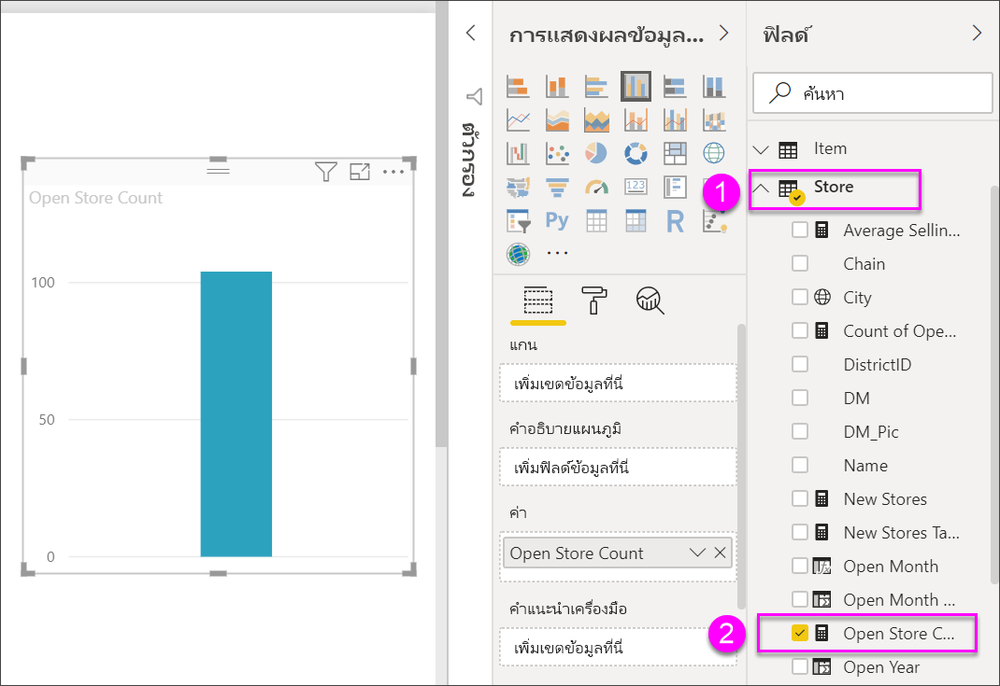
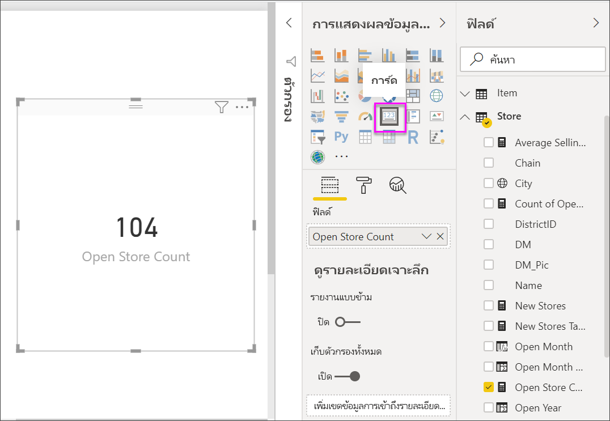
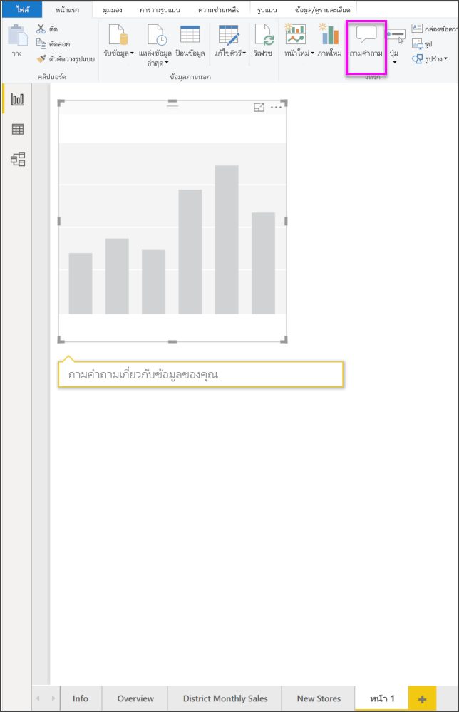
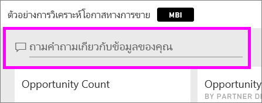
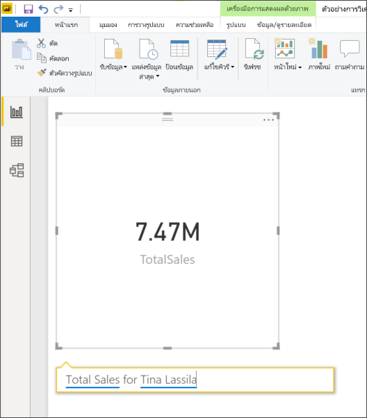
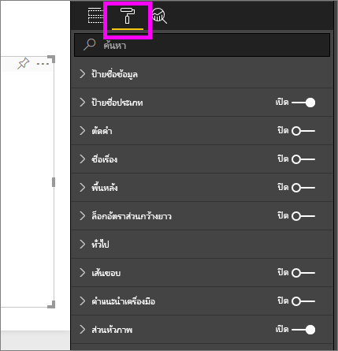
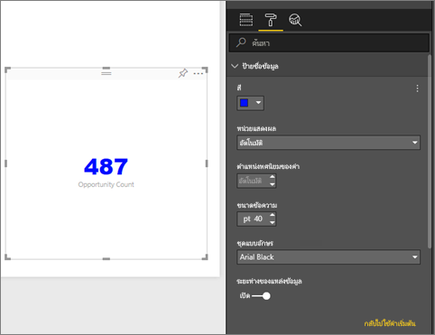
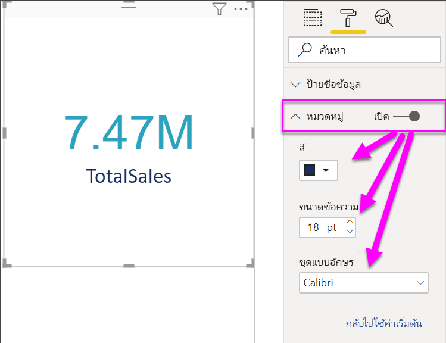
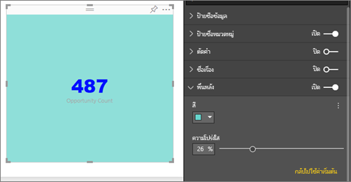

# การแสดงภาพการ์ด

[!INCLUDE [power-bi-visuals-desktop-banner](../includes/power-bi-visuals-desktop-banner.md)]

บางครั้งตัวเลขเพียงตัวเดียวก็เป็นสิ่งสำคัญที่สุดที่คุณต้องการติดตามในแดชบอร์ด Power BI หรือรายงานของคุณ เช่น ยอดขายรวม ส่วนแบ่งตลาดแบบปีต่อปี ตลาดแชร์ปีปี หรือโอกาสทั้งหมด แสดงภาพชนิดนี้จะเรียกว่า*การ์ด* เช่นเดียวกับการแสดงภาพดั้งเดิมของ Power BI แทบจะทุกชนิด คุณสามารถสร้างการ์ดขึ้นได้ โดยใช้ตัวแก้ไขรายงาน หรือการถามตอบ

## เงื่อนไขเบื้องต้น

บทช่วยสอนนี้ใช้ [ไฟล์ PBIX ตัวอย่าง การวิเคราะห์การขายปลีก](http://download.microsoft.com/download/9/6/D/96DDC2FF-2568-491D-AAFA-AFDD6F763AE3/Retail%20Analysis%20Sample%20PBIX.pbix)

1. จากด้านซ้ายบนของแถบเมนู เลือก **ไฟล์** \> **เปิด**
   
2. ค้นหาสำเนา**ไฟล์ PBIX ตัวอย่างการวิเคราะห์การค้าปลีก**

1. เปิด**ไฟล์ PBIX ตัวอย่างการวิเคราะห์การค้าปลีก**ในมุมมองรายงาน 

1. เลือก  หากต้องการเพิ่มหน้าใหม่

## ตัวเลือกที่ 1: สร้างการ์ดโดยใช้ตัวแก้ไขรายงาน

วิธีแรกในการจัดทำการ์ดคือใช้ Report Editor จาก Power BI Desktop

1. เริ่มต้นจากหน้ารายงานว่างแล้วเลือก**ร้านค้า** เปิดเขตข้อมูล\> **จำนวนร้านค้า**

    Power BI จะสร้างแผนภูมิคอลัมน์ที่มีตัวเลขเพียงตัวเลขเดียว

   

2. ในบานหน้าต่างการแสดงภาพ ให้เลือกไอคอนการ์ด

   

คุณจัดทำการ์ดพร้อม Report Editor เสร็จสิ้นแล้ว ต่อไปนี้เป็นตัวเลือกที่สองในการจัดทำการ์ดโดยใช้ช่องคำถาม ถามตอบ

## ตัวเลือกที่ 2: สร้างการ์ดจากกล่องคำถามการถามตอบ
กล่องคำถาม ถามตอบ เป็นอีกทางเลือกสำหรับคุณในการใช้ขณะจัดทำการ์ด ช่องคำถาม ถามตอบ มีอยู่ในมุมมองรายงานของ Power BI Desktop

1. เริ่มต้นบน หน้ารายงานเปล่า

1. ด้านบนของหน้าต่าง ให้เลือกไอคอน **ถามคำถาม** 

    Power BI จะจัดทำการ์ดและช่องสำหรับคำถามของคุณ 

   

2. เช่น พิมพ์ “Total Sales for Tina” ในช่องคำถาม

    กล่องคำถามจะคอยช่วยเหลือคุณ โดยจะมีคำแนะนำรวมทั้งการกล่าวซ้ำ และสุดท้ายก็จะแสดงจำนวนรวม  

   

   

คุณจัดทำการ์ดพร้อมช่องคำถาม ถามตอบ เสร็จสิ้นแล้ว ต่อไปนี้เป็นขั้นตอนในการกำหนดรูปแบบการ์ดของคุณตามความต้องการ

## จัดรูปแบบการ์ด
คุณมีตัวเลือกมากมายสำหรับการเปลี่ยนป้ายชื่อ, ข้อความ, สี และอีกมาก วิธีดีที่สุดในการเรียนรู้คือ สร้างการ์ด จากนั้นสำรวจบานหน้าต่างการจัดรูปแบบ ต่อไปนี้เป็นเพียงบางตัวเลือกของการจัดรูปแบบที่มี 

บานหน้าต่างการจัดรูปแบบจะพร้อมใช้งานขณะโต้ตอบกับการ์ดในรายงาน 

1. เริ่มต้นด้วยการเลือกไอคอนรูปลูกกลิ้งทาสีเพื่อเปิดบานหน้าต่างการจัดรูปแบบ 

    

2. ด้วยการ์ดที่เลือก ขยาย**ป้ายชื่อข้อมูล** และเปลี่ยนสี ขนาด และตระกูลแบบอักษร ถ้าคุณมีหลายพันร้านค้า คุณสามารถใช้**แสดงหน่วย**เพื่อแสดงจำนวนของร้านค้าเป็นหลักพัน และควบคุมตำแหน่งทศนิยมได้เช่นกัน ตัวอย่างเช่น แสดง 125.8K แทนที่จะเป็น 125,832.00

    

3.  ขยาย**ป้ายชื่อประเภท**และเปลี่ยนสีและขนาด

    

4. ขยาย**พื้นหลัง**และเลื่อนแถบเลื่อนเป็นเปิด  ตอนนี้คุณสามารถเปลี่ยนสีพื้นหลังและความโปร่งใส

    

5. ลองสำรวจตัวเลือกการจัดรูปแบบต่อไป จนกว่าการ์ดของคุณเป็นแบบที่คุณต้องการ 

## ข้อควรพิจารณาและการแก้ไขปัญหา
ถ้าคุณไม่สามารถเห็นกล่องคำถามทั้งหมด โปรดติดต่อผู้ดูแลระบบหรือผู้ดูแลผู้เช่าของคุณ    

## ขั้นตอนถัดไป
[แผนภูมิผสมใน Power BI](power-bi-visualization-combo-chart.md)

[ชนิดการแสดงภาพใน Power BI](power-bi-visualization-types-for-reports-and-q-and-a.md)
