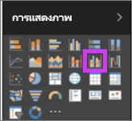
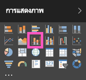
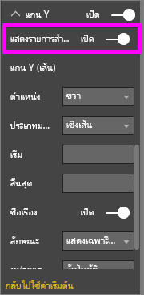

# แผนภูมิผสมใน Power BI
ใน Power BI แผนภูมิผสม เป็นการแสดงผลภาพที่รวมเอาแผนภูมิเส้นและแผนภูมิคอลัมน์เข้าด้วยกัน การรวมแผนภูมิทั้ง 2 ให้เป็นหนึ่งเดียว ช่วยให้คุณทำการเปรียบเทียบข้อมูลได้อย่างรวดเร็ว

แผนภูมิผสม สามารถมีแกน Y หนึ่งหรือสองแกนก็ได้

## เมื่อใดที่ต้องใช้แผนภูมิผสม
แผนภูมิผสม เป็นตัวเลือกที่ดี:

* เมื่อคุณมีแผนภูมิเส้นและแผนภูมิคอลัมน์ ที่ใช้แกน X เดียวกัน
* เพื่อเปรียบเทียบหลายหน่วยวัด ที่มีช่วงของค่าที่แตกต่างกัน
* เพื่อแสดงความสัมพันธ์ระหว่างสองหน่วยวัดในการแสดงผลหนึ่งภาพ
* เพื่อตรวจสอบว่า หน่วยวัดหนึ่งบรรลุตามเป้าหมายที่ถูกกำหนดโดยอีกหน่วยวัดหนึ่งหรือไม่
* เพื่อประหยัดพื้นที่ทำงาน

### ข้อกำหนดเบื้องต้น
แผนภูมิผสมมีให้ใช้งานในบริการ Power BI และ Power BI Desktop บทช่วยสอนนี้จะใช้บริการ Power BI เพื่อสร้างแผนภูมิผสม เพื่อที่จะทำตาม เปิดบริการ Power BI และเชื่อมต่อกับตัวอย่าง "การวิเคราะห์ด้านการขายปลีก" [ตามคำแนะนำด้านล่าง](#create))

## สร้างแผนภูมิผสมแบบพื้นฐานที่มีแกนเดียว
ดู Will สร้างแผนภูมิผสมโดยใช้ตัวอย่างการวิเคราะห์ด้านการขายปลีก

<iframe width="560" height="315" src="https://www.youtube.com/embed/lnv66cTZ5ho?list=PL1N57mwBHtN0JFoKSR0n-tBkUJHeMP2cP" frameborder="0" allowfullscreen></iframe>  

 เพื่อสร้างแผนภูมิผสมของคุณเอง ลงชื่อเข้าใช้บริการ Power BI และเลือก **รับข้อมูล \> ตัวอย่าง \> ตัวอย่างการวิเคราะห์ด้านการขายปลีก > เชื่อมต่อ > ไปยังแดชบอร์ด**

1. จากแดชบอร์ด "ตัวอย่างการวิเคราะห์ด้านการขายปลีก" เลือกไทล์**จำนวนร้านค้าทั้งหมด** เพื่อเปิดรายงาน "ตัวอย่างการวิเคราะห์ด้านการขายปลีก"
2. เลือก**แก้ไขรายงาน** เพื่อเปิดรายงานในมุมมองการแก้ไข
3. [เพิ่มหน้ารายงานใหม่](../power-bi-report-add-page.md)
4. สร้างแผนภูมิคอลัมน์ ที่แสดงยอดขายและอัตรากำไรขั้นต้นของปีนี้ แยกตามเดือน

    a.  จากบานหน้าต่างเขตข้อมูล เลือก**ยอดขาย** \> **ยอดขายปีนี้** > **ค่า**

    b.  ลาก**ยอดขาย** \> **กำไรขั้นต้นปีนี้** ไปยัง**ค่า**

    c.  เลือก**เวลา** \> **เดือนทางบัญชี**เพื่อเพิ่มไปยัง**แกน**

    
5. เลือกจุดไข่ปลา (...) ในมุมบนขวาของการแสดงภาพ และเลือก**เรียงลำดับตาม เดือนทางบัญชี** คุณอาจต้องเลือกสองครั้งเพื่อสลับระหว่าง เรียงลำดับจากน้อยไปมาก หรือมากไปหาน้อย

6. แปลงแผนภูมิคอลัมน์ให้เป็นแผนภูมิผสม เมื่อยังเลือกแผนภูมิคอลัมน์นี้อยู่ ในบานหน้าต่าง**แสดงภาพ** เลือก**แผนภูมิเส้นและแผนภูมิกลุ่มคอลัมน์**

    
7. จากบานหน้าต่าง**เขตข้อมูล** ลาก**ยอดขาย** \> **ยอดขายปีที่แล้ว** ไปยังบักเก็ต**ค่าเส้นตรง**

   

   แผนภูมิผสมของคุณควรมีลักษณะดังนี้:

   

## สร้างแผนภูมิผสมที่มีสองแกน
ในงานที่จะทำต่อนี้ เราจะเปรียบเทียบอัตรากำไรขั้นต้นกับยอดขาย

1. สร้างแผนภูมิเส้นขึ้นใหม่ที่แสดงค่า **%กำไรขั้นต้นปีที่แล้ว**ตาม**เดือน**  ในเดือนมกราคม GM% อยู่ที่ 35% ไปจุดสุงสุดที่ 45% ในเดือนเมษายน ตกลงในเดือนกรกฎาคม และกลับไปสูงสุดอีกครั้งในเดือนสิงหาคม เราจะเห็นรูปแบบที่คล้ายกัน ในยอดขายปีที่แล้วและของปีนี้หรือไม่?

   
2. เพิ่ม**ยอดขายปีนี้ > ค่า** และ**ยอดขายปีที่แล้ว**ลงในแผนภูมิเส้น ขนาดของ **%อัตรากำไรขั้นต้นปีที่แล้ว** น้อยกว่าขนาดของ**ยอดขาย** ซึ่งทำให้ยากต่อการเปรียบเทียบ      

   
3. เพื่อให้ง่ายต่อการอ่านและตีความวิชวล แปลงแผนภูมิเส้นให้เป็น แผนภูมิเส้นและแผนภูมิคอลัมน์แบบเรียงซ้อน

   
4. ลาก **%อัตรากำไรปีที่แล้ว**จาก**ค่าคอลัมน์**ลงใน**ค่าเส้นตรง** Power BI จะสร้างแกนสองแกน ซึ่งช่วยให้ชุดข้อมูลมีการปรับขนาดต่างกัน หน่วยวัดด้านซ้ายเป็นยอดขายในหน่วยดอลลาร์ ส่วนด้านขวาวัดเป็นเปอร์เซ็นต์

       

## เพิ่มหัวข้อให้กับแกน
1. เลือกไอคอนแปรงลูกกลิ้ง  เพื่อเปิดบานหน้าต่างจัดรูปแบบ
2. เลือกลูกศรลงเพื่อขยายตัวเลือกของ **แกน Y**
3. สำหรับ **แกน Y (คอลัมน์)** ตั้งค่า**ตำแหน่ง**ไปเป็น**ซ้าย**, ตั้งค่า**หัวข้อ**เป็น**เปิด**, **สไตล์**เป็น**แสดงเฉพาะหัวข้อ** และ**แสดง**ในหน่วย**ล้าน**

   
4. ภายใต้ **แกน Y (คอลัมน์)** เลื่อนลงและให้แน่ใจว่า**แสดงรายการสำรอง** ถูกตั้งค่าเป็น**เปิด** ซึ่งจะแสดงตัวเลือกสำหรับการจัดรูปแบบ ส่วนของแผนภูมิเส้นภายในแผนภูมิผสม

   
5. สำหรับ **แกน Y (เส้น)** ปล่อยให้**ตำแหน่ง**ยังคงเป็น**ขวา** เลื่อน**หัวข้อ**ให้เป็น**เปิด** และตั้งค่า**สไตล์**เป็น**แสดงเฉพาะหัวข้อ**

   แผนภูมิผสมของคุณขณะนี้ แสดงแกนทั้งสองแกน และทั้งคู่ต่างก็มีหัวข้อ

   

6. (ไม่บังคับ) ปรับเปลี่ยนแบบอักษรข้อความ ขนาด และสี และตั้งค่าตัวเลือกการจัดรูปแบบอื่น ๆ เพื่อปรับปรุงการแสดงผลและทำให้แผนภูมิอ่านง่ายขึ้น

จากตรงนี้ คุณอาจต้องการ:

* [เพิ่มแผนภูมิผสมเป็นไทล์แดชบอร์ด](../service-dashboard-tiles.md)
* [บันทึกรายงาน](../service-report-save.md)
* [ทำให้รายงานสามารถเข้าถึงได้มากขึ้นสำหรับผู้ทุพพลภาพ](../desktop-accessibility.md)

## การไฮไลต์แบบเชื่อมโยง และการกรองข้าม

การไฮไลต์คอลัมน์หรือเส้นในแผนภูมิผสม เป็นการไฮไลต์แบบเชื่อมโยงและกรองข้ามไปยังการแสดงภาพอื่น ๆ บนหน้ารายงาน และในทางกลับกัน การยกเลิกไฮไลต์จะเป็นการยกเลิกการกระทำดังกล่าว ใช้[การปฏิสัมพันธ์กับภาพ](../service-reports-visual-interactions.md) เพื่อเปลี่ยนคุณลักษณะเริ่มต้นนี้

## ขั้นตอนถัดไป

[ภาพรวมของการแสดงภาพในรายงาน Power BI](power-bi-report-visualizations.md)

[ชนิดการแสดงภาพใน Power BI](power-bi-visualization-types-for-reports-and-q-and-a.md)

[Power BI - แนวคิดพื้นฐาน](../service-basic-concepts.md)

มีคำถามเพิ่มเติมหรือไม่ [ลองไปที่ชุมชน Power BI](http://community.powerbi.com/)
