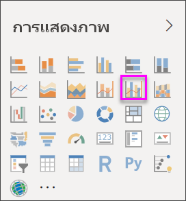
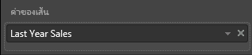
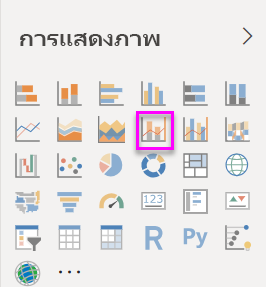
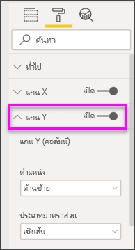
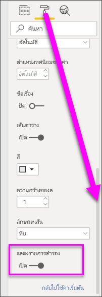

# สร้างและใช้แผนภูมิผสมใน Power BI

[!INCLUDE[consumer-appliesto-nyyn](../includes/consumer-appliesto-nyyn.md)]

[!INCLUDE [power-bi-visuals-desktop-banner](../includes/power-bi-visuals-desktop-banner.md)]

ใน Power BI แผนภูมิผสม เป็นการแสดงผลภาพที่รวมเอาแผนภูมิเส้นและแผนภูมิคอลัมน์เข้าด้วยกัน การรวมแผนภูมิทั้ง 2 ให้เป็นหนึ่งเดียว ช่วยให้คุณทำการเปรียบเทียบข้อมูลได้อย่างรวดเร็ว

แผนภูมิผสม สามารถมีแกน Y หนึ่งหรือสองแกนก็ได้

## เมื่อใดที่ต้องใช้แผนภูมิผสม
แผนภูมิผสม เป็นตัวเลือกที่ดี:

* เมื่อคุณมีแผนภูมิเส้นและแผนภูมิคอลัมน์ ที่ใช้แกน X เดียวกัน
* เพื่อเปรียบเทียบหลายหน่วยวัด ที่มีช่วงของค่าที่แตกต่างกัน
* เพื่อแสดงความสัมพันธ์ระหว่างสองหน่วยวัดในการแสดงผลหนึ่งภาพ
* เพื่อตรวจสอบว่า หน่วยวัดหนึ่งบรรลุตามเป้าหมายที่ถูกกำหนดโดยอีกหน่วยวัดหนึ่งหรือไม่
* เพื่อประหยัดพื้นที่ทำงาน

> [!NOTE]
> การแชร์รายงานของคุณกับผู้ร่วมงาน Power BI กำหนดให้คุณต้องมีสิทธิ์การใช้งาน Power BI Pro แต่ละรายการ หรือรายงานจะถูกบันทึกในความจุแบบพรีเมียม

### ข้อกำหนดเบื้องต้น
บทช่วยสอนนี้ใช้[ไฟล์ PBIX ตัวอย่างการวิเคราะห์การค้าปลีก](https://download.microsoft.com/download/9/6/D/96DDC2FF-2568-491D-AAFA-AFDD6F763AE3/Retail%20Analysis%20Sample%20PBIX.pbix)

1. จากด้านบนซ้ายของแถบเมนู เลือก **ไฟล์** > **เปิด**
   
2. ค้นหาสำเนา**ไฟล์ PBIX ตัวอย่างการวิเคราะห์การค้าปลีก**

1. เปิด**ไฟล์ PBIX ตัวอย่างการวิเคราะห์การค้าปลีก**ในมุมมองรายงาน 

1. เลือก  หากต้องการเพิ่มหน้าใหม่

## สร้างแผนภูมิผสมแบบพื้นฐานที่มีแกนเดียว
ดู Will สร้างแผนภูมิผสมโดยใช้ตัวอย่างการวิเคราะห์ด้านการขายปลีก
   > [!NOTE]
   > วิดีโอนี้ใช้ Power BI Desktop เวอร์ชันเก่า
   > 
   > 
<iframe width="560" height="315" src="https://www.youtube.com/embed/lnv66cTZ5ho?list=PL1N57mwBHtN0JFoKSR0n-tBkUJHeMP2cP" frameborder="0" allowfullscreen></iframe>  

1. เริ่มจากหน้ารายงานเปล่าและจัดทำแผนภูมิแท่งที่แสดงยอดขายต่อปีและกำไรเบื้องต้นต่อเดือน

    a.  จากบานหน้าต่างเขตข้อมูล เลือก**ยอดขาย**\>**ยอดขายปีนี้** > **ค่า**

    b.  ลาก **ยอดขาย** \> **กำไรขั้นต้นปีนี้** ไปยัง **ค่า**

    c. เลือก **เวลา** \> **FiscalMonth** เพื่อเพิ่มไปยัง **แกน**

    
5. เลือก **ตัวเลือกเพิ่มเติม** (...) ที่มุมบนขวาของการแสดงภาพและเลือก **เรียงลำดับตาม > FiscalMonth** เมื่อต้องเปลี่ยนลำดับการจัดเรียง เลือกจุดไข่ปลาอีกครั้ง แล้วคลิก**เรียงลำดับจากน้อยไปมาก**หรือ**เรียงลำดับจากมากไปน้อย** ในตัวอย่างนี้เราจะใช้ **เรียงลำดับจากน้อยไปมาก**

6. แปลงแผนภูมิคอลัมน์ให้เป็นแผนภูมิผสม มีแผนภูมิผสมสองแผนภูมิที่สามารถใช้งานได้: **เส้นกับคอลัมน์แบบเรียงซ้อน**และ**เส้นกับแผนภูมิคอลัมน์กลุ่ม** เมื่อยังเลือกแผนภูมิคอลัมน์นี้อยู่ ในบานหน้าต่าง**แสดงภาพ** เลือก**แผนภูมิเส้นและแผนภูมิกลุ่มคอลัมน์**

    
7. จากบานหน้าต่าง**เขตข้อมูล** ลาก **ยอดขาย** \> **ยอดขายปีล่าสุด** ไปยังบักเก็ต**ค่าเส้นตรง**

   

   แผนภูมิผสมของคุณควรมีลักษณะดังนี้:

   

## สร้างแผนภูมิผสมที่มีสองแกน
ในงานที่จะทำต่อนี้ เราจะเปรียบเทียบอัตรากำไรขั้นต้นกับยอดขาย

1. จัดทำแผนภูมิเส้นใหม่ที่แสดงข้อมูล **ยอดขายเบื้องต้นปีก่อนหน้าเป็น %** ตาม **เดือนในรอบปีบัญชี** เลือกจุดไข่ปลาการเรียงลำดับตาม**เดือน** และ **จากน้อยไปหามาก**  
ในเดือนมกราคม %กำไรขั้นต้น อยู่ที่ 35% ไปจุดสุงสุดที่ 45% ในเดือนเมษายน ตกลงในเดือนกรกฎาคม และกลับไปสูงสุดอีกครั้งในเดือนสิงหาคม เราจะเห็นรูปแบบที่คล้ายกัน ในยอดขายปีที่แล้วและของปีนี้หรือไม่?

   
2. เพิ่ม**ยอดขายปีนี้ > ค่า** และ**ยอดขายปีที่แล้ว**ลงในแผนภูมิเส้น ขนาดของ **%อัตรากำไรขั้นต้นปีที่แล้ว** น้อยกว่าขนาดของ**ยอดขาย** ซึ่งทำให้ยากต่อการเปรียบเทียบ      

   
3. เพื่อให้ง่ายต่อการอ่านและตีความวิชวล แปลงแผนภูมิเส้นให้เป็น แผนภูมิเส้นและแผนภูมิคอลัมน์แบบเรียงซ้อน

   

4. ลาก **%อัตรากำไรปีที่แล้ว**จาก**ค่าคอลัมน์**ลงใน**ค่าเส้นตรง** Power BI จะสร้างแกนสองแกน ซึ่งช่วยให้ชุดข้อมูลมีการปรับขนาดต่างกัน หน่วยวัดด้านซ้ายเป็นยอดขายในหน่วยดอลลาร์ ส่วนด้านขวาวัดเป็นเปอร์เซ็นต์ และเราเห็นคำตอบคำถามของเรา ใช่ เราดูแบบที่คล้ายกัน

       

## เพิ่มหัวข้อให้กับแกน
1. เลือกไอคอนลูกกลิ้งระบายสี  ในการเปิดพื้นที่การจัดรูปแบบ
1. เลือกลูกศรลงเพื่อขยายตัวเลือกของ **แกน Y**
1. สำหรับ **แกน Y (คอลัมน์)** ตั้งค่า**ตำแหน่ง**ไปเป็น**ซ้าย**, ตั้งค่า**หัวข้อ**เป็น**เปิด**, **สไตล์**เป็น**แสดงเฉพาะหัวข้อ** และ**แสดง**ในหน่วย**ล้าน**

   
4. จากr **แกน Y (คอลัมน์)** ให้เลื่อนลงจนเห็น **แสดงรายการสำรอง** เนื่องจากมีตัวเลือกมากมายสำหรับแกน Y คุณอาจต้องใช้แถบเลื่อนทั้งสองชุด หัวข้อ แสดงรายการสำรองจะแสดงตัวเลือกสำหรับการจัดรูปแบบ ส่วนของแผนภูมิเส้นภายในแผนภูมิผสม

   
5. สำหรับ **แกน Y (เส้น)** ปล่อยให้**ตำแหน่ง**ยังคงเป็น**ขวา** เลื่อน**หัวข้อ**ให้เป็น**เปิด** และตั้งค่า**สไตล์**เป็น**แสดงเฉพาะหัวข้อ**

   แผนภูมิผสมของคุณขณะนี้ แสดงแกนทั้งสองแกน และทั้งคู่ต่างก็มีหัวข้อ

   

6. (ไม่บังคับ) ปรับเปลี่ยนแบบอักษรข้อความ ขนาด และสี และตั้งค่าตัวเลือกการจัดรูปแบบอื่น ๆ เพื่อปรับปรุงการแสดงผลและทำให้แผนภูมิอ่านง่ายขึ้น

จากตรงนี้ คุณอาจต้องการ:

* [เพิ่มแผนภูมิผสมเป็นไทล์แดชบอร์ด](../create-reports/service-dashboard-tiles.md)
* [บันทึกรายงาน](../create-reports/service-report-save.md)
* [ทำให้รายงานสามารถเข้าถึงได้มากขึ้นสำหรับผู้ทุพพลภาพ](../desktop-accessibility.md)

## การไฮไลต์แบบเชื่อมโยง และการกรองข้าม

การไฮไลต์คอลัมน์หรือเส้นในแผนภูมิผสม เป็นการไฮไลต์แบบเชื่อมโยงและกรองข้ามไปยังการแสดงภาพอื่น ๆ บนหน้ารายงาน และในทางกลับกัน การยกเลิกไฮไลต์จะเป็นการยกเลิกการกระทำดังกล่าว ใช้[การปฏิสัมพันธ์กับภาพ](../create-reports/service-reports-visual-interactions.md) เพื่อเปลี่ยนคุณลักษณะเริ่มต้นนี้

## ขั้นตอนถัดไป

[แผนภูมิโดนัทใน Power BI](power-bi-visualization-doughnut-charts.md)

[ชนิดการแสดงภาพใน Power BI](power-bi-visualization-types-for-reports-and-q-and-a.md)

