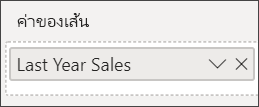

# แผนภูมิผสมใน Power BI

ใน Power BI แผนภูมิผสม เป็นการแสดงผลภาพที่รวมเอาแผนภูมิเส้นและแผนภูมิคอลัมน์เข้าด้วยกัน การรวมแผนภูมิทั้งสองให้เป็นหนึ่งเดียว ช่วยให้คุณทำการเปรียบเทียบข้อมูลได้อย่างรวดเร็ว

แผนภูมิผสม สามารถมีแกน Y หนึ่งหรือสองแกนก็ได้

## เมื่อใดที่ต้องใช้แผนภูมิผสม

แผนภูมิผสม เป็นตัวเลือกที่ดี:

* เมื่อคุณมีแผนภูมิเส้นและแผนภูมิคอลัมน์ ที่ใช้แกน X เดียวกัน

* เพื่อเปรียบเทียบการวัดหลายรายการกับช่วงค่าที่แตกต่างกัน

* เพื่อแสดงความสัมพันธ์ระหว่างหน่วยวัดสองหน่วยในการแสดงผลด้วยภาพหนึ่งภาพ

* เพื่อตรวจสอบว่า หน่วยวัดหนึ่งบรรลุตามเป้าหมายที่ถูกกำหนดโดยอีกหน่วยวัดหนึ่งหรือไม่

* เพื่อประหยัดพื้นที่ทำงาน

## ข้อกำหนดเบื้องต้น

แผนภูมิผสมมีให้ใช้งานในบริการ Power BI และ Power BI Desktop บทช่วยสอนนี้จะใช้บริการ Power BI เพื่อสร้างแผนภูมิผสม ตรวจสอบให้แน่ใจว่าคุณมีข้อมูลประจำตัวผู้ใช้ลงชื่อเข้าใช้ Power BI

ดู Will สร้างแผนภูมิผสมโดยใช้ตัวอย่างการวิเคราะห์ด้านการขายปลีก

<iframe width="560" height="315" src="https://www.youtube.com/embed/lnv66cTZ5ho?list=PL1N57mwBHtN0JFoKSR0n-tBkUJHeMP2cP" frameborder="0" allowfullscreen></iframe>  

## สร้างแผนภูมิผสมแบบพื้นฐานที่มีแกนเดียว

เพื่อที่จะทำตาม เปิดบริการ Power BI และเชื่อมต่อกับตัวอย่าง **การวิเคราะห์ด้านการขายปลีก** เพื่อสร้างแผนภูมิผสมของคุณเอง ลงชื่อเข้าใช้บริการ Power BI และเลือก **รับข้อมูล**  > **ตัวอย่าง** > **ตัวอย่างการวิเคราะห์ด้านการขายปลีก**  > **เชื่อมต่อ** แดชบอร์ด**ตัวอย่างการวิเคราะห์การค้าปลีก**ปรากฏขึ้น

1. จากแดชบอร์ด "ตัวอย่างการวิเคราะห์ด้านการขายปลีก" เลือกไทล์**จำนวนร้านค้าทั้งหมด** เพื่อเปิดรายงาน **ภาพรวมร้านขายปลีก**

1. เลือก**แก้ไขรายงาน** เพื่อเปิดรายงานในมุมมองการแก้ไข

1. ที่ด้านล่างของหน้า เลือก **+** เมื่อต้องเพิ่มหน้ารายงานใหม่

1. สร้างแผนภูมิคอลัมน์ ที่แสดงยอดขายและอัตรากำไรขั้นต้นของปีนี้ แยกตามเดือน

    1. จากบานหน้าต่างเขตข้อมูล เลือก**ยอดขาย** \> **ยอดขายปีนี้** > **ค่า**

    1. ลาก**ยอดขาย** \> **กำไรขั้นต้นปีนี้** ไปยัง**ค่า**

    1. เลือก**เวลา** \> **เดือนทางบัญชี**เพื่อเพิ่มไปยัง**แกน**

        

1. เลือกจุดไข่ปลาในมุมบนขวาของการแสดงภาพ และเลือก**เรียงลำดับตาม > FiscalMonth** เมื่อต้องเปลี่ยนลำดับการจัดเรียง เลือกจุดไข่ปลาอีกครั้ง แล้วคลิก**เรียงลำดับจากน้อยไปมาก**หรือ**เรียงลำดับจากมากไปน้อย**

1. แปลงแผนภูมิคอลัมน์ให้เป็นแผนภูมิผสม มีแผนภูมิผสมสองแผนภูมิที่สามารถใช้งานได้: **เส้นกับคอลัมน์แบบเรียงซ้อน**และ**เส้นกับแผนภูมิคอลัมน์กลุ่ม** เมื่อยังเลือกแผนภูมิคอลัมน์นี้อยู่ ในบานหน้าต่าง**แสดงภาพ** เลือก**แผนภูมิเส้นและแผนภูมิกลุ่มคอลัมน์**

    

1. จากบานหน้าต่าง**เขตข้อมูล** ลาก**ยอดขาย**  >  **ยอดขายปีที่แล้ว** ไปยัง**ค่าเส้นตรง**ด้วย

    

    แผนภูมิผสมของคุณควรมีลักษณะดังนี้:

    

## สร้างแผนภูมิผสมที่มีสองแกน

ในงานที่จะทำต่อนี้ เราจะเปรียบเทียบอัตรากำไรขั้นต้นกับยอดขาย

1. สร้างแผนภูมิเส้นขึ้นใหม่ที่แสดงค่า **%กำไรขั้นต้นปีที่แล้ว**ตาม**เดือน** เลือกจุดไข่ปลาการเรียงลำดับตาม**เดือน** และ **จากน้อยไปหามาก**

    

     ในเดือนมกราคม %กำไรขั้นต้น อยู่ที่ 35% ไปจุดสุงสุดที่ 45% ในเดือนเมษายน ตกลงในเดือนกรกฎาคม และกลับไปสูงสุดอีกครั้งในเดือนสิงหาคม เราจะเห็นรูปแบบที่คล้ายกัน ในยอดขายปีที่แล้วและของปีนี้หรือไม่?

1. เพิ่ม**ยอดขายปีนี้** > **ค่า** และ**ยอดขายปีที่แล้ว**ลงในแผนภูมิเส้น ขนาดของ **%อัตรากำไรขั้นต้นปีที่แล้ว** น้อยกว่าขนาดของ**ยอดขาย** เป็นการยากที่จะเปรียบเทียบ

    

1. เพื่อให้ง่ายต่อการอ่านและตีความวิชวล แปลงแผนภูมิเส้นให้เป็น แผนภูมิเส้นและแผนภูมิคอลัมน์แบบเรียงซ้อน

    

1. ลาก **%อัตรากำไรปีที่แล้ว**จาก**ค่าคอลัมน์**ลงใน**ค่าเส้นตรง** 

    

    Power BI สร้างสองแกนที่อนุญาตให้บริการ ดังนั้นให้ปรับมาตราส่วนของชุดข้อมูลแตกต่างกัน ยอดขายหน่วยวัดด้านซ้ายเป็นสกุลเงินดอลลาร์และด้านขวาวัดเป็นเปอร์เซ็นต์ และเราเห็นคำตอบที่มีต่อคำถามของเรา: ใช่ เราเห็นรูปแบบที่คล้ายกัน

## เพิ่มหัวข้อให้กับแกน

1. เลือกไอคอนลูกกลิ้งระบายสี  ในการเปิดพื้นที่การจัดรูปแบบ

1. เลือกลูกศรลงเพื่อขยายตัวเลือกของ **แกน Y**

1. สำหรับ**แกน Y (คอลัมน์)** เลือกตัวเลือกดังนี้:

    | การตั้งค่า | ค่า |
    | ------- | ----- |
    | ตำแหน่ง | เลือก**ซ้าย** |
    | หน่วยแสดงผล | เลือก**หน่วยล้าน** |
    | ชื่อเรื่อง | ย้ายแถบเลื่อนไปยัง**เปิด** |
    | ลักษณะ | เลือก**แสดงเฉพาะชื่อเรื่อง**. |
    | แสดงรายการสำรอง | ย้ายแถบเลื่อนไปยัง**เปิด**  ซึ่งจะแสดงตัวเลือกสำหรับการจัดรูปแบบ ส่วนของแผนภูมิเส้นภายในแผนภูมิผสม |

1. สำหรับ**แกน Y (เส้น)** เลือกตัวเลือกดังนี้:

    | การตั้งค่า | ค่า |
    | ------- | ----- |
    | ตำแหน่ง | เลือก**ขวา** |
    | ชื่อเรื่อง | ย้ายแถบเลื่อนไปยัง**เปิด** |
    | ลักษณะ | เลือก**แสดงเฉพาะชื่อเรื่อง**. |

    แผนภูมิผสมของคุณตอนนี้แสดงแกนทั้งสองแกนด้วยชื่อ

    

1. (ไม่บังคับ) เปลี่ยนแบบอักษรข้อความ ขนาด และสี และตั้งค่าตัวเลือกการจัดรูปแบบอื่น ๆ เพื่อปรับปรุงการแสดงผลและทำให้แผนภูมิอ่านง่ายขึ้น

จากตรงนี้ คุณอาจต้องการ:

* [เพิ่มแผนภูมิผสมเป็นไทล์แดชบอร์ด](../service-dashboard-tiles.md)

* [บันทึกรายงาน](../service-report-save.md)

* [ทำให้รายงานสามารถเข้าถึงได้มากขึ้นสำหรับผู้ทุพพลภาพ](../desktop-accessibility.md)

## การไฮไลต์แบบเชื่อมโยง และการกรองข้าม

การไฮไลต์คอลัมน์หรือเส้นในแผนภูมิผสม เป็นการไฮไลต์แบบเชื่อมโยงและกรองข้ามไปยังการแสดงภาพอื่น ๆ บนหน้ารายงาน ใช้[การปฏิสัมพันธ์กับภาพ](../service-reports-visual-interactions.md) เพื่อเปลี่ยนคุณลักษณะเริ่มต้นนี้

## ขั้นตอนถัดไป

[แผนภูมิโดนัทใน Power BI](power-bi-visualization-doughnut-charts.md)

[ชนิดการแสดงภาพใน Power BI](power-bi-visualization-types-for-reports-and-q-and-a.md)