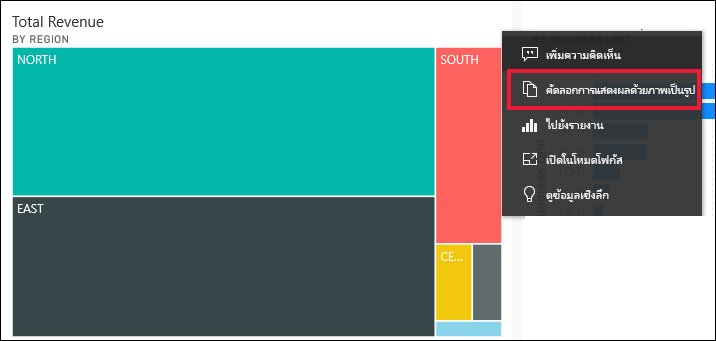
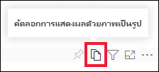
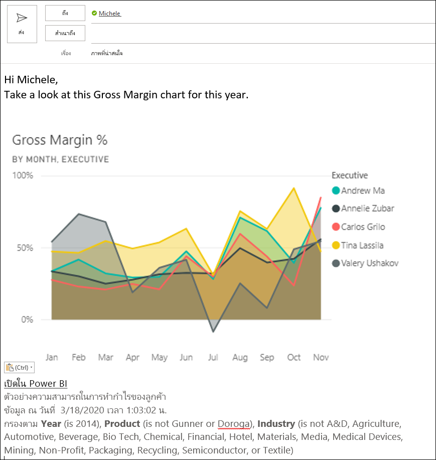
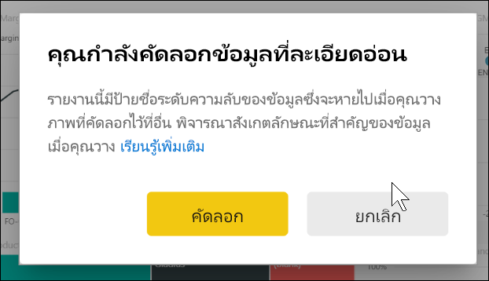
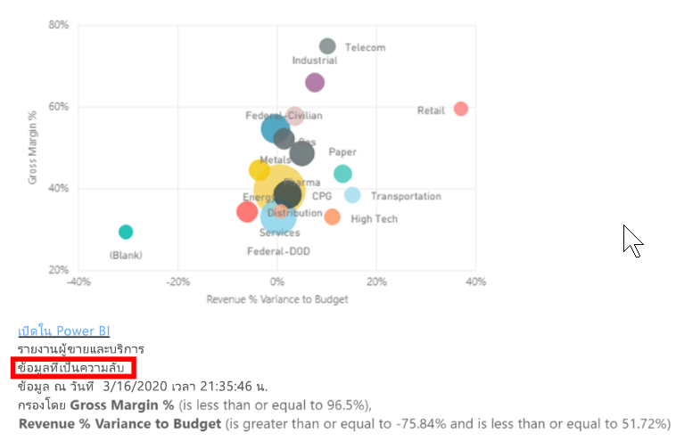
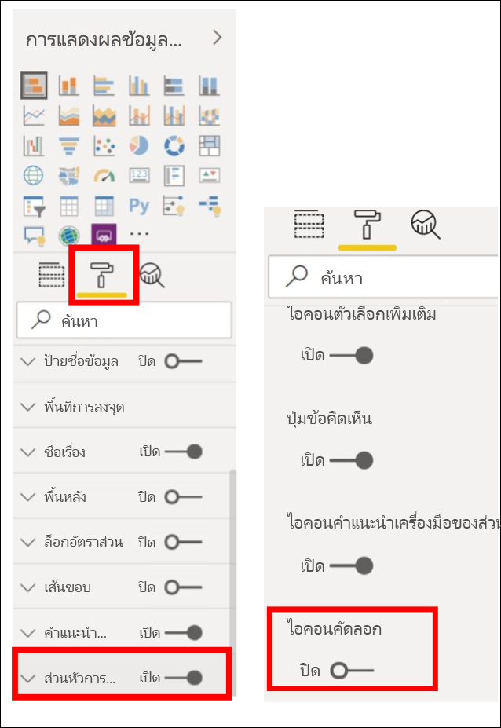
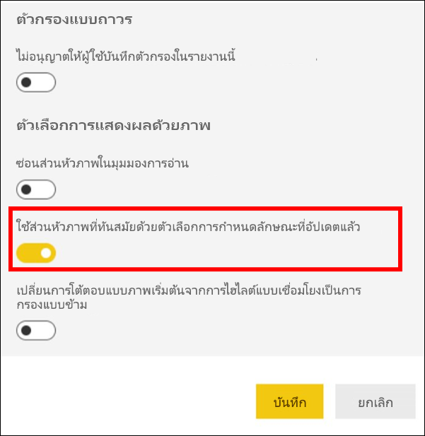
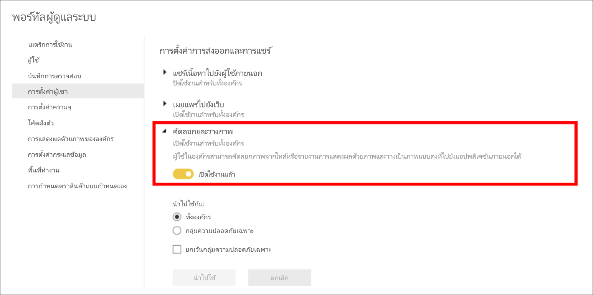

# คัดลอก และวางการแสดงภาพของรายงาน

[!INCLUDE[consumer-appliesto-yyyn](../includes/consumer-appliesto-yyyn.md)]

บทความนี้ครอบคลุมวิธีในการคัดลอกและวางวิชวลที่แตกต่างกันสองวิธี 
* คัดลอกวิชวลในรายงานและวางลงในหน้ารายงานอื่น (จำเป็นต้องมีสิทธิในการแก้ไขสำหรับรายงาน)

* คัดลอกรูปภาพของวิชวลจาก Power BI ไปยังคลิปบอร์ดของคุณ และวางลงในแอปพลิเคชันอื่น ๆ

## คัดลอกและวางภายในรายงานเดียวกัน
คุณสามารถคัดลอกวิชวลในรายงาน Power BI จากหน้าหนึ่งในรายงานไปยังหน้าเดียวกันหรือหน้าอื่นในรายงานเดียวกัน 

การคัดลอก และการวางการแสดงภาพจะต้องมีสิทธิ์ในการแก้ไขสำหรับรายงาน ในบริการของ Power BI หมายถึงการเปิดรายงานใน [มุมมองการแก้ไข](../consumer/end-user-reading-view.md) 

การแสดงผลข้อมูลด้วยภาพบน*แดชบอร์ด*ที่ไม่สามารถคัดลอกและวางลงในรายงาน Power BI หรือแดชบอร์ดอื่น ๆ ได้

1. เปิดรายงานที่มีการแสดงภาพอย่างน้อยหนึ่งรายการ  

2. เลือกการแสดงภาพ และใช้**Ctrl + C** เมื่อต้องการคัดลอก และ**Ctrl + V** เมื่อต้องการวาง      

   

## คัดลอกวิชวลเป็นรูปภาพไปยังคลิปบอร์ดของคุณ

คุณเคยต้องการแชร์รูปภาพจากรายงานหรือแดชบอร์ด Power BI หรือไม่ ในตอนนี้ คุณสามารถคัดลอกวิชวลและวางลงในแอปพลิเคชันอื่น ๆ ที่สนับสนุนการวางได้แล้ว 

เมื่อคุณคัดลอกรูปภาพของวิชวลแบบสแตติก คุณจะได้รับสำเนาของวิชวลพร้อมกับเมตาดาต้า รวมถึง:
* ลิงก์กลับไปที่รายงานหรือแดชบอร์ด Power BI
* ชื่อเรื่องของรายงานหรือแดชบอร์ด
* สังเกตว่ารูปมีข้อมูลที่เป็นความลับหรือไม่
* การประทับเวลาที่อัปเดตครั้งล่าสุด
* ตัวกรองที่นำไปใช้กับวิชวล

### คัดลอกจากไทล์แดชบอร์ด

1. นำทางไปยังแดชบอร์ดที่คุณต้องการคัดลอก

2. จากมุมบนขวาของวิชวล ให้เลือก **ตัวเลือกเพิ่มเติม (...)** และเลือก **คัดลอกวิชวลเป็นรูปภาพ** 

    

3. เมื่อกล่องโต้ตอบ **วิชวลของคุณพร้อมที่จะคัดลอก** ปรากฏขึ้น ให้เลือก **คัดลอกไปยังคลิปบอร์ด**

    

4. เมื่อวิชวลของคุณพร้อมแล้ว ให้วางลงในแอปพลิเคชันอื่นโดยใช้ **Ctrl + V** หรือคลิกขวา > วาง ในภาพหน้าจอด้านล่าง เราได้วางวิชวลลงใน Microsoft Word 

    

### คัดลอกจากวิชวลรายงาน 

1. นำทางไปยังรายงานที่คุณต้องการคัดลอก

2. จากมุมบนขวาของวิชวล ให้เลือกไอคอนสำหรับ **คัดลอกวิชวลเป็นรูปภาพ** 

    

3. เมื่อกล่องโต้ตอบ **วิชวลของคุณพร้อมที่จะคัดลอก** ปรากฏขึ้น ให้เลือก **คัดลอกไปยังคลิปบอร์ด**

    

4. เมื่อวิชวลของคุณพร้อมแล้ว ให้วางลงในแอปพลิเคชันอื่นโดยใช้ **Ctrl + V** หรือคลิกขวา > วาง ในภาพหน้าจอด้านล่าง เราได้วางวิชวลลงในอีเมล

    

5. ถ้ามีการใช้ป้ายชื่อระดับความลับของข้อมูลกับรายงาน คุณจะได้รับคำเตือนเมื่อคุณเลือกไอคอนคัดลอก  

    

    และป้ายชื่อระดับความลับจะถูกเพิ่มลงในเมตาดาต้าด้านล่างของวิชวลที่วาง 

    

### จัดการการใช้ คัดลอกวิชวลเป็นรูปภาพ
ถ้าคุณเป็นเจ้าของเนื้อหาหรือเป็นผู้ดูแลระบบของผู้เช่า คุณสามารถควบคุมว่าจะสามารถคัดลอกวิชวลเป็นรูปภาพจากรายงานหรือแดชบอร์ดได้หรือไม่

#### ปิดใช้งาน คัดลอกเป็นรูปภาพ สำหรับวิชวลที่ระบุ
ถ้าคุณไม่ต้องการให้ผู้ใช้สามารถคัดลอกวิชวลเฉพาะได้ คุณสามารถลบไอคอนคัดลอกออกจากวิชวล
1. เลือกไอคอนแปรงลูกกลิ้งเพื่อเปิดบานหน้าต่างจัดรูปแบบ 

1. เปิดการ์ด **การจัดรูปแบบวิชวล**
1. เลื่อนลงไปที่ **ส่วนหัวของวิชวล** ขยายการ์ด และปิด **ไอคอนคัดลอก**

    

1. ถ้าคุณไม่พบการตั้งค่า **ส่วนหัวของวิชวล** ให้เปิดใช้งานตัวเลือกส่วนหัวของวิชวลที่ทันสมัยภายใต้ **การตั้งค่ารายงาน** 

    

1. บันทึกการเปลี่ยนแปลง แชร์ต่อและเผยแพร่ใหม่ตามความจำเป็น

#### ปิดใช้งาน คัดลอกเป็นรูปภาพ สำหรับกลุ่มของผู้ใช้

ถ้าคุณเป็นเจ้าของเนื้อหาหรือเป็นผู้ดูแลระบบของผู้เช่า คุณสามารถควบคุมว่าใครสามารถคัดลอกวิชวลได้บ้าง การตั้งค่านี้จะปิดใช้งาน *คัดลอกวิชวลเป็นรูปภาพ* สำหรับเนื้อหาทั้งหมดที่ผู้ที่เข้าถึงใน Power BI
  
1. นำทางไปยังพอร์ทัลผู้ดูแลระบบ

1. ภายใต้ **การตั้งค่าผู้เช่า** ให้เลือก **การตั้งค่าการส่งออกและการแชร์** 

    

1. ปิดใช้งาน **คัดลอกและวางวิชวล** สำหรับกลุ่มผู้ใช้ที่เลือกของคุณ 

1. บันทึกการเปลี่ยนแปลง และกลุ่มที่ระบุจะไม่สามารถใช้ **คัดลอกวิชวลเป็นรูปภาพ** ตลอดทั่วทั้ง Power BI ได้ 
  

## ข้อควรพิจารณาและการแก้ไขปัญหา

   

Q: ทำไมไอคอนคัดลอกจึงปิดใช้งานบนวิชวล?    
A: ขณะนี้เราสนับสนุนวิชวล Power BI แบบเนทีฟและวิชวลที่รับรอง มีการสนับสนุนที่จำกัดสำหรับวิชวลบางอย่าง ซึ่งประกอบด้วย: 
- ESRI และวิชวลแผนที่อื่น ๆ 
- การแสดงผลด้วยภาพของ Python 
- วิชวล R 
- PowerApps 
- วิชวลแบบกำหนดเองที่ไม่ได้รับการรับรองสำหรับวิชวลแบบกำหนดเองของคุณ ให้เรียนรู้เพิ่มเติมเกี่ยวกับ [วิธีการรับรองวิชวลแบบกำหนดเองของคุณ](../developer/visuals/power-bi-custom-visuals-certified.md) 

Q: เหตุใดวิชวลของฉันจึงวางไม่ถูกต้อง    
A: มีข้อจำกัดเกี่ยวกับการคัดลอกวิชวลเป็นรูปภาพ ซึ่งประกอบด้วย: 
- สำหรับวิชวลแบบกำหนดเอง 
    - วิชวลที่มีธีมและสีที่นำไปใช้ 
    - การปรับมาตราส่วนไทล์เมื่อวาง 
    - วิชวลแบบกำหนดเองที่มีภาพเคลื่อนไหว 
- การคัดลอกข้อจำกัด 
    - ไม่สามารถคัดลอกไทล์แดชบอร์ดที่ปักหมุดใหม่ได้ 
    - ไม่สามารถเปลี่ยนเส้นทางผู้ใช้ไปยังเนื้อหาด้วยตัวกรอง Odata และสถานะการตรึง เช่น บุ๊กมาร์กส่วนบุคคล 
- แอปพลิเคชันที่มีการสนับสนุนแบบจำกัดสำหรับการวางเนื้อหา HTML ที่จัดรูปแบบจากคลิปบอร์ดอาจไม่แสดงผลทุกอย่างที่คัดลอกมาจากวิชวล 

## ขั้นตอนถัดไป
อ่านเพิ่มเติมเกี่ยวกับ[การแสดงภาพในรายงาน Power BI](power-bi-report-visualizations.md)

มีคำถามเพิ่มเติมหรือไม่ [ลองไปที่ชุมชน Power BI](https://community.powerbi.com/)

