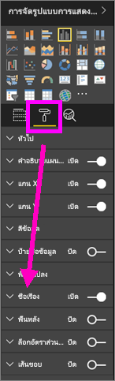
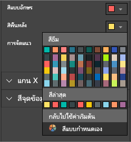
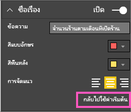
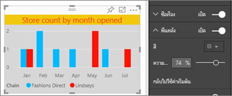
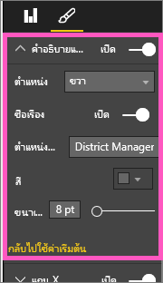
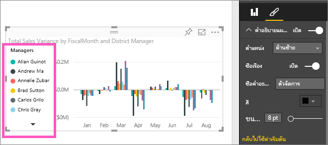

# กำหนดชื่อเรื่องการแสดงภาพ คำอธิบายแผนภูมิ และพื้นหลัง
ในบทช่วยสอนนี้ คุณจะได้เรียนรู้ถึงวิธีการกำหนดการแสดงภาพของคุณเองสองถึงสามวิธี   มีตัวเลือกมากมายสำหรับการกำหนดการแสดงภาพของคุณ วิธีดีที่สุดเมื่อต้องการเรียนรู้เกี่ยวกับตัวเลือกทั้งหมดคือการสำรวจพื้นที่การจัดรูปแบบ (เลือกไอคอนลูกกลิ้งทาสี)  เพื่อช่วยให้คุณเริ่มต้นใช้งาน บทความนี้แสดงวิธีการกำหนดชื่อเรื่องการแสดงภาพ คำอธิบายแผนภูมิ และพื้นหลัง  

เราไม่สามารถกำหนดค่าได้ทุกการแสดงภาพ [ดูรายการทั้งหมด](#list)ได้  

ดู Amanda กำหนดการแสดงภาพเองในรายงานของเธอ (กรอไปข้างหน้าที่ 4:50 ในวิดีโอนี้) จากนั้นทำตามคำแนะนำในวิดีโอด้านล่างทีละขั้นเพื่อลองทำด้วยตนเองด้วยข้อมูลของคุณเอง

<iframe width="560" height="315" src="https://www.youtube.com/embed/IkJda4O7oGs" frameborder="0" allowfullscreen></iframe>

### ข้อกำหนดเบื้องต้น
- บริการ Power BI หรือ Power BI Desktop
- ตัวอย่างการวิเคราะห์การค้าปลีก

## กำหนดชื่อเรื่องของการแสดงภาพในรายงาน
ในการทำตามขั้นตอนนี้ ลงชื่อเข้าใช้ในบริการ Power BI (app.powerbi.com) และ[เปิดรายงานตัวอย่างการวิเคราะห์ร้านค้าปลีก](../sample-datasets.md)ใน[มุมมองการแก้ไข](../service-interact-with-a-report-in-editing-view.md)

> [!NOTE]
> เมื่อคุณปักหมุดภาพไปยังแดชบอร์ด การแสดงภาพจะกลายเป็นไทล์ของแดชบอร์ด  นอกจากนี้ คุณสามารถกำหนดไทล์ด้วยตนเองให้มี[ชื่อเรื่องใหม่ และคำบรรยาย ไฮเปอร์ลิงก์ และปรับขนาด](../service-dashboard-edit-tile.md)ได้
> 
> 

1. นำทางไปยังหน้า "ร้านค้าใหม่" ของรายงาน และเลือกแผนภูมิคอลัมน์ "Open Store Count by Open Month..."
2. ในพื้นที่การแสดงภาพนี้ เลือกไอคอนลูกกลิ้งทาสีเพื่อแสดงตัวเลือกการจัดรูปแบบ  และเลือก**ชื่อเรื่อง**เพื่อขยายส่วนนั้น  

   
3. เปิดใช้งาน**ชื่อเรื่อง**และปิดโดยเลือกตัวเลื่อนเปิด (หรือปิด) ในตอนนี้ ปล่อยให้**เปิดใช้งาน**  

   
4. เปลี่ยน**ข้อความชื่อเรื่อง**โดยการพิมพ์**จำนวนของร้านค้าแยกตามเดือนที่เปิด**ในเขตข้อมูลข้อความ  
5. เปลี่ยน**สีแบบอักษร**เป็นสีส้ม และ**สีพื้นหลัง**เป็นสีเหลือง

   * เลือกรายการแบบเลื่อนลง แล้วเลือกสีจาก**สีของธีม** **สีล่าสุด** หรือ**สีแบบกำหนดเอง**
   * เลือกรายการแบบเลื่อนลงเพื่อปิดหน้าต่างสี  
     

   คุณสามารถกลับไปยังสีเริ่มต้นได้เสมอโดยการเลือก**แปลงกลับเป็นค่าเริ่มต้น**ในหน้าต่างสี
6. เพิ่มขนาดข้อความเป็น 12
7. การกำหนดค่าสุดท้ายที่เราจะดำเนินการกับชื่อเรื่องแผนภูมิคือการจัดแนวกึ่งกลางของการแสดงภาพ ตำแหน่งของชื่อเรื่องจะเป็นค่าเริ่มต้น นั่นคือ การจัดชิดซ้าย  
   

    ณ จุดนี้ในบทช่วยสอน **ชื่อเรื่อง**แผนภูมิคอลัมน์ของคุณควรมีลักษณะดังนี้:  
    

    เมื่อต้องการแปลงกลับค่ากำหนดเองทั้งหมดที่เราได้ดำเนินการ เลือก**แปลงกลับเป็นค่าเริ่มต้น**ที่ด้านล่างของช่อง**ชื่อเรื่อง**กำหนดเอง  
    

## กำหนดพื้นหลังการแสดงภาพด้วยตนเอง
ด้วยคอลัมน์แผนภูมิเดียวกันที่เลือก ขยายตัวเลือกพื้นหลัง

1. เปิดใช้งานพื้นหลังและปิดโดยเลือกตัวเลื่อนเปิด (หรือปิด) ในตอนนี้ ปล่อยให้**เปิดใช้งาน**
2. เปลี่ยนสีพื้นหลังเป็นสีเทา 74%

   * เลือกรายการแบบเลื่อนลง แล้วเลือกสีเทาจาก**สีของธีม** **สีล่าสุด** หรือ**สีแบบกำหนดเอง**
   * เปลี่ยนความโปร่งใสเป็น 74%   
     

   เมื่อต้องการแปลงกลับค่าพื้นหลังกำหนดเองทั้งหมดที่เราได้ดำเนินการ เลือก**แปลงกลับเป็นค่าเริ่มต้น**ที่ด้านล่างของช่อง**พื้นหลัง**กำหนดเอง

## คำอธิบายแผนภูมิแสดงภาพที่กำหนดเอง
1. เปิดหน้ารายงาน**ภาพรวม** และเลือกแผนภูมิ "ผลต่างยอดขายรวมแยกตาม FiscalMonth และผู้จัดการเขต"
2. ในแท็บการแสดงภาพ เลือกไอคอนพู่กันเพื่อเปิดพื้นที่การจัดรูปแบบ  
3. ขยายตัวเลือก**คำอธิบายแผนภูมิ**

      
4. เปิดใช้งานคำอธิบายแผนภูมิและปิดโดยเลือกตัวเลื่อนเปิด (หรือปิด) ในตอนนี้ ปล่อยให้**เปิดใช้งาน**
5. ย้ายคำอธิบายแผนภูมิไปด้านซ้ายของการแสดงภาพ    
6. เพิ่มชื่อเรื่องคำอธิบายแผนภูมิโดยเปิด**ชื่อเรื่อง**เป็น**เปิด**และในช่อง**ชื่อคำอธิบายแผนภูมิ** พิมพ์**ผู้จัดการ**
   

   เมื่อต้องการแปลงกลับค่าคำอธิบายแผนภูมิกำหนดเองทั้งหมดที่เราได้ดำเนินการ เลือก**แปลงกลับเป็นค่าเริ่มต้น**ที่ด้านล่างของช่อง**คำอธิบายแผนภูมิ**กำหนดเอง

## ชนิดการแสดงภาพที่สามารถกำหนดเองได้

| การแสดงภาพ | ชื่อเรื่อง | พื้นหลัง | คำอธิบายแผนภูมิ |
|:--- |:--- |:--- |:--- |
| พื้นที่ |ใช่ |ใช่ |ใช่ |
| แถบ |ใช่ |ใช่ |ใช่ |
| การ์ด |ใช่ |ใช่ |n/a |
| การ์ดแบบหลายแถว |ใช่ |ใช่ |n/a |
| คอลัมน์ |ใช่ |ใช่ |ใช่ |
| ผสม |ใช่ |ใช่ |ใช่ |
| แผนภูมิโดนัท |ใช่ |ใช่ |ใช่ |
| แผนที่แถบสี |ใช่ |ใช่ |ใช่ |
| กรวย |ใช่ |ใช่ |n/a |
| ตัววัด |ใช่ |ใช่ |n/a |
| KPI |ใช่ |ใช่ |n/a |
| บรรทัด |ใช่ |ใช่ |ใช่ |
| แผนที่ |ใช่ |ใช่ |ใช่ |
| เมทริกซ์ |ใช่ |ใช่ |n/a |
| แผนภูมิวงกลม |ใช่ |ใช่ |ใช่ |
| แผนภูมิกระจาย |ใช่ |ใช่ |ใช่ |
| ตัวแบ่งส่วนข้อมูล |ใช่ |ใช่ |n/a |
| ตาราง |ใช่ |ใช่ |n/a |
| TextBox |ไม่ |ใช่ |n/a |
| แผนผังต้นไม้ |ใช่ |ใช่ |ใช่ |
| แผนภูมิน้ำตก |ใช่ |ใช่ |ใช่ |

## ขั้นตอนถัดไป
[กำหนดค่าแกน X และแกน Y](power-bi-visualization-customize-x-axis-and-y-axis.md)  
[กำหนดสีและคุณสมบัติแกน](service-getting-started-with-color-formatting-and-axis-properties.md)  
[Power BI - แนวคิดพื้นฐาน](../consumer/end-user-basic-concepts.md)  
มีคำถามเพิ่มเติมหรือไม่ [ลองไปที่ชุมชน Power BI](http://community.powerbi.com/)

