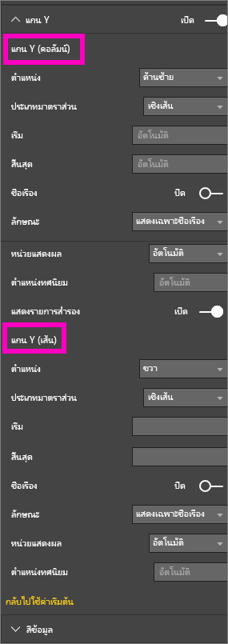

# คุณสมบัติแกน x และแกน y ที่กำหนดด้วยตนเอง
ในบทช่วยสอนนี้ คุณจะได้เรียนรู้หลายวิธีในการกำหนดค่าแกน X และแกน Y ของวิชวลคุณ ไม่ใช่วิชวลทั้งหมดที่มีแกน หรือสามารถกำหนดแกนเองได้ ตัวอย่างของวิชวลที่ไม่มีแกน เช่น แผนภูมิวงกลม และตัวเลือกที่กำหนดเองได้ จะแตกต่างกันตามวิชวล มีตัวเลือกอยู่มากมายเกินกว่าที่จะครอบคลุมในบทความเดียว ดังนั้นเราจะดูเฉพาะ การกำหนดค่าแกนที่ใช้บ่อยที่สุดบางค่า เพื่อให้คุณคุ้นเคยกับแท็บการจัดรูปแบบวิชวล บนพื้นที่รายงาน Power BI  

> [!NOTE]
> หน้านี้ใช้ได้ทั้งบริการของ Power BI และ Power BI Desktop การกำหนดค่าเหล่านี้ มีให้ใช้งานเมื่อไอคอน**รูปแบบ** (ไอคอนรูปลูกกลิ้งสี  ) ถูกเลือก และมีใน Power BI Desktop ด้วย  
>
>

ดู Amanda กำหนดค่าแกน X และ Y ด้วยตนเอง และสาธิตหลายวิธีในการควบคุมการเรียงต่อกันเมื่อ ดูข้อมูลสรุปและเจาะลึกดูรายละเอียด จากนั้น ทำตามคำแนะนำทีละขั้นตอน ด้านล่างของวิดีโอ โดยลองกับตัวอย่างการวิเคราะห์การค้าปลีก

<iframe width="560" height="315" src="https://www.youtube.com/embed/9DeAKM4SNJM" frameborder="0" allowfullscreen></iframe>

## การกำหนดค่าแกน X ในการแสดงภาพในรายงาน
## สร้างภาพแผนภูมิแบบเรียงซ้อน
ลงชื่อเข้าใช้ไปยังบริการของ Power BI และเปิดรายงาน**ตัวอย่างการวิเคราะห์การค้าปลีก**ใน[มุมมองการแก้ไข](../service-interact-with-a-report-in-editing-view.md) เพื่อลองทำตาม [เชื่อมต่อกับตัวอย่างการวิเคราะห์การค้าปลีก](../sample-datasets.md)

1. สร้างแผนภูมิคอลัมน์ใหม่ที่แสดงยอดขายของปีนี้และปีที่แล้ว โดยแบ่งตามเดือนงบประมาณ
2. แปลงเป็นแผนภูมิคอลัมน์แบบเรียงซ้อน

    

## กำหนดค่าแกน X
1. ในบานหน้าต่างการจัดรูปแบบการแสดงข้อมูลและตัวกรอง เลือก**รูปแบบ** (ไอคอนลุกกลิ้งสี  ) เพื่อแสดงตัวเลือกกำหนดเอง
2. ขยายตัวเลือกแกน X

   
3. เปิดและปิดแกน X โดยการเลื่อนตัวเลื่อนให้เปิด (หรือปิด) ในตอนนี้ ปล่อยให้ค่าเป็น**เปิด**  เหตุผลหนึ่งที่คุณอาจต้องการปิดแกน X คือเพื่อประหยัดพื้นที่สำหรับข้อมูลเพิ่มเติม

    
4. จัดรูปแบบสีข้อความ ขนาด และแบบตัวอักษร ในตัวอย่างนี้ เราได้ตั้งค่า**สี**ข้อความเป็นสีดำ **ขนาดของข้อความ**เป็น 14 และ**แบบตัวอักษร**เป็น Arial Black  
5. ตั้ง ชื่อเรื่องสำหรับแกน X ให้เป็น**เปิด** และแสดงชื่อของแกน X - ในกรณีนี้คือ **เดือนงบประมาณ**  
6. จัดรูปแบบสี ขนาด และแบบตัวอักษร ของชื่อเรื่อง  ในตัวอย่างนี้ เราได้ตั้งค่า**สีของชื่อเรื่อง**เป็นสีส้ม เปลี่ยน**ชื่อแกน**เป็น**เดือนงบประมาณ** และตั้งค่า**ขนาดข้อความของชื่อเรื่อง**เป็น 21
7. เพื่อเรียงลำดับตาม เดือนงบประมาณ เลือกจุดไข่ปลา (...) ที่มุมบนขวาของแผนภูมิ และเลือก**เรียงตาม เดือนงบประมาณ**

    หลังจากกำหนดค่าทั้งหมดเหล่านี้ แผนภูมิคอลัมน์ของคุณจะมีลักษณะดังนี้:

     

เพื่อแปลงกลับการปรับแต่งแกน X ทั้งหมดที่คุณได้ทำ เลือก**กลับไปใช้ค่าเริ่มต้น** ที่ด้านล่างของบานหน้าต่างการกำหนดค่า**แกน X**

## กำหนดค่าแกน Y
1. ขยายตัวเลือกแกน Y

   

2. เปิดและปิดแกน Y โดยการเลื่อนตัวเลื่อนให้เปิด (หรือปิด) ในตอนนี้ ปล่อยให้ค่าเป็น**เปิด**  เหตุผลหนึ่งที่คุณอาจต้องการปิดแกน Y คือเพื่อประหยัดพื้นที่สำหรับข้อมูลเพิ่มเติม
   
    
3. ย้าย**ตำแหน่ง**แกน Y ไปด้านขวา
4. จัดรูปแบบสีข้อความ ขนาด และแบบตัวอักษร ในตัวอย่างนี้ เราได้ตั้งค่า**สี**ข้อความเป็นสีดำ **ขนาดของข้อความ**เป็น 14 และ**แบบตัวอักษร**เป็น Arial Black  
5. ให้ค่า**หน่วยแสดงผล**เป็น ล้าน และจำนวน**จุดทศนิยมของค่า**เป็นศูนย์
6. สำหรับการแสดงผลภาพนี้ การมีชื่อแกน Y ไม่ได้ช่วยวิชวลให้ดีขึ้น ดังนั้นจึงปล่อยให้การแสดง**ชื่อเรื่อง**เป็นปิด  
7. เรามาทำเส้นตารางให้เด่นขึ้นมา โดยการเปลี่ยน**สี**เป็นสีเทา และเพิ่ม**สโตรก**เป็น 2

    หลังจากกำหนดค่าทั้งหมดเหล่านี้ แผนภูมิคอลัมน์ของคุณจะมีลักษณะดังนี้:

     

## การกำหนดการแสดงภาพให้มีแกน Y สองแกน
ก่อนอื่น คุณจะสร้างแผนภูมิผสม ที่ดูผลกระทบของจำนวนร้านค้าที่มีต่อยอดขาย  นี่คือแผนภูมิเดียวกันกับที่สร้างใน [บทช่วยสอนแผนภูมิผสม](power-bi-visualization-combo-chart.md) จากนั้น คุณจะจัดรูปแบบให้มีแกน Y สองแกน

### สร้างแผนภูมิที่มีแกน Y สองแกน
1. สร้างแผนภูมิเส้นใหม่ที่ติดตาม **ยอดขาย > %กำไรขั้นต้นปีที่แล้ว**เทียบกับ**เวลา > เดือนงบประมาณ**
2. เรียงลำดับวิชวลตามเดือน โดยการเลือกที่จุดไข่ปลา (...) แล้วเลือก**เรียงตามเดือน**

    

> [NOTE]: For help sorting by month, see [sorting by other criteria](../power-bi-report-change-sort.md#other)
> 1. ในเดือนมกราคม %กำไรขั้นต้น อยู่ที่ 35% ไปจุดสุงสุดที่ 45% ในเดือนเมษายน ตกลงในเดือนกรกฎาคม และกลับไปสูงสุดอีกครั้งในเดือนสิงหาคม เราจะเห็นรูปแบบที่คล้ายกัน ในยอดขายปีที่แล้วและของปีนี้หรือไม่?
> 2. เพิ่ม**ยอดขายปีนี้ > ค่า** และ**ยอดขายปีที่แล้ว**ลงในแผนภูมิเส้น มาตราส่วนของ **%กำไรขั้นต้นปีที่แล้ว** (เส้นสีน้ำเงินตามเส้นตาราง 0M%) มีขนาดเล็กกว่ามาตราส่วนของ**ยอดขาย**มาก ซึ่งทำให้ยากต่อการเปรียบเทียบ และเปอร์เซ็นต์ที่ป้ายชื่อแกน Y ประหลาดมาก      

   
5. เพื่อให้ง่ายต่อการอ่านและตีความวิชวล แปลงแผนภูมิเส้นให้เป็น แผนภูมิเส้นและแผนภูมิคอลัมน์แบบเรียงซ้อน

   

6. ลาก **%อัตรากำไรปีที่แล้ว**จาก**ค่าคอลัมน์**ลงใน**ค่าเส้นตรง** ตอนนี้เรามีแผนภูมิคอลัมน์แบบเรียงซ้อนที่เราสร้างไว้ข้างต้น***รวมกับ***แผนภูมิเส้น  (ไม่บังคับ คุณอาจจัดรูปแบบตัวอักษร สี และ ขนาดของแกน ที่ได้เรียนรู้ด้านบนได้)
   

   Power BI จะสร้างแกนสองแกน ซึ่งช่วยให้ชุดข้อมูลมีการปรับขนาดต่างกัน หน่วยวัดด้านซ้ายเป็นหน่วยดอลลาร์ ส่วนด้านขวาวัดเป็นเปอร์เซ็นต์

   

### จัดรูปแบบแกน Y ทุติยภูมิ
1. ในบานหน้าต่าง**การจัดรูปแบบการแสดงข้อมูล** เลือกไอคอนลูกกลิ้งทาสี เพื่อแสดงตัวเลือการจัดรูปแบบ
2. ขยายตัวเลือกแกน Y โดยการเลือกลูกศรลง
3. เลื่อนผ่านรายการจนกว่าคุณพบตัวเลือกสำหรับ**แสดงรายการสำรอง** สลับค่า**แสดงรายการสำรอง**จาก**ปิด**ไปเป็น**เปิด**

   

   
4. (ไม่บังคับ) กำหนดค่าทั้งสองแกน ถ้าคุณสลับ**ตำแหน่ง**สำหรับแกนคอลัมน์หรือแกนเส้นแล้ว ทั้งสองแกนจะสลับด้านกัน

   

### เพิ่มชื่อแกนให้กับทั้งสองแกน
ด้วยการแสดงภาพที่ซับซ้อนนี้ การใส่ชื่อแกนจะช่วยได้  ชื่อแกนช่วยให้เพื่อนร่วมงานของคุณ เข้าใจเรื่องราวที่การแสดงภาพของคุณกำลังบอก

1. สลับ**ชื่อแกน**ไปเป็น**เปิด**สำหรับ**แกน Y (คอลัมน์)** และ**แกน Y (เส้น)**
2. ตั้งค่า**สไตล์**เพื่อ**แสดงเฉพาะหัวข้อ**

   
3. แผนภูมิผสมของคุณตอนนี้แสดงแกนทั้งสองแกนด้วยชื่อ

   

สำหรับข้อมูลเพิ่มเติม ดู[คำแนะนำและเคล็ดลับสำหรับการจัดรูปแบบสี การติดป้ายชื่อ และคุณสมบัติของแกน](service-tips-and-tricks-for-color-formatting.md)

## ข้อควรพิจารณาและการแก้ไขปัญหา
ถ้าแกน X ถูกจัดประเภท โดยเจ้าของรายงานให้เป็นชนิดวันที่ ตัวเลือก**ชนิด**จะแสดง และคุณสามารถเลือกระหว่างต่อเนื่อง หรือตามประเภท

## ขั้นตอนถัดไป
อ่านเพิ่มเติมเกี่ยวกับ[การแสดงภาพในรายงาน Power BI](power-bi-report-visualizations.md)

[กำหนดค่า](power-bi-visualization-customize-title-background-and-legend.md)[ชื่อเรื่อง พื้นหลัง และคำอธิบายแผนภูมิ](power-bi-visualization-customize-title-background-and-legend.md)

[กำหนดสีและคุณสมบัติของแกน](service-getting-started-with-color-formatting-and-axis-properties.md)

[Power BI - แนวคิดพื้นฐาน](../service-basic-concepts.md)

มีคำถามเพิ่มเติมหรือไม่ [ลองไปที่ชุมชน Power BI](http://community.powerbi.com/)
