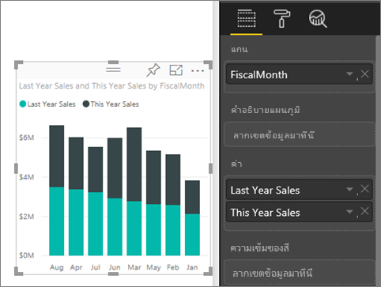
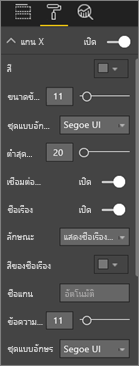
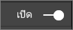
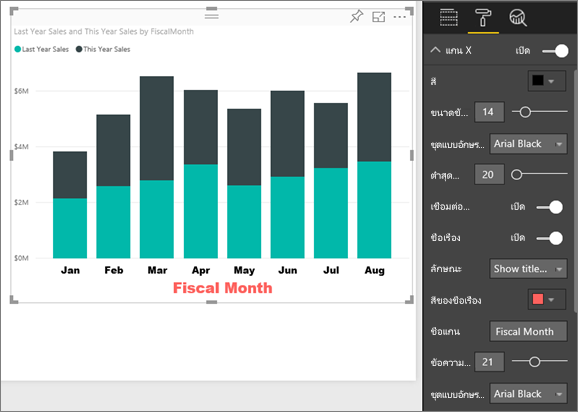
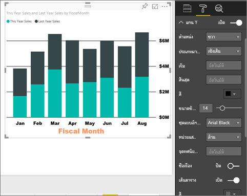
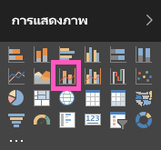
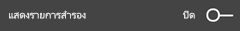
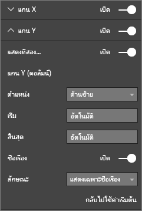

# กำหนดคุณสมบัติแกน X และแกน Y ด้วยตนเอง

ในบทช่วยสอนนี้ คุณจะได้เรียนรู้หลายวิธีในการกำหนดค่าแกน X และแกน Y ของการแสดงผลด้วยภาพของคุณ ไม่ใช่ภาพทั้งหมดที่มีแกน ตัวอย่างเช่น แผนภูมิวงกลมจะไม่มีแกน และตัวเลือกการกำหนดเองมีมากมายในระดับภาพต่อภาพ เนื่องจากมีตัวเลือกมากมายเกินกว่าที่จะกล่าวถึงในบทความเดียว คุดังนั้ณจะได้ดูเฉพาะการกำหนดค่าแกนที่ใช้บ่อยที่สุดบางค่า เพื่อให้คุณคุ้นเคยกับการใช้บานหน้าต่าง **รูปแบบ** การแสดงผลด้วยภาพ บนพื้นที่รายงาน Power BI  

> [!NOTE]
> หน้านี้ใช้ได้ทั้งบริการของ Power BI และ Power BI Desktop การกำหนดค่าเหล่านี้ มีให้ใช้งานเมื่อเลือกไอคอน **รูปแบบ** (ไอคอนลูกกลิ้งทาสี ) และมีใน Power BI Desktop ด้วย

ดู Amanda กำหนดแกน X และ Y ของเธอ เธอจะสาธิตวิธีการต่างๆ ในการควบคุมการเรียงต่อกันเมื่อใช้การดูรายละเอียดแนวลึกและการดูข้อมูลสรุป

<iframe width="560" height="315" src="https://www.youtube.com/embed/9DeAKM4SNJM" frameborder="0" allowfullscreen></iframe>

## ข้อกำหนดเบื้องต้น

- บริการของ Power BI

- รายงานตัวอย่างการวิเคราะห์ร้านค้าปลีก

## กำหนดแกน X และ Y ของการแสดงผลด้วยภาพในรายงาน

ในการทำตามขั้นตอนนี้ ลงชื่อเข้าใช้ใน [บริการ Power BI](https://app.powerbi.com) และเปิดรายงาน [ตัวอย่างการวิเคราะห์ร้านค้าปลีก](../sample-datasets.md) ในมุมมอง [การแก้ไขรายงาน](../service-interact-with-a-report-in-editing-view.md)

### สร้างการแสดงผลด้วยภาพแผนภูมิคอลัมน์แบบเรียงซ้อน

ก่อนที่คุณจะสามารถกำหนดค่าการแสดงผลด้วยภาพของคุณ คุณต้องสร้างการแสดงผลด้วยภาพก่อน

1. ในบริการ Power BI ขยาย**My Workspace**

1. เลื่อนลง แล้วเลือก **ตัวอย่างการวิเคราะห์ร้านค้าปลีก** จากรายการ **ชุดข้อมูล**

1. จากบานหน้าต่าง**การแสดงผลด้วยภาพ** เลือกไอคอนแผนภูมิคอลัมน์แบบเรียงซ้อน

    

1. หากต้องการเพิ่มค่าแกน X ในบานหน้าต่าง **เขตข้อมูล** ให้เลือก **เวลา** > **เดือนทางบัญชี**

1. หากต้องการตั้งค่าแกน Y จากบานหน้าต่าง **เขตข้อมูล** ให้เลือก **ยอดขาย**  >  **ยอดขายของปีที่ผ่านมา** และ **ยอดขาย** > **ยอดขายของปีนี้** > **ค่า**

    

### กำหนดแกน X เอง

ในตอนนี้คุณสามารถกำหนดค่าแกน X ของคุณเอง

1. ในบานหน้าต่าง **การแสดงภาพ** เลือก **รูปแบบ** (ไอคอนรูปลูกกลิ้งทาสี ) เพื่อเปิดให้เห็นตัวเลือกการปรับแต่งเอง

1. ขยายตัวเลือกแกน X

   

1. เลื่อนตัวเลื่อน **แกน X** ไปยัง **เปิด**

    

    เหตุผลหนึ่งที่คุณอาจต้องการปิดแกน X คือเพื่อประหยัดพื้นที่สำหรับข้อมูลเพิ่มเติม

1. จัดรูปแบบสีข้อความ ขนาด และแบบตัวอักษร

    - **สี**: เลือกสีดำ

    - **ขนาดของข้อความ**: ป้อน *14*

    - **ชุดแบบอักษร**: เลือก **Arial Black**

1. เลื่อนตัวเลือก **ชื่อ** ไปยัง **เปิด** เพื่อแสดงชื่อของแกน X ในกรณีนี้ เป็น**เดือนงบประมาณ**

1. จัดรูปแบบสี ขนาด และแบบตัวอักษร ของชื่อเรื่อง:

    - **สีของชื่อเรื่อง**: เลือกสีส้ม

    - **ชื่อแกน**: ป้อน *เดือนทางบัญชี*

    - **ขนาดข้อความของชื่อเรื่อง**: ป้อน *21*

เมื่อคุณทำการกำหนดเองเสร็จสิ้นแล้ว แผนภูมิคอลัมน์แบบเรียงซ้อนของคุณจะมีลักษณะดังนี้:

บันทึกการเปลี่ยนแปลงที่คุณทำและย้ายไปยังส่วนถัดไป

เมื่อต้องการย้อนกลับการเปลี่ยนแปลงทั้งหมด ให้เลือก **ย้อนกลับไปเป็นค่าเริ่มต้น** ที่ด้านล่างของบานหน้าต่างการกำหนด **แกน X** ด้วยตัวเอง

### กำหนดแกน Y ด้วยตัวเอง

ถัดไป คุณจะกำหนดค่าแกน Y ของคุณเอง

1. ขยายตัวเลือกแกน Y

   

1. เลื่อนตัวเลื่อน **แกน Y** ไปยัง **เปิด**  

    

    เหตุผลหนึ่งที่คุณอาจต้องการปิดแกน Y คือเพื่อประหยัดพื้นที่สำหรับข้อมูลเพิ่มเติม

1. ตั้งค่า **ตำแหน่ง** ของแกน Y ไปทาง **ขวา**

1. จัดรูปแบบสีข้อความ ขนาด และแบบตัวอักษร

    - **สี**: เลือกสีดำ

    - **ขนาดของข้อความ**: ป้อน *14*

    - **ชุดแบบอักษร**: เลือก **Arial Black**

1. ตั้งค่า **หน่วยแสดงผล** เป็น **ล้าน** และ **จำนวนจุดทศนิยมของค่า** เป็น *0*

1. สำหรับการแสดงผลภาพนี้ การมีชื่อแกน Y ไม่ได้ช่วยภาพให้ดีขึ้น ดังนั้นจึงปล่อยให้การแสดง **ชื่อเรื่อง** **ปิด**  

1. เรามาทำเส้นตารางให้เด่นขึ้นมาโดยการเปลี่ยนสีและเพิ่มสโตรก:

    - **สี**: เลือกสีเทาเข้ม

    - **สโตรก**: ป้อน *2*

หลังจากกำหนดค่าทั้งหมดเหล่านี้ แผนภูมิคอลัมน์ของคุณจะมีลักษณะดังนี้:

## การกำหนดการแสดงภาพให้มีแกน Y สองแกน

ก่อนอื่น คุณจะสร้างแผนภูมิผสม ที่ดูผลกระทบของจำนวนร้านค้าที่มีต่อยอดขาย นี่คือแผนภูมิเดียวกันกับที่สร้างใน [บทช่วยสอนแผนภูมิผสม](power-bi-visualization-combo-chart.md) จากนั้น คุณจะจัดรูปแบบให้มีแกน Y สองแกน

### สร้างแผนภูมิที่มีแกน Y สองแกน

1. สร้างแผนภูมิเส้นใหม่ที่ติดตาม **ยอดขาย > %กำไรขั้นต้นปีที่แล้ว**เทียบกับ**เวลา > เดือนงบประมาณ**

    

    > [!NOTE]
    > สำหรับความช่วยเหลือในการเรียงลำดับตามเดือน โปรดดู [การเรียงลำดับโดยใช้เกณฑ์อื่น](../consumer/end-user-change-sort.md#other)

    ในเดือนมกราคม เปอร์เซ็นต์กำไรรวมคือ 35% ซึ่งเดือนเมษายนพุ่งขึ้นสูงสุดอยู่ที่ 45% ต่อมาลดลงในเดือนกรกฎาคม และพุ่งสูงขึ้นอีกครั้งในเดือนสิงหาคม เราจะเห็นรูปแบบที่คล้ายกัน ในยอดขายปีที่แล้วและของปีนี้หรือไม่?

1. เพิ่ม**ยอดขายปีนี้ > ค่า** และ**ยอดขายปีที่แล้ว**ลงในแผนภูมิเส้น

    

    มาตราส่วนของ **%กำไรรวมปีที่แล้ว** (เส้นสีน้ำเงินตามเส้นตาราง **0M%** ) มีขนาดเล็กกว่ามาตราส่วนของ **ยอดขาย** มาก ซึ่งทำให้ยากต่อการเปรียบเทียบ และเปอร์เซ็นต์ที่ป้ายชื่อแกน Y ประหลาดมาก

1. เพื่อให้ง่ายต่อการอ่านและตีความวิชวล แปลงแผนภูมิเส้นให้เป็น แผนภูมิเส้นและแผนภูมิคอลัมน์แบบเรียงซ้อน

   

1. ลาก **%อัตรากำไรปีที่แล้ว**จาก**ค่าคอลัมน์**ลงใน**ค่าเส้นตรง**

    

    ขณะนี้ คุณมีแผนภูมิคอลัมน์แบบเรียงซ้อนที่คุณสร้างขึ้นในส่วนแรก โดยมีแผนภูมิเส้นที่ซ้อนทับอยู่ด้านบน ไม่บังคับ คุณอาจจัดรูปแบบตัวอักษร สี และ ขนาดของแกน ที่ได้เรียนรู้ด้านบนได้

   

   Power BI สร้างแกน  Y สองแกนที่ทำให้ชุดข้อมูลสามารถรับการวัดด้วยวิธีที่แตกต่างกัน แกนซ้ายวัดดอลลาร์และแกนขวาวัดเปอร์เซ็นต์

### จัดรูปแบบแกน Y ทุติยภูมิ

1. ในบานหน้าต่าง **การจัดรูปแบบการแสดงข้อมูล** เลือกไอคอนลูกกลิ้งทาสี เพื่อแสดงตัวเลือการจัดรูปแบบ

1. ขยายตัวเลือกแกน Y

1. เลื่อนลงจนกว่าคุณพบตัวเลือก **แสดงรายการสำรอง** ตรวจสอบว่าส่วนนี้ **เปิด**

   

1. (ไม่บังคับ) กำหนดค่าทั้งสองแกน ถ้าคุณสลับ**ตำแหน่ง**สำหรับแกนคอลัมน์หรือแกนเส้นแล้ว ทั้งสองแกนจะสลับด้านกัน

### เพิ่มชื่อแกนให้กับทั้งสองแกน

เนื่องจากมีการแสดงภาพที่ซับซ้อนมาก สิ่งนี้จะช่วยในการเพิ่มชื่อแกน  ชื่อเรื่องช่วยให้เพื่อนร่วมงานของคุณ เรียนรู้เรื่องราวที่การแสดงภาพของคุณกำลังบอก

1. สลับ**ชื่อแกน**ไปเป็น**เปิด**สำหรับ**แกน Y (คอลัมน์)** และ**แกน Y (เส้น)**

1. ตั้งค่า **สไตล์** เป็น **แสดงเฉพาะหัวข้อ** สำหรับทั้งสอง

   

1. แผนภูมิผสมของคุณตอนนี้แสดงแกนทั้งสองแกนด้วยชื่อ

   

สำหรับข้อมูลเพิ่มเติม โปรดดู [เคล็ดลับและลูกเล่นในการจัดรูปแบบสีใน Power BI](service-tips-and-tricks-for-color-formatting.md)

## ข้อควรพิจารณาและการแก้ไขปัญหา

ถ้าแกน X ถูกจัดประเภท โดยเจ้าของรายงานให้เป็นชนิดวันที่ ตัวเลือก **ชนิด** จะแสดง และคุณสามารถเลือกระหว่างต่อเนื่อง หรือตามประเภท

## ขั้นตอนถัดไป

- [การแสดงภาพในรายงาน Power BI](power-bi-report-visualizations.md)

- [กำหนดชื่อเรื่องการแสดงภาพ คำอธิบายแผนภูมิ และพื้นหลัง](power-bi-visualization-customize-title-background-and-legend.md)

- [เริ่มใช้งานด้วยคุณสมบัติแกนและการจัดรูปแบบสี](service-getting-started-with-color-formatting-and-axis-properties.md)

- [แนวคิดพื้นฐานสำหรับลูกค้าที่ใช้บริการ Power BI](../consumer/end-user-basic-concepts.md)

มีคำถามเพิ่มเติมหรือไม่? [ลองไปที่ชุมชน Power BI](http://community.powerbi.com/)
