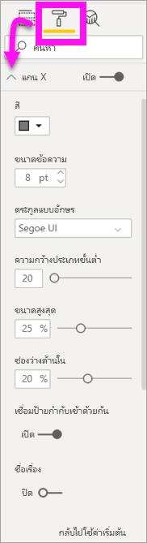
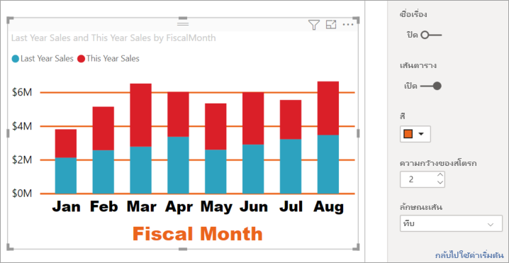

# ปรับแต่งคุณสมบัติแกน X และแกน Y ด้วยตนเอง

[!INCLUDE [power-bi-visuals-desktop-banner](../includes/power-bi-visuals-desktop-banner.md)]

ในบทช่วยสอนนี้ คุณจะได้เรียนรู้หลายวิธีในการปรับแต่งค่าแกน X และแกน Y ของการแสดงผลด้วยภาพของคุณ ไม่ใช่ภาพทั้งหมดที่มีแกน ตัวอย่างเช่น แผนภูมิวงกลมจะไม่มีแกน และตัวเลือกการกำหนดเองมีมากมายในระดับภาพต่อภาพ เนื่องจากมีตัวเลือกมากมายเกินกว่าที่จะกล่าวถึงในบทความเดียว ดังนั้นเราจะดูเฉพาะการปรับแต่งที่ใช้บ่อยที่สุดบางตัว เพื่อให้คุณคุ้นเคยกับการใช้บานหน้าต่าง **รูปแบบ** ของวิชวลบนพื้นที่รายงาน Power BI  

ดู Amanda ปรับแต่งแกน X และ Y ของเธอ เธอจะยังสาธิตวิธีการต่างๆ ในการควบคุมการเรียงต่อกันเมื่อใช้การดูรายละเอียดแนวลึกและการดูข้อมูลสรุปอีกด้วย

> [!NOTE]
> วิดีโอนี้ใช้ Power BI เวอร์ชันเก่า

<iframe width="560" height="315" src="https://www.youtube.com/embed/9DeAKM4SNJM" frameborder="0" allowfullscreen></iframe>

## ข้อกำหนดเบื้องต้น

- Power BI Desktop

- [ตัวอย่างการวิเคราะห์การค้าปลีก](https://download.microsoft.com/download/9/6/D/96DDC2FF-2568-491D-AAFA-AFDD6F763AE3/Retail%20Analysis%20Sample%20PBIX.pbix)

## เพิ่มการแสดงผลข้อมูลด้วยภาพใหม่

ก่อนที่คุณจะสามารถกำหนดค่าการแสดงผลด้วยภาพของคุณ คุณต้องสร้างการแสดงผลด้วยภาพก่อน

1. ใน Power BI Desktop ให้เปิดไฟล์ ตัวอย่างการวิเคราะห์ด้านการขายปลีก  

2. ที่ด้านล่าง ให้เลือกไอคอนบวกสีเหลืองเพื่อเพิ่มหน้าใหม่ 

    

1. จากบานหน้าต่าง**การแสดงผลด้วยภาพ** เลือกไอคอนแผนภูมิคอลัมน์แบบเรียงซ้อน สิ่งนี้จะเพิ่มเทมเพลตเปล่าไปยังพื้นที่รายงานของคุณ

    

1. หากต้องการเพิ่มค่าแกน X ในบานหน้าต่าง **เขตข้อมูล** ให้เลือก **เวลา** > **เดือนทางบัญชี**

1. หากต้องการตั้งค่าแกน Y จากบานหน้าต่าง **เขตข้อมูล** ให้เลือก **ยอดขาย**  >  **ยอดขายของปีที่ผ่านมา** และ **ยอดขาย** > **ยอดขายของปีนี้** > **ค่า**

    

    ในตอนนี้คุณสามารถกำหนดค่าแกน X ของคุณเอง Power BI ช่วยให้คุณมีตัวเลือกแบบไร้ขีดจำกัดสำหรับการจัดรูปแบบการแสดงผลข้อมูลด้วยภาพของคุณ 

## ปรับแต่งแกน X
มีคุณลักษณะหลายอย่างที่สามารถกำหนดเองได้สำหรับแกน X คุณสามารถเพิ่มและปรับเปลี่ยนป้ายชื่อข้อมูลและชื่อแกน X สำหรับหมวดหมู่ คุณสามารถปรับเปลี่ยนความกว้าง ขนาดแ ละระยะห่างของแถบ คอลัมน์ เส้น และพื้นที่ และสำหรับค่า คุณสามารถปรับเปลี่ยนหน่วยแสดงผล ตำแหน่งทศนิยม และเส้นตาราง ตัวอย่างต่อไปนี้แสดงการปรับแต่งสำหรับแผนภูมิคอลัมน์ เรามาเพิ่มการปรับแต่งบางอย่างเพื่อให้คุณคุ้นเคยกับตัวเลือกและจากนั้นคุณสามารถสำรวจที่เหลือได้ด้วยตัวคุณเอง

### ปรับแต่งป้ายชื่อแกน X
ป้ายชื่อแกน X จะแสดงอยู่ด้านล่างของคอลัมน์ในแผนภูมิ ในตอนนี้ ป้ายชื่อเหล่านั้นจะเป็นสีเทาอ่อน ขนาดเล็ก และยากต่อการอ่าน เรามาเปลี่ยนกันเถอะ

1. ในบานหน้าต่าง **การแสดงผลข้อมูลด้วยภาพ** ให้เลือก **รูปแบบ** (ไอคอนรูปลูกกลิ้งทาสี ) ) เพื่อแสดงตัวเลือกการปรับแต่ง

2. ขยายตัวเลือกแกน X

   

3. เลื่อนตัวเลื่อน **แกน X** ไปยัง **เปิด**

    

    ด้วยเหตุผลบางอย่างที่คุณอาจต้องการตั้งค่าแกน X เป็น **ปิด** คือถ้าการแสดงผลข้อมูลด้วยภาพนั้นสามารถอธิบายตนเองได้โดยไม่ต้องมีป้ายชื่อ หรือหากคุณมีหน้ารายงานที่แออัดและต้องทำให้มีพื้นที่ในการแสดงข้อมูลเพิ่มเติมมากขึ้น

4. จัดรูปแบบสีข้อความ ขนาด และแบบตัวอักษร

    - **สี**: เลือกสีดำ

    - **ขนาดของข้อความ**: ป้อน *14*

    - **ชุดแบบอักษร**: เลือก **Arial Black**

    - **ช่องว่างด้านใน**: ป้อน *40%*

        
    
5. บางทีคุณอาจไม่ชอบวิธีการแสดงข้อความบนแกน X ในแนวทแยงมุม คุณมีตัวเลือกหลากหลาย 
    - เปลี่ยนขนาดตัวอักษรเป็นขนาดเล็กกว่า 14
    - ทำให้การแสดงผลข้อมูลด้วยภาพใหญ่ขึ้น 
    - แสดงคอลัมน์น้อยลง และเพิ่มแถบเลื่อนโดยการเพิ่ม **ความกว้างหมวดหมู่ขั้นต่ำ** 
    
    ที่นี่ เราได้เลือกตัวเลือกที่สองและจับแถบปรับขนาดด้านใดด้านหนึ่งเพื่อทำให้การแสดงผลข้อมูลด้วยภาพกว้างขึ้น ในตอนนี้ คุณปรับใช้ข้อความขนาด 14 จุดโดยไม่จำเป็นต้องแสดงข้อความบนมุมหรือด้วยแถบเลื่อน 

   

### ปรับแต่งชื่อแกน X
เมื่อชื่อแกน X **เปิด**อยู่ ชื่อแกน X จะปรากฏใต้ป้ายชื่อแกน X 

1. เริ่มต้นโดยการเปลี่ยนสถานะของชื่อแกน X เป็น **เปิด**  

    

    สิ่งแรกที่คุณจะสังเกตเห็นคือการแสดงผลข้อมูลด้วยภาพของคุณในขณะนี้มีชื่อแกน X เป็นค่าเริ่มต้น  ในกรณีนี้ เป็น**เดือนงบประมาณ**

   

1. จัดรูปแบบสี ขนาด และแบบตัวอักษร ของชื่อเรื่อง:

    - **สีของชื่อเรื่อง**: เลือกสีส้ม

    - **ชื่อแกน**: พิมพ์ *เดือนทางบัญชี* (มีช่องว่างด้วย)

    - **ขนาดข้อความของชื่อเรื่อง**: ป้อน *18*

    เมื่อคุณทำการปรับแต่งค่าเองเสร็จสิ้นแล้ว แผนภูมิคอลัมน์แบบเรียงซ้อนของคุณจะมีลักษณะดังนี้:

    

1. บันทึกการเปลี่ยนแปลงที่คุณทำและย้ายไปยังส่วนถัดไป เมื่อต้องการย้อนกลับการเปลี่ยนแปลงทั้งหมด ให้เลือก **ย้อนกลับไปเป็นค่าเริ่มต้น** ที่ด้านล่างของบานหน้าต่างการกำหนด **แกน X** ด้วยตัวเอง ถัดไป คุณจะกำหนดค่าแกน Y ของคุณเอง

## ปรับแต่งแกน Y
มีคุณลักษณะมากมายที่คุณสามารถใช้ปรับแต่งแกน Y ได้ คุณสามารถเพิ่มและปรับเปลี่ยนป้ายชื่อข้อมูล ชื่อแกน X และเส้นตารางได้ สำหรับค่า คุณสามารถปรับเปลี่ยนหน่วยแสดงผล ตำแหน่งทศนิยม จุดเริ่มต้น และจุดสิ้นสุดได้ และ สำหรับหมวดหมู่ คุณสามารถปรับเปลี่ยนความกว้าง ขนาดแ ละระยะห่างของแถบ คอลัมน์ เส้น และพื้นที่ 

ตัวอย่างต่อไปนี้ยังคงเป็นการปรับแต่งแผนภูมิคอลัมน์ของเรา ลองทำการปรับแต่งเล็กน้อยเพื่อให้คุณคุ้นเคยกับตัวเลือกและจากนั้นคุณสามารถสำรวจที่เหลือได้ด้วยตัวคุณเอง

### ปรับแต่งป้ายชื่อแกน Y
ป้ายชื่อแกน Y จะแสดงทางด้านซ้ายตามค่าเริ่มต้น ในตอนนี้ ป้ายชื่อเหล่านั้นจะเป็นสีเทาอ่อน ขนาดเล็ก และยากต่อการอ่าน เรามาเปลี่ยนกันเถอะ

1. ขยายตัวเลือกแกน Y

   

1. เลื่อนตัวเลื่อน **แกน Y** ไปยัง **เปิด**  

    

    เหตุผลหนึ่งที่คุณอาจต้องการปิดแกน Y คือเพื่อประหยัดพื้นที่สำหรับข้อมูลเพิ่มเติม

1. จัดรูปแบบสีข้อความ ขนาด และแบบตัวอักษร

    - **สี**: เลือกสีดำ

    - **ขนาดของข้อความ**: ป้อน *10*

    - **หน่วยแสดงผล**: เลือก **หน่วยล้าน**

    

### ปรับแต่งชื่อแกน Y
เมื่อชื่อแกน Y **เปิด**อยู่ ชื่อแกน Y จะปรากฏถัดจากป้ายชื่อแกน Y สำหรับการแสดงผลภาพนี้ การมีชื่อแกน Y ไม่ได้ช่วยภาพให้ดีขึ้น ดังนั้นจึงปล่อยให้การแสดง **ชื่อเรื่อง** **ปิด** เราจะเพิ่มชื่อแกน Y ไปยังวิชวลแบบสองแกนในภายหลังของบทช่วยสอนนี้ 

### ปรับแต่งเส้นตาราง
เรามาทำเส้นตารางให้เด่นขึ้นมาโดยการเปลี่ยนสีและเพิ่มสโตรก:

- **สี**: เลือกสีส้ม

- **สโตรก**: ป้อน *2*

หลังจากกำหนดค่าทั้งหมดเหล่านี้ แผนภูมิคอลัมน์ของคุณจะมีลักษณะดังนี้:

## กำหนดค่าการแสดงผลข้อมูลด้วยภาพให้มีแกน Y สองแกน

การแสดงผลข้อมูลด้วยภาพบางชนิดอาจได้รับประโยชน์จากการมีแกน Y สองแกน แผนภูมิผสมเป็นตัวอย่างที่ดี ก่อนที่เราจะสามารถจัดรูปแบบแกน Y คู่ เราจะสร้างแผนภูมิผสมที่เปรียบเทียบแนวโน้มสำหรับยอดขายและกำไรขั้นต้น  

### สร้างแผนภูมิที่มีแกน Y สองแกน

1. เลือกแผนภูมิคอลัมน์และเปลี่ยนเป็นแผนภูมิ *เส้นและคอลัมน์แบบเรียงซ้อน* วิชวลชนิดนี้รองรับค่าแผนภูมิเส้นเดียว และค่าคอลัมน์แบบเรียงซ้อนหลายอัน 

    
   

2. ลาก **ยอดขาย** >  **% อัตรากำไรขั้นต้นเมื่อปีที่แล้ว** จากบานหน้าต่างเขตข้อมูลของคุณไปยังบักเก็ต **ค่าบรรทัด**

    

    
3. จัดรูปแบบการแสดงผลข้อมูลด้วยภาพใหม่เพื่อลบป้ายชื่อแกน X ที่อยู่ตรงมุมออก 

   

   Power BI สร้างแกน Y สองแกน ช่วยให้แต่ละแกนมีค่ามาตราส่วนที่แตกต่างกันได้ แกนซ้ายวัดยอดขายเป็นดอลลาร์ และแกนขวาวัดเปอร์เซ็นต์อัตรากำไรขั้นต้น

### จัดรูปแบบแกน Y ที่สอง
เนื่องจากเราเริ่มต้นจากการแสดงผลข้อมูลด้วยภาพที่มีการจัดรูปแบบแกน Y หนึ่งแกนแล้ว ดังนั้น Power BI จึงได้สร้างแกน Y ที่สองโดยใช้การตั้งค่าเดียวกัน แต่เราสามารถเปลี่ยนแปลงได้ 

1. ในบานหน้าต่าง **การจัดรูปแบบการแสดงข้อมูล** เลือกไอคอนลูกกลิ้งทาสี เพื่อแสดงตัวเลือการจัดรูปแบบ

1. ขยายตัวเลือกแกน Y

1. เลื่อนลงจนกว่าคุณพบตัวเลือก **แสดงรายการสำรอง** ตรวจสอบว่าส่วนนี้ **เปิด** แกน Y ที่สองของเราแสดงแผนภูมิเส้น

   

1. (ไม่บังคับ) ปรับแต่งสีฟอนต์ ขนาด และหน่วยแสดงผลสำหรับสองแกน ถ้าคุณสลับ**ตำแหน่ง**สำหรับแกนคอลัมน์หรือแกนเส้นแล้ว ทั้งสองแกนจะสลับด้านกัน

### เพิ่มชื่อแกนให้กับทั้งสองแกน

เนื่องจากการแสดงผลข้อมูลด้วยภาพที่ซับซ้อน สิ่งนี้จะช่วยในการเพิ่มชื่อแกน  ชื่อแกนช่วยให้เพื่อนร่วมงานของคุณ เข้าใจเรื่องราวที่การแสดงภาพของคุณกำลังบอก

1. สลับ**ชื่อแกน**ไปเป็น**เปิด**สำหรับ**แกน Y (คอลัมน์)** และ**แกน Y (เส้น)**

1. ตั้งค่า **สไตล์** เป็น **แสดงเฉพาะหัวข้อ** สำหรับทั้งสอง

   

1. แผนภูมิผสมของคุณตอนนี้แสดงแกนทั้งสองแกนด้วยชื่อ

   

1. จัดรูปแบบชื่อแผนภูมิ ในตัวอย่างนี้ เราได้ย่อชื่อแกนหนึ่งแกน และลดขนาดตัวอักษรสำหรับชื่อเรื่องทั้งสอง 
    - ขนาดฟอนต์: **9**
    - ย่อ **ชื่อแกน** สำหรับแกน Y แรก (แผนภูมิคอลัมน์): ยอดขายปีที่แล้วและปีนี้

    

สำหรับข้อมูลเพิ่มเติม โปรดดูบทความ [คำแนะนำและเคล็ดลับในการจัดรูปแบบสีใน Power BI](service-tips-and-tricks-for-color-formatting.md) และ [กำหนดชื่อเรื่องการแสดงผลข้อมูลด้วยภาพ คำอธิบายแผนภูมิ และพื้นหลัง](power-bi-visualization-customize-title-background-and-legend.md) และค้นหาการอัปเดตใหม่สำหรับการจัดรูปแบบชื่อที่จะมาถึงในไม่ช้า 

## ขั้นตอนถัดไป

- [การแสดงภาพในรายงาน Power BI](power-bi-report-visualizations.md)

มีคำถามเพิ่มเติมหรือไม่ [ลองไปที่ชุมชน Power BI](https://community.powerbi.com/)
