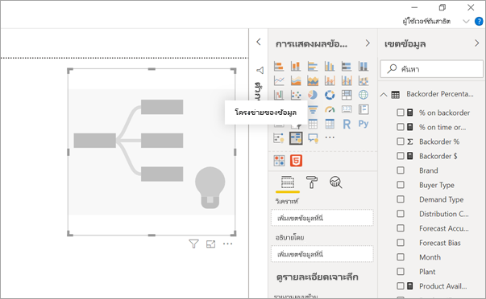
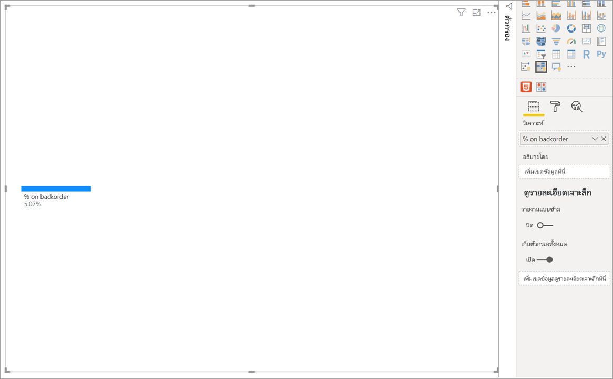
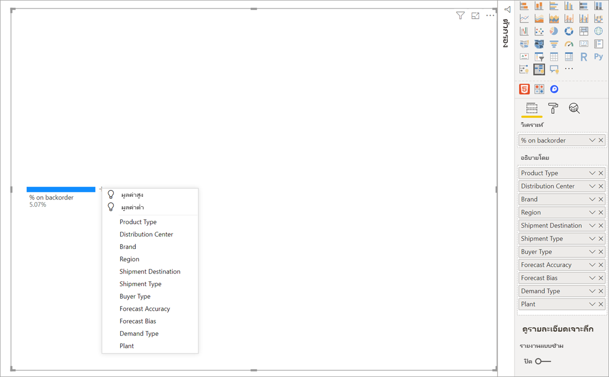
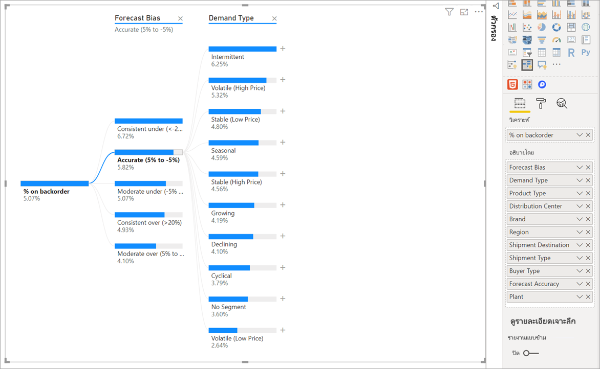
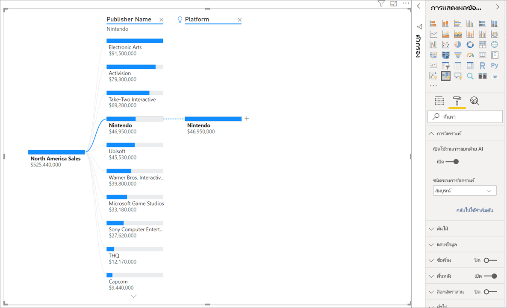
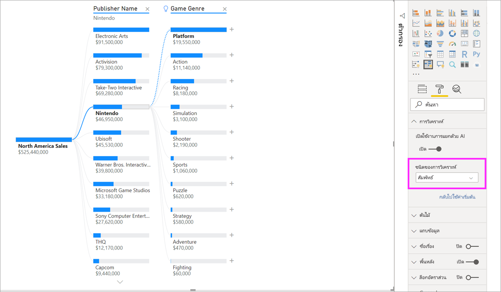
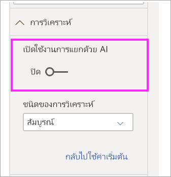

# สร้างวิชวลโครงข่ายของข้อมูลใน Power BI (ตัวอย่าง)
[!INCLUDE [power-bi-visuals-desktop-banner](../includes/power-bi-visuals-desktop-banner.md)]

การแสดงผลด้วยภาพโครงข่ายของข้อมูลใน Power BI ช่วยให้คุณสามารถแสดงภาพข้อมูลข้ามหลายมิติได้ โดยจะรวมข้อมูลและช่วยให้เจาะลึกลงในมิติของคุณในลำดับใดก็ได้ นอกจากนี้ยังเป็นการแสดงภาพข่าวกรอง (AI) แบบเทียมเพื่อให้คุณสามารถขอให้ค้นหามิติถัดไปเพื่อดูรายละเอียดแนวลึกตามเกณฑ์บางอย่าง ซึ่งทำให้เป็นเครื่องมือที่มีประโยชน์สำหรับการสำรวจแบบเฉพาะกิจและการดำเนินการวิเคราะห์สาเหตุหลัก

บทช่วยสอนนี้ใช้สองตัวอย่าง:

- สถานการณ์ของห่วงโซ่อุปทานที่วิเคราะห์เปอร์เซ็นต์ของผลิตภัณฑ์ที่บริษัทมีในรายการค้างส่ง (สินค้าหมด)  
- สถานการณ์การขายที่แบ่งยอดขายของวิดีโอเกมตามปัจจัยหลายอย่างเช่น ประเภทเกมและผู้เผยแพร่

## เริ่มใช้งาน
เลือกไอคอนแผนภูมิเส้นจากบานหน้าต่างการแสดงภาพ

การแสดงภาพต้องใช้การป้อนข้อมูลสองชนิด

**วิเคราะห์** –การวัดที่คุณต้องการวิเคราะห์ ซึ่งจะต้องเป็นหน่วยวัดหรือการรวม  
**อธิบายโดย** –หนึ่งหรือหลายมิติตามที่คุณต้องการดูรายละเอียดแนวลึก

เมื่อคุณลากหน่วยวัดของคุณลงในเขตข้อมูลแล้ว การอัปเดตการแสดงผลด้วยภาพจะแสดงหน่วยวัดรวม ในตัวอย่างด้านล่างเราจะแสดง % เฉลี่ยของผลิตภัณฑ์บนรายการค้างส่ง (5.07%) 

ขั้นตอนถัดไปคือการนำในหนึ่งหรือหลายมิติที่คุณต้องการดูรายละเอียดแนวลึก เพิ่มเขตข้อมูลเหล่านี้ลงในบักเก็ต**อธิบายโดย** โปรดสังเกตว่าเครื่องหมายบวกจะปรากฏถัดจากโหนดรากของคุณ การเลือก + ช่วยให้คุณสามารถเลือกเขตข้อมูลที่คุณต้องการดูรายละเอียดแนวลึกได้ (คุณสามารถดูฟิลด์ในลำดับใดก็ได้ที่คุณต้องการ)

การเลือกชุดผลลัพธ์ **การคาดการณ์** ในแผนภูมิขยายและแบ่งหน่วยวัดตามค่าในคอลัมน์ สามารถทำซ้ำกระบวนการนี้ได้โดยการเลือกโหนดอื่นเพื่อดูรายละเอียดแนวลึก

การเลือกโหนดจากตัวกรองข้ามระดับสุดท้ายของข้อมูล การเลือกโหนดจากระดับก่อนหน้าเปลี่ยนเส้นทาง

โต้ตอบด้วยการแสดงผลด้วยภาพอื่นๆ ผ่านตัวกรองโครงข่ายของข้อมูล ลำดับของโหนดภายในระดับสามารถเปลี่ยนเป็นผลลัพธ์ได้
ในตัวอย่างด้านล่าง เราได้ทำการกรองแบบผ่านตัวกรองโครงข่ายของข้อมูลด้วย Ubisoft เส้นทางจะอัปเดตและการขายของ Xbox จะย้ายจากอันดับหนึ่งไปเป็นอันดับสอง ซึ่งถูกแซงโดย PlayStation 

หากเรากรองจากโครงข่ายของ Nintendo ยอดขาย Xbox จะว่างเปล่าเนื่องจากไม่มีเกม Nintendo ที่พัฒนาขึ้นสำหรับ Xbox Xbox พร้อมกับเส้นทางที่ตามมาได้รับการกรองออกจากมุมมอง

แม้ว่าเส้นทางจะหายไป ระดับที่มีอยู่ (ในประเภทเกมกรณีนี้) จะยังคงปักหมุดอยู่บนโครงข่าย การเลือกโหนด Nintendo จะขยายแผนภูมิไปยังประเภทเกมโดยอัตโนมัติ

## การแยก AI

คุณสามารถใช้“ AI Splits” เพื่อหาว่าคุณควรดูข้อมูลต่อไปที่ใด การแยกเหล่านี้ปรากฏที่ด้านบนของรายการและมีการทำเครื่องหมายด้วยหลอดไฟ การแยกจะช่วยให้คุณค้นหาค่าสูงสุดและต่ำสุดในข้อมูลได้โดยอัตโนมัติ

การวิเคราะห์สามารถทำงานได้สองวิธีโดยขึ้นอยู่กับการกำหนดลักษณะของคุณ ลักษณะการทำงานเริ่มต้นจะเป็นดังนี้:

**ค่าสูง**: พิจารณาฟิลด์ทั้งหมดที่มีอยู่และกำหนดว่าจะเจาะเข้าไปที่ใดเพื่อรับค่าสูงสุดของการวัดที่กำลังวิเคราะห์  
**ค่าต่ำ**: พิจารณาฟิลด์ทั้งหมดที่มีอยู่และกำหนดว่าจะเจาะเข้าไปที่ใดเพื่อรับค่าสูงสุดของการวัดที่กำลังวิเคราะห์  

การเลือก**ค่าสูง** ในตัวอย่างสินค้าค้าง ส่งผลลัพธ์ดังต่อไปนี้: 

หลอดไฟจะปรากฏขึ้นถัดจาก**ประเภทผลิตภัณฑ์**ที่ระบุว่านี่เป็น 'AI แยก' แผนผังยังมีเส้นประที่แนะนำโหนด**การตรวจสอบผู้ป่วย**เนื่องจากชุดผลลัพธ์นั้นมีค่าสูงสุดของรายการค้าง (9.2%). 

วางเมาส์เหนือหลอดไฟเพื่อดูเคล็ดลับเครื่องมือ ในตัวอย่างนี้คำแนะนำเครื่องมือคือ “% ตามรายการค้างสูงสุดเมื่อประเภทผลิตภัณฑ์คือการตรวจสอบผู้ป่วย”

คุณสามารถกำหนดค่าการแสดงผลด้วยภาพเพื่อค้นหาการแยก **แบบสัมพัทธ์** เมื่อเทียบกับ **แบบสัมบูรณ์** 

โหมดสัมพัทธ์จะค้นหาค่าสูงที่โดดเด่น (เปรียบเทียบกับส่วนที่เหลือของข้อมูลในคอลัมน์) เพื่อแสดงให้เห็นตัวอย่าง มาลองดูตัวอย่างต่อไปนี้: 

ในสกรีนช็อตด้านบน เรากำลังมองหายอดขายของวิดีโอเกมในอเมริกาเหนือ ก่อนอื่นเราจะแยกโครงข่ายด้วย **ชื่อผู้เผยแพร่** จากนั้นดูรายละเอียดใน Nintendo การเลือก**ค่าสูง** ผลลัพธ์ในการขยายของ**แพลตฟอร์มคือ Nintendo** เนื่องจาก Nintendo (ผู้เผยแพร่) เท่านั้นที่พัฒนาสำหรับคอนโซล Nintendo มีค่าเพียงค่าเดียวเท่านั้นดังนั้นค่าสูงสุดจึงไม่น่าแปลกใจ

อย่างไรก็ตามการแยกที่น่าสนใจยิ่งขึ้นคือการดูว่าค่าสูงเด่นกว่าค่าอื่นๆ ในคอลัมน์เดียวกันหรือไม่ ถ้าเราเปลี่ยนชนิดการวิเคราะห์จาก**แบบสัมบูรณ์**เป็น**แบบสัมพัทธ์**เราได้รับผลลัพธ์ดังต่อไปนี้สำหรับ Nintendo: 

เวลานี้ค่าที่แนะนำคือ**แพลตฟอร์มภายในประเภทเกม**  แพลตฟอร์มไม่ได้ให้ค่าสัมบูรณ์สูงกว่า Nintendo ($19,950,000 เทียบกับ $46,950,000) อย่างไรก็ตามมันเป็นคุณค่าที่โดดเด่น

แม่นยำยิ่งขึ้นเนื่องจากมีค่าเกม 10 ประเภทค่าที่คาดหวังสำหรับแพลตฟอร์มจะเท่ากับ $4.6 M หากพวกเขาถูกแบ่งเท่าๆ กัน เนื่องจากแพลตฟอร์มมีมูลค่าเกือบ $20M ซึ่งเป็นผลลัพธ์ที่น่าสนใจเนื่องจากสูงกว่าผลลัพธ์ที่คาดไว้ถึงสี่เท่า

การคำนวณมีดังนี้:

ยอดขายในอเมริกาเหนือสำหรับแพลตฟอร์ม/ Abs (ค่าเฉลี่ย (ยอดขายในอเมริกาเหนือสำหรับประเภทเกม))  
vs  
ยอดขายในอเมริกาเหนือสำหรับ Nintendo / Abs (เฉลี่ย (ยอดขายในอเมริกาเหนือสำหรับแพลตฟอร์ม))  

ซึ่งตีเป็น:

19,550,000 / (19,550,000 + 11,140,000 + ... + 470,000 + 60,000 /10) = 4.25x  
vs  
46,950,000/ (46,950,000/1) = 1x  

หากคุณไม่ต้องการใช้การแบ่ง AI ใด ๆ ในแผนผังคุณยังมีตัวเลือกในการปิดการใช้งานเหล่านี้ภายใต้ตัวเลือก**การจัดรูปแบบการวิเคราะห์**ตัวเลือก:  

## การโต้ตอบกับโครงข่ายของ AI

คุณสามารถมี AI ได้หลายระดับ นอกจากนี้คุณยังสามารถผสม  AI ระดับต่างๆ ได้ (จากค่าสูงไปหาค่าต่ำและกลับไปเป็นมูลค่าสูง): 

หากคุณเลือกโหนดอื่นในโครงข่าย AI แยกจะคำนวณใหม่ตั้งแต่เริ่มต้น ในตัวอย่างด้านล่างเราเปลี่ยนโหนดที่เลือกในระดับ**การคาดการณ์อคติ**  ระดับที่ตามมาจะเปลี่ยนเพื่อให้ได้ค่าที่สูงและต่ำที่ถูกต้อง

ระดับ AI จะคำนวณอีกครั้งเมื่อคุณผ่านการกรองโครงข่ายของข้อมูลด้วยภาพอื่น ในตัวอย่างด้านล่างเราจะเห็นว่า % รายการค้าง ของเราสูงสุดสำหรับโรงงาน #0477

แต่ถ้าเราเลือก**เดือนเมษายน** ในแผนภูมิแท่ง การเปลี่ยนแปลงสูงสุดของ**ชนิดผลิตภัณฑ์คือราคาประหยัดขั้นสูง** ในกรณีนี้ไม่ได้เป็นเพียงแค่โหนดที่เรียงลำดับใหม่ แต่เลือกคอลัมน์ที่แตกต่างอย่างสิ้นเชิง 

หากเราต้องการให้ระดับ  AI ทำงานเหมือนระดับที่ไม่ใช่  AI ให้เลือกหลอดไฟเพื่อเปลี่ยนพฤติกรรมกลับเป็นค่าเริ่มต้น 

ในขณะที่หลายระดับ  AI สามารถผูกมัดด้วยกัน แต่ระดับที่ไม่ใช่  AI ไม่สามารถติดตามระดับ  AI ได้ หากเราทำการแยกแบบแมนนวลหลังจากการแยกแบบ  AI หลอดไฟจากระดับ  AI จะหายไปและระดับจะเปลี่ยนเป็นระดับปกติ 

## การล็อก

ผู้สร้างเนื้อหาสามารถล็อคระดับสำหรับผู้ใช้บริโภค เมื่อระดับถูกล็อคจะไม่สามารถลบหรือเปลี่ยนแปลงได้ ผู้บริโภคสามารถสำรวจเส้นทางที่แตกต่างภายในระดับล็อค แต่พวกเขาไม่สามารถเปลี่ยนระดับเองได้ ในฐานะผู้สร้าง คุณสามารถวางเมาส์เหนือระดับที่มีอยู่เพื่อดูไอคอนล็อคได้ คุณสามารถล็อคได้หลายระดับตามที่คุณต้องการ แต่คุณไม่สามารถปลดล็อคระดับก่อนหน้าระดับล็อคได้

ในตัวอย่างด้านล่าง มีสองระดับแรกถูกล็อค ซึ่งหมายความว่าผู้บริโภคดังกล่าวสามารถเปลี่ยนเป็นระดับ 3 และ 4 และเพิ่มระดับใหม่ในภายหลังได้ อย่างไรก็ตาม จะไม่สามารถเปลี่ยนแปลงสองระดับแรกได้:

## ข้อจำกัดที่ทราบ

จำนวนสูงสุดของระดับสำหรับทรีคือ 50 จำนวนสูงสุดของจุดข้อมูลที่สามารถแสดงภาพได้ในหนึ่งครั้งบนทรีคือ 5,000 เราตัดทอนระดับเพื่อแสดง Top n ในปัจจุบัน Top n ต่อระดับจะถูกตั้งค่าเป็น 10 

โครงข่ายของข้อมูลไม่สนับสนุนสถานการณ์ต่อไปนี้:  
-   ไม่สามารถเข้าถึงบริการการวิเคราะห์ภายในองค์กรได้

การแยก AI ไม่ได้รับการสนับสนุนในสถานการณ์ต่อไปนี้:  
-   Azure Analysis Services
-   คิวรีโดยตรง
-   เซิร์ฟเวอร์รายงาน Power BI
-   เผยแพร่บนเว็บ
-   หน่วยวัดที่ซับซ้อนและหน่วยวัดจากส่วนขยาย schema ใน ' วิเคราะห์ '

ข้อจำกัดการแสดงตัวอย่างอื่นๆ:
- Power BI สำหรับมือถือ  
- ปักหมุดเข้าแดชบอร์ด
- แสดงฟังก์ชันการทำงานของข้อมูล
- การสนับสนุนภายในถามตอบ

## ขั้นตอนถัดไป

[สร้างแผนภูมิโดนัท Power BI](power-bi-visualization-doughnut-charts.md)

[การแสดงผลข้อมูลด้วยภาพของ Power BI](power-bi-report-visualizations.md)

