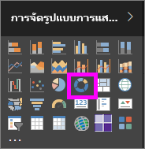
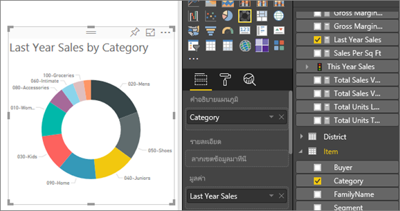

# แผนภูมิโดนัทใน Power BI
แผนภูมิโดนัทจะคล้ายกับแผนภูมิวงกลมที่จะแสดงความสัมพันธ์ของข้อมูลองค์ประกอบต่างๆ กับข้อมูลทั้งหมด ความแตกต่างเพียงประการเดียว คือ ส่วนตรงกลางนั้นว่างเปล่า และมีพื้นที่ว่างสำหรับระบุป้ายชื่อหรือไอคอน

## สร้างแผนภูมิโดนัท
คำแนะนำเหล่านี้จะใช้ตัวอย่างการวิเคราะห์การค้าปลีก เพื่อสร้างแผนภูมิโดนัทที่แสดงยอดขายสำหรับปีนี้โดยจำแนกตามประเภท ถ้าต้องการทำตามคำแนะนำดังกล่าว ให้[ดาวน์โหลดตัวอย่าง](../sample-datasets.md)สำหรับบริการ Power BI หรือ Power BI Desktop

1. เริ่มต้นบน หน้ารายงานเปล่า ถ้าคุณกำลังใช้บริการของ Power BI ตรวจสอบให้แน่ใจว่า คุณเปิดรายงานใน[มุมมองการแก้ไข](../service-interact-with-a-report-in-editing-view.md)

2. ในส่วนบานหน้าต่างเขตข้อมูล ให้เลือก**ยอดขาย** \> **ยอดขายของปีล่าสุด**  
   
3. ในส่วนบานหน้าต่างการแสดงภาพ ให้เลือกไอคอนสำหรับแผนภูมิโดนัท เพื่อแปลงแผนภูมิแท่งของคุณให้กลายเป็นแผนภูมิโดนัท ถ้า**ยอดขายปีล่าสุด**ไม่อยู่ในพื้นที่**ค่า** ให้ลากไปไว้ในส่วนนั้น
     
   

4. เลือก**สินค้า** \> **ประเภท** ที่จะเพิ่มไปยังพื้นที่**คำอธิบายแผนภูมิ** 
     
    

5. อีกวิธีหนึ่ง คือ [ปรับขนาดและสีของข้อความในแผนภูมิ](power-bi-visualization-customize-title-background-and-legend.md) 

## ข้อควรพิจารณาและการแก้ไขปัญหา
* ผลรวมของค่าแผนภูมิโดนัทต้องเพิ่มเป็น 100%
* จำนวนประเภทที่มากเกินไปจะทำให้อ่านและตีความข้อมูลได้ยาก
* แผนภูมิโดนัทเหมาะอย่างยิ่งที่จะใช้เพื่อเปรียบเทียบข้อมูลส่วนใดส่วนหนึ่งกับข้อมูลทั้งหมด มากกว่าจะใช้เปรียบเทียบระหว่างข้อมูลแต่ละส่วน 

## ขั้นตอนถัดไป
[แผนภูมิกรวยใน Power BI](power-bi-visualization-funnel-charts.md)

[ชนิดการแสดงภาพใน Power BI](power-bi-visualization-types-for-reports-and-q-and-a.md)

