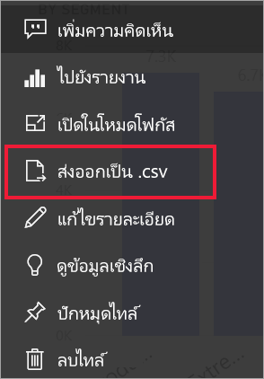
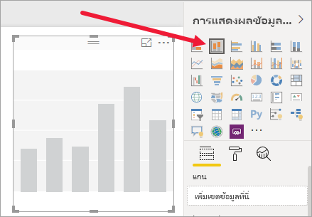
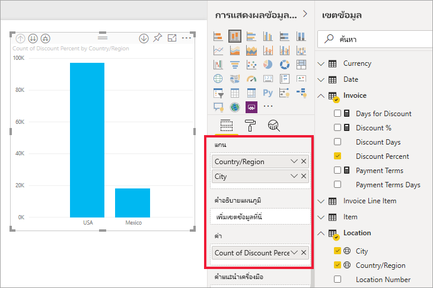
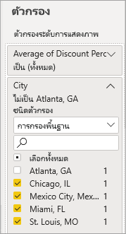
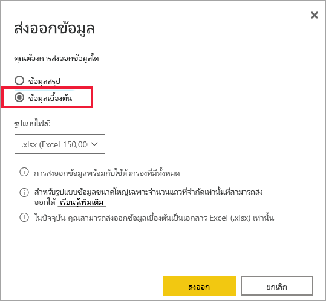

# ส่งออกข้อมูลที่ใช้เพื่อสร้างการแสดงผลข้อมูลด้วยภาพ

> [!IMPORTANT]
> ผู้ใช้ทั้งหมดไม่สามารถดูหรือส่งออกข้อมูลทั้งหมดได้ มีระบบป้องกันที่ผู้ออกแบบรายงานและผู้ดูแลระบบใช้เมื่อสร้างแดชบอร์ดและรายงาน ข้อมูลบางอย่างถูกจำกัด ซ่อน หรือเป็นความลับ และไม่สามารถมองเห็นหรือส่งออกโดยปราศจากข้ออนุญาตพิเศษ 

## ผู้ที่สามารถส่งออกข้อมูลได้

ในกรณีที่คุณได้รับสิทธิ์อนุญาตสำหรับข้อมูลหนึ่ง ๆ คุณจะสามารถดูและส่งออกข้อมูลดังกล่าวที่ Power BI ใช้เพื่อสร้างการแสดงผลด้วยภาพได้ โดยข้อมูลมักจะเป็นความลับหรือจำกัดต่อผู้ใช้ที่ระบุ ในกรณีดังกล่าว คุณจะไม่สามารถดูหรือส่งออกข้อมูลดังกล่าวได้ สำหรับรายละเอียดต่าง ๆ ดูที่ส่วน **ข้อจำกัดและข้อควรพิจารณา** ที่ส่วนท้ายของเอกสารนี้ 

## การดูและการส่งออกข้อมูล

ถ้าคุณต้องการดูข้อมูลที่ Power BI ใช้ในการสร้างการแสดงภาพ [คุณสามารถแสดงข้อมูลนั้นใน Power BI](service-reports-show-data.md) คุณยังสามารถส่งออกข้อมูลไปยัง Excel ในฐานะไฟล? *.xlsx*หรือ *.csv*ได้ ตัวเลือกในการส่งออกข้อมูลต้องมีสิทธิ์การใช้งานระดับ Pro หรือ Premium รวมถึงสิทธิในการแก้ไขชุดข้อมูลและรายงาน <!--If you have access to the dashboard or report but the data is classified as *highly confidential*, Power BI will not allow you to export the data.-->

ดู Will ส่งออกข้อมูลจากหนึ่งในการแสดงภาพในรายงานของเขา บันทึกเป็นไฟล์  *.xlsx* และเปิดใน Excel แล้วทำตามคำแนะนำทีละขั้นตอนด้านล่างวิดีโอเพื่อลองทำด้วยตนเอง โปรดทราบว่า วิดีโอนี้ใช้ Power BI เวอร์ชันเก่า

<iframe width="560" height="315" src="https://www.youtube.com/embed/KjheMTGjDXw" frameborder="0" allowfullscreen></iframe>

## ส่งออกข้อมูลจากแดชบอร์ด Power BI

1. เลือกการดำเนินการเพิ่มเติม (...) จากมุมขวาบนของการแสดงภาพ

    

1. เลือกตัวเลือก **ส่งออกเป็น .csv**

    

1. Power BI ส่งออกข้อมูลเป็นไฟล์ *.csv* หากคุณกรองการแสดงภาพ การส่งออกไฟล์ .csv จะถูกกรองเช่นกัน 

1. เบราว์เซอร์ของคุณจะปรากฏขึ้นให้คุณบันทึกไฟล์  เมื่อบันทึกแล้ว เปิดไฟล์ *.csv* ใน Excel

    

## ส่งข้อมูลออกจากรายงาน

เพื่อดำเนินการตามขั้นตอนนี้ เปิด [รายงานตัวอย่างการวิเคราะห์การจัดซื้อ](../create-reports/sample-procurement.md) ในบริการ Power BI ในมุมมองการแก้ไข เพิ่มหน้ารายงานเปล่าใหม่ จากนั้น ดำเนินการตามขั้นตอนต่าง ๆ ด้านล่างนี้เพื่อเพิ่มการรวม ลำดับชั้น และตัวกรองระดับการแสดงภาพ

### สร้างแผนภูมิคอลัมน์แบบเรียงซ้อน

1. สร้าง**แผนภูมิคอลัมน์แบบเรียงซ้อน**ใหม่

    

1. จากบานหน้าต่าง **เขตข้อมูล** เลือก **ตำแหน่งที่ตั้ง > เมือง**, **ตำแหน่งที่ตั้ง > ประเทศ/ภูมิภาค** และ **ใบแจ้งหนี้ > เปอร์เซ็นต์ส่วนลด**  คุณอาจจำเป็นต้องย้าย**เปอร์เซ็นต์ส่วนลด**ลงในแอ่ง**ค่า**ดังกล่าว

    

1. เปลี่ยนการรวมสำหรับ**เปอร์เซ็นต์ส่วนลด**จาก**จำนวน**เป็น**ค่าเฉลี่ย** ในแอ่ง**ค่า** เลือกลูกศรทางด้านขวาของ**เปอร์เซ็นต์ส่วนลด** (ที่อาจระบุว่า**จำนวนเปอร์เซ็นต์ส่วนลด**) และเลือก**ค่าเฉลี่ย**ได้

    

1. เพิ่มตัวกรองที่**เมือง**จากนั้นเลือกเมืองทั้งหมด และจากนั้น นำ**แอตแลนต้า**ออก

    

   
1. เจาะดูข้อมูลลงหนึ่งระดับในลำดับชั้น เปิดการเจาะข้อมูลและเจาะดูข้อมูลลงในระดับ **เมือง** 

    

ในตอนนี้เราก็พร้อมที่จะลองใช้ทั้งสองตัวเลือกสำหรับการส่งออกข้อมูล

### ส่งออกข้อมูล***สรุป***
เลือกตัวเลือกสำหรับ**ข้อมูลสรุป** หากคุณต้องการส่งออกข้อมูลที่คุณต้องการมองเห็นในวิชวลดังกล่าว  การส่งออกประเภทนี้จะแสดงเฉพาะข้อมูลดังกล่าว (คอลัมน์และการวัด) ที่ใช้ในการสร้างวิชวลเท่านั้น  ถ้าภาพมีการรวม คุณจะส่งออกข้อมูลรวม ตัวอย่างเช่น หากคุณมีแผนภูมิแท่งที่แสดงกราฟจำนวนสี่แท่ง คุณจะมีข้อมูล Excel จำนวนสี่แถว ข้อมูลสรุปจะปรากฏในบริการ Power BI ในรูปแบบ *.xlsx* และ *.csv* และใน Power BI Desktop ในรูปแบบ .csv

1. เลือกจุดไข่ปลาในมุมบนขวาของการแสดงภาพ เลือก**ส่งออกข้อมูล**

    

    ในบริการ Power BI เนื่องจากการแสดงภาพของคุณมีผลรวม (คุณเปลี่ยน**จำนวน** เป็น *ค่าเฉลี่ย*) คุณจะมีตัวเลือกจำนวนสองรายการ:

    - **ข้อมูลสรุป**

    - **ข้อมูลเบื้องต้น**

    สำหรับความช่วยเหลือในการทำความเข้าใจค่ารวม ดู[ค่ารวมใน Power BI](../create-reports/service-aggregates.md)

    > [!NOTE]
    > ใน Power BI Desktop คุณจะมีเพียงตัวเลือกในการส่งออกข้อมูลสรุปในรูปแบบไฟล์ .csv 
    
    
1. จากเมนู**ส่งออกข้อมูล**ให้เลือก**ข้อมูลสรุป**แล้วเลือกไฟล์ *.xlsx*หรือ *.csv*จากนั้นเลือก**ส่งออก** Power BI ส่งออกข้อมูล

    

1. เมื่อคุณเลือก**ส่งออก** เบราว์เซอร์ของคุณจะปรากฏให้คุณบันทึกไฟล์ดังกล่าว เมื่อบันทึกแล้ว เปิดไฟล์ดังกล่าวใน Excel

    

    ในตัวอย่างนี้ การส่งออก Excel ของเราแสดงผลรวมหนึ่งสำหรับแต่ละเมือง เนื่องจากเราได้กรองรัฐแอตแลนต้าออกไป รัฐดังกล่าวจะไม่รวมอยู่ในผลลัพธ์ แถวแรกของสเปรดชีตของคุณจะแสดงตัวกรองที่ Power BI ใช้เมื่อดึงข้อมูล
    
    - ข้อมูลทั้งหมดที่ใช้โดยลำดับชั้นจะถูกส่งออกไม่เพียงแค่ข้อมูลที่ใช้สำหรับระดับการเจาะปัจจุบันสำหรับการแสดงผลด้วยภาพ ตัวอย่างเช่น เราเจาะดูข้อมูลลึกลงในระดับเมือง แต่การส่งออกของเรารวมถึงข้อมูลประเทศเช่นกัน  

    - ข้อมูลที่ส่งออกของเราจะรวมไปด้วย เราจะมีผลรวมทั้งหมด เป็นหนึ่งแถวสำหรับแต่ละเมือง

    - เนื่องจากเราได้ปรับใช้ตัวกรองกับการแสดงภาพ ข้อมูลที่ส่งออกจึงจะส่งออกแบบกรองแล้วด้วย โปรดทราบว่าแถวแรกจะแสดง**ตัวกรองที่ปรับใช้: เมืองไม่ใช่แอตแลนตา รัฐจอร์เจีย** 

### ส่งออกข้อมูล***เบื้องต้น***

เลือกตัวเลือกนี้ หากคุณต้องการดูข้อมูลในวิชวล***และ***ข้อมูลเพิ่มเติมจากชุดข้อมูล (ดูที่แผนภูมิด้านล่างสำหรับรายละเอียด) ถ้าภาพของคุณมีการรวมค่า การเลือก**ข้อมูลต้นแบบ**จะลบการรวมค่า ในตัวอย่างนี้ การส่งออก Excel จะแสดงหนึ่งแถวสำหรับทุกหนึ่งแถวของเมืองในชุดข้อมูลของเรา และเปอร์เซ็นต์ส่วนลดสำหรับรายการเดียวนั้น Power BI ปรับโครงสร้างข้อมูล แต่ไม่คิดผลรวม  

เมื่อคุณเลือก**ส่งออก** Power BI จะส่งออกข้อมูลไปยังไฟล์ *.xlsx* และเบราว์เซอร์ของคุณจะปรากฏข้อความให้คุณบันทึกไฟล์ เมื่อบันทึกแล้ว เปิดไฟล์ดังกล่าวใน Excel

1. เลือกจุดไข่ปลาจากมุมบนขวาของการแสดงภาพ เลือก**ส่งออกข้อมูล**

    

    ในบริการ Power BI เนื่องจากการแสดงภาพของคุณมีผลรวม (คุณเปลี่ยน**จำนวน** เป็น **ค่าเฉลี่ย**) คุณจะมีตัวเลือกจำนวนสองรายการ:

    - **ข้อมูลสรุป**

    - **ข้อมูลเบื้องต้น**

    สำหรับความช่วยเหลือในการทำความเข้าใจค่ารวม ดู[ค่ารวมใน Power BI](../create-reports/service-aggregates.md)

    > [!NOTE]
    > ใน Power BI Desktop คุณจะมีเพียงตัวเลือกในการส่งออกข้อมูลสรุปเท่านั้น 
    
    
1. จาก**ส่งออกข้อมูล** เลือก**ข้อมูลเบื้องต้น** แล้วเลือก **ส่งออก** Power BI ส่งออกข้อมูล

    

1. เมื่อคุณเลือก**ส่งออก** เบราว์เซอร์ของคุณจะปรากฏให้คุณบันทึกไฟล์ดังกล่าว เมื่อบันทึกแล้ว เปิดไฟล์ดังกล่าวใน Excel

    
    
    - สกรีนช็อตนี้แสดงเฉพาะส่วนน้อยของไฟล Excel โดยมีแถวมากกว่า 100,000 แถว  
    
    - ข้อมูลทั้งหมดที่ใช้โดยลำดับชั้นจะถูกส่งออกไม่เพียงแค่ข้อมูลที่ใช้สำหรับระดับการเจาะปัจจุบันสำหรับการแสดงผลด้วยภาพ ตัวอย่างเช่น เราเจาะดูข้อมูลลึกลงในระดับเมือง แต่การส่งออกของเรารวมถึงข้อมูลประเทศเช่นกัน  

    - เนื่องจากเราได้ปรับใช้ตัวกรองกับการแสดงภาพ ข้อมูลที่ส่งออกจึงจะส่งออกแบบกรองแล้วด้วย โปรดทราบว่าแถวแรกจะแสดง**ตัวกรองที่ปรับใช้: เมืองไม่ใช่แอตแลนตา รัฐจอร์เจีย** 

## การปกป้องข้อมูลกรรมสิทธิ์

ชุดข้อมูลของคุณอาจมีเนื้อหาที่ผู้ใช้บางคนไม่ควรมองเห็น หากคุณไม่ระมัดระวัง การส่งออกข้อมูลเบื้องต้นอาจทำให้ผู้ใช้มองเห็นข้อมูลรายละเอียดทั้งหมดสำหรับวิชวลดังกล่าว กล่าวคือทุกคอลัมน์และทุกแถวในข้อมูลนั้น 

มีกลยุทธ์หลายรายการที่ผู้ดูแลระบบและผู้ออกแบบของ Power BI ควรใช้เพื่อปกป้องข้อมูลกรรมสิทธิ์ 

- ผู้ออกแบบ[ตัดสินใจว่า*ตัวเลือกการส่งออก*](#set-the-export-options)ใดที่พร้อมใช้งานสำหรับผู้ใช้  

- ผู้ดูแลระบบ Power BI สามารถปิดการส่งออกข้อมูลสำหรับองค์กรของตนเองได้ 

- เจ้าของชุดข้อมูลสามารถตั้งค่าการรักษาความปลอดภัยระดับแถว (RLS) ได้ RLS จะจำกัดการเข้าถึงผู้ใช้แบบอ่านอย่างเดียว ถ้าคุณกำหนดค่าพื้นที่ทำงานแอปและให้สมาชิกมีสิทธิ์ในการแก้ไข จะไม่สามารถใช้บทบาท RLS กับพื้นที่ทำงานแอปนั้นได้ สำหรับข้อมูลเพิ่มเติม โปรดดู [การรักษาความปลอดภัยระดับแถว](../admin/service-admin-rls.md)

- ผู้ออกแบบรายงานสามารถซ่อนคอลัมน์ เพื่อไม่ให้แสดงในรายการ**เขตข้อมูล** สำหรับข้อมูลเพิ่มเติม ดู [คุณสมบัติของชุดข้อมูล](../developer/automation/api-dataset-properties.md)

- ผู้ดูแลระบบ Power BI สามารถเพิ่ม[ป้ายกำกับระดับความอ่อนไหว](../admin/service-security-data-protection-overview.md) ไปยังแดชบอร์ด รายงาน ชุดข้อมูล และกระแสข้อมูล จากนั้น พวกเขาจะสามารถบังคับใช้การตั้งค่าการป้องกัน เช่น การเข้ารหัส หรือลายน้ำเมื่อส่งออกข้อมูล 

- ผู้ดูแลระบบ Power BI สามารถใช้ [Microsoft Cloud App Security](../admin/service-security-data-protection-overview.md) เพื่อตรวจสอบการเข้าถึงและกิจกรรมของผู้ใช้ ดำเนินการวิเคราะห์ความเสี่ยงแบบเรียลไทม์ และตั้งค่าตัวควบคุมเฉพาะป้ายกำกับได้ ตัวอย่างเช่น องค์กรสามารถใช้ Microsoft Cloud App Security เพื่อกำหนดค่านโยบายที่ป้องกันไม่ให้ผู้ใช้ดาวน์โหลดข้อมูลที่ละเอียดอ่อนจาก Power BI ไปยังอุปกรณ์ที่ไม่มีการจัดการได้ 

## ส่งออกรายละเอียดข้อมูลต้นแบบ

สิ่งที่คุณเห็นเมื่อคุณเลือก**ข้อมูลต้นแบบ**อาจแตกต่างกันได้ การทำความเข้าใจรายละเอียดเหล่านี้อาจต้องการความช่วยเหลือจากผู้ดูแลระบบหรือแผนก IT ของคุณ 

>

| การแสดงภาพประกอบด้วย | สิ่งที่คุณจะเห็นในการส่งออก  |
|---------------- | ---------------------------|
| การรวมค่า | ข้อมูลการรวม*ครั้งแรก*และที่เปิดเผยจากตารางทั้งหมดสำหรับการรวมค่านั้น |
| การรวมค่า | ข้อมูลที่เกี่ยวข้อง - ถ้าภาพใช้ข้อมูลจากตารางข้อมูลอื่นที่ *เกี่ยวข้อง* กับตารางข้อมูลที่ประกอบด้วยการรวมค่า (ตราบใดที่ความสัมพันธนั้นเป็น \*: 1 หรือ 1:1) |
| หน่วยวัด* | หน่วยวัดทั้งหมดในภาพ*และ*หน่วยวัดทั้งหมดจากตารางข้อมูลใดๆที่ประกอบด้วยหน่วยวัดที่ใช้ในภาพ |
| หน่วยวัด* | ข้อมูลที่เปิดเผยทั้งหมดจากตารางที่ประกอบด้วยหน่วยวัด (ตราบใดที่ความสัมพันธ์นั้นเป็น\*: 1 หรือ 1:1) |
| หน่วยวัด* | ข้อมูลทั้งหมดจากตารางทั้งหมดที่เกี่ยวข้องกับตารางที่ประกอบด้วยหน่วยวัดผ่านทางสาย \*: 1 จาก 1:1) |
| หน่วยวัดเท่านั้น | คอลัมน์ที่เปิดเผยทั้งหมดจากตารางที่เกี่ยวข้องทั้งหมด (เมื่อต้องขยายหน่วยวัด) |
| หน่วยวัดเท่านั้น | ข้อมูลสรุปของแถวที่ซ้ำกันของหน่วยวัดรูปแบบข้อมูล |

\* ในบริการหรือ Power BI Desktop ในมุมมองการรายงาน *หน่วยวัด*จะแสดงรายการ **เขตข้อมูล** ที่มีไอคอนเครื่องคิดเลข  หน่วยวัดสามารถสร้างใน Power BI Desktop ได้

### ตั้งค่าตัวเลือกการส่งออก

ตัวออกแบบรายงาน BI power ควบคุมชนิดของตัวเลือกการส่งออกข้อมูลที่ลูกค้าของพวกเขาสามารถใช้งานได้ ตัวเลือกคือ:

- อนุญาตให้ผู้ใช้ปลายทางส่งออกข้อมูลสรุปจากบริการ Power BI หรือรายงานเซิฟเวอร์ Power BI

- อนุญาตให้ผู้ใช้ปลายทางส่งออกข้อมูลสรุปและข้อมูลพื้นฐานจากบริการหรือรายงานเซิฟเวอร์

- ไม่อนุญาตให้ผู้ใช้ปลายทางส่งออกข้อมูลใดๆ จากบริการหรือรายงานเซิฟเวอร์

    > [!IMPORTANT]
    > เราขอแนะนำให้ผู้ออกแบบรายงานทบทวนรายงานเก่าและตั้งค่าตัวเลือกการส่งออกด้วยตนเองตามความจำเป็น

การตั้งค่าตัวเลือกเหล่านี้:

1. เริ่มต้นใน Power BI Desktop

1. จากมุมบนซ้าย เลือก**แฟ้ม** > **ตัวเลือกและการตั้งค่า** > **ตัวเลือก**

1. ภายใต้**แฟ้มปัจจุบัน**เลือก**ตั้งค่ารายงาน**

    

1. เลือกรายการจากเมนูส่วนของการ**ส่งออกข้อมูล**

นอกจากนี้ คุณยังสามารถอัปเดตการตั้งค่านี้ในบริการ Power BI ได้อีกด้วย

จำเป็นจะต้องทราบว่าหากการตั้งค่าพอร์ทัลของผู้ดูแลระบบ Power BI ขัดแย้งกับการตั้งค่ารายงานสำหรับส่งออกข้อมูล การตั้งค่าของผู้ดูแลระบบจะแทนที่การตั้งค่าการส่งออกข้อมูล

## ข้อจำกัดและข้อควรพิจารณา
ข้อจำกัดและข้อควรพิจารณาเหล่านี้สามารถนำไปใช้กับ Power BI Desktop และบริการของ Power BI รวมถึง Power BI Pro และ Premium

- หากต้องการส่งออกข้อมูลจากวิชวล คุณจำเป็นต้อง[สร้างสิทธิ์สำหรับชุดข้อมูลพื้นฐาน](https://docs.microsoft.com/power-bi/service-datasets-build-permissions)

-  จำนวนแถวสูงสุดที่สามารถส่งออกจาก**Power BI Desktop**และ**บริการ Power BI** สามารถส่งออกจาก**รายงานโหมดนำเข้า**ไปยังไฟล์ *.csv* คือ 30,000

- จำนวนสูงสุดของแถวที่แอปพลิเคชันสามารถส่งออกจาก**รายงานโหมดนำเข้า**ไปยังไฟล์ *.xlsx* คือ 150,000

- ส่งออกโดยใช้*ข้อมูลเบื้องต้น*จะไม่สามารถทำงานถ้าหาก:

  - เวอร์ชันเก่ากว่าปี 2016

  - ตารางในแบบจำลองไม่มีคีย์เฉพาะ
    
  -  ผู้ดูแลระบบหรือผู้ออกแบบรายงานได้ปิดใช้งานคุณลักษณะนี้

- การส่งออกโดยใช้*ข้อมูลเบื้องต้น*จะไม่สามารถทำได้ถ้าคุณเปิดตัวเลือก*แสดงรายการที่ไม่มีข้อมูล*สำหรับการแสดงภาพ Power BI ที่ถูกกำลังส่งออก

- เมื่อใช้ DirectQuery จำนวนข้อมูลที่ Power BI สามารถส่งออกได้สูงสุดคือ ข้อมูลที่ไม่บีบอัด 16 MB ผลลัพธ์ไม่เป็นไปตามที่คาดหวังอาจเป็นเพราะคุณส่งออกข้อมูลน้อยกว่าจำนวนแถวสูงสุด 150,000 แถว ซึ่งเป็นไปได้ที่จะเป็นเช่นนั้นหาก:

    - มีคอลัมน์เป็นจำนวนมาก

    - มีข้อมูลที่ยากต่อการบีบอัด

    - ปัจจัยอื่น ๆ ก็มีส่วนในการเพิ่มขนาดไฟล์และลดจำนวนแถวที่ Power BI สามารถส่งออก ได้

- ถ้าการแสดงภาพใช้ข้อมูลจากตารางข้อมูลมากกว่าหนึ่งตาราง และไม่มีความสัมพันธ์ระหว่างตารางเหล่านั้นในรูปแบบข้อมูล Power BI จะทำได้เพียงส่งออกข้อมูลสำหรับตารางแรก

- ยังไม่สนับสนุนวิชวล Power BI และวิชวล R ในขณะนี้

- ใน Power BI คุณสามารถตั้งชื่อใหม่ให้กับเขตข้อมูล (คอลัมน์) โดยการดับเบิลคลิกที่เขตข้อมูล แล้วพิมพ์ชื่อใหม่ Power BI จะอ้างอิงข้อมูลชื่อใหม่เป็นในฐานะ*นามแฝง* อาจเป็นไปได้ว่า รายงาน Power BI สุดท้ายแล้วมีชื่อเขตข้อมูลที่ซ้ำกัน แต่ Excel ไม่อนุญาตให้มีชื่อที่ซ้ำกัน ดังนั้น เมื่อPower BI ส่งออกข้อมูลไปยัง Excel นามแฝงของเขตข้อมูลถูกแปลงกลับไปเป็นชื่อเขตข้อมูล (คอลัมน์) เดิม  

- ถ้ามีอักขระ Unicode ในไฟล์ *.csv*ข้อความใน Excel อาจไม่แสดงอย่างเหมาะสม ตัวอย่างของอักขระ Unicode คือสัญลักษณ์สกุลเงินและคำในภาษาต่างประเทศ คุณสามารถเปิดไฟล์ใน Notepad และ Unicode ซึ่งจะแสดงผลอย่างถูกต้อง  การแก้ไขปัญหาชั่วคราวคือการ นำเข้าไฟล์ *.csv* ถ้าคุณต้องการเปิดไฟล์ใน Excel การนำเข้าไฟล์ลงใน Excel:

  1. เปิด Excel

  1. ไปที่แท็บ**ข้อมูล**
  
  1. เลือก**รับข้อมูลภายนอก** > **จากข้อความ**
  
  1. ไปยังโฟลเดอร์เฉพาะที่จัดเก็บไฟล์และเลือกไฟล์ *.csv*

- เมื่อส่งออกไปยัง *.csv* อักขระบางตัวจะถูกหลีกโดยการนำหน้าด้วย **'**

- ผู้ดูแลระบบ Power BI สามารถปิดการส่งออกข้อมูลได้

มีคำถามเพิ่มเติมหรือไม่ [ลองถามชุมชน Power BI](https://community.powerbi.com/)
