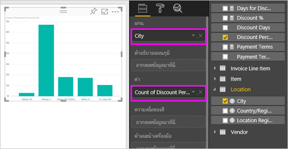

# ส่งออกข้อมูลจากการแสดงภาพ

ถ้าคุณต้องการดูข้อมูลที่ Power BI ใช้ในการสร้างการแสดงภาพ [คุณสามารถแสดงข้อมูลนั้นใน Power BI](service-reports-show-data.md) คุณยังสามารถส่งออกข้อมูลไปยัง Excel ในฐานะไฟล? *.xlsx*หรือ *.csv*ได้ ตัวเลือกในการส่งออกข้อมูลต้องมีสิทธิ์การใช้งานระดับ Pro หรือ Premium และแก้ไขสิทธิ์ในชุดข้อมูลและรายงาน

ดู Will ส่งออกข้อมูลจากหนึ่งในการแสดงภาพในรายงานของเขา บันทึกเป็นไฟล์  *.xlsx* และเปิดใน Excel แล้วทำตามคำแนะนำทีละขั้นตอนด้านล่างวิดีโอเพื่อลองทำด้วยตนเอง

<iframe width="560" height="315" src="https://www.youtube.com/embed/KjheMTGjDXw" frameborder="0" allowfullscreen></iframe>

## ส่งออกข้อมูลจากแดชบอร์ด Power BI

1. เลือกจุดไข่ปลาในมุมบนขวาของการแสดงภาพ

    

1. เลือกที่ไอคอน **ส่งออกข้อมูล**

    

1. Power BI ส่งออกข้อมูลเป็นไฟล์ *.csv* ถ้าคุณได้กรองการแสดงภาพ แอปจะเป็นตัวกรองข้อมูลที่ดาวน์โหลด

1. เบราว์เซอร์ของคุณจะปรากฏขึ้นให้คุณบันทึกไฟล์  เมื่อบันทึกแล้ว เปิดไฟล์ *.csv* ใน Excel

    

## ส่งข้อมูลออกจากรายงาน

ในการทำตามขั้นตอนนี้ เปิด[รายงานตัวอย่างการวิเคราะห์การจัดซื้อ](../sample-procurement.md)ในมุมมองการแก้ไข เพิ่มหน้ารายงานเปล่าใหม่ จากนั้นทำตามขั้นตอนด้านล่างเพื่อเพิ่มการรวมและตัวกรองระดับการแสดงภาพ

1. สร้าง**แผนภูมิคอลัมน์แบบเรียงซ้อน**ใหม่

1. จากช่อง**เขตข้อมูล** เลือกตำแหน่ง**ที่ตั้ง > เมือง**และ**ใบแจ้งหนี้ > เปอร์เซ็นต์ส่วนลด**  คุณอาจจำเป็นต้องย้าย**เปอร์เซ็นต์ส่วนลด**ลงในแอ่ง**ค่า**ดังกล่าว

    

1. เปลี่ยนการรวมสำหรับ**เปอร์เซ็นต์ส่วนลด**จาก**จำนวน**เป็น**ค่าเฉลี่ย** ในแอ่ง**ค่า** เลือกลูกศรทางด้านขวาของ**เปอร์เซ็นต์ส่วนลด** (ที่อาจระบุว่า**จำนวนเปอร์เซ็นต์ส่วนลด**) และเลือก**ค่าเฉลี่ย**ได้

    

1. เพิ่มตัวกรองที่**เมือง**จากนั้นเลือกเมืองทั้งหมด และจากนั้น นำ**แอตแลนต้า**ออก

    

   ในตอนนี้เราก็พร้อมที่จะลองใช้ทั้งสองตัวเลือกสำหรับการส่งออกข้อมูล

1. เลือกจุดไข่ปลาในมุมบนขวาของการแสดงภาพ เลือก**ส่งออกข้อมูล**

    

    ใน Power BI ออนไลน์ ถ้าการแสดงภาพของคุณมีค่ารวม (ตัวอย่างหนึ่งที่ควรเป็นถ้าคุณเปลี่ยน**จำนวนนับ**เป็น*ค่าเฉลี่ย* *ผลรวม*หรือ*ค่าต่ำสุด*) คุณจะได้สองตัวเลือก:

    - **ข้อมูลสรุป**

    - **ข้อมูลเบื้องต้น**

    ใน Power BI Desktop คุณจะมีตัวเลือกสำหรับ**ข้อมูลสรุป**เท่านั้น สำหรับความช่วยเหลือในการทำความเข้าใจค่ารวม ดู[ค่ารวมใน Power BI](../service-aggregates.md)

1. จากเมนู**ส่งออกข้อมูล**ให้เลือก**ข้อมูลสรุป**แล้วเลือกไฟล์ *.xlsx*หรือ *.csv*จากนั้นเลือก**ส่งออก** Power BI ส่งออกข้อมูล

    

    ถ้าคุณใช้ตัวกรองกับการแสดงภาพดังกล่าว ข้อมูลจะถูกส่งออกตามที่ถูกกรอง เมื่อคุณเลือก**ส่งออก** เบราว์เซอร์ของคุณจะปรากฏให้คุณบันทึกไฟล์ดังกล่าว เมื่อบันทึกแล้ว เปิดไฟล์ดังกล่าวใน Excel
    
    ข้อมูลทั้งหมดที่ใช้โดยลำดับชั้นจะถูกส่งออกไม่เพียงแค่ข้อมูลที่ใช้สำหรับระดับการเจาะปัจจุบันสำหรับการแสดงผลด้วยภาพ ตัวอย่างเช่นถ้าการแสดงภาพยังไม่ได้รับการเจาะลงจากระดับบนสุด ข้อมูลที่ส่งออกจะรวมข้อมูลทั้งหมดในลำดับชั้นไม่ใช่เพียงข้อมูลที่ใช้ในการสร้างการแสดงผลด้วยภาพในระดับการเจาะในปัจจุบัน

    **ข้อมูลสรุป**: เลือกตัวเลือกนี้ถ้าคุณต้องการส่งออกข้อมูลสำหรับสิ่งที่คุณเห็นในภาพนั้น  การส่งออกชนิดนี้แสดงเฉพาะข้อมูล (คอลัมน์และหน่วยวัด) ที่คุณเลือกเพื่อสร้างภาพ  ถ้าภาพมีการรวม คุณจะส่งออกข้อมูลรวม ตัวอย่างเช่น ถ้าคุณมีแผนภูมิแท่งแสดง 4 แถบ คุณจะได้รับข้อมูล 4 แถว ข้อมูลสรุปจะพร้อมใช้งานเป็นไฟล์ *.xlsx* และ *.csv*

    ในตัวอย่างนี้ การส่งออก Excel ของเราแสดงผลรวมหนึ่งสำหรับแต่ละเมือง เนื่องจากเราได้กรองรัฐแอตแลนต้าออกไป รัฐดังกล่าวจะไม่รวมอยู่ในผลลัพธ์ แถวแรกของสเปรดชีตของคุณจะแสดงตัวกรองที่ Power BI ใช้เมื่อดึงข้อมูล

    

1. ตอนนี้ลองเลือก**ข้อมูลเบื้องต้น**, *.xlsx*และจากนั้นเลือก**ส่งออก** Power BI ส่งออกข้อมูล 

    > [!NOTE]
    > คุณอาจมีหรือไม่มีตัวเลือกในการส่งออกข้อมูลเบื้องต้นขึ้นอยู่กับการตั้งค่ารายงาน

    ถ้าคุณใช้ตัวกรองกับการแสดงภาพดังกล่าว ข้อมูลจะถูกส่งออกตามที่ถูกกรอง เมื่อคุณเลือก**ส่งออก** เบราว์เซอร์ของคุณจะปรากฏให้คุณบันทึกไฟล์ดังกล่าว เมื่อบันทึกแล้ว เปิดไฟล์ดังกล่าวใน Excel
    
    ข้อมูลทั้งหมดที่ใช้โดยลำดับชั้นจะถูกส่งออกไม่เพียงแค่ข้อมูลที่ใช้สำหรับระดับการเจาะปัจจุบันสำหรับการแสดงผลด้วยภาพ ตัวอย่างเช่นถ้าการแสดงภาพยังไม่ได้รับการเจาะลงจากระดับบนสุด ข้อมูลที่ส่งออกจะรวมข้อมูลทั้งหมดในลำดับชั้นไม่ใช่เพียงข้อมูลที่ใช้ในการสร้างการแสดงผลด้วยภาพในระดับการเจาะในปัจจุบัน

    >[!WARNING]
    >การส่งออกข้อมูลเบื้องต้นอนุญาตให้ผู้ใช้งานดูข้อมูลทั้งหมดโดยละเอียด โดยดูทุกคอลัมน์ในข้อมูล ผู้ดูแลระบบบริการ Power BI สามารถปิดใช้งานคุณลักษณะนี้สำหรับองค์กรของตนได้ ถ้าคุณเป็นเจ้าของชุดข้อมูล คุณสามารถตั้งค่าคอลัมน์ที่คุณเป็นเจ้าของเป็น**ซ่อน** เพื่อให้คอลัมน์เหล่านี้ไม่แสดงในรายการ**เขตข้อมูล**ใน Desktop หรือบริการ Power BI

    **ข้อมูลเบื้องต้น**: เลือกตัวเลือกนี้ถ้าคุณต้องการดูข้อมูลในภาพ***และ***ข้อมูลเพิ่มเติมจากรูปแบบข้อมูล (ดูแผนภูมิด้านล่างสำหรับรายละเอียด) ถ้าภาพของคุณมีการรวมค่า การเลือก*ข้อมูลต้นแบบ*จะลบการรวมค่า เมื่อคุณเลือก**ส่งออก** Power BI จะส่งออกข้อมูลไปยังไฟล์ *.xlsx* และเบราว์เซอร์ของคุณจะปรากฏข้อความให้คุณบันทึกไฟล์ เมื่อบันทึกแล้ว เปิดไฟล์ดังกล่าวใน Excel

    ในตัวอย่างนี้ การส่งออก Excel จะแสดงหนึ่งแถวสำหรับทุกหนึ่งแถวของเมืองในชุดข้อมูลของเรา และเปอร์เซ็นต์ส่วนลดสำหรับรายการเดียวนั้น Power BI ลดรูปแบบโครงสร้างข้อมูล ไม่สามารถรวมข้อมูลได้ แถวแรกของสเปรดชีตของคุณจะแสดงตัวกรองที่ Power BI ใช้เมื่อดึงข้อมูล  

    

## ส่งออกรายละเอียดข้อมูลต้นแบบ

สิ่งที่คุณเห็นเมื่อคุณเลือก**ข้อมูลต้นแบบ**อาจแตกต่างกันได้ การทำความเข้าใจรายละเอียดเหล่านี้อาจต้องการความช่วยเหลือจากผู้ดูแลระบบหรือแผนก IT ของคุณ ใน Power BI Desktop หรือบริการของ Power BI ในมุมมองรายงาน *หน่วยวัด*แสดงในรายการ**เขตข้อมูล**ที่มีไอคอนเครื่องคิดเลข Power BI Desktop สร้างหน่วยวัด บริการ Power BI ไม่สามารถ

| การแสดงภาพประกอบด้วย | สิ่งที่คุณจะเห็นในการส่งออก  |
|---------------- | ---------------------------|
| การรวมค่า | ข้อมูลการรวม*ครั้งแรก*และที่เปิดเผยจากตารางทั้งหมดสำหรับการรวมค่านั้น |
| การรวมค่า | ข้อมูลที่เกี่ยวข้อง - ถ้าภาพใช้ข้อมูลจากตารางข้อมูลอื่นที่ *เกี่ยวข้อง* กับตารางข้อมูลที่ประกอบด้วยการรวมค่า (ตราบใดที่ความสัมพันธนั้นเป็น \*: 1 หรือ 1:1) |
| หน่วยวัด | หน่วยวัดทั้งหมดในภาพ*และ*หน่วยวัดทั้งหมดจากตารางข้อมูลใดๆที่ประกอบด้วยหน่วยวัดที่ใช้ในภาพ |
| หน่วยวัด | ข้อมูลที่เปิดเผยทั้งหมดจากตารางที่ประกอบด้วยหน่วยวัด (ตราบใดที่ความสัมพันธ์นั้นเป็น\*: 1 หรือ 1:1) |
| หน่วยวัด | ข้อมูลทั้งหมดจากตารางทั้งหมดที่เกี่ยวข้องกับตารางที่ประกอบด้วยหน่วยวัดผ่านทางสาย \*: 1 จาก 1:1) |
| หน่วยวัดเท่านั้น | คอลัมน์ที่เปิดเผยทั้งหมดจากตารางที่เกี่ยวข้องทั้งหมด (เมื่อต้องขยายหน่วยวัด) |
| หน่วยวัดเท่านั้น | ข้อมูลสรุปของแถวที่ซ้ำกันของหน่วยวัดรูปแบบข้อมูล |

### ตั้งค่าตัวเลือกการส่งออก

ตัวออกแบบรายงาน BI power ควบคุมชนิดของตัวเลือกการส่งออกข้อมูลที่ลูกค้าของพวกเขาสามารถใช้งานได้ ตัวเลือกคือ:

- อนุญาตให้ผู้ใช้ปลายทางส่งออกข้อมูลสรุปจากบริการ Power BI หรือรายงานเซิฟเวอร์ Power BI

- อนุญาตให้ผู้ใช้ปลายทางส่งออกข้อมูลสรุปและข้อมูลพื้นฐานจากบริการหรือรายงานเซิฟเวอร์

- ไม่อนุญาตให้ผู้ใช้ปลายทางส่งออกข้อมูลใดๆ จากบริการหรือรายงานเซิฟเวอร์

    > [!IMPORTANT]
    > เราขอแนะนำให้ผู้ออกแบบรายงานทบทวนรายงานเก่าและตั้งค่าตัวเลือกการส่งออกด้วยตนเองตามความจำเป็น

การตั้งค่าตัวเลือกเหล่านี้:

1. เริ่มต้นใน Power BI Desktop

1. จากมุมบนซ้าย เลือก**แฟ้ม** > **ตัวเลือกและการตั้งค่า** > **ตัวเลือก**

1. ภายใต้**แฟ้มปัจจุบัน**เลือก**ตั้งค่ารายงาน**

    

1. เลือกรายการจากเมนูส่วนของการ**ส่งออกข้อมูล**

คุณยังสามารถปรับปรุงข้อมูลการตั้งค่านี้ในบริการ Power BI

จำเป็นจะต้องทราบว่าหากการตั้งค่าพอร์ทัลของผู้ดูแลระบบ Power BI ขัดแย้งกับการตั้งค่ารายงานสำหรับส่งออกข้อมูล การตั้งค่าของผู้ดูแลระบบจะแทนที่การตั้งค่าการส่งออกข้อมูล

## ข้อจำกัดและข้อควรพิจารณา
ข้อจำกัดและข้อควรพิจารณาเหล่านี้สามารถนำไปใช้กับ Power BI Desktop และบริการของ Power BI รวมถึง Power BI Pro และ Premium

- หากต้องการส่งออกข้อมูลจากวิชวล คุณจำเป็นต้อง[สร้างสิทธิ์สำหรับชุดข้อมูลพื้นฐาน](https://docs.microsoft.com/power-bi/service-datasets-build-permissions#build-permissions-for-shared-datasets)

-  จำนวนแถวสูงสุดที่สามารถส่งออกจาก**Power BI Desktop**และ**บริการ Power BI** สามารถส่งออกจาก**รายงานโหมดนำเข้า**ไปยังไฟล์ *.csv* คือ 30,000

- จำนวนสูงสุดของแถวที่แอปพลิเคชันสามารถส่งออกจาก**รายงานโหมดนำเข้า**ไปยังไฟล์ *.xlsx* คือ 150,000

- ส่งออกโดยใช้*ข้อมูลเบื้องต้น*จะไม่สามารถทำงานถ้าหาก:

  - แหล่งข้อมูลเป็นการเชื่อมต่อแบบออนไลน์ของ Analysis Services

  - เวอร์ชันที่เก่ากว่าปี 2016

  - ตารางในแบบจำลองไม่มีคีย์เฉพาะ
    
  -  ถ้าผู้ดูแลระบบหรือผู้ออกแบบรายงานได้ปิดใช้งานคุณลักษณะนี้

- การส่งออกโดยใช้*ข้อมูลเบื้องต้น*จะไม่สามารถทำได้ถ้าคุณเปิดตัวเลือก*แสดงรายการที่ไม่มีข้อมูล*สำหรับการแสดงภาพ Power BI ที่ถูกกำลังส่งออก

- เมื่อใช้ DirectQuery จำนวนข้อมูลที่ Power BI สามารถส่งออกได้สูงสุดคือ ข้อมูลที่ไม่บีบอัด 16 MB ผลลัพธ์ไม่เป็นไปตามที่คาดหวังอาจเป็นเพราะคุณส่งออกข้อมูลน้อยกว่าจำนวนแถวสูงสุด ซึ่งเป็นไปได้ที่จะเป็นเช่นนั้นหาก:

    - มีคอลัมน์เป็นจำนวนมาก

    - มีข้อมูลที่ยากต่อการบีบอัด

    - ปัจจัยอื่น ๆ ก็มีส่วนในการเพิ่มขนาดไฟล์และลดจำนวนแถวที่ Power BI สามารถส่งออก ได้

- ถ้าการแสดงภาพใช้ข้อมูลจากตารางข้อมูลมากกว่าหนึ่งตาราง และไม่มีความสัมพันธ์ระหว่างตารางเหล่านั้นในรูปแบบข้อมูล Power BI จะทำได้เพียงส่งออกข้อมูลสำหรับตารางแรก

- วิชลแบบกำหนดเองและวิชวล R ยังไม่สนับสนุนในขณะนี้

- ใน Power BI คุณสามารถตั้งชื่อใหม่ให้กับเขตข้อมูล (คอลัมน์) โดยการดับเบิลคลิกที่เขตข้อมูล แล้วพิมพ์ชื่อใหม่ Power BI จะอ้างอิงข้อมูลชื่อใหม่เป็นในฐานะ*นามแฝง* อาจเป็นไปได้ว่า รายงาน Power BI สุดท้ายแล้วมีชื่อเขตข้อมูลที่ซ้ำกัน แต่ Excel ไม่อนุญาตให้มีชื่อที่ซ้ำกัน ดังนั้น เมื่อPower BI ส่งออกข้อมูลไปยัง Excel นามแฝงของเขตข้อมูลถูกแปลงกลับไปเป็นชื่อเขตข้อมูล (คอลัมน์) เดิม  

- ถ้ามีอักขระ Unicode ในไฟล์ *.csv*ข้อความใน Excel อาจไม่แสดงอย่างเหมาะสม ตัวอย่างของอักขระ Unicode คือสัญลักษณ์สกุลเงินและคำในภาษาต่างประเทศ คุณสามารถเปิดไฟล์ใน Notepad และ Unicode ซึ่งจะแสดงผลอย่างถูกต้อง การแก้ไขปัญหาชั่วคราวคือการ นำเข้าไฟล์ *.csv* ถ้าคุณต้องการเปิดไฟล์ใน Excel การนำเข้าไฟล์ลงใน Excel:

  1. เปิด Excel

  1. ไปที่แท็บ**ข้อมูล**
  
  1. เลือก**รับข้อมูลภายนอก** > **จากข้อความ**
  
  1. ไปยังโฟลเดอร์เฉพาะที่จัดเก็บไฟล์และเลือกไฟล์ *.csv*

- ผู้ดูแลระบบ Power BI สามารถปิดการส่งออกข้อมูลได้

มีคำถามเพิ่มเติมหรือไม่? [ลองถามชุมชน Power BI](http://community.powerbi.com/)
